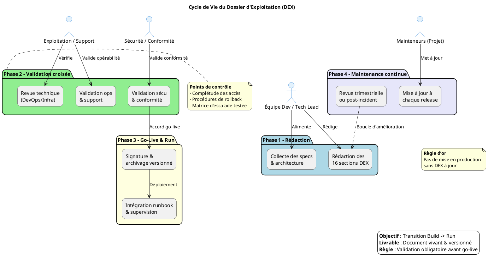

# 📄 DEX – admin_ep (Administration des établissements publics)

> **Document établi sur les principes de la transition Build → Run et des bonnes pratiques ITIL/DevOps pour l'exploitation applicative**  

[TOC]

---

## 1️⃣ Introduction et objectifs 🎯

**Objet** : Document de référence garantissant la continuité, la maintenabilité et la sécurisation de l'exploitation de l'application **admin_ep** en production.  

**Objectifs opérationnels**  

| ✅ | Objectif |
|---|----------|
| ✅ | Assurer la continuité de service |
| ✅ | Documenter les procédures de gestion courante |
| ✅ | Faciliter le support et la résolution d’incidents |
| ✅ | Encadrer les responsabilités (Dev / Ops / Support) |
| ✅ | Assurer la conformité et la maîtrise des risques |
| ✅ | Accompagner la phase de transition **Build → Run** |

↩ Retour au **[Sommaire](#toc)**  

---  

## 2️⃣ Contexte d'usage et périmètre 📦

| Élément | Valeur |
|---|---|
| **Nom du livrable** | DEX – admin_ep |
| **Nature** | Document de référence |
| **Activité** | Transition **Build → Run / Exploitation** |
| **Quand l’utiliser** | - Avant chaque mise en production (obligatoire)   - Support de formation des équipes d’exploitation   - Audits de conformité, PRA/PCA, revues de sécurité |
| **Cycle de vie** | Document vivant : mise à jour à chaque évolution fonctionnelle, technique ou d’infrastructure |

↩ Retour au **[Sommaire](#toc)**  

---  

## 3️⃣ Pré‑requis et jalons ✅

- [ ] Architecture technique validée et schémas à jour (cf. section 5)  
- [ ] Environnement de production stabilisé (accès, DNS, certificats)  
- [ ] Politiques définies : sauvegarde, supervision, sécurité, SLA (voir section 9)  
- [ ] Contacts clés identifiés (voir tableau § 6)  
- [ ] Outillage prêt : monitoring, logging, ordonnanceur, gestion des secrets  

> ⏱ **Jalon critique** – Le DEX doit être **validé et signé** *avant* le go‑live. Aucun déploiement ne doit intervenir sans un DEX approuvé.  

↩ Retour au **[Sommaire](#toc)**  

---  

## 4️⃣ Gouvernance et rôles 🛠

| Rôle | Profil type | Responsabilité |
|------|-------------|----------------|
| **Rédacteur principal** | Tech Lead / DevOps / Référent Prod | Rédaction, structuration, intégration des spécifications techniques |
| **Validateur Exploitation** | Chef d’exploitation / Responsable support | Vérification de l’opérabilité et de la complétude |
| **Validateur Sécurité/Conformité** | RSSI / DPO / Auditeur interne | Validation des procédures de sécurité, backup, conformité |
| **Mainteneur** | Équipe projet / PO technique | Mise à jour continue à chaque release ou changement d’infra |

↩ Retour au **[Sommaire](#toc)**  

---  

## 5️⃣ Structure détaillée du DEX (16 sections standards) 📚

| N° | Section principale | Contenu attendu (exemples) |
|---:|-------------------|----------------------------|
| 1 | **Généralités** | Objet, domaine d’application, audience cible, versionning du document |
| 2 | **Documents applicables et de référence** | Normes internes, chartes, documents d’architecture, politiques sécurité |
| 3 | **Terminologie** | Glossaire technique/métier, abréviations, acronymes |
| 4 | **Spécificités** | Fonctionnalités critiques, SLA/SLO, contacts clés, matrice d’escalade |
| 5 | **Architecture** | Schémas logiques/physiques, flux de données, infra prod, PRA/PCA |
| 6 | **Serveurs** | Accès (SSH/RDP/Console), OS, versions, CPU/RAM/Stockage, noms DNS/IP |
| 7 | **Application** | Composants logiciels, versions, paramètres, procédure de déploiement |
| 8 | **Supervision et métrologie** | Outils de monitoring, seuils d’alerte, dashboards, métriques clés |
| 9 | **Sauvegarde** | Politique (fréquence, rétention, type), localisation, procédure de restauration |
| 10 | **Stockage** | Inventaire des volumes, quotas, chemins d’accès, gestion des logs |
| 11 | **Inventaire des bases** | Moteurs BDD, versions, schémas, utilisateurs, maintenance, archivage |
| 12 | **Flux inter‑applicatifs** | Matrice des échanges, protocoles, ports, authentification, dépendances |
| 13 | **Plan de production** | Ordonnancement, tâches planifiées (cron/batch), fenêtres de maintenance |
| 14 | **Sécurisation des images** | Scan de vulnérabilités, hardening, gestion des secrets, patching |
| 15 | **Opérations courantes** | Check‑lists quotidiennes, gestion des logs, erreurs connues, diagnostic |
| 16 | **Opérations récurrentes** | Gestion des comptes, rotation des certificats, nettoyages, audits périodiques |

> **Note d’adaptation** – La trame est normative mais flexible : supprimez, fusionnez ou détaillez les sections selon le contexte (ex. : *server‑less*, *micro‑services*, etc.).  

↩ Retour au **[Sommaire](#toc)**  

---  

## 6️⃣ Diagramme PlantUML du cycle de vie DEX 🖥️

↩ Retour au **[Sommaire](#toc)**  

---  

## 7️⃣ Conseils de rédaction et maintenance 📏

| Bonne pratique | À éviter |
|---|---|
| Utiliser un dépôt versionné (Git, Wiki) avec historique | Stocker le DEX en pièce jointe email ou sur un partage non versionné |
| Rédiger en langage clair, orienté action et procédure | Rédiger des descriptions vagues ou purement théoriques |
| Inclure des captures d’écran, chemins exacts et commandes | Laisser des placeholders `[À COMPLÉTER]` en production |
| Prévoir une revue systématique à chaque release majeure | Considérer le DEX comme un document “jetable” post‑lancement |
| Lier le DEX aux runbooks, tickets d’incident et procédures PRA | Isoler le DEX des outils de supervision et de ticketing |

↩ Retour au **[Sommaire](#toc)**  

---  

## 8️⃣ Adaptations contextuelles ⚙️

| Contexte | Adaptation recommandée |
|---|---|
| **Applications Cloud / Serverless** | Remplacer les sections *Serveurs* par *Services managés, IAM, Config as Code, Limits/Quotas* |
| **Secteur réglementé (Santé, Finance, Public)** | Renforcer les sections Sécurité, Traçabilité, Archivage légal, Conformité RGAA/ANSSI |
| **Legacy / Monolithe** | Insister sur la dépendance OS, les patches, la compatibilité, les procédures de reprise manuelle |
| **Micro‑services / Kubernetes** | Remplacer *Inventaire BDD/Serveurs* par *Clusters, Namespaces, Helm/Manifests, Observabilité (Prometheus/Grafana/Loki)* |

↩ Retour au **[Sommaire](#toc)**  

---  

## 9️⃣ Livrables et intégration 📦

| Livrable | Description |
|---|---|
| **DEX versionné** | Fichier `.md` (ou export `.pdf`) stocké dans le dépôt Git du projet |
| **Checklist de validation** | Document signé par les acteurs de la section 4 |
| **Matrice de traçabilité** | DEX ↔ Architecture ↔ Runbooks ↔ Tickets support |
| **Intégration CI/CD** | Validation automatisée de sections critiques (ex. : présence de procédures de backup) |
| **Liens DEX** | Intégration dans les pages d’accueil de supervision (Grafana, Datadog, …) |
| **Génération IA‑C** | Parties du DEX (inventaire infra, variables) générées depuis le code (IaC – Terraform, Ansible) |

↩ Retour au **[Sommaire](#toc)**  

---  

## 🔟 Glossaire / Mini‑glossaire 📖

| Acronyme | Signification |
|---|---|
| **SLA** | Service Level Agreement – engagement de niveau de service |
| **SLO** | Service Level Objective – objectif de performance mesurable |
| **PRA** | Plan de Reprise d’Activité |
| **PCA** | Plan de Continuité d’Activité |
| **CI/CD** | Continuous Integration / Continuous Deployment |
| **IaC** | Infrastructure as Code |
| **DEX** | Dossier d’Exploitation |
| **ITIL** | Information Technology Infrastructure Library |
| **ESB** | Enterprise Service Bus |
| **JDBC** | Java Database Connectivity |
| **TLS** | Transport Layer Security |
| **JWT** | JSON Web Token |

---  

## 📇 Contacts clés (extraits du contexte) 📞

| Rôle | Nom / Prénom | Fonction | Service | Courriel |
|---|---|---|---|---|
| **Chef de produit** | Christian Arbogast | Chef de produit | SG/DNUM/PNM/DPNM3/BPN | Christian.Arbogast@developpement-durable.gouv.fr |
| **Directrice de produit** | Céline Gilliard | Directrice de produit | SG/DNUM/PNM/DPNM3/BPN | celine.gilliard@developpement-durable.gouv.fr |
| **Responsable exploitation** | — | — | — | assistance-adminep@developpement-durable.gouv.fr |
| **Contact technique** | — | — | — | — |

> **À personnaliser** : remplacez les champs `[…]` par les informations spécifiques (ex. : adresses IP, ports, comptes de service, etc.).  

↩ Retour au **[Sommaire](#toc)**  

---  

## 📎 Annexes (optionnelles)

- Schémas d’architecture (UML, Visio, etc.)  
- Extraits de scripts de déploiement (Ansible, Terraform)  
- Modèles de tickets d’incident / demandes de changement  

---  

*Fin du DEX – **admin_ep** – version **1.0.0** – Dernière mise à jour le **[date du jour]**.*  