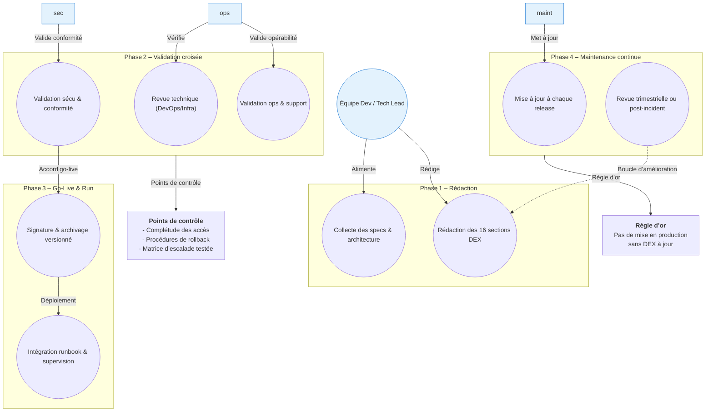

# 📄 Dossier d’Exploitation (DEX) – **admin_ep**  
*Document établi sur les principes de la transition **Build → Run** et des bonnes pratiques ITIL/DevOps pour l’exploitation applicative*  

[TOC]

---  

## 1️⃣ Introduction et objectifs  

> Document de référence garantissant la continuité, la maintenabilité et la sécurisation de l’exploitation d’une application en production.  

| ✅ Objectif | 📖 Description |
|---|---|
| **Assurer la continuité de service** | Mise en place de procédures de reprise, sauvegarde et supervision. |
| **Documenter les procédures de gestion courante** | Runbooks, check‑lists quotidiennes, hebdomadaires et mensuelles. |
| **Faciliter le support et la résolution d’incidents** | Matrice d’escalade, contacts clés, procédures de diagnostic. |
| **Encadrer les responsabilités (Dev / Ops / Support)** | Rôles clairement définis (Rédacteur, Validateur, Mainteneur). |
| **Assurer la conformité et la maîtrise des risques** | Politique de sauvegarde, gestion des accès, conformité RGPD/DICT. |
| **Accompagner la phase de transition `Build → Run`** | Validation du DEX avant tout go‑live. |

---  

## 2️⃣ Contexte d’usage et périmètre  

| Champ | Valeur |
|---|---|
| **Nom du livrable** | DEX – admin_ep |
| **Nature** | Document de référence 📘 |
| **Activité** | Transition **Build → Run / Exploitation** |
| **Quand l’utiliser** | • Avant la mise en production (validation obligatoire) <br>• Formation des équipes d’exploitation <br>• Audits de conformité (PRA/PCA, sécurité) |
| **Cycle de vie** | Document vivant – mise à jour à chaque évolution fonctionnelle, technique ou d’infrastructure. |

---  

## 3️⃣ Pré‑requis et jalons  

- [ ] Architecture technique validée & schémas à jour (voir §5)  
- [ ] Environnement de production stabilisé (accès, DNS, certificats)  
- [ ] Politiques définies : sauvegarde, supervision, sécurité, SLA (voir §4)  
- [ ] Contacts clés identifiés (métiers & techniques) – §6.2  
- [ ] Outillage prêt : monitoring (Grafana/Prometheus), logging (ELK), ordonnanceur, gestion des secrets (Vault)  

> ⏱ **Jalon critique** : Le DEX doit être **validé et signé** bien avant le go‑live. Aucun déploiement ne doit intervenir sans DEX approuvé.  

---  

## 4️⃣ Gouvernance et rôles  

| Rôle | Profil type | Responsabilité |
|------|------------|----------------|
| **Rédacteur principal** | Tech Lead / DevOps / Référent Prod | Rédaction, structuration, intégration des specs techniques |
| **Validateur Exploitation** | Chef d’exploitation / Responsable support | Vérification de l’opérabilité et de la complétude |
| **Validateur Sécurité/Conformité** | RSSI / DPO / Auditeur interne | Validation des procédures de sécurité, backup, conformité |
| **Mainteneur** | Équipe projet / PO technique | Mise à jour continue à chaque release ou changement d’infra |

---  

## 5️⃣ Structure détaillée du DEX (16 sections standards)  

| N° | Section | Contenu attendu (exemples) |
|---:|---|---|
| 1 | **Généralités** | Objet, audience, version du document, historique des révisions |
| 2 | **Documents applicables et de référence** | Charte ITIL, politique de sauvegarde, normes internes, liens GitLab |
| 3 | **Terminologie** | Glossaire (ex. : “Charge”, “Mandat”, “College”, “TUTELLE”) |
| 4 | **Spécificités** | SLA : disponibilité 99,9 % (exemple), contacts clés (Christian Arbogast, Céline Gilliard), matrice d’escalade |
| 5 | **Architecture** | Schéma logique : **PostgreSQL** (baseadmin) ↔ **Java Webapp** (Tomcat 9) ↔ **Front‑end** (HTML/JS) – voir diagramme §5.1 |
| 6 | **Serveurs** | Accès (SSH), OS (Linux RHEL 8), CPU/RAM, DNS, IP, ports (8080/Tomcat, 5432/PostgreSQL) |
| 7 | **Application** | Artefacts (WAR), version : 1.3.3 (prod), paramètres de déploiement, procédure `mvn clean package` + assembly |
| 8 | **Supervision et métrologie** | Outils (Grafana, Prometheus, ELK), seuils d’alerte (CPU > 80 %, latence > 2 s), dashboards |
| 9 | **Sauvegarde** | *Full* quotidien + *incremental* chaque 6 h, rétention 30 j, stockage sur NAS LDF, procédure `pg_dump` |
| 10 | **Stockage** | Volumes Docker / LVM, quotas, chemins (`/opt/admin_ep/data`) |
| 11 | **Inventaire des bases** | PostgreSQL 9.6.11 → 15 (migration prévue), schémas (`integration`), utilisateurs (`baseadmin`) |
| 12 | **Flux inter‑applicatifs** | API internes (REST) vers **JORF** (RSS) – ingestion quotidienne, authentification via **Cerbère** |
| 13 | **Plan de production** | Jobs Cron (nightly import JORF, backup), fenêtres de maintenance (Sundays 02:00–04:00) |
| 14 | **Sécurisation des images** | Scan : Trivy, hardening OS, rotation des secrets via Vault, patching mensuel |
| 15 | **Opérations courantes** | Check‑list jour : health‑check URL, logs, espace disque; procédure de redémarrage Tomcat |
| 16 | **Opérations récurrentes** | Rotation des certificats (90 j), nettoyage logs (> 30 j), audit de conformité trimestriel |

---  

### 5.1 Diagramme d’architecture (Mermaid)  

```mermaid
graph LR
    style db fill:#E3F2FD,stroke:#1976D2,stroke-width_2px;
    style app fill:#E3F2FD,stroke:#1976D2,stroke-width_2px;
    style web fill:#E3F2FD,stroke:#1976D2,stroke-width_2px;
    style monitor fill:#E3F2FD,stroke:#1976D2,stroke-width_2px;
    subgraph "Infrastructure"
    db(("PostgreSQL<br/>baseadmin<br/>v9.6.11‑15"))
    app(("Java WebApp<br/>Tomcat 9.0.8<br/>v1.3.3"))
    web(("Front‑end<br/>HTML/JS"))
    monitor(("Monitoring<br/>Grafana/Prometheus"))
    end
    web -->|HTTP/HTTPS| app;
    app -->|JDBC| db;
    app -->|REST API| monitor;
    db -->|Backup (pg_dump)| backup["NAS LDF<br/>30 jours"]
    app -->|Import JORF<br/>RSS| jorf["JORF (RSS)"]
    app -->|Auth Cerbère| cerb["Cerbère IAM"]
```

---  

## 6️⃣ Informations complémentaires  

### 6.1 Contacts clés  

| Rôle | Nom | Fonction | E‑mail | Téléphone |
|---|---|---|---|---|
| **Chef de produit** | Christian Arbogast | SG/DNUM/PNM/DPNM3/BPN | Christian.Arbogast@developpement-durable.gouv.fr | – |
| **Directrice de produit** | Céline Gilliard | SG/DNUM/PNM/DPNM3/BPN | celine.gilliard@developpement-durable.gouv.fr | – |
| **Assistance** | – | mail assistance | assistance-adminep@developpement-durable.gouv.fr | – |

### 6.2 Environnements & URLs  

| Environnement | URL | Version |
|---|---|---|
| **Production** | https://adminep.e2.rie.gouv.fr/ | 1.3.3 (12/2021) |
| **Pré‑production** | https://adminep.preprod.e2.rie.gouv.fr/ | 1.3.3 (12/2021) |
| **Supervision PSIN** | http://psin.supervision.e2.rie.gouv.fr/portails/MonApplication.php?application=ADMINEP | – |

### 6.3 Stack technique  

| Couche | Technologie | Version |
|---|---|---|
| **Application** | Java (Servlet) | 8 |
| **Serveur d’applications** | Tomcat | 9.0.8 |
| **Base de données** | PostgreSQL | 9.6.11 → 15 (migration prévue) |
| **Web** | HTML + CSS + JS (Bootstrap 4) | – |
| **Gestion des secrets** | HashiCorp Vault (ou équivalent) | – |
| **CI/CD** | GitLab CI | – |
| **Monitoring** | Grafana + Prometheus, ELK | – |

### 6.4 SLA / SLO (exemple)  

| KPI | Objectif | Mesure |
|---|---|---|
| Disponibilité | **99,9 %** (max 8 h d’arrêt par an) | Monitoring uptime |
| Temps de réponse moyen | ≤ 2 s (pages) | Prometheus `http_request_duration_seconds` |
| Temps de restauration (RTO) | ≤ 4 h | Procédure de reprise (see §9) |
| Perte de données maximale (RPO) | ≤ 15 min | Sauvegarde incrémentale toutes les 6 h |

---  

## 7️⃣ Conseils de rédaction et maintenance  

| Bonne pratique | À éviter |
|---|---|
| Utiliser un dépôt **Git** versionné (branch `dex/main`) | Stocker le DEX en pièce‑jointe e‑mail ou sur un partage non versionné |
| Rédiger en langage clair, orienté action (ex. : *« Vérifier l’espace disque : `df -h /opt/admin_ep` »*) | Laisser des placeholders `[À COMPLÉTER]` en production |
| Inclure captures d’écran, chemins exacts et commandes | Omettre les chemins ou les ports d’écoute |
| Prévoir une revue systématique à chaque release majeure | Considérer le DEX comme « jetable » après le go‑live |
| Lier le DEX aux **runbooks**, tickets d’incident et procédures PRA | Isoler le DEX des outils de supervision et de ticketing |

---  

## 8️⃣ Adaptations contextuelles  

| Contexte | Adaptation recommandée |
|---|---|
| **Applications Cloud / Serverless** | Remplacer les sections *Serveurs* par *Services managés (RDS, ECS, etc.)* |
| **Secteur réglementé (Santé, Finance, Public)** | Renforcer les sections **Sécurité**, **Traçabilité**, **Archivage légal** (RGAA, ANSSI) |
| **Legacy / Monolithe** | Insister sur les dépendances OS, les patches, la compatibilité, les procédures de reprise manuelle |
| **Micro‑services / Kubernetes** | Remplacer *Inventaire des bases/serveurs* par *Clusters, Namespaces, Helm charts, Observabilité (Prometheus, Loki)* |

---  

## 9️⃣ Livrables et intégration  

| Livrable | Description | Format |
|---|---|---|
| **DEX versionné** | Document complet (MD) avec historique Git | `.md` |
| **Checklist de validation** | Signatures du rédacteur, du valideur ops & sécurité | Tableur/MD |
| **Matrice de traçabilité** | DEX ↔ Architecture ↔ Runbooks ↔ Tickets | `.xlsx` ou MD |
| **Lien DEX → CI/CD** | Validation automatisée (ex. : `lint-md` dans pipeline) | GitLab CI job |
| **Intégration dans les dashboards** | Liens DEX dans Grafana/ServiceNow | URL |

---  

## 🔄 10️⃣ Diagramme Mermaid du cycle de vie du DEX  



---  

## 📚 Mini‑glossaire  

| Acronyme | Signification |
|---|---|
| **SLA** | Service Level Agreement – engagement de disponibilité |
| **SLO** | Service Level Objective – objectif de performance |
| **PRA** | Plan de Reprise d’Activité |
| **PCA** | Plan de Continuité d’Activité |
| **CI/CD** | Continuous Integration / Continuous Deployment |
| **IAM** | Identity & Access Management (Cerbère) |
| **DEX** | Dossier d’Exploitation |
| **JDBC** | Java Database Connectivity |
| **REST** | REpresentational State Transfer (API) |
| **RTO** | Recovery Time Objective |
| **RPO** | Recovery Point Objective |

---  

### 📌 Dernière mise à jour  

*Version 1.0 – 27 avril 2026* – rédigé par **Tech Lead – admin_ep**.  

---  

*Fin du DEX – prêt à être versionné et intégré au pipeline de mise en production.*