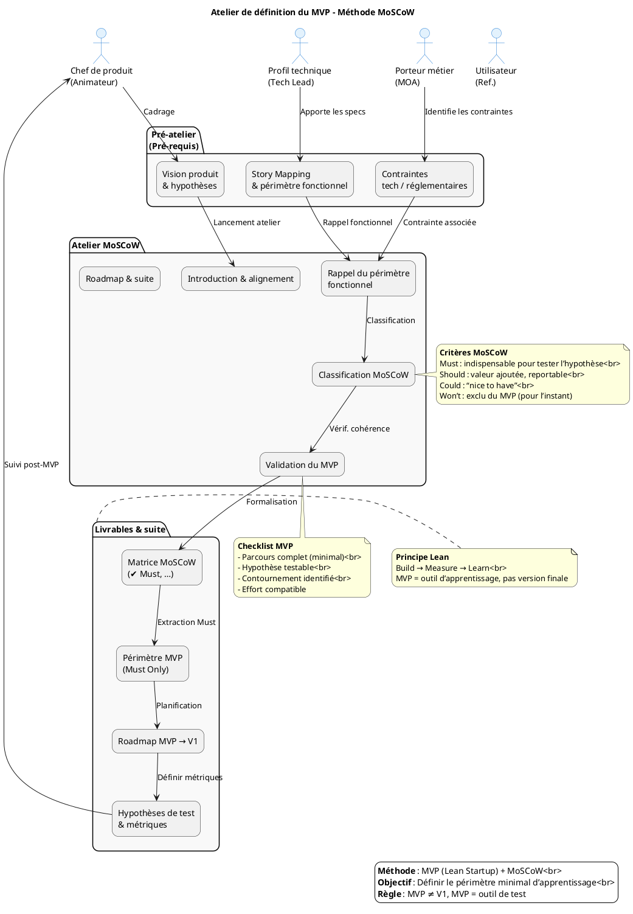

# 📦 Guide d’atelier : **Définir le MVP** – Méthode MoSCoW  
*Document établi à partir des principes du **MVP (Lean Startup)** et de la **méthode de priorisation MoSCoW**.*

---

[TOC]

---  

## 1️⃣ Introduction et objectifs  

> **Objectif global** : *Définir collectivement le périmètre du Produit Minimum Viable (MVP) afin de tester les hypothèses produit avec un effort maîtrisé.*  

**Méthodologie** : MVP (Lean Startup) + priorisation **MoSCoW** (Must / Should / Could / Won’t).  

### 🎯 Objectifs opérationnels  

| ✅ | Description |
|---|-------------|
| **Clarifier la mission du MVP** | Qu’apprend‑on ? Quelle hypothèse valide‑t‑on ? |
| **Prioriser les fonctionnalités** | Identifier les **Must Have** vs. les éléments reportables. |
| **Aligner les équipes** | Produit, métier, technique : un périmètre réaliste et partagé. |
| **Éviter l’effet tunnel** | Livrer vite, mesurer, itérer. |
| **Poser les bases de la roadmap** | MVP → V1 → itérations suivantes. |

> ⚠️ **Rappel critique** : Un MVP n’est **pas** une V1 allégée. C’est le plus petit incrément permettant d’apprendre ; il peut se limiter à un seul parcours utilisateur avec des contournements (ex. : saisie manuelle, données factices) acceptés.

---  

## 2️⃣ Contexte d’usage et positionnement  

| 📄 | Valeur |
|---|-------|
| **Nom du produit** | `admin_ep` *(Administration des établissements publics)* |
| **Domaine métier** | Moyens généraux – Gestion des mandats des établissements publics du MTES‑MCT. |
| **Personas / Utilisateurs clés** | - **SPES** (Services de la politique de l’État)   - **DG de tutelle**   - **Opérateurs** (saisie, suivi) |
| **Hypothèses à tester** | 1️⃣ L’alimentation automatique depuis le JORF fournit des données à jour. 2️⃣ La saisie manuelle d’établissements et de mandats est fiable et rapide. 3️⃣ Le système de notification d’échéance de mandat déclenche les mails attendus. 4️⃣ Le moteur de recherche retrouve correctement établissements/personnes. 5️⃣ L’authentification Cerbère garantit le bon niveau d’accès. |
| **Contraintes techniques / réglementaires** | - **Tomcat 10** & **PostgreSQL 15** (migration à venir).  - Java 8, serveur ACAI.  - **DI‑CT** validé (07/09/2018).  - Sécurité HTTPS obligatoire.  - Respect des exigences de traçabilité (archivage des mandats). |
| **Livrable d’entrée** | Story Map existant (ex. : parcours « Créer/Modifier un mandat ») – fourni dans le fichier `admin_ep.code.summarized.md`. |

---  

## 3️⃣ Pré‑requis indispensables  

| ✅ | Élément | Comment le vérifier / créer |
|---|----------|---------------------------|
| **Vision produit** | Pitch, objectifs métier, métriques de succès (ex. : taux de remplissage, temps moyen de recherche). | À récupérer dans `admin_ep.wiki.md`. |
| **Hypothèses à tester** | Liste claire (voir §2). | Co‑construire 5 min en début d’atelier si besoin. |
| **Story Mapping** | Parcours complet + épics/fonctionnalités. | Disponible dans le contexte (fichier résumé). |
| **Personas & retours utilisateurs** | Verbatims, interviews, questionnaires. | À préparer ou à extraire des tickets JIRA. |
| **Contraintes identifiées** | Techniques (Tomcat, PostgreSQL), règlementaires (DI‑CT), délais, budget. | Récupérer dans `admin_ep.wikisi.md`. |
| **Définition des métriques MVP** | Exemple : “% de mandats importés automatiquement”, “Temps moyen de création d’un mandat”. | À valider avec le PO. |

---  

## 4️⃣ Parties prenantes et rôles  

| Rôle | Profil type | Responsabilité pendant l’atelier |
|------|-------------|---------------------------------|
| **Animateur** | Chef de produit / PNM | Cadre, facilite, garde le cap “apprentissage”. |
| **Profil technique** | Tech Lead / Architecte | Évalue faisabilité, effort, dépendances techniques. |
| **Porteur métier** | MOA / Responsable métier | Valide la pertinence fonctionnelle et la valeur utilisateur. |
| **Designer UX/UI** *(optionnel)* | Designer produit | Propose des alternatives légères, valide l’expérience minimale. |
| **Utilisateur référent** *(optionnel)* | Représentant SPES ou opérateur | Apporte le regard “usage réel”, challenge les priorités. |

> ☝️ *Un même participant peut cumuler plusieurs rôles selon la disponibilité.*

---  

## 5️⃣ Logistique de l’atelier  

| 📦 | Détail |
|---|--------|
| **Durée** | 2 h 30 – 4 h (prévoir une pause à 1 h 30 si > 3 h). |
| **Matériel physique** | Tableau blanc, post‑its 4 couleurs (Must / Should / Could / Won’t), marqueurs, ruban de masquage. |
| **Outils digitaux** | Mural / FigJam / Klaxoon avec template MoSCoW pré‑préparé. |
| **Livrable de sortie** | - Périmètre MVP validé   - Matrice MoSCoW   - Roadmap initiale (MVP → V1)   - Hypothèses de test + métriques associés. |
| **Salle** | Disposition en U ou “fish‑bowl” pour favoriser les échanges. |
| **Facilitateur(s)** | 1 animateur principal + 1 assistant (prise de notes). |

---  

## 6️⃣ Déroulé détaillé de l’atelier  

### 🎬 Étape 1 — Introduction & alignement *(15 min)*  

1. **Rappel du but du MVP** – phrase d’accroche :  
   > *« Avec ce MVP, nous voulons vérifier que **l’import automatique depuis le JORF** fonctionne en observant le **taux d’erreur < 5 %** auprès du **persona Opérateur**. »*  
2. **Présentation de la méthode MoSCoW** (tableau rappel, voir §6.2).  
3. **Tour de table rapide** – chaque participant indique son principal enjeu.  

### 📋 Étape 2 — Rappel du périmètre fonctionnel *(30 min)*  

- **Affichage du Story Map** (ou liste épics).  
- Pour chaque fonctionnalité :  
  - **Besoin utilisateur** (verbe d’action).  
  - **Hypothèse produit** qu’elle permet de tester.  
  - **Contraintes** (technique, règlementaire).  
- **Déduplication** : regrouper les doublons, éliminer les hors‑scope.  

### 🗂️ Étape 3 — Classification MoSCoW *(60‑90 min)*  

| 📌 Méthode | Description |
|---|-------------|
| **Présentation** | Parcourir chaque fonctionnalité/epic. |
| **Discussion guidée** | Questions clés :  • « Le MVP peut‑il fonctionner sans cette fonctionnalité ? »  • « Quel impact sur l’apprentissage si on la retire ? »  • « Quel effort (temps, complexité) ? »  • « Existe‑t‑il un contournement simple ? » |
| **Vote/Dot‑Voting** | Chaque participant dispose de 3 votes à répartir sur les candidats “Must”. |
| **Placement** | Déposer la carte post‑it dans la colonne MoSCoW correspondante. |

> 💡 **Règle d’or** : limiter les **Must** à l’essentiel absolu ; si tout est “Must”, rien n’est priorisé.  

### ✅ Étape 4 — Validation du périmètre MVP *(30 min)*  

| ✅ Checklist de validation |
|---|
| Le périmètre “Must” permet‑il de tester **au moins une hypothèse** clairement définie ? |
| Un utilisateur peut‑il accomplir un **parcours complet** (ex. : création d’un mandat + notification) ? |
| Les **contournements acceptables** (saisie manuelle, jeu de données factice) sont‑ils identifiés ? |
| L’**effort estimé** (story points, jours) est‑il compatible avec le **délai cible** du MVP (ex. : 4 semaines) ? |
| Les **métriques de succès** (taux d’import, délai de notification) sont‑elles définies ? |

- **Si périmètre trop large** → re‑discuter les “Must”, identifier des reports.  
- **Si trop léger** → vérifier qu’aucune hypothèse critique n’a été oubliée.  

### 🗺️ Étape 5 — Roadmap & prochaines étapes *(15‑30 min)*  

1. **Documenter les décisions** : tableau final MoSCoW + justifications.  
2. **Ébaucher la roadmap** :  • **MVP** (date cible, métriques)  • **V1** (features “Should”)  • **Backlog** (features “Could” + “Won’t”).  
3. **Définir le suivi** :  • Propriétaire du test utilisateur (ex. : PO)  • Méthode de collecte (logs, questionnaires)  • Date de revue post‑MVP (débrief, décision pivot/persévérer).  

> 📸 **Action immédiate** : partager la matrice MoSCoW et la roadmap brouillon **dans les 24 h** pour validation écrite.  

---  

## 7️⃣ Conseils de facilitation  

| ✅ Bonnes pratiques | ❌ À éviter |
|--------------------|------------|
| Ancrer chaque décision dans une **hypothèse à tester**. | Prioriser par préférence personnelle ou “on a toujours fait comme ça”. |
| Challenger systématiquement les **Must** : *« Et si on l’enlevait ? »* | Accepter un MVP trop large par peur de décevoir. |
| Proposer des **contournements légers** (manuel, data de test) pour réduire le scope. | Confondre “faisable techniquement” et “nécessaire pour l’apprentissage”. |
| Faire participer activement les profils **métier & utilisateur**. | Laisser un seul profil (technique ou métier) dominer les arbitrages. |
| **Documenter** les “Won’t” avec leurs raisons (évite les re‑demandes). | Oublier de prévoir la revue post‑MVP et les critères de succès. |

---  

## 8️⃣ Alternative : MVP par scénario utilisateur  

Lorsque la méthode MoSCoW a du mal à réduire le scope (tendance à tout mettre dans le MVP), privilégier un **scénario complet** :

| Critère de sélection du scénario MVP | Exemple concret (admin_ep) |
|--------------------------------------|----------------------------|
| **Parcours complet mais borné** | *Créer un mandat → déclencher notification* (sans import automatique). |
| **Forte innovation à tester** | *Import automatique depuis le JORF* (sans interface front). |
| **Simplicité de mise en œuvre** | *Recherche d’un établissement* (avec jeu de données de test). |
| **Valeur d’apprentissage maximale** | *Tester le moteur de recherche* (impact sur taux de satisfaction). |

> ✏️ **Formulation du scénario MVP** :  
> *« En tant que **Opérateur**, je veux **créer un mandat** afin de **recevoir une notification 7 jours avant l’échéance**, même si l’import automatisé est simulé. »*  

---  

## 9️⃣ Diagramme PlantUML du processus de définition du MVP  

---  

## 🔧 10️⃣ Adaptations contextuelles – **admin_ep**  

| Contexte | Adaptation recommandée |
|----------|------------------------|
| **Refonte d’un produit existant** | Partir des points de friction (ex. : lenteur de l’import JORF) pour identifier les **Must** qui résolvent les blocages majeurs. |
| **Produit fortement réglementé** | Intégrer les contraintes **DI‑CT** et la validation HTTPS comme **Must** uniquement si elles bloquent l’hypothèse de test ; sinon prévoir des **contournements** (ex. : environnement de test non‑HTTPS). |
| **Multi‑personas** | Prioriser un MVP par le **persona Opérateur** (usage quotidien) ; prévoir un second scénario MVP pour le **DG de tutelle** (notification). |
| **Contrainte de délai très court** | Cibler le **scénario “Créer mandat + notification”** (≈ 1 jour) et accepter le contournement de l’import JORF (jeu de données factice). |
| **Innovation à fort risque** | Prioriser la fonctionnalité **Import automatique JORF** (hypothèse clé) même si nécessite un **prototype** (script de parsing) en lieu et place d’une UI complète. |

---  

## 📦 11️⃣ Livrables et intégration continue  

| 📄 Livrable immédiat | Description |
|----------------------|-------------|
| **Matrice MoSCoW** | Tableau Must / Should / Could / Won’t avec justifications. |
| **Périmètre MVP** | Liste exhaustive des **Must** + contournements acceptés. |
| **Roadmap initiale** | Timeline : MVP (sprint 1‑2), V1 (sprint 3‑4), itérations suivantes. |
| **Hypothèses de test & métriques** | Ex. : taux d’erreur d’import ≤ 5 %, délai de notification ≤ 2 h, recherche ≥ 90 % de précision. |
| **Backlog produit** | Épics et user stories taggés MoSCoW, prêts pour le backlog de sprint. |
| **Template de revue post‑MVP** | Critères de décision : **Pivot**, **Persévérer**, **Arrêter**. |

### Prochaines étapes suggérées (pour l’équipe admin_ep)  

1. **Rédiger les user stories MVP** (Must) avec critères d’acceptation.  
2. **Maquetter les écrans clés** (ex. : formulaire de mandat, écran de notification).  
3. **Estimer les stories** (story points, effort technique).  
4. **Planifier les sprints** (sprint 1 : import JORF mock + création mandat).  
5. **Préparer le protocole de test utilisateur** (recrutement Opérateurs, scénarios).  
6. **Définir les métriques de suivi** (tableau de bord dans Grafana/ELK).  

---  

## 📚 Mini‑glossaire  

| Acronyme | Signification |
|----------|----------------|
| **MVP** | Minimum Viable Product – version minimale permettant d’apprendre. |
| **MoSCoW** | Priorisation : Must, Should, Could, Won’t. |
| **PO** | Product Owner – responsable de la vision produit. |
| **DI‑CT** | Déclaration d’Intérêt et de Conformité aux exigences techniques. |
| **JORF** | Journal Officiel de la République Française (source de données). |
| **HTTPS** | HyperText Transfer Protocol Secure – protocole chiffré. |
| **Cerbère** | Système d’authentification interne du ministère. |
| **Pivot** | Changer de direction suite à un apprentissage négatif. |
| **Persist** | Conserver les données (archivage). |

---  

*Ce guide est prêt à être copié‑collé dans VS Code ou Obsidian, personnalisé en 5 minutes en remplaçant les blocs entre `[` et `]` par les informations propres à votre projet.*  