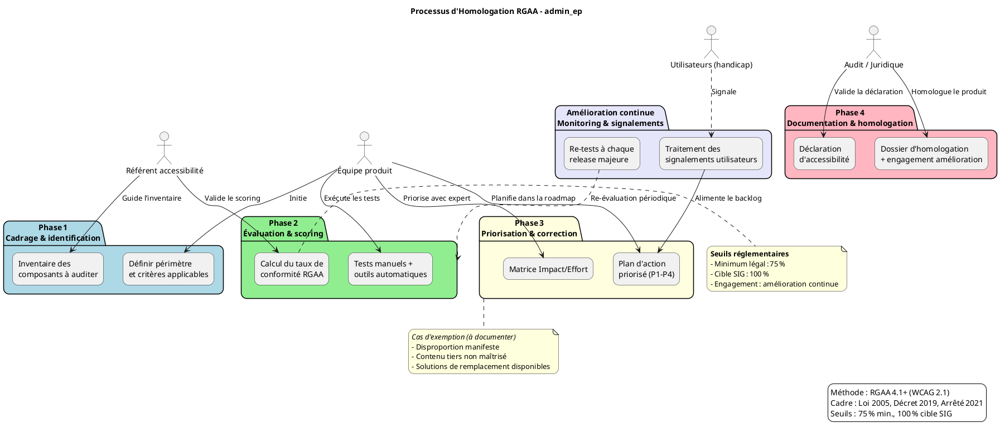

# 📘 Guide d’atelier d’homologation RGAA – **admin_ep**
> *Document établi à partir des principes du RGAA 4.1+, déclinaison française des WCAG, conformément à la loi du 11 février 2005.*

---

[TOC]

---

## 1️⃣ Introduction et objectifs

**Objectif du livrable** : *« Préparer et piloter l’homologation RGAA d’un produit numérique »*  
**Méthodologie** : Atelier basé sur le **RGAA 4.1+** (déclinaison française des WCAG 2.1/2.2).  

### Objectifs opérationnels

| # | Objectif |
|---|----------|
| 🎯 | Comprendre les obligations réglementaires (seuil ≥ 75 % ; cible 100 % ) et les spécificités du service admin_ep. |
| 🔎 | Identifier les critères RGAA applicables à l’interface web (JSP, CSS, Java / Struts). |
| 📊 | Évaluer l’état de conformité actuel (audit manuel + outils) et prioriser les corrections. |
| 🗂️ | Construire un plan d’action d’amélioration continue (P1‑P4). |
| 📄 | Rédiger la déclaration d’accessibilité (format JSON / HTML) et préparer le dossier d’homologation. |

---

## 2️⃣ Contexte d’usage

| Élément | Valeur |
|---------|--------|
| **Produit** | **admin_ep** – Application de gestion des établissements publics (conseils d’administration, mandats, etc.). |
| **Type de service** | Application web Java (Struts 2 / JSP) déployée sur Tomcat 9, base PostgreSQL 9.6 / 15. |
| **Public cible** | SPES, DG de tutelle, opérateurs internes (authentification Cerbère). |
| **Environnement** | Production (https://adminep.e2.rie.gouv.fr) & pré‑production. |
| **Cadre réglementaire** | - Loi n° 2005‑102 du 11 février 2005 <br> - Décret n° 2019‑768 du 24 juillet 2019 <br> - Arrêté du 29 avril 2021 (RGAA 4.1) <br> - Directive (UE) 2016/2102 |
| **Seuils de conformité** | **Minimum légal** : 75 % de critères conformes <br> **Cible SIG** : 100 % + amélioration continue |
| **Moment d’utilisation** | • En amont du sprint de développement <br> • Pendant les revues de code <br> • Avant chaque mise en production <br> • En exploitation (traitement des signalements) |

---

## 3️⃣ Pré‑requis

- **[ ]** Périmètre produit défini : URLs (ex. `/admin_ep/*`), pages JSP listées dans l’arborescence, composants UI (menus, formulaires, tableaux).  
- **[ ]** Personas utilisateurs complétés (SPES, DG, opérateur).  
- **[ ]** Stack technique documentée : Java 8, Struts 2, JSP, CSS Bootstrap 4, PostgreSQL, Tomcat 9.  
- **[ ]** Audit d’accessibilité partiel existant (si disponible) ; sinon prévoir un *scan rapide* (Axe, Wave).  
- **[ ]** Référentiel DSFR (Design System Français) disponible ? (Optionnel).  

> 💡 *Astuce* : Si aucun audit antérieur n’existe, lancez d’abord un audit automatisé sur les pages critiques (login, recherche, tableau de bord) afin d’identifier les blocages majeurs.

---

## 4️⃣ Parties prenantes et rôles

| Rôle | Profil type | Responsabilité dans l’atelier |
|------|-------------|------------------------------|
| **Animateur / Référent accessibilité** | Chef de projet / UX / Expert RGAA | Facilite, explique les critères, arbitrage des priorités. |
| **Développeur front / Tech Lead** | Java / Struts / JSP | Évalue la faisabilité technique, estime l’effort. |
| **Designer UX/UI** | UI‑Designer (Bootstrap / DSFR) | Propose des alternatives accessibles, valide les maquettes. |
| **Juriste / Conformité** | RSSI / DPO / Responsable légal | Valide le cadre juridique, signe la déclaration d’accessibilité. |
| **Représentant utilisateurs** *(optionnel)* | Personne en situation de handicap / Association | Teste les scénarios réels, donne un retour d’usage. |

> ☝️ *Un même collaborateur peut cumuler plusieurs rôles selon les ressources disponibles.*

---

## 5️⃣ Logistique

| Élément | Détails |
|---------|--------|
| **Durée** | 3 h – 4 h (prévoir 15 min de pause). |
| **Matériel physique** | Tableau blanc, post‑its 4 couleurs (✅ Conforme / ❌ Non‑conforme / ⚠️ À vérifier / 🚫 Hors périmètre), marqueurs. |
| **Matériel digital** | <ul><li>Outil collaboratif (Miro / FigJam)</li><li>Navigateur avec Axe DevTools, Wave, Lighthouse</li><li>Environnement de test admin_ep (données factices)</li></ul> |
| **Livrable de sortie** | Matrice de conformité RGAA, plan d’action priorisé, brouillon de déclaration d’accessibilité. |

---

## 6️⃣ Déroulé détaillé de l’atelier

### 🎯 Étape 1 – Cadrage réglementaire (30 min)

1. Présentation du cadre légal (loi 2005, décret 2019, arrêté 2021, directive UE 2016/2102).  
2. Rappel des **4 principes WCAG** appliqués au RGAA :  
   - **Perceptible** – l’information doit être présentable de façon perceptible.  
   - **Utilisable** – les composants d’interface doivent être utilisables.  
   - **Compréhensible** – l’information et l’utilisation doivent être compréhensibles.  
   - **Robuste** – le contenu doit être interprétable par tout agent utilisateur.  
3. Définir le **périmètre d’audit** : toutes les pages JSP sous `/admin_ep/`, les formulaires d’ajout/modif, les tableaux de résultats, les menus de navigation.  
4. Exemple concret : image du logo sans `alt` → impact sur les lecteurs d’écran.  

### 🔍 Étape 2 – Identification des critères applicables (45 min)

| Thème RGAA | Critères critiques à vérifier (exemples) |
|------------|------------------------------------------|
| **1 – Images** | 1.1 Alternative texte, 1.2 Images décoratives (`alt=""`). |
| **2 – Couleurs** | 2.1 Contraste ≥ 4.5 : 1 (AA), 2.2 Contraste texte ≥ 7 : 1 (AAA) pour texte important. |
| **3 – Multimédia** | 3.1 Transcriptions, 3.2 Sous‑titres. |
| **4 – Tableaux** | 4.1 Résumé, 4.2 Titres de colonnes, 4.3 Navigation via `scope`. |
| **5 – Liens** | 5.1 Texte de lien explicite, 5.2 Lien unique par page. |
| **6 – Scripts** | 6.1 Gestion du focus, 6.2 Gestion du clavier, 6.3 ARIA approprié. |
| **7 – Navigation** | 7.1 Fil d’Ariane, 7.2 Plan du site, 7.3 Menu accessible. |
| **8 – Formulaires** | 8.1 Labels associés, 8.2 Messages d’erreur clairs. |
| **9 – Présentation** | 9.1 CSS évitant le masquage d’information, 9.2 Responsive. |
| **10 – Informations & consultation** | 10.1 Structure du document (`h1`‑`h6`), 10.2 Langue du document. |

*Méthode* : chaque critère est noté **✅ Conforme**, **❌ Non‑conforme**, **⚠️ À vérifier**, **🚫 Hors périmètre** sur le tableau mural.

### 📊 Étape 3 – Évaluation et scoring (45 min)

1. **Tests rapides** :  
   - **Manuel** : navigation clavier (`Tab` / `Shift+Tab`), lecteur d’écran (NVDA/VoiceOver).  
   - **Automatique** : Axe DevTools, Wave, Lighthouse (rapport PDF).  
   - **Utilisateur réel** : si possible, test avec une personne en situation de handicap.  

2. **Calcul du taux de conformité** :  

```text
Taux = (Nb critères conformes) / (Nb critères applicables) × 100
```

3. **Identification des écarts critiques** : non‑conformités bloquant l’accès au service (ex. menu non‑navigable au clavier, contrast insuffisant).  

> 💡 *Ne pas viser la perfection immédiate ; l’objectif est d’obtenir une base fiable pour le plan d’action.*

### 🎚️ Étape 4 – Priorisation et plan d’action (45 min)

#### Matrice Impact / Effort

|                     | **Faible effort** | **Fort effort** |
|---------------------|-------------------|-----------------|
| **Fort impact**     | 🔴 **P1** (Quick wins) | 🟡 **P2** (Investissements) |
| **Faible impact**   | 🟢 **P3** (Améliorations) | ⚪ **P4** (Backlog) |

**Exemple de priorisation** :

| Priorité | Critère | Action corrective | Responsable | Échéance | Validation |
|----------|---------|-------------------|-------------|----------|------------|
| 🔴 P1 | 2.1 Contraste texte | Re‑définir les variables CSS (`$primary-color` → `#1a1a1a`), ajouter `@media (prefers-contrast: high)` | Dev Front | S+2 semaines | Test clavier + Axe |
| 🟡 P2 | 6.1 Gestion du focus | Implémenter `focus-visible` sur les éléments interactifs, ajouter `aria‑pressed` aux toggles | Tech Lead | S+4 semaines | Test NVDA |
| 🟢 P3 | 1.2 Images décoratives | Vérifier `alt=""` sur toutes les images décoratives du thème Bootstrap | Designer | S+6 semaines | Vérif. manuel |
| ⚪ P4 | 9.2 Responsive | Refonte du layout mobile (hors périmètre immédiat) | PO | Q3 2026 | N/A |

Intégrer les actions P1/P2 dans le **backlog sprint** (stories JIRA, tags `RGAA-P1`, `RGAA-P2`).

### 🏁 Étape 5 – Documentation et homologation (30 min)

1. **Déclaration d’accessibilité** (modèle obligatoire) :  
   - **État de conformité** : ex. `75 % (conforme) – 25 % (non‑conforme, exemptions)`.  
   - **Liste des critères non‑conformes** avec justification (exemption, disproportion, dépendance tierce).  
   - **Moyens de contact** : `assistance-adminep@developpement-durable.gouv.fr`.  
   - **Voies de recours** : Défenseur des droits.  

2. **Dossier d’homologation** :  
   - Matrice de conformité détaillée (thème / critère / statut).  
   - Preuves de test (captures d’écran, logs Axe, compte‑rendu utilisateurs).  
   - Plan d’amélioration continue (roadmap, fréquence des re‑tests).  

3. **Processus de suivi** :  
   - Re‑tests à chaque **release majeure** (ex. `1.3.4`).  
   - Traitement des signalements via le ticketing interne (JIRA).  
   - Mise à jour de la déclaration dans le **portail RGAA** du ministère.  

> 📸 *Action immédiate* : partager le brouillon de déclaration avec le service juridique pour validation avant publication.

---

## 7️⃣ Conseils de facilitation

| Bonnes pratiques | À éviter |
|-----------------|----------|
| Ancrer chaque critère dans un scénario utilisateur réel (ex. « l’opérateur recherche un établissement ») | S’enliser dans le jargon RGAA sans lien fonctionnel |
| Utiliser des exemples concrets du produit (ex. logo, tableau de bord) | Se contenter de résultats d’outils automatiques |
| Impliquer les profils techniques dès l’évaluation (estimations d’effort) | Reporter systématiquement les corrections « complexes » |
| Documenter les décisions d’exemption (si besoin) | Oublier la mise à jour continue du plan d’action |
| Valider les corrections avec tests manuels + outils | Se fier uniquement aux scores d’outils automatisés |

---

## 8️⃣ Mini‑glossaire RGAA / WCAG

| Terme | Définition |
|-------|------------|
| **Alternative textuelle** | Texte descriptif (`alt`) associé à une image porteuse d’information. |
| **ARIA** | *Accessible Rich Internet Applications* : attributs HTML pour améliorer l’accessibilité des composants dynamiques. |
| **Focus** | Indicateur visuel qui montre quel élément reçoit les entrées clavier. |
| **Contraste** | Rapport de différence de luminance entre texte et arrière‑plan (exigence ≥ 4.5 : 1 AA, ≥ 7 : 1 AAA). |
| **Perceptible** | Principe WCAG – l’information doit être présentable de façon perceptible (ex. texte, images, audio). |
| **Utilisable** | Principe WCAG – les composants d’interface doivent être utilisables (ex. navigation clavier). |
| **Compréhensible** | Principe WCAG – les contenus et l’utilisation doivent être compréhensibles (ex. langue claire). |
| **Robuste** | Principe WCAG – le contenu doit être interprétable par divers agents utilisateurs (ex. navigateurs, AT). |
| **Exemption** | Cas où un critère ne peut être satisfait pour des raisons techniques ou légales, justifié dans la déclaration. |

---

## 9️⃣ Exemple de matrice de conformité (simplifiée)

### Thème 1 – Images

| Critère RGAA | Statut | Observation | Action | Priorité |
|--------------|--------|-------------|--------|----------|
| 1.1 – Alternative texte | ✅ Conforme | Toutes les images décoratives ont `alt=""`. | – | – |
| 1.2 – Image porteuse d’info | ❌ Non‑conforme | Logo du header sans `alt`. | Ajouter `alt="Administration des établissements publics"` | 🔴 P1 |
| 1.3 – Image complexe | ⚠️ À vérifier | Graphique dynamique « Statistiques » sans description longue. | Rédiger description + lien « En savoir plus ». | 🟡 P2 |

### Thème 6 – Scripts

| Critère RGAA | Statut | Observation | Action | Priorité |
|--------------|--------|-------------|--------|----------|
| 6.1 – Gestion du focus | ❌ Non‑conforme | Menu principal ne reçoit pas le focus au clavier. | Ajouter `tabindex="0"` et `focus-visible`. | 🔴 P1 |
| 6.2 – ARIA rôles | ⚠️ À vérifier | Boutons « Exporter » manquent de `aria‑pressed`. | Ajouter attributs ARIA appropriés. | 🟡 P2 |
| 6.3 – Événements clavier | ✅ Conforme | Tous les `onclick` ont un équivalent `onkeypress`. | – | – |

> **⚠️️** Pour chaque critère non‑conforme, indiquer le **responsable**, **estimation d’effort** (faible/fort) et **date cible**.

---

## 🔁 10. Diagramme PlantUML du processus d’homologation RGAA



---

## 11️⃣ Adaptations contextuelles

| Contexte | Adaptation recommandée |
|----------|------------------------|
| **Nouveau produit** | Intégrer le DSFR dès la conception (composants UI, contrastes, focus). |
| **Refonte / Legacy** | Commencer par un audit complet, prioriser les critères bloquants (focus, contrast, alt). |
| **Application mobile** | Adapter les critères aux gestuelles, tailles de cibles, VoiceOver/TalkBack. |
| **Contenu dynamique (scripts)** | Vérifier ARIA live regions, mise à jour du DOM, focus après actions AJAX. |
| **Délai court** | Viser les critères « bloquants » (navigation clavier, alternatives, contraste) pour atteindre rapidement les 75 %. |

---

## 12️⃣ Livrables et suite du projet

| Livrable | Description |
|----------|-------------|
| **Matrice de conformité RGAA** | Détail thématique/critère, statut, observations, actions, priorités. |
| **Plan d’action priorisé** | Tableau P1‑P4, estimation d’effort, responsables, dates cibles. |
| **Déclaration d’accessibilité (brouillon)** | À valider juridiquement, publier sur le portail admin_ep. |
| **Dossier d’homologation** | Preuves de conformité (captures, logs, comptes‑rendu utilisateurs). |
| **Processus de suivi** | Fréquence des re‑tests, circuit de traitement des signalements, mise à jour de la déclaration. |

### Prochaines étapes suggérées

1. **Validation juridique** de la déclaration (juriste / DPO).  
2. **Intégration des actions P1** dans le sprint # X (stories `RGAA‑P1‑*`).  
3. **Formation** de l’équipe aux bonnes pratiques d’accessibilité (atelier 2 h).  
4. **Mise en place de tests automatisés** d’accessibilité dans la CI / CD (Axe‑core, Lighthouse).  
5. **Publication** de la déclaration d’accessibilité sur le site public et dans le **portail RGAA** ministériel.  

---

## 📚 Annexes

### A. Références réglementaires

- Loi n° 2005‑102 du 11 février 2005 pour l’égalité des droits et des chances.  
- Décret n° 2019‑768 du 24 juillet 2019 relatif aux obligations de mise à disposition des outils de signalement.  
- Arrêté du 29 avril 2021 portant approbation du référentiel général d’amélioration de l’accessibilité (RGAA 4.1).  
- Directive (UE) 2016/2102 relative à l'accessibilité des sites internet et des applications mobiles des organismes du secteur public.  
- WCAG 2.1 & 2.2 – W3C (normes de référence).  

### B. Outils recommandés

| Outil | Usage |
|-------|-------|
| **Axe DevTools** (Chrome/Firefox) | Analyse instantanée des critères RGAA (contraste, ARIA, rôle). |
| **Wave** (WebAIM) | Rapport visuel des erreurs d’accessibilité. |
| **Lighthouse** (Chrome) | Score d’accessibilité, recommandations. |
| **NVDA / VoiceOver** | Tests de lecteur d’écran. |
| **Jira** | Suivi des actions (tags `RGAA‑P1`, `RGAA‑P2`). |
| **Miro / FigJam** | Collaboration pendant l’atelier (post‑its virtuels). |

---

*Ce guide est immédiatement exploitable : il suffit de remplacer les blocs entre `[` et `]` par les informations spécifiques à votre produit ou à votre contexte.*