# 📄 Guide d’atelier d’homologation RGAA – **Admin EP**  

> **Document établi à partir des principes du RGAA 4.1+, déclinaison française des WCAG, conformément à la loi du 11 février 2005**  

---  

## 🔖 Table des matières  
[TOC]

---  

## 1️⃣ Introduction et objectifs  

**Objet du livrable** : *« Préparer et piloter l’homologation RGAA d’un produit numérique »* – ici le produit **Admin EP** (application web Java / PostgreSQL).  

**Méthodologie** : atelier basé sur le **RGAA 4.1+** (déclinaison française des WCAG 2.1/2.2).  

### Objectifs opérationnels  

| # | Objectif |
|---|----------|
| 🎯 | Comprendre les obligations réglementaires (seuils 75 % minimum, 100 % cible SIG) et le cadre juridique applicable. |
| 🔎 | Identifier les critères RGAA pertinents pour **Admin EP** (pages JSP, formulaires, tables, navigation, scripts). |
| 📊 | Évaluer l’état de conformité actuel (audit manuel + outils automatiques) et prioriser les corrections. |
| 🗂️ | Construire un **plan d’action d’amélioration continue** (responsables, échéances, suivi). |
| 📝 | Préparer la **déclaration d’accessibilité** (brouillon) et le dossier d’homologation. |

---  

## 2️⃣ Contexte d’usage  

| Élément | Valeur |
|--------|--------|
| **Produit** | **Admin EP** – Administration des établissements publics (base de données partagée, interface web). |
| **Type de service** | Application web / service back‑office (Java 8, Tomcat 9→10, PostgreSQL 15). |
| **Public cible** | SPES, DG de tutelle, opérateurs – utilisateurs internes (intranet). |
| **Environnement** | Hébergement MSP (centre‑serveur ministériel Paris La Défense), production, pré‑prod, recette. |
| **Maturité accessibilité** | Non évaluée à ce jour (aucun audit RGAA réalisé). |
| **Contraintes techniques** | Tomcat 10, PostgreSQL 15, Java 8, utilisation de JSP, Struts 2, DisplayTag. |
| **Cadre réglementaire** | - Loi n°2005‑102 du 11 février 2005 <br> - Décret n°2019‑768 du 24 juillet 2019 <br> - Arrêté du 29 avril 2021 (RGAA 4.1) <br> - Directive (UE) 2016/2102 |
| **Quand l’utiliser** | • **En amont** : définir les exigences d’accessibilité dans la feuille de route. <br> • **Pendant le dev** : vérifier les composants UI (menus, formulaires, tables). <br> • **Avant mise en prod** : préparer l’audit, la déclaration, le dossier d’homologation. <br> • **En exploitation** : gérer les signalements, mettre à jour la conformité. |
| **Seuils de conformité** | **Minimum légal** : 75 % de critères conformes. <br> **Cible SIG** : 100 % + amélioration continue. |

---  

## 3️⃣ Pré‑requis  

| ✅ | Pré‑requis indispensable |
|----|---------------------------|
| 1 | **Périmètre produit défini** – URLs et fonctionnalités à auditer (ex. : `/admin/accueil`, `/admin/admins/*`, `/admin/etablissements/*`, pages d’erreur, menus, formulaires d’ajout/modif). |
| 2 | **Publics utilisateurs identifiés** – personas : gestionnaire, référent juridique, technicien. |
| 3 | **Stack technique documentée** – Java 8, Struts 2, JSP, DisplayTag, CSS Bootstrap, scripts JavaScript. |
| 4 | **État des lieux accessibilité** – aucun audit existant ; prévoir un **scan rapide** (Axe, Wave, Lighthouse). |
| 5 | **Référentiel DSFR** (si utilisé) – version à vérifier. |
| 6 | **Accès aux environnements** – dev, pré‑prod, prod (avec comptes test). |

> **Conseil** : si aucun audit préalable n’existe, lancer un premier scan automatisé pour repérer les blocages majeurs (images sans texte, contrastes, navigation clavier).  

---  

## 4️⃣ Parties prenantes et rôles  

| Rôle | Profil type | Responsabilité dans l’atelier |
|------|------------|------------------------------|
| **Animateur / Référent accessibilité** | Chef de projet / UX / Expert RGAA | Faciliter, expliquer les critères, arbitrer les priorités. |
| **Développeur front** | Java / JSP / Struts 2 | Vérifier la faisabilité des corrections, estimer l’effort. |
| **Designer UI/UX** | UI Designer | Proposer des alternatives accessibles (contraste, libellés, focus). |
| **Juriste / Conformité** | RSSI / DPO / Responsable légal | Valider le cadre juridique, la rédaction de la déclaration. |
| **Responsable exploitation** | Admin système (Tomcat/PostgreSQL) | Garantir la mise en place technique (ex : ARIA, headers HTTP). |
| **Représentant utilisateurs** *(optionnel)* | Personne en situation de handicap / Association | Apporter le retour d’usage réel, tester les scénarios. |

> *Un même intervenant peut cumuler plusieurs rôles selon les ressources disponibles.*  

---  

## 5️⃣ Logistique  

| Élément | Détails |
|---------|---------|
| **Durée** | 3 h – 4 h (pause de 15 min à mi‑parcours). |
| **Matériel physique** | Tableau blanc, post‑its 4 couleurs (✅ Conforme, ❌ Non‑conforme, ⚠️ À vérifier, 🚫 Hors périmètre), marqueurs. |
| **Matériel digital** | Mural / FigJam, navigateur avec Axe DevTools, Wave, Lighthouse, accès aux environnements (dev, pré‑prod). |
| **Livrable de sortie** | - Matrice de conformité RGAA (thème / critère) <br> - Plan d’action priorisé (P1‑P4) <br> - Brouillon de déclaration d’accessibilité. |

---  

## 6️⃣ Déroulé détaillé de l’atelier  

### 🎯 Étape 1 – Cadrage réglementaire (30 min)  
1. Présenter le cadre légal (loi 2005, décret 2019, RGAA 4.1, directive UE).  
2. Rappeler les **4 principes WCAG** appliqués au RGAA : Perceptible, Utilisable, Compréhensible, Robuste.  
3. Définir le **périmètre d’audit** : pages JSP listées ci‑dessous, composants UI, scripts JavaScript.  
4. Exemple concret : image décorative sans `alt=""` → impact pour lecteur d’écran.  

### 🔍 Étape 2 – Identification des critères applicables (45 min)  
| Thème RGAA | Critères typiques à vérifier pour Admin EP |
|------------|-------------------------------------------|
| **Images** | 1.1 Alternative texte, 1.2 Images décoratives, 1.3 Images complexes. |
| **Couleurs** | 2.1 Contraste (AA ≥ 4.5 : 1, AAA ≥ 7 : 1). |
| **Multimédia** | 3.1 Sous‑titres, 3.2 Transcriptions, 3.3 Contrôle du lecteur. |
| **Tableaux** | 4.1 Titres de tableau, 4.2 Résumé, 4.3 Navigation. |
| **Liens** | 5.1 Texte de lien explicite, 5.2 Lien unique. |
| **Scripts** | 7.1 Gestion du focus, 7.2 Évènements clavier, 7.3 ARIA. |
| **Navigation** | 9.1 Menu accessible, 9.2 Fil d’Ariane, 9.3 Saut de titre. |
| **Formulaires** | 10.1 Labels, 10.2 Erreur de saisie, 10.3 Aide contextuelle. |
| **Pages d’erreur** | 12.1 Message explicite, 12.2 Lien retour. |
| **Structure** | 13.1 Titres hiérarchisés, 13.2 Langue du document. |

*Méthode* : parcourir chaque thème, cocher **✅ Conform** / **❌ Non‑conform** / **⚠️ À vérifier** / **🚫 Hors périmètre**.  

### 📊 Étape 3 – Évaluation et scoring (45 min)  
1. **Tests rapides** :  
   - Navigation clavier (`Tab`, `Enter`).  
   - Lecteur d’écran (NVDA ou VoiceOver).  
   - Outils automatiques : Axe, Lighthouse, Wave.  
2. **Calcul du taux de conformité** :  

```text
Taux = (Nb critères conformes) / (Nb critères applicables) × 100
```  

3. **Identifier les écarts critiques** (ex. : menus non‑focusables, contrastes faibles, absence de texte alternatif).  

### 🎚️ Étape 4 – Priorisation et plan d’action (45 min)  
| Impact / Effort | Faible effort | Fort effort |
|----------------|---------------|------------|
| **Fort impact** | 🔴 **Priorité 1** – Quick wins (ex. : ajouter `alt=""`, corriger le contraste des boutons). | 🟡 **Priorité 2** – Corrections majeures (refactorisation du menu, mise en place d’ARIA). |
| **Faible impact** | 🟢 **Priorité 3** – Améliorations (ex. : description de tableau). | ⚪ **Priorité 4** – Backlog (ex. : refonte complète du design). |

Pour chaque P1/P2 :  
- **Correction** (ex. : ajouter attribut `aria-label` au bouton “Envoi”).  
- **Responsable** (ex. : Développeur front).  
- **Échéance** (ex. : sprint #12).  
- **Critère de validation** (test de recette, capture d’écran).  

### 🏁 Étape 5 – Documentation et homologation (30 min)  
1. **Déclaration d’accessibilité** (modèle obligatoire) :  
   - État de conformité % (ex. : 68 % à J‑0).  
   - Critères non‑conformes et raisons (ex. : “exemption technique” à justifier).  
   - Moyen de contact (mail : assistance‑adminep@developpement-durable.gouv.fr).  
   - Voies de recours (Défenseur des droits).  
2. **Dossier d’homologation** :  
   - Matrice de conformité détaillée (thème / critère).  
   - Preuves de tests : captures, logs, retours utilisateurs.  
   - Plan d’amélioration continue.  
3. **Processus de suivi** :  
   - Re‑tests à chaque release majeure.  
   - Circuit de traitement des signalements (ticket JIRA).  
   - Mise à jour périodique de la déclaration.  

---  

## 7️⃣ Conseils de facilitation  

| Bonnes pratiques | À éviter |
|------------------|----------|
| Ancrer chaque critère dans un **scénario utilisateur réel** (ex. : recherche d’un administrateur). | S’enliser dans le **jargon RGAA** sans lien concret. |
| Utiliser des **exemples concrets** du produit (pages JSP, menus). | Confondre “conforme aux tests automatiques” et “accessible”. |
| Impliquer les **développeurs** dès l’évaluation (faisabilité). | Reporter systématiquement les corrections “complexes”. |
| Documenter les **décisions d’exemption** (justifications). | Oublier de prévoir la **mise à jour continue**. |
| Valider les corrections **manuellement** (NVDA, clavier). | Se fier uniquement aux scores automatiques. |

---  

## 8️⃣ Exemple de matrice de conformité (simplifiée)  

### Thème 1 : Images  

| Critère RGAA | Statut | Observation | Action | Priorité |
|--------------|--------|-------------|--------|----------|
| 1.1 – Alternative texte | ✅ Conform | Toutes les images décoratives ont `alt=""`. | – | – |
| 1.2 – Image porteuse d’info | ❌ Non‑conform | Logo du header sans `alt`. | Ajouter `alt="Administration des établissements publics"`. | 🔴 P1 |
| 1.3 – Image complexe | ⚠️ À vérifier | Diagrammes dans la page *Statistiques* : description longue manquante. | Rédiger description + lien `longdesc`. | 🟡 P2 |

### Thème 9 : Navigation  

| Critère RGAA | Statut | Observation | Action | Priorité |
|--------------|--------|-------------|--------|----------|
| 9.1 – Navigation clavier | ❌ Non‑conform | Menu déroulant inaccessible au clavier (`<ul>` sans `tabindex`). | Refactoriser le menu avec `role="menubar"` et gestion du focus. | 🔴 P1 |
| 9.2 – Fil d’Ariane | ✅ Conform | Implémenté via `<nav aria-label="Fil d’Ariane">`. | – | – |
| 9.3 – Saut de titre | ⚠️ À vérifier | Pas de lien “Aller au contenu” visible au focus. | Ajouter style `:focus-visible`. | 🟢 P3 |

*(La matrice complète couvrira les 13 thèmes du RGAA, soit ≈ 180 critères.)*  

---  

## 9️⃣ Diagramme Mermaid du processus d’homologation RGAA  

```mermaid
graph TB
    %% Acteurs;
    team["👥 Équipe produit"]
    expert["🎓 Référent accessibilité"]
    dev["💻 Développeur Front"]
    jurist["📜 Juriste / Conformité"]
    ops["🛠️ Ops (Tomcat/PostgreSQL)"]
    users["👤 Représentant utilisateurs"]

    %% Phases;
    subgraph phase1["Phase 1 – Cadrage & Identification"]
    step1["📋 Définir périmètre & critères"]
    step2["📦 Inventaire des composants UI"]
    end
    subgraph phase2["Phase 2 – Évaluation & Scoring"]
    step3["🧪 Tests manuels + outils"]
    step4["📊 Calcul du taux de conformité"]
    end
    subgraph phase3["Phase 3 – Priorisation & Correction"]
    step5["⚠️ Matrice Impact/Effort"]
    step6["📝 Plan d’action (P1‑P4)"]
    end
    subgraph phase4["Phase 4 – Documentation & Homologation"]
    step7["📘 Déclaration d’accessibilité"]
    step8["📜 Dossier d’homologation + suivi"]
    end
    subgraph loop["Amélioration continue"]
    monitor["🔄 Re‑tests à chaque release"]
    feedback["💬 Traitement des signalements"]
    end
    %% Flux principaux;
    team -->|Initie| step1;
    expert -->|Guide| step2;
    dev -->|Exécute| step3;
    ops -->|Vérifie| step3;
    expert -->|Valide| step4;
    team -->|Priorise| step5;
    dev -->|Planifie| step6;
    jurist -->|Valide| step7;
    jurist -->|Homologue| step8;
    %% Boucles de feedback;
    users -.->|Signalements| feedback;
    feedback -->|Alimente backlog| step6;
    monitor -.->|Re‑évaluation| step3;
    %% Styles;
    classDef actor fill:#E3F2FD,stroke:#1976D2,stroke-width_2px;
    classDef phase fill:#ADD8E6,stroke:#333,stroke-width_2px;
    classDef loop fill:#E6E6FA,stroke:#333,stroke-width_2px;
    class team,expert,dev,jurist,ops,users actor;
    class step1,step2 phase1;
    class step3,step4 phase2;
    class step5,step6 phase3;
    class step7,step8 phase4;
    class monitor,feedback loop
```



---  

## 🔟 Adaptations contextuelles  

| Contexte | Adaptation recommandée |
|----------|------------------------|
| **Nouveau projet** | Intégrer l’accessibilité dès la conception : DSFR, composants ARIA, contraste dès les maquettes. |
| **Refonte / Legacy** | Audit complet, corriger en priorité les **bloquants** (navigation clavier, alternatives, contraste). |
| **Application mobile** | Adapter les critères scripts (ARIA, focus) aux gestes, tailles de cibles, VoiceOver/TalkBack. |
| **Contenu dynamique (JORF)** | Vérifier la mise à jour ARIA des listes dynamiques, gérer les annonces de changement. |
| **Délais courts** | Cibler les critères à fort impact / faible effort (quick wins) pour atteindre le **75 %** rapidement. |

---  

## 1️⃣1️⃣ Livrables et suite du projet  

| Livrables immédiats | Description |
|---------------------|-------------|
| **Matrice de conformité RGAA** | Détail par thème/critère, statut, actions, priorités. |
| **Plan d’action priorisé** | Tableau P1‑P4, responsables, échéances, critères de validation. |
| **Brouillon de déclaration d’accessibilité** | À valider par le juriste avant publication. |

| Livrables dérivés | Description |
|-------------------|-------------|
| **Déclaration d’accessibilité publiée** | Obligatoire sur le site (page « Accessibilité »). |
| **Schéma pluriannuel d’amélioration** | Feuille de route (ex. : 2026 – 2028). |
| **Procédure de traitement des signalements** | Ticketing JIRA, SLA 5 jours ouvrés. |

| Prochaines étapes suggérées |
|-----------------------------|
| 1️⃣ Validation juridique de la déclaration. |
| 2️⃣ Intégration des actions P1 dans le sprint #12. |
| 3️⃣ Formation de l’équipe aux bonnes pratiques d’accessibilité (atelier 2 h). |
| 4️⃣ Mise en place de tests automatiques d’accessibilité dans la CI/CD (Axe‑core). |
| 5️⃣ Publication de la déclaration et communication aux usagers. |

---  

## 📎 Annexes  

### 📚 Mini‑glossaire (RGAA / WCAG)  

| Terme | Définition |
|-------|------------|
| **Alternative textuelle** (`alt`) | Texte décrivant le contenu d’une image pour les lecteurs d’écran. |
| **ARIA** | Attributs (`role`, `aria‑label`, `aria‑hidden`, …) qui enrichissent la sémantique pour l’accessibilité. |
| **Focus** | Point d’interaction clavier ; doit être visible (`:focus-visible`). |
| **Contraste** | Rapport de contraste de couleur (AA ≥ 4.5 : 1, AAA ≥ 7 : 1). |
| **Perceptible** | L’information doit être présentable de façon que les utilisateurs puissent la percevoir (ex. : texte, images, audio). |
| **Utilisable** | L’interface doit être utilisable via clavier, souris, ou autre dispositif. |
| **Compréhensible** | Le contenu et les interactions doivent être compréhensibles (ex. : libellés clairs, messages d’erreur). |
| **Robuste** | Le code doit être interprétable par les agents utilisateurs (navigateurs, lecteurs d’écran). |

---  

## 📄 Conclusion  

Cet atelier fournit une **méthodologie opérationnelle** pour conduire l’homologation RGAA du produit **Admin EP**. En suivant les étapes décrites, l’équipe pourra :

* Évaluer objectivement la conformité actuelle,  
* Prioriser les actions à fort impact,  
* Mettre en place un plan d’amélioration continue,  
* Produire les livrables obligatoires (déclaration, dossier d’homologation).  

Le respect du **seuil légal de 75 %** et la progression vers la **cible SIG 100 %** garantiront la mise à disposition d’un service public numérique **accessible à tous**.  

---  

*Document préparé le **27 avril 2026** – prêt à être utilisé dans VS Code, Obsidian ou imprimé pour l’atelier.*  