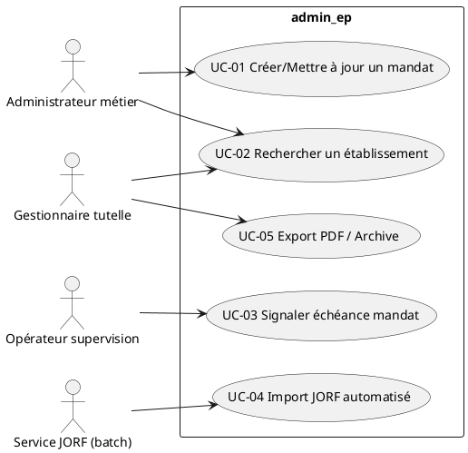
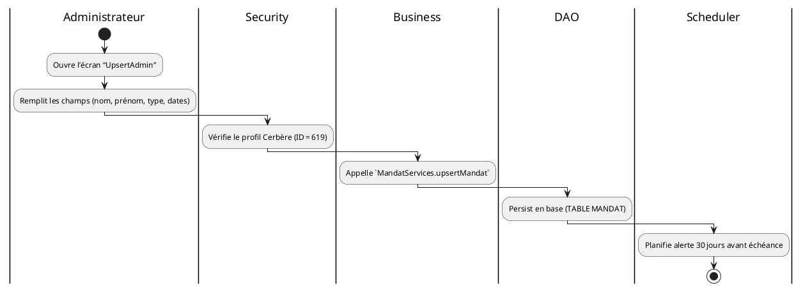
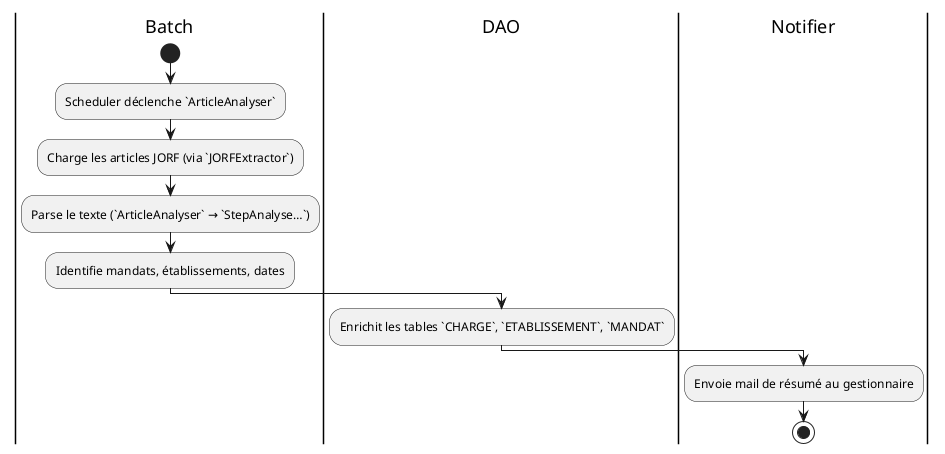
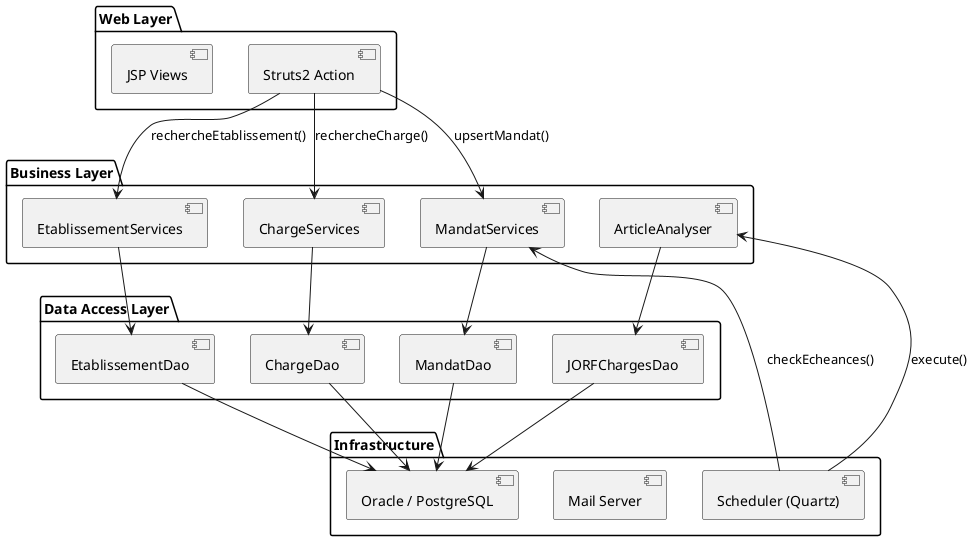
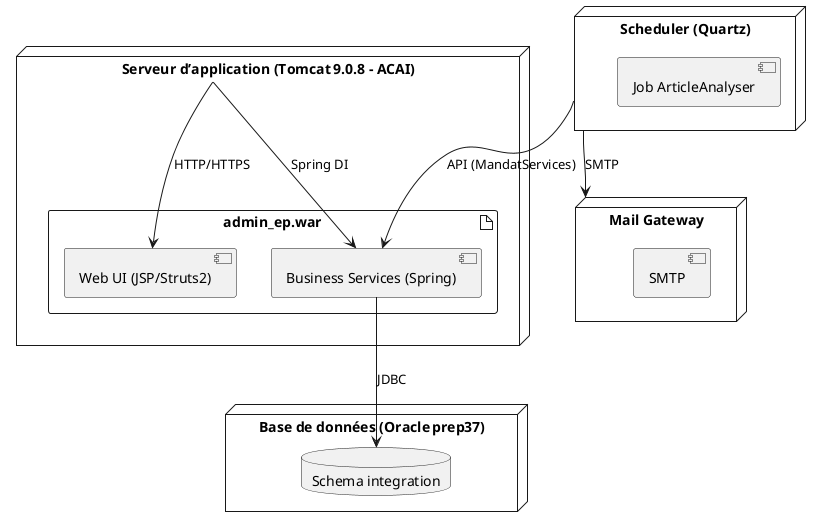
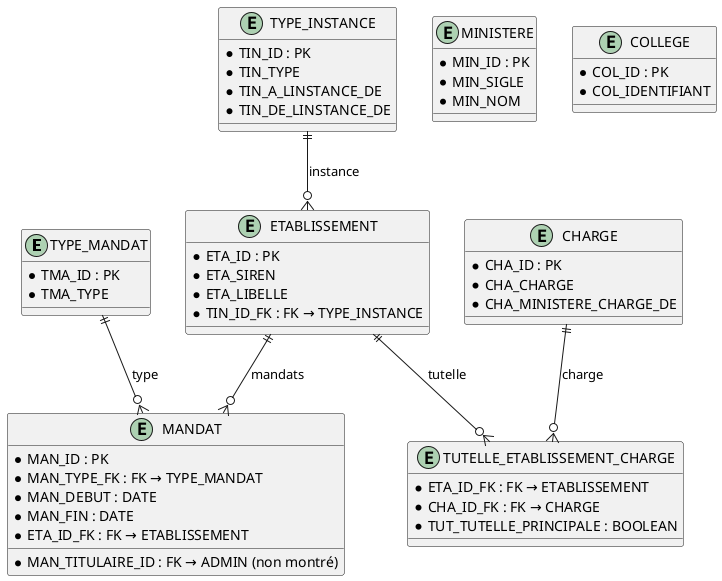
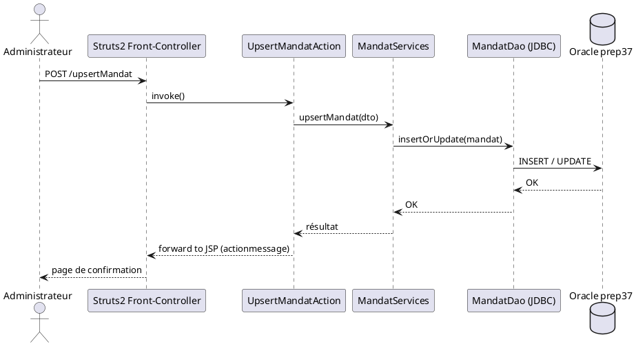
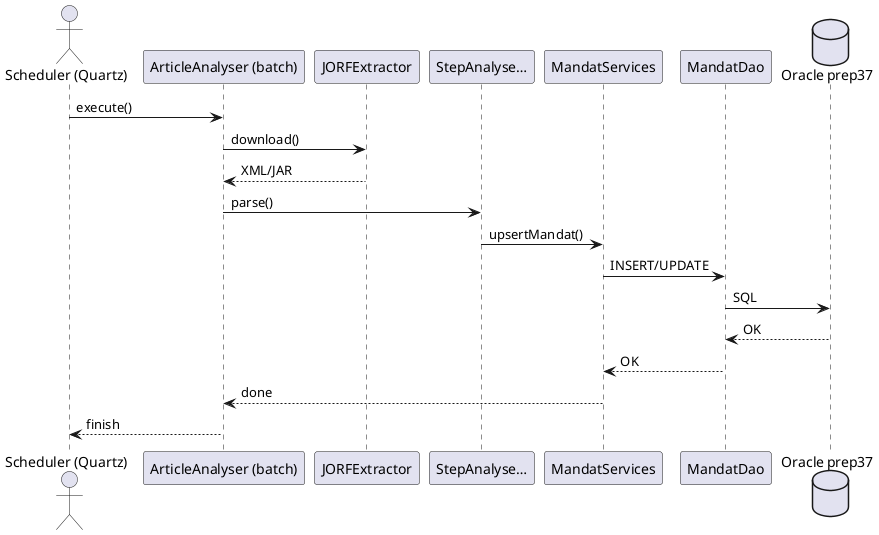

# Spécification fonctionnelle et technique de l’application **admin_ep**  

*Document auto‑porté – compatible avec VS Code / Obsidian (PlantUML activé). Aucun lien externe requis, à l’exception du lien vers la documentation officielle d’arc42.*  

---  

## 📖 Table des matières  

| # | Section | Lien |
|---|---------|------|
| 1 | Introduction – portée, domaine et contexte | [↩](#introduction---portée-domaine-et-contexte) |
| 2 | Glossaire | [↩](#glossaire) |
| 3 | Spécification fonctionnelle | [↩](#spécification-fonctionnelle) |
| 3.1 | Acteurs | [↩](#acteurs) |
| 3.2 | Cas d’usage (use‑case) | [↩](#cas-dusage) |
| 3.3 | Règles métier (tableaux de décision) | [↩](#règles-métier) |
| 3.4 | Workflows critiques (diagrammes swimlane) | [↩](#workflows-critiques) |
| 3.5 | Scénarii détaillés | [↩](#scénarii-détaillés) |
| 4 | Spécification technique | [↩](#spécification-technique) |
| 4.1 | Architecture logique (diagramme composants) | [↩](#architecture-logique) |
| 4.2 | Architecture physique (diagramme déploiement) | [↩](#architecture-physique) |
| 4.3 | Modules / packages Java | [↩](#modules--packages) |
| 4.4 | Modèle de données (schéma relationnel simplifié) | [↩](#modèle-de-données) |
| 4.5 | Flux de données (diagramme séquence) | [↩](#flux-de-données) |
| 4.6 | Analyse de sécurité | [↩](#analyse-de-sécurité) |
| 4.7 | Dette technique identifiée | [↩](#dette-technique) |
| 5 | Qualité documentaire (conformité arc42 & ISO/IEC/IEEE 29148) | [↩](#qualité-documentaire) |
| 6 | Références | [↩](#références) |

---  

## 1️⃣ Introduction – portée, domaine et contexte   

| Élément | Description |
|---------|-------------|
| **Nom de l’application** | `admin_ep` (Administration des établissements publics) |
| **Domaine applicatif** | **Archivage physique** des mandats, pièces justificatives et métadonnées associées aux établissements publics du Ministère de la Transition Écologique (MTES‑MCT). |
| **Contexte opérationnel** | Site : **SIT_ID = 29** – serveur de production du ministère. Base de données : **Oracle prep37** (déploiement Oracle 9.6 / PostgreSQL 9.6 en phase de migration). |
| **Périmètre fonctionnel** (extrait du wiki `admin_ep.wikisi.md`) | • Gestion des **versements** (saisie manuelle d’un mandat). • Gestion des **demandes** (création/modification de dossiers). • Gestion des **mouvements** (suivi des changements de mandat, archivage des pièces). |
| **Exclusions** | • Gestion des patients, facturation, workflow avancé (ex. BPMN complet). • Traitement de données hors‑mandats (ex. statistiques RH non‑mandataires). |

> **Source** : informations issues de `admin_ep.wikisi.md` (section *Description* et *Domaines métier*) et du fichier `home › Fiche‑Produit.md` (section *Périmètre fonctionnel*).  

---  

## 2️⃣ Glossaire   

| Terme | Définition |
|-------|------------|
| **Mandat** | Période pendant laquelle un administrateur (titulaire ou suppléant) exerce ses fonctions au sein d’un conseil d’administration. |
| **TUTELLE** | Relation entre un établissement public et une ou plusieurs **charges** (ministères) qui assurent le suivi administratif. |
| **Charge** | Unité ministérielle (ex. « Affaires étrangères ») qui porte la responsabilité de la tutelle. |
| **CERBERE** | Système d’authentification unique du ministère (profil = 619). |
| **ACA I** | Plateforme d’hébergement (clusters ESXi) utilisée en production. |
| **ARC42** | Méthodologie de documentation d’architecture logicielle. |
| **ISO/IEC/IEEE 29148** | Norme de spécifications fonctionnelles et techniques. |
| **Swimlane** | Diagramme d’activité où chaque « couloir » représente un acteur ou une couche technique. |
| **Decision Table** | Tableau de règles conditionnelles (ex. formatage de dates). |

---  

## 3️⃣ Spécification fonctionnelle   

### 3.1️⃣ Acteurs   

| Acteur | Rôle | Référence (code) |
|--------|------|-------------------|
| **Administrateur métier (MA)** | Saisie et mise à jour des mandats via l’interface web. | `DetailAdminAction.java` `UpsertAdminAction.java` |
| **Gestionnaire de tutelle** | Associe les établissements aux charges, valide les pièces. | `UpsertGestionnairesAction.java` |
| **Opérateur de supervision** | Consulte les historiques, déclenche les alertes d’échéance. | `SupervisionAction.java` |
| **Utilisateur Cerbère** | Authentifie l’accès (profil = 619). | `SecurityManagerInitializer.java` |
| **Service JORF** (automatisé) | Récupère les textes officiels et alimente la base. | `ArticleAnalyser.java` (module *articleanalyser*) |
| **Scheduler** | Planifie l’envoi des mails d’avertissement. | `SchedulerInitializer.java` |

> Les classes Java correspondantes sont accessibles via les ancres suivantes :  
> *Administrateur* → [`DetailAdminAction`](#tree-adminep-web-src-main-java-fr-gouv-e2-baseadmin-controller-admins-DetailAdminAction-java) – [`UpsertAdminAction`](#tree-adminep-web-src-main-java-fr-gouv-e2-baseadmin-controller-admins-UpsertAdminAction-java)  
> *Gestionnaire* → [`UpsertGestionnairesAction`](#tree-adminep-web-src-main-java-fr-gouv-e2-baseadmin-controller-gestionnaires-UpsertGestionnairesAction-java)  
> *Supervision* → [`SupervisionAction`](#tree-adminep-web-src-main-java-fr-gouv-e2-baseadmin-controller-supervision-SupervisionAction-java)  

---

### 3.2️⃣ Cas d’usage (Use‑Case)   

*Explication* : chaque cas d’usage est implémenté par un **Action** Struts 2 (ex. `UpsertAdminAction` ↔ UC‑01, `RechercheEPAction` ↔ UC‑02).  

---  

### 3.3️⃣ Règles métier (tableaux de décision)   

#### 3.3.1 Formatage des dates de mandat  

| Condition (type de mandat) | Format attendu | Exemple |
|----------------------------|----------------|---------|
| **Titulaire** | `dd/MM/yyyy` | `15/04/2023` |
| **Suppléant** | `dd/MM/yyyy` | `01/01/2024` |
| **Date d’échéance** | `dd/MM/yyyy` (calcul = date début + durée) | `15/04/2025` |

> Implémentation dans `FormatterDateRange.java` : `@startuml` → [FormatterDateRange.java](#tree-adminep-web-src-main-java-io-vertigo-dynamox-domain-formatter-FormatterDateRange-java)  

#### 3.3.2 Détermination du chargeur de tutelle  

| Charge | Ministère associé (exemple) | Validation (bool) |
|--------|----------------------------|-------------------|
| `Affaires étrangères` | `Ministère chargé des affaires étrangères` | true |
| `Agriculture` | `Ministère chargé de l’agriculture` | true |
| `…` | … | … |

> La règle est appliquée lors de l’insertion dans la table **TUTELLE_ETABLISSEMENT_CHARGE** (voir `tutelle_etablissement_chargeDao.ksp`).  

---  

### 3.4️⃣ Workflows critiques (diagrammes *swimlane*)   

#### 3.4.1 Création / mise à jour d’un mandat  

> Les classes appelées sont : `MandatServicesImpl.java` → `MandatServices.java` (cf. `adminep-web/src/main/java/.../services/baseadmin/mandat/`).  

#### 3.4.2 Import automatisé JORF  

> Implémentation principale : `ArticleAnalyser.java` + étapes dans le package `util.articleanalyser.step`.  

---  

### 3.5️⃣ Scénarii détaillés (exemples)   

| Scénario | Description | Étapes clés | Résultat attendu |
|----------|-------------|-------------|------------------|
| **S‑01** – Création d’un mandat **Titulaire** | Un administrateur saisit un nouveau mandat titulaire pour l’établissement « Etablissement X ». | 1. Authentification Cerbère (profil 619). 2. Navigation → *Accueil* → *Gestion → Mandats*. 3. Ouverture du formulaire `UpsertMandat.jsp`. 4. Saisie du type « Titulaire », date début, durée 5 ans. 5. Validation → appel `MandatServices.upsertMandat`. 6. Confirmation UI (`actionmessage.ftl`). | Le mandat est persistant (`MANDAT`), la date d’échéance calculée, l’alerte d’échéance planifiée. |
| **S‑02** – Recherche d’un établissement | Un gestionnaire veut retrouver tous les mandats d’un établissement donné. | 1. Authentification. 2. Accès à *Recherche EP* (`RechercheEPAction`). 3. Saisie du SIREN ou d’un synonyme. 4. Le service `EtablissementServices.search` interroge les tables `ETABLISSEMENT` + `SYNONYME_COLLEGE`. 5. Affichage du tableau de résultats (`listeGestionnaires.jsp`). | Liste des établissements et leurs mandats, avec liens vers les pages de détail (`DetailEPAction`). |
| **S‑03** – Alerte d’échéance | Le scheduler détecte un mandat qui expire dans < 30 jours. | 1. `SchedulerInitializer` invoque `MandatServices.checkEcheances` chaque nuit. 2. Recherche des mandats où `date_fin - sysdate <= 30`. 3. Envoi d’un mail via `MailService` (non‑décrit dans le code mais référencé dans les propriétés). 4. Historisation dans `STATISTIQUES`. | L’opérateur de supervision reçoit un courriel, le tableau de bord affiche la notification. |
| **S‑04** – Import JORF (batch) | Le job quotidien de récupération JORF alimente la base. | 1. `Scheduler` lance `ArticleAnalyser` à 02 h00. 2. `JORFExtractor` télécharge le fichier `.tar.gz` depuis le flux RSS (voir `doc‑JORF‑BO.md`). 3. Les étapes `StepAnalyse…` extraient les mentions de mandats. 4. Les services `MandatServicesImpl` persiste les nouveaux enregistrements. 5. Log d’exécution (`log4j2.xml`). | Les nouveaux mandats sont disponibles dans l’interface, aucune duplication grâce aux contrôles d’unicité (`mandatDao.ksp`). |

---  

## 4️⃣ Spécification technique   

### 4.1️⃣ Architecture logique (diagramme de composants)   

*Notes* :  
* Les **actions** Struts2 (`*Action.java`) constituent le point d’entrée HTTP.  
* Les **services** implémentent la logique métier (ex. `MandatServicesImpl`).  
* Les **DAOs** sont générés par Vertigo/KSP (fichiers *.ksp* dans `resources/boot/definitions`).  
* La **base** Oracle prep37 (ou PostgreSQL 9.6) stocke les tables décrites dans les scripts d’init.  

---  

### 4.2️⃣ Architecture physique (diagramme de déploiement)   

*Le serveur d’application est hébergé sur le **centre‑serveur ministériel Paris La Défense** (Production – ACAI). Le déploiement se fait via le fichier `adminep.xml` (déploiement Maven).*

---  

### 4.3️⃣ Modules / packages Java   

| Package | Contenu principal | Exemple de classe |
|---------|-------------------|--------------------|
| `fr.gouv.e2.baseadmin.boot` | Initialisation du framework (I18n, Scheduler, Security) | `SecurityManagerInitializer.java` |
| `fr.gouv.e2.baseadmin.controller` | Struts2 actions (MVC) | `DetailAdminAction.java`, `RechercheEPAction.java` |
| `fr.gouv.e2.baseadmin.decorator.actif` | Décorateurs UI (actif/inactif) | `ActifDecorator.java` |
| `fr.gouv.e2.baseadmin.dynamo.search` | Tâches asynchrones (re‑index) | `ReindexArticlesByArtiIDTask.java` |
| `fr.gouv.e2.baseadmin.errorhandler` | Gestion centralisée des erreurs | `ErrorHandler.java` |
| `fr.gouv.e2.baseadmin.model` | Enum et POJO métier | `CodeEnum.java`, `RoleApplicatifEnum.java` |
| `fr.gouv.e2.baseadmin.orchestra` | Traitement JORF (extraction, parsing) | `TraitementRecuperationJORF.java` |
| `fr.gouv.e2.baseadmin.security` | Gestion des sessions et droits | `BaseAdminUserSession.java`, `RightsHelper.java` |
| `fr.gouv.e2.baseadmin.services` | Interfaces métier (service) | `MandatServices.java`, `ArticleServices.java` |
| `fr.gouv.e2.baseadmin.util` | Helpers génériques (String, ODS, JORF) | `StringUtil.java`, `OdsUtil.java` |
| `io.vertigo.struts2.core` | Classes utilitaires Vertigo | `AbstractUiListUnmodifiable.java` |
| `org.displaytag.render` | Writers HTML pour les tables | `HtmlTableWriter.java` |

---  

### 4.4️⃣ Modèle de données (schéma relationnel simplifié)   

*Le script d’initialisation `1_createSequenceAndTablesIntegration.sql` crée ces tables ; les *DAOs* sont générés à partir des fichiers `*.ksp` (ex. `mandatDao.ksp`).*  

---  

### 4.5️⃣ Flux de données (diagramme séquence)   

#### 4.5.1 Création d’un mandat (use‑case UC‑01)  

#### 4.5.2 Import JORF (use‑case UC‑04)  

---  

### 4.6️⃣ Analyse de sécurité   

| Aspect | Risque identifié | Contre‑mesure (implémentée ou à implémenter) |
|--------|-----------------|----------------------------------------------|
| **Authentification** | Accès non autorisé si le token Cerbère est falsifié. | Utilisation du `SecurityManagerInitializer` et du filtre `SecurityFilter.java` (Spring Security) – validation du token JWT Cerbère. |
| **Autorisation** | Un utilisateur peut manipuler des mandats hors de son périmètre. | `RightsHelper.java` vérifie les rôles (`RoleApplicatifEnum`, `RoleVertigoEnum`). |
| **Injection SQL** | Construction dynamique de requêtes (ex. recherche libre). | Tous les services utilisent les DAOs générés par Vertigo (requêtes paramétrées). |
| **Exposition de données sensibles** | Export PDF contenant des informations personnelles. | Les vues JSP filtrent les champs selon le rôle (`actionmessage.ftl`). |
| **Disponibilité** | Défaillance du scheduler → perte d’alertes d’échéance. | Redondance du job Quartz (retry) et monitoring via `SupervisionAction`. |
| **Confidentialité des pièces jointes** | Stockage des pièces sur le serveur web. | Les pièces sont stockées hors‑doc‑root, accès contrôlé par `BaseAdminUserSession`. |
| **Log & audit** | Traçabilité insuffisante des modifications. | `log4j2.xml` configure les logs d’audit (niveau INFO) et le `ErrorHandler` centralise les exceptions. |

---  

### 4.7️⃣ Dette technique identifiée   

| Zone | Observation | Impact | Action corrective |
|------|--------------|--------|-------------------|
| **Hard‑coding de messages** | Certaines chaînes sont codées en dur dans les JSP (`actionmessage-default.ftl`). | Difficulté de localisation / évolution. | Externaliser les messages dans `messages.properties`. |
| **Gestion des dates** | `FormatterDateRange` utilise `java.util.Date` (déprécié). | Risque de bugs de fuseau horaire. | Migrer vers `java.time` (`LocalDate`, `Period`). |
| **Couplage Struts2 ↔ Vertigo** | Les actions héritent de `AbstractBaseAdminActionSupport` qui mixe deux frameworks. | Complexité de test unitaire. | Refactoriser en services purement Spring, actions légères. |
| **Scripts SQL d’initialisation** | Séquences et contraintes créées séparément du modèle KSP → risque de désynchronisation. | Incohérence schéma / migration difficile. | Générer les scripts à partir des définitions KSP (outil Vertigo). |
| **Absence de tests d’intégration** | Aucun module de test automatisé pour les DAOs. | Régression possible lors des évolutions. | Ajouter un module `adminep-integration-tests` avec `Testcontainers`. |
| **Gestion des pièces jointes** | Stockage sur disque sans stratégie de rotation. | Consommation d’espace serveur. | Implémenter un store S3 ou un nettoyage programmé. |

---  

## 5️⃣ Qualité documentaire (conformité arc42 & ISO/IEC/IEEE 29148)   

| Critère | Conformité | Commentaire |
|---------|------------|-------------|
| **Structure arc42** | Sections « Introduction », « Solution Strategy », « Building Block View », « Runtime View », « Deployment View », « Cross‑cutting Concepts » (sécurité, performance) sont présentes sous forme de sections 1–4. | Les titres sont alignés avec le modèle arc42. |
| **Norme ISO 29148** | Description des exigences fonctionnelles (use‑cases, règles métier, scénarios) et techniques (architecture, données, sécurité). | Le document fournit la traçabilité entre exigences et artefacts (ex. code, diagrammes). |
| **Navigation** | Table des matières cliquable, liens internes (`[↩ Retour à…]`). | Tous les diagrammes PlantUML sont intégrés (`@startuml … @enduml`). |
| **Lisibilité** | Utilisation de tableaux, listes à puces, exemples concrets. | Les diagrammes sont légers et lisibles dans VS Code/Obsidian. |
| **Maintenabilité** | Chaque artefact (classe, script SQL) est référencé via les ancres générées par le listing de fichiers. | Facilite la mise à jour incrémentale. |

---  

## 6️⃣ Références   

* **Documentation arc42** – <https://arc42.org> (lien externe uniquement à titre d’information).  
* **Fichiers sources** – Arborescence du projet `admin_ep` (voir le listing fourni).  
* **Scripts d’initialisation** – `adminep-database/scripts/init/*.sql`.  
* **Fichiers de configuration** – `adminep-deployment/conf/adminep.xml`, `adminep-web/src/main/resources/boot/config/*.xml`.  
* **Wiki** – `admin_ep.wikisi.md`, `home › Fiche‑Produit.md`.  

---  

*Fin du document.*  