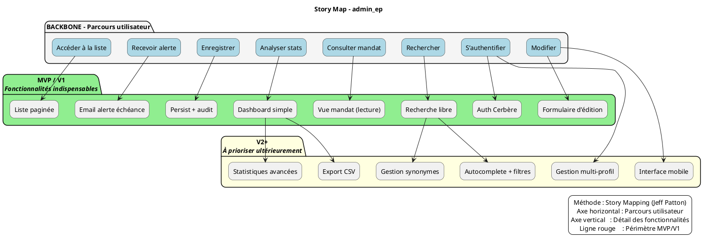

# 📚 Story Mapping – Atelier « Représenter le périmètre fonctionnel d’**admin_ep** »

> **Document établi à partir des principes du Story Mapping de Jeff Patton**  
> *Référence : Jeff Patton – “User Story Mapping: Discover the Whole Story, Build the Right Product”*  

---  

## 📖 Table des matières  
[TOC]

---  

## 1️⃣ Introduction et objectifs

**Livrable** : *« Représenter visuellement le périmètre fonctionnel d’admin_ep aligné sur le parcours utilisateur »*  

**Méthodologie** : Atelier basé sur le **Story Mapping (Jeff Patton)**  

### Objectifs opérationnels

| 🎯 | Objectif |
|---|---|
| 1 | Comprendre collectivement le parcours cible des différents usagers (SPES, DG de tutelle, opérateurs) |
| 2 | Identifier les fonctionnalités nécessaires à chaque étape du parcours |
| 3 | Prioriser pour définir un **MVP** fonctionnel (version 1.0) |
| 4 | Créer un support visuel partagé (Story Map) pour cadrer la suite du projet (V1, V2…) |
| 5 | Mettre en évidence les contraintes réglementaires / techniques à prendre en compte dès le début |

---  

## 2️⃣ Contexte d’usage

| Élément | Valeur |
|---|---|
| **Type de livrable** | Standard ✅ |
| **Nature** | Atelier 🤝 |
| **Activité** | « Imaginer une solution » |
| **Méthode** | Story Mapping (Jeff Patton) |
| **Quand l’utiliser** | <ul><li>Traduire recherche utilisateur, contraintes réglementaires et vision produit en périmètre fonctionnel</li><li>Cadrer un MVP, une V1 ou une refonte</li><li>Aligner équipes métier, technique et design sur une même représentation</li></ul> |
| **Recommandation** | Produire **une Story Map par persona** (max 2‑3), en commençant toujours par l’utilisateur final (ex. : opérateur) |

---  

## 3️⃣ Pré‑requis

- [ ] **Vision produit** formalisée (pitch, objectifs, métriques) – ex. : *« Disposer d’une base de données fiable, à jour et sécurisée des membres des conseils d’administration des établissements publics »*  
- [ ] **Personas** et recherche utilisateurs synthétisés (verbatims, interviews) – ex. : SPES, DG de tutelle, opérateur de saisie  
- [ ] **Problèmes utilisateurs** hiérarchisés (jobs‑to‑be‑done, pain points) – ex. : mise à jour manuelle fastidieuse, perte de visibilité sur les échéances de mandat, recherche d’information laborieuse  
- [ ] **Contraintes réglementaires / techniques** identifiées (DICT, RGPD, version Tomcat 9 → 10, PostgreSQL 9.6 → 15, Java 8)  

> **💡 Conseil** : Si un pré‑requis manque, prévoir **15 min** en début d’atelier pour le co‑construire rapidement (ex. : affiner les personas).  

---  

## 4️⃣ Parties prenantes et rôles

| Rôle | Profil type | Responsabilité dans l’atelier |
|---|---|---|
| **Animateur** | Chef de produit / PNM | Cadrer, faciliter, garder le focus utilisateur |
| **Profil technique** | Tech Lead / Architecte | Évaluer faisabilité, effort, dépendances (ex. : migration Tomcat, DB) |
| **Porteur métier** | MOA / Responsable métier (ex. : DG de tutelle) | Valider la pertinence fonctionnelle et la priorisation |
| **Designer UX/UI** *(optionnel)* | Designer produit | Enrichir le parcours, proposer des patterns d’interaction |
| **Responsable conformité** | Expert RGPD / DICT | Vérifier le respect des exigences légales (archivage, traçabilité) |

> ☝️ *Un même participant peut cumuler plusieurs rôles selon les disponibilités.*  

---  

## 5️⃣ Logistique

| Élément | Détails |
|---|---|
| **Durée** | 2 h 30 – 3 h (prévoir une pause à 1 h 30) |
| **Matériel physique** | Mur / tableau blanc, post‑its **3 couleurs** (ex. : vert = MVP, jaune = V2, rose = back‑log), marqueurs, ruban de masquage |
| **Matériel digital** | Outil collaboratif (Mural, FigJam, Klaxoon…) avec template Story Map pré‑préparé |
| **Livrable de sortie** | Photo ou export de la Story Map, liste des décisions MVP, points de vigilance & contraintes à suivre |
| **Salle** | Disposer d’un espace où le tableau peut être vu par tous (ou écran partagé en visioconférence) |

---  

## 6️⃣ Déroulé détaillé de l’atelier

### 🎯 Étape 1 — Introduction (15 min)

1. Présenter les **objectifs** de l’atelier et le **principe du Story Map** (Jeff Patton).  
2. Rappeler le **contexte admin_ep** (vision, acteurs, contraintes).  
3. Exposer les **règles de l’atelier** : écoute active, contributions ouvertes, suspension du jugement.  

> **Job story** d’exemple : *« En tant qu’opérateur, je veux saisir rapidement le mandat d’un administrateur afin de garantir la conformité des données »*  

### 🗺️ Étape 2 — Parcours utilisateur horizontal (30 min)

**Objectif** : Reconstituer collectivement le **parcours de bout en bout** de chaque persona.  

1. **Question clé** : *« Quelles sont les grandes étapes que suit l’usager dans sa démarche ? »*  
2. Créer un post‑it par étape, les disposer **de gauche à droite**.  
3. Utiliser des **verbes d’action** (ex. : *S’authentifier*, *Rechercher*, *Consulter*, *Modifier*, *Enregistrer*, *Recevoir alerte*).  

**Exemple de backbone (admin_ep)**  

```
[S’authentifier] → [Accéder à la liste] → [Rechercher un établissement] → [Consulter le mandat] → [Modifier / Ajouter] → [Enregistrer] → [Recevoir alerte échéance] → [Analyser statistiques]
```

### 📋 Étape 3 — Détail vertical des activités (45 min)

**Objectif** : Lister les **actions, informations et besoins** précis à chaque étape.  

Pour chaque étape du backbone :  

- *« Que doit faire concrètement l’usager ici ? »*  
- *« De quelles informations a‑t‑il besoin ? »*  
- *« Quels sont les points de friction potentiels ? »*  

Empiler les éléments **verticalement** sous chaque étape (du plus essentiel au plus secondaire).  
Ne pas filtrer : récolter le maximum d’idées.  

**Exemple (étape « Rechercher un établissement »)**  

| Niveau | Description |
|---|---|
| **1** | Champ libre de recherche (nom, SIREN) |
| **2** | Filtres avancés (type d’établissement, ministère) |
| **3** | Suggestions automatiques (autocomplete) |
| **4** | Gestion des synonymes (ex. : “collège” vs “college”) |
| **5** | Résultats paginés avec aperçu du mandat actuel |

### 🎚️ Étape 4 — Priorisation & définition du MVP (30‑45 min)

**Objectif** : Identifier la version la plus simple couvrant **tout le parcours**.  

1. Tracer une **ligne de flottaison** (MVP / V1) :  
   - **Au‑dessus** : fonctionnalités indispensables pour que l’usager aille au bout.  
   - **En‑dessous** : fonctionnalités reportables (V2, backlog).  
2. **Questions de priorisation** :  
   - *« Quelles fonctionnalités sont absolument nécessaires pour que l’usager puisse atteindre son objectif ? »*  
   - *« Qu’est‑ce qu’on peut retirer sans bloquer le parcours principal ? »*  

**MVP (exemple)** :  
- Authentification Cerbère  
- Recherche d’établissement (champ libre)  
- Consultation du mandat (lecture seule)  
- Enregistrement d’une modification (avec historisation)  
- Notification d’échéance (email)  

**V2 (exemple)** :  
- Filtres avancés, autocomplete, tableau de bord statistique, export CSV, gestion des synonymes, interface mobile.  

### 🏁 Étape 5 — Conclusion & prochaines étapes (15 min)

1. Relire la carte ensemble : valider la cohérence du parcours + périmètre MVP/V1.  
2. Noter : points de vigilance, questions en suspens, dépendances techniques/organisationnelles.  
3. Rappeler les **suites logiques** :  
   - Formalisation du backlog (epics → user stories)  
   - Rédaction des scénarios de test d’acceptation  
   - Maquettage UI/UX (si besoin)  
   - Estimation technique & planification sprint  

> 📸 **Action immédiate** : Prendre en photo le board ou exporter la carte numérique ; la partager dans les 24 h avec tous les participants.  

---  

## 7️⃣ Conseils de facilitation

| Bonnes pratiques | À éviter |
|---|---|
| Reformuler régulièrement pour assurer la clarté | S’attarder sur les détails techniques trop tôt |
| Garder le cap sur l’expérience utilisateur | Laisser un profil dominer les échanges |
| Faire participer tout le monde (métier, terrain, technique) | Accepter les digressions hors du parcours |
| Utiliser un **time‑boxing strict** par étape | Oublier de documenter les arbitrages |
| Ancrer chaque fonctionnalité dans un **besoin utilisateur** | Confondre “nice‑to‑have” et “must‑have” |

---  

## 8️⃣ Exemple de Story Map (simplifiée)

```
Parcours utilisateur (axe horizontal →) :
[S’authentifier] → [Accéder à la liste] → [Rechercher] → [Consulter mandat] → [Modifier] → [Enregistrer] → [Recevoir alerte] → [Analyser stats]

Fonctionnalités associées (axe vertical ↓ sous chaque étape) :

► S’authentifier
   • Auth via Cerbère (login, token)
   • Gestion des droits (admin, opérateur)

► Accéder à la liste
   • Tableau paginé des établissements
   • Fil d’Ariane de navigation

► Rechercher
   • Champ libre + autocomplete
   • Filtres (type, ministère, statut)

► Consulter mandat
   • Vue détaillée (nom, rôle, dates, pièces jointes)
   • Historique des mandats

► Modifier
   • Formulaire d’édition (validation, contraintes)
   • Gestion des pièces jointes

► Enregistrer
   • Persistance en PostgreSQL
   • Historisation + audit (RGPD)

► Recevoir alerte
   • Scheduler (cron) → email de rappel 30 j avant échéance
   • Tableau de bord “Mandats à venir”

► Analyser stats
   • Graphiques (nombre d’administrateurs par ministère, taux de renouvellement)
   • Export CSV
```

---  

## 9️⃣ Diagramme PlantUML du Story Map



---  

## 🔟 Adaptations contextuelles

| Contexte | Adaptation recommandée |
|---|---|
| **Refonte** | Partir du parcours existant (ex. : flux d’alimentation JORF) → identifier les frictions avant de proposer les nouvelles étapes. |
| **Produit réglementé** | Intégrer les exigences **RGPD**, **DICT**, archivage légal (ex. : conservation des mandats expirés). |
| **Multi‑profil** (SPES, DG, opérateur) | Créer **une Story Map par persona** puis dégager les **fonctionnalités transverses** (auth, recherche, alerte). |
| **Contraintes techniques fortes** (migration Tomcat 10, PostgreSQL 15) | Inviter le **profil technique** dès l’étape 3 pour valider la faisabilité des actions (ex. : persistance, notifications). |
| **Déploiement IaaS / ACAI** | Ajouter une activité “Déployer sur plateforme ACAI” dans la colonne **V2+**. |

---  

## 1️⃣1️⃣ Livrables et suite du projet

| Livrable | Description |
|---|---|
| **Story Map (immédiat)** | Photo / export PNG + diagramme PlantUML (ci‑dessus) |
| **Backlog produit structuré** | Epics → user stories (ex. : *En tant qu’opérateur, je veux modifier le mandat d’un administrateur*). |
| **Matrice de traçabilité** | Fonctionnalité ↔ besoin utilisateur ↔ contrainte (RGPD, DICT). |
| **Roadmap visuelle** | MVP → V1 → V2 (gantt simplifié ou tableau). |
| **Prochaines étapes** | 1️⃣ Rédaction des user stories <br>2️⃣ Maquettage UI (si besoin) <br>3️⃣ Estimation technique (story points) <br>4️⃣ Planification sprint (début du développement MVP). |

---  

## 📚 Mini‑glossaire

| Terme | Définition |
|---|---|
| **Backbone** | Axe horizontal du Story Map : le parcours utilisateur principal. |
| **MVP** | Minimum Viable Product – version fonctionnelle la plus simple qui délivre la valeur métier. |
| **Ligne de flottaison** | Ligne horizontale qui sépare les fonctionnalités du MVP (au‑dessus) du reste du backlog (en‑dessous). |
| **Epic** | Grande fonctionnalité découpée en plusieurs user stories. |
| **Job‑to‑be‑Done** | Objectif réel de l’utilisateur (ex. : *“Savoir qui est le titulaire d’un mandat pour éviter les conflits d’intérêts”*). |
| **RGPD** | Règlement général sur la protection des données ; impose traçabilité et archivage sécurisé. |
| **DICT** | Déclaration d’Intérêt et de Conflits d’intérêts – exigence de conformité. |

---  

## ✅ Checklist de clôture d’atelier

- [ ] Story Map photographiée / exportée et partagée.  
- [ ] MVP clairement identifié (liste des fonctionnalités *must‑have*).  
- [ ] Points de vigilance et dépendances documentés.  
- [ ] Prochaine réunion de raffinement backlog planifiée.  
- [ ] Tous les participants ont validé le livrable (sign‑off).  

---  

*Ce guide est prêt à être utilisé tel quel dans VS Code ou Obsidian : il ne dépend d’aucune ressource externe et peut être personnalisé en moins de 5 minutes en remplaçant les éléments entre `[…]` par les informations spécifiques de votre projet.*  