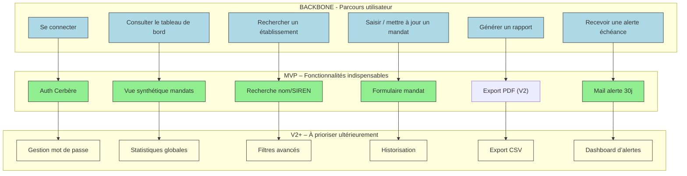

# 📚 Guide d’atelier Story Mapping – **admin_ep**  
*Document établi à partir des principes du Story Mapping de Jeff Patton*  

---  

[TOC]

---  

## 1️⃣ Introduction et objectifs  

**Livrable** : *« Représenter visuellement le périmètre fonctionnel d’admin_ep aligné sur le parcours utilisateur »*  

**Méthodologie** : Atelier **Story Mapping** (Jeff Patton)  

### Objectifs opérationnels  

| 🎯 Objectif | Pourquoi ? |
|---|---|
| **Comprendre collectivement le parcours cible de l’usager** | Aligner les équipes (produit, technique, métier) sur les étapes réelles de la saisie, de la consultation et de l’analyse des données. |
| **Identifier les fonctionnalités nécessaires à chaque étape** | Découvrir les besoins fonctionnels (authentification, import JORF, alertes, recherche, statistiques, archivage…). |
| **Prioriser pour définir un MVP fonctionnel** | Sélectionner les fonctionnalités indispensables pour livrer la première version exploitable. |
| **Créer un support visuel partagé** | Story Map exportée = référence pour le backlog, la roadmap et la communication inter‑équipes. |
| **Détecter les contraintes réglementaires & techniques** | Intégrer les exigences DICT, les versions de Tomcat/Postgres, la sécurité Cerbère, etc. |

---  

## 2️⃣ Contexte d’usage  

| Élément | Valeur (extraits des documents) |
|---|---|
| **Type de livrable** | Standard ✅ |
| **Nature** | Atelier 🤝 « Imaginer une solution » |
| **Méthode** | Story Mapping (Jeff Patton) |
| **Quand l’utiliser** | <ul><li>Traduire recherche utilisateur + réglementation + vision produit en périmètre fonctionnel</li><li>Cadrer un MVP, une V1 ou une refonte</li><li>Aligner équipes métier, technique et design</li></ul> |
| **Produit** | **admin_ep** – Administration des établissements publics |
| **Domaine métier** | Moyens généraux (Gestion des établissements publics du MTES‑MCT) |
| **Vision produit** | “Base de données partagée : recenser, enrichir et exploiter les listes des membres des conseils d’administration des établissements publics sous la tutelle du ministère.” |
| **Personas / Utilisateurs** | <ul><li>**SPES** – Service de pilotage et d’État‑service</li><li>**DG de tutelle** – Directeur général de tutelle</li><li>**Opérateurs** – Agents en charge de la saisie et du suivi</li></ul> |
| **Problèmes utilisateurs (jobs‑to‑be‑done)** | <ul><li>Rentrer manuellement des administrateurs</li><li>Importer automatiquement les mandats depuis le JORF</li><li>Suivre les échéances de mandat</li><li>Rechercher rapidement une personne ou un établissement</li><li>Produire des statistiques globales</li></ul> |
| **Contraintes réglementaires & techniques** | <ul><li>Évaluation DICT (07/09/2018)</li><li>Tomcat 10 & PostgreSQL 15 (montée de version)</li><li>Authentification via Cerbère (id 619)</li><li>Hébergement MSP – centre serveur ministériel Paris La Défense</li></ul> |
| **État actuel** | Conteneurisation en cours, IaaS, version 1.3.3 en prod (12/2021) |

> **Astuce** : Si un pré‑requis manque, prévoyez 15 min en début d’atelier pour le co‑construire rapidement.

---  

## 3️⃣ Pré‑requis  

| ✅ À préparer | Description |
|---|---|
| Vision produit formalisée (pitch, objectifs, métriques) | Ex. : “100 % des mandats sont à jour dans les 30 jours suivant la publication JORF.” |
| Personas & recherche utilisateurs synthétisés | Job‑stories, verbatims, cartes d’empathie. |
| Liste hiérarchisée des problèmes / jobs‑to‑be‑done | Priorisation pré‑atelier (ex. : import JORF > authentification > alertes). |
| Contraintes réglementaires ou techniques identifiées | DICT, versions de stack, exigences sécurité. |
| Support de facilitation (paperboard ou outil digital) | Post‑its 3 couleurs, tableau blanc **ou** Miro/FigJam avec template Story Map. |

---  

## 4️⃣ Parties prenantes et rôles  

| Rôle | Profil type | Responsabilité pendant l'atelier |
|---|---|---|
| **Animateur** | Chef de produit / PNM | Cadre, facilite, garde le focus utilisateur. |
| **Profil technique** | Tech Lead / Architecte | Évalue faisabilité, effort, dépendances (ex. : import JORF, Cerbère). |
| **Porteur métier** | MOA / Responsable métier | Valide la pertinence fonctionnelle et la priorisation. |
| **Designer UX/UI** *(optionnel)* | Designer produit | Enrichit le parcours, propose wireframes rapides. |
| **Opérateur / Utilisateur final** | Agent de saisie | Apporte le vécu terrain, valide les étapes du flux. |

> *Plusieurs rôles peuvent être cumulés selon les effectifs disponibles.*

---  

## 5️⃣ Logistique  

| Élément | Détails |
|---|---|
| **Durée** | 2 h 30 – 3 h (prévoir une pause à 1 h 30 si 3 h). |
| **Matériel physique** | Mur / tableau blanc, post‑its (action = jaune, donnée = rose, contrainte = bleu), marqueurs, ruban de masquage. |
| **Matériel digital** | Miro, FigJam, Mural ou Klaxoon avec le template “Story Map”. |
| **Livrable de sortie** | Photo/export de la Story Map, liste des décisions MVP, points de vigilance. |
| **Salle** | Disposition en U ou en cercle pour favoriser l’interaction. |

---  

## 6️⃣ Déroulé détaillé de l’atelier  

### 🎯 Étape 1 – Introduction (15 min)  

1. **Accueillir** les participants, présenter l’ordre du jour.  
2. **Rappeler** les objectifs et le principe du Story Map (backbone = parcours, activités = fonctionnalités, ligne de découpe = MVP).  
3. **Présenter** le contexte admin_ep (vision, utilisateurs, contraintes).  

> **Livrable** : Job‑story synthétique affichée, ex. :  
> *« En tant que **DG de tutelle**, je veux **visualiser les mandats expirant** afin de **prévenir les ruptures de gouvernance**. »  

### 🗺️ Étape 2 – Parcours utilisateur horizontal (30 min)  

| Action | Consigne |
|---|---|
| **Question** | « Quelles sont les grandes étapes que suit l’usager dans son flux ? » |
| **Méthode** | Chaque étape → post‑it (verbe d’action) → disposer de **gauche à droite**. |
| **Exemple de backbone admin_ep** | `Se connecter` → `Consulter le tableau de bord` → `Rechercher un établissement` → `Saisir / mettre à jour un mandat` → `Générer un rapport` → `Recevoir une alerte échéance` |

### 📋 Étape 3 – Détail vertical des activités (45 min)  

Pour chaque étape du backbone :  

| Question | Exemple de réponse |
|---|---|
| *« Que doit faire concrètement l’usager ici ? »* | “Filtrer les établissements par région”, “Déposer un fichier JORF”. |
| *« De quelles informations a‑t‑il besoin ? »* | “Code établissement”, “Nom du mandataire”. |
| *« Quels sont les points de friction potentiels ? »* | “Double saisie”, “Temps de latence du import JORF”. |

**Disposition** : Post‑its empilés **verticalement** sous chaque étape (du plus essentiel en bas à la granularité fine en haut).  
**Règle** : **Pas d’arbitrage** à ce stade – récoltez tout.

### 🎚️ Étape 4 – Priorisation & définition du MVP (30‑45 min)  

1. **Tracer** une **ligne de découpe** (horizontal) au‑dessus du backbone.  
2. **Au‑dessus** = fonctionnalités **indispensables** pour le MVP (MVP = capable de couvrir le parcours complet).  
3. **En‑dessous** = fonctionnalités **reportables** (V2, backlog).  

**Questions clés**  

| ✅ Oui | ❌ Non |
|---|---|
| *« Quelle fonctionnalité est absolument nécessaire pour que l’usager aille au bout ? »* | *« Peut‑elle être différée sans bloquer le flux ? »* |

**Exemple de découpe admin_ep**  

| MVP (indispensable) | V2 / backlog |
|---|---|
| Authentification Cerbère | Gestion des profils multi‑rôles |
| Import JORF automatisé | Historisation des imports |
| Saisie / mise à jour d’un mandat | Interface mobile |
| Alertes par mail des échéances | Tableau de bord analytique avancé |
| Recherche simple (nom, établissement) | Recherche plein texte avec filtres avancés |
| Export CSV du tableau de bord | API Rest pour intégration externe |

### 🏁 Étape 5 – Conclusion & prochaines étapes (15 min)  

1. **Relecture** collective de la Story Map → validation du parcours + du périmètre MVP.  
2. **Lister** les points de vigilance, questions ouvertes, dépendances (ex. : intégration Cerbère, migration Tomcat 10).  
3. **Plan d’action** :  
   - Formaliser le backlog (Epics → User Stories).  
   - Rédiger les critères d’acceptation pour les items MVP.  
   - Planifier les estimations techniques (story points).  
   - Décider du format d’export (photo, PDF, Mermaid).  

> **Action immédiate** : Exporter la Story Map (photo ou PNG) + diagramme Mermaid et la partager dans les 24 h (ex. : canal #admin_ep‑story‑map).  

---  

## 7️⃣ Conseils de facilitation  

| Bonnes pratiques | À éviter |
|---|---|
| Reformuler régulièrement pour garantir la clarté. | S’attarder sur les détails techniques dès le début. |
| Faire participer **tout le monde** (métiers, dev, design). | Laisser un profil dominer les discussions. |
| Utiliser le **time‑boxing** strict pour chaque étape. | Oublier de documenter les arbitrages (MVP vs backlog). |
| Ancrer chaque fonctionnalité dans un **besoin utilisateur**. | Confondre *nice‑to‑have* et *must‑have*. |
| Capturer les **contraintes réglementaires** dès le départ. | Ignorer les dépendances d’infrastructure (Tomcat, Postgres). |

---  

## 8️⃣ Exemple de Story Map (simplifiée)  

```markdown
Parcours utilisateur (axe horizontal →) :  
[Se connecter] — [Consulter le tableau de bord] — [Rechercher un établissement] — [Saisir / mettre à jour un mandat] — [Générer un rapport] — [Recevoir une alerte échéance]

Fonctionnalités associées (axe vertical ↓) :

► Se connecter
   • Authentification Cerbère (MVP)  
   • Gestion du mot de passe (V2)

► Consulter le tableau de bord
   • Vue synthétique des mandats actifs (MVP)  
   • Statistiques globales (V2)  
   • Export CSV (V2)

► Rechercher un établissement
   • Recherche par nom / SIREN (MVP)  
   • Filtres avancés (V2)  

► Saisir / mettre à jour un mandat
   • Formulaire de saisie (MVP)  
   • Validation des dates (MVP)  
   • Historisation des modifications (V2)

► Générer un rapport
   • Export PDF du tableau (V2)  

► Recevoir une alerte échéance
   • Notification mail 30 jours avant (MVP)  
   • Dashboard d’alertes (V2)
```

---  

## 9️⃣ Diagramme Mermaid du Story Map  



---  

## 10️⃣ Adaptations contextuelles  

| Contexte | Adaptation recommandée |
|---|---|
| **Refonte** | Partir du parcours existant (ex. : flux de connexion, import JORF) → identifier les frictions → proposer les améliorations. |
| **Produit réglementé** | Intégrer les exigences DICT, Cerbère, archivage légal comme **étapes obligatoires** du backbone. |
| **Multi‑personas** | Créer une Story Map par persona (DG de tutelle, Opérateur) puis dégager les **fonctionnalités transverses**. |
| **Contraintes techniques fortes** | Inviter le **Tech Lead** dès l’étape 3 (détail vertical) pour valider la faisabilité de l’import JORF et de la migration Tomcat 10. |
| **Priorisation d’échéances** | Mettre en avant les **alertes mandat** dès le MVP (risque de non‑conformité). |

---  

## 11️⃣ Livrables et suite du projet  

| Livrable immédiat | Contenu |
|---|---|
| **Story Map exportée** | Photo/PNG + diagramme Mermaid (ci‑dessus). |
| **Liste des fonctionnalités MVP** | Tableur (Epic → User Story) avec priorité, responsable, estimation initiale. |
| **Matrice de traçabilité** | Fonctionnalité ↔ Besoin utilisateur ↔ Contrainte réglementaire. |
| **Roadmap visuelle** | MVP → V1 → V2 (chronologie). |

### Prochaines étapes suggérées  

1. **Rédaction des User Stories** (format *As a [persona], I want [fonctionnalité] so that [benefice]*).  
2. **Maquettage** des écrans clés (connexion, tableau de bord, formulaire mandat).  
3. **Estimation technique** (story points, dépendances).  
4. **Planification des sprints** (MVP en 2 sprints, V1 en 3 sprints supplémentaires).  
5. **Mise en place du suivi de conformité** (checklist DICT, tests de sécurité Cerbère).  

---  

## 📖 Mini‑glossaire  

| Terme | Définition |
|---|---|
| **Backbone** | Axe horizontal du Story Map : séquence d’étapes du parcours utilisateur. |
| **Activities** | Items verticaux : actions, informations ou besoins liés à chaque étape. |
| **MVP** | Minimum Viable Product : ensemble de fonctionnalités indispensables pour livrer la première version exploitable. |
| **Epic** | Ensemble cohérent de User Stories (ex. : “Gestion des mandats”). |
| **Job Story** | Formulation du besoin : *“Quand [contexte], je veux [action] afin de [objectif]”.* |
| **DICT** | Déclaration d’Intérêt à la Conformité des Traitements (RGPD). |
| **Cerbère** | Système d’authentification centralisé de l’État. |

---  

## 12️⃣ Bibliographie  

- Patton, Jeff. **User Story Mapping: Discover the Whole Story, Build the Right Product**. O'Reilly Media, 2014.  

---  

*Fin du guide – prêt à être copié‑collé dans VS Code, Obsidian ou tout autre éditeur Markdown.*