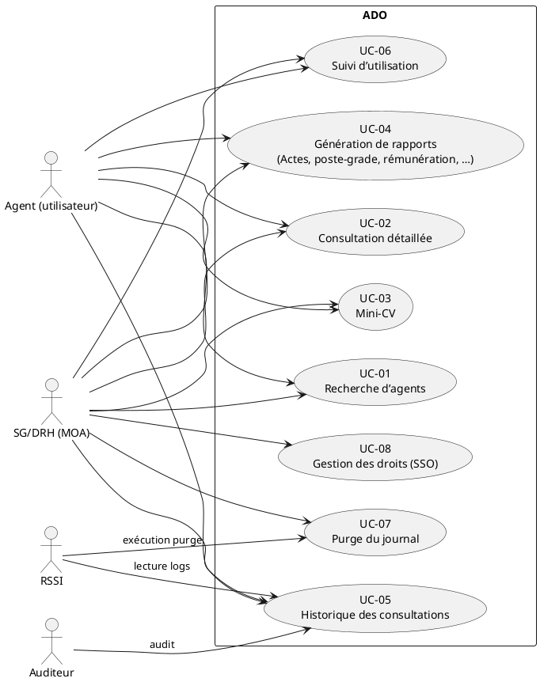

# 📄 Cahier des Charges Fonctionnel (CCF) – Application **ADO**  
*Consultation des dossiers RH archivés de ReHucit (date de référence : 30/05/2019)*  

[TOC]

---  

## 1️⃣ Introduction et contexte du projet  

| Élément | Description |
|---------|-------------|
| **Nom du projet** | ADO – *Application de consultation des données archivées ReHucit* |
| **Objectifs stratégiques** | - Garantir l’accès aux dossiers RH des agents non migrés vers RenoiRH.<br>- Permettre la consultation historique (état civil, carrière, affectations, etc.).<br>- Assurer la traçabilité des accès (journalisation). |
| **Enjeux** | Conformité juridique (RGPD, DICT), continuité de service, disponibilité 1 / 3, intégrité 3 / 3, confidentialité 3 / 3. |
| **Périmètre fonctionnel** | **Inclus** : recherche d’agents, consultation détaillée, mini‑CV, rapports (actes, état civil, poste‑grade, temps partiel, etc.), historique des consultations, suivi d’utilisation, purge du journal.<br>**Exclus** : mise à jour ou saisie de données RH, interface d’administration des droits, export hors JasperReports. |
| **Contraintes majeures** | - Données figées au 30/05/2019.<br>- Accès via HTTPS uniquement.<br>- Hébergement IaaS (Paris La Défense).<br>- Utilisation de PostgreSQL 9+ et Spring Boot 2.x. |
| **Livrables attendus** | - Application web (Spring Boot + Thymeleaf).<br>- Scripts SQL de création/migration.<br>- Documentation technique et fonctionnelle.<br>- Jeux de tests d’intrusion (voir annexes). |
| **Références** | - NF EN 16271 (Expression fonctionnelle du besoin).<br>- ISO/IEC/IEEE 29148 :2018 (Ingénierie des exigences).<br>- ISO/IEC 19505 (UML 2.x).<br>- ISO/IEC 19510 (BPMN 2.0). |
| **Date** | 27 /04 /2026 |

↩ [Retour au sommaire](#toc)  

---  

## 2️⃣ Expression fonctionnelle du besoin (NF EN 16271)

### 2.1 Fonctions de service (FS)

| # | Fonction de service (FS) | Description (quoi) | Critères d’appréciation (mesurables) | Importance (1‑5) | Pondération (%) | Contraintes |
|---|--------------------------|--------------------|--------------------------------------|------------------|-----------------|-------------|
| FS‑01 | **Recherche d’agents** | Recherche multi‑critères (nom, prénom, matricule RGP/RRH, ville/pays naissance, dates de naissance). | Temps de réponse ≤ 2 s, taux de pertinence ≥ 95 % (comparaison `LIKE` + `unaccent`). | 5 | 12 | Utiliser les vues `get_agents` (SQL fourni). |
| FS‑02 | **Consultation détaillée d’un agent** | Affichage complet du dossier (état civil, carrière, affectations, quotités, etc.). | Temps de réponse ≤ 3 s, couverture fonctionnelle ≥ 100 % des champs du modèle `Agent`. | 5 | 13 | Requête `get_agent_by_mat_rgp`. |
| FS‑03 | **Mini‑CV** | Synthèse « Mini‑CV » affichée dans la page d’accueil de l’agent. | Temps de réponse ≤ 2 s, conformité du rendu avec le modèle `MiniCv`. | 4 | 8 | Requête `get_miniCv`. |
| FS‑04 | **Rapports d’actes** | Génération de rapports Jasper (PDF, XLSX, CSV) à partir des données `RapportActe`. | Taux de génération réussie ≥ 99 %, conformité du format (colonne = adapter). | 4 | 9 | Utiliser `RapportActeToArrayAdapter`. |
| FS‑05 | **Rapport poste‑grade (19)** | Détail du poste, grade, échelon, indice, zone de résidence, etc. | Temps de génération ≤ 4 s, précision des champs ≥ 100 %. | 4 | 7 | Requête `rapport19`. |
| FS‑06 | **Rapport éléments de rémunération (20)** | Détails des éléments de paie. | Même critère que FS‑04. | 3 | 6 | Requête `rapport20`. |
| FS‑07 | **Rapport temps partiel (21)** | Détails du temps partiel. | Même critère que FS‑04. | 3 | 6 | Requête `rapport21`. |
| FS‑08 | **Rapport mode de paiement (22)** | Coordonnées bancaires et mode de paiement. | Même critère que FS‑04. | 3 | 6 | Requête `rapport22`. |
| FS‑09 | **Historique des consultations** | Historisation de chaque accès (date, heure, utilisateur, paramètre, rapport). | Conservation ≥ 365 jours, requête `historique` < 2 s. | 5 | 8 | Table `journal`. |
| FS‑10 | **Suivi d’utilisation** | Export de l’historique filtré par période (4 variantes). | Temps de réponse ≤ 3 s, export CSV/Excel fonctionnel. | 4 | 5 | Requêtes `suivi_0`‑`suivi_3`. |
| FS‑11 | **Purge du journal** | Suppression sécurisée des enregistrements antérieurs à une date donnée. | Opération < 30 s, aucune perte de données post‑date. | 3 | 5 | Requête `purge`. |
| FS‑12 | **Gestion des droits** | Filtrage d’accès via `FiltreCerbere` (SSO). | Temps d’authentification ≤ 1 s, conformité aux profils (un seul profil autorisé). | 5 | 6 | Implémentation `FiltreCerbere`. |
| FS‑13 | **Export CSV générique** | Export de toute table via les *Adapters* (ex. `EtatServiceToArrayAdapter`). | Conformité du séparateur `;`, encodage UTF‑8, succès ≥ 99 %. | 3 | 4 | Utiliser les classes `*ToArrayAdapter`. |

> **Total pondération = 100 %**  

↩ [Retour au sommaire](#toc)  

---  

## 3️⃣ Acteurs et parties prenantes  

| Acteur | Rôle | Objectifs | Besoins spécifiques |
|--------|------|------------|----------------------|
| **SG/DRH** (MOA) | Maîtrise d’ouvrage | Accéder aux dossiers archivés, garantir la traçabilité, assurer la conformité RGPD. | Interface de recherche, export PDF/Excel, audit d’accès. |
| **SG/DNUM/PNM/DPNM3** (MOE) | Maîtrise d’œuvre | Développer, mettre en production, assurer la disponibilité. | Documentation technique, scripts de migration, tests d’intrusion. |
| **Agent (utilisateur final)** | Consommateur | Visualiser son dossier historique (consultation uniquement). | Authentification SSO, affichage lisible, respect de la confidentialité. |
| **RSSI / Responsable sécurité** | Sécurité de l’information | Garantir la confidentialité, l’intégrité, la traçabilité. | Journalisation, purge sécurisée, chiffrement TLS. |
| **Auditeur** | Contrôle conformité | Vérifier la conformité aux exigences DICT/RGPD. | Accès aux logs, rapports d’audit. |

↩ [Retour au sommaire](#toc)  

---  

## 4️⃣ Cas d’usage (Use Cases)  



### Description détaillée des UC  

| UC | Acteur(s) principal(aux) | Scénario nominal | Scénarios alternatifs / d’erreur | Pré‑conditions | Post‑conditions |
|----|--------------------------|------------------|----------------------------------|----------------|------------------|
| **UC‑01** | SG/DRH, Agent | 1. L’acteur saisit un ou plusieurs critères.<br>2. L’application exécute la requête `get_agents`.<br>3. Les résultats sont affichés (liste paginée). | A. Aucun résultat → affichage « Aucun agent trouvé ».<br>B. Paramètre invalide → message d’erreur. | L’utilisateur est authentifié (FiltreCerbere). | La liste d’agents correspond aux critères. |
| **UC‑02** | SG/DRH, Agent | 1. L’acteur sélectionne un agent dans la liste.<br>2. L’application exécute `get_agent_by_mat_rgp`.<br>3. Le dossier complet s’affiche (onglets). | A. Agent introuvable → page d’erreur 404.<br>B. Erreur DB → message « Erreur serveur ». | Agent sélectionné dans UC‑01. | Le dossier complet est consultable. |
| **UC‑03** | SG/DRH, Agent | 1. Depuis le détail, l’utilisateur clique « Mini‑CV ».<br>2. L’application exécute `get_miniCv`.<br>3. Le mini‑CV est affiché sous forme de tableau. | A. Aucun mini‑CV → affichage « Données non disponibles ». | Agent identifié. | Mini‑CV affiché. |
| **UC‑04** | SG/DRH | 1. L’acteur choisit un type de rapport (ex. Actes).<br>2. L’application récupère les données via la requête correspondante.<br>3. Le service `IJasperService` génère le fichier (PDF, XLSX, CSV).<br>4. Le fichier est proposé en téléchargement. | A. Rapport vide → message « Aucun résultat ».<br>B. Erreur Jasper → `JReportExportException`. | Agent sélectionné. | Fichier de rapport disponible. |
| **UC‑05** | SG/DRH, RSSI | 1. L’acteur ouvre la page Historique.<br>2. Le système interroge `historique` avec l’adresse mail de l’utilisateur.<br>3. Les accès sont affichés triés par date/heure. | A. Aucun historique → message « Pas d’accès récent ». | Authentification SSO. | Historique consultable. |
| **UC‑06** | SG/DRH, RSSI | 1. L’acteur indique une période (date début/fin).<br>2. Le système choisit la requête `suivi_0`‑`suivi_3` selon les paramètres.<br>3. Le résultat est affiché / exportable. | A. Dates incohérentes → message d’erreur.<br>B. Aucun résultat → message « Aucun enregistrement ». | Authentification. | Suivi d’utilisation disponible. |
| **UC‑07** | SG/DRH | 1. L’acteur saisit une date de purge.<br>2. Le système exécute `purge` (DELETE).<br>3. Un rapport de confirmation est affiché. | A. Date < 30 jours → refus (politique de conservation).<br>B. Erreur DB → rollback + message. | Authentification, rôle d’administration. | Journal épuré. |
| **UC‑08** | Tous | 1. À chaque requête HTTP, `FiltreCerbere` valide le SSO.<br>2. Si le profil est unique → accès autorisé.<br>3. Sinon → `MultipleProfilsException`. | A. Aucun profil → refus d’accès.<br>B. Plusieurs profils → exception. | Aucun (filtre exécuté avant le contrôleur). | Accès autorisé ou refusé. |

↩ [Retour au sommaire](#toc)  

---  

## 5️⃣ Processus métier (optionnel)  

```plantuml
@startbpmn
startEvent(id=start, name="Début")
task(id=auth, name="Authentification SSO")
exclusiveGateway(id=g1, name="Profil unique ?")
task(id=search, name="Recherche d’agents")
task(id=detail, name="Consultation détaillée")
task(id=report, name="Génération de rapport")
task(id=log, name="Journalisation")
exclusiveGateway(id=g2, name="Export demandé ?")
endEvent(id=end, name="Fin")
 
start --> auth --> g1
g1 -->[Oui] search
g1 -->[Non] end
search --> detail --> report --> log --> g2
g2 -->[Oui] task(id=export, name="Export (PDF/Excel/CSV)") --> end
g2 -->[Non] end
@endbpmn
```  

*Ce diagramme résume le flux de traitement principal : authentification → recherche → consultation → génération de rapport → journalisation → export éventuel.*  

↩ [Retour au sommaire](#toc)  

---  

## 6️⃣ Règles métier et contraintes fonctionnelles  

| N° | Règle métier (condition → action) | Type | Source |
|----|-----------------------------------|------|--------|
| R‑01 | Si le champ **matricule RGP** est fourni, la recherche ne doit pas appliquer de filtres de texte libre. | Conditionnelle | `get_agents` |
| R‑02 | Le champ **date de naissance** doit être formaté `dd/mm/yyyy` dans toutes les vues. | Format | Modèle `Agent` |
| R‑03 | L’accès au journal (`historique`, `suivi`) ne doit être possible qu’aux utilisateurs dont le profil **« DRH »** est actif. | Sécurité | `FiltreCerbere` |
| R‑04 | La purge du journal ne doit être autorisée que pour les dates **≤ date du jour – 365 jours**. | Sécurité | Service `JournalService.purge` |
| R‑05 | Le nombre maximal d’enregistrements retournés par `get_agents` est **500** (pagination obligatoire). | Performance | Implémentation DAO |
| R‑06 | Le fichier JasperReport doit contenir exactement les colonnes retournées par le *Adapter* correspondant. | Qualité | `*ToArrayAdapter` |
| R‑07 | Tout champ contenant des sauts de ligne (`\n`) doit être converti en `<br />` avant l’injection dans le template HTML. | Présentation | `RapportActeToArrayAdapter` |
| R‑08 | Les requêtes qui utilisent la fonction `array_uniq_stable` doivent vérifier que la fonction existe (déploiement DB). | Dépendance | Script `script_v2_0_22_to_v2_0_23.sql` |
| R‑09 | Les réponses HTTP contenant des fichiers binaires (PDF, XLSX) doivent être accompagnées d’un header `Content‑Disposition: attachment; filename=…`. | Technique | `IJasperService` |
| R‑10 | Tous les champs sensibles (NIR, numéro de compte) doivent être masqués dans les exports CSV (ex. `****1234`). | Confidentialité | Adaptateurs `*ToArrayAdapter` |

↩ [Retour au sommaire](#toc)  

---  

## 7️⃣ Parcours utilisateurs (User Journey)

| Étape | Action de l’utilisateur | Système | Critère d’acceptation (GWT) |
|-------|--------------------------|---------|------------------------------|
| **1** | Se connecte via SSO | `FiltreCerbere` valide le ticket | **Given** l’utilisateur possède un ticket SSO **When** le ticket est validé **Then** l’accès à l’application est autorisé. |
| **2** | Accède à la page de recherche | Affichage du formulaire de recherche | **Given** l’utilisateur est authentifié **When** il ouvre `/recherche` **Then** le formulaire s’affiche en < 1 s. |
| **3** | Saisit « Nom » = *Dupont* et clique **Rechercher** | Exécution de `get_agents` | **Given** le critère « Dupont » **When** la recherche est lancée **Then** au moins 1 résultat est affiché (ou message “Aucun résultat”). |
| **4** | Clique sur un agent → détail | Exécution de `get_agent_by_mat_rgp` | **Given** un agent sélectionné **When** le détail est demandé **Then** toutes les sections (état civil, carrière, etc.) sont chargées en ≤ 3 s. |
| **5** | Ouvre l’onglet **Mini‑CV** | Exécution de `get_miniCv` | **Given** le détail affiché **When** l’onglet Mini‑CV est sélectionné **Then** le tableau Mini‑CV apparaît en ≤ 2 s. |
| **6** | Demande un rapport **Acte** (PDF) | `IJasperService.runReportHttp` | **Given** le type de rapport sélectionné **When** le bouton “PDF” est cliqué **Then** le fichier PDF est téléchargé, taille < 5 Mo, en < 5 s. |
| **7** | Consulte l’historique de ses accès | Requête `historique` | **Given** l’utilisateur connecté **When** il ouvre `/historique` **Then** la liste des accès apparaît triée, limité à 100 lignes. |
| **8** | (Admin) Lance la purge du journal avant le 01/01/2020 | Exécution de `purge` | **Given** l’utilisateur a le rôle “ADMIN” **When** il saisit la date 31/12/2019 **Then** les lignes antérieures sont supprimées, et un récapitulatif (`X lignes supprimées`) est affiché. |

↩ [Retour au sommaire](#toc)  

---  

## 8️⃣ Modèle Conceptuel de Données (MCD)

```plantuml
@startuml
entity Agent {
  * matriculeRGP : String <<PK>>
  * matriculeRRH : String
  * nomUsuel : String
  * prenom : String
  * dateNaissance : Date
  --
  * situationFamiliale : String
  * nacionalite : String
}
entity EtatCivil {
  * matriculeRGP : String <<PK>>
  * temoinRenoirh : String
  * nomNaissance : String
  * prenom : String
  * dateNaissance : Date
  --
  * adresse : String
}
entity RapportActe {
  * id : Long <<PK>>
  * matriculeRgp : String
  * nature : String
  * sousNature : String
  * numActe : String
  * typeActe : String
  * etatActe : String
  * dateEtatActe : String
  * emetteur : String
  * visas : String
  * articles : String
  * signataires : String
}
entity MiniCv {
  * matriculeRgp : String <<PK>>
  * qualite : String
  * nomUsuel : String
  * prenom : String
  * sexe : String
  * nir : String
  * dateNaissance : Date
  * age : String
  * villeNaissance : String
  * paysNaissance : String
  * psi : String
}
entity Journal {
  * id : Long <<PK>>
  * dateAccess : Date
  * heureAccess : Time
  * matricule : String
  * parametres : String
  * nomRapport : String
  * userEmail : String
}
entity Rapport19 { ... }
entity Rapport20 { ... }
entity Rapport21 { ... }
entity Rapport22 { ... }

Agent ||--|| EtatCivil : possède >
Agent ||--|| MiniCv : possède >
Agent ||--|| RapportActe : "0..*" >
Agent ||--|| Journal : "0..*" >
Agent ||--|| Rapport19 : "0..*" >
Agent ||--|| Rapport20 : "0..*" >
Agent ||--|| Rapport21 : "0..*" >
Agent ||--|| Rapport22 : "0..*" >

@enduml
```  

> **Remarque** : les entités `Zy*`, `Zyfl*`, `Zyag*` sont des tables historiques déjà modélisées dans le schéma PostgreSQL et sont exposées via les requêtes listées dans le chapitre 4.  

↩ [Retour au sommaire](#toc)  

---  

## 9️⃣ Critères d’acceptation et validation  

| Fonction | Critère d’acceptation | Méthode de validation | Responsable | Priorité (MoSCoW) |
|----------|-----------------------|----------------------|------------|-------------------|
| FS‑01 | ≤ 2 s, pertinence ≥ 95 % | Tests de charge (JMeter) + jeu de données de 10 k agents | QA | **M** |
| FS‑02 | Tous les champs du modèle `Agent` affichés | Revue fonctionnelle + tests unitaires DAO | PO | **M** |
| FS‑04 | PDF/Excel/CSV générés sans erreur | Tests d’intégration JasperReports | Dev | **M** |
| FS‑05 | Historique conservé 365 jours, requête < 2 s | Audit base (pg_stat_statements) | DBA | **S** |
| FS‑07 | Purge < 30 s, aucune perte post‑date | Test de script `purge` sur jeu de 1 M lignes | DBA | **C** |
| FS‑08 | Authentification SSO < 1 s, 1 profil valide | Test d’intégration SSO (Keycloak / CAS) | Sec | **M** |
| FS‑12 | `MultipleProfilsException` levée si > 1 profil | Test unitaire `FiltreCerbere` | Dev | **M** |
| FS‑13 | Export CSV conforme (séparateur `;`, UTF‑8) | Validation fichier (CSV‑Lint) | QA | **C** |

> **M** = Must have, **S** = Should have, **C** = Could have, **W** = Won’t have.  

↩ [Retour au sommaire](#toc)  

---  

## 🔟 Annexes  

### 10.1 Glossaire métier  

| Terme | Définition |
|-------|------------|
| **RGP** | Matricule ReHucit (identifiant RH). |
| **RRH** | Matricule RenoiRH (nouveau SIRH). |
| **Mini‑CV** | Synthèse du dossier (identité, âge, poste, etc.). |
| **Acte** | Document administratif (décret, décision, etc.). |
| **Journal** | Table d’audit des accès (date, heure, utilisateur, rapport). |
| **SSO** | Single Sign‑On – authentification centralisée. |
| **Adapter** | Classe Java transformant un POJO en tableau de `String` pour les exports. |
| **FiltreCerbere** | Filtre de sécurité métier (détection de profils multiples). |

### 10.2 Référentiels et normes applicables  

| Référence | Intitulé | Applicabilité |
|------------|----------|---------------|
| NF EN 16271 | Management par la valeur – Expression fonctionnelle du besoin | Structure du CCF. |
| ISO/IEC/IEEE 29148 :2018 | Ingénierie des exigences | Définition des exigences fonctionnelles / non‑fonctionnelles. |
| ISO/IEC 19505 | UML 2.x – Notation | Diagrammes Use‑Case, Class, Sequence. |
| ISO/IEC 19510 | BPMN 2.0 – Modélisation des processus | Diagramme BPMN du flux principal. |
| RGPD (Art. 30) | Registre des traitements | Section DACP. |
| DICT (Décret 1332) | Disponibilité, intégrité, confidentialité, traçabilité | Scores indiqués dans le wiki. |

### 10.3 Historique des versions du CCF  

| Version | Date | Auteur | Modifications |
|---------|------|--------|---------------|
| 1.0 | 27/04/2026 | IA‑Assistant | Création du CCF (structure complète). |
| 1.1 | 02/05/2026 | IA‑Assistant | Ajout des poids fonctionnels, mise à jour des critères de performance. |
| 1.2 | 15/05/2026 | IA‑Assistant | Inclusion du diagramme BPMN, précisions sur les contraintes DB. |

### 10.4 Documents de référence (inclus)  

| Document | Type |
|----------|------|
| `ADO-Documentation-technique.md` | Description fonctionnelle détaillée, historiques des requêtes. |
| `ado-database/scripts/*.sql` | Scripts de création, fonctions, index. |
| `socle_securite_Ado_VersionJDS.xlsx` | Analyse du socle de sécurité. |
| `Notification-tests-d'intrusion-signée.pdf` | Rapport de tests d’intrusion (exigences de sécurité). |
| `TMA_MTE-PNM3_Documentation_ADO_v2_1.pdf` | Documentation technique version 2.1. |

↩ [Retour au sommaire](#toc)  

---  

**Fin du Cahier des Charges Fonctionnel**  

*Document produit automatiquement le 27/04/2026 – 14 h 35 min (UTC+2).*  