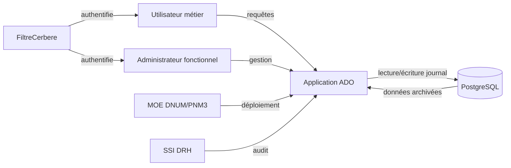

# 📄 Cahier des Charges Fonctionnel (CCF) – **ADO**  
**Version 1.0 – 27/04/2026**  

[TOC]

---  

## 1️⃣ Introduction et contexte du projet  

| Élément | Description |
|--------|-------------|
| **Intitulé** | Application **ADO** – Consultation des dossiers RH archivés (ReHucit) |
| **Objectif principal** | Permettre aux services centraux de la DRH de consulter, sous forme d‑interface web, les données RH des agents telles qu’elles existaient le **30/05/2019** (avant la migration vers RenoiRH). |
| **Enjeux** | • Garantir la continuité d’accès aux dossiers non migrés  <br>• Respecter les exigences de **confidentialité, intégrité et traçabilité** (DICT 1332) <br>• Fournir des rapports conformes aux exigences légales (RGPD, archivage). |
| **Périmètre fonctionnel** | **Inclus** : recherche d’agents, affichage détaillé du profil, génération de Mini‑CV et de 10 + rapports (conjoint, enfants, état civil, actes, poste/grade, rémunération, temps partiel, mode de paiement, etc.), historique d’accès, suivi d’utilisation, purge des journaux. <br>**Exclu** : toute modification ou création de données RH (application en **lecture seule**). |
| **Environnement** | - **Spring Boot 2.x** (Java 11/17) <br>- **PostgreSQL** (scripts versionnés) <br>- **JasperReports** pour l’export (PDF, XLSX, CSV, DOCX…) <br>- Déploiement IaaS (Paris La Défense) – production 24/7. |
| **Livrables attendus** | 1. Application web fonctionnelle (WAR)  <br>2. Scripts d’installation (SQL + Assembly)  <br>3. Documentation technique & fonctionnelle  <br>4. Jeux de tests d’acceptation (BDD)  <br>5. Rapport de conformité sécurité (RGPD, DICT). |
| **Contraintes** | - Authentification unique via **FiltreCerbere** (SSO/LDAP). <br>- Un seul profil autorisé par utilisateur (exception : `MultipleProfilsException`). <br>- Toutes les exportations doivent être traçables dans la table `journal`. <br>- Respect du **RGPD** (données à caractère personnel). |
| **Planning indicatif** | - **T0** : Analyse fonctionnelle (actuel) <br>- **T1** : Développement & tests unitaires (8 semaines) <br>- **T2** : Tests d’intégration & conformité (2 semaines) <br>- **T3** : Recette MOA – mise en production (1 semaine). |

---  

## 2️⃣ Expression fonctionnelle du besoin (NF EN 16271)  

> **Principe** : chaque fonction de service décrit le **« quoi »** (besoin) sans préciser le **« comment »** (solution).  

| N° | Fonction de service (FS) | Description (quoi) | Critères d’appréciation (mesurables) | Pondération* | Contraintes |
|---|---------------------------|--------------------|--------------------------------------|--------------|-------------|
| **FS‑01** | **Recherche d’agents** | Permettre à l’utilisateur de rechercher des agents par **nom, prénom, matricule RGP/RRH, ville/pays de naissance, dates de naissance, intervalle de naissance**. | - Temps de réponse ≤ 2 s pour un jeu de 10 000 enregistrements. <br>- Résultats paginés (max 50 lignes/page). | 15% | Recherche insensible à la casse & aux accents. |
| **FS‑02** | **Affichage détail agent** | Fournir, en lecture seule, l’ensemble des informations liées à l’agent (identité, affectations, positions, carrière, quotités, historiques, enfants, etc.). | - Tous les champs décrits dans le **modèle conceptuel** sont affichés. <br>- Aucun champ sensible (ex. : mot de passe) n’est exposé. | 12% | Respect du **RGPD** – masquage du NIR hors besoins métier. |
| **FS‑03** | **Mini‑CV** | Générer un Mini‑CV (PDF/HTML) à la demande de l’utilisateur, contenant les données essentielles de l’agent. | - PDF génération ≤ 3 s. <br>- Conformité au modèle `MiniCv` (13 colonnes). | 10% | Utiliser les *adapters* `MiniCvToArrayAdapter`. |
| **FS‑04** | **Rapports RH (10 + types)** | Produire les rapports suivants : Conjoint, Enfants‑parents, État civil, Actes, Poste/Grade, Éléments de rémunération, Temps partiel, Mode de paiement, Historique, etc., en plusieurs formats (PDF, XLSX, CSV, DOCX). | - Format choisi correctement rendu (vérif. BDD). <br>- Temps de génération ≤ 5 s. | 20% | Utilisation de `IJasperService` & `JRepOutputFormats`. |
| **FS‑05** | **Historique d’accès (journal)** | Enregistrer chaque accès (date, heure, utilisateur, agent consulté, type de rapport) dans la table `journal`. | - 100 % des actions de consultation sont tracées. <br>- Table `journal` rétinable (partition 1 ans). | 8% | Conformité à la **politique de traçabilité** (DICT 1332). |
| **FS‑06** | **Suivi d’utilisation** | Permettre aux administrateurs de visualiser les accès filtrés par période (date début/fin). | - Recherche d’historique ≤ 2 s. <br>- Export possible (CSV). | 6% | Accès limité aux profils **ADMIN**. |
| **FS‑07** | **Purge des journaux** | Supprimer les entrées de `journal` antérieures à une date de rétention définie (ex. : 1 an). | - Opération réussie à 100 % sans perte de données récentes. <br>- Durée ≤ 30 s. | 4% | Action réservée au profil **ADMIN** avec confirmation. |
| **FS‑08** | **Gestion des profils** | Vérifier qu’un utilisateur possède **un seul** profil fonctionnel (MOA/MOE/ADMIN). | - Levée d’`MultipleProfilsException` si > 1 profil. | 5% | Implémenté dans `MultipleProfilsException`. |
| **FS‑09** | **Sécurisation des accès** | Authentifier chaque requête via le filtre `FiltreCerbere`. | - 0 % d’accès non authentifié. <br>- Journaux d’erreurs SSO enregistrés. | 10% | Filtre appliqué à `/*`. |
| **FS‑10** | **Disponibilité** | Garantir une disponibilité ≥ 99,5 % (excluant fenêtres de maintenance). | - KPI mensuel de disponibilité ≥ 99,5 %. | 10% | Hébergement IaaS, monitoring. |

\* Pondération exprimée en pourcentage du score global (somme = 100 %).  

---  

## 3️⃣ Acteurs et parties prenantes  

| Rôle | Description | Besoins spécifiques |
|------|-------------|----------------------|
| **Utilisateur métier** (services d’administration centrale) | Recherche et consultation des dossiers agents. | Accès rapide, affichage complet, export de rapports. |
| **Administrateur fonctionnel** (SG/DRH) | Gestion des droits, purge des journaux, suivi d’utilisation. | Contrôle d’accès, audit, suppression sécurisée. |
| **MOE** (SG/DNUM/PNM/DPNM3) | Développement, maintenance, support technique. | Accès au code source, environnement de test, logs applicatifs. |
| **SSI** (Responsable Sécurité SI) | Validation conformité sécurité (RGPD, DICT). | Traçabilité, chiffrement, contrôle des profils. |
| **Système d’authentification** (FiltreCerbere) | Fournit le SSO (LDAP/SSO) et le profil utilisateur. | Authentification unique, propagation du **identifiant**. |
| **Base de données** (PostgreSQL) | Stocke les tables archivées (`etat_civil`, `affectation`, …) et le journal. | Disponibilité, intégrité, indexation (ex. : `nudoss`). |

### Cartographie des parties prenantes  



---  

## 4️⃣ Cas d’usage (Use Cases)  

### 4.1 Diagramme de cas d’utilisation (UML 2.x)  

```mermaid
%%{init: {'theme':'base', 'themeVariables': { 'primaryColor': '#003366', 'edgeLabelBackground':'#fff' }}%%%%%%%%%%%%%%%%%%%%%%%%}%%
useCaseDiagram;
    title ADO – Cas d’usage;
    actor Utilisateur as U;
    actor Administrateur as A;
    actor SSO as S;
    U --> (Rechercher agents)
    U --> (Consulter détail agent)
    U --> (Générer Mini‑CV)
    U --> (Générer rapport)
    U --> (Télécharger rapport)

    A --> (Consulter historique)
    A --> (Suivi d’utilisation)
    A --> (Purge journaux)

    S --> (Authentifier requête)
```

### 4.2 Description détaillée des cas d’usage  

| UC‑ID | Nom du cas d’usage | Acteur(s) principal(aux) | Scénario nominal (Given/When/Then) | Scénarios alternatifs / d’erreur | Pré‑conditions | Post‑conditions |
|-------|-------------------|--------------------------|-----------------------------------|----------------------------------|----------------|-------------------|
| **UC‑01** | Recherche d’agents | Utilisateur | **Given** l’utilisateur est authentifié <br>**When** il saisit un critère (ex. : nom ou matricule) et lance la recherche <br>**Then** le système renvoie la liste paginée des agents correspondants (≤ 2 s). | *UC‑01‑E1* : Aucun résultat → affichage « Aucun agent trouvé ». <br>*UC‑01‑E2* : Paramètre vide → recherche sur tous les agents (limité à 100 résultats). | FiltreCerbere validé, connexion DB active. | La requête est tracée dans `journal` (action *search*). |
| **UC‑02** | Consultation détail agent | Utilisateur | **Given** l’utilisateur a sélectionné un agent dans les résultats <br>**When** il clique sur “Voir détail” <br>**Then** le système affiche toutes les sections (identité, carrières, affectations, etc.) au format lecture‑seule. | *UC‑02‑E1* : Agent introuvable (concurrence) → message d’erreur « Agent non disponible ». | Agent identifié (matricule RGP). | Journalisation de l’accès (`journal`). |
| **UC‑03** | Générer Mini‑CV | Utilisateur | **Given** le détail agent affiché <br>**When** l’utilisateur clique “Télécharger Mini‑CV” <br>**Then** le système crée le PDF via `IJasperService` et le propose en téléchargement. | *UC‑03‑E1* : Erreur Jasper → affichage `JReportExportException`. | Données du Mini‑CV disponibles. | Journalisation du téléchargement. |
| **UC‑04** | Générer rapport (type X) | Utilisateur | **Given** le détail agent affiché <br>**When** l’utilisateur choisit un type de rapport et le format souhaité <br>**Then** le service `*ReportService*` récupère les données, invoque le `JasperService`, produit le fichier et le propose. | *UC‑04‑E1* : Format non supporté → message d’erreur. <br>*UC‑04‑E2* : Données manquantes → rapport partiel avec mention “non disponible”. | Rapport requis existant dans la base. | Journalisation (`journal`). |
| **UC‑05** | Consulter historique d’accès | Administrateur | **Given** l’administrateur est authentifié <br>**When** il indique une adresse email et lance la recherche <br>**Then** le système renvoie la liste chronologique des accès (date, heure, agent, type). | *UC‑05‑E1* : Aucun historique → “Aucun enregistrement”. | Adresse email valide. | Aucun changement persistant. |
| **UC‑06** | Suivi d’utilisation (période) | Administrateur | **Given** l’administrateur possède le profil ADMIN <br>**When** il indique une période (début, fin) <br>**Then** le système renvoie les accès filtrés, avec possibilité d’export CSV. | *UC‑06‑E1* : Période invalide → message d’erreur. | Profil ADMIN validé. | Aucun impact sur les données. |
| **UC‑07** | Purge des journaux | Administrateur | **Given** le profil ADMIN <br>**When** il saisit une date de rétention et confirme la purge <br>**Then** le système supprime toutes les lignes antérieures à la date, retourne le nombre de lignes supprimées. | *UC‑07‑E1* : Date postérieure à aujourd’hui → refus. | Confirmation explicite (checkbox). | Nettoyage effectué, journal mis à jour. |
| **UC‑08** | Gestion des profils (vérif.) | SSO/FiltreCerbere | **Given** un utilisateur authentifié <br>**When** le filtre charge le profil <br>**Then** il vérifie qu’un seul profil est présent ; sinon lève `MultipleProfilsException`. | *UC‑08‑E1* : Plusieurs profils → exception renvoyée, accès refusé. | Authentification réussie. | Aucun accès autorisé si exception. |

---  

## 5️⃣ Processus métier (optionnel)  

### 5.1 Diagramme BPMN – Flux de génération d’un rapport  

```mermaid
%%{init: {'theme':'base', 'themeVariables': { 'primaryColor': '#006400', 'edgeLabelBackground':'#fff' }}%%%%%%%%%%%%%%%%%%%%%%%%}%%
bpmnDiagram;
    participant Utilisateur;
    participant Application;
    participant JasperService;
    participant BaseDeDonnées;
    startEvent(start)
    --> task1[Recherche agent]
    --> task2[Choix du type de rapport]
    --> gateway1{Données disponibles ?}
    gateway1 -- Oui --> task3[Appel à ReportService]
    task3 --> task4[Invocation JasperService (format choisi)]
    task4 --> task5[Export fichier]
    task5 --> endEvent(end)

    gateway1 -- Non --> task6[Message “Données manquantes”]
    task6 --> endEvent(end)

    task1 --> BaseDeDonnées;
    task3 --> BaseDeDonnées
```

---  

## 6️⃣ Règles métier et contraintes fonctionnelles  

| # | Règle métier (formulation conditionnelle) | Source / Référence |
|---|-------------------------------------------|--------------------|
| **R‑01** | **Si** l’utilisateur possède plus d’un profil fonctionnel **alors** l’accès à l’application doit être bloqué et `MultipleProfilsException` levée. | `MultipleProfilsException.java` |
| **R‑02** | **Si** un agent n’est pas présent dans les tables archivées **alors** le bouton « Voir détail » doit être désactivé. | UI / service `AgentServiceImpl` |
| **R‑03** | **Si** le format de sortie demandé n’est pas supporté par `JRepOutputFormats` **alors** le service renvoie une erreur 415 « Unsupported Media Type ». | `IJasperService` |
| **R‑04** | **Si** la date de purge ≤ aujourd’hui **alors** la suppression est autorisée (défaut : 1 an). | `JournalService.purge` |
| **R‑05** | **Si** le champ `temoin_renoirh` = ‘1’ (agent déjà migré) **alors** l’accès aux rapports doit être limité aux données archivées (pas de données en production). | Table `etat_civil.temoin_renoirh` |
| **R‑06** | **Si** le registre `journal` dépasse 12 mois **alors** il doit être archivé (hors périmètre fonctionnel). | Politique de rétention DICT |
| **R‑07** | **Si** l’utilisateur n’est pas authentifié par `FiltreCerbere` **alors** la requête HTTP doit être rejetée (401 Unauthorized). | Filtre `FiltreCerbere` |
| **R‑08** | **Si** un champ contient des caractères accentués **alors** la recherche doit être effectuée avec `unaccent` et `upper`. | Requête `get_agents` (SQL) |
| **R‑09** | **Si** le rapport nécessite la fonction `array_uniq_stable` **alors** elle doit être présente en base (déploiement script `script_v2_0_22_to_v2_0_23.sql`). | Documentation technique |

---  

## 7️⃣ Parcours utilisateurs (User Journey)  

| Étape | Action utilisateur | Système | Point de contrôle |
|-------|--------------------|---------|-------------------|
| **1** | S’authentifier via SSO (FiltreCerbere). | Validation du ticket, attribution du profil. | `FiltreCerbere` – 401 si échec. |
| **2** | Accéder à la page d’accueil → formulaire de recherche. | Affichage du formulaire (HTML + Thymeleaf). | Aucun. |
| **3** | Saisir critères (nom, matricule, etc.) et lancer la recherche. | `AgentService.getAgents` → requête SQL `get_agents`. | Temps de réponse ≤ 2 s. |
| **4** | Sélectionner un agent dans la liste. | Redirection vers `/agent/{matricule}` → `AgentService.getAgent`. | Vérification du droit d’accès (`temoin_renoirh`). |
| **5** | Visualiser le détail (onglets : Identité, Carrière, Affectations, Enfants, etc.). | Plusieurs appels DAO (ex. `ZygrCarriereRepositoryI`, `ZyagAbsencesService`). | Chargement complet < 3 s. |
| **6** | Cliquer sur “Mini‑CV” → choisir format PDF. | `IJasperService.runReportOutputFile(PDF)`. | PDF généré ≤ 3 s, téléchargement. |
| **7** | Choisir un autre rapport (ex. : Actes) → sélectionner format (XLSX). | `IJasperService.runReportOutputFile`. | Export correct, logs journal. |
| **8** | (Admin) Accéder à la page “Historique” → saisir email. | `JournalService.getAllJournalByEmail`. | Résultats paginés, export CSV possible. |
| **9** | (Admin) Accéder à “Purge” → indiquer date → confirmer. | `JournalService.purge`. | Confirmation affichée, nombre de lignes supprimées. |
| **10** | Déconnexion (SSO logout). | Invalidation du ticket. | Retour à la page de login. |

---  

## 8️⃣ Modèle Conceptuel de Données (MCD)  

```mermaid
classDiagram
    direction TB;
    class Agent{
        +String matriculeRGP;
        +String matriculeRRH;
        +String nomUsuel;
        +String prenomUsuel;
        +String dateNaissance;
        +String nirDefinitif;

    class EtatCivil{
        +String matriculeRGP;
        +String temoinRenoirh;
        +String nomNaissance;
        +String prenom;
        +String villeNaissance;
        +String paysNaissance;
        +String qualiteStatutaire;

    class Affectation{
        +String matriculeRGP;
        +String dateDebut;
        +String dateFin;
        +String typeAffectation;
        +String libelleOrganisme;

    class Position{
        +String matriculeRGP;
        +String dateEffet;
        +String dateFinReelle;
        +String positionStatutaire;

    class Rapport{
        +String matriculeRGP;
        +String typeRapport;
        +String dateEffet;
        +String dataJSON;

    class Journal{
        +Long id;
        +String dateAccess;
        +String heureAccess;
        +String matricule;
        +String nomRapport;
        +String userEmail;

    Agent "1" --> "1" EtatCivil : possède;
    Agent "1" --> "0..*" Affectation : possède;
    Agent "1" --> "0..*" Position : possède;
    Agent "1" --> "0..*" Rapport : génère;
    Agent "1" --> "0..*" Journal : trace
```

> **Note** : les tables `Zy*` (ex. : `ZygrCarriere`, `ZyagAbsences`) sont des vues matérialisées correspondant aux entités ci‑dessus. Les **clés composites** (`*_Id`) sont modélisées comme identifiants de chaque entité.

---  

## 9️⃣ Critères d’acceptation et validation  

| Fonction | Critère d’acceptation (BDD) | Méthode de validation | Responsable |
|----------|----------------------------|------------------------|--------------|
| **FS‑01** | `Given` un utilisateur authentifié `When` il recherche “Dupont” `Then` le tableau retourne ≤ 2 s et au moins un résultat contenant “Dupont”. | Tests d’intégration (Spring Boot Test) + mesures de performance. | **MOE** |
| **FS‑02** | `Given` un agent existant `When` il ouvre le détail `Then` toutes les sections sont affichées et le NIR est masqué (`***`). | Inspection UI + tests Selenium. | **MOE** |
| **FS‑03** | `Given` un détail affiché `When` il télécharge le Mini‑CV en PDF `Then` le PDF contient 13 colonnes et le temps de génération ≤ 3 s. | Comparaison du PDF avec schéma attendu (PDFBox). | **MOE** |
| **FS‑04** | `Given` un rapport “Actes” `When` il le génère en XLSX `Then` le fichier contient les colonnes attendues et la taille ≤ 5 Mo. | Validation du contenu avec Apache POI. | **MOE** |
| **FS‑05** | `Given` un admin saisit une adresse email `When` il lance la recherche `Then` le système renvoie les entrées du journal triées par date décroissante. | Requête SQL + test de pagination. | **MOA** |
| **FS‑06** | `Given` un admin indique une période valide `When` il exporte le CSV `Then` le fichier contient toutes les lignes correspondantes et le format RFC 4180. | Test d’export + validation du checksum. | **MOA** |
| **FS‑07** | `Given` un admin confirme la purge `When` il valide la suppression `Then` les lignes antérieures à la date sont supprimées, aucune ligne récente n’est affectée. | Vérif. post‑purge via SELECT COUNT. | **MOA** |
| **FS‑08** | `Given` un utilisateur avec deux profils `When` il tente d’accéder `Then` l’application lève `MultipleProfilsException` et renvoie 403. | Test unitaire `MultipleProfilsException`. | **MOE** |
| **FS‑09** | `Given` une requête sans token SSO `When` elle arrive au filtre `Then` le code HTTP 401 est renvoyé. | Test d’intégration du filtre. | **MOE** |
| **FS‑10** | `Given` le service en production `When` on mesure la disponibilité sur 30 jours `Then` le taux ≥ 99,5 %. | Monitoring (Prometheus + Grafana). | **MOA / SSI** |

---  

## 🔟 Annexes  

### A. Glossaire métier  

| Terme | Définition |
|-------|------------|
| **RGP** | **Référentiel Général des Personnels** – matricule interne ReHucit. |
| **RRH** | **Référentiel Ressources Humaines** – matricule de la fiche de paie. |
| **NIR** | Numéro d’Inscription au Répertoire, équivalent du N° de sécurité sociale. |
| **Temoin Renoirh** | Indicateur (0/1) signalant si l’agent a été migré vers RenoiRH. |
| **Mini‑CV** | Synthèse du parcours professionnel (identité, poste, carrière). |
| **JasperReports** | Moteur de génération de rapports (PDF, XLSX, …). |
| **FiltreCerbere** | Filtre d’authentification SSO interne aux ministères. |
| **DICT 1332** | Référentiel de disponibilité, intégrité, traçabilité, confidentialité. |
| **RGPD** | Règlement Général sur la Protection des Données. |
| **Journal** | Table d’audit (`journal`) enregistrant chaque accès. |
| **MultipleProfilsException** | Exception levée lorsqu’un utilisateur possède plusieurs profils fonctionnels. |

### B. Référentiels et normes applicables  

| Référence | Intitulé | Applicabilité |
|-----------|----------|---------------|
| **NF EN 16271** | Management par la valeur – Expression fonctionnelle du besoin | Structuration du CCF. |
| **ISO/IEC/IEEE 29148:2018** | Ingénierie des exigences | Définition des exigences fonctionnelles et non‑fonctionnelles. |
| **ISO/IEC 19505** | UML 2.x | Diagrammes de cas d’usage & classe. |
| **ISO/IEC 19510** | BPMN 2.0 | Diagramme de processus métier. |
| **RGPD – Art. 30** | Registre des traitements | La table `journal` constitue le registre d’audit. |
| **DICTIONNARY DICT 1332** | Disponibilité, Intégrité, Confidentialité, Traçabilité | Critères de sécurité et de continuité. |
| **Décret n° 2019‑341** | Numéro d’identification (NIR) | Protection du NIR. |

### C. Historique des versions du CCF  

| Version | Date | Auteur | Modifications |
|---------|------|--------|----------------|
| 1.0 | 27/04/2026 | IA‑CCF v1 | Création complète (sections 1‑10). |

---  

*Fin du Cahier des Charges Fonctionnel*  

---  

**© Ministère de la Transition Écologique – Direction des Ressources Humaines**  
*Document interne, diffusion restreinte aux parties prenantes du projet ADO.*