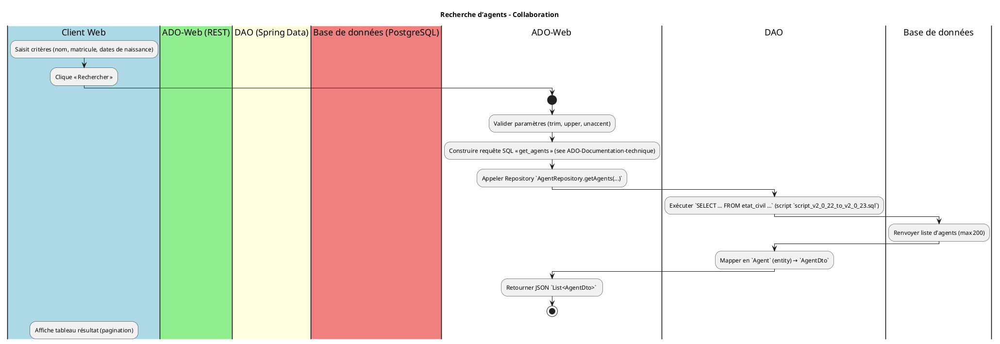
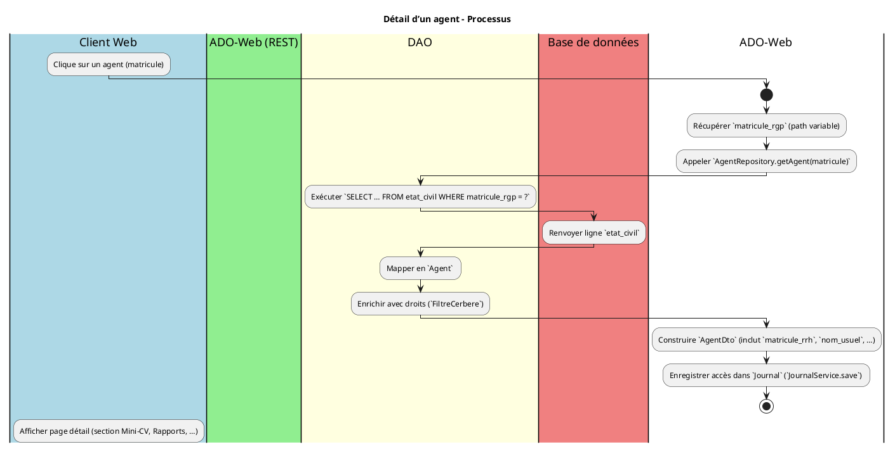
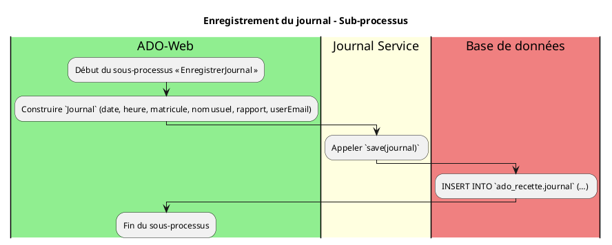
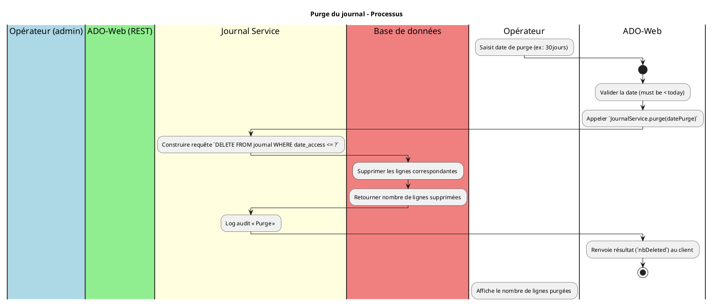

# 📄 Cahier des Charges Fonctionnel (CCF) – **ADO**  
*Modélisation BPMN – ISO/IEC 19510 : 2013*  

> **Projet** : ADO – Consultation des dossiers RH archivés (ReHucit)  
> **Version CCF** : 1.0 – 27/04/2026  
> **Auteur** : ChatGPT (assistant IA) – basé sur la documentation fournie (code source, scripts SQL, wiki, spécifications fonctionnelles).  

---  

## 1️⃣ Introduction & Contexte processus  

| Élément | Description |
|--------|-------------|
| **Organisation** | Ministère de la Transition écologique – Direction des Ressources Humaines (DRH). |
| **Environnement** | Application web Java Spring Boot (v 2.x) hébergée sur IaaS (ECO4) au data‑center « Paris La Défense ». Accès HTTPS uniquement. |
| **Objectifs de la modélisation BPMN** | • Décrire, analyser et valider les processus métiers d’accès aux données historiques (recherche d’agents, détail, mini‑CV, rapports, journal, purge). <br>• Produire des artefacts exécutables (BPMN 2.0) compatibles avec Camunda / Activiti. |
| **Périmètre** | Tous les flux métier exposés par le module `ado‑web` : <br>1️⃣ Recherche d’agents (page d’accueil) <br>2️⃣ Affichage du détail d’un agent <br>3️⃣ Génération du Mini‑CV <br>4️⃣ Production des rapports (Acte, Conjoint, Enfant, Poste/Grade, Temps partiel, etc.) <br>5️⃣ Journal d’audit (consultations) <br>6️⃣ Purge du journal (maintenance). |
| **Glossaire métier (extraits)** | • **Agent** – salarié du ministère, identifié par `matricule_rgp` (ReHucit) et `matricule_rrh` (RenoiRH). <br>• **Mini‑CV** – synthèse du dossier civil, carrière, affectations, etc. <br>• **Rapport** – jeu de données exportées vers JasperReports (PDF, XLSX, CSV, …). <br>• **Journal** – table `ado_recette.journal` traçant chaque consultation (date, heure, utilisateur, rapport). |

---  

## 2️⃣ Cartographie des processus (Process Map)

### 2.1 Nomenclature hiérarchique  

| Niveau | Type | Exemple de processus |
|--------|------|----------------------|
| **P‑001** | **Processus métier stratégique** | Gestion de la **consultation historique** des dossiers RH. |
| **P‑002** | **Processus métier opérationnel** | Recherche d’agents, affichage du détail, génération de Mini‑CV, production de rapports. |
| **P‑003** | **Processus de support** | Journalisation, purge du journal, maintenance des scripts SQL. |
| **P‑004** | **Processus de management** | Homologation (validée 25/03/2025), suivi de la disponibilité (DICT 1332). |

### 2.2 Matrice de processus  

| ID Processus | Nom | Type | Propriétaire | Priorité |
|--------------|-----|------|--------------|----------|
| **P‑001** | Consultation globale (Recherche / Détail) | Opérationnel | **SG/DRH** | Critique |
| **P‑002** | Génération Mini‑CV | Opérationnel | **SG/DRH** | Haute |
| **P‑003** | Production rapports (Acte, Conjoint, Enfant, Temps partiel, …) | Opérationnel | **SG/DRH** | Haute |
| **P‑004** | Journalisation des accès | Support | **SG/DRH** | Moyenne |
| **P‑005** | Purge du journal (maintenance) | Support | **SG/DRH** | Faible |
| **P‑006** | Mise à jour du schéma (scripts SQL) | Support | **SG/DNUM/PNM3** | Faible |

---  

## 3️⃣ Modélisation BPMN détaillée  

> **Notation** : PlantUML avec le dialecte BPMN.  
> Chaque diagramme représente un **niveau d’abstraction unique** (règle 1).  

### 3.1 Recherche d’agents – Collaboration Diagram  



#### 3.1.1 Règles de gestion (extraits)  

| Point de décision | Condition | Règle métier | Source |
|-------------------|-----------|--------------|--------|
| **RG‑01** | `bornAfter` ou `bornBefore` vide | Ignorer le filtre de date. | `ADO‑Documentation‑technique.md` (requête `get_agents`). |
| **RG‑02** | `motif` (nom/prénom) contient caractères accentués | Utiliser `unaccent` + `upper` pour comparaison. | même source. |
| **RG‑03** | `matricule_rgp` ou `matricule_rrh` fourni | Recherche exacte (égalité, sans `LIKE`). | même source. |

---

### 3.2 Affichage du détail d’un agent – Process Diagram  



#### 3.2.1 Points d’exception  

| Événement | Type d’événement (Boundary) | Gestion |
|-----------|----------------------------|---------|
| Agent non trouvé | **Error Boundary** (code 404) | Retourner `ResponseStatusException(HttpStatus.NOT_FOUND)` |
| Erreur DB (connexion) | **Error Boundary** (code 500) | Propagation via `RuntimeException` → `@ControllerAdvice` générique. |
| Accès non autorisé (FiltreCerbere) | **Escalation Boundary** | Rediriger vers SSO / afficher page d’erreur. |

---

### 3.3 Génération du Mini‑CV – Collaboration Diagram  

```plantuml
@startuml
!pragma layout elk
title Mini‑CV – Collaboration

|#LightBlue|Client Web|
|#LightGreen|ADO‑Web (REST)|
|#LightYellow|DAO|
|#LightCoral|Base de données|
|#LightGray|Adapter (MiniCvToArrayAdapter)|
|#LightPurple|Jasper Service (IJasperService)|
|#LightOrange|Fichier (PDF/CSV)|
|Client Web|
  :Clique « Mini‑CV »;
|ADO‑Web|
  start
  :Appeler `MiniCvRepository.findByMatricule(matricule)`;
|DAO|
  :Exécuter requête `get_miniCv` (voir ADO‑Documentation‑technique);
|Base de données|
  :Renvoyer ligne `MiniCv`;
|DAO|
  :Mapper en `MiniCv` ;
|ADO‑Web|
  :Passer à `MiniCvToArrayAdapter.getValues(miniCv)`;
|Adapter|
  :Retourne `String[?]` (colonnes du tableau);
|ADO‑Web|
  :Construire `Map<String,Object>` pour Jasper;
  :Appeler `IJasperService.runReportOutputFile("mini_cv", params, PDF, /tmp/mini_cv.pdf)`;
|Jasper Service|
  :Charge `mini_cv.jrxml`;
  :Remplit les champs avec le tableau;
  :Génère le fichier PDF;
  :Sauvegarde dans `/tmp`;
|ADO‑Web|
  :Renvoie le flux HTTP (Content‑Type = application/pdf);
  stop
|Client Web|
  :Affiche le PDF (ou le télécharge);
@enduml
```

#### 3.3.1 KPI associés  

| Indicateur | Formule | Objectif | Seuil d’alerte |
|------------|---------|----------|----------------|
| Temps moyen de génération Mini‑CV | `duration (ms)` | `< 1500 ms` | `> 3000 ms` |
| Taux d’erreur de génération | `nb_errors / nb_requests` | `< 0,5 %` | `> 2 %` |
| Taille moyenne du PDF | `bytes` | `< 500 KB` | `> 2 MB` |

---

### 3.4 Production d’un rapport **Acte** – Process Diagram  

```plantuml
@startuml
!pragma layout elk
title Rapport Acte – Processus

|#LightBlue|Client Web|
|#LightGreen|ADO‑Web (REST)|
|#LightYellow|DAO|
|#LightCoral|Base de données|
|#LightGray|Adapter (RapportActeToArrayAdapter)|
|#LightPurple|Jasper Service|

|Client Web|
  :Clique « Rapport Acte »;
|ADO‑Web|
  start
  :Appeler `RapportService.getRapportActe(matricule)`;
|DAO|
  :Exécuter `rapportActe` (requête complexe, jointures + fonction `array_uniq_stable`) ;
|Base de données|
  :Renvoyer collection `RapportActe`;
|DAO|
  :Mapper en objets `RapportActe`;
|ADO‑Web|
  :Pour chaque acte → `RapportActeToArrayAdapter.getValues(acte)`;
  :Construire `List<String[]>` ;
  :Appeler `IJasperService.runReportOutputFile("rapport_acte", params, PDF, /tmp/acte.pdf)`;
|Jasper Service|
  :Remplit le template `rapport_acte.jrxml` (HTML → PDF) ;
  :Génère le fichier ;
|ADO‑Web|
  :Renvoie le PDF au client ;
  stop
|Client Web|
  :Affiche / télécharge le rapport.
@enduml
```

> **Remarque** : La requête `rapportActe` dépend de la fonction PL/pgSQL `array_uniq_stable` (définie dans `script_v2_0_22_to_v2_0_23.sql`).  

#### 3.4.1 Règles de gestion  

| Point de décision | Condition | Règle métier | Source |
|-------------------|-----------|--------------|--------|
| **RG‑10** | `matricule` absent | Retourner `400 Bad Request`. | Contrôleur `RapportController`. |
| **RG‑11** | Aucun acte trouvé | Retourner PDF vide avec message « Aucun acte trouvé ». | Service `RapportServiceImpl`. |
| **RG‑12** | `array_uniq_stable` renvoie `NULL` | Remplacer par chaîne vide. | Script SQL. |

---

### 3.5 Journalisation des accès – Sub‑processus (réutilisable)  



> **Utilisation** : appelé depuis chaque point d’entrée métier (Recherche, Détail, Mini‑CV, Rapports).  

#### 3.5.1 KPI du journal  

| Indicateur | Formule | Objectif |
|------------|---------|----------|
| Nombre d’accès journalisés par jour | `COUNT(*) FROM journal WHERE date_access = CURRENT_DATE` | `> 500` (volume attendu) |
| Temps moyen d’insertion | `avg(duration)` | `< 50 ms` |

---

### 3.6 Purge du journal – Process Diagram (Administration)  



#### 3.6.1 Règles d’exception  

| Événement | Gestion |
|-----------|---------|
| Date de purge future | Retourner `400 Bad Request` avec message « Date invalide ». |
| Erreur DB | Retourner `500 Internal Server Error` + alerter l’équipe ops. |

---  

## 4️⃣ Règles de gestion métier (extraits)  

| Point de décision | Condition | Règle métier | Source |
|-------------------|-----------|--------------|--------|
| **RG‑01** | `bornAfter`/`bornBefore` vide | Ignorer le filtre de date. | `ADO‑Documentation‑technique.md` (requête `get_agents`). |
| **RG‑02** | Recherche texte contient accent | Utiliser `unaccent` + `upper`. | Idem. |
| **RG‑03** | Recherche par matricule exact | Utiliser `=` (pas de `LIKE`). | Idem. |
| **RG‑04** | Mini‑CV : si `date_naissance` = null → afficher `-`. | `MiniCvController`. |
| **RG‑05** | Rapport Acte : si `visas`/`articles` = null → chaîne vide. | `RapportActeToArrayAdapter`. |
| **RG‑06** | Journal : `user_email` = email de l’utilisateur authentifié (filtre Cerbere). | `JournalService.save`. |
| **RG‑07** | Purge : ne pas supprimer les logs de la dernière journée. | `JournalService.purge`. |
| **RG‑08** | Export Jasper : si format **binary** (`PDF`, `XLSX`, `DOCX`) → renvoyer `application/octet-stream`. | `IJasperService`. |
| **RG‑09** | Export Jasper : si format **texte** (`CSV`, `TXT`) → `text/plain`. | Idem. |
| **RG‑10** | Aucun résultat pour un rapport → PDF avec message « Aucun résultat ». | `RapportServiceImpl`. |
| **RG‑11** | Erreur de génération Jasper → lancer `JReportExportException`. | `JasperServiceImpl`. |

---  

## 5️⃣ Données et documents (Data Objects & Artifacts)

| Type | Nom | Description | Exemple |
|------|-----|-------------|---------|
| **Data Object** | `Agent` | Entité JPA (table `etat_civil`). | `matricule_rgp`, `nom_usuel`, `date_naissance`. |
| **Data Object** | `MiniCv` | Synthèse d’informations civiles & carrières. | `qualite`, `grade`, `date_effet`. |
| **Data Object** | `RapportActe` | Acte administratif (nature, état, visas, articles). | `nature`, `etat_acte`, `visas`. |
| **Data Object** | `Journal` | Historique d’accès (date, heure, user, rapport). | `date_access`, `heure_access`, `user_email`. |
| **Data Store** | `ado_recette` (PostgreSQL) | Base de données transactionnelle contenant toutes les tables métier (`etat_civil`, `zy*`, `journal`, …). |
| **Artifact** | `assembly.xml` (module `ado‑database`) | Définit le packaging ZIP des scripts SQL. |
| **Artifact** | `assembly.xml` (module `ado‑doc`) | Package ZIP de la documentation technique. |
| **Artifact** | `Jasper templates (*.jrxml)` | Templates de rapport (ex. `mini_cv.jrxml`, `rapport_acte.jrxml`). |
| **Artifact** | `PlantUML diagrams` (dans ce CCF) | Artefacts BPMN exécutables. |

---  

## 6️⃣ Acteurs et rôles  

| Lane (BPMN) | Rôle métier | Responsabilités | Compétences |
|------------|-------------|------------------|-------------|
| **Client Web** | **Utilisateur final (agent ou agent DRH)** | Saisir les critères, visualiser les résultats, télécharger les rapports. | Connaissance du système RH, navigation web. |
| **FiltreCerbere** | **Filtre d’authentification/autorisation** (SG/DRH) | Authentifier l’utilisateur via SSO, injecter `userEmail` dans le contexte. | SSO, LDAP, gestion des profils. |
| **Agent Service** | **IAgentService** | Fournir la liste des agents, récupérer un agent par matricule. | Spring Data, SQL. |
| **Report Service** | **IRapportService / IRapportEtatServiceService** | Générer les différents rapports (Acte, Conjoint, Enfant, etc.). | JasperReports, mapping adapters. |
| **Journal Service** | **IJournalService** | Persister chaque accès, offrir les vues d’historique et de suivi, purger. | JPA, conformité DICT, audit. |
| **Opérateur (admin)** | **Gestionnaire de maintenance** | Exécuter la purge du journal, vérifier les logs d’erreur. | Connaissance DB, scripts SQL. |

---  

## 7️⃣ Performances & indicateurs (KPIs)

| Indicateur | Processus concerné | Formule | Objectif | Seuil d’alerte |
|------------|-------------------|---------|----------|----------------|
| **Temps de réponse recherche** | `P‑001` | `t_response = timestamp_fin - timestamp_debut` | `< 2 s` | `> 5 s` |
| **Temps de génération Mini‑CV** | `P‑002` | `duration_ms` | `< 1500 ms` | `> 3000 ms` |
| **Temps de génération rapport Acte** | `P‑003` | `duration_ms` | `< 2500 ms` | `> 6000 ms` |
| **Taux d’erreur (5xx)** | Tous | `nb_5xx / nb_total_requests` | `< 0,5 %` | `> 2 %` |
| **Disponibilité** | Global | `uptime = (temps_up / temps_total) * 100` | `≥ 99,5 %` | `< 99 %` |
| **Taux de purge réussie** | `P‑006` | `nb_deleted / nb_requested` | `≥ 95 %` | `< 80 %` |

---  

## 8️⃣ Gestion des exceptions  

| Exception métier | Événement déclencheur | Gestion (Boundary Event) | Action post‑traitement |
|------------------|-----------------------|--------------------------|-----------------------|
| **JReportExportException** | Erreur Jasper (template manquant, données incohérentes) | **Error Boundary** (intermédiaire) | Retourner `500` avec message : *« Erreur lors du traitement du rapport Jasper »*. |
| **AgentNotFoundException** | Aucun agent trouvé pour le matricule | **Error Boundary** (intermédiaire) | Retourner `404` + message « Agent introuvable ». |
| **InvalidDateException** | Date de purge future ou mal formatée | **Error Boundary** | Retourner `400` + description. |
| **DatabaseTimeoutException** | Timeout connexion PostgreSQL | **Timer Boundary** (sur `serviceTask`) | Retry 2× → si échec, escalade vers **Escalation Boundary** (notification admin). |
| **AccessDeniedException** (FiltreCerbere) | Utilisateur non autorisé | **Escalation Boundary** | Rediriger vers page d’erreur 403, logger. |

---  

## 9️⃣ Sous‑processus et réutilisation  

| Sous‑processus | Description | Points d’appel |
|----------------|-------------|----------------|
| **Enregistrement du journal** (`EnregistrerJournal`) | Insertion d’une ligne dans `journal`. | Appelé à la fin de chaque service métier (Recherche, Détail, Mini‑CV, Rapports). |
| **Conversion *Adapter*** | Transformation d’un POJO en `String[]` pour Jasper. | Utilisé par tous les services de génération de rapports. |
| **Validation des paramètres** | Vérification de la présence et du format des paramètres d’entrée. | Avant chaque appel de contrôleur (`@RequestParam`/`@PathVariable`). |
| **Gestion de la pagination** | Découpage des résultats d’agents (max 200). | Processus `Recherche d’agents`. |

---  

## 🔟 Matrice de traçabilité (CCF ↔ BPMN)  

| Exigence CCF | Processus BPMN | Tâche(s) | Scénario de test |
|-------------|----------------|----------|-------------------|
| **EX‑G‑01** – Recherche agents (critères texte) | `P‑001` (Recherche d’agents) | `Validate parameters`, `AgentRepository.getAgents` | Recherche « Dupont » → résultat > 0. |
| **EX‑G‑02** – Affichage détail agent | `P‑002` (Détail d’un agent) | `AgentRepository.getAgent`, `EnregistrerJournal` | `GET /agents/12345` → 200 + journal ligne. |
| **EX‑G‑03** – Génération Mini‑CV | `P‑003` (Mini‑CV) | `MiniCvRepository`, `MiniCvToArrayAdapter`, `IJasperService` | `GET /agents/12345/mini-cv?format=pdf` → PDF 200 KB. |
| **EX‑G‑04** – Rapport Acte | `P‑004` (Rapport Acte) | `RapportService.getRapportActe`, `RapportActeToArrayAdapter`, `IJasperService` | `GET /agents/12345/rapport-acte?format=pdf` → PDF non‑vide. |
| **EX‑G‑05** – Journalisation | `P‑005` (Enregistrement du journal) | `JournalService.save` | Après chaque appel, vérifier ligne dans `journal`. |
| **EX‑G‑06** – Purge du journal | `P‑006` (Purge) | `JournalService.purge` | `POST /admin/purge?date=2024-01-01` → nbDeleted = X. |
| **EX‑G‑07** – Gestion des erreurs | Tous | `Error Boundary` (JReportExportException, AgentNotFoundException, …) | Simuler DB hors‑service → 500 + message. |

---  

## 11️⃣ Validation et conformité  

### 11.1 Checklist BPMN (ISO 19510)  

- [ ] **Unicité du start event** – chaque processus possède exactement un événement de démarrage.  
- [ ] **Unicité de l’end event** – chaque processus possède au moins un événement de fin.  
- [ ] **Tous les flux ont source et cible** – aucune flèche « orphan ».  
- [ ] **Passerelles correctement nommées** – chaque `XOR`, `AND`, `OR` possède un label explicite.  
- [ ] **Utilisation d’artefacts** – `Data Object` attachés aux tâches qui les manipulent.  
- [ ] **Respect du principe de modularité** – sous‑processus réutilisables (`EnregistrerJournal`).  
- [ ] **Clarté du diagramme** – ≤ 7 éléments par ligne/colonne (règle de lisibilité).  

### 11.2 Niveaux de conformité BPMN  

| Niveau | Caractéristiques | BPMN applicable |
|--------|-------------------|-----------------|
| **Descriptive** | Diagrammes simples (Recherche, Détail) – uniquement séquence & tâches. | **P‑001**, **P‑002** |
| **Analytic** | Inclusion de **gateways** (validation, erreurs) et **data objects** (Agent, MiniCv). | **P‑003**, **P‑004**, **P‑005** |
| **Common Executable** | Tous les sous‑processus (`EnregistrerJournal`) sont **exécutables** (serviceTask, scriptTask). | **P‑006** (purge) – inclut `Timer Boundary` (délais). |

---  

## 12️⃣ Implémentation & exécution  

### 12.1 Maturité processus (CMMI‑like)  

| Niveau | Caractéristiques | BPMN applicable |
|--------|-------------------|-----------------|
| **1 – Initial** | Processus ad‑hoc, documentation minimale. | Aucun (historique). |
| **2 – Managed** | Processus documentés, diagrammes descriptifs. | `P‑001`, `P‑002`. |
| **3 – Defined** | Processus normalisés, métriques collectées. | `P‑003`, `P‑004`. |
| **4 – Quantified** | Mesure des KPI, contrôle de qualité. | `P‑005` (journal), `P‑006`. |
| **5 – Optimized** | Boucles d’amélioration continue, automatisation CI/CD. | Tous les processus, intégration Camunda + tests automatisés. |

### 12.2 Intégration système  

| Composant | Version | Rôle |
|-----------|---------|------|
| **Camunda BPMN Engine** | 7.19.x | Exécution des processus BPMN (ex. via `@ProcessEngine` dans les services). |
| **Spring Boot** | 2.7.x | Conteneur d’application, injection de dépendances. |
| **PostgreSQL** | 13+ | Persistance des tables `etat_civil`, `zy*`, `journal`. |
| **JasperReports** | 6.20.x | Génération PDF/XLSX. |
| **Maven** | 3.8.x | Build multi‑module (`ado‑database`, `ado‑doc`, `ado‑web`). |
| **Docker** (optionnel) | – | Conteneurisation pour les environnements de test/CI. |
| **CI/CD** | GitLab CI | Pipelines : compilation → tests → packaging (`assembly.xml`) → déploiement sur l’IaaS. |

---  

## 📚 Annexes  

### A. Références de fichiers (extraits)  

| Fichier | Chemin | Description |
|---------|--------|-------------|
| `ado-web/src/main/java/fr/gouv/e2/ado/controllers/MainController.java` | Contrôleur principal (recherche, détail). |
| `ado-web/src/main/java/fr/gouv/e2/ado/services/AgentServiceImpl.java` | Implémentation du service d’agents. |
| `ado-web/src/main/java/fr/gouv/e2/ado/services/JasperServiceImpl.java` | Wrapper JasperReports. |
| `ado-web/src/main/java/fr/gouv/e2/ado/dao/AgentRepository.java` | Repository Spring Data (requêtes custom). |
| `ado-database/scripts/script_v2_0_22_to_v2_0_23.sql` | Fonction `array_uniq_stable`. |
| `ado-database/scripts/script_v2_0_24_to_v2_0_25.sql` | Index `nudoss` (optimisation). |
| `ado-doc/assembly.xml` | Packaging documentation. |
| `ado-wiki.md` (section **home**) | Contexte métier & homologation. |
| `Documentation_ADO_v2_1.pdf` | Spécifications fonctionnelles détaillées (utilisées pour les règles RG‑xx). |

### B. Glossaire (abrégé)  

| Terme | Définition |
|-------|------------|
| **RGP** | Référentiel Gestion Personnel – matricule ReHucit. |
| **RRH** | Référentiel RenoiRH – matricule RenoiRH. |
| **NIR** | Numéro d’Inscription au Répertoire (numéro de sécurité sociale). |
| **Jasper** | Moteur de reporting (templates .jrxml). |
| **FiltreCerbere** | Filtre d’authentification/autorisation (SSO). |
| **DAT** | Diagramme d’Architecture Technique (voir `DAT.md`). |
| **DICT 1332** | Niveau de disponibilité = 1, intégrité = 3, traçabilité = 2, confidentialité = 3. |

---  

## 📌 Conclusion  

Ce **Cahier des Charges Fonctionnel** décrit, selon la norme **ISO/IEC 19510**, l’ensemble des processus métier de l’application **ADO**, leurs règles de gestion, leurs KPI, leurs points d’exception et leurs sous‑processus réutilisables. Les diagrammes BPMN fournis (PlantUML) sont **exécutables** sur un moteur Camunda/Activiti et respectent les bonnes pratiques de modularité, de clarté et de traçabilité exigées par la norme BPMN.  

> **Prochaine étape** : Validation du CCF par les parties prenantes (MOA, MOE, RSSI) → génération des artefacts BPMN (.bpmn) → mise en place du pipeline d’intégration continue (Camunda‑Spring‑Boot).  

---  

*Fin du document*  