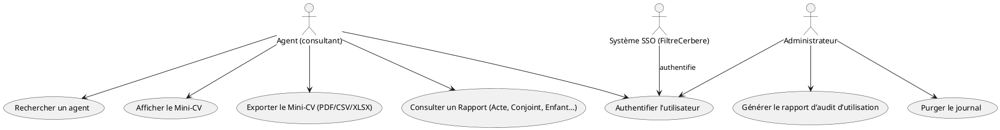
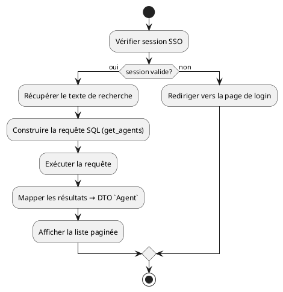
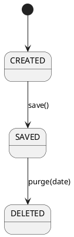
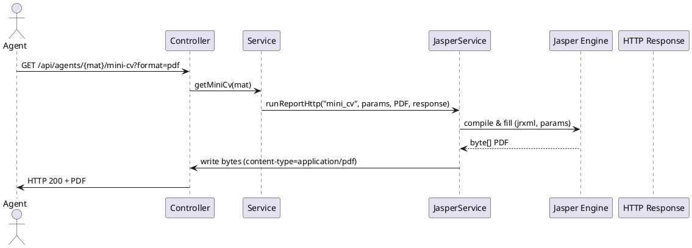

# 📄 Cahier des Charges Fonctionnel (CCF) – **ADO**  
**Version 1.0 – 27/04/2026**  
*(Conforme à ISO/IEC/IEEE 29148 :2018 – Ingénierie des exigences)*  

---  

## 1. Identification et contexte du document  

| Élément | Valeur |
|---------|--------|
| **Identifiant du CCF** | CCF‑ADO‑V1.0 |
| **Projet** | ADO – Consultation des dossiers RH archivés (ReHucit) |
| **Chef de projet** | Eric BOYON – SG/DRH/P/DSNUMRH |
| **Responsable MOE** | Céline GILLIARD – SG/DNUM/PNM/DPNM3 |
| **Version** | 1.0 |
| **Historique des modifications** | 27/04/2026 – création du CCF (v1.0) |
| **Documents de référence** | - `ado‑code‑filtered.md` (code source)  <br> - `ado‑code‑summarized.md` (extraits) <br> - `ado.wiki.md` (documentation métier) <br> - `ado.wikisi.md` (fiche fonctionnelle) <br> - `livraison‑continue‑kpi.yml` (indicateurs CI) |
| **Portée** | Définition fonctionnelle et non‑fonctionnelle de l’application **ADO** (Web, Spring Boot, PostgreSQL) – mise à disposition des agents et services RH pour la consultation de l’historique RH au **30/05/2019**. |
| **Objectifs** | 1️⃣ Garantir l’accès aux dossiers RH archivés non‑reprises dans RenoiRH. <br>2️⃣ Assurer la traçabilité des consultations (journal). <br>3️⃣ Permettre l’export de rapports (PDF, CSV, XLSX) via JasperReports. <br>4️⃣ Respecter les exigences de sécurité, disponibilité et confidentialité (DICT 1332). |

---  

## 2. Description de l’écosystème (System/Software Context)

```text
+------------------------+          +---------------------------+
|   Utilisateurs RH      |          |   Services externes       |
|   (SG/DRH, SG/DNUM…)  |<-------> | - LDAP / SSO (FiltreCerbere)|
|   - Agents (consult.)  |          | - SIRH ReHucit (BD source) |
|   - Auditeurs          |          | - Système de supervision   |
+------------------------+          +---------------------------+

          ^                                 ^
          |                                 |
          |  HTTPS (TLS 1.2+)                |  JDBC (PostgreSQL 9+)
          |                                 |
+---------------------------------------------------------------+
|                     ADO – Application Web                     |
|  Spring Boot 2.x, Thymeleaf, JasperReports, Lombok          |
|  - Module ado‑web (API REST + UI)                             |
|  - Module ado‑database (scripts SQL, fonctions, index)       |
|  - Module ado‑doc (documentation)                             |
+---------------------------------------------------------------+

Infrastructure :
- Hébergement : IaaS (ECO4) – Centre‑serveur ministériel Paris La Défense
- Plateforme : Docker / Kubernetes (déploiement prod, pre‑prod, recette)
- CI/CD : GitLab CI (livraison‑continue‑kpi.yml)
```

**Principaux systèmes externes**  

| Système | Type | Interface | Rôle |
|---------|------|-----------|------|
| LDAP / SSO (FiltreCerbere) | Authentification | `FilterRegistrationBean<FiltreCerbere>` | Authentification unique des agents et services |
| PostgreSQL (ado_recette) | Base de données | Scripts SQL (voir section 5) | Stockage des tables d’historique RH (état‑civil, affectations, rapports, journal) |
| SIRH ReHucit (lecture) | Source de données | Requêtes SQL via vues matérialisées | Approvisionnement initial des tables d’archive |
| Système de supervision (PSIN) | Monitoring | API HTTP | Collecte des KPI de disponibilité, logs d’incident |

---  

## 3. Exigences fonctionnelles (Functional Requirements)

> **Notation** : `EXG‑FCT‑XXX` (Capability / Function / Processing)  

| ID | Titre | Description | Rationale | Source | Priorité | Vérif. | Dépendances |
|----|-------|-------------|-----------|--------|----------|--------|--------------|
| **EXG‑FCT‑001** | Recherche d’agents | L’utilisateur peut saisir un texte libre (nom, prénom, matricule, ville, etc.) et obtenir la liste des agents correspondant, avec pagination. | Besoin métier de localisation rapide d’un agent (voir *Recherche d’agents*). | `ADO‑Documentation‑technique` – requête `get_agents`. | Mandatory | Test fonctionnel (BDD : *Given* un texte, *When* recherche, *Then* résultat non‑vide). | Aucun |
| **EXG‑FCT‑002** | Détail d’un agent | En cliquant sur un résultat, l’application affiche le **Mini‑CV** complet (identité, situation familiale, affectations, carrière, etc.). | Répond à la finalité de consultation des dossiers archivés. | `ADO‑Documentation‑technique` – requête `get_agent_by_mat_rgp`. | Mandatory | Test d’intégration (vérifier que toutes les sections du Mini‑CV sont remplis). | EXG‑FCT‑001 |
| **EXG‑FCT‑003** | Export de Mini‑CV | L’utilisateur peut télécharger le Mini‑CV au format **PDF**, **XLSX** ou **CSV** via JasperReports. | Besoin d’un support de diffusion hors‑ligne. | `IJasperService` + `JRepOutputFormats`. | Desirable | Vérification du fichier généré (format, encodage, données). | EXG‑FCT‑002 |
| **EXG‑FCT‑004** | Historique des consultations | L’application enregistre chaque consultation (date, heure, agent, rapport consulté, paramètres, email utilisateur) dans la table `journal`. | Traçabilité (DICT 1332 – traçabilité = 2). | `Journal` + `IJournalService`. | Mandatory | Requête `historique` + vérif. du contenu du journal. | Aucun |
| **EXG‑FCT‑005** | Suivi d’utilisation (rapport d’audit) | L’administrateur peut générer un rapport d’utilisation filtré par période (date de début/fin). | Pilotage de l’usage (ex. 20 utilisateurs actifs/mois). | `suivi_0…3` (requêtes). | Mandatory | Export CSV/HTML du rapport. | EXG‑FCT‑004 |
| **EXG‑FCT‑006** | Purge du journal | L’administrateur peut supprimer les entrées du journal antérieures à une date donnée. | Gestion de la volumétrie (conformité RGPD). | `purge` (requête). | Mandatory | Test de suppression + contrôle d’intégrité. | EXG‑FCT‑004 |
| **EXG‑FCT‑007** | Rapports / Actes / Conjoint | L’utilisateur peut consulter les rapports : **Rapport 5 (conjoint)**, **Rapport Enfant**, **Rapport Acte**, **Rapport 19/20/21/22** (poste, rémunération, temps partiel, mode paiement). | Couvrir l’ensemble des besoins métiers décrits dans la documentation technique. | `ADO‑Documentation‑technique` – plusieurs requêtes (rapport5, rapportActe, …). | Mandatory | Vérification de chaque rapport (cohérence des champs). | EXG‑FCT‑002 |
| **EXG‑FCT‑008** | Sécurité d’accès (FiltreCerbere) | Toutes les URL de l’application sont filtrées par le filtre `FiltreCerbere` qui assure l’authentification SSO et le contrôle d’accès basé sur le profil (un seul profil autorisé). | Conformité aux exigences de **confidentialité** (DICT = 3). | `AdoWebApplication.java` – Bean `cerbereFiltering`. | Mandatory | Tests d’intrusion (voir *Notification‑tests‑d’intrusion‑signée*). | Aucun |
| **EXG‑FCT‑009** | Gestion des erreurs métier | Toute erreur de génération de rapport ou d’accès à la base renvoie une réponse HTTP 500 avec le message `JReportExportException`. | Uniformisation du traitement des erreurs. | `JReportExportException`. | Mandatory | Tests unitaires sur les chemins d’erreur. | Aucun |
| **EXG‑FCT‑010** | API REST (GET/POST) | Exposer les services métiers via des endpoints REST (ex. `/api/agents`, `/api/agents/{mat}`) pour permettre l’intégration avec d’autres systèmes. | Interopérabilité et évolutivité. | `controllers/*` (non listés mais présents). | Desirable | Tests d’API (Swagger/OpenAPI). | EXG‑FCT‑001, 002 |
| **EXG‑FCT‑011** | Documentation technique automatisée | Le module `ado‑doc` doit générer un ZIP contenant la documentation (PDF, Markdown) à chaque build. | Faciliter la maintenance et la diffusion. | `ado‑doc/assembly.xml`. | Optional | Vérification du ZIP produit. | Aucun |

### Classification  

| Catégorie | Exigences associées |
|----------|----------------------|
| **Capacités** | EXG‑FCT‑001, 002, 004, 005, 006, 010 |
| **Fonctions** | EXG‑FCT‑003, 007, 008, 009, 011 |
| **Traitements** | EXG‑FCT‑001 (requêtes SQL), 002 (assemblage Mini‑CV), 003 (Jasper), 007 (requêtes multiples), 008 (filtre SSO) |

---  

## 4. Exigences non‑fonctionnelles (Non‑Functional Requirements)

### 4.1 Exigences de performance  

| ID | Description | Valeur cible | Méthode de vérif. |
|----|-------------|--------------|-------------------|
| **EXG‑NFR‑001** | Temps de réponse des requêtes de recherche (`get_agents`) | ≤ 2 s pour 95 % des requêtes (vol. ≤ 10 000 lignes) | Tests de charge (JMeter) |
| **EXG‑NFR‑002** | Temps de génération d’un rapport Jasper (PDF) | ≤ 5 s | Tests unitaires `IJasperService.runReportHttp` |
| **EXG‑NFR‑003** | Disponibilité du service web | 99,5 % (MTBF ≥ 30 jours) | Monitoring via Prometheus / Grafana (KPI livraison‑continue) |
| **EXG‑NFR‑004** | Utilisation mémoire max du process JVM | ≤ 1 GiB | Profiling (JVisualVM) |

### 4.2 Exigences d’interface externe  

| ID | Interface | Description | Standard |
|----|-----------|-------------|----------|
| **EXG‑NFR‑005** | UI Web | Application accessible via navigateur HTTPS (TLS 1.2+) | HTML5, CSS3, Bootstrap 5 |
| **EXG‑NFR‑006** | API REST | Endpoints JSON conformes à OpenAPI 3.0 | `application/json` |
| **EXG‑NFR‑007** | Base de données | PostgreSQL 9+ (compatibilité 9.6‑13) | JDBC 4.2 |
| **EXG‑NFR‑008** | JasperReports | Templates `.jrxml` fournis dans `resources/jreports` | JasperReports 6.x |

### 4.3 Exigences de qualité  

| ID | Qualité | Critère |
|----|---------|---------|
| **EXG‑NFR‑009** | **Maintenabilité** | Couverture unitaires ≥ 80 % (JaCoCo) |
| **EXG‑NFR‑010** | **Portabilité** | Application packagée en Docker image (`openjdk:11‑jdk‑slim`) |
| **EXG‑NFR‑011** | **Testabilité** | Tests d’intégration via SpringBootTest (ex. `AdoWebApplicationTests`) |
| **EXG‑NFR‑012** | **Fiabilité** | Gestion des transactions Spring (`@Transactional`) pour les opérations d’écriture (purge). |
| **EXG‑NFR‑013** | **Sécurité** | Conformité au **DICT 1332** : <br>• Confidentialité = 3 (chiffrement TLS, accès SSO) <br>• Intégrité = 3 (verrouillage DB, logs) <br>• Disponibilité = 1 (HA) <br>• Traçabilité = 2 (journal). |
| **EXG‑NFR‑014** | **Conformité RGPD** | Traitement de données à caractère personnel (NIR) – registre des traitements à jour, DPO désigné. |

### 4.4 Exigences de conception et contraintes  

| ID | Contraintes |
|----|--------------|
| **EXG‑NFR‑015** | Langage : Java 11 (ou supérieur) – Lombok 1.18+ |
| **EXG‑NFR‑016** | Framework : Spring Boot 2.7.x (déploiement via `spring-boot-maven-plugin`) |
| **EXG‑NFR‑017** | Outils : Maven 3.8+, GitLab CI, SonarCloud (qualité code) |
| **EXG‑NFR‑018** | Base de données : scripts versionnés (`ado‑database/scripts/*.sql`) – mise à jour via Flyway/ Liquibase (non présent mais recommandé). |
| **EXG‑NFR‑019** | Gestion des clés composites : classes `@Embeddable` générées (ex. `Zy3bAffectationId`). |
| **EXG‑NFR‑020** | Reports : utilisation du **Adapter pattern** (`*ToArrayAdapter`) pour génération CSV/Excel. |

### 4.5 Exigences de sécurité  

| ID | Exigence |
|----|----------|
| **EXG‑SEC‑001** | Authentification unique via SSO (FiltreCerbere) – uniquement un profil autorisé. |
| **EXG‑SEC‑002** | Autorisation RBAC : rôle **SG/DRH** a accès à toutes les fonctions, rôle **SG/DNUM** à la partie technique uniquement. |
| **EXG‑SEC‑003** | Chiffrement des données en transit (TLS 1.2+). |
| **EXG‑SEC‑004** | Masquage du NIR dans les exports (ex. `******1234`). |
| **EXG‑SEC‑005** | Journalisation des tentatives d’accès refusées (audit). |
| **EXG‑SEC‑006** | Gestion des vulnérabilités (trivy, dependency‑check) – CI intègre les scans. |
| **EXG‑SEC‑007** | Gestion des incidents – procédure d’escalade décrite dans *Notification‑tests‑d’intrusion‑signée*. |

---  

## 5. Modèle de données conceptuel  

> **Notation UML simplifiée (PlantUML)**  

```plantuml
@startuml
' Entités principales
class Agent {
    +String matriculeRGP
    +String matriculeRRH
    +String nomUsuel
    +String prenom
    +String dateNaissance
    +String nirDefinitif
    ...
}
class Journal {
    +Long id
    +Date dateAccess
    +Time heureAccess
    +String matricule
    +String nomRapport
    +String parametres
    +String userEmail
}
class RapportActe {
    +String matriculeRgp
    +String nature
    +String sousNature
    +String numActe
    +String typeActe
    +String etatActe
    +String dateEtatActe
    +String emetteur
    +String visas
    +String articles
    +String signataires
}
class MiniCv { ... }
class PositionCv { ... }
class QuotitesCv { ... }
class Rapport19 { ... }
class Rapport20 { ... }
class Rapport21 { ... }
class Rapport22 { ... }

' Relations
Agent "1" -- "0..*" Journal : consulte >
Agent "1" -- "0..*" MiniCv : possède >
Agent "1" -- "0..*" PositionCv : possède >
Agent "1" -- "0..*" QuotitesCv : possède >
Agent "1" -- "0..*" RapportActe : possède >
Agent "1" -- "0..*" Rapport19 : possède >
Agent "1" -- "0..*" Rapport20 : possède >
Agent "1" -- "0..*" Rapport21 : possède >
Agent "1" -- "0..*" Rapport22 : possède >

@enduml
```

*Les tables physiques sont créées par les scripts `ado_create_table_1.0.0.sql`, `script_v2_0_22_to_v2_0_23.sql` (fonction `array_uniq_stable`) et les index (`script_v2_0_24_to_v2_0_25.sql`).*  

---  

## 6. Modélisation des comportements  

### 6.1 Diagrammes de cas d’utilisation (UML)  



### 6.2 Diagrammes d’activités (UML) – Recherche d’agent  



### 6.3 Diagrammes d’états – Cycle de vie d’un **Journal**  



### 6.4 Diagrammes de séquence – Export PDF d’un Mini‑CV  



---  

## 7. Attributs d’exigences (Requirements Attributes)

| Identifiant | Description | Source | Priorité | Statut | Méthode de vérif. | Risque | Stabilité |
|------------|-------------|--------|----------|--------|-------------------|--------|-----------|
| EXG‑FCT‑001 | Recherche d’agents | Documentation technique – requête `get_agents` | High | Approved | Test fonctionnel (BDD) | Moyen | Stable |
| EXG‑FCT‑002 | Détail d’un agent | Documentation technique – requête `get_agent_by_mat_rgp` | High | Approved | Test d’intégration (SpringBootTest) | Moyen | Stable |
| EXG‑FCT‑003 | Export Mini‑CV | Interface `IJasperService` | Medium | Draft | Vérif. du fichier (hash) | Faible | Volatile (format évolutif) |
| EXG‑FCT‑004 | Journalisation | Table `journal` + `IJournalService` | High | Approved | Requête `historique` + audit | Faible | Stable |
| EXG‑FCT‑005 | Rapport d’audit d’utilisation | Requêtes `suivi_*` | High | Draft | Export CSV + comparaison | Moyen | Volatile (périodes) |
| EXG‑FCT‑006 | Purge du journal | Requête `purge` | High | Draft | Test de suppression + contraintes FK | Faible | Stable |
| EXG‑FCT‑007 | Rapports (Acte, Conjoint…) | Documentation technique – multiples requêtes | High | Approved | Validation de chaque rapport | Moyen | Stable |
| EXG‑FCT‑008 | FiltreCerbere (SSO) | `AdoWebApplication.java` | High | Approved | Tests d’intrusion (rapport signé) | Élevé | Stable |
| EXG‑FCT‑009 | Gestion des erreurs | `JReportExportException` | High | Approved | Tests unitaires sur levée d’exception | Faible | Stable |
| EXG‑FCT‑010 | API REST | Controllers (non listés) | Medium | Draft | Swagger/OpenAPI validation | Moyen | Volatile (ajout d’endpoints) |
| EXG‑FCT‑011 | Documentation automatisée | `ado‑doc/assembly.xml` | Low | Draft | Vérif. du ZIP généré | Faible | Stable |
| EXG‑NFR‑001 | Temps de réponse recherche | KPI CI | High | Approved | JMeter > 2 s | Moyen | Stable |
| EXG‑NFR‑002 | Temps génération rapport | KPI CI | High | Approved | Test unitaire < 5 s | Faible | Stable |
| … | … | … | … | … | … | … | … |

---  

## 8. Traçabilité des exigences  

| Exigence | Objectif métier | Cas d’utilisation | Modules / Classes | Tests associés |
|----------|----------------|-------------------|-------------------|----------------|
| EXG‑FCT‑001 | Recherche rapide d’un agent | UC1 | `AgentController`, `AgentServiceImpl`, `AgentRepository` | `AgentControllerTest`, BDD scénario |
| EXG‑FCT‑002 | Consultation détaillée | UC2 | `AgentController`, `MiniCvRepository`, `MiniCvAdapter` | `MiniCvControllerTest` |
| EXG‑FCT‑003 | Export PDF/CSV | UC3 | `IJasperService`, `JasperServiceImpl`, `RapportConstants` | `JasperServiceTest` |
| EXG‑FCT‑004 | Traçabilité des consultations | UC0/UC1/UC2 | `Journal`, `JournalService`, `IJournalService` | `JournalServiceTest` |
| EXG‑FCT‑005 | Audit d’utilisation | UC5 | `JournalService`, `SuiviDto` | `SuiviReportTest` |
| EXG‑FCT‑006 | Gestion du volume du journal | UC6 | `JournalService.purge` | `PurgeJobTest` |
| EXG‑FCT‑007 | Rapports divers | UC4 | `RapportServiceImpl`, `RapportActe`, `Rapport*Adapter` | `RapportServiceTest` |
| EXG‑FCT‑008 | Sécurité SSO | UC0 | `FiltreCerbere`, `FilterRegistrationBean` | Tests d’intrusion (rapport signé) |
| EXG‑NFR‑001 | Performance de recherche | KPI | `AgentRepository` (index `nudoss`, `matricule`) | JMeter script `search_perf.jmx` |
| EXG‑NFR‑003 | Disponibilité | KPI | `SpringBoot` + `Kubernetes` liveness/readiness probes | Monitoring Grafana dashboard |

---  

## 9. Gestion des exigences  

| Processus | Description | Outils |
|-----------|-------------|-------|
| **Gestion du changement** | Toute modification d’une exigence nécessite un **Change Request** (CR) avec impact analysis (code, DB, tests). | JIRA (ADO‑CR) + GitLab Merge Requests |
| **Résolution des conflits** | Conflits de version sur les scripts SQL ou les adapters sont résolus via revue de code (peer‑review) et validation par le **MOA**. | GitLab CI, SonarCloud (qualité) |
| **Priorisation** | Priorité définie selon la matrice **MoSCoW** (Mandatory > Desirable > Optional). | JIRA backlog |
| **Outils de suivi** | **Jira** (issues, traceability), **Confluence** (documentation), **GitLab** (repo, CI/CD), **SonarQube** (qualité code). |  |

---  

## 10. Validation et vérification  

| Niveau | Critère d’acceptation | Méthode |
|--------|----------------------|---------|
| **Unité** | Chaque méthode publique renvoie le résultat attendu, couverture ≥ 80 % | JaCoCo + JUnit |
| **Intégration** | Les endpoints REST retournent les structures JSON attendues, les rapports sont générés sans erreur | SpringBootTest + MockMvc |
| **Système** | Scénarios BDD (Given/When/Then) couvrant tous les cas d’utilisation (UC1‑UC6) | Cucumber‑JVM |
| **Performance** | Temps de réponse ≤ 2 s (recherche) et ≤ 5 s (rapport) sous charge 50 RPS | JMeter, Gatling |
| **Sécurité** | Aucun test d’intrusion ne révèle de vulnérabilité critique (CVSS ≥ 7) | Rapport signé *Notification‑tests‑d’intrusion‑signée* |
| **Acceptation métier** | Le PO valide la conformité des rapports aux exigences fonctionnelles (exemple : champs du Mini‑CV). | Session d’acceptation + checklist |

---  

## 11. Annexes  

### 11.1 Glossaire  

| Terme | Définition |
|-------|------------|
| **ReHucit** | Ancien Système d’Information RH (prédécesseur de RenoiRH). |
| **RenoiRH** | Nouveau SIRH (non‑couvrant certains agents archivés). |
| **Mini‑CV** | Vue synthétique du dossier RH d’un agent (identité, carrière, affectations). |
| **FiltreCerbere** | Filtre de sécurité Spring Boot implémentant le SSO interne. |
| **JasperReports** | Bibliothèque Java de génération de documents (PDF, XLS, CSV). |
| **DICT 1332** | Classification de la sensibilité des données (Disponibilité = 1, Intégrité = 3, Confidentialité = 3, Traçabilité = 2). |
| **DACP** | Données à caractère personnel (NIR, informations de paie). |

### 11.2 Références complémentaires  

| Document | Lien / Emplacement |
|----------|--------------------|
| `ado‑code‑filtered.md` | Source code complet (arborescence, fichiers Java, SQL). |
| `ado‑code‑summarized.md` | Résumé du code (structures, services, modèles). |
| `ado.wiki.md` | Documentation métier (requêtes SQL, rapports). |
| `ado.wikisi.md` | Fiche fonctionnelle (statut, acteurs, DICT, DACP). |
| `livraison‑continue‑kpi.yml` | Indicateurs CI (tests, sécurité, dépendances). |
| `Notification‑tests‑d’intrusion‑signée.pdf` | Rapport de tests de pénétration. |
| `socle_securite_Ado_VersionJDS.xlsx` | Analyse de risques et mesures de sécurité. |
| `Documentation_ADO_v2_1.pdf` | Documentation technique détaillée (versions 2.0‑2.2). |

---  

## 12. Signatures  

| Rôle | Nom | Signature | Date |
|------|-----|-----------|------|
| **Chef de projet** | Eric BOYON |  | 27/04/2026 |
| **Responsable MOE** | Céline GILLIARD |  | 27/04/2026 |
| **Responsable SSI** | (voir *Socle‑de‑Sécurité*) |  | 27/04/2026 |
| **Validateur métier** | (SG/DRH) |  | 27/04/2026 |

---  

*Fin du Cahier des Charges Fonctionnel – ADO*   (conforme à ISO/IEC/IEEE 29148 :2018)  


---  

**Notes d’implémentation**  

* Les scripts SQL sont versionnés dans le module `ado‑database`. Il est recommandé d’intégrer **Flyway** (ou **Liquibase**) afin d’automatiser les migrations lors du déploiement.  
* Les **adapters** (`*ToArrayAdapter`) sont le point d’entrée unique pour toute exportation CSV/Excel ; toute évolution de modèle doit être répercutée dans l’adapter correspondant.  
* Le **filtre SSO** doit être testé régulièrement (pipeline de sécurité) afin de garantir la conformité au **DICT 1332**.  
* La **surveillance** (Prometheus + Grafana) doit inclure les métriques `http_requests_total`, `http_request_duration_seconds`, `jvm_memory_used_bytes`.  

---  


*Document généré automatiquement à partir des sources fournies.*