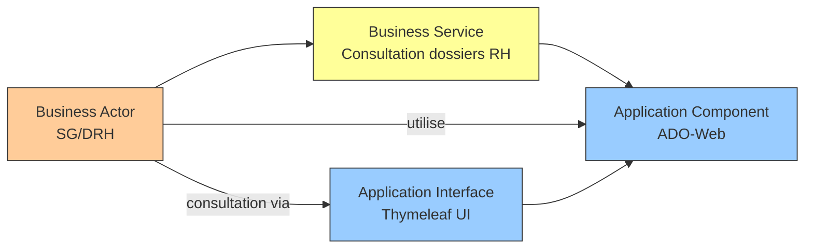

# 📁 Dossier d’Architecture Technique (DAT) – **ADO**  
*Projet : ADO – Consultation des dossiers RH archivés (ReHucit)*  

> **Version** : 1.0 – 27 / 03 / 2026  
> **Auteur** : équipe MOE – SG/DNUM/PNM/DPNM3  

---  

## 1️⃣ Vue d’ensemble ArchiMate  

```mermaid
graph TD
    %% Business layer;
    BActor[Business Actor<br/>SG/DRH]:::businessActor;
    BActor2[Business Actor<br/>SG/DNUM/PNM/DPNM3]:::businessActor;
    BRole[Business Role<br/>Utilisateur central]:::businessRole;
    BService[Business Service<br/>Consultation dossiers RH]:::businessService;
    BProc[Business Process<br/>Recherche d’agent]:::businessProcess;
    BProc2[Business Process<br/>Génération de rapports]:::businessProcess;
    BObj[Business Object<br/>Dossier RH (historique)]:::businessObject;
    %% Application layer;
    AComp[Application Component<br/>ADO‑Web (Spring‑Boot)]:::applicationComponent;
    AComp2[Application Component<br/>JasperReports Engine]:::applicationComponent;
    AService[Application Service<br/>AgentService]:::applicationService;
    AService2[Application Service<br/>RapportService]:::applicationService;
    AService3[Application Service<br/>JasperService]:::applicationService;
    AData[Data Object<br/>Entités JPA]:::dataObject;
    %% Technology layer;
    Node[Node<br/>VM Linux (ECO4 IaaS)]:::technologyNode;
    DB[Database Server<br/>PostgreSQL]:::technologyNode;
    OS[System Software<br/>Linux]:::systemSoftware;
    Tomcat[System Software<br/>Apache Tomcat]:::systemSoftware;
    HTTP[Technology Service<br/>HTTPS]:::technologyService;
    JDBC[Technology Service<br/>JDBC]:::technologyService;
    Artifact[Artifact<br/>ado‑web.war]:::artifact;
    %% Relationships;
    BActor -->|uses| BService;
    BActor2 -->|provides| BService;
    BRole -->|performs| BProc;
    BProc -->|realizes| BService;
    BProc2 -->|realizes| BService;
    BService -->|accesses| BObj;
    BService -->|realized by| AComp;
    AComp -->|exposes| AService;
    AComp -->|exposes| AService2;
    AComp -->|uses| AComp2;
    AComp2 -->|realizes| AService3;
    AService -->|uses| AData;
    AService2 -->|uses| AData;
    AService3 -->|uses| AData;
    AComp -->|deployed on| Node;
    Node -->|runs| OS;
    Node -->|runs| Tomcat;
    Node -->|runs| DB;
    AComp -->|uses| HTTP;
    AComp -->|connects to| JDBC;
    Artifact -->|deployed on| Node;
    classDef businessActor fill:#FFCC99,stroke:#333,stroke-width_2px;
    classDef businessRole fill:#FFCC99,stroke:#333,stroke-width_2px;
    classDef businessService fill:#FFFF99,stroke:#333,stroke-width_2px;
    classDef businessProcess fill:#FFFF66,stroke:#333,stroke-width_2px;
    classDef businessObject fill:#FFFFCC,stroke:#333,stroke-width_2px;
    classDef applicationComponent fill:#99CCFF,stroke:#333,stroke-width_2px;
    classDef applicationService fill:#99CCFF,stroke:#333,stroke-width_2px;
    classDef dataObject fill:#CCEEFF,stroke:#333,stroke-width_2px;
    classDef technologyNode fill:#99FF99,stroke:#333,stroke-width_2px;
    classDef systemSoftware fill:#99FF99,stroke:#333,stroke-width_2px;
    classDef technologyService fill:#99FF99,stroke:#333,stroke-width_2px;
    classDef artifact fill:#CCCCCC,stroke:#333,stroke-width_2px
```

*Ce diagramme montre la hiérarchie des couches : les **acteurs métier** utilisent le **service métier** “Consultation dossiers RH”, qui est réalisé par le **composant applicatif** `ADO‑Web`. Ce composant s’appuie sur les **services applicatifs** (`AgentService`, `RapportService`, `JasperService`) et sur les **services technologiques** (HTTPS, JDBC, Tomcat, PostgreSQL).*

---  

## 2️⃣ Couche Métier (Business Layer)

### 2.1 Acteurs & Rôles  

| Élément | Type | Description |
|--------|------|-------------|
| **SG/DRH** | Business Actor | Direction Générale des Ressources Humaines – mandatée pour la diffusion de l’historique RH. |
| **SG/DNUM/PNM/DPNM3** | Business Actor | Entité technique/support (déploiement, exploitation, sécurité). |
| **Utilisateur central** | Business Role | Services d’administration centrale (agents de la DRH) – accès aux dossiers historiques. |
| **Filtre Cerbere** (sécurité) | Business Interface | Point d’accès sécurisé (authentification SSO). |

### 2.2 Services Métier  

| Service | Description | Interface |
|---------|-------------|-----------|
| **Consultation dossiers RH** | Recherche d’un agent, affichage du Mini‑CV, détail complet, génération de rapports, historique d’accès. | UI : pages Thymeleaf ; API : REST / JSON. |
| **Gestion du journal** | Enregistrement de chaque accès (date, heure, matricule, paramètres). | Service interne. |
| **Purge du journal** | Suppression périodique des accès anciens (conforme aux exigences de conservation). | Batch job. |

### 2.3 Processus Métier  

| Processus | Description | Entrées | Sorties |
|-----------|-------------|--------|----------|
| **Recherche d’agent** | L’utilisateur saisit critères → le système interroge la vue `get_agents`. | Critères (nom, matricule, dates, lieu) | Liste d’agents (Mini‑CV). |
| **Consultation détail** | Sélection d’un agent → appel `get_agent_by_mat_rgp`. | Matricule RGP | Dossier complet (historique, affectations, carrières, etc.). |
| **Génération de rapport** | L’utilisateur choisit un type de rapport (acte, conjoint, enfant…) → appel au service `JasperService`. | Paramètres du rapport | Fichier (PDF / XLSX / CSV). |
| **Historique d’utilisation** | Extraction du journal (`historique`, `suivi_*`). | Période, email utilisateur | Tableau d’accès. |
| **Purge** | Exécution périodique → suppression des entrées antérieures à la date de purge. | Date de purge | Journal allégé. |

### 2.4 Objets & Événements Métier  

| Élément | Type | Description |
|--------|------|-------------|
| **Dossier RH (historique)** | Business Object | Ensemble des données RH au 30/05/2019 (identité, carrières, affectations, rémunération). |
| **Journal** | Business Object | Enregistrement d’un accès (date, heure, matricule, paramètre, rapport). |
| **Événement “Consultation”** | Business Event | Déclenche la création d’un enregistrement journal. |
| **Contrat d’accès** | Contract | Accord d’utilisation entre la DRH (SG/DRH) et le service ADO. |

---  

## 3️⃣ Couche Application (Application Layer)

### 3.1 Composants applicatifs  

| Composant | Description | Technologie |
|-----------|-------------|-------------|
| **ADO‑Web** | Application Spring Boot (war) contenant les contrôleurs, services et repositories. | Java 17, Spring Boot 2.7, Lombok, Thymeleaf |
| **JasperReports Engine** | Génération de rapports (PDF, XLSX, CSV). | JasperReports 6.x |
| **Spring Data JPA Repositories** | Interfaces `JpaRepository` (ex. `AgentRepository`, `Zy3bAffectationRepositoryI`). | Hibernate 5.6 |
| **Adapters** | Classes `*ToArrayAdapter` – conversion POJO → tableau de `String` pour les templates Jasper. | Java |
| **FiltreCerbere** | Filtre servlet d’authentification (SSO). | Spring Security (custom). |

### 3.2 Services applicatifs  

| Service | Interface | Implémentation | Responsabilité |
|---------|-----------|----------------|----------------|
| **IAgentService** | `AgentServiceImpl` | Recherche agents (`AgentRepository.getAgents`). |
| **IRapportService** | `RapportServiceImpl` | Récupération des actes (`AgentRepository.getRapportActe`). |
| **IJasperService** | `JasperServiceImpl` | Génération de rapports (exécution du .jrxml). |
| **IJournalService** | `JournalService` | Persistance du journal (`JournalRepository`). |
| **IRapportEtatServiceService** | `RapportEtatServiceServiceImpl` | Agrégation des lignes `RapportEtatService`. |

### 3.3 Données applicatives  

| Data Object | Description | Persistance |
|------------|-------------|-------------|
| **Agent** | Informations d’identité (matricule, nom, naissance). | Table `etat_civil`. |
| **RapportActe** | Acte administratif (nature, type, état). | Tables `zsag`, `zsaa`, `zd00`, … |
| **Zy3bAffectation**, **ZyagAbsences**, **ZydaTranchesAbsences**, **ZyflPip**, **ZygrCarriere**, **ZygsCarriereIndiciaire**, **ZypoPosition**, **ZytlModaliteService** | Entités JPA (PK composites). | Tables `zy3b_affectation`, `zyag_absences`, etc. |
| **Journal** | Enregistrement d’accès. | Table `journal`. |
| **MiniCv**, **EnfantCv**, **PositionCv**, **QuotitesCv**, … | DTOs métiers (pas de persistance directe). | – |

---  

## 4️⃣ Couche Technologie (Technology Layer)

### 4.1 Infrastructure  

| Élément | Type | Description |
|--------|------|-------------|
| **VM Linux (ECO4 IaaS)** | Node | Héberge le conteneur Tomcat et la base PostgreSQL. |
| **Apache Tomcat 9** | System Software | Serveur d’applications Java‑EE. |
| **PostgreSQL 13** | Database Server | Stockage des tables `etat_civil`, `journal`, `zy*`. |
| **OS – Linux (Debian/Ubuntu)** | System Software | Système d’exploitation de la VM. |
| **HTTPS (TLS 1.2/1.3)** | Technology Service | Accès sécurisé du front‑end. |
| **JDBC** | Technology Service | Connexion Java → PostgreSQL. |
| **JasperReports Server (embedded)** | Technology Service | Rend les rapports. |
| **Artifacts** | Artifact | `ado-web.war`, scripts SQL (`assembly.xml`). |

### 4.2 Services technologiques  

| Service | Fournisseur | Consommateur |
|---------|-------------|--------------|
| **HTTPS** | Tomcat (via keystore) | Navigateur client, API REST. |
| **JDBC** | PostgreSQL driver | Spring Data JPA. |
| **JasperEngine** | JasperReports lib | `JasperService`. |
| **OS‑Linux** | IaaS | Tous les composants. |

---  

## 5️⃣ Couche Stratégique (Strategy Layer) – *optionnelle mais décrite pour la traçabilité*

| Élément | Type | Description |
|--------|------|-------------|
| **Capability : Consultation historique RH** | Capability | Fournir un accès permanent aux dossiers RH archivés. |
| **Goal : Garantir la conformité RGPD** | Goal | Traiter les données personnelles selon la législation (DICT 1332). |
| **Driver : Obligation légale** | Driver | Décision d’homologation (25/03/2025). |
| **Principle : Sécurité‑by‑Design** | Principle | Authentification SSO, journalisation, chiffrement HTTPS. |
| **Requirement : Disponibilité ≥ 99,9 %** | Requirement | Hébergement IaaS, monitoring. |
| **Constraint : Conservation ≤ 3 ans** | Constraint | Purge du journal automatisée. |
| **Value : Accès aux dossiers non migrés** | Value | Permet aux services RH de consulter les dossiers manquants dans RenoiRH. |
| **Stakeholder : SG/DRH** | Stakeholder | Responsable du service et du suivi. |

---  

## 6️⃣ Couche de Mise en Œuvre & Migration (Implementation & Migration) – *optionnelle*

| Élément | Type | Description |
|--------|------|-------------|
| **Work Package WP‑01** | Work Package | Déploiement de `ADO‑Web` sur l’environnement IaaS (production). |
| **Deliverable D‑01** | Deliverable | Artefact `ado-web.war` + scripts SQL version 2.0.26. |
| **Plateau Baseline** | Plateau | Version actuelle : `ADO‑Web 2.0.26` (Git branch `release/2.0.26`). |
| **Plateau Target** | Plateau | Version cible : `ADO‑Web 2.1.0` (intégration de la sécurité Cerbere et du monitoring). |
| **Gap G‑01** | Gap | Absence d’automatisation du purge → implémentation d’un job Spring Batch. |
| **Migration Steps** | – | 1️⃣ Extraction des scripts `assembly.xml` → `DB‑Migration‑Tool`; 2️⃣ Déploiement du war via CI GitLab; 3️⃣ Validation fonctionnelle; 4️⃣ Passage en production avec bascule DNS. |

---  

## 7️⃣ Aspects Transverses (Cross‑layer Relationships)

| Relation | Source | Cible | Sens |
|----------|--------|-------|------|
| **Realization** | `Technology Service → Application Service` | HTTP → `AgentService` | ≙ |
| **Realization** | `Application Service → Business Service` | `AgentService` → “Consultation dossiers RH” | ≙ |
| **Assignment** | `Business Role → Business Process` | “Utilisateur central” → “Recherche d’agent” | ≙ |
| **Access** | `Business Process → Business Object` | “Recherche d’agent” → “Dossier RH” | read |
| **Influence** | `Driver → Goal` | “Obligation légale” → “Garantir conformité RGPD” | ≙ |
| **Serving** | `Application Component → Technology Service` | `ADO‑Web` → HTTPS | ≙ |
| **Serving** | `Application Component → Technology Service` | `ADO‑Web` → JDBC | ≙ |
| **Assignment** | `Application Service → Data Object` | `AgentService` → `Agent` (JPA) | ≙ |
| **Access** | `Application Service → Data Object` | `JasperService` → `RapportActe` | read |
| **Realization** | `Technology Service → Technology Node` | HTTPS → Tomcat | ≙ |
| **Assignment** | `Artifact → Application Component` | `ado-web.war` → `ADO‑Web` | ≙ |

---  

## 8️⃣ Vues Architecturales ArchiMate  

### 8.1 Vue de Coopération (Business ↔ Application)



### 8.2 Vue de Réalisation (Business → Application → Technology)

```mermaid
graph TD
    BService[Business Service<br/>Consultation dossiers RH]:::businessService --> AService[Application Service<br/>AgentService]:::applicationService;
    AService -->|uses| ARepo[Application Component<br/>AgentRepository]:::applicationComponent;
    ARepo -->|connects to| JDBC[JDBC]:::technologyService;
    JDBC -->|to| DB[PostgreSQL]:::technologyNode;
    AComp[ADO‑Web] -->|hosted on| Tomcat[Tomcat]:::systemSoftware;
    Tomcat -->|runs on| VM[VM Linux (ECO4)]:::technologyNode;
    classDef businessService fill:#FFFF99,stroke:#333,stroke-width_2px;
    classDef applicationService fill:#99CCFF,stroke:#333,stroke-width_2px;
    classDef applicationComponent fill:#99CCFF,stroke:#333,stroke-width_2px;
    classDef technologyService fill:#99FF99,stroke:#333,stroke-width_2px;
    classDef technologyNode fill:#99FF99,stroke:#333,stroke-width_2px;
    classDef systemSoftware fill:#99FF99,stroke:#333,stroke-width_2px
```

### 8.3 Vue de Migration (Baseline → Target)

| Étape | Action | Responsable | Artefact |
|------|--------|--------------|----------|
| **1** | Extraction des scripts SQL (`assembly.xml`) → `DB‑Migration‑Tool` | DBA / MOE | `scripts.zip` |
| **2** | Construction du war (`ado-web.war`) via pipeline CI/CD | DevOps | `ado-web.war` |
| **3** | Déploiement sur l’environnement de test (IaaS) | Ops | VM + Tomcat |
| **4** | Tests d’intégration (unitaires, fonctionnels, sécurité) | QA | Rapport JUnit, OWASP ZAP |
| **5** | Bascule DNS → production | Ops | DNS entry `ado.e2.rie.gouv.fr` |
| **6** | Activation du job de purge (Spring Batch) | MOE | `PurgeJob` |

---  

## 9️⃣ Vue de Traçabilité Complète  

| **Élément Métier** | **Service Métier** | **Composant App** | **Service App** | **Technologie** |
|--------------------|-------------------|-------------------|----------------|-----------------|
| Recherche d’agent | Consultation dossiers RH | `ADO‑Web` | `AgentService` | HTTPS / JDBC |
| Détail agent | Consultation dossiers RH | `ADO‑Web` | `AgentService` | HTTPS / JDBC |
| Génération rapport : Acte | Consultation dossiers RH | `ADO‑Web` | `JasperService` | HTTPS / JasperEngine |
| Historique d’accès | Gestion du journal | `ADO‑Web` | `JournalService` | HTTPS / JDBC |
| Purge du journal | Purge du journal | `ADO‑Web` (Spring Batch) | `PurgeJob` | JDBC |
| Accès base de données | Tous | `ADO‑Web` (Tomcat) | JPA Repositories | PostgreSQL |

---  

## 🔣 Glossaire des éléments ArchiMate utilisés  

| ArchiMate | Signification |
|-----------|---------------|
| **Business Actor** | Entité organisationnelle (ex. SG/DRH). |
| **Business Role** | Fonction jouée par un acteur (ex. Utilisateur central). |
| **Business Interface** | Point d’interaction (ex. FiltreCerbere). |
| **Business Service** | Service offert au métier (ex. Consultation dossiers RH). |
| **Business Process** | Suite d’activités métier (ex. Recherche d’agent). |
| **Business Object** | Concept d’information métier (ex. Dossier RH). |
| **Application Component** | Unité exécutable (ex. ADO‑Web). |
| **Application Service** | Fonctionnalité exposée par un composant (ex. AgentService). |
| **Data Object** | Structure de données manipulée (ex. Entités JPA). |
| **Technology Node** | Ressource d’infrastructure (ex. VM Linux). |
| **System Software** | Logiciel de base (ex. Tomcat, OS). |
| **Technology Service** | Service technologique (ex. HTTPS, JDBC). |
| **Artifact** | Produit physique (ex. war, scripts ZIP). |
| **Capability** | Aptitude à réaliser une fonction (ex. Consultation historique RH). |
| **Goal** | Objectif à atteindre (ex. Conformité RGPD). |
| **Driver** | Facteur de motivation (ex. Obligation légale). |
| **Requirement** | Exigence du système (ex. Disponibilité 99,9 %). |
| **Constraint** | Limite imposée (ex. Conservation ≤ 3 ans). |
| **Work Package** | Ensemble d’activités de mise en œuvre. |
| **Plateau** | État d’architecture (baseline / target). |
| **Gap** | Écart entre deux plateaux. |

---  

## 📚 Références  

| Document | Lien |
|----------|------|
| **ADO‑DAT (PDF)** | `ado-DAT_svg.pdf` |
| **Documentation technique v2.1** | `Documentation_ADO_v2_1.pdf` |
| **Script de création DB (v1.0.0)** | `ado_create_table_1.0.0.sql` |
| **Script migration 2.0.22 → 2.0.23** | `script_v2_0_22_to_v2_0_23.sql` |
| **JasperReports templates** | `jreports/*.jrxml` |
| **GitLab CI** | `.gitlab-ci.yml` |
| **Politique de sécurité** | `socle_securite_Ado_VersionJDS.xlsx` |
| **Notification tests d’intrusion** | `ADO_Cadre_Notification_Tests_Intrusion-signé.pdf` |

---  

### 🎯 Conclusion  

Le **DAT** ci‑dessus décrit l’ensemble des artefacts, processus et flux qui permettent à **ADO** de fournir, de façon sécurisée et conforme, la consultation historique des dossiers RH archivés. La modélisation ArchiMate montre clairement les dépendances entre les couches métier, applicative et technologique, ainsi que les relations stratégiques (objectifs de conformité, exigences de disponibilité) qui guident la mise en œuvre et les évolutions futures (migration vers le cloud PNM3).  

> **Prochaine étape** : valider le **Road‑Map de migration** (section 6) avec les équipes d’exploitation et lancer le **pipeline CI/CD** (GitLab) pour le déploiement automatisé de la version cible 2.1.0.  


---  

*Ce DAT a été généré à partir des sources du projet (code, scripts SQL, documentation wiki) et structuré selon la norme **ArchiMate 3.2** et le cadre **ISO/IEC/IEEE 42010**.*  