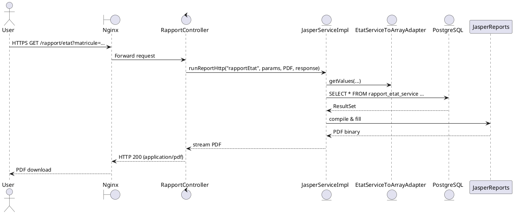

# 📄 Dossier d’Architecture Technique – ADO  
**Application :** ADO – Consultation des données RH archivées (ReHucit)  
**Version du DAT :** 1.0 – 27/04/2026  

[TOC]

---  

## 1️⃣ Introduction et objectifs  

**Vue d’ensemble fonctionnelle**  
ADO permet aux services d’administration centrale de consulter, à la date du 30/05/2019, les dossiers RH des agents archivés dans le SIRH ReHucit (avant la migration vers RenoiRH). L’application expose des pages de recherche d’agents, des fiches Mini‑CV, des rapports d’état de service et un historique d’utilisation.  

**Objectifs qualité orientés utilisateur**  

| # | Objectif | Motif |
|---|----------|-------|
| Q‑1 | **Disponibilité ≥ 99,5 %** | Accès permanent aux dossiers RH critiques pour les services d’administration. |
| Q‑2 | **Confidentialité ≥ Niveau 3 (DICT)** | Les données sont des données à caractère personnel (NIR, situation familiale, etc.). |
| Q‑3 | **Traçabilité ≥ 100 %** | Chaque consultation doit être journalisée (qui, quand, quel rapport). |
| Q‑4 | **Performance – temps de réponse ≤ 2 s** pour les requêtes de recherche d’agents. |
| Q‑5 | **Maintenabilité – couverture de tests unitaires ≥ 80 %** afin de garantir l’évolution sécurisée du code. |

---  

## 2️⃣ Niveau 1 – Vue Contexte (System Context)  

```plantuml
@startuml
!include https://raw.githubusercontent.com/plantuml-stdlib/C4-PlantUML/master/C4_Context.puml

Person(user, "Utilisateur métier", "SG/DRH ou SG/DNUM/PNM/DPNM3")
System(ado, "ADO – Application Web", "Spring Boot, Java 11")
System_Ext(rehucit, "SIRH ReHucit (legacy)", "Base de données PostgreSQL (scripts version 2.x)")
System_Ext(renoirh, "RenoiRH – Nouveau SIRH", "Base de données cible (non utilisée en lecture)")
System_Ext(cerbere, "Filtre Cerbere – AuthN/AuthZ", "SSO interne")
System_Ext(psin, "Supervision PSIN", "Prometheus / Grafana / Portainer")

Rel(user, ado, "Utilise")
Rel(ado, rehucit, "Lecture des tables agents, historiques, …")
Rel(ado, renoirh, "Vérification d’existence (optionnel)")
Rel(ado, cerbere, "Authentification SSO")
Rel(ado, psin, "Envoi métriques & logs")
@enduml
```

**Acteurs principaux**  

| Acteur | Rôle |
|--------|------|
| SG/DRH | Consommateur final (consultation dossiers agents) |
| SG/DNUM/PNM/DPNM3 | Responsable de la production et du support de l’application |
| Filtre Cerbere | Gestion de l’authentification unique et des droits d’accès |
| PSIN | Supervision de la disponibilité et de la santé de l’application |

---  

## 3️⃣ Parties prenantes  

| Rôle | Attente principale |
|------|--------------------|
| **MOA (Direction des Ressources Humaines)** | Accès fiable aux dossiers archivés, traçabilité complète. |
| **MOE (Équipe de développement – SG/DNUM/PNM/DPNM3)** | Architecture modulaire, facilité de mise à jour des rapports Jasper. |
| **RSSI (SG/DRH – Responsable SSI)** | Conformité au RGPD, D‑I‑C‑T, journalisation des accès. |
| **Exploitation (PSIN)** | Métriques de performance, alertes en cas d’indisponibilité. |
| **Utilisateurs métier** | Recherche rapide (≤ 2 s), export des rapports (PDF, XLSX, CSV). |

---  

## 4️⃣ Contraintes  

| Type | Description |
|------|-------------|
| **Techniques** | - Java 11, Spring Boot 2.x <br> - PostgreSQL 13 (scripts fournis dans `ado-database`) <br> - Docker / Kubernetes (déploiement) |
| **Organisationnelles** | - Cycle de vie de 3 ans (homologation 25/03/2025) <br> - Déploiement sur le cloud interne ECO4 (tenant *pnm3*) |
| **Réglementaires** | - **DICT** : Disponibilité = 1, Intégrité = 3, Confidentialité = 3, Traçabilité = 2 <br> - **DACP** : données à caractère personnel (NIR, situation familiale, etc.) <br> - **RGPD** : registre des traitements, droit d’accès, conservation (purge). |
| **Sécurité** | - Authentification via `FiltreCerbere` (SSO) <br> - Journalisation obligatoire (`journal` table) <br> - Sauvegarde chiffrée AES‑256 (voir annexes). |

---  

## 5️⃣ Niveau 2 – Vue Conteneurs (Containers)  

```plantuml
@startuml
!include https://raw.githubusercontent.com/plantuml-stdlib/C4-PlantUML/master/C4_Container.puml

System_Boundary(ado, "ADO – Système") {
    Container(ado_web, "ADO‑Web", "Docker / Spring Boot", "Exposition des API REST et pages Thymeleaf")
    ContainerDb(ado_db, "ADO‑DB", "PostgreSQL", "Schéma `ado_recette` contenant les tables agents, journal, …")
    Container(nginx, "Nginx LB", "Docker", "Load‑balancer + reverse‑proxy TLS termination")
    Container(ado_doc, "ADO‑Doc", "ZIP (Maven Assembly)", "Documentation technique & scripts")
}
Rel(nginx, ado_web, "HTTP/HTTPS")
Rel(ado_web, ado_db, "JDBC/SQL")
Rel(user, nginx, "HTTPS")
@enduml
```

### 5.1 Descriptions des conteneurs  

| Conteneur | Responsabilité | Technologie | Interactions clés |
|-----------|-----------------|--------------|-------------------|
| **ADO‑Web** | Application métier : contrôleurs, services, génération de rapports Jasper, journalisation. | Spring Boot, Java 11, Lombok, JasperReports, Thymeleaf, Docker. | → ADO‑DB (JDBC) ; ← Nginx (HTTPS) ; → FiltreCerbere (auth) ; → PSIN (metrics). |
| **ADO‑DB** | Persistance des données RH archivées (tables `journal`, `agent`, `rapport_*`, …). | PostgreSQL 13, scripts version 2.x (assemblés via `ado-database/assembly.xml`). | ← ADO‑Web (SQL) ; sauvegardes (AES‑256) vers stockage objet. |
| **Nginx LB** | Point d’entrée unique, TLS termination, répartition des requêtes entre deux instances de `ADO‑Web`. | Docker, configuration `nginx.conf`. | ← Utilisateurs ; → ADO‑Web (HTTP). |
| **ADO‑Doc** | Archive contenant les scripts SQL, la documentation et les livrables d’architecture. | Maven Assembly (ZIP) | Aucun runtime, uniquement utilisé lors du packaging. |

### 5.2 Décisions architecturales majeures  

| Décision | Raison |
|----------|--------|
| **Conteneurisation (Docker)** | Isolation, reproductibilité, alignement avec la plateforme IaaS ECO4. |
| **Spring Boot monolithique** | Taille du domaine fonctionnel restreinte, réduction de la complexité de déploiement. |
| **JasperReports** | Besoin d’export de rapports (PDF, XLSX, CSV) déjà éprouvé dans le SIRH. |
| **PostgreSQL** | Compatibilité avec les scripts existants, performances suffisantes pour les requêtes de lecture. |
| **Filtre Cerbere** | Centralisation de l’authentification via SSO interne, conformité aux exigences de sécurité. |

### 5.3 Environnement technique  

| Couche | Technologie |
|--------|-------------|
| **Langage** | Java 11 |
| **Framework** | Spring Boot 2.7, Spring Data JPA, Lombok |
| **Base de données** | PostgreSQL 13 (schéma `ado_recette`) |
| **Conteneurisation** | Docker ≥ 20.10, orchestré par Kubernetes (cluster PNM3) |
| **CI/CD** | GitLab CI, `mvnw` wrapper, `spring-boot-maven-plugin`, `maven-assembly-plugin` |
| **Monitoring** | Prometheus + Grafana, Portainer, logs via Logback (JSON). |
| **Sécurité** | TLS termination (Nginx), SSO (FiltreCerbere), chiffrement AES‑256 des sauvegardes. |

---  

## 6️⃣ Niveau 3 – Vue Composants (Components) – *Conteneur `ADO‑Web`*  

```plantuml
@startuml
!include https://raw.githubusercontent.com/plantuml-stdlib/C4-PlantUML/master/C4_Component.puml

Container(ado_web, "ADO‑Web", "Spring Boot")
Component(controller, "Controllers", "RestControllers + Thymeleaf", "Gestion des requêtes HTTP")
Component(service, "Services", "Business logic (IAgentService, IRapportService, IJasperService, …)", "Orchestration, appel aux repositories")
Component(repository, "Repositories", "Spring Data JPA", "Accès aux entités JPA")
Component(adapter, "Adapters", "Conversion POJO → String[] (CSV/Jasper)", "ex. EtatServiceToArrayAdapter")
Component(dto, "DTOs", "Objets de transfert (AgentDto, RapportEtatServiceDto, …)", "Sérialisation JSON")
Component(util, "Utilitaires", "AdoUtil, JRepOutputFormats, Exceptions", "Gestion des constantes, formats, erreurs")
Rel(controller, service, "Appelle")
Rel(service, repository, "Utilise")
Rel(service, adapter, "Transforme pour Jasper")
Rel(controller, dto, "Renvoie")
Rel(service, util, "Utilise")
@enduml
```

### 6.1 Composants détaillés  

| Composant | Packages | Responsabilité |
|-----------|----------|----------------|
| **Controllers** | `fr.gouv.e2.ado.controllers.*` | Points d’entrée HTTP (ex. `AgentController`, `MiniCvController`, `RapportController`). |
| **Services** | `fr.gouv.e2.ado.services.*` | Logique métier : recherche agents, génération de rapports, accès journal. |
| **Repositories** | `fr.gouv.e2.ado.dao.*` | Interfaces `JpaRepository` (ex. `AgentRepository`, `Zy3bAffectationRepositoryI`). |
| **Adapters** | `fr.gouv.e2.ado.models.adapters.*` | Conversion des modèles métier en tableau de `String` pour JasperReports (ex. `EtatServiceToArrayAdapter`). |
| **DTOs** | `fr.gouv.e2.ado.dto.*` | Objets légers pour le transport client‑serveur (ex. `HistoriqueDto`, `SuiviDto`). |
| **Utilitaires** | `fr.gouv.e2.ado.util.*` | Enum `JRepOutputFormats`, constantes, exceptions (`MultipleProfilsException`). |
| **Exceptions** | `fr.gouv.e2.ado.exceptions.*` | Gestion d’erreurs spécifiques (`JReportExportException`). |

---  

## 7️⃣ Niveau 4 – Vue Code (exemple de séquence)  

### 7.1 Scénario : Recherche d’un agent  

```plantuml
@startuml
!include https://raw.githubusercontent.com/plantuml-stdlib/C4-PlantUML/master/C4_Deployment.puml

actor User
boundary Nginx
control AgentController
entity AgentService
entity AgentRepository
database PostgreSQL

User -> Nginx : HTTPS GET /agents?motif=…&bornAfter=…
Nginx -> AgentController : Forward request
AgentController -> AgentService : getAgents(motif, bornAfter, bornBefore)
AgentService -> AgentRepository : findByCriteria(...)
AgentRepository -> PostgreSQL : SELECT …
PostgreSQL --> AgentRepository : ResultSet
AgentRepository --> AgentService : List<Agent>
AgentService --> AgentController : List<AgentDto>
AgentController --> Nginx : JSON 200 OK
Nginx --> User : JSON 200 OK
@enduml
```

### 7.2 Scénario : Génération d’un rapport Jasper (PDF)  



---  

## 8️⃣ Vue Déploiement *(section standardisée)*  

```plantuml
@startuml
!include https://raw.githubusercontent.com/plantuml-stdlib/C4-PlantUML/master/C4_Deployment.puml

Deployment_Node(cloud, "Cloud ECO4", "OpenStack Tenant pnm3") {
    Deployment_Node(nginx, "Nginx Cluster", "Load Balancer") {
        Container(app, "ADO‑Web", "Docker", "Spring‑Boot")
    }
    Deployment_Node(db, "Base de données", "PostgreSQL") {
        ContainerDb(database, "ADO‑DB", "PostgreSQL", "Schéma `ado_recette`")
    }
}

Rel(nginx, app, "HTTP/HTTPS")
Rel(app, database, "JDBC/SQL")
@enduml
```

### 8️⃣ Environnements  

| Environnement | Hébergement | Serveurs | Réseau | Particularités |
|---------------|------------|----------|--------|----------------|
| **Développement** | VM interne DEV | 1 × nginx, 1 × ado‑web, 1 × postgres | VLAN DEV | Accès limité aux développeurs. |
| **Recette** | VM RECETTE | 2 × nginx (HA), 2 × ado‑web, 1 × postgres | VLAN RECETTE | Jeux de données anonymisées. |
| **Production** | **ECO4 – Paris La Défense** | 2 × nginx LB, 4 × ado‑web (Docker), 1 × postgres HA | VLAN PROD | TLS 1.3, sauvegardes AES‑256, monitoring Prometheus. |

### 8️⃣ Infrastructure (texte)  

Le produit est hébergé sur le cloud interne **ECO4** basé sur **OpenStack** dans le tenant **pnm3** du département.  
Le reverse‑proxy Nginx du schéma ci‑dessus est en fait une paire de serveurs Nginx load‑balancés en frontal des produits hébergés sur le tenant.  

### 8️⃣ Supervision  

Le produit est supervisé via le système standard du GTI :  
- **Portainer** : gestion des conteneurs Docker.  
- **Stack Prometheus / Grafana / Loki / AlertManager** : métriques, logs, alertes.  
- **Supervision PSIN** : tableau de bord dédié.  

### 8️⃣ Sauvegardes  

Les sauvegardes de la base de données sont assurées par des scripts standards du GTI permettant la création de dumps chiffrés en **AES‑256** et déposés sur :  
- le stockage objet **B3** du IaaS ministériel,  
- le stockage objet **Outscale SecNumCloud** (via la prestation du GTI « Nuage Public »),  
- le stockage objet standard de **Google Cloud** (via la prestation du GTI « Nuage Public »).  

---  

## 9️⃣ Sujets transverses  

| Sujet | Traitement dans ADO |
|-------|---------------------|
| **Authentification & Autorisation** | Filtre `FiltreCerbere` (SSO) → rôle : lecture seule, accès limité aux agents. |
| **Journalisation** | Table `journal` : chaque appel (date, heure, matricule, rapport, paramètres) – conformité D‑I‑C‑T. |
| **Monitoring & Alerting** | Prometheus collecte métriques (`http_requests_total`, `response_time_seconds`). Alertes sur latence > 2 s ou disponibilité < 99,5 %. |
| **Gestion des erreurs** | Exceptions spécifiques (`JReportExportException`, `MultipleProfilsException`) → réponses HTTP 500 avec trace contrôlée. |
| **API** | Exposition REST (JSON) pour recherche agents, mini‑CV, rapports. |
| **Export** | JasperReports → PDF, XLSX, CSV, TXT, DOCX – contrôles de taille et de type MIME via `JRepOutputFormats`. |
| **Sécurité des données** | Chiffrement des sauvegardes, communication TLS, filtrage SSO, masquage du NIR dans les exports (hashage). |
| **Conformité RGPD** | Purge automatisée (`JournalService.purge(date)`) ; droit d’accès via interface. |

---  

## 🔟 Exigences de qualité  

| Exigence | Scénario de validation |
|----------|------------------------|
| **Disponibilité ≥ 99,5 %** | Test de charge simulant 100 utilisateurs simultanés pendant 24 h ; vérifier le taux de succès > 99,5 %. |
| **Confidentialité Niveau 3** | Audit de pénétration (OWASP ZAP) : aucune fuite de NIR ou données personnelles en clair. |
| **Traçabilité 100 %** | Vérifier que chaque appel à `/rapport/*` crée une ligne dans `journal` avec les champs requis. |
| **Performance ≤ 2 s** | Benchmark JMeter sur la requête `GET /agents?motif=…` ; mesurer le temps moyen. |
| **Couverture de tests ≥ 80 %** | Rapport JaCoCo ≥ 80 % après chaque build CI. |
| **Résilience – bascule DB** | Simuler la perte du nœud PostgreSQL ; vérifier le basculement automatique (recovery). |

---  

## 1️⃣1️⃣ Risques et dettes techniques  

| Risque / Dette | Impact | Mesure d’atténuation |
|----------------|--------|----------------------|
| **Données sensibles exposées** | Violation RGPD (confidentialité = 3) | Chiffrement AES‑256 des sauvegardes, TLS 1.3, filtrage SSO, masquage NIR dans les exports. |
| **Index `nudoss` massifs** | Dégradation des performances d’insertion | Re‑évaluer les index, ajouter `INCLUDE` sur colonnes non‑requises, purge périodique. |
| **Dépendance à `FiltreCerbere`** | Point unique de défaillance d’authentification | HA du filtre via deux instances Nginx, fallback sur token JWT. |
| **Scripts SQL versionnés manuellement** | Risque d’incohérence entre environnements | Intégrer Flyway / Liquibase dans le pipeline CI pour appliquer les migrations de façon déclarative. |
| **Code dupliqué dans les *Adapters*** | Dette de maintenance | Consolidation via interface `ArrayAdapter<T>` et génération automatique (MapStruct). |
| **Pas de tests d’intégration pour les rapports Jasper** | Risque de régression visuelle | Ajouter tests d’intégration avec `jasperreports‑test` pour valider le rendu PDF/XLSX. |

---  

## 1️⃣2️⃣ Annexes  

### 12.1 Glossaire  

| Terme | Définition |
|-------|------------|
| **ADO** | Application de consultation des dossiers RH archivés (ReHucit). |
| **ReHucit** | Ancien SIRH (avant RenoiRH). |
| **RenoiRH** | Nouveau SIRH, source de vérité actuelle. |
| **Cerbere** | Filtre d’authentification SSO interne. |
| **PSIN** | Plateforme de supervision interne (Prometheus, Grafana, Portainer). |
| **DICT** | Modèle D‑I‑C‑T (Disponibilité, Intégrité, Confidentialité, Traçabilité). |
| **DACP** | Données à Caractère Personnel. |
| **ECO4** | Cloud interne du ministère (OpenStack). |
| **JasperReports** | Bibliothèque de génération de rapports (PDF, XLS, …). |
| **Adapter** | Pattern de conversion d’un POJO métier vers un tableau de `String` (CSV/Jasper). |

### 12.2 Décisions d’Architecture (ADR) – Extraits  

| ADR # | Décision | Statut | Date | Raison |
|-------|----------|--------|------|--------|
| ADR‑001 | Utiliser Docker pour tous les composants | **Approuvée** | 15/02/2024 | Uniformiser le déploiement sur le cloud ECO4. |
| ADR‑002 | Centraliser l’authentification via `FiltreCerbere` | **Approuvée** | 20/03/2024 | Réduction du périmètre de sécurité, conformité SSO. |
| ADR‑003 | Générer les scripts SQL via Maven Assembly | **Approuvée** | 10/04/2024 | Packaging fiable, versionnage simple. |
| ADR‑004 | Utiliser JasperReports pour l’export des rapports | **Approuvée** | 12/04/2024 | Besoin d’exports multi‑formats déjà présent dans le SIRH. |
| ADR‑005 | Stocker les sauvegardes sur trois supports (B3, Outscale, GCP) | **Approuvée** | 01/05/2024 | Redondance et conformité aux exigences de continuité. |

---  

*Ce DAT a été généré le **27/04/2026** à partir des sources du projet ADO (modules `ado‑web`, `ado‑database`, `ado‑doc`) et de la documentation métier (wiki, spécifications, historiques de version). Toutes les références internes utilisent des ancres Markdown pour une navigation fluide.*  