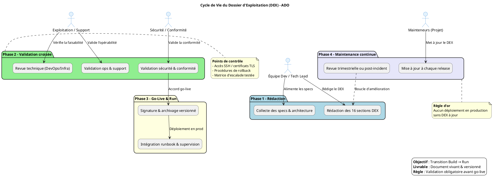

# 📄 Dossier d’Exploitation (DEX) – ADO  
**Document établi sur les principes de la transition Build → Run et des bonnes pratiques ITIL/DevOps pour l’exploitation applicative**  

[TOC]

---  

## 1️⃣ Introduction et objectifs  

> **Document de référence garantissant la continuité, la maintenabilité et la sécurisation de l’exploitation d’une application en production**  

### 🎯 Objectifs opérationnels  

| ✅ | Objectif |
|---|----------|
| ✅ | Assurer la continuité de service |
| ✅ | Documenter les procédures de gestion courante |
| ✅ | Faciliter le support et la résolution d’incidents |
| ✅ | Encadrer les responsabilités (Dev / Ops / Support) |
| ✅ | Assurer la conformité et la maîtrise des risques |
| ✅ | Accompagner la phase de transition **Build → Run** |

---  

## 2️⃣ Contexte d’usage et périmètre  

| Élément | Valeur |
|---|---|
| **Type de livrable** | Standard ✅ |
| **Nature** | Document de référence 📘 |
| **Activité** | Transition **Build → Run / Exploitation** |
| **Quand l’utiliser** | • Avant chaque mise en production (DEX obligatoire avant le *go‑live*)<br>• Support de formation des équipes d’exploitation<br>• Audits de conformité, PRA/PCA, revues de sécurité |
| **Cycle de vie** | Document vivant – mise à jour à chaque évolution fonctionnelle, technique ou d’infrastructure |
| **Application** | **ADO** – Consultation des dossiers RH archivés de ReHucit (date de référence : 30/05/2019) |
| **Environnement cible** | Production – Centre‑serveur ministériel Paris La Défense (IaaS ECO4) |
| **Stack technique** | Java 17 / Spring Boot 2.x, PostgreSQL 9+, JasperReports, Lombok, Maven, Thymeleaf |
| **SLA (exemple)** | Disponibilité ≥ 99,5 % / Temps de résolution ≤ 4 h (à adapter) |
| **Contacts clés** | • **Eric BOYON** – SG/DRH/P/DSNUMRH <eric.boyon@developpement-durable.gouv.fr> <br>• **DP‑NM3** – SG/DNUM/PNM/DPNM3 <dpnm3.pnm.dnum.sg@developpement-durable.gouv.fr> |
| **Politiques** | Sauvegarde daily + rétention 30 jours, chiffrement TLS 1.2+, authentification via **FiltreCerbere** (SSO LDAP) |

---  

## 3️⃣ Pré‑requis et jalons  

- [ ] Architecture technique validée & schémas à jour (diagrammes UML, topologie réseau)  
- [ ] Environnement de production stabilisé (accès, DNS, certificats)  
- [ ] Politiques définies : sauvegarde, supervision, sécurité, SLA  
- [ ] Contacts clés identifiés (métiers, techniques, support, sécurité)  
- [ ] Outillage prêt : monitoring (Prometheus / Grafana), logging (ELK), ordonnanceur (Cron), gestion des secrets (Vault)  

> ⏱ **Jalon critique** – Le DEX doit être **validé et signé** avant tout déploiement en production. Aucun *go‑live* ne doit intervenir sans un DEX approuvé.  

---  

## 4️⃣ Gouvernance et rôles  

| Rôle | Profil type | Responsabilité |
|------|------------|----------------|
| **Rédacteur principal** | Tech Lead / DevOps / Référent Prod | Rédaction, structuration, intégration des spécifications techniques |
| **Validateur Exploitation** | Chef d’exploitation / Responsable support | Vérification de l’opérabilité et de la complétude |
| **Validateur Sécurité/Conformité** | RSSI / DPO / Auditeur interne | Validation des procédures de sécurité, sauvegarde, conformité |
| **Mainteneur** | Équipe projet / PO technique | Mise à jour continue à chaque release ou changement d’infra |

---  

## 5️⃣ Structure détaillée du DEX (16 sections standards)  

| N° | Section principale | Contenu attendu (exemples) |
|---:|-------------------|----------------------------|
| 1 | **Généralités** | Objet, domaine d’application, audience cible, versionnage du document |
| 2 | **Documents applicables et de référence** | Normes internes, chartes, architecture, politiques sécurité (ex. : « Socle‑sécurité ADO », « Documentation Technique v2.2 », « DAT »), procédures ITIL |
| 3 | **Terminologie** | Glossaire technique/métier, abréviations (ex. : ADO, SIRH, RGP, RRH, SLA, DICT, DACP) |
| 4 | **Spécificités** | Fonctionnalités critiques (consultation historique, rapports Jasper), SLA/SLO, contacts clés, matrice d’escalade |
| 5 | **Architecture** | Schémas logiques/physiques (Spring Boot, PostgreSQL, JasperReports, FiltreCerbere), flux de données (requêtes SQL → Service → Controller → Vue), PRA/PCA |
| 6 | **Serveurs** | Accès (SSH, console), OS (Linux RHEL 8), CPU/RAM/Stockage, noms DNS/IP, ports (8080 / 443) |
| 7 | **Application** | Modules (Web, DB, Docs), versions (ADO v2.0.26), paramètres (application.properties), procédure de déploiement (Maven package → Docker image → Kubernetes) |
| 8 | **Supervision et métrologie** | Outils (Prometheus + Grafana, ELK), seuils d’alerte (latence > 2 s, erreurs 5xx > 1 % / heure), dashboards, métriques clés (temps de réponse, taux d’erreur, disponibilité DB) |
| 9 | **Sauvegarde** | Fréquence (daily full + hourly incremental), rétention (30 jours), localisation (Vault / Data‑Center), procédure de restauration (testée mensuellement) |
|10 | **Stockage** | Inventaire des volumes (DB data = 200 Go, logs = 50 Go), quotas, chemins d’accès, gestion des logs (logrotate) |
|11 | **Inventaire des bases** | PostgreSQL 9+, schémas (`ado_recette`), utilisateurs (`ado`), maintenance (VACUUM daily, REINDEX weekly) |
|12 | **Flux inter‑applicatifs** | API internes (ex. : service d’authentification SSO), protocoles (HTTPS, JDBC), ports (5432), authentification (Kerberos/LDAP) |
|13 | **Plan de production** | Ordonnancement (cron pour purge journal, backup), fenêtres de maintenance (dimanche 02:00‑04:00), procédures de rollback |
|14 | **Sécurisation des images** | Scan de vulnérabilités (Trivy), hardening Dockerfile, gestion des secrets (HashiCorp Vault), politiques de patching (critical ≤ 7 jours) |
|15 | **Opérations courantes** | Check‑list quotidienne (vérif logs, health‑check), gestion des logs, erreurs connues (ex. : `JReportExportException`), diagnostics rapides |
|16 | **Opérations récurrentes** | Gestion des comptes (déprovisionnement), rotation des certificats TLS (90 jours), nettoyages (tables temporaires), audits de sécurité trimestriels |

> ⚠️ **Adaptation** – Supprimez ou fusionnez les sections qui ne s’appliquent pas (ex. : si vous migrez vers un SaaS, la section *Serveurs* devient *Services managés*).  

---  

## 6️⃣ Diagramme PlantUML du cycle de vie DEX  



---  

## 7️⃣ Conseils de rédaction et maintenance  

| ✅ Bonne pratique | ❌ À éviter |
|------------------|--------------|
| Utiliser un dépôt **Git** versionné (tags `DEX‑vX.Y.Z`) | Stocker le DEX en pièce jointe email ou sur un partage non versionné |
| Rédiger en langage clair, orienté action (ex. : « Vérifier le backup » plutôt que « Contrôler » ) | Utiliser des descriptions vagues ou purement théoriques |
| Inclure des captures d’écran, chemins exacts et commandes (ex. : `pg_dump -Fc …`) | Laisser des placeholders `[À COMPLÉTER]` en production |
| Prévoir une revue systématique à chaque release majeure | Considérer le DEX comme un document « jetable » post‑lancement |
| Lier le DEX aux runbooks, tickets d’incident et procédures PRA | Isoler le DEX des outils de supervision et de ticketing |

---  

## 8️⃣ Adaptations contextuelles  

| Contexte | Adaptation recommandée |
|----------|------------------------|
| **Applications Cloud / Serverless** | Remplacer les sections *Serveurs* par *Services managés, IAM, Config as Code, Limits/Quotas* |
| **Secteur réglementé (Santé, Finance, Public)** | Renforcer les sections Sécurité, Traçabilité, Archivage légal, Conformité RGAA/ANSSI |
| **Legacy / Monolithe** | Insister sur la dépendance OS, les patches, la compatibilité, les procédures de reprise manuelle |
| **Microservices / Kubernetes** | Remplacer *Inventaire BDD/Serveurs* par *Clusters, Namespaces, Helm/Manifests, Observabilité (Prometheus/Grafana/Loki)* |
| **ADO (archivage RH)** | Ajouter une section **Conformité RGPD** (DACP, NIR) et **Période de rétention** (30 jours) |

---  

## 9️⃣ Livrables et intégration  

| Livrable | Description | Format |
|----------|-------------|--------|
| **DEX versionné** | Markdown + diagramme PlantUML, stocké dans le repo `docs/DEX-ADO.md` | `.md` (Git) |
| **Checklist de validation** | Signatures (PDF) : Dev, Ops, Sécurité | `.pdf` |
| **Matrice de traçabilité** | DEX ↔ Architecture ↔ Runbooks ↔ Tickets | Excel / Confluence |
| **Intégration CI/CD** | Pipeline vérifie la présence du fichier `DEX-ADO.md`, lance un lint PlantUML, bloque le merge si absent | GitLab CI |
| **Liens DEX** | Ajout dans les pages d’accueil Grafana / Kibana pour accéder rapidement au DEX | URL interne |

---  

## 🔎 Mini‑glossaire  

| Acronyme | Signification |
|----------|----------------|
| **ADO** | Application de consultation des dossiers RH archivés (ReHucit) |
| **SIRH** | Système d’Information des Ressources Humaines |
| **RGP / RRH** | Matricule ReHucit / Référentiel RH |
| **SLA** | Service Level Agreement (engagement de service) |
| **SLO** | Service Level Objective (objectif de niveau de service) |
| **DICT** | Disponibilité – Intégrité – Confidentialité – Traçabilité |
| **DACP** | Données à Caractère Personnel |
| **PRA/PCA** | Plan de Reprise d’Activité / Plan de Continuité d’Activité |
| **SSO** | Single Sign‑On (FiltreCerbere) |
| **JasperReports** | Moteur de génération de rapports (PDF, XLS, CSV, …) |
| **Vault** | Gestionnaire de secrets (tokens, certificats) |
| **Prometheus / Grafana** | Système de métriques & dashboards de supervision |
| **ELK** | Elasticsearch + Logstash + Kibana – stack de logs |
| **GitLab CI** | Pipeline d’intégration continue utilisé pour le projet |

---  

## 📌 Mention finale  

> **Document établi sur les principes de la transition Build → Run et des bonnes pratiques ITIL/DevOps pour l’exploitation applicative**  

---  

*Ce DEX est **auto‑porté** : il peut être ouvert, modifié et versionné directement depuis VS Code, Obsidian ou tout autre éditeur Markdown, sans dépendance externe.*  

---  

### 📂 Structure de dépôt recommandée  

```
/repo‑ado
│
├─ docs/
│   └─ DEX-ADO.md          ← (ce fichier)
│   └─ architecture.png   ← schéma d’architecture
│   └─ plantuml/…          ← diagrammes PlantUML
│
├─ ado‑database/
│   ├─ src/main/resources/
│   │   └─ scripts/…       ← scripts SQL versionnés
│   └─ pom.xml
│
├─ ado‑web/
│   ├─ src/main/java/…      ← code Java (Spring Boot)
│   ├─ src/main/resources/
│   │   ├─ application.properties
│   │   └─ jreports/…      ← templates JasperReports
│   └─ pom.xml
│
├─ .gitlab-ci.yml           ← pipeline CI/CD (inclut validation DEX)
└─ README.md                ← aperçu projet
```

---  

### ✅ Comment personnaliser en **5 minutes**  

1. Ouvrez `docs/DEX-ADO.md`.  
2. Remplacez les placeholders `[À COMPLÉTER]` par vos valeurs (ex. : numéro de ticket, contacts, SLA).  
3. Mettez à jour le tableau **Documents applicables** avec les liens internes (ex. : `[[Documentation Technique v2.2]]`).  
4. Validez le diagramme PlantUML (ou conservez‑le tel quel).  
5. Commitez : `git add docs/DEX-ADO.md && git commit -m "Update DEX – vX.Y.Z"` et poussez.  

Le DEX est alors **prêt à être utilisé** par les équipes de développement, d’exploitation et de sécurité.  