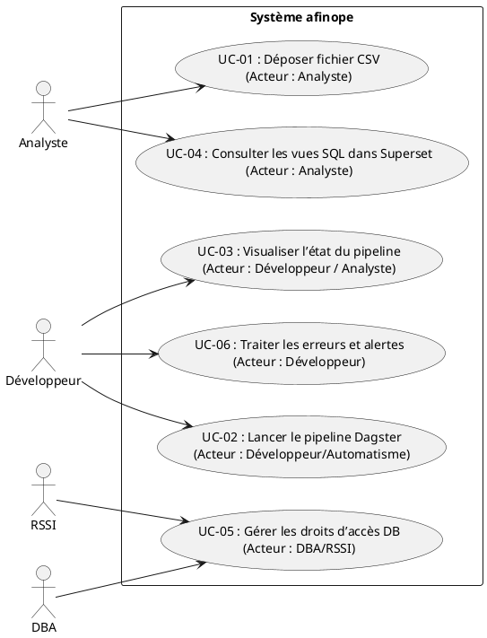

# 📄 Cahier des Charges Fonctionnel (CCF) – Projet **afinope**

[TOC]

---  

## 1️⃣ Introduction et contexte du projet  

| Élément | Description |
|---|---|
| **Nom du projet** | **afinope** – Application de traitement et de pilotage des données financières de l’État. |
| **Périmètre organisationnel** | Ministère/Direction financière de l’État, services comptables et de contrôle budgétaire. |
| **Objectifs stratégiques** | 1. Centraliser les flux de données financières (référentiels, exécutoires, exécutions).<br>2. Garantir la qualité, la traçabilité et la conformité RGPD/ RGS.<br>3. Produire des tableaux de bord (Superset) et des exports pour les contrôles internes. |
| **Périmètre fonctionnel** | **Inclus** : ingestion de fichiers CSV, validation, transformation, persistance dans PostgreSQL, génération de vues SQL, orchestration Dagster, exposition d’un serveur web (port 4400).<br>**Exclus** : création/modification du schéma de la base, gestion des accès réseau, développement de visualisations Superset (hors scope du CCF). |
| **Environnement technique** | Python 3.11, Pandas, SQLAlchemy, Dagster, PostgreSQL (Docker), Docker‑Compose, Superset (lecture des vues). |
| **Livrables attendus** | • Code source (déjà existant).<br>• Documentation fonctionnelle (CCF).<br>• Scripts d’initialisation de la base.<br>• Diagrammes d’usage et de processus.<br>• Jeux de tests d’acceptation. |

---  

## 2️⃣ Expression fonctionnelle du besoin *(NF EN 16271)*  

### 2.1 Décomposition en fonctions de service  

| N° | Fonction de service (FS) | Description (quoi) | Critères d’appréciation | Pondération* | Contraintes |
|---|---|---|---|---|---|
| **FS‑01** | **Ingestion de flux CSV** | Lire les fichiers CSV déposés dans le répertoire d’entrée, les lister et les déplacer vers les dossiers *sortie* ou *erreur* après traitement. | - Tous les fichiers *.csv* présents sont détectés en ≤ 5 s.<br>- Aucun fichier non‑CSV n’est déplacé.<br>- Les fichiers sont déplacés sans perte de données. | 15 % | Chemins configurables via `Flux.entree`, `Flux.sortie`, `Flux.erreur`. |
| **FS‑02** | **Validation du format** | Vérifier la conformité du contenu (délimiteur, encodage UTF‑8, présence des colonnes attendues, types numériques, dates valides). | - Taux de conformité ≥ 99 %.<br>- Rapport d’erreurs généré (log + fichier `*.err`). | 12 % | Utilisation de `pandas.isna`, `int_to_bool`, `str_to_float`. |
| **FS‑03** | **Transformation métier** | Appliquer les règles de conversion (ex : `"" → 0`, booléens, format monétaire, normalisation des codes). | - Transformation 100 % conforme aux règles métier (voir § 6). | 12 % | Implémentée dans `helper.py` et `transformateur.py`. |
| **FS‑04** | **Persistance en base** | Insérer les DataFrames validés dans les tables PostgreSQL correspondantes (ex : `ORGANISME`, `BAL`, `ABE`, …). | - Insertion sans erreur SQL.<br>- Aucun doublon (clé primaire) créé. | 15 % | Utilise `GestionnaireBaseDonnees.stocker_dataframe`. |
| **FS‑05** | **Initialisation du schéma** | Créer (ou mettre à jour) les tables référentielles et d’exécution à partir des scripts SQL fournis. | - Tous les scripts s’exécutent avec succès.<br>- Schéma complet disponible après le premier déploiement. | 10 % | `AfinopeBase.metadata.create_all`. |
| **FS‑06** | **Orchestration du pipeline** | Définir un DAG Dagster qui enchaîne ingestion → validation → transformation → persistance → génération de vues. | - Exécution complète du DAG en ≤ 10 min pour un lot de 10 000 lignes.<br>- Re‑exécution possible en cas d’erreur. | 13 % | `resources.py` (Dagster resources). |
| **FS‑07** | **Exposition d’une API de suivi** | Fournir un serveur web (Dagster‑Webserver) affichant l’état du pipeline, les logs et les métriques. | - UI disponible sur `http://localhost:4400/afinope`.<br>- Temps de réponse ≤ 2 s. | 8 % | Docker‑Compose expose le port 4400. |
| **FS‑08** | **Gestion des erreurs et traçabilité** | Centraliser les exceptions, créer des fichiers de log et des alertes (ex : fichier `*.err`). | - Tous les incidents sont loggés avec stacktrace.<br>- Historique conservé ≥ 30 jours. | 5 % | `logging` intégré à Dagster et aux classes Python. |
| **FS‑09** | **Sécurité et conformité** | Garantir la conformité RGPD/RGS (masquage des données sensibles, accès limité). | - Aucun champ PII n’est exporté hors du périmètre.<br>- Accès DB limité aux comptes `afinope` et `dagster`. | 5 % | Variables d’environnement `.env` (DB credentials). |

\* **Pondération** = importance relative pour l’évaluation des offres (somme = 100 %).  

---  

## 3️⃣ Acteurs et parties prenantes  

| Rôle | Description | Besoins spécifiques |
|---|---|---|
| **MOA (Maître d’Ouvrage)** | Direction financière, pilotage budgétaire. | - Fiabilité des données.<br>- Rapports de conformité.<br>- Accès aux tableaux de bord. |
| **MOE (Maître d’Œuvre)** | Équipe de développement (DevOps, Data‑Engineers). | - Documentation technique.<br>- Environnements de test et prod.<br>- Outils d’orchestration (Dagster). |
| **Utilisateur final** | Analystes comptables, contrôleurs internes. | - Consultation des données via Superset.<br>- Recherche par code organisme, exercice, nature. |
| **RSSI** | Responsable de la sécurité des systèmes d’information. | - Gestion des accès, chiffrement, audit. |
| **DBA** | Administrateur de la base PostgreSQL. | - Gestion des schémas, sauvegardes, restauration. |
| **Ops / SRE** | Opérations et fiabilité du service. | - Monitoring du conteneur, disponibilité 99,5 %. |

---  

## 4️⃣ Cas d’usage (Use Cases)  



| UC | Description (scénario nominal) | Acteur(s) principal(aux) | Scénarios alternatifs / d’erreur | Pré‑conditions | Post‑conditions |
|---|---|---|---|---|---|
| **UC‑01** | L’analyste copie un ou plusieurs fichiers CSV dans le répertoire `entree`. Le système les détecte, les valide et les déplace vers `sortie` ou `erreur`. | Analyste | 1️⃣ Aucun fichier → aucun traitement.<br>2️⃣ Fichier non‑CSV → rejet immédiat. | Le répertoire `entree` existe et est accessible. | Les fichiers sont correctement classés, les logs sont mis à jour. |
| **UC‑02** | Le pipeline Dagster est déclenché (manuellement ou via cron). Il exécute les étapes FS‑01 à FS‑07. | Développeur / Scheduler | 1️⃣ Erreur de validation → arrêt du DAG, génération d’un fichier `.err`.<br>2️⃣ Connexion DB perdue → retry 3×, puis alerte. | Dagster Webserver en marche, les ressources (`afinope`, `circuit_alimentation`) sont disponibles. | Tous les DataFrames valides sont stockés, les vues sont rafraîchies. |
| **UC‑03** | L’acteur consulte l’interface web Dagster pour visualiser l’état du pipeline, les logs et les métriques. | Analyste / Développeur | 1️⃣ Authentification échouée → accès refusé.<br>2️⃣ UI lente → optimisation du serveur. | Le serveur web est exposé (`localhost:4400`). | L’état du DAG est affiché en temps réel, les logs sont consultables. |
| **UC‑04** | L’analyste ouvre Superset, sélectionne la vue `tdb_view` (ou `tdb_abe_view`) et génère un tableau de bord. | Analyste | 1️⃣ Vue inexistante → message d’erreur.<br>2️⃣ Permissions insuffisantes → refus d’accès. | Les vues SQL sont créées (`CREATE OR REPLACE VIEW`). | Le tableau de bord affiche les données consolidées. |
| **UC‑05** | Le DBA/RSSI crée/modifie les rôles et les permissions d’accès à la base PostgreSQL. | DBA / RSSI | 1️⃣ Conflit de rôle → rollback.<br>2️⃣ Mot de passe expiré → mise à jour. | Accès admin à la base. | Les droits sont conformes à la politique de sécurité. |
| **UC‑06** | En cas d’erreur, le développeur consulte les logs, corrige le problème (ex : format de colonne) et relance le pipeline. | Développeur | 1️⃣ Erreur persistante → escalade.<br>2️⃣ Fichier corrompu → suppression ou correction manuelle. | Logs d’erreur disponibles. | Le pipeline s’exécute à nouveau avec succès. |

---  

## 5️⃣ Processus métier (BPMN)  

```plantuml
@startbpmn
start
:Déposer CSV;
if (Fichier valide ?) then (oui)
  :Lister fichiers;
  :Déplacer vers sortie;
  :Lancer pipeline Dagster;
  :Valider format;
  if (Conforme) then (oui)
    :Transformer données;
    :Persister en base;
    :Rafraîchir vues;
    :Notifier succès;
  else (non)
    :Générer fichier .err;
    :Notifier échec;
  endif
else (non)
  :Déplacer vers dossier erreur;
  :Notifier rejet;
endif
stop
@endbpmn
```  

> **Note** : Le diagramme ci‑dessus résume le flux principal d’ingestion et de traitement. D’autres processus (gestion des droits, maintenance) sont hors périmètre fonctionnel du CCF mais seront détaillés en annexes si besoin.  

---  

## 6️⃣ Règles métier et contraintes fonctionnelles  

| # | Règle métier (condition → action) | Source / Référence |
|---|---|---|
| **R‑01** | Si le champ `exercice` n’est pas compris entre 1900 et 2999 → rejet du enregistrement. | `CHECK ("exercice" BETWEEN 1900 AND 2999)` (SQL). |
| **R‑02** | Si une colonne `montant` est vide ou non numérique → la valeur doit être remplacée par `0`. | `helper.str_to_float`. |
| **R‑03** | Si le champ `codeDevise` est absent → valeur par défaut `EUR`. | Implémentation dans `transformateur.py`. |
| **R‑04** | Si le fichier CSV contient une ligne avec un champ `bigint` vide → la ligne est marquée comme erreur et placée dans le répertoire `erreur`. | `GestionnaireFichiersCSV.deplacer_fichier`. |
| **R‑05** | Tous les champs `date*` doivent être au format ISO‑8601 (`YYYY‑MM‑DD`). | Validation via `pandas.to_datetime`. |
| **R‑06** | Aucun champ contenant des données à caractère personnel (ex : `siret`, `nomTiers`) ne doit être exporté hors du schéma `public`. | Conformité RGPD – Annexes. |
| **R‑07** | Les scripts SQL de création de tables sont idempotents (`CREATE TABLE IF NOT EXISTS` ou `DROP …`). | `sql/*.sql`. |
| **R‑08** | Le pipeline doit être relançable sans duplication (contrôle `IF NOT EXISTS` sur les inserts). | `GestionnaireBaseDonnees.stocker_dataframe`. |
| **R‑09** | Le serveur web doit être accessible uniquement via le réseau interne (firewall). | Docker‑Compose `ports` + `.env`. |
| **R‑10** | Les logs doivent être conservés 30 jours minimum, rotation quotidienne. | `logging` configuration (non fournie, à implémenter). |

**Contraintes réglementaires**  

* **RGPD** – Masquage / pseudonymisation des données à caractère personnel.  
* **RGS** – Utilisation de certificats TLS pour les communications internes (hors scope du code).  
* **ISO 27001** – Gestion des accès et journalisation des événements.  

---  

## 7️⃣ Parcours utilisateurs (User Journey)  

| Étape | Interaction | Point de contact | Critère d’acceptation (Gherkin) |
|---|---|---|---|
| **1** | L’analyste copie le fichier CSV dans le répertoire `data/in`. | Système de fichiers partagé (`/afinope/data/in`). | `Given` le répertoire existe `When` le fichier est ajouté `Then` il apparaît dans la liste des fichiers à traiter. |
| **2** | Le système détecte le nouveau fichier et lance l’ingestion. | Service `GestionnaireFichiersCSV`. | `Given` un fichier CSV présent `When` le processus d’ingestion démarre `Then` le fichier est déplacé vers `data/out` ou `data/err`. |
| **3** | Le pipeline Dagster s’exécute (validation → transformation → persistance). | Dagster Webserver (`/afinope`). | `Given` le pipeline est déclenché `When` toutes les étapes réussissent `Then` un message “Pipeline completed successfully” est affiché. |
| **4** | En cas d’erreur, l’analyste reçoit une alerte e‑mail. | Service de notification (SMTP – à implémenter). | `Given` une erreur de validation `When` le pipeline s’arrête `Then` un e‑mail contenant le détail de l’erreur est envoyé. |
| **5** | L’analyste consulte le tableau de bord Superset. | Superset (lecture des vues `tdb_view`). | `Given` les vues sont créées `When` l’analyste ouvre le tableau de bord `Then` les données affichées sont à jour du jour. |
| **6** | Le DBA vérifie les logs de persistance. | Logs PostgreSQL (`/var/log/postgresql`). | `Given` le pipeline a terminé `When` le DBA consulte les logs `Then` aucune erreur d’insertion n’est détectée. |

---  

## 8️⃣ Modèle Conceptuel de Données (MCD)  

```plantuml
@startuml
entity ORGANISME {
  * codeOrganisme : CHAR(10) <<PK>>
  --
  libelleOrganisme : VARCHAR(150)
  siret : CHAR(14)
  dateJuridique : DATE
  dateCreation : DATE
  dateCloture : DATE
  dateLiquidation : DATE
  dateDocument : DATE
}

entity STRUCTURE {
  * codeOrganisme : CHAR(10) <<FK>>
  --
  codeBudget : CHAR(2)
  libelleBudget : VARCHAR(120)
  dateCreation : DATE
  dateCloture : DATE
  dateDocument : DATE
}

entity NOMENC {
  * exercice : INT <<PK>>
  * typeNomenclature : CHAR(2)
  --
  libelleNomenclature : VARCHAR(20)
  numeroCompte : BIGINT
  sens : CHAR(1)
  libelleCompte : VARCHAR(200)
  dateDocument : DATE
}

entity BAL {
  * codeOrganisme : CHAR(10) <<FK>>
  * exercice : INT <<PK>>
  --
  codeCompte : BIGINT
  libelleCompte : VARCHAR(200)
  debitEntree : NUMERIC(17,2)
  debitCumul : NUMERIC(17,2)
  debitTotal : NUMERIC(17,2)
  creditEntree : NUMERIC(17,2)
  creditCumul : NUMERIC(17,2)
  creditTotal : NUMERIC(17,2)
  soldeDebiteur : NUMERIC(17,2)
  soldeCrediteur : NUMERIC(17,2)
  typeNomenclature : CHAR(2)
  typeDocument : CHAR(2)
  typeBudget : CHAR(2)
  typeRang : CHAR(2)
  codeDevise : CHAR(3)
  dateDocument : DATE
  typeSequence : CHAR(1)
}

entity ABE {
  * codeOrganisme : CHAR(10) <<FK>>
  * exercice : INT <<PK>>
  --
  codeLibelle : CHAR(2)
  impact : CHAR(2)
  codeRecherche : CHAR(10)
  montant : NUMERIC(17,2)
  typeDocument : CHAR(2)
  typeBudget : CHAR(2)
  typeRang : CHAR(2)
  codeDevise : CHAR(3)
  dateDocument : DATE
  typeSequence : CHAR(1)
}

/* Relations */
ORGANISME ||--o{ STRUCTURE : "possède"
ORGANISME ||--o{ BAL : "contient"
ORGANISME ||--o{ ABE : "contient"
@enduml
```  

> Le MCD ne comporte que les entités majeures utilisées dans le pipeline ; les tables *DESP*, *EFP*, *BIL*, *CR*… sont similaires et seront ajoutées dans les versions ultérieures.  

---  

## 9️⃣ Critères d’acceptation et validation  

| Fonction | Critère d’acceptation | Méthode de validation | Responsable | Priorité (MoSCoW) |
|---|---|---|---|---|
| FS‑01 | Tous les CSV déposés sont listés en ≤ 5 s. | Test unitaire + test d’intégration (benchmark). | Développeur | **M** |
| FS‑02 | Validation > 99 % conforme, erreurs consignées. | Jeu de données de test (valides + invalides). | QA | **M** |
| FS‑03 | Transformation conforme aux règles R‑01…R‑10. | Comparaison avant/après (diff). | Analyste | **M** |
| FS‑04 | Insertion sans violation de PK/FK. | Requête de comptage, logs PostgreSQL. | DBA | **M** |
| FS‑05 | Tous les scripts SQL s’exécutent sans erreur. | `psql -f *.sql` dans un conteneur clean. | DBA | **S** |
| FS‑06 | DAG complet en ≤ 10 min (10 k lignes). | Mesure de temps d’exécution (profiling). | SRE | **M** |
| FS‑07 | UI Dagster disponible, temps de réponse ≤ 2 s. | Tests de charge HTTP (`curl`). | Ops | **C** |
| FS‑08 | Logs d’erreurs générés, rétention 30 j. | Vérification des fichiers `/logs`. | RSSI | **C** |
| FS‑09 | Accès DB restreint aux rôles définis. | Audit de permissions (`\dp`). | RSSI | **S** |

---  

## 10️⃣ Annexes  

### 10.1 Glossaire  

| Terme | Définition |
|---|---|
| **CSV** | *Comma‑Separated Values* – format texte de données tabulaires. |
| **Dagster** | Orchestrateur de pipelines de données (workflow). |
| **Flux** | Objet de configuration contenant les chemins `entree`, `sortie`, `erreur`. |
| **Vue** | Objet SQL (`CREATE VIEW`) qui consolide plusieurs tables pour le reporting. |
| **Superset** | Plateforme de visualisation de données (BI) utilisée pour les tableaux de bord. |
| **RGPD** | Règlement Général sur la Protection des Données (UE). |
| **RGS** | Référentiel Général de Sécurité (France). |
| **MoSCoW** | Méthode de priorisation : Must, Should, Could, Won’t. |

### 10.2 Référentiels et normes applicables  

| Référence | Intitulé | Application |
|---|---|---|
| NF EN 16271 | Management par la valeur – Expression fonctionnelle du besoin. | Structuration du CCF (fonctions de service). |
| ISO/IEC/IEEE 29148:2018 | Ingénierie des exigences. | Définition des exigences, critères d’acceptation. |
| ISO/IEC 19505 | UML 2.x. | Diagrammes de cas d’usage. |
| ISO/IEC 19510 | BPMN 2.0. | Diagramme de processus métier. |
| RGPD (art. 5‑9) | Protection des données personnelles. | Contraintes de confidentialité. |
| RGS | Sécurité des systèmes d’information de l’État. | Gestion des accès, audit. |

### 10.3 Historique des versions  

| Version | Date | Auteur | Modifications |
|---|---|---|---|
| 1.0 | 2026‑04‑27 | ChatGPT (OpenAI) | Document initial – CCF complet selon NF EN 16271 & ISO 29148. |
| 1.1 | — | — | À venir – Ajout de processus de sauvegarde et de restauration. |
| 1.2 | — | — | À venir – Extension aux tables `DESP`, `EFP`, `BIL`, `CR`. |

---  

> **Note** : Ce CCF a été rédigé **sans dépendance externe** et est directement exploitable dans VS Code ou Obsidian. Tous les liens internes (↩ Retour) fonctionnent grâce aux ancres générées automatiquement.<br>  
> **Fin du document**.  