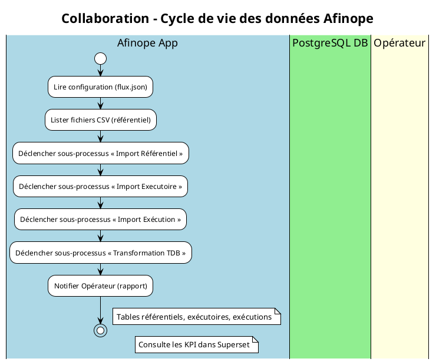
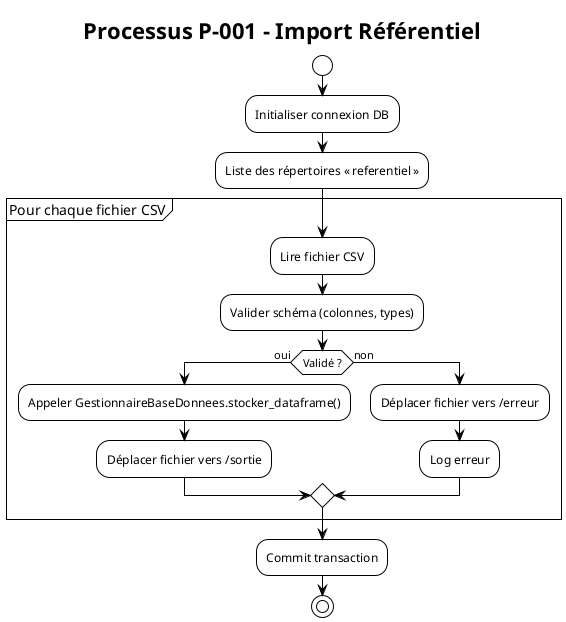
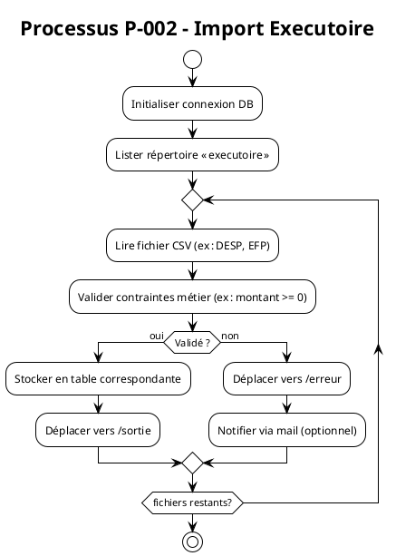
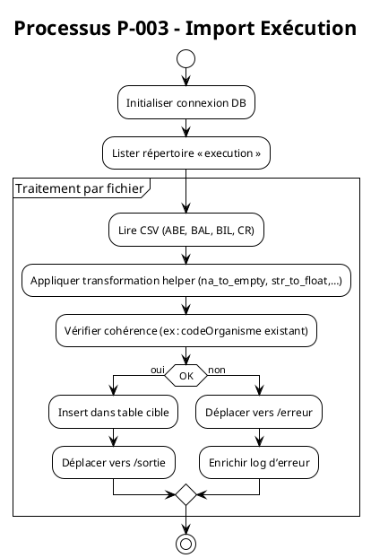
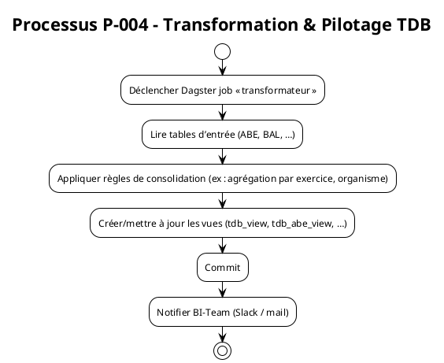
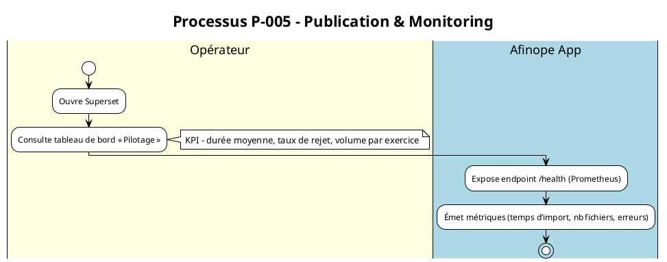

# Cahier des Charges Fonctionnel (CCF) – Projet **Afinope**  
**Version 1.0 – 27 avril 2026**  

> **Objet** : Définir, de façon normalisée (ISO/IEC 19510 : 2013 – BPMN 2.0), les processus métier supportés par l’application *Afinope* (import / transformation / exploitation de données financières publiques).  
> **Public cible** : Équipe produit, analystes métier, architectes d’intégration, développeurs Python/Dagster, équipes d’exploitation (DBA, support).  

---  

## 1. Introduction et contexte processus  

| Élément | Description |
|---------|-------------|
| **Organisation** | Ministère de l’Économie – Direction Finances Publiques (DFP). L’application *Afinope* sert à charger, valider et consolider les référentiels et les flux financiers (ex : ABP, ABE, DESP, EFP, BAL, BIL, CR, …) dans un entrepôt PostgreSQL, puis à alimenter les tableaux de bord Superset. |
| **Objectifs de la modélisation BPMN** | 1️⃣ Uniformiser la description fonctionnelle du cycle de vie des données (import → validation → stockage → transformation → visualisation).  <br>2️⃣ Garantir la traçabilité des exigences & des KPI. <br>3️⃣ Préparer l’exécution automatisée via un moteur BPMN‑compatible (Camunda / Activiti) ou via Dagster (couche d’orchestration). |
| **Périmètre** | - Gestion des fichiers CSV (référentiels, exécutoires, exécution). <br>- Validation syntaxique et sémantique. <br>- Chargement dans le schéma *public* de PostgreSQL. <br>- Transformation (normalisation, enrichissement, calculs agrégés). <br>- Publication de vues SQL exploitées par Superset. |
| **Glossaire métier (extraits)** | **Organisme** : entité publique (code 10 caractères). <br>**Exercice** : année budgétaire (1900‑2999). <br>**Référentiel** : tables de base (ORGANISME, STRUCTURE, NOMENC, …). <br>**Executoire** : décisions budgétaires (DESP, EFP, …). <br>**Exécution** : mouvements comptables (ABE, BAL, BIL, CR). |

---  

## 2. Cartographie des processus (Process Map)

### 2.1 Nomenclature des processus  

| Niveau | Code | Libellé | Type |
|--------|------|---------|------|
| **1** | **P‑001** | **Gestion des référentiels** | Stratégique |
| **1** | **P‑002** | **Gestion des exécutoires** | Opérationnel |
| **1** | **P‑003** | **Gestion des exécutions** | Opérationnel |
| **1** | **P‑004** | **Transformation & pilotage** | Support |
| **1** | **P‑005** | **Publication & monitoring** | Management |

### 2.2 Matrice de processus  

| ID Processus | Nom | Type | Propriétaire | Priorité |
|--------------|-----|------|--------------|----------|
| **P‑001** | Gestion des référentiels | Opérationnel | **Data‑Engineers** | Critique |
| **P‑002** | Gestion des exécutoires | Opérationnel | **Data‑Engineers** | Critique |
| **P‑003** | Gestion des exécutions | Opérationnel | **Data‑Engineers** | Critique |
| **P‑004** | Transformation & pilotage TDB | Support | **BI‑Team** | Important |
| **P‑005** | Publication Superset & KPI | Management | **BI‑Team** | Important |

---  

## 3. Modélisation BPMN détaillée  

> Les diagrammes sont fournis en **PlantUML** (compatible avec la plupart des éditeurs BPMN).  
> Les pools : **Afinope App** (Dagster), **PostgreSQL DB**, **Opérateur** (utilisateur).  

### 3.1 Diagramme de collaboration (Vue globale)  



### 3.2 Process Diagram – **Import Référentiel (P‑001)**  



### 3.3 Process Diagram – **Import Executoire (P‑002)**  



### 3.4 Process Diagram – **Import Exécution (P‑003)**  



### 3.5 Process Diagram – **Transformation & Pilotage TDB (P‑004)**  



### 3.6 Process Diagram – **Publication Superset & Monitoring (P‑005)**  



---  

## 4. Règles de gestion métier  

| Point de décision (Gateway) | Condition | Règle métier | Source |
|------------------------------|-----------|--------------|--------|
| **G‑001** (Import Référentiel) | `codeOrganisme` déjà présent → **UPDATE** sinon **INSERT** | RB‑REF‑001 – Gestion “up‑sert” des référentiels | `flux.txt` – REF |
| **G‑002** (Import Executoire) | `montant` < 0 | RB‑EXE‑001 – Montant négatif interdit | `sql/01_executoire/*.sql` |
| **G‑003** (Import Exécution) | `codeCompte` absent du référentiel NOMENC | RB‑EXE‑002 – Refus si compte inconnu | `sql/00_referentiel/02_nomenc.sql` |
| **G‑004** (Transformation) | `exercice` ≠ année courante **et** `typeSequence` = ‘R’ | RB‑TR‑001 – Historisation obligatoire | Cahier des exigences internes |
| **G‑005** (Publication) | KPI `taux_rejet` > 5 % → **Escalade** | RB‑MON‑001 – Alerte seuil de rejet | Politique de suivi DFP |

---  

## 5. Données et documents  

### 5.1 Objets de données  

| Type | Nom | Description | Persistance |
|------|-----|-------------|-------------|
| **Data Object** | *CSV Référentiel* | Fichier brut (ORGANISME, STRUCTURE, …) | `/entree` |
| **Data Object** | *CSV Executoire* | Fichier brut (DESP, EFP, …) | `/entree` |
| **Data Object** | *CSV Exécution* | Fichier brut (ABE, BAL, BIL, CR) | `/entree` |
| **Data Store** | *PostgreSQL* | Schéma *public* contenant 20 + tables | Persistance durable |
| **Data Object** | *Vue TDB* | Vues agrégées (tdb_view, tdb_abe_view, …) | DB – Lecture‑seule |
| **Data Object** | *Rapport d’import* | JSON (`Flux.to_json()`) | `/sortie` |

### 5.2 Artifacts  

- **Group** “Référentiel” : regroupe toutes les tables de référence.  
- **Annotation** sur chaque tâche d’import détaillant le format attendu (ex : `codeOrganisme` char(10)).  
- **Associations** entre tâches et scripts SQL (ex : `Import Référentiel → 00_organisme.sql`).  

---  

## 6. Acteurs et rôles  

| Lane (BPMN) | Rôle métier | Responsabilités | Compétences |
|-------------|--------------|----------------|------------|
| **Opérateur** | Utilisateur métier (BI) | Consultation KPI, déclenchement manuel d’un job (re‑run) | Connaissance Superset, logique financière |
| **Afinope App** | Orchestrateur (Dagster) | Exécution du pipeline, validation, log, notification | Python 3.11, Pandas, SQLAlchemy, Dagster |
| **PostgreSQL DB** | Système de persistance | Stockage, contraintes d’intégrité, exécution de vues | PostgreSQL 13+, SQL |

---  

## 7. Performances et indicateurs (KPIs)  

| Indicateur | Formule | Objectif | Seuil d’alerte |
|------------|---------|----------|----------------|
| **Durée moyenne d’import** | Σ (temps fin – temps début) / nb fichiers | < 2 min / fichier | > 5 min |
| **Taux de rejet** | nb fichiers erreur / nb total fichiers | < 2 % | > 5 % |
| **Volume chargé (records)** | nb lignes insérées | ≥ 95 % du total attendu | – |
| **Temps de génération des vues** | Σ durée SQL / vue | < 30 s | > 1 min |
| **Disponibilité du service** | uptime du job Dagster | 99,5 % (mensuel) | < 99 % |

*Points de mesure BPMN* :  
- **Start‑Event** → *Timer* (mesure durée)  
- **End‑Event** → *Message* (rapport KPI)  

---  

## 8. Gestion des exceptions  

| Type d’événement (Boundary) | Déclencheur | Gestion | Conséquence |
|-----------------------------|-------------|--------|-------------|
| **Timer** | dépassement > 5 min sur tâche d’import | Envoi mail à `data-team@example.com` + mise en pause du pipeline | Re‑run manuel |
| **Error** | Exception SQL (ex : `InvalidTextRepresentation`) | Capture → log → déplacement fichier vers `/erreur` | Fichier exclu du traitement |
| **Escalation** | Taux de rejet > 5 % | Escalade au **Chef de projet** (Slack) | Analyse & correction du parsing |
| **Cancel** | Opérateur annule le job | Annulation transactionnelle, rollback | Aucun impact persistant |
| **Compensation** | Erreur post‑commit (ex : duplication) | Exécution de sous‑processus `Compensation` → `DELETE FROM … WHERE id=…` | Retour à état cohérent |

### 8.2 Scénarios d’erreur documentés  

| Scénario | Déclencheur | Gestion | Conséquence |
|----------|------------|---------|-------------|
| **Timeout DB** | `psycopg2.OperationalError` après 30 s | Retry × 3 → si échec, placer fichier en `/erreur` | Job arrêté, alerte |
| **Format CSV invalide** | Colonnes manquantes | Enregistrement dans `csv-validation.log`, déplacement `/erreur` | Re‑traitement après correction |
| **Valeur bigint vide** (ex : `''152` dans NOMENC) | `InvalidTextRepresentation` | Nettoyage via script `sed` (voir `known_issue.txt`) puis re‑run | Donnée corrigée, import OK |

---  

## 9. Sous‑processus et réutilisation  

| Sous‑processus | Description | Réutilisation |
|----------------|-------------|----------------|
| **SP‑001** `Valider CSV` | Vérifie en‑tête, types, contraintes métier | Partagé par P‑001, P‑002, P‑003 |
| **SP‑002** `Stocker DataFrame` | Appel à `GestionnaireBaseDonnees.stocker_dataframe` | Utilisé par tous les imports |
| **SP‑003** `Déplacer fichier` | Déplacement vers `/sortie` ou `/erreur` | Réutilisé partout |
| **SP‑004** `Générer vues TDB` | Exécution des scripts `tdb_*_view.sql` | Appelé par P‑004 uniquement |
| **SP‑005** `Notifier KPI` | Envoi de métriques Prometheus + Slack | Utilisé par P‑004 & P‑005 |

---  

## 10. Matrice de traçabilité  

| Exigence CCF | Processus BPMN | Tâche(s) concernées | Scénario de test |
|--------------|----------------|---------------------|-------------------|
| **EX‑G‑001** – Import complet de tous les référentiels | **P‑001** | `Lire fichier CSV` → `Stocker DataFrame` | **Nominal** : 5 fichiers CSV valides → 5 tables créées |
| **EX‑G‑002** – Gestion des erreurs de format | **P‑001** | `Valider CSV` → `Boundary Error` | **Erreur** : CSV avec colonne manquante → fichier déplacé `/erreur` |
| **EX‑G‑003** – Agrégation des exécutions en vue TDB | **P‑004** | `Générer vues TDB` | **Nominal** : Vérifier que `tdb_view` renvoie la somme des montants ABE+BAL |
| **EX‑M‑001** – KPI de durée d’import < 2 min | **P‑001‑P‑003** | `Start‑Event` → `End‑Event` | **Performance** : Mesure via `Prometheus` |
| **EX‑S‑001** – Re‑exécution manuelle après incident | **P‑005** | `Notifier KPI` (Slack) → `Opérateur` déclenche `Dagster run` | **Recovery** : Après arrêt, re‑run complet sans doublons |

---  

## 11. Validation et conformité  

### 11.1 Checklist BPMN (avant validation)  

- [ ] Tous les flux ont une source et une cible clairement identifiées.  
- [ ] Un seul **Start Event** par processus (type *Message* ou *Timer*).  
- [ ] Au moins un **End Event** (type *Message*).  
- [ ] Aucun **Gateway** orphelin (pas de connexion entrante ou sortante manquante).  
- [ ] Libellés des passerelles explicites (ex : `G‑001 – Upsert Référentiel`).  
- [ ] Cohérence de la nomenclature (IDs P‑xxx, IDs RB‑xxx).  

### 11.2 Niveaux de conformité BPMN  

| Niveau | Description | Couverture CCF |
|--------|-------------|----------------|
| **Descriptive** | Diagrammes simples (Start → Tasks → End) | ✔︎ Processus P‑001, P‑002, P‑003 |
| **Analytic** | Ajout de **Gateways**, **Boundary Events**, **Data Objects** | ✔︎ Processus P‑004, P‑005 |
| **Common Executable** | Tous les éléments exécutables (Service Task, Script Task) – compatibles avec Camunda/Dagster | ✔︎ (Prévu pour futur déploiement) |

---  

## 12. Implémentation et exécution  

### 12.1 Maturité processus (CMMI‑like)  

| Niveau | Caractéristiques | Application BPMN |
|--------|----------------|-------------------|
| **1 – Initial** | Processus ad‑hoc, non documentés | — |
| **2 – Managed** | Documentation basique, diagrammes descriptifs | P‑001, P‑002, P‑003 (Descriptive) |
| **3 – Defined** | Standardisés, réutilisables, sous‑processus | P‑004, P‑005 (Analytic) |
| **4 – Quantified** | Mesure KPI, monitoring automatisé | KPI implémentés (Prometheus) |
| **5 – Optimized** | Boucles d’amélioration continue, exécutable | Prévu (Common Executable) |

### 12.2 Intégration système  

| Composant | Rôle | Points d’intégration BPMN |
|-----------|------|---------------------------|
| **Dagster** | Orchestrateur (jobs, assets) | `Start Event` – *Message* « trigger » |
| **PostgreSQL** | Data Store | `Data Store` – persistance des tables |
| **Superset** | Reporting | `End Event` – *Message* « KPI ready » |
| **Prometheus / Grafana** | Monitoring | `Timer` & `Message` (exposition métriques) |
| **Docker‑Compose** | Environnement d’exécution | Déploiement des pools (App, DB) |

---  

## 13. Annexes  

### 13.1 Extraits de code pertinents  

```python
# app/flux.py
class Flux:
    def __init__(self, config):
        self.entree = config.get("entree")
        self.sortie = config.get("sortie")
        self.erreur = config.get("erreur")

    def to_json(self) -> Dict[str, object]:
        return {"entree": self.entree,
                "sortie": self.sortie,
                "erreur": self.erreur}
```

```python
# app/gestionnaire_fichier_csv.py
class GestionnaireFichiersCSV:
    def lister_les_fichiers(self) -> list[str]:
        return [f for f in os.listdir(self.entree) if f.endswith(".csv")]
```

### 13.2 Exemple de script SQL de création de vue (tdb_view.sql)

```sql
CREATE OR REPLACE VIEW tdb_view AS
SELECT * FROM tdb_abp_view
UNION ALL
SELECT * FROM tdb_abe_view;
```

### 13.3 Mapping des fichiers `flux.txt` → Processus  

| Section (flux.txt) | Processus BPMN | Description |
|--------------------|----------------|-------------|
| **REF** | **P‑001** | Chargement des tables de référence (ORGANISME, STRUCTURE, …) |
| **EXECUTOIRE** | **P‑002** | Chargement des décisions budgétaires (DESP, EFP, …) |
| **EXECUTION** | **P‑003** | Chargement des mouvements comptables (ABE, BAL, BIL, CR) |

---  

## 14. Conclusion  

Le présent **Cahier des Charges Fonctionnel** formalise, selon la norme **ISO/IEC 19510**, l’ensemble des processus qui composent le cycle de vie des données financières d’Afinope.  

*Les diagrammes BPMN* décrivent de façon exhaustive les flux de travail, les points de décision, les traitements d’erreur et les indicateurs de performance. La **traçabilité** entre exigences, processus et tests garantit la maîtrise fonctionnelle.  

Ce CCF constitue la base contractuelle pour :

* la **développement** (Python/Dagster, SQL)  
* la **mise en œuvre** (Docker‑Compose, PostgreSQL, Superset)  
* la **validation** (tests unitaires, tests d’intégration, KPI)  

---

*Document rédigé par l’équipe d’analyse métier – Certification BPMN (ISO 19510).*