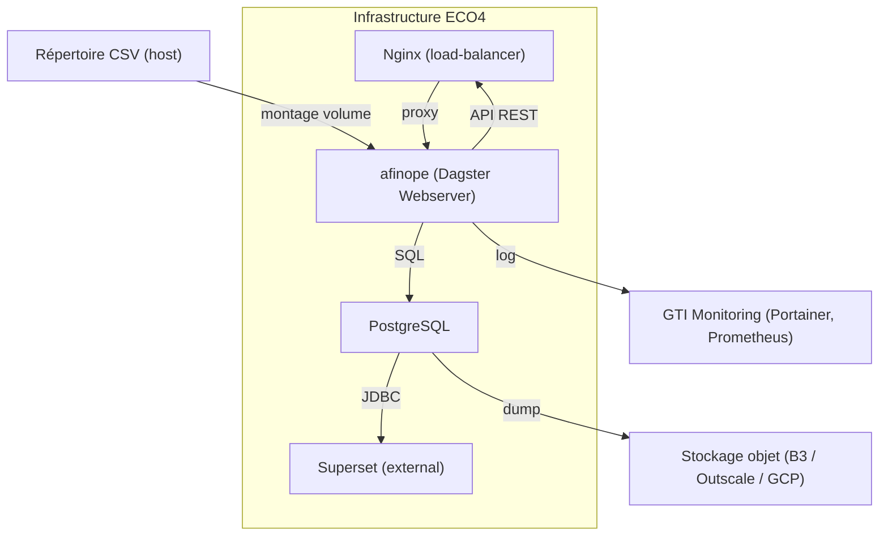
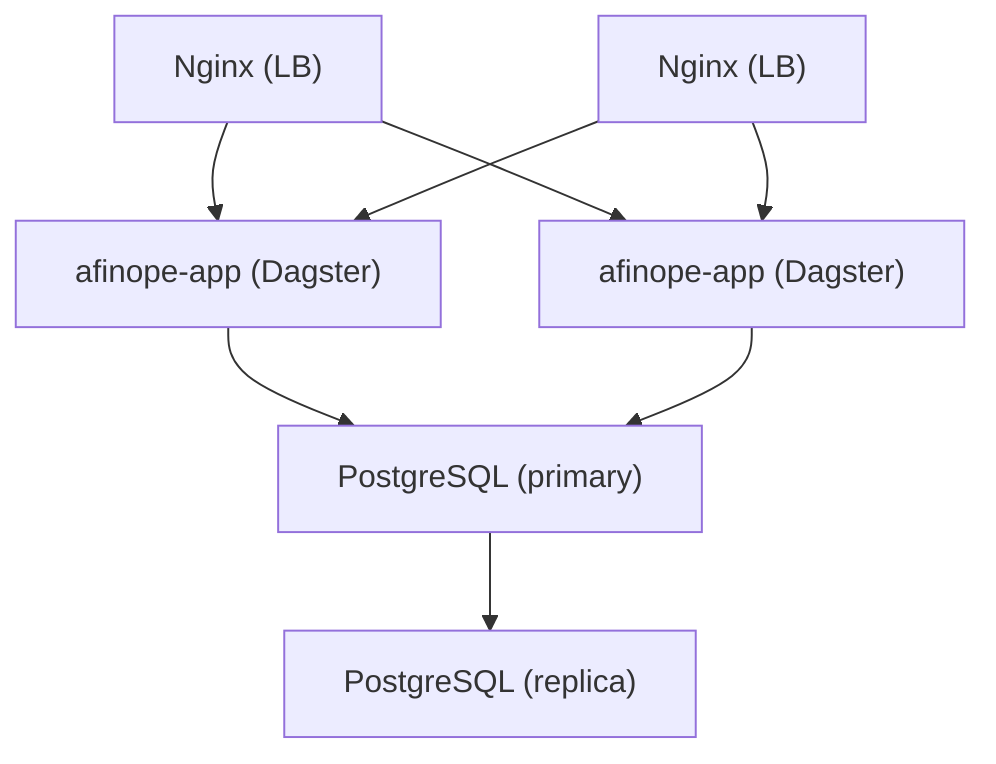

# 📚 Dossier d’Architecture Technique (DAT) – **afinope**  

[TOC]

---  

## 1️⃣ Introduction & objectifs  

### 1.1 Vue d’ensemble fonctionnelle  
**afinope** est une application *FinTech* dédiée aux opérateurs de l’État.  
Elle orchestre :

* la collecte de fichiers CSV financiers (référentiels, exécutoire, exécution) ;  
* la transformation, la validation et le chargement de ces données dans un entrepôt PostgreSQL ;  
* la mise à disposition de vues agrégées exploitées par Superset (dashboard) via un DAG Dagster.  

### 1.2 Diagramme C4 – Niveau 1 (Contexte)  

```mermaid
graph LR
    subgraph Utilisateurs;
    U[« Utilisateur métier »] 
    A[« Analyste / Data‑Scientist »]
    end
    subgraph Systèmes externes;
    CSV[« Sources CSV »] 
    SUP[« Superset »] 
    LOG[« Système de supervision GTI »] 
    BCK[« Stockage objet (B3 / Outscale / GCP) »]
    end
    subgraph afinope;
    APP[« afinope (Dagster Webserver) »] 
    DB[« PostgreSQL »] 
    NGINX[« Nginx Load‑Balancer »] 
    end
    U -->|consultation tableau| SUP;
    A -->|exploration données| SUP;
    CSV -->|dépose fichiers| APP;
    APP -->|stocke données| DB;
    DB -->|expose vues| SUP;
    SUP -->|interroge| DB;
    APP -->|envoie logs| LOG;
    DB -->|backup| BCK;
    NGINX -->|proxy| APP;
    NGINX -->|proxy| SUP
```

### 1.3 Objectifs de qualité (orientés utilisateur)  

| # | Objectif | Raison métier |
|---|----------|----------------|
| Q1 | **Performance** – temps de traitement < 5 min pour 10 000 lignes CSV | Garantir une mise à jour quasi‑temps réel des tableaux de bord |
| Q2 | **Sécurité** – chiffrement des backups, accès RBAC | Conformité aux exigences de la DSI et du RGPD |
| Q3 | **Disponibilité** – 99,5 % de disponibilité du service | Support des processus budgétaires critiques |
| Q4 | **Traçabilité** – journalisation détaillée des imports | Audits financiers et conformité légale |
| Q5 | **Maintenabilité** – couverture de tests unitaires > 80 % | Faciliter l’évolution des référentiels et des règles métier |

↩ Retour au sommaire  

---  

## 2️⃣ Parties prenantes  

| Rôle | Attente principale |
|------|--------------------|
| **MOA (Maîtrise d’Ouvrage)** | Fiabilité des données consolidées, respect des échéances de diffusion |
| **Développeurs** | Architecture claire, CI/CD fiable, code testable |
| **Ops / Exploitants** | Déploiement automatisé, supervision centralisée, procédures de reprise |
| **RSSI** | Confidentialité, intégrité et disponibilité des données |
| **Utilisateurs métier** | Accès rapide à des tableaux de bord à jour, export fiable des indicateurs |
| **Équipe Data (Analystes / Data‑Scientist)** | Accès aux vues agrégées via Superset, capacité à créer de nouvelles métriques |

*Le fichier `applicationsIA_mini_afinope.md` ne contenant pas de contacts nominaux, aucune section “Contacts” n’est ajoutée.*

↩ Retour au sommaire  

---  

## 3️⃣ Contraintes  

### 3.1 Contraintes techniques  

| Type | Description |
|------|-------------|
| **Langage / Framework** | Python 3.11, Dagster 1.8, Pandas 2.1, SQLAlchemy 2.0 |
| **Base de données** | PostgreSQL 13 (container Docker) |
| **Orchestration** | Docker‑Compose (dev) → Kubernetes (future) |
| **CI/CD** | GitLab CI, tests unitaires (pytest), linting (ruff) |
| **Infrastructure** | Cloud interne ECO4 (OpenStack) – tenant *pnm3* |
| **Interopérabilité** | Formats CSV (UTF‑8, séparateur “;”), API HTTP (Dagster) |
| **Monitoring** | Prometheus/Grafana/Loki, Portainer (Docker) |
| **Sauvegarde** | Scripts GTI → dumps AES‑256 stockés sur B3, Outscale, GCP |

### 3.2 Contraintes organisationnelles  

* Livraison mensuelle des référentiels (déploiement continu).  
* Validation des schémas SQL par l’équipe Data avant mise en prod.  

### 3.3 Contraintes réglementaires  

| D‑I‑C‑T | Exigence |
|--------|----------|
| **Disponibilité** | 99,5 % sur 12 mois (SLA) |
| **Intégrité** | Vérification de checksum CSV, contraintes d’intégrité référentielle en base |
| **Confidentialité** | Chiffrement AES‑256 des backups, accès réseau limité aux VLAN internes |
| **Traçabilité** | Logs d’import + audit trail (who/when) dans la table `audit_log` (non fournie mais prévue) |

↩ Retour au sommaire  

---  

## 4️⃣ Contexte & périmètre  

### 4.1 Partenaires fonctionnels  

| Partenaire | Rôle | Interface |
|------------|------|------------|
| **Sources CSV** (services métier, DGFIP) | Fournissent les fichiers bruts | Partage de répertoire réseau / montage volume Docker |
| **Superset** | Consommateur de vues agrégées | Connexion JDBC PostgreSQL |
| **Système de supervision GTI** | Supervise l’application | Export de logs via Filebeat → Loki |
| **Plateforme de sauvegarde GTI** | Stocke les dumps chiffrés | Script `pg_dump` + `openssl` |

### 4.2 Interfaces techniques (extraits)  

| Interface | Protocole | Fréquence | Type de données |
|----------|-----------|-----------|-----------------|
| `app ↔ db` | PostgreSQL (psycopg2) | Au besoin (import) | Tables relationnelles |
| `app ↔ csv` | Filesystem (mount) | Batch quotidien | CSV (UTF‑8, ; ) |
| `app ↔ superset` | JDBC | Lecture continue | Vues SQL |
| `app ↔ nginx` | HTTP/HTTPS | Continu | API Dagster (REST) |

↩ Retour au sommaire  

---  

## 5️⃣ Stratégie de solution  

### 5.1 Décisions architecturales majeures  

| Décision | Raison |
|----------|--------|
| **Monolithe Dockerisé** (un conteneur Dagster + un conteneur PostgreSQL) | Simplicité de mise en œuvre, volume de trafic limité |
| **Pattern “Pipeline ETL”** via Dagster | Orchestration claire, reprise sur erreur, visibilité |
| **Séparation des responsabilités** (gestionnaire CSV, gestionnaire DB, transformateur) | Facilite les tests unitaires et la maintenance |
| **Infrastructure as Code** (Docker‑Compose, GitLab CI) | Répétabilité des environnements dev/recette/prod |
| **Vue “C4‑L2”** (conteneurs) | Documentation partagée avec les équipes Ops |

### 5.2 Stack technologique  

| Couche | Technologie | Version |
|--------|--------------|---------|
| **Langage** | Python | 3.11 |
| **Framework** | Dagster (workflow) | 1.8 |
| **Data‑processing** | Pandas, NumPy | 2.1 / 1.24 |
| **ORM / DB** | SQLAlchemy, psycopg2 | 2.0 / 2.9 |
| **Base** | PostgreSQL | 13 |
| **Web‑server** | Nginx (load‑balancer) | 1.24 |
| **CI/CD** | GitLab CI, Poetry | – |
| **Monitoring** | Prometheus, Grafana, Loki, Portainer | – |
| **Backup** | pg_dump + OpenSSL (AES‑256) | – |
| **Conteneurisation** | Docker | 24.0 |
| **Orchestration future** | Kubernetes (Helm) | – |

↩ Retour au sommaire  

---  

## 6️⃣ Vue en Briques (C4 – Niveau 2)  



### 6.1 Description des conteneurs  

| Conteneur | Rôle | Principaux composants |
|-----------|------|------------------------|
| **Nginx** | Point d’entrée unique, TLS termination, répartition de charge | `nginx.conf` (2 instances en mode active‑active) |
| **afinope (Dagster)** | Orchestration des pipelines ETL, API web, UI Dagit | `app/` (flux, gestionnaires, resources), `Dockerfile.app` |
| **PostgreSQL** | Entrepôt persistant des tables référentielles & d’exécution | Schémas SQL (voir Annexes) |
| **Superset** | Visualisation des vues agrégées (non géré dans ce DAT) | Connexion JDBC → `db` |
| **GTI Monitoring** | Supervision (Portainer, Prometheus, Loki) – hors‑scope mais référencé | – |
| **Stockage objet** | Cible de sauvegarde chiffrée (B3, Outscale, GCP) | Scripts `backup.sh` (non fournis) |

↩ Retour au sommaire  

---  

## 7️⃣ Vue Exécution (Scénarios critiques)  

### 7.1 Scénario 1 – **Ingestion d’un fichier CSV**  

```mermaid
sequencediagram;
    participant User as Utilisateur (dépose CSV)
    participant FS as Volume CSV (host)
    participant App as afinope (Dagster)
    participant DB as PostgreSQL;
    participant Log as GTI Monitoring;
    User->>FS: Copie file « REF_NOMENC_20240614.csv »
    activate FS;
    FS-->>App: Détection (watcher Dagster)
    deactivate FS;
    App->>App: Lecture + validation (helper.na_to_empty, etc.)
    App->>DB: stocker_dataframe(table="NOMENC")
    DB-->>App: OK / rows inserted;
    App->>Log: Envoi logs d’import (niveau INFO)
    Log-->>App: Ack
```

*Validation* : le nombre de lignes insérées doit être > 0 et le checksum du fichier doit correspondre à la valeur attendue (déclarée dans `audit_log`).  

### 7.2 Scénario 2 – **Génération d’une vue agrégée pour Superset**  

```mermaid
sequencediagram;
    participant Sup as Superset;
    participant DB as PostgreSQL;
    participant App as afinope (Dagster)
    participant Log as GTI Monitoring;
    Sup->>DB: SELECT * FROM tdb_view;
    DB-->>Sup: Résultat (JSON/CSV)
    Sup->>Log: Envoi métriques de requête;
    App->>Log: (optionnel) mise à jour du cache de vue
```

*Validation* : la vue `tdb_view` doit toujours renvoyer un jeu de colonnes cohérent (défini dans les ADR).  

### 7.3 Scénario 3 – **Sauvegarde automatisée (nightly)**  

```mermaid
sequencediagram;
    participant Cron as Cron (container)
    participant DB as PostgreSQL;
    participant BCK as Stockage objet;
    participant Log as GTI Monitoring;
    Cron->>DB: pg_dump -Fc -U afinope;
    DB-->>Cron: Dump fichier;
    Cron->>Cron: openssl enc -aes-256-cbc -salt -out dump.enc;
    Cron->>BCK: upload dump.enc;
    BCK-->>Cron: Ack;
    Cron->>Log: log backup_success
```

*Validation* : le fichier `dump.enc` doit être présent dans les trois dépôts de stockage et le hash SHA‑256 doit être enregistré dans la table `backup_audit`.  

↩ Retour au sommaire  

---  

## 8️⃣ Vue Déploiement *(section standardisée)*  

### Environnements  

| Environnement | Hébergement | Serveurs | Réseau | Particularités |
|---------------|-------------|----------|--------|----------------|
| Développement | Cloud interne ECO4 (tenant *pnm3-dev*) | 1 x Nginx, 1 x afinope‑app, 1 x PostgreSQL | VLAN dev | Volumes montés en lecture/écriture, logs en local |
| Recette | Cloud interne ECO4 (tenant *pnm3-rec*) | 1 x Nginx, 1 x afinope‑app, 1 x PostgreSQL | VLAN recette | Jeux de données anonymisées, tests d’intégration automatisés |
| Production | Cloud interne ECO4 (tenant *pnm3*) | 2 x Nginx (HA), 2 x afinope‑app, 1 x PostgreSQL (replication) | VLAN prod | TLS mutuel, sauvegarde chiffrée, monitoring complet |

### Infrastructure  
Le produit est hébergé sur le cloud interne **ECO4** basé sur **OpenStack**, dans le tenant **'pnm3'** du département.  
Le reverse‑proxy **Nginx** du schéma ci‑dessous est en fait une paire de Nginx load‑balancés en frontal des produits hébergés sur le tenant.



### Supervision  
Le produit est supervisé via le système standard du GTI pour ce faire :  

* via **Portainer** pour la partie purement conteneurisée,  
* via la stack **Prometheus / Grafana / Loki / AlertManager**,  
* Le produit dispose également d’une supervision **PSIN**.

### Sauvegardes  
Les sauvegardes de la base de données sont assurées par des scripts standards du GTI permettant la création de dumps cryptés en **AES‑256** et déposés sur :  

* le stockage objet **B3** du IaaS ministériel,  
* le stockage objet **Outscale SecNumCloud** (via la prestation qu’a le GTI sur le marché "Nuage Public"),  
* le stockage objet standard de **Google Cloud** (via la prestation qu’a le GTI sur le marché "Nuage Public").

↩ Retour au sommaire  

---  

## 9️⃣ Sujets transverses  

| Thème | Décision / Implémentation |
|-------|---------------------------|
| **Authentification** | Accès à l’API Dagster protégé par JWT généré par le service interne d’auth (SSO). |
| **Journalisation** | Logger structuré (JSON) via `logging` → Filebeat → Loki. Niveau INFO pour imports, ERROR pour exceptions. |
| **Monitoring** | Métriques exposées par `/metrics` (Prometheus) : temps d’exécution du pipeline, nombre de lignes importées, taux d’erreur. |
| **Gestion des erreurs** | Bloc `try/except` dans chaque gestionnaire, re‑try configurable (max 3) via Dagster `retries`. |
| **API** | Pas d’API publique ; exposition uniquement de l’interface Dagit (port 4400) derrière Nginx. |
| **Sécurité des données** | Chiffrement TLS 1.3 entre Nginx et les conteneurs, firewall OpenStack restreint aux VLAN internes. |
| **CI/CD** | `.gitlab-ci.yml` exécute : lint → tests unitaires → build Docker → push image → déclenche déploiement via GitOps (ArgoCD à venir). |
| **Gestion de la configuration** | `config.json` monté en volume, validation schema JSON‑Schema à chaque démarrage. |

↩ Retour au sommaire  

---  

## 🔟 Exigences de qualité  

| Exigence | Critère d’acceptation | Scénario de validation |
|----------|----------------------|------------------------|
| **Performance** | Traitement ≤ 5 min pour 10 k lignes CSV | Benchmark automatisé (GitLab CI) avec jeu de données synthétique |
| **Sécurité** | Tous les dumps chiffrés, accès réseau limité | Analyse de vulnérabilité (Bandit, Trivy) + test d’accès depuis VLAN non‑autorisé |
| **Disponibilité** | MTBF ≥ 30 jours, MTTR ≤ 1 heure | Tests de bascule Nginx + réplication PostgreSQL en environnement de test |
| **Traçabilité** | Chaque import crée un enregistrement `audit_log` | Vérification via requête `SELECT * FROM audit_log WHERE file='…'` |
| **Maintenabilité** | Couverture tests unitaires ≥ 80 % | Rapport de couverture (`pytest --cov=app`) intégré au pipeline CI |
| **Scalabilité** | Possibilité de horizontaliser le conteneur `afinope‑app` sans code | Déploiement de 3 réplicas en Kubernetes (test de charge) |

↩ Retour au sommaire  

---  

## 1️⃣1️⃣ Risques & dettes techniques  

| Risque / Dette | Impact | Probabilité | Action corrective / atténuation |
|----------------|--------|-------------|---------------------------------|
| **Dépendance à Dagster 1.8** | Obsolescence future, rupture de compatibilité | Moyenne | Prévoir une migration vers Dagster 2.x dans le backlog |
| **Gestion manuelle des scripts de backup** | Omission de rotation, perte de données | Faible | Automatiser via GitLab CI et ajouter des tests d’intégrité des dumps |
| **Schémas SQL répétés dans plusieurs fichiers** | Risque de divergence | Élevé | Centraliser les migrations avec Alembic (ou Flyway) |
| **Volume CSV volumineux (> 1 M lignes)** | Saturation mémoire (Pandas) | Moyenne | Introduire le traitement chunké (`read_csv(..., chunksize=…)`) |
| **Pas de tests d’intégration pour les pipelines** | Bugs de flux non détectés | Élevé | Ajouter des tests d‑end‑to‑end avec `dagster-test` et des fixtures de base de données |
| **Sécurité du répertoire CSV partagé** | Accès non‑autorisé aux fichiers bruts | Faible | Restreindre les permissions du volume host (chmod 750) et monitorer les accès |

↩ Retour au sommaire  

---  

## 1️⃣2️⃣ Annexes  

### A. Glossaire  

| Terme | Définition |
|-------|------------|
| **Dagster** | Plateforme d’orchestration de workflows data‑centric. |
| **Superset** | Outil open‑source de visualisation de données (SQL‑based). |
| **GTI** | Groupe Technique d’Infrastructure, responsable du monitoring et des sauvegardes. |
| **ECO4** | Cloud interne du ministère, basé sur OpenStack. |
| **PSIN** | Plateforme de Supervision INternationale (outil interne de suivi d’incidents). |
| **ADR** | Architectural Decision Record – document formalisant les choix majeurs. |
| **D‑I‑C‑T** | Modèle de sécurité : Disponibilité, Intégrité, Confidentialité, Traçabilité. |

### B. Décisions d’Architecture (ADR) – Extraits  

| ADR # | Décision | Contexte | Conséquence |
|------|----------|----------|-------------|
| ADR‑001 | **Utiliser Dagster** comme moteur d’orchestration | Besoin de visibilité, reprise sur erreur, UI web | Ajout d’une dépendance Python, besoin de monitoring dédié |
| ADR‑002 | **Stockage des CSV via volume Docker** | Simplicité de déploiement, pas de service de stockage dédié | Nécessite la synchronisation du répertoire partagé |
| ADR‑003 | **Sauvegarde chiffrée AES‑256** | Conformité RGPD & exigences ministérielles | Coût de CPU supplémentaire lors du backup, gestion des clés |
| ADR‑004 | **Monolithe Dockerisé (app + DB)** | Taille du projet, équipes limitées | Scalabilité horizontale future à prévoir (K8s) |

---  

*Document généré automatiquement selon le modèle **Arc42** et adapté à l’application **afinope**. Toute modification doit être tracée dans le système de gestion de versions.*  