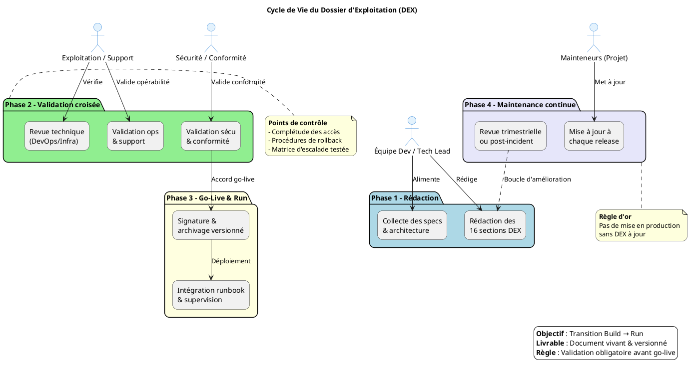
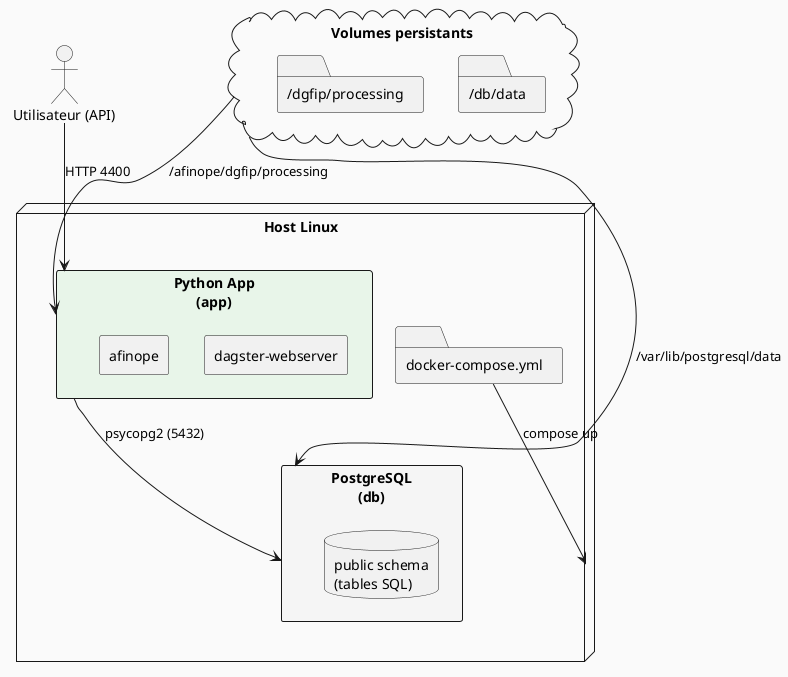

# 📘 Dossier d’Exploitation (DEX) – **afinope**  
*Document établi sur les principes de la transition **Build → Run** et des bonnes pratiques ITIL/DevOps pour l’exploitation applicative*  

---  

[TOC]

---  

## 1️⃣ Introduction et objectifs  

**Document de référence garantissant la continuité, la maintenabilité et la sécurisation de l’exploitation d’une application en production.**  

| 🎯 Objectif | ✅ Action attendue |
|------------|-------------------|
| Assurer la continuité de service | Mettre en place les procédures de surveillance, de backup et de reprise. |
| Documenter les procédures de gestion courante | Décrire chaque tâche d’exploitation (déploiement, monitoring, restauration…). |
| Faciliter le support et la résolution d’incidents | Fournir les contacts, les accès, les run‑books et les matrices d’escalade. |
| Encadrer les responsabilités (Dev / Ops / Support) | Rôles clairement définis (voir § 4). |
| Assurer la conformité et la maîtrise des risques | Politique de sécurité, sauvegarde, audit. |
| Accompagner la phase de transition **Build → Run** | Workflow de création, validation et mise à jour du DEX (voir § 6). |

---  

## 2️⃣ Contexte d’usage et périmètre  

| Champ | Valeur |
|------|--------|
| **Nom du projet** | `afinope` |
| **Chemin source** | `G:\WarchoLife\WarchoDevplace\Gitlab_Applications\ambulon\workplace-ambulon\gitlab\afinope` |
| **Environnement cible** | Production Docker‑Compose (services `app` & `db`) sur serveur Linux (Ubuntu 22.04 recommandé). |
| **Stack technique** | • Python 3.11 • Poetry (gestion des dépendances) • Dagster 1.8 (orchestration) • PostgreSQL 13 (dans le conteneur `db`) • Docker / Docker‑Compose • Pandas, SQLAlchemy, psycopg2 |
| **Type de livrable** | Standard ✅ – Document de référence 📘 – Activité « Transition Build → Run / Exploitation » |
| **Quand l’utiliser** | - Avant chaque mise en production (go‑live). - Pour former les équipes d’exploitation. - Lors d’audits (conformité, PRA/PCA). |
| **Cycle de vie** | Document vivant ; versionné (Git) ; mise à jour à chaque release ou changement d’infrastructure. |
| **SLA / SLO** | À définir avec le métier (ex. : disponibilité ≥ 99,5 % / temps de restauration ≤ 30 min). |
| **Contacts clés** | *À compléter* – voir § 4 (ex. : `khalid.elousami@i-carre.net` – Responsable technique). |
| **Politiques** | - **Backup** : quotidien, rétention 30 jours (PostgreSQL dump). - **Sécurité** : images scannées (Trivy), secrets dans `.env` (non versionnés). - **Supervision** : Dagster UI + Grafana (à configurer). |

---  

## 3️⃣ Pré‑requis et jalons  

- [ ] **Architecture validée** – schémas d’alimentation, flux de données (cf. `analyse/flux.txt`).  
- [ ] **Environnement de prod stabilisé** – accès réseau, DNS, certificats SSL (si besoin).  
- [ ] **Politiques définies** – sauvegarde, supervision, sécurité, SLA.  
- [ ] **Contacts identifiés** – métier, technique, support, sécurité.  
- [ ] **Outillage prêt** – Docker‑Compose, Dagster, PostgreSQL client, outil de monitoring (Grafana/Prometheus).  

> ⏱ **Jalon critique** : le DEX doit être **validé et signé** *avant* tout déploiement en production. Aucun go‑live ne doit intervenir sans DEX approuvé.  

---  

## 4️⃣ Gouvernance et rôles  

| Rôle | Profil type | Responsabilité |
|------|-------------|----------------|
| **Rédacteur principal** | Tech Lead / DevOps / Référent Production | Rédaction, structuration, intégration des spécifications techniques. |
| **Validateur Exploitation** | Chef d’exploitation / Responsable support | Vérification de l’opérabilité, complétude des procédures, validation fonctionnelle. |
| **Validateur Sécurité/Conformité** | RSSI / DPO / Auditeur interne | Validation des procédures de sécurité, backup, conformité réglementaire. |
| **Mainteneur** | Équipe projet / PO technique | Mise à jour continue à chaque release ou changement d’infra. |
| **Responsable Incident** | Responsable support de niveau 2 | Gestion des escalades, suivi des tickets, mise à jour du run‑book. |

*Les noms, adresses e‑mail et numéros de téléphone sont à insérer entre `[ ]` pour chaque rôle.*  

---  

## 5️⃣ Structure détaillée du DEX (16 sections standards)  

> 💡 **Vous pouvez copier‑coller chaque sous‑section dans le fichier final et la compléter.**  

| N° | Section | Contenu attendu (exemple) |
|---:|---------|---------------------------|
| 1 | **Généralités** | Objet, domaine d’application, audience cible, version du document, historique des versions. |
| 2 | **Documents applicables et de référence** | Charte IT, normes internes, architecture (`analyse/*.excalidraw`), `pyproject.toml`, `Dockerfile.app`, `docker‑compose.yml`. |
| 3 | **Terminologie** | Glossaire des acronymes (ex. : SLA, SLO, DAG, DAGster, ETL, PRA, PCA). |
| 4 | **Spécificités** | Fonctionnalités critiques (ex. : traitement des flux financiers), SLA/SLO, contacts clés, matrice d’escalade. |
| 5 | **Architecture** | Diagramme logique (Docker‑Compose), flux de données (`analyse/flux.txt`), schémas de bases (`sql/*`). |
| 6 | **Serveurs** | Conteneur `db` (PostgreSQL 13) : IP/DNS, ports, accès SSH au host, variables d’environnement. Conteneur `app` : ports, variables (`.env`). |
| 7 | **Application** | Modules Python (`app/*`), version (`pyproject.toml`), paramètres de configuration (`config.json`). |
| 8 | **Supervision et métrologie** | Dagster UI, Grafana dashboards, alertes (CPU, RAM, latence HTTP, taille des files d’attente). |
| 9 | **Sauvegarde** | `pg_dump` quotidien, script `backup.sh` (à placer dans `scripts/`), stockage off‑site, procédure de restauration. |
| 10 | **Stockage** | Volumes Docker (`./db/data`), quotas disque, rotation des logs (`logs/`). |
| 11 | **Inventaire des bases** | Schémas PostgreSQL (`sql/*`), tables critiques, comptes DB (ex. : `afinope_user`), stratégies de maintenance (VACUUM). |
| 12 | **Flux inter‑applicatifs** | Ingestion CSV (`app/gestionnaire_fichier_csv.py`), dossiers montés (`./dgfip/processing`), protocoles (file‑share). |
| 13 | **Plan de production** | Cron/Dagster jobs (ex. : `circuit_alimentation`), fenêtres de maintenance, procédures de déploiement (`docker‑compose up -d`). |
| 14 | **Sécurisation des images** | Scan Trivy, mise à jour du base‑image Python, gestion des secrets (`.env`), politique de patching. |
| 15 | **Opérations courantes** | Checklist démarrage (docker‑compose up), vérification logs, health‑check Dagster, traitement des erreurs connues (`app/gestionnaire_fichier_csv.py`). |
| 16 | **Opérations récurrentes** | Rotation des certificats, nettoyage des volumes, audit de conformité trimestriel, revue des droits d’accès. |

---  

## 6️⃣ Diagramme PlantUML du cycle de vie DEX  

---  

## 7️⃣ Diagramme PlantUML – Architecture technique (Docker‑Compose)  

---  

## 8️⃣ Conseils de rédaction et maintenance  

| Bonne pratique | À éviter |
|----------------|----------|
| Utiliser un dépôt **Git** versionné (branches `dex/main`, `dex/feature‑X`). | Stocker le DEX en pièce jointe email ou sur un partage non versionné. |
| Rédiger en langage clair, orienté action (ex. : « Redémarrer le conteneur `app` »). | Rédiger des descriptions vagues ou purement théoriques. |
| Inclure des captures d’écran, chemins exacts et commandes (`docker compose logs`). | Laisser des placeholders `[À COMPLÉTER]` en production. |
| Prévoir une revue systématique à chaque release majeure. | Considérer le DEX comme document « jetable » post‑lancement. |
| Lier le DEX aux run‑books, tickets d’incident et procédures PRA. | Isoler le DEX des outils de supervision ou de ticketing. |

---  

## 9️⃣ Adaptations contextuelles  

| Contexte | Adaptation recommandée |
|----------|------------------------|
| **Application Dockerisée (monolithe Python)** | Section 6 → « Serveurs » → détailler les conteneurs, volumes et variables d’environnement. |
| **Utilisation de Dagster (orchestration)** | Section 8 → ajouter les DAGs critiques, seuils d’échec, tableau de bord Dagster. |
| **Base de données PostgreSQL** | Section 11 → inventaire des schémas, comptes DB, stratégie de vacuum/maintenance. |
| **Environnement réglementé (financier)** | Renforcer sections 4, 9, 14, 16 : chiffrement des secrets, traçabilité des accès, audit mensuel. |
| **Pipeline CI/CD GitLab** | Ajouter un tableau « Intégration continue » dans § 10 (liens vers `.gitlab-ci.yml`). |

---  

## 🔟 Livrables et intégration  

| Livrable | Description |
|----------|-------------|
| **DEX versionné** | Fichier `DEX_afinope.md` (Markdown) stocké dans le dépôt Git (`/docs/DEX_afinope.md`). |
| **Checklist de validation** | Document annexé `DEX_afinope_checklist.xlsx` signé par les validateurs. |
| **Matrice de traçabilité** | Liens DEX ↔ Architecture ↔ Runbooks ↔ Tickets (ex. : Jira). |
| **Intégration CI** | - Vérifier la présence des sections critiques (`grep -q "Sauvegarde" DEX_afinope.md`). - Générer automatiquement la version du DEX dans le pipeline (`git tag -a dex-vX.Y`). |
| **Intégration supervision** | - Ajouter les liens du DEX dans les dashboards Grafana (`Panel → Text → DEX`). - Exporter le diagramme PlantUML en PNG et le publier dans le wiki. |

---  

## 📚 Mini‑glossaire  

| Acronyme | Signification |
|----------|---------------|
| **DEX** | Dossier d’Exploitation |
| **SLA** | Service Level Agreement – engagement de performance. |
| **SLO** | Service Level Objective – objectif mesurable du SLA. |
| **PRA** | Plan de Reprise d’Activité. |
| **PCA** | Plan de Continuité d’Activité. |
| **Dagster** | Plate‑forme d’orchestration de pipelines de données. |
| **ETL** | Extract‑Transform‑Load – processus d’alimentation de la base. |
| **CI/CD** | Continuous Integration / Continuous Deployment. |
| **RBAC** | Role‑Based Access Control – gestion des droits. |
| **Trivy** | Outil d’analyse de vulnérabilités d’images Docker. |

---  

## 📌 Footer  

> **Ce DEX a été rédigé selon les bonnes pratiques ITIL v4, le *DevOps Handbook* et les standards internes de documentation (Diátaxis, Documentation as Code).**  
> Il est **prêt à être personnalisé en 5 minutes** : remplacez chaque bloc `[À COMPLÉTER]` par les informations spécifiques à votre organisation (contacts, SLA, procédures détaillées, etc.).  

---  