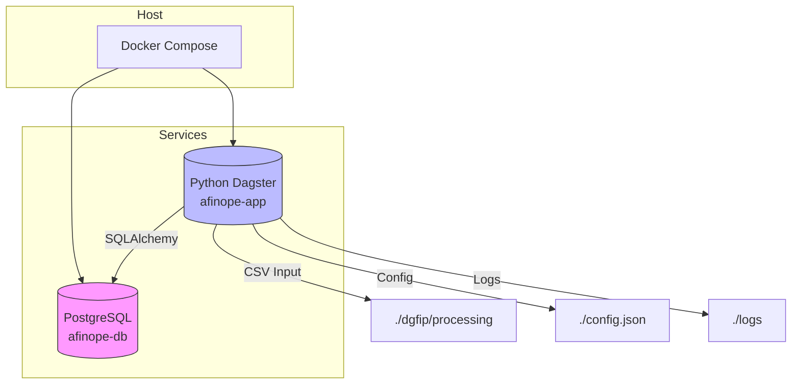

# afinope – Documentation Technique  

[TOC]

---

## 1️⃣ Introduction  

Le projet **afinope** est une application Python destinée à la gestion et à l’analyse financière des opérateurs de l’État.  
Il orchestre :

* L’import de fichiers CSV contenant des références financières.  
* Le stockage de ces données dans une base PostgreSQL.  
* La génération de vues SQL exploitées par Superset pour le pilotage et la prévision budgétaire.  

Le présent document est **autonome** : il décrit l’architecture, le modèle de données, les principaux modules Python, le processus de déploiement Docker et les points d’attention connus.  

↩ [Retour au sommaire](#afinope-documentation-technique)

---

## 2️⃣ Vue d’ensemble du dépôt  

```text
afinope/
├─ analyse/                     # Schémas et fichiers de référence
│   ├─ flux.txt                 # Liste des flux de données
│   └─ *.excalidraw             # Diagrammes (excalidraw)
│
├─ app/                         # Code métier
│   ├─ __init__.py
│   ├─ afinope.py
│   ├─ afinope_base.py
│   ├─ assets.py
│   ├─ circuit_alimentation.py
│   ├─ constantes.py
│   ├─ decodeur_nom_fichier.py
│   ├─ flux.py
│   ├─ gestionnaire_base_donnees.py
│   ├─ gestionnaire_fichier_csv.py
│   ├─ graphe_alimentation.py
│   ├─ helper.py
│   ├─ resources.py
│   ├─ source_donnees.py
│   └─ transformateur.py
│
├─ css/                         # Thèmes Superset (CSS)
│   ├─ superset_dashboard_light_theme.css
│   └─ superset_dashboard_light_blue_theme.css
│
├─ dgfip/                       # Données d’entrée et tickets de suivi
│   ├─ ecologie_2024-06-14/Untitled.ipynb
│   ├─ processing/known_issues/known_issue.txt
│   ├─ controles.txt
│   └─ untitled.txt
│
├─ logs/                        # Journaux d’exécution
│   └─ csv-validation.log
│
├─ sql/                         # Scripts de création de tables / vues
│   ├─ 00_referentiel/…
│   ├─ 01_executoire/…
│   ├─ 02_execution/…
│   ├─ 04_analyse/…
│   └─ 06_superset/01_tdb/…
│
├─ .gitignore
├─ .gitlab-ci.yml
├─ Dockerfile.app
├─ docker-compose.yml
├─ pyproject.toml
└─ poetry.lock
```

↩ [Retour au sommaire](#afinope-documentation-technique)

---

## 3️⃣ Modèle de données (SQL)

### 3.1 Tables de référentiel  

| Table | Description | Colonnes clés |
|-------|-------------|---------------|
| **ORGANISME** | Identité de l’organisme public | `codeOrganisme` (PK) |
| **STRUCTURE** | Budgets et structures associées | `codeOrganisme`, `codeBudget` |
| **NOMENC** | Nomenclature comptable | `exercice`, `numeroCompte` |
| **TIERS** | Informations sur les tiers | `codeOrganisme`, `exercice`, `codeTiers` |
| **NATURE** | Nature des dépenses | `codeOrganisme`, `exercice`, `codeNature` |
| **RECHERCHE** | Recherche budgétaire | `codeOrganisme`, `exercice`, `codeRecherche` |
| **DESTINATION** | Destination des dépenses | `codeOrganisme`, `exercice`, `codeDestination` |
| **ORIGINE** | Origine des dépenses | `codeOrganisme`, `exercice`, `codeOrigine` |
| **PLURIANNUEL** | Données pluriannuelles | `codeOrganisme`, `exercice`, `codePluriannuel` |

### 3.2 Tables d’exécution  

| Table | Usage | Particularités |
|-------|-------|----------------|
| **DESP**, **EFP** | Exécutoires (décomptes) | Montants numérisés, références budgétaires |
| **ABE**, **BAL**, **BIL**, **CR** | États d’exécution (budget, bilan, compte‑rendu) | Champ `typeSequence` (char 1) pour versionning |

### 3.3 Vues Superset (pilotage)  

* `tdb_view` : union des vues `tdb_abp_view` et `tdb_abe_view`.  
* `tdb_abe_view`, `tdb_abp_view` : agrégations spécifiques aux exécutoires ABE et ABP.  

Ces vues sont exploitées par les tableaux de bord Superset pour le suivi budgétaire.

↩ [Retour au sommaire](#afinope-documentation-technique)

---

## 4️⃣ Architecture applicative (Docker)



* **db** : conteneur PostgreSQL (image officielle).  
* **app** : conteneur Python exécutant le serveur Dagster (`dagster-webserver`). Il expose le port 4400.  
* Les volumes montent les répertoires `dgfip/processing`, `config.json` et `logs` afin de partager les données d’entrée et les journaux avec l’hôte.  

↩ [Retour au sommaire](#afinope-documentation-technique)

---

## 5️⃣ Processus de traitement des CSV  

```mermaid
flowchart TD
    Start[Début] --> ListFiles[GestionnaireFichiersCSV.lister_les_fichiers()]
    ListFiles --> ForEach[Boucle sur chaque CSV]
    ForEach --> LoadCSV[read_csv → pandas.DataFrame]
    LoadCSV --> Store[GestionnaireBaseDonnees.stocker_dataframe()]
    Store --> Move[GestionnaireFichiersCSV.deplacer_fichier() → sortie]
    Move --> EndLoop[Fin de boucle]
    EndLoop --> End[Fin du traitement]
```

1. **Lister** les fichiers CSV depuis le répertoire *entrée* (`Flux.entree`).  
2. **Lire** chaque fichier avec `pandas.read_csv`.  
3. **Enrichir** les données (fonctions helper : `na_to_empty`, `int_to_bool`, `str_to_float`).  
4. **Persister** le DataFrame dans PostgreSQL via `to_sql`.  
5. **Déplacer** le fichier traité vers le répertoire *sortie* (`Flux.sortie`).  

Les exceptions sont capturées et remontées sous forme de `RuntimeError` afin d’alimenter le flux d’erreurs (`Flux.erreur`).

↩ [Retour au sommaire](#afinope-documentation-technique)

---

## 6️⃣ Principaux modules Python  

| Module | Rôle | Points d’attention |
|--------|------|--------------------|
| `afinope.py` | Point d’entrée de la logique métier (classe `Afinope`). | Nécessite le logger Dagster (`context.log`). |
| `afinope_base.py` | Déclaration du modèle SQLAlchemy (`Base`, `metadata`). | Utilisé par `GestionnaireBaseDonnees`. |
| `circuit_alimentation.py` | Orchestration Dagster des pipelines (ressource `circuit_alimentation`). | Dépend de la ressource `afinope`. |
| `flux.py` | Encapsulation du répertoire *entrée*, *sortie* et *erreur*. | Simple dictionnaire de configuration. |
| `gestionnaire_base_donnees.py` | Création de tables et persistance des DataFrames. | Gestion des transactions via `source_donnees.get_connection()`. |
| `gestionnaire_fichier_csv.py` | Gestion du cycle de vie des fichiers CSV (listage, déplacement). | Vérifie uniquement l’extension `.csv`. |
| `helper.py` | Fonctions utilitaires de conversion (`na_to_empty`, `int_to_bool`, `str_to_float`). | Utilise `pandas.isna`. |
| `resources.py` | Déclaration des ressources Dagster (`afinope`, `circuit_alimentation`). | Nécessite le package `dagster`. |
| `source_donnees.py` | Wrapper de connexion à PostgreSQL (non affiché ici). | Doit fournir `engine` compatible SQLAlchemy. |
| `transformateur.py` | Transformations spécifiques aux flux (non détaillé). | À compléter selon les besoins métier. |

↩ [Retour au sommaire](#afinope-documentation-technique)

---

## 7️⃣ Déploiement avec Poetry & Docker  

### 7.1 Installation locale (Poetry)

```bash
# Cloner le dépôt
git clone <repo‑url>
cd afinope

# Installer les dépendances
poetry install

# Lancer le serveur Dagster (exemple)
poetry run dagster-webserver -f app/graphe_alimentation.py -h 0.0.0.0 -p 4400 --path-prefix /afinope
```

### 7.2 Build & Run avec Docker Compose

```bash
docker compose up --build -d
# Accès à l’interface Dagster : http://localhost:4400/afinope
# PostgreSQL écoute sur le port 5432 (host)
```

Le fichier `Dockerfile.app` crée une image légère : Python 3.11, installation de Poetry, copie du code source, puis exécution du serveur Dagster.

↩ [Retour au sommaire](#afinope-documentation-technique)

---

## 8️⃣ Points d’attention et correctifs connus  

| Fichier | Problème | Solution proposée |
|---------|----------|-------------------|
| `dgfip/processing/known_issues/known_issue.txt` | Valeur `bigint` invalide (`''152`) dans le CSV `REF_NOMENC_20240709.csv`. | Supprimer les apostrophes : `sed -n "/2024;18;ANC;''152/=" … && sed -i "s/''152/152/g"`. |
| `dgfip/untitled.txt` | Déclaration SQL avec virgule finale avant `);` (syntax error). | Retirer la virgule après la dernière colonne (`id text NULL,`). |
| `sql/02_execution/cr.sql` | Commentaire indique `char(2)` mais définition `char(3)`. | Aligner le type avec le commentaire ou mettre à jour le commentaire. |
| `app/__init__.py` | Fichier vide : aucune initialisation du package. | Ajouter `"""afinope package initialization."""` si besoin. |
| `Dockerfile.app` | `ENTRYPOINT` utilise `dagster-webserver` : aucune variable d’environnement pour la configuration. | Vérifier que `config.json` est monté et que `Dagster` le lit via `resources.afinope`. |

↩ [Retour au sommaire](#afinope-documentation-technique)

---

## 9️⃣ Contribution  

1. **Fork** le dépôt et créer une branche `feature/<nom>`.  
2. Respecter le **PEP 8** et le style de typage (`typing`).  
3. Ajouter ou mettre à jour les tests unitaires (ex. `pytest`).  
4. Mettre à jour la documentation (README, ce fichier) et les diagrammes **Mermaid** si le flux change.  
5. Ouvrir une **Merge Request** sur GitLab, en s’assurant que le pipeline CI passe (`.gitlab-ci.yml`).  

↩ [Retour au sommaire](#afinope-documentation-technique)

---

## 🔚 Annexes  

### 9.1 Exemple de création d’une table via SQLAlchemy (afinope_base.py)  

```python
from sqlalchemy import (
    Column,
    Integer,
    String,
    Date,
    Float,
    Boolean,
    BigInteger,
    MetaData,
    Table,
)

metadata = MetaData()

organisme = Table(
    "ORGANISME",
    metadata,
    Column("codeOrganisme", String(10), primary_key=True),
    Column("libelleOrganisme", String(150)),
    Column("siret", String(14)),
    Column("dateJuridique", Date),
    Column("dateCreation", Date),
    Column("dateCloture", Date),
    Column("dateLiquidation", Date),
    Column("dateDocument", Date),
)
# … autres tables similaires
```

### 9.2 Exemple de pipeline Dagster (graphe_alimentation.py)  

```python
from dagster import job, op, Out, Output
from app.gestionnaire_fichier_csv import GestionnaireFichiersCSV
from app.gestionnaire_base_donnees import GestionnaireBaseDonnees

@op
def lister_csv(context):
    gf = GestionnaireFichiersCSV(context.resources.flux)
    return gf.lister_les_fichiers()

@op
def charger_et_stocke(context, fichiers: list[str]):
    for f in fichiers:
        df = pandas.read_csv(f)
        GestionnaireBaseDonnees(context.resources.source_donnees)\
            .stocker_dataframe(df, nom_table="temp")
        # déplacement du fichier traité
        GestionnaireFichiersCSV(context.resources.flux)\
            .deplacer_fichier(f, context.resources.flux.sortie)

@job(resource_defs={"flux": flux_resource, "source_donnees": source_resource})
def pipeline_alimentation():
    charger_et_stocke(lister_csv())
```

---

*Document généré le 2026‑04‑28, prêt à être utilisé dans Obsidian ou VS Code.*  

↩ [Retour au sommaire](#afinope-documentation-technique)