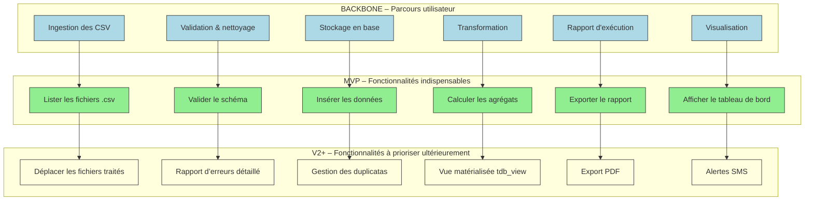

# 📚 Story Mapping – Représenter le périmètre fonctionnel du produit **afinope**
**Document établi à partir des principes du Story Mapping de Jeff Patton**  

[TOC]

---  

## 1️⃣ Introduction et objectifs

| | |
|---|---|
| **Livrable** | Représentation visuelle du périmètre fonctionnel d’**afinope** alignée sur le parcours utilisateur |
| **Méthodologie** | Atelier **Story Mapping** (Jeff Patton) |
| **Objectifs opérationnels** | 1️⃣ Aligner toute l’équipe sur le **parcours cible** de chaque utilisateur<br>2️⃣ Identifier les **fonctions** nécessaires à chaque étape du parcours<br>3️⃣ **Prioriser** les fonctions pour définir le **MVP** (ou V1)<br>4️⃣ Produire un **support visuel partagé** qui cadrera les prochains travaux (backlog, maquettes, estimations) |

---

## 2️⃣ Contexte d’usage

| | |
|---|---|
| **Type de livrable** | Standard ✅ |
| **Nature** | Atelier 🤝 |
| **Activité** | « Imaginer une solution » |
| **Méthode** | Story Mapping (Jeff Patton) |
| **Quand l’utiliser** | <ul><li>Traduire la recherche utilisateur, les exigences réglementaires et la vision produit en périmètre fonctionnel</li><li>Cadrer un MVP, une V1 ou une refonte</li><li>Aligner les équipes métier, technique et design sur une même représentation</li></ul> |
| **Recommandation** | Créer **une Story Map par persona principal** (2‑3 max). Commencer toujours par le **persona final** (ex. : Responsable Financier). |

---

## 3️⃣ Pré‑requis

- [ ] **Vision produit** formalisée (pitch, objectifs, métriques)  
- [ ] **Personas** et synthèse de la recherche utilisateur (verbatims, jobs‑to‑be‑done, pain points)  
- [ ] **Problèmes utilisateurs** hiérarchisés (ex. : « les fichiers CSV arrivent avec des erreurs de format », « les contrôles réglementaires sont manuels »)  
- [ ] **Contraintes réglementaires / techniques** (ex. : normes comptables, format des tables PostgreSQL, exigences de traçabilité)  

> 💡 *Si un pré‑requis manque, réserver 15 min en début d’atelier pour le co‑construire rapidement.*  

---

## 4️⃣ Parties prenantes et rôles

| Rôle | Profil type | Responsabilité dans l’atelier |
|------|-------------|------------------------------|
| **Animateur** | Chef de produit / Product Owner | Cadre, facilite, garde le cap utilisateur |
| **Profil technique** | Tech Lead / Architecte | Évalue faisabilité, effort, dépendances |
| **Porteur métier** | MOA / Responsable Financier | Valide pertinence fonctionnelle & priorisation |
| **Designer UX/UI** *(optionnel)* | Designer produit | Enrichit le parcours, propose des patterns d’interaction |
| **Data‑engineer** | Responsable des pipelines de données | Vérifie la disponibilité des sources, la conformité des formats |

> ☝️ *Un même participant peut cumuler plusieurs rôles selon les ressources disponibles.*

---

## 5️⃣ Logistique

| | |
|---|---|
| **Durée** | 2 h 30 – 3 h (prévoir une pause à 1 h 30 si 3 h) |
| **Matériel physique** | Mur / tableau blanc, post‑its (3 couleurs), marqueurs, ruban de masquage |
| **Outils digitaux** | Miro / FigJam / Mural – pré‑charger le template *Story Map* |
| **Livrable de sortie** | Photo / export de la Story Map, diagramme Mermaid, liste des décisions MVP, points de vigilance |
| **Support de suivi** | Fichier `storymap_afinope.md` partagé dans le repo (VS Code / Obsidian) |

---

## 6️⃣ Déroulé détaillé de l’atelier

### 🎯 Étape 1 – Introduction (15 min)

1. Présenter les **objectifs** de l’atelier et le **principe du Story Mapping** (backbone = parcours, vertical = fonctionnalités, ligne de flottaison = MVP).  
2. Rappeler le **contexte** : produit *afinope* (application financière des opérateurs de l’État), personas, contraintes réglementaires.  
3. Expliquer les **règles de jeu** : écoute active, contribution ouverte, suspension du jugement.  

> ✅ *Astuce* : afficher une **Job‑Story** type – « En tant que **Responsable Financier**, je veux **valider les données comptables** afin de **produire le tableau de bord réglementaire** ».

---

### 🗺️ Étape 2 – Parcours utilisateur horizontal (30 min)

| Action | Consigne |
|---|---|
| **Question** | « Quelles sont les **grandes étapes** que suit l’utilisateur pour atteindre son objectif ? » |
| **Livrable** | Post‑its **verbes d’action** placés **de gauche à droite** (backbone). |
| **Exemple (afinope)** | `Ingestion des fichiers CSV` → `Validation & nettoyage` → `Stockage en base` → `Transformation & calculs` → `Génération des rapports` → `Visualisation / export` |

---

### 📋 Étape 3 – Détail vertical des activités (45 min)

Pour chaque étape du backbone :

| Question | Exemple de réponses |
|---|---|
| **Que doit faire concrètement l’usager ?** | `Sélectionner le répertoire d’import`, `Lancer la validation`, `Corriger les erreurs` |
| **De quelles informations a‑t‑il besoin ?** | `Schéma de la table cible`, `Liste des champs obligatoires` |
| **Quels choix doit‑il effectuer ?** | `Choisir le type de rapport (exécution / prévisionnel)` |
| **Points de friction potentiels** | `Fichiers CSV mal‑formés`, `Doublons`, `Temps de traitement > 30 min` |

> 💡 *Ne pas filtrer à ce stade* : notez **tout** (même les idées qui semblent “trop techniques”).

---

### 🎚️ Étape 4 – Priorisation & définition du MVP (30‑45 min)

1. Tracer une **ligne horizontale** (ligne de flottaison).  
2. **Au‑dessus** : fonctionnalités **indispensables** pour que le parcours soit complet (MVP / V1).  
3. **En‑dessous** : fonctionnalités **reportables** (V2+, backlog).  

| Questions clés | Décision attendue |
|---|---|
| Quelles fonctions sont **obligatoires** pour que l’utilisateur atteigne son objectif ? | Ex. : `Ingestion`, `Validation`, `Stockage`, `Génération du rapport d’exécution` |
| Qu’est‑ce qui peut être **supprimé** sans bloquer le parcours ? | Ex. : `Export PDF`, `Dashboard interactif`, `Historisation avancée` |

> 📌 *Rappel* : le MVP doit être **fonctionnel**, pas **minimaliste à outrance**. Il doit permettre de tester une hypothèse produit réelle (ex. : « les équipes financières accepteront le produit si le rapport d’exécution est disponible en moins de 15 min »).

---

### 🏁 Étape 5 – Conclusion & prochaines étapes (15 min)

| Action | Détails |
|---|---|
| **Relecture collective** | Vérifier la cohérence du parcours + périmètre MVP |
| **Points de vigilance** | Risques techniques, dépendances externes, décisions en suspens |
| **Plan d’action** | <ul><li>Transformer la Story Map en **backlog** (epics → user stories)</li><li>Rédiger les **user stories** avec critères d’acceptation</li><li>Lancer le **maquettage** des écrans clés du MVP</li><li>Faire l’**estimation** technique et planifier les sprints</li></ul> |
| **Livrable immédiat** | Photo / export de la carte, diagramme Mermaid (voir ci‑dessous), liste des fonctionnalités MVP |

> 📸 *Action immédiate* : partager la capture/export dans les 24 h dans le dépôt `docs/storymap_afinope.md`.

---

## 7️⃣ Conseils de facilitation

| Bonnes pratiques | À éviter |
|---|---|
| Reformuler régulièrement pour garantir la clarté | Se perdre dans les détails techniques |
| Garder le focus sur l’expérience utilisateur | Laisser un profil dominer les échanges |
| Faire participer **tout le monde** (métier, terrain, technique) | Accepter les digressions hors du parcours |
| Utiliser un **time‑boxing** strict par étape | Oublier de documenter les arbitrages |
| Ancrer chaque fonctionnalité dans un **besoin utilisateur** | Confondre *nice‑to‑have* et *must‑have* |

---

## 8️⃣ Exemple de Story Map (simplifiée)

```markdown
Parcours utilisateur (axe horizontal →) :
[Ingestion des CSV] — [Validation & nettoyage] — [Stockage en base] — [Transformation] — [Rapport d'exécution] — [Visualisation]

Fonctionnalités associées (axe vertical ↓ sous chaque étape) :

► Ingestion des CSV
   • Sélectionner le répertoire source
   • Lister les fichiers .csv
   • Déplacer les fichiers traités / erronés

► Validation & nettoyage
   • Vérifier le schéma (colonnes attendues)
   • Détecter les valeurs manquantes / incohérences
   • Générer un rapport d’erreurs

► Stockage en base
   • Créer les tables cibles (organisation, structure, …)
   • Insérer les données nettoyées
   • Gérer les duplicatas

► Transformation
   • Appliquer les règles de calcul (agrégats, taux)
   • Générer les vues matérialisées (tdb_view, tdb_abe_view, …)

► Rapport d'exécution
   • Export CSV / Excel
   • Générer le tableau de bord réglementaire
   • Envoyer une notification par mail

► Visualisation
   • Tableau de bord Superset
   • Filtrage par exercice / organisme
   • Export PDF
```

---

## 9️⃣ Diagramme Mermaid du Story Map



> **Adaptation** : remplacez les libellés entre crochets `[…]` par les libellés réels de votre projet (ex. : nom exact de la table, nom du rapport, etc.).

---

## 🔟 Adaptations contextuelles

| Contexte | Adaptation recommandée |
|----------|------------------------|
| **Refonte** | Partir du parcours existant (ex. : extraction actuelle des CSV) → identifier les frictions → proposer les nouvelles étapes fonctionnelles |
| **Produit réglementé** | Intégrer les contraintes légales comme **étapes obligatoires** (ex. : « Contrôles de conformité » avant le stockage) |
| **Multi‑personas** | Créer **une Story Map par persona** (ex. : Responsable financier, Data‑engineer, Auditeur) → fusionner les cartes pour extraire les **fonctionnalités transverses** |
| **Contraintes techniques fortes** | Inviter le **Data‑engineer** dès l’étape 3 (stockage) pour valider la faisabilité du schéma PostgreSQL et des pipelines Dagster |

---

## 11️⃣ Livrables et suite du projet

| Livrable immédiat | Description |
|---|---|
| **Story Map** (photo / export) | Vue d’ensemble du périmètre fonctionnel |
| **Diagramme Mermaid** | Version texte versionnable du backbone et des priorités |
| **Liste des fonctionnalités MVP** | Tableur ou markdown listant les items « au‑dessus » de la ligne de flottaison |

| Livrables dérivés | Description |
|---|---|
| **Backlog produit** (epics → user stories) | Découpage fonctionnel à partir de la Story Map |
| **Matrice de traçabilité** (fonctionnalité ↔ besoin utilisateur ↔ contrainte) | Garantit la conformité aux exigences métier et réglementaires |
| **Roadmap** (MVP → V1 → V2) | Planning visuel des releases |

| Prochaines étapes suggérées |
|---|
| 1️⃣ Rédaction des **user stories** avec critères d’acceptation (ex. : « Le système doit détecter et signaler tous les champs manquants dans le CSV ») |
| 2️⃣ **Maquettage** des écrans clés du MVP (sélection de répertoire, tableau de bord) |
| 3️⃣ **Estimation technique** (story points, effort) et **planification** des sprints |
| 4️⃣ Mise en place du **pipeline CI/CD** (Docker, GitLab CI) pour le MVP |

---

## 📖 Mini‑glossaire

| Terme | Définition |
|---|---|
| **Backbone** | Axe horizontal de la Story Map : séquence d’étapes du parcours utilisateur. |
| **Epic** | Grande fonctionnalité (ex. : « Gestion des fichiers CSV ») qui sera découpée en user stories. |
| **User story** | Description concise d’une fonctionnalité du point de vue de l’utilisateur (ex. : « En tant que Responsable Financier, je veux valider les données CSV afin de garantir la conformité »). |
| **MVP** | Produit Minimum Viable : version fonctionnelle qui permet de tester l’hypothèse produit la plus critique. |
| **Ligne de flottaison** | Ligne horizontale qui sépare les fonctionnalités **indispensables** (au‑dessus) des **reportables** (en‑dessous). |
| **Job‑to‑be‑Done** | Job que l’utilisateur cherche à accomplir (ex. : « produire le tableau de bord réglementaire »). |

---

## 🔚 Retour au sommaire  
[↩ Retour au sommaire](#toc)  