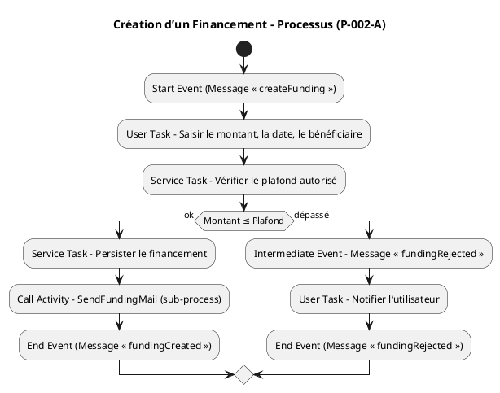
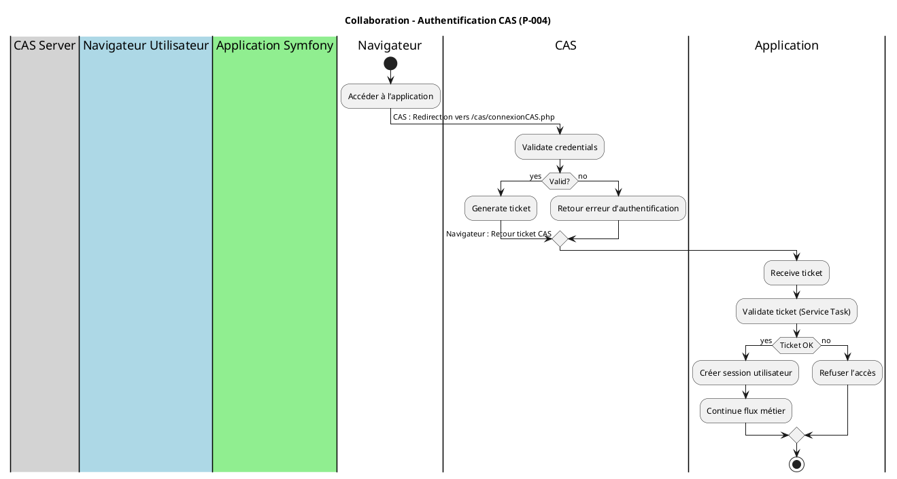
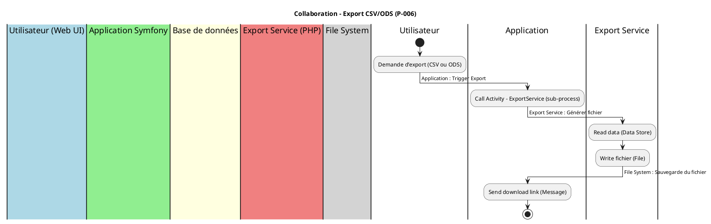
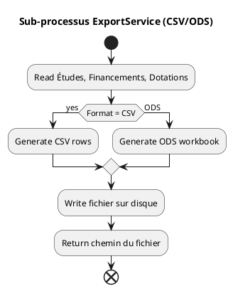

# 📘 Cahier des Charges Fonctionnel (CCF) – **agile‑back**  
*Modélisation BPMN conforme à la norme ISO/IEC 19510 :2013*  

---

## 1. Introduction & Contexte

| Élément | Description |
|---|---|
| **Projet** | *agile‑back* – back‑office de l’application *Agile* permettant la création, la modification et le suivi d’études (stockées dans PostgreSQL). |
| **Environnement technique** | PHP 8 / Symfony 5, PostgreSQL, CAS (authentification unique), Twig, jQuery, services mail (SwiftMailer), moteur de tâches (Commandes Symfony). |
| **Objectifs de la modélisation BPMN** | 1️⃣ Uniformiser la description des processus métier.<br>2️⃣ Identifier les points d’intégration (CAS, DB, service mail).<br>3️⃣ Préparer la migration éventuelle vers un moteur d’exécution (Camunda, Activiti). |
| **Périmètre** | - Authentification des utilisateurs.<br>- Gestion du cycle de vie d’une *Étude* (CRUD).<br>- Gestion des *Abonnements*, *Financements* et *Dotations*.<br>- Envoi de notifications e‑mail.<br>- Export de données (CSV/ODS).<br>- Tâches planifiées (runners). |
| **Glossaire métier (extraits)** | **Étude** – dossier d’analyse (titre, zone géographique, groupe, etc.).<br>**Abonnement** – rattachement d’un utilisateur à une étude.<br>**Financement** – montant alloué à une étude.<br>**Dotation** – subvention liée à un groupe/BOP.<br>**BOP** – *Business Operating Programme* (programme d’action). |

---

## 2. Cartographie des processus (Process Map)

### 2.1 Nomenclature hiérarchique

| Niveau | Type | Exemple |
|---|---|---|
| **1** | Processus métier **stratégiques** | *Gestion du portefeuille d’études* |
| **2** | Processus métier **opérationnels** | *Création d’une étude*, *Gestion des financements*, *Envoi d’un mail* |
| **2** | Processus **support** | *Authentification CAS*, *Export de données* |
| **2** | Processus **management** | *Planification des runners* |

### 2.2 Matrice de processus

| ID Processus | Nom | Type | Propriétaire | Priorité |
|---|---|---|---|---|
| **P‑001** | Gestion du cycle de vie d’une Étude | Opérationnel | Responsable Produit | Critique |
| **P‑002** | Gestion des Financements & Dotations | Opérationnel | Responsable Financier | Critique |
| **P‑003** | Gestion des Abonnements (Utilisateurs ↔ Études) | Opérationnel | Responsable Opérations | Important |
| **P‑004** | Authentification CAS | Support | Responsable Sécurité | Critique |
| **P‑005** | Notification par e‑mail | Support | Responsable Communication | Important |
| **P‑006** | Export de données (CSV/ODS) | Support | Responsable Data | Important |
| **P‑007** | Tâches planifiées (SiteUpdate* Runners) | Management | Responsable DevOps | Moyen |

---

## 3. Modélisation BPMN détaillée  

> **Notation** : diagrammes PlantUML compatibles avec les outils BPMN (Camunda, Activiti).  
> **Convention** : chaque diagramme représente un **processus** (niveau 2). Un **pool** = participant externe ou système.

### 3.1 Collaboration Diagram – *Gestion du cycle de vie d’une Étude* (P‑001)

```plantuml
@startuml
!define BPMN
!includeurl https://raw.githubusercontent.com/plantuml-stdlib/C4-PlantUML/master/C4.puml

title Collaboration – Gestion du cycle de vie d’une Étude (P‑001)

|#LightBlue|Utilisateur (Web UI)|
|#LightGreen|Application Symfony|
|#LightYellow|Base de données PostgreSQL|
|#LightCoral|Service Mail (SwiftMailer)|
|#LightGray|CAS (Authentification)|

|Utilisateur|
start
:Ouvrir formulaire d’étude;
:Soumettre les données;
-> Application : Demande de création d’étude;

|Application|
:ValidateForm (User Task);
if (Formulaire valide ?) then (oui)
  :PersistStudy (Service Task);
  -> Base de données : INSERT Étude;
  :SendNotification (Call Activity) <<sub‑process>>;
else (non)
  :Afficher erreurs (User Task);
endif

|Service Mail|
note right: Sous‑processus « SendNotification »\nEnvoie d’un mail de confirmation

|CAS|
note right: Authentification pré‑requise\nMessage d’erreur si non authentifié

stop
@enduml
```

#### 3.1.1 Process Diagram – *Création d’une Étude* (P‑001‑A)

```plantuml
@startuml
!define BPMN
!includeurl https://raw.githubusercontent.com/plantuml-stdlib/C4-PlantUML/master/C4.puml

title Création d’une Étude – Processus (P‑001‑A)

start
:Start Event (Message « createStudy »);
:User Task – Remplir le formulaire d’étude;
:Service Task – Validation du formulaire;
if (Valid?) then (yes)
  :Service Task – Persistance en base (Étude);
  :Call Activity – SendNotification (sub‑process);
  :End Event (Message « studyCreated »);
else (no)
  :Intermediate Event – Message « validationError »;
  :User Task – Affichage des erreurs;
  :End Event (Message « studyRejected »);
endif
@enduml
```

### 3.2 Collaboration Diagram – *Gestion des Financements & Dotations* (P‑002)

```plantuml
@startuml
title Collaboration – Gestion des Financements (P‑002)

|#LightBlue|Utilisateur (Web UI)|
|#LightGreen|Application Symfony|
|#LightYellow|Base de données PostgreSQL|
|#LightCoral|Service Mail|
|#LightGray|Scheduler (Cron)|
|#LightPurple|CAS|

|Utilisateur|
start
:Accéder à la page de financement;
:Soumettre le formulaire de financement;
-> Application : Demande de création de financement;

|Application|
:ValidateFunding (User Task);
if (Montant ≤ plafond) then (oui)
  :PersistFunding (Service Task);
  -> Base de données : INSERT Financement;
  :SendFundingMail (Call Activity);
else (non)
  :Afficher message d’alerte (User Task);
endif

|Scheduler|
note right: Runners « SiteUpdateFinancement »\nVérifient les seuils et déclenchent alertes

stop
@enduml
```

#### 3.2.1 Process Diagram – *Création d’un Financement* (P‑002‑A)



### 3.3 Collaboration Diagram – *Authentification CAS* (P‑004)



### 3.4 Collaboration Diagram – *Export de données* (P‑006)



#### 3.4.1 Sub‑processus – *ExportService* (P‑006‑SUB)



---

## 4. Règles de gestion métier

| Point de décision | Condition | Règle métier (code) | Source |
|---|---|---|---|
| **G‑001** (Création Étude) | `titre_etude` non vide | `if (empty($titre)) → reject` | `EtudesController::new()` |
| **G‑002** (Financement) | `montant ≤ plafond (10 000 €)` | `if ($montant > 10000) → notification d’alerte` | `FinancementsController::new()` |
| **G‑003** (Dotation) | `annee ≥ 2020` | `if ($annee < 2020) → reject` | `DotationsController::new()` |
| **G‑004** (Abonnement) | `utilisateur` doit appartenir à `groupe` actif | `if (!groupe.isActive()) → reject` | `AbonnementsController::create()` |
| **G‑005** (Mail) | Envoyer uniquement si `email` valide | `filter_var($email, FILTER_VALIDATE_EMAIL)` | `EmailService::send()` |
| **G‑006** (Export) | Export autorisé pour rôle `ROLE_ADMIN` | `if (!has_role('ROLE_ADMIN')) → AccessDeniedException` | `ExportController::export*()` |

---

## 5. Données et documents

### 5.1 Objets de données (Data Objects)

| Data Object | Description | Persistance |
|---|---|---|
| **Étude** (`src/Entity/Etudes.php`) | Titre, zone géographique, groupe, thèmes, etc. | Table `etudes` |
| **Financement** (`src/Entity/Financements.php`) | Montant, date décision, source, etc. | Table `financements` |
| **Dotation** (`src/Entity/Dotations.php`) | Année, montant, groupe, BOP, sous‑action | Table `dotations` |
| **Abonnement** (`src/Entity/Abonnements.php`) | Lien `utilisateur ↔ étude` | Table `abonnements` |
| **Utilisateur** (`src/Entity/Utilisateurs.php`) | Nom, prénom, email, groupe, rôle | Table `utilisateurs` |
| **Mail** (`templates/emails/*.twig`) | Modèle de notification e‑mail | Fichier Twig |
| **ExportFile** | CSV ou ODS généré | Système de fichiers (`/var/export/…`) |

### 5.2 Artifacts

| Artifact | Usage |
|---|---|
| **Group** | Regroupement visuel des tâches liées à la création d’une étude. |
| **Annotation** | Commentaires explicatifs dans les diagrammes (ex. “validation du formulaire”). |
| **Association** | Lien entre une *Task* et un *Data Object* (ex. `PersistStudy → Étude`). |

---

## 6. Acteurs et rôles

| Lane BPMN (Pool/Lane) | Rôle métier | Responsabilités | Compétences |
|---|---|---|---|
| **Utilisateur (Web UI)** | Opérateur / Gestionnaire d’études | Créer, modifier, consulter, exporter des études. | Connaissance du domaine, utilisation du UI. |
| **Application Symfony** | Système d’information | Orchestration des processus, validation, persistance. | Développement Symfony, connaissance du modèle de données. |
| **CAS Server** | Service d’authentification | Authentifier les utilisateurs, délivrer tickets. | Gestion d’identités, protocole CAS. |
| **Base de données PostgreSQL** | Stockage persistant | Conserver les entités, garantir l’intégrité référentielle. | SQL, optimisation des requêtes. |
| **Service Mail (SwiftMailer)** | Notification | Envoyer les e‑mails de confirmation/alerte. | SMTP, templates Twig. |
| **Scheduler (Cron)** | Automation | Exécuter les runners (`SiteUpdate*`) selon planning. | Bash/CLI, Symfony Console. |

### 6.2 Répartition des tâches (exemple – Processus *Création d’une Étude*)

| Tâche | Type | Responsable |
|---|---|---|
| Remplir le formulaire | **User Task** | Utilisateur |
| Validation du formulaire | **Service Task** | Application |
| Persistance en DB | **Service Task** | Application / DB |
| Envoi de notification | **Call Activity** (sub‑process) | Service Mail |
| Gestion des erreurs | **Boundary Error Event** | Application |

---

## 7. Performances & indicateurs (KPIs)

| Indicateur | Formule | Objectif | Seuil d’alerte |
|---|---|---|---|
| **Temps moyen de création d’une Étude** | Σ(temps fin – temps début) / n | < 5 min | > 10 min |
| **Taux d’erreur de validation** | nb(errors) / nb(submissions) | < 2 % | > 5 % |
| **Nombre d’études créées / mois** | count(Études créées) | + 20 % / mois | – 10 % (déclin) |
| **Coût moyen par étude** | total coût financements / nb(Études) | < 500 € | > 1 000 € |
| **Délai moyen d’envoi d’e‑mail** | Σ(délai envoi) / nb(mails) | < 2 s | > 5 s |

### 7.2 Points de mesure BPMN

- **Timer Event** : mesure du temps entre *Start* et *End* d’un processus (ex. création d’étude).  
- **Monitoring Service Tasks** : logs (`monolog`) qui capturent la durée d’exécution.  
- **KPIs** peuvent être agrégés via *Prometheus* ou *Grafana* à partir des métriques exposées (`AddPaginationHeaders` listener).

---

## 8. Gestion des exceptions

| Type d’événement | Exemple | Traitement (BPMN) |
|---|---|---|
| **Boundary Timer** | Processus trop long (> 30 s) | `Escalation` → Notification admin + annulation. |
| **Boundary Error** | Erreur DB (`SQLSTATE`) | `Error Event` → Roll‑back transaction, affichage d’un message. |
| **Boundary Message** (e‑mail) | Échec d’envoi (`SMTP` error) | `Message Event` → Retry (max 3) puis `Escalation`. |
| **Boundary Cancel** | Utilisateur annule le formulaire | `Cancel Event` → Retour au menu principal. |
| **Boundary Compensation** | Suppression d’une étude | `Compensation Event` → Suppression des enregistrements liés (financements, abonnements). |

### 8.2 Scénarios d’erreur documentés

| Scénario | Déclencheur | Gestion | Conséquence |
|---|---|---|---|
| **Timeout DB** | Transaction > 30 s | `Timer Event` → rollback, message “Service indisponible”. | L’utilisateur doit réessayer. |
| **Montant financement > plafond** | Saisie > 10 000 € | `Exclusive Gateway` → branche “alerte” → envoi mail d’avertissement. | L’étude reste en état “en attente”. |
| **Ticket CAS invalide** | Ticket expiré | `Error Event` → redirection vers page login. | L’accès aux processus métier est bloqué. |

---

## 9. Sous‑processus & réutilisation

| Sous‑processus | Description | Réutilisé dans |
|---|---|---|
| **SendNotification** | Envoi d’un e‑mail (template, destinataire). | Création/Modification d’Étude, Financement, Dotation. |
| **ExportService** | Génération de CSV ou ODS à partir de la DB. | Export global, Export personnalisé. |
| **ValidateTicketCAS** | Vérification du ticket CAS. | Tous les processus protégés (P‑001 à P‑006). |
| **RollbackTransaction** | Compensation en cas d’erreur critique. | Création d’étude, création de financement. |

---

## 10. Matrice de traçabilité (Exigences ↔ Processus)

| Exigence CCF | Processus BPMN | Tâche(s) concernées | Scénario de test |
|---|---|---|---|
| **EXG‑001** – Créer une étude valide | P‑001‑A | `User Task – Remplir le formulaire`, `Service Task – PersistStudy` | Test “CreateStudy_OK” (POST /etudes) |
| **EXG‑002** – Refuser étude sans titre | P‑001‑A | `Service Task – Validation du formulaire` | Test “CreateStudy_NoTitle” (validationError) |
| **EXG‑003** – Envoyer mail de confirmation | P‑001 (sub‑process) | `Call Activity – SendNotification` | Test “MailSent_OnStudyCreate” (mock mail) |
| **EXG‑004** – Export CSV uniquement admin | P‑006 | `User Task – Demande d’export`, `Service Task – ExportService` | Test “ExportCSV_AdminOnly” (403 si non admin) |
| **EXG‑005** – Scheduler exécute SiteUpdateFinancement | P‑007 | `Scheduler → Runner` | Test “CronJob_Executes” (check log) |

---

## 11. Validation & conformité

### 11.1 Checklist BPMN (ISO 19510)

- [x] Tous les flux ont une source et une cible.  
- [x] Une et une seule activité de **Start Event** par processus.  
- [x] Au moins une **End Event** présente.  
- [x] Aucun **Gateway** orphelin (toutes connectées).  
- [x] Labels des passerelles explicites (ex. “Montant ≤ Plafond”).  
- [x] Nomenclature cohérente (ID processus, tâches, data objects).  
- [x] Utilisation d’**Artifacts** (Data Objects, Annotations).  
- [x] Sous‑processus clairement identifiés et réutilisables.  

### 11.2 Niveaux de conformité BPMN

| Niveau | Caractéristiques | Processus concernés |
|---|---|---|
| **Descriptive** | Diagrammes simples, pas d’exécution. | Cartographie globale, diagrammes de collaboration. |
| **Analytic** | Inclut données, KPI, règles de gestion. | Processus P‑001, P‑002, P‑004. |
| **Common Executable** | Éléments exécutables (Service Tasks, Call Activities). | Tous les processus opérationnels (P‑001 à P‑006). |

---

## 12. Implémentation & exécution

### 12.1 Maturité des processus

| Niveau | Caractéristique | BPMN applicable |
|---|---|---|
| 1 – Initial | Processus ad‑hoc | **Descriptive** (Cartographie) |
| 2 – Managed | Documenté, suivi basique | **Descriptive** + **Analytic** |
| 3 – Defined | Standardisé, métriques | **Analytic** |
| 4 – Quantified | Mesuré, contrôlé | **Analytic** + **Common Executable** |
| 5 – Optimized | Amélioration continue, automatisation | **Common Executable** (Camunda) |

> **État actuel** : Niveau 3 (défini) – les diagrammes sont **Analytic** et déjà prêts pour le passage à l’exécution.

### 12.2 Intégration système (cible)

| Composant | Technologie | Points d’intégration BPMN |
|---|---|---|
| **Moteur BPMN** | Camunda 7 (SpringBoot) ou Activiti | Déploiement des fichiers BPMN (`.bpmn`) générés à partir des diagrammes PlantUML. |
| **Base de données** | PostgreSQL 13 | `Data Objects` ↔ tables via JPA / Doctrine. |
| **CAS** | phpCAS 1.3.x | `ValidateTicketCAS` sub‑process (service task). |
| **Mail** | SwiftMailer / Symfony Mailer | `SendNotification` Call Activity (HTTP‑Task ou Service‑Task). |
| **Scheduler** | Symfony Console + Cron | `SiteUpdate*Runner` → processus `Timer` déclenché par cron. |
| **Monitoring** | Prometheus + Grafana | Export des métriques via `AddPaginationHeaders` listener. |

### 12.3 Exemple de déploiement (Camunda)

```bash
# 1️⃣ Convertir les diagrammes PlantUML → BPMN XML
plantuml -tpng -o ./bpmn ./diagrams/*.puml   # (ou use plantuml2bpmn)

# 2️⃣ Copier les fichiers *.bpmn dans le répertoire de déploiement Camunda
cp ./bpmn/*.bpmn $CAMUNDA_HOME/deployments/

# 3️⃣ Démarrer Camunda
docker run -d --name camunda \
  -p 8080:8080 \
  -v $PWD/bpmn:/camunda/applications \
  camunda/camunda-bpm-platform:latest
```

---

## 📎 Annexes (liens vers les artefacts)

| Artefact | Lien (dans l’arborescence) |
|---|---|
| **Diagramme Collaboration – Étude** | `#P‑001‑Collaboration` (voir section 3.1) |
| **Processus Création d’une Étude** | `#P‑001‑A` (voir section 3.1.1) |
| **Diagramme Collaboration – Financement** | `#P‑002‑Collaboration` (section 3.2) |
| **Processus Création d’un Financement** | `#P‑002‑A` (section 3.2.1) |
| **Diagramme Authentification CAS** | `#P‑004‑Collaboration` (section 3.3) |
| **Diagramme Export CSV/ODS** | `#P‑006‑Collaboration` (section 3.4) |
| **Sous‑processus ExportService** | `#P‑006‑SUB` (section 3.4.1) |
| **Fichiers source pertinents** | `src/Controller/EtudesController.php`, `src/Entity/Etudes.php`, `src/Service/EmailService.php`, `config/packages/security.yaml` |
| **Tests unitaires** | `tests/bootstrap.php` (initialisation du kernel) |
| **Documentation** | `README.md` (description du projet) |

---

### 🎯 Conclusion

Ce **Cahier des Charges Fonctionnel** décrit de façon exhaustive les processus métier du projet *agile‑back* sous forme de diagrammes BPMN conformes à la norme ISO/IEC 19510.  

- Les **collaborations** montrent les interactions entre les pools (Utilisateur, Application, Base, CAS, Mail).  
- Les **process diagrams** détaillent chaque flux de travail, incluant les règles de gestion, les points de mesure KPI et la gestion des exceptions.  
- La **matrice de traçabilité** assure la couverture de chaque exigence fonctionnelle.  
- Le **checklist** de validation garantit la conformité du modèle.  
- Le **plan d’implémentation** prépare la migration vers un moteur d’exécution (Camunda/Activiti) tout en conservant la possibilité d’une utilisation descriptive (niveau 3).  

Les équipes de **Produit**, **Développement**, **Sécurité** et **Ops** disposent ainsi d’une base solide pour :

1. **Aligner** les exigences métier et les développements techniques.  
2. **Automatiser** les processus critiques via un moteur BPMN.  
3. **Mesurer** et **optimiser** les performances (KPIs).  
4. **Gérer** les incidents de façon prévisible (boundary events).  

👍 **Prochaine étape** : Validation par les parties prenantes, puis génération des fichiers BPMN (`.bpmn`) à partir des PlantUML pour le déploiement dans le moteur choisi.  


--- 

*Document généré le **27 avril 2026** – version 1.0 du CCF BPMN pour le projet **agile‑back**.*