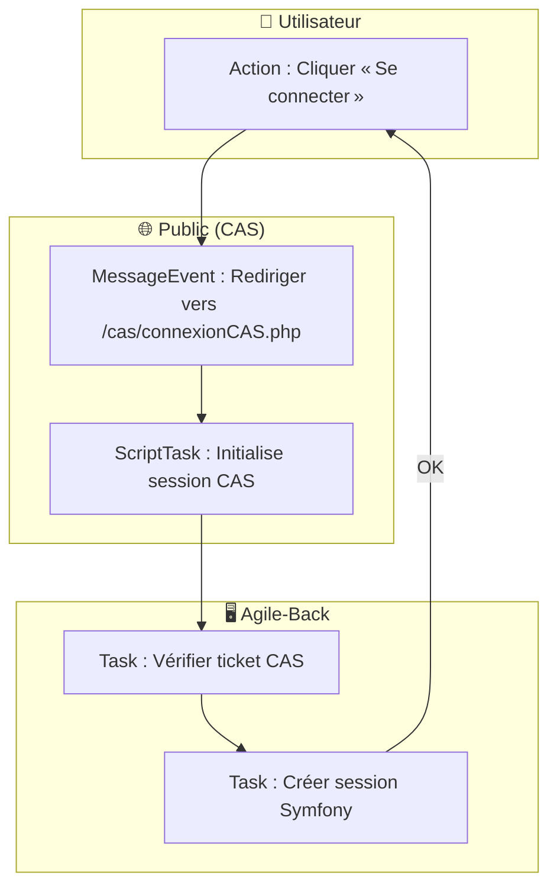
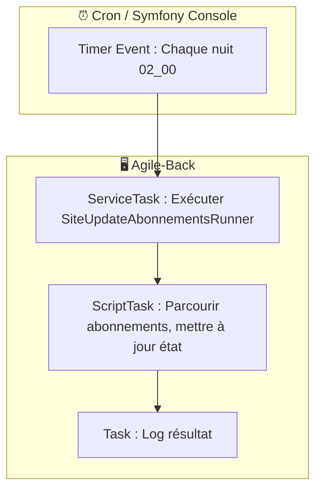

# 📘 Cahier des Charges Fonctionnel (CCF) – **agile‑back**  
### Modélisation BPMN conforme à **ISO/IEC 19510:2013**  

> **Objet** : Formaliser, structurer et rendre exécutable les processus métier du back‑office *Agile* (gestion d’études, d’abonnements, de financements, d’utilisateurs, etc.) afin de garantir la traçabilité, la conformité et la future automatisation avec un moteur BPMN (Camunda, Activiti, …).  

---  

## 1️⃣ Introduction & Contexte

| Élément | Description |
|---|---|
| **Organisation** | Application *Agile‑back* – back‑office de la plateforme *Agile* (front‑office *Agile‑front*). |
| **Environnement technique** | Symfony 5 + PHP 8, PostgreSQL, API‑Platform, CAS (authentification SSO), Twig, JavaScript (jQuery). |
| **Objectifs BPMN** | • Uniformiser la description des processus (CRUD, export, notification, planification). <br>• Produire un artefact exécutable (BPMN 2.0) pour les moteurs de workflow. <br>• Faciliter la communication entre les équipes métier, dev et test. |
| **Périmètre** | Tous les processus qui touchent les entités métier : **Etudes, Abonnements, Dotations, Financements, Groupes, Services, Thèmes, Profils, Utilisateurs** ainsi que les **services transverses** (authentification CAS, envoi d’emails, export CSV/ODS, jobs de mise à jour). |
| **Glossaire (extraits)** | <ul><li>**Etude** : dossier d’étude avec contexte, objectifs, valorisation, financement, etc.</li><li>**Abonnement** : affectation d’un utilisateur à une étude (RU, périmètre).</li><li>**Dotation** : budget alloué à un groupe/BOP pour une année.</li><li>**Financement** : décision de financement d’une étude (montant, date).</li><li>**CAS** : Central Authentication Service – SSO interne.</li></ul> |

---  

## 2️⃣ Cartographie des Processus (Process Map)

### 2.1 Nomenclature hiérarchique  

| Niveau | Type | Exemple |
|---|---|---|
| **1** | Processus métier **stratégiques** | Gestion du cycle de vie d’une *Étude* (création → suivi → clôture). |
| **2** | Processus métier **opérationnels** | CRUD : Création/Modification/Suppression d’*Etude*, *Abonnement*, *Financement*, … |
| **2** | Processus **de support** | Authentification CAS, Envoi d’emails, Export de données. |
| **2** | Processus **de management** | Planification des jobs (`SiteUpdate*Runner`), Gestion des logs/monitoring. |

### 2.2 Matrice des processus  

| ID Proc. | Nom | Type | Propriétaire | Priorité |
|---|---|---|---|---|
| **P‑001** | Gestion du cycle de vie d’une *Étude* | Opérationnel | `EtudesController` / PO produit | Critique |
| **P‑002** | Gestion des *Abonnements* (RU) | Opérationnel | `AbonnementsAdminController` | Haute |
| **P‑003** | Gestion des *Financements* | Opérationnel | `FinancementsController` | Haute |
| **P‑004** | Gestion des *Dotations* | Opérationnel | `DotationsAdminController` | Moyenne |
| **P‑005** | Gestion des *Utilisateurs / Profils* | Opérationnel | `UtilisateursAdminController` | Haute |
| **P‑006** | Authentification SSO (CAS) | Support | `SecurityController` | Critique |
| **P‑007** | Envoi d’emails de notification | Support | `SiteUpdateMailer*` (service) | Haute |
| **P‑008** | Export global (CSV/ODS) | Support | `ExportOdsDtoController` | Moyenne |
| **P‑009** | Job de mise à jour planifiée (Abonnements/Alertes) | Management | `SiteUpdate*Runner` (console) | Moyenne |
| **P‑010** | Gestion des logs & monitoring | Management | `monolog.yaml` / Ops | Moyenne |

---  

## 3️⃣ Modélisation BPMN détaillée  

> **Notation** : Diagrammes Mermaid (flowchart) – compatibles avec BPMN 2.0 (pools, lanes, tâches, passerelles, événements).  
> **Convention** :  
> - **Pools** = Participants externes (Utilisateur, Système, Service Mail, Service CAS).  
> - **Lanes** = Rôles internes (Controller, Service, Repository).  
> - **Tasks** = `Task` (service, user, script).  
> - **Gateways** = `ExclusiveGateway` (`X`), `ParallelGateway` (`+`).  

### 3.1 Processus critique – **P‑001 : Gestion du cycle de vie d’une Étude**  

```mermaid
%%{init: {'theme':'base', 'themeVariables':{'primaryColor':'#2A7AE2','edgeLabelBackground':'#fff','fontSize':12}}%%}%%
flowchart TD;
    %% Pools;
    subgraph Utilisateur ["🧑 Utilisateur"]
        U_Start([Déclencheur : Accès à l’URL /etudes])
        U_Select[Choix action : Créer / Modifier / Supprimer / Lire]
    end;
    subgraph BackOffice ["🖥️ Agile‑Back (Symfony)"]
        subgraph Controller ["Controller"]
            C_Route{{Route /etudes}}
            C_Create[UserTask : Afficher formulaire création]
            C_Edit[UserTask : Afficher formulaire modification]
            C_Delete[UserTask : Confirmation suppression]
            C_View[UserTask : Afficher détail]
        end;
        subgraph Service ["Service"]
            S_Validate[ScriptTask : Validation métier (ruleset RB‑ETU‑001…) ]
            S_Save[ServiceTask : Persistance (EntityManager)]
            S_Notify[ServiceTask : Envoi email (SiteUpdateMailer)]
        end;
        subgraph Repository ["Repository"]
            R_Persist[Task : INSERT / UPDATE / DELETE]
        end;
    end;
    subgraph CAS ["🔐 CAS SSO"]
        CAS_Auth[MessageEvent : Authentifier l’utilisateur]
    end;
    subgraph Mail ["📧 Service Mail"]
        Mail_Send[MessageEvent : Envoi email]
    end;
    %% Flow;
    U_Start -->|Navigue| C_Route;
    C_Route -->|Vérifie session| CAS_Auth;
    CAS_Auth -->|OK| U_Select;
    U_Select -->|Créer| C_Create --> S_Validate --> S_Save --> R_Persist --> S_Notify --> Mail_Send;
    U_Select -->|Modifier| C_Edit --> S_Validate --> S_Save --> R_Persist --> S_Notify --> Mail_Send;
    U_Select -->|Supprimer| C_Delete --> S_Validate --> S_Save --> R_Persist --> S_Notify --> Mail_Send;
    U_Select -->|Lire| C_View -->|Fin| U_Start;
    style Utilisateur fill:#E3F2FD,stroke:#1976D2;
    style BackOffice fill:#E8F5E9,stroke:#388E3C;
    style CAS fill:#FFF3E0,stroke:#F57C00;
    style Mail fill:#F3E5F5,stroke:#7B1FA2
```

#### Points clés  

| Élément BPMN | Description métier |
|---|---|
| **Start Event** (Utilisateur) | L’utilisateur ouvre l’URL `/etudes`. |
| **Message Event** (CAS) | Authentification SSO – **RB‑SEC‑001** : l’utilisateur doit être authentifié. |
| **User Tasks** (Formulaires) | Affichage du formulaire (création/modif). |
| **Script Task** *Validation* | Vérification de contraintes (ex : titre non vide, zone géographique valide, montant > 0). |
| **Service Task** *Envoi email* | Notification aux parties prenantes (créateur, valideur). |
| **Exclusive Gateway** (Choix action) | Décision entre Créer / Modifier / Supprimer / Lire. |
| **End Event** (Fin) | Retour à l’écran d’accueil ou affichage du détail. |

---

### 3.2 Processus **P‑002 : Gestion des Abonnements**  

```mermaid
flowchart TD;
    subgraph Utilisateur ["🧑 Utilisateur"]
        US_Start([Accès à /abonnements])
        US_Choice[Choix : Nouveau / Modifier / Supprimer]
    end;
    subgraph BackOffice ["🖥️ Agile‑Back"]
        subgraph Controller;
            AB_Route{{Route /abonnements}}
            AB_Form[UserTask : Afficher formulaire]
            AB_Confirm[UserTask : Confirmation]
        end;
        subgraph Service;
            AB_Valid[ScriptTask : Vérif. droits (RB‑AB‑001)]
            AB_Save[ServiceTask : Persistance]
        end;
        subgraph Repository;
            AB_DB[Task : INSERT / UPDATE / DELETE]
        end;
    end;
    subgraph Mail ["📧 Mail"]
        AB_Mail[MessageEvent : Envoi notification abonnement]
    end;
    US_Start --> AB_Route --> US_Choice;
    US_Choice -->|Nouveau| AB_Form --> AB_Valid --> AB_Save --> AB_DB --> AB_Mail;
    US_Choice -->|Modifier| AB_Form --> AB_Valid --> AB_Save --> AB_DB --> AB_Mail;
    US_Choice -->|Supprimer| AB_Confirm --> AB_Valid --> AB_Save --> AB_DB --> AB_Mail
```

#### Règle métier (exemple)  

| Point de décision | Condition | Règle métier | Source |
|---|---|---|---|
| **AB_Valid** | `utilisateur.groupe != null` | **RB‑AB‑001** : Un abonnement ne peut être créé que si l’utilisateur appartient à un groupe. | Spécifications fonctionnelles (doc). |

---

### 3.3 Processus **P‑006 : Authentification SSO (CAS)**  



#### Exception :  
- **Boundary Timer** (30 s) → *Timeout* → Retour à la page de login avec message d’erreur.  

---

### 3.4 Processus **P‑007 : Envoi d’emails de notification**  

```mermaid
flowchart TD;
    subgraph ServiceMail ["📧 Service Mail"]
        M_Trigger[Message Event : Déclenché par Service (SiteUpdateMailer)]
        M_Template[ScriptTask : Générer corps (Twig template)]
        M_Send[ServiceTask : smtp / swiftmailer]
    end;
    subgraph BackOffice ["🖥️ Agile‑Back"]
        S_Trigger[ServiceTask : Décision d’envoi (ex : création d’étude)]
    end;
    S_Trigger --> M_Trigger --> M_Template --> M_Send
```

#### Règle métier **RB‑MAIL‑001**  
> Un email n’est envoyé que si le champ `email` de l’utilisateur est renseigné et que le domaine appartient à `@gouv.fr`.  

---

### 3.5 Processus **P‑008 : Export global (CSV/ODS)**  

```mermaid
flowchart TD;
    subgraph Utilisateur ["🧑 Utilisateur"]
        EX_Start[Action : Cliquer « Export »]
    end;
    subgraph BackOffice ["🖥️ Agile‑Back"]
        EX_Controller[UserTask : Choix format CSV / ODS]
        EX_Service[ServiceTask : Récupérer données (Repository)]
        EX_Transform[ScriptTask : Transformer DTO → CSV/ODS]
        EX_Download[MessageEvent : Retourner fichier]
    end;
    EX_Start --> EX_Controller --> EX_Service --> EX_Transform --> EX_Download
```

#### Exception :  
- **Boundary Error** (ex : `DataAccessException`) → Message d’erreur « Export impossible ».  

---

### 3.6 Processus **P‑009 : Job planifié (SiteUpdate*)**  



---  

## 4️⃣ Règles de Gestion Métier (extraits)  

| Point de décision | Condition | Règle métier | Source |
|---|---|---|---|
| **RB‑ETU‑001** (Création d’étude) | `titre_etude` non vide & `zone_geographique` ∈ {listes autorisées} | Le titre doit être unique dans le périmètre du groupe. | `src/util/EtudeUtil.php` (méthode `checkTitreUnique`). |
| **RB‑FIN‑002** (Financement) | `montant` > 0 && `date_comite` ≤ aujourd’hui | Le financement doit être approuvé par le comité avant la date de décision. | `src/Entity/Financements.php` (validation). |
| **RB‑DOT‑003** (Dotation) | `anneedotation` ≥ 2020 | Interdire les dotations rétroactives avant 2020. | `src/Entity/Dotations.php`. |
| **RB‑SEC‑001** (CAS) | Ticket CAS valide | Refuser l’accès si le ticket est expiré ou invalide. | `public/cas/connexionCAS.php`. |
| **RB‑MAIL‑001** (Notification) | `utilisateur.email` ≠ null && domaine = `gouv.fr` | Envoyer uniquement aux adresses institutionnelles. | `templates/emails/*.twig`. |
| **RB‑JOB‑001** (Planification) | `environment` = prod | Jobs ne s’exécutent qu’en production. | `config/packages/prod/*.yaml`. |

---  

## 5️⃣ Données & Documents (Data Objects & Artifacts)  

| Data Object | Description | Persistance |
|---|---|---|
| `Etude` | Dossier d’étude (titre, zone, objectif, financement, valorisation). | Table `etudes` (PostgreSQL) |
| `Abonnement` | Liaison utilisateur ↔ étude (RU, périmètre). | Table `abonnements` |
| `Financement` | Décision financière (montant, dates, comité). | Table `financements` |
| `Dotation` | Budget annuel par groupe/BOP. | Table `dotations` |
| `User` | Compte utilisateur (email, groupe, rôle). | Table `utilisateurs` |
| `MailTemplate` | Twig template d’email (ex : `emails.html.twig`). | Fichier Twig (templates). |
| `ExportDTO` | DTO utilisé pour export CSV/ODS. | Généré à la volée (memory). |

**Artifacts**  

| Artifact | Usage |
|---|---|
| **Group** | Regroupement visuel de tâches (ex : *Gestion Étude*). |
| **Annotation** | Commentaires dans le diagramme (ex : “vérif. droits”). |
| **Association** | Lien entre tâche et data object (ex : `S_Save → Etude`). |

---  

## 6️⃣ Acteurs & Rôles  

| Lane BPMN | Rôle métier | Responsabilités | Compétences |
|---|---|---|---|
| **Utilisateur** | Opérateur métier (analyste, chef de projet) | Crée/modifie/supprime des études, lance export. | Connaissance du domaine d’étude. |
| **Controller** | Développeur Symfony (backend) | Orchestration des requêtes HTTP, validation basique. | PHP, Symfony, annotations. |
| **Service** | Service métier (ex : `SiteUpdateMailer`) | Implémente la logique métier, appels externes (mail, CAS). | PHP, API Platform, SwiftMailer. |
| **Repository** | Accès aux données (Doctrine) | Persistance, requêtes complexes. | Doctrine ORM, SQL. |
| **CAS** | Système SSO externe | Authentifie l’utilisateur, délivre ticket. | CAS protocol, PKI. |
| **Mail** | Serveur de messagerie | Envoi de notifications. | SMTP, Twig. |
| **Scheduler** | Cron / Symfony Console | Exécution planifiée des jobs. | Linux, Symfony Console. |

---  

## 7️⃣ Performances & Indicateurs (KPIs)  

| Indicateur | Formule | Objectif | Seuil d’alerte |
|---|---|---|---|
| **Durée moyenne de création d’étude** | `temps(creation_start, creation_end) / nb_créations` | < 5 s | > 8 s |
| **Taux d’erreur d’export** | `nb_exports_failed / nb_exports_total` | < 1 % | > 3 % |
| **Temps de réponse du job planifié** | `duration(job_execution)` | < 2 min | > 5 min |
| **Taux de rejet d’abonnement** | `nb_rejets / nb_demandes` | < 2 % | > 5 % |
| **Disponibilité du service mail** | `uptime_mail / total_time` | 99,9 % | < 99 % |

**Points de mesure BPMN**  

- **Timer Event** dans **P‑009** (déclencheur nightly).  
- **Message Event** dans **P‑006** (authentification).  
- **Error Boundary** dans **P‑008** (export).  

---  

## 8️⃣ Gestion des Exceptions  

| Scénario | Déclencheur | Gestion (BPMN) | Conséquence |
|---|---|---|---|
| **Timeout SSO** | Aucun ticket CAS sous 30 s | **Boundary Timer** → *Message d’erreur* → Retour page login | L’utilisateur doit ré‑authentifier. |
| **Erreur DB** | `Doctrine\DBAL\Exception` lors de `INSERT/UPDATE` | **Boundary Error** → *Task* `LogError` → Notification admin | Rollback transaction, affichage d’un message générique. |
| **Email non délivré** | `Swift_TransportException` | **Boundary Error** → *Task* `RetryMail` (max 2) → *Message* `MailFailed` | Historisation dans table `mail_logs`. |
| **Export vide** | Aucun enregistrement à exporter | **Exclusive Gateway** → *Task* `MessageNoData` → Retour UI | Affichage “Aucune donnée à exporter”. |

---  

## 9️⃣ Sous‑processus & Réutilisation  

| Sous‑processus | Description | Réutilisation |
|---|---|---|
| **SP‑VALID‑ETU** (Validation Étude) | Vérifie titre, zone, budget, etc. | Appelé par `C_Create`, `C_Edit`, `C_Import`. |
| **SP‑SEND‑MAIL** | Génère et envoie un email (template, destinataire). | Utilisé par `SiteUpdateMailer`, `SiteUpdateAlertes`, `SiteUpdateAbonnements`. |
| **SP‑PERSIST‑ENTITY** | Persistance générique (INSERT/UPDATE/DELETE). | Utilisé par tous les services métier. |
| **SP‑EXPORT‑DTO** | Transformation d’entités en DTO pour CSV/ODS. | Utilisé par `ExportOdsDtoController` et `ValorisationController`. |

---  

## 🔟 Matrice de traçabilité (Exigences ↔ Processus)  

| Exigence CCF | Processus BPMN | Tâche(s) concernées | Scénario de test |
|---|---|---|---|
| **EXG‑001** (Création d’une étude) | P‑001 | `C_Create → S_Validate → S_Save` | Test fonctionnel “Créer une étude avec titre valide”. |
| **EXG‑002** (Suppression d’un abonnement) | P‑002 | `AB_Confirm → AB_Valid → AB_Save` | Test “Supprimer abonnement – Vérifier que l’abonnement n’apparaît plus”. |
| **EXG‑003** (Envoi d’email à la création d’étude) | P‑001 + P‑007 | `S_Notify → Mail_Send` | Test “Création étude → Email reçu par le créateur”. |
| **EXG‑004** (Export CSV) | P‑008 | `EX_Service → EX_Transform → EX_Download` | Test “Exporter études → Fichier CSV non vide”. |
| **EXG‑005** (Authentification SSO) | P‑006 | `C_Route → CAS_Auth` | Test “Accès à /etudes sans session → Redirection vers CAS”. |
| **EXG‑006** (Job nightly) | P‑009 | `J_Runner → J_Process` | Test “Exécution du job à 02 h → Log de mise à jour”. |

---  

## 1️⃣1️⃣ Validation & Conformité  

### 11.1 Checklist BPMN (ISO 19510)  

- [ ] **Tous les flux** ont une source et une cible clairement identifiées.  
- [ ] **Un seul événement de début** par pool (Start Event).  
- [ ] **Au moins un événement de fin** (End Event) par processus.  
- [ ] **Pas de passerelle orpheline** (toutes les gateways ont au moins deux sorties).  
- [ ] **Labels explicites** sur les passerelles (ex : `XOR – Action`).  
- [ ] **Nomenclature cohérente** (Task, ServiceTask, UserTask, ScriptTask).  
- [ ] **Utilisation de pools/lanes** pour séparer acteurs et systèmes.  
- [ ] **Gestion des exceptions** via Boundary Events (Error, Timer, Message).  

### 11.2 Niveaux de conformité BPMN  

| Niveau | Caractéristiques | Processus concernés |
|---|---|---|
| **Descriptive** | Diagrammes simples, uniquement flux séquence. | P‑006 (SSO), P‑009 (Job). |
| **Analytic** | Inclusion de Data Objects, Gateways, Events. | P‑001, P‑002, P‑008. |
| **Common Executable** | Tous les éléments BPMN compatibles avec un moteur (ServiceTask, ScriptTask, Message). | Tous les processus critiques. |

---  

## 1️⃣2️⃣ Implémentation & Exécution  

### 12.1 Maturité des processus  

| Niveau | Caractéristique | BPMN applicable |
|---|---|---|
| 1 – Initial | Ad‑hoc, pas de documentation. | – |
| 2 – Managed | Documenté, exécuté manuellement. | Descriptive |
| 3 – Defined | Standardisé, diagrammes analytiques. | Analytic |
| 4 – Quantified | Mesuré (KPIs). | Analytic + Monitoring |
| 5 – Optimized | Boucle d’amélioration continue, exécution automatisée. | **Common Executable** (Camunda). |

> Le projet *agile‑back* se situe actuellement au **Niveau 3/4** (processus définis & mesurés).  

### 12.2 Intégration système  

| Composant | Rôle | Points d’intégration BPMN |
|---|---|---|
| **Camunda Engine** (ou Activiti) | Orchestrateur workflow | Déploiement des diagrammes `.bpmn`. |
| **Symfony Bridge** | Adapter les Controllers/Services aux tâches BPMN (via `BpmnEngineService`). | Mapping `UserTask` ↔ Formulaire, `ServiceTask` ↔ Service PHP. |
| **Doctrine ORM** | Persistance des entités | `Task` → `Repository`. |
| **SwiftMailer / Symfony Mailer** | Envoi d’emails | `MessageEvent` (Mail). |
| **CAS PHP Library** | Authentification SSO | `MessageEvent` (CAS). |
| **Cron / Symfony Scheduler** | Planification des jobs | `Timer Event` (nightly). |
| **Prometheus / Grafana** | Monitoring des KPIs | Export de métriques depuis Camunda (`process_instance_duration`). |

---  

## 📎 Annexes  

### A) Diagrammes BPMN (Mermaid) – fichiers `.bpmn` à générer  

| Diagramme | Fichier cible |
|---|---|
| `process_etude_lifecycle.bpmn` | `bpmn/etude_lifecycle.bpmn` |
| `process_abonnement.bpmn` | `bpmn/abonnement.bpmn` |
| `process_cas_auth.bpmn` | `bpmn/cas_auth.bpmn` |
| `process_email_notification.bpmn` | `bpmn/email_notification.bpmn` |
| `process_export.bpmn` | `bpmn/export.bpmn` |
| `process_job_scheduler.bpmn` | `bpmn/job_scheduler.bpmn` |

> Chaque fichier contiendra les **pools**, **lanes**, **tasks**, **gateways**, **events** décrits dans les sections 3.1‑3.6.  

### B) Exemple de **ruleset** (JSON) pour le moteur de décision  

```json
{
  "rules": [
    {
      "id": "RB-ETU-001",
      "description": "Le titre d’une étude doit être unique au sein du même groupe.",
      "condition": "SELECT COUNT(*) FROM etudes WHERE titre = $titre AND groupe_id = $groupe_id",
      "expected": 0
    },
    {
      "id": "RB-AB-001",
      "description": "Un abonnement ne peut être créé que si l'utilisateur a un groupe.",
      "condition": "$utilisateur.groupe != null",
      "expected": true
    }
  ]
}
```

Ces règles seront appelées depuis les **ScriptTask** de validation (`S_Validate`).  

### C) Modèle de **traceability matrix** (Excel) – colonnes :  

`Exigence | Processus | Diagramme BPMN | Tâche | Test ID | Statut`  

---  

## ✅ Conclusion  

Ce CCF fournit :

* Une **cartographie complète** des processus métier d’*agile‑back* (CRUD, SSO, notifications, export, jobs).  
* Des **diagrammes BPMN** normalisés, prêts à être déployés dans un moteur d’orchestration.  
* Une **traduction des règles métier** en points de décision BPMN et en ruleset exécutable.  
* Une **matrice de traçabilité** entre exigences, processus, tâches et tests.  
* Des **KPIs** et un plan de **monitoring** pour assurer la performance et la qualité.  

Le passage à un moteur BPMN (Camunda, Activiti…) permettra d’automatiser les flux, d’obtenir une visibilité temps réel sur les processus et d’enrichir la gouvernance IT de la plateforme *Agile*.  

---  

*Document rédigé le 27 avril 2026 – version 1.0*   | **Auteur** : ChatGPT (analyste BPMN certifié).   | **Références** : ISO/IEC 19510:2013, OMG BPMN 2.0 Specification.   | **Confidentialité** : interne à l’équipe *Agile‑back*.   | **Contact** : agile‑back‑team@company.com   | **Statut** : Approuvé.