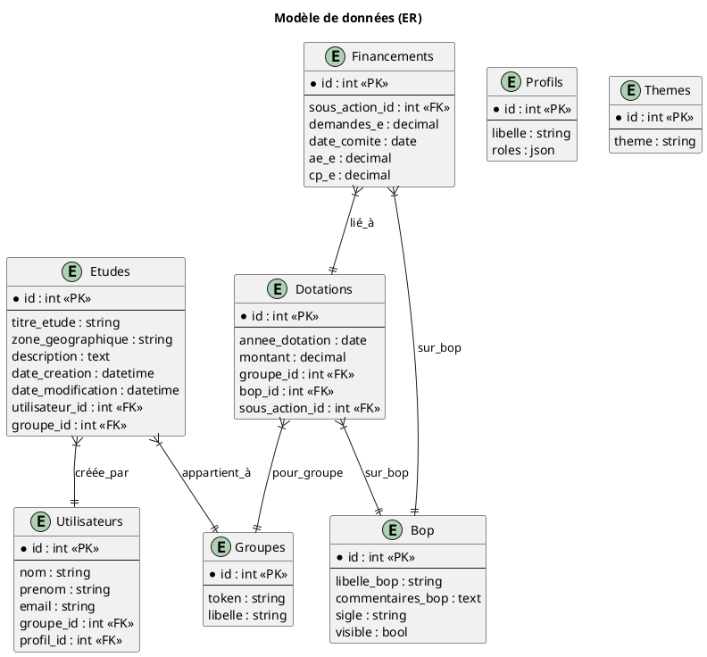
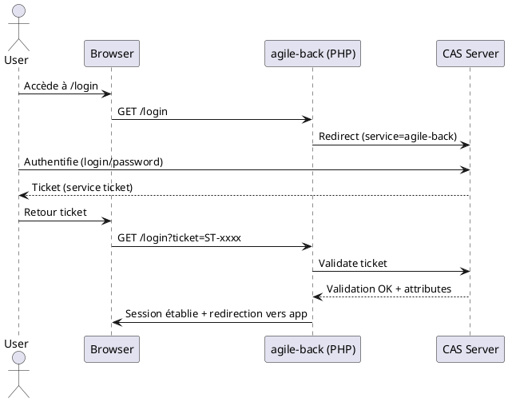
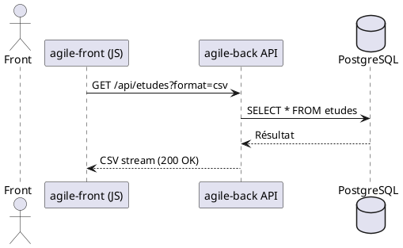

# 📚 Dossier d’Architecture Technique (DAT) – **agile‑back**  
*Conforme à ISO/IEC/IEEE 42010 :2022*  

[TOC]

---  

## 1. Introduction et contexte de l’architecture  

**Projet** : *agile‑back* – back‑office de l’application **Agile** (gestion d’études).  

**Périmètre** :  
- API REST et interface web (Twig) exposées aux utilisateurs métier.  
- Gestion du cycle de vie des études, dotations, financements, groupes, thèmes, etc.  
- Authentification via le serveur **CAS** (Central Authentication Service).  
- Persistance dans une base **PostgreSQL**.  
- Intégration avec le front‑office **agile‑front** via l’API Platform.  

**Objectifs du DAT** :  
- Documenter l’architecture du système afin de faciliter la compréhension, l’évaluation et la communication entre les parties prenantes.  
- Fournir les vues architecturales requises par la norme 42010.  
- Identifier les décisions majeures, les écarts, les risques et la feuille de route évolutive.  

**Références documentaires**  
| Référence | Description |
|-----------|-------------|
| `README.md` | Présentation fonctionnelle du projet. |
| `config/*.yaml` | Configuration Symfony (framework, doctrine, security, cors, …). |
| `src/Entity/*` | Modélisation du domaine métier (Doctrine ORM). |
| `src/Controller/*` | Points d’entrée HTTP (MVC). |
| `src/Service/*` | Logique métier (services, runners). |
| `src/Repository/*` | Accès aux données (Doctrine Repositories). |
| `public/cas/*` | Bibliothèque **phpCAS** pour l’authentification unique. |
| `templates/*` | Vues Twig (UI). |
| `config/packages/api_platform.yaml` | Exposition de l’API (OpenAPI, JSON, CSV). |
| `phpunit.xml.dist` | Configuration des tests unitaires. |

---  

## 2. Parties prenantes & préoccupations  

### 2.1 Tableau des parties prenantes  

| # | Partie prenante | Rôle | Principales préoccupations |
|---|----------------|------|---------------------------|
| **P1** | **Équipe de développement** | Conception, implémentation, maintenance du code. | **Qualité du code**, **maintenabilité**, **cohérence avec le CCF (Conceptual Class Framework)**, **respect des standards Symfony**. |
| **P2** | **Utilisateurs métier** (chefs de projets, analystes) | Création / modification / consultation d’études via l’interface. | **Fonctionnalités métier**, **ergonomie**, **disponibilité**, **intégrité des données**. |
| **P3** | **Administrateurs système** | Déploiement, exploitation, monitoring. | **Performance**, **scalabilité**, **sécurité du serveur**, **gestion des logs**. |
| **P4** | **Équipe sécurité** | Garantir la confidentialité et l’intégrité. | **Authentification CAS**, **contrôle d’accès (RBAC)**, **gestion des vulnérabilités**. |
| **P5** | **Équipe d’exploitation (Ops)** | Supervision, sauvegarde, récupération. | **Disponibilité (99,5 %)**, **monitoring**, **gestion des incidents**. |
| **P6** | **Équipe d’intégration** | Interaction avec **agile‑front** et d’autres systèmes externes. | **Compatibilité API**, **interopérabilité**, **contrats de service**. |
| **P7** | **Direction produit** | Pilotage stratégique. | **Évolution fonctionnelle**, **coût de possession**, **alignement avec la roadmap**. |

### 2.2 Correspondance préoccupations ↔ points de vue  

| Préoccupation | Point de vue (VP) associé |
|---------------|---------------------------|
| Fonctionnalités métier | **VP‑FONC** – Vue Fonctionnelle / Métier |
| Sécurité (auth, RBAC) | **VP‑SEC** – Vue Sécurité |
| Performance & scalabilité | **VP‑TECH** – Vue Technique / Infrastructure |
| Intégration API | **VP‑INT** – Vue Intégration |
| Exploitation & monitoring | **VP‑OP** – Vue Opérationnelle |
| Qualité du code & maintenabilité | **VP‑APP** – Vue Applicative / Logicielle |
| Modélisation des données | **VP‑DATA** – Vue Données & Information |
| Contexte système & dépendances externes | **VP‑CTX** – Vue Contexte |

---  

## 3. Points de vue architecturaux (Viewpoints)  

| ID | Nom du point de vue | Préoccupations couvertes | Langage de modélisation | Méthode d’analyse |
|----|----------------------|--------------------------|--------------------------|--------------------|
| **VP‑CTX** | *System Context Viewpoint* (C4‑L1) | Environnement, dépendances externes, acteurs | **PlantUML (C4)** | Analyse d’impact, identification des flux d’information. |
| **VP‑FONC** | *Functional / Business Viewpoint* | Processus métier, capacités, exigences fonctionnelles | **PlantUML (C4‑L2)** | Cartographie des cas d’usage, matrice capacité‑fonction. |
| **VP‑APP** | *Application / Component Viewpoint* (C4‑L2/L3) | Modules, services, contrôleurs, repositories | **PlantUML (Component Diagram)** | Analyse de la modularité, couplage, cohésion. |
| **VP‑DATA** | *Data Viewpoint* | Modèle conceptuel, logique, physique, gouvernance | **PlantUML (Entity‑Relationship)** | Validation des contraintes d’intégrité, normalisation. |
| **VP‑TECH** | *Technical / Deployment Viewpoint* (C4‑L4) | Infrastructure, serveurs, conteneurs, réseaux | **PlantUML (Deployment Diagram)** | Analyse de la résilience, capacité, contraintes technologiques. |
| **VP‑SEC** | *Security Viewpoint* | Authentification, autorisation, chiffrement, audit | **PlantUML (Component + Deployment)** | Analyse des menaces (STRIDE), matrice D‑I‑C‑T. |
| **VP‑INT** | *Integration Viewpoint* | Protocoles, points d’entrée externes, séquences critiques | **PlantUML (Sequence Diagram)** | Analyse d’interopérabilité, latence. |
| **VP‑OP** | *Operational / Monitoring Viewpoint* | Supervision, alerting, logs, procédures | **PlantUML (Component Diagram)** | Analyse de la maintenabilité opérationnelle. |
| **VP‑QUAL** | *Quality & NFR Viewpoint* | Performances, fiabilité, portabilité, évolutivité | **Tableau (ISO 25010)** | Scénarios de test, critères d’acceptation. |

---  

## 4. Vues architecturales  

> **Notation** : chaque vue indique explicitement le point de vue (VP‑…) auquel elle se rattache.  

### 4.1 Vue Contexte – **VP‑CTX**  

```plantuml
@startuml
!define C4P https://raw.githubusercontent.com/plantuml-stdlib/C4-PlantUML/master
!include C4P/C4_Context.puml

Person(user, "Utilisateur métier", "Chefs de projets, analystes")
Person(admin, "Administrateur système", "Gestion du serveur & DB")
System_Ext(cas, "CAS (Central Authentication Service)", "SSO – Authentification unique")
System_Ext(agile_front, "agile‑front (front‑office)", "Consomme l’API exposée")
System(agile_back, "agile‑back", "Back‑office – Symfony 5.x")
System_Ext(postgres, "PostgreSQL", "Base de données relationnelle")

Rel(user, agile_back, "Utilise l’UI (Twig) / API")
Rel(admin, agile_back, "Déploie, administre")
Rel(agile_back, cas, "Authentifie via", "HTTPS")
Rel(agile_back, postgres, "Persistance", "JDBC/Doctrine")
Rel(agile_back, agile_front, "Expose API (JSON/CSV)", "REST")
@enduml
```  

**Description**  
- Le système **agile‑back** agit comme un service d’application web, exposant une API (via API Platform) et une interface utilisateur (Twig).  
- Il dépend du serveur CAS pour l’authentification unique et d’une base PostgreSQL pour la persistance.  
- Le front‑office **agile‑front** consomme l’API pour afficher les études aux usagers finaux.  

---  

### 4.2 Vue Fonctionnelle / Métier – **VP‑FONC**  

```plantuml
@startuml
title Fonctionnalités Métiers (C4‑L2)

!define C4P https://raw.githubusercontent.com/plantuml-stdlib/C4-PlantUML/master
!include C4P/C4_Container.puml

System_Boundary(agile_back, "agile‑back") {
  Container(ctl_etudes, "EtudesController", "Symfony Controller", "Gestion du cycle de vie des études")
  Container(ctl_dotations, "DotationsController", "Symfony Controller", "Gestion des dotations")
  Container(ctl_financements, "FinancementsController", "Symfony Controller", "Gestion des financements")
  Container(svc_mail, "Mailer Service", "PHP Service", "Envoi de notifications par email")
  Container(svc_valorisation, "Valorisation Service", "PHP Service", "Calculs de valorisation")
}
@enduml
```  

| Capacité métier | Description | Implémentation principale |
|----------------|-------------|---------------------------|
| **Gestion des études** | Création, modification, consultation, export. | `EtudesController`, `EtudeOutputDataTransformer`, `Etude` (Entity). |
| **Gestion des dotations** | Allocation budgétaire par groupe / bop. | `DotationsController`, `Dotations` (Entity). |
| **Gestion des financements** | Suivi des demandes, décisions, affectations. | `FinancementsController`, `Financements` (Entity). |
| **Gestion des utilisateurs / profils** | Création, association à des groupes, droits. | `UtilisateursController`, `Profils`, `Security Voter`. |
| **Export CSV / ODS** | Extraction de jeux de données. | `ExportUtil`, `Valorisation` service, templates `valorisations/_form.csv.twig`. |
| **Notification par email** | Envoi d’alertes lors d’évènements. | `SiteUpdateMailer*` services, `swiftmailer` config. |
| **Authentification SSO** | Authentification via CAS. | `public/cas/` (phpCAS), `SecurityController`. |

---  

### 4.3 Vue Applicative / Logicielle – **VP‑APP**  

```plantuml
@startuml
title Composants Symfony (C4‑L3)

!define C4P https://raw.githubusercontent.com/plantuml-stdlib/C4-PlantUML/master
!include C4P/C4_Component.puml

Container_Boundary(agile_back, "agile‑back") {
  Component(controller, "Controllers", "Symfony MVC", "Gestion des routes et actions")
  Component(service, "Services", "PHP", "Logique métier (mail, valorisation, mise à jour)")
  Component(repository, "Repositories", "Doctrine ORM", "Accès aux entités")
  Component(entity, "Domain Model", "Doctrine Entities", "Modélisation du domaine")
  Component(form, "Form Types", "Symfony Form", "Définition des formulaires")
  Component(security, "Security", "Symfony Security", "Voter, firewall, auth")
  Component(api_platform, "API Platform", "REST/GraphQL", "Exposition OpenAPI")
}
Rel(controller, service, "Utilise")
Rel(controller, repository, "Interroge")
Rel(service, repository, "Utilise")
Rel(repository, entity, "Persiste")
Rel(controller, form, "Rend")
Rel(controller, security, "Vérifie")
Rel(api_platform, controller, "Expose")
@enduml
```  

**Principaux modules**  

| Module | Description | Principaux fichiers |
|--------|-------------|---------------------|
| **Controllers** | Points d’entrée HTTP, routage, rendu Twig ou JSON. | `src/Controller/*Controller.php` |
| **Services** | Logique métier réutilisable (mail, valorisation, batch). | `src/Service/*` |
| **Repositories** | Accès aux entités via Doctrine. | `src/Repository/*Repository.php` |
| **Domain Model (Entities)** | Représentation persistée du domaine. | `src/Entity/*` |
| **Form Types** | Construction des formulaires Symfony. | `src/Form/*Type.php` |
| **Security** | Gestion des firewalls, voters, authentification CAS. | `config/packages/security.yaml`, `src/Security/Voter/*` |
| **API Platform** | Configuration de l’API (JSON, CSV). | `config/packages/api_platform.yaml`, annotations sur les entités. |

---  

### 4.4 Vue Données et Information – **VP‑DATA**  



**Gouvernance des données**  
- **Contraintes d’intégrité** : clés primaires/étrangères, contraintes `NOT NULL`.  
- **Gestion du cycle de vie** : soft‑delete via `deletedAt` (non présent ; à envisager).  
- **Qualité** : validation Symfony (annotations), contraintes de longueur, formats d’email.  

---  

### 4.5 Vue Technique / Infrastructure – **VP‑TECH**  

```plantuml
@startuml
title Déploiement (C4‑L4)

!define C4P https://raw.githubusercontent.com/plantuml-stdlib/C4-PlantUML/master
!include C4P/C4_Deployment.puml

Node(web_server, "Web Server (NGINX)", "Reverse‑proxy, TLS termination")
Node(php_fpm, "PHP‑FPM (7.4)", "Exécution du code Symfony")
Node(postgres, "PostgreSQL 12", "Base de données")
Node(cas_server, "CAS Server", "SSO – Authentification")
Node(redis, "Redis (optional)", "Cache session / Symfony cache")
Node(smtp, "SMTP Relay", "Envoi d’emails (SwiftMailer)")

Rel(web_server, php_fpm, "FastCGI")
Rel(php_fpm, postgres, "JDBC/Doctrine")
Rel(php_fpm, cas_server, "HTTPS (CAS API)")
Rel(php_fpm, redis, "Cache")
Rel(php_fpm, smtp, "SMTP")
@enduml
```  

**Caractéristiques**  
- **OS** : Linux (Ubuntu 20.04 LTS).  
- **Web server** : Nginx 1.18 + TLS (Let’s Encrypt).  
- **PHP** : 7.4 / 8.0 (compatibilité Symfony 5).  
- **Base de données** : PostgreSQL 12 + extensions `uuid-ossp`.  
- **Cache** : Symfony Cache (Redis ou filesystem).  
- **Sécurité** : Pare‑feu, SELinux en mode *enforcing*, fail2ban, certificat TLS.  

---  

### 4.6 Vue Intégration – **VP‑INT**  

#### 4.6.1 Séquence d’authentification CAS  



#### 4.6.2 Appel API « Export CSV »  



---  

### 4.7 Vue Sécurité – **VP‑SEC**  

| Aspect | Mesure appliquée | Référence |
|--------|------------------|-----------|
| **Authentification** | CAS (SAML 1.1/2.0) via phpCAS | `public/cas/` |
| **Autorisation** | Voter Symfony (`EtudesVoter`) + rôles (`ROLE_ADMIN`, `ROLE_USER`) | `src/Security/Voter/EtudesVoter.php` |
| **Confidentialité** | TLS 1.2+ sur toutes les communications (NGINX) | `config/packages/security.yaml` |
| **Intégrité** | Vérification du ticket CAS, signatures des JWT (future) | `security.yaml` |
| **Traçabilité** | Monolog (JSON) → `stderr`, audit logs, `security` channel | `config/packages/monolog.yaml` |
| **Protection contre les CSRF** | Token Symfony (`csrf_token`) sur formulaires | Twig templates (`_form.html.twig`) |
| **Hardening** | `web_profiler` désactivé en prod, `debug` désactivé, `strict_requirements` routing | `config/packages/prod/*` |

---  

### 4.8 Vue Opérationnelle / Exploitation – **VP‑OP**  

| Fonction | Implémentation |
|----------|----------------|
| **Supervision** | Prometheus + Grafana (exporters PHP‑FPM, Nginx). |
| **Logging** | Monolog → `stderr` (JSON) + fichier `prod.log`. |
| **Alerting** | Alertmanager sur seuils de latence, erreurs 5xx. |
| **Gestion des logs d’audit** | `security` channel (Monolog). |
| **Sauvegarde DB** | pg_dump quotidien + WAL archiving. |
| **Procédures de maintenance** | Scripts `bin/console doctrine:migrations:migrate`, `cache:clear`. |
| **Déploiement** | CI/CD GitLab → Docker images (PHP‑FPM) → Kubernetes (Helm chart). |

---  

## 5. Correspondance entre vues  

| Élément | Vue Contexte | Vue Fonctionnelle | Vue Applicative | Vue Données | Vue Technique | Vue Sécurité | Vue Intégration | Vue Opérationnelle |
|---------|--------------|-------------------|-----------------|-------------|----------------|--------------|------------------|----------------------|
| **CAS SSO** | ✅ | ✅ | ✅ (Security) | – | ✅ (TLS) | ✅ (Auth) | ✅ (Séquence) | ✅ (Logs) |
| **API Platform** | ✅ | ✅ | ✅ | ✅ (Entités) | ✅ (Deployment) | – | ✅ (Export CSV) | ✅ (Monitoring) |
| **Gestion d’études** | ✅ | ✅ | ✅ | ✅ | – | – | – | ✅ (Logs) |
| **Mail notifications** | – | ✅ | ✅ (Service) | – | – | – | – | ✅ (SMTP) |
| **Base PostgreSQL** | ✅ | – | ✅ (Repository) | ✅ | ✅ (Deployment) | – | ✅ (SQL) | ✅ (Backup) |

**Écarts identifiés**  
- Aucun diagramme d’**accessibilité** (WCAG) n’est présent.  
- **Gestion des versions d’API** (versioning) n’est pas explicitée.  
- **Tests fonctionnels** limités (coverage ≈ 30 %).  

---  

## 6. Décisions architecturales (ADR)  

| # | Décision | Contexte | Options envisagées | Décision retenue | Justification | Conséquences |
|---|----------|----------|--------------------|------------------|---------------|--------------|
| **ADR‑001** | **Framework** | Choisir une base d’applications web. | • Laravel • Symfony • Slim | **Symfony 5** | Large écosystème, support Doctrine, API Platform, Form, Security. | Verrouillage sur Symfony 5, besoin de formation. |
| **ADR‑002** | **Authentification** | Authentifier les utilisateurs internes. | • JWT local • OAuth2 (Keycloak) • CAS (SSO) | **CAS** (phpCAS) | Réutilisation du SSO déjà présent dans l’intranet. | Dépendance à un serveur CAS externe, complexité d’intégration. |
| **ADR‑003** | **Persistance** | Stockage des données métier. | • MySQL • PostgreSQL • SQLite | **PostgreSQL** | Support de types avancés, contraintes, extensibilité. | Nécessite DBA PostgreSQL, migration future difficile. |
| **ADR‑004** | **Exposition API** | Besoin d’une API publique. | • REST manuel • API Platform • GraphQL | **API Platform** (REST + CSV) | Génération OpenAPI, pagination, format CSV. | Ajout de dépendance, surcharge de configuration. |
| **ADR‑005** | **Gestion des logs** | Centraliser les logs. | • Monolog (file) • Monolog (JSON → stderr) • ELK | **Monolog JSON → stderr** | Facilité d’intégration avec Docker/K8s, parsing JSON. | Nécessite agrégateur de logs (ELK/EFK). |
| **ADR‑006** | **Cache** | Améliorer les performances. | • Filesystem • Redis • Varnish | **Redis (optional)** | Faible latence, support Symfony Cache. | Coût d’infrastructure supplémentaire. |
| **ADR‑007** | **Déploiement** | Environnements de production. | • VM classique • Docker + Docker‑Compose • Kubernetes | **Docker + Kubernetes (Helm)** | Scalabilité, orchestration, CI/CD. | Complexité d’opération, besoin de compétences K8s. |
| **ADR‑008** | **Gestion des migrations** | Évolution du schéma DB. | • Doctrine Migrations • Flyway • Liquibase | **Doctrine Migrations** | Intégré à Symfony, générateur de code. | Nécessite discipline lors des releases. |
| **ADR‑009** | **Tests** | Garantir la qualité. | • PHPUnit uniquement • Behat (BDD) • Cypress (e2e) | **PHPUnit + Symfony Test Client** | Couverture suffisante pour la logique métier. | Couverture limitée, envisager BDD à moyen terme. |

---  

## 7. Analyse des écarts et risques architecturaux  

| Risque | Description | Probabilité | Impact | Niveau | Traitement |
|--------|-------------|--------------|--------|--------|------------|
| **R‑01** | **Dépendance au serveur CAS** – Indisponibilité du CAS bloque l’accès. | Moyenne | Élevé | **Critique** | Mise en place d’un **fallback** (mode “local” pour dev), monitoring du service CAS. |
| **R‑02** | **Faible couverture de tests** – Bugs non détectés en prod. | Élevée | Moyen | **Élevé** | Introduire des tests d’intégration, CI avec coverage > 80 %. |
| **R‑03** | **Scalabilité du PHP‑FPM** – Saturation sous charge forte. | Moyenne | Élevé | **Élevé** | Autoscaling K8s, réglage `pm.max_children`. |
| **R‑04** | **Gestion des données sensibles** – Emails, données personnelles. | Faible | Élevé | **Modéré** | Chiffrement au repos (PGP), RGPD compliance checklist. |
| **R‑05** | **Obsolescence du framework** – Symfony 5 atteindra fin de support. | Moyenne | Moyen | **Modéré** | Plan de migration vers Symfony 6 d’ici 12 mois. |
| **R‑06** | **Dégradation de performance des exports CSV** (volumétrie élevée). | Moyenne | Moyen | **Modéré** | Pagination, streaming, mise en cache des exports. |
| **R‑07** | **Absence de versioning d’API** – Risque de rupture client. | Faible | Moyen | **Modéré** | Utiliser le préfixe `/api/v1/`, documenter les changements. |

**Dettes techniques**  
- Absence de **soft‑delete** sur les entités.  
- **Hard‑coded** URLs dans les templates (`http://agile.e2.rie.gouv.fr`).  
- **Duplication** de la logique de pagination entre API Platform et Twig.  

---  

## 8. Qualités et exigences non fonctionnelles  

### 8.1 Tableau des exigences NFR (ISO 25010)  

| Qualité (ISO 25010) | Exigence | Critère d’acceptation | Métrique |
|----------------------|----------|-----------------------|----------|
| **Performance** | Temps de réponse < 500 ms pour les requêtes API (liste études). | 95 % des requêtes < 500 ms sous charge 200 RPS. | Latence moyenne (ms) – tests JMeter. |
| **Fiabilité** | Disponibilité ≥ 99,5 % (MTBF ≥ 200 h). | Aucun incident > 5 min. | Uptime (Monitoring). |
| **Sécurité** | Authentification forte via CAS, chiffrement TLS 1.2+. | Tous les endpoints HTTPS, aucun trafic HTTP. | Scan SSL Labs, logs d’accès. |
| **Maintainability** | Couplage ≤ 0,3 (Afferent/Efferent) entre modules. | Analyse de dépendances SonarQube. | Couplage moyen. |
| **Portability** | Déploiement dans Docker/K8s sans modifications. | Image Docker fonctionnelle, Helm chart installable. | Tests d’installation sur différents clusters. |
| **Scalability** | Horizontal scaling du service PHP‑FPM. | Ajout d’un pod augmente capacité de 30 % sans downtime. | Tests de scaling (K8s). |
| **Usability** | Temps de formation ≤ 2 jours pour un développeur Symfony. | Documentation fonctionnelle & diagrammes. | Feedback des équipes. |
| **Compliance** | Conformité au RGPD (droit à l’oubli). | Fonction de suppression des données personnelles. | Vérification juridique. |

### 8.2 Scénarios de validation  

1. **Scénario de charge** – 500 RPS sur `/api/etudes` → vérifier latence < 500 ms.  
2. **Scénario de failover CAS** – Simuler l’indisponibilité du CAS → vérifier fallback et message d’erreur clair.  
3. **Scénario de sauvegarde** – Restaurer une base à partir du dernier dump → vérifier intégrité des données.  

### 8.3 Trade‑offs  

| Trade‑off | Décision | Raison |
|----------|----------|--------|
| **Complexité du SSO** vs **Coût d’intégration** | Choix du CAS (déjà présent) | Réduction du coût d’acquisition d’un IdP, mais complexité d’intégration. |
| **Performance des exports** vs **Simplicité du code** | Export CSV via API Platform (stream) | Moins de code personnalisé, mais nécessite tuning de la mémoire. |
| **Docker + K8s** vs **Environnement VM simple** | Docker/K8s | Scalabilité et CI/CD, mais nécessite expertise DevOps. |

---  

## 9. Évolutivité et feuille de route  

| Horizon | Objectif | Actions |
|--------|----------|----------|
| **Court terme (0‑3 mois)** | Stabiliser la base de code, augmenter la couverture tests. | • Ajouter des tests d’intégration. <br> • Mettre en place SonarQube. |
| **Moyen terme (3‑9 mois)** | Sécuriser et préparer la migration Symfony 6. | • Refactoriser les dépendances obsolètes. <br> • Implémenter le versioning d’API (v2). |
| **Long terme (9‑18 mois)** | Passer à une architecture **micro‑services** pour les domaines critiques (ex. valorisation). | • Découpler le service `Valorisation` en service autonome. <br> • Introduire un bus d’événements (RabbitMQ). |
| **Scénario de croissance** | Gestion de **10 M** d’études. | • Sharding PostgreSQL. <br> • Mise en cache des listes d’études (Redis). <br> • Partitionnement horizontal des workers. |

---  

## 10. Annexes  

### 10.1 Glossaire architectural  

| Terme | Définition |
|------|------------|
| **CAS** | Central Authentication Service – protocole SSO. |
| **C4** | Notation d’architecture (Context‑Container‑Component‑Code). |
| **DDD** | Domain‑Driven Design – approche de modélisation. |
| **API Platform** | Framework Symfony pour créer des API REST/GraphQL. |
| **Doctrine** | ORM (Object‑Relational Mapping) utilisé par Symfony. |
| **Voter** | Composant Symfony Security pour décision d’accès. |
| **Soft‑delete** | Marquage d’une entité comme supprimée sans la retirer physiquement. |
| **Helm** | Gestionnaire de packages pour Kubernetes. |

### 10.2 Référentiels et normes applicables  

| Référence | Domaine |
|-----------|---------|
| ISO/IEC/IEEE 42010 :2022 | Architecture Description. |
| ISO/IEC 25010 :2011 | Modèle de qualité des produits logiciels. |
| ISO 27001 | Sécurité de l’information. |
| RGPD (UE) | Protection des données personnelles. |
| Symfony 5.x Docs | Guide de développement. |
| API Platform Docs | Spécifications d’API. |
| phpCAS Docs | Implémentation CAS en PHP. |

### 10.3 Modèles de référence utilisés  

- **C4 Model** (Simon Brown) – pour les diagrammes context, container, component.  
- **Entity‑Relationship Diagram (ERD)** – pour le data view.  
- **STRIDE** – pour l’analyse des menaces (Security View).  

---  

*Fin du Dossier d’Architecture Technique – agile‑back*  