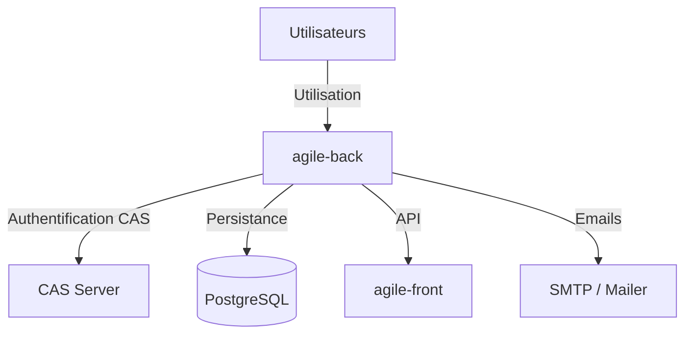
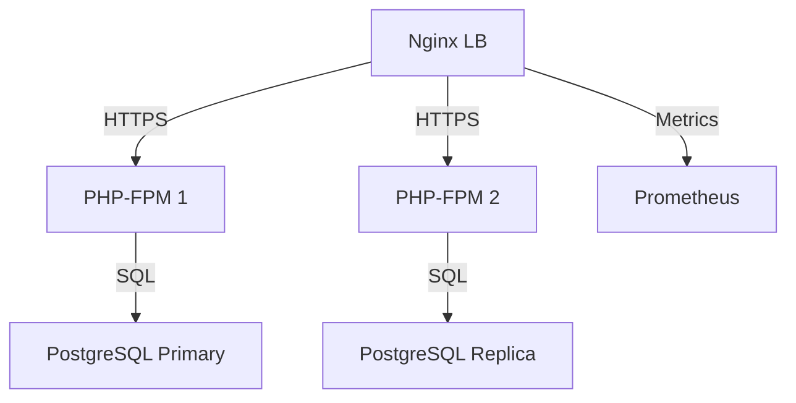

# Dossier d’Architecture Technique – **agile‑back**  

[TOC]

---  

## 1️⃣ Introduction et objectifs <a id="introduction-et-objectifs"></a>

**Vue d’ensemble fonctionnelle**  
*agile‑back* est le **back‑office** de l’application *Agile* ; il permet la création, la modification et la consultation d’études, de financements, de dotations, de groupes, etc. Les données sont stockées dans une base PostgreSQL et exposées via une API REST (API Platform) et une interface web (Twig).  



### Objectifs de qualité (orientés utilisateur)

| # | Objectif | Raison métier |
|---|----------|---------------|
| 1️⃣ | **Performance** – temps de réponse < 2 s pour les écrans de saisie | Fluidité de la saisie d’études |
| 2️⃣ | **Sécurité** – authentification forte via CAS, chiffrement des sauvegardes | Protection des données sensibles (budget, contacts) |
| 3️⃣ | **Maintenabilité** – architecture MVC + Doctrine, tests unitaires | Faciliter l’évolution fonctionnelle |
| 4️⃣ | **Disponibilité** – 99,5 % de disponibilité mensuelle | Garantir l’accès aux équipes opérationnelles |
| 5️⃣ | **Traçabilité** – journalisation des actions utilisateurs | Audits et conformité réglementaire |

↩︎ Retour au [sommaire](#toc)

---  

## 2️⃣ Parties prenantes <a id="parties-prenantes"></a>

| Rôle | Attente principale |
|------|--------------------|
| **MOA (Maître d’Ouvrage)** – équipe projet Agile | Respect du périmètre fonctionnel et des délais |
| **Développeurs back‑end** | Code lisible, tests automatisés, CI/CD fiable |
| **Administrateurs système / Ops** | Déploiement simple, monitoring et sauvegardes automatisées |
| **RSSI (Responsable Sécurité des Systèmes d’Information)** | Conformité aux exigences D‑I‑C‑T, gestion des vulnérabilités |
| **Utilisateurs métiers (agents, analystes)** | Interface claire, validation rapide des études |
| **Équipe front‑end (Agile‑front)** | API stable, contrats de données clairement définis |
| **Fournisseur de service de messagerie** | Envoi fiable des notifications par email |
| **Fournisseur d’authentification CAS** | Disponibilité du service d’authentification |

↩︎ Retour au [sommaire](#toc)

---  

## 3️⃣ Contraintes <a id="contraintes"></a>

### Contraintes techniques
| Domaine | Détail |
|--------|--------|
| **Langage / Framework** | PHP 8, Symfony 5 (ou 6) – respect du cycle de vie Symfony |
| **Base de données** | PostgreSQL 13, schéma « public », contraintes d’intégrité via Doctrine |
| **Authentification** | CAS (phpCAS), session PHP, besoin d’un serveur CAS externe |
| **Messagerie** | Symfony Mailer, DSN configurable (`MAILER_DSN`) |
| **Conteneurisation** | Possibilité de déployer avec Docker (Nginx + PHP‑FPM) |
| **CI/CD** | GitLab CI, pipelines de test, lint et déploiement automatisé |
| **Cache** | Doctrine result & system cache (Redis ou filesystem) |

### Contraintes organisationnelles
| Domaine | Détail |
|--------|--------|
| **Déploiement** | Environnements Dev, Recette, Production sur le cloud interne ECO4 (OpenStack) |
| **Gestion de versions** | GitLab – tagging sémantique, branches `feature/*`, `release/*` |
| **Documentation** | Markdown, PlantUML/Mermaid compatibles VS Code & Obsidian |

### Contraintes réglementaires / D‑I‑C‑T
| Aspect | Exigence |
|--------|----------|
| **Disponibilité** | 99,5 % mensuel, redondance Nginx + PHP‑FPM |
| **Intégrité** | Transactions Doctrine, contraintes DB, validation Symfony |
| **Confidentialité** | Chiffrement des sauvegardes (AES‑256), connexion HTTPS obligatoire |
| **Traçabilité** | Logs Monolog (niveau `info` en prod, `debug` en dev), journalisation des actions critiques (création/édition d’études) |

↩︎ Retour au [sommaire](#toc)

---  

## 4️⃣ Contexte et périmètre <a id="contexte-perimetre"></a>

### Partenaires fonctionnels
| Système / acteur | Interaction |
|------------------|-------------|
| **agile‑front** (UI React/Angular) | Consomme l’API REST (`/api`) pour afficher et modifier les études |
| **CAS Server** (ex. CAS‑v1.3.5) | Authentifie les utilisateurs via le protocole CAS |
| **SMTP / Mailer** | Envoie des notifications (création/modification d’études) |
| **Gestionnaire de sauvegarde** | Exécute les scripts de dump et de chiffrement |
| **Supervision GTI** (Portainer, Prometheus, Grafana) | Collecte métriques et alerts |

### Interfaces techniques
| Interface | Protocole | Fréquence | Type de données |
|-----------|-----------|-----------|-----------------|
| API REST (agile‑back ↔ agile‑front) | HTTP/HTTPS (JSON) | On‑demand | Entités : Etudes, Financements, Dotations… |
| Authentification CAS | HTTPS (CAS tickets) | On‑demand | Ticket, attributs utilisateur |
| Base de données | PostgreSQL (SQL) | Transactionnelle | Tables : `etudes`, `financements`, `users`, … |
| Mailer | SMTP | Asynchrone (queue) | Emails texte/HTML |
| Supervision | HTTP (Prometheus) | Scraping chaque 15 s | Métriques système & applicatives |

↩︎ Retour au [sommaire](#toc)

---  

## 5️⃣ Stratégie de solution <a id="strategie-solution"></a>

### Décisions architecturales majeures
| Décision | Justification |
|----------|----------------|
| **Monolithe Symfony** (MVC) | Simplicité de déploiement, réutilisation du même bundle (API Platform) |
| **API Platform** pour l’exposition REST | Standardisation, documentation OpenAPI intégrée |
| **Doctrine ORM** | Gestion des entités, migrations automatiques |
| **phpCAS** comme client CAS | Compatibilité avec l’infrastructure d’authentification existante |
| **Nginx + PHP‑FPM** en tant que reverse‑proxy | Performance, gestion de la charge |
| **Prometheus + Grafana** pour la supervision | Observabilité native des conteneurs |
| **Sauvegarde chiffrée AES‑256** | Conformité aux exigences de confidentialité |

### Environnement technologique
| Couche | Technologie |
|--------|--------------|
| **Front‑end** | agile‑front (non couvert ici) |
| **Web** | Nginx (load‑balanced, TLS termination) |
| **Application** | PHP 8, Symfony 5/6, API Platform, Twig |
| **Base de données** | PostgreSQL 13 |
| **Messagerie** | Symfony Mailer (SMTP) |
| **Cache** | Doctrine cache (Redis ou filesystem) |
| **CI/CD** | GitLab CI, Docker, PHPUnit, PHPStan, PHP_CodeSniffer |
| **Supervision** | Prometheus, Grafana, Loki, Portainer |
| **Sauvegarde** | Scripts `pg_dump`, chiffrement AES‑256, stockage objet (B3, Outscale, GCP) |

↩︎ Retour au [sommaire](#toc)

---  

## 6️⃣ Vue en Briques (C4 – Niveau 2) <a id="vue-en-briques"></a>

```mermaid
graph TD
    subgraph "Utilisateurs"
        U1[Agent] 
        U2[Analyste]
    end
    subgraph "Conteneurs"
        Nginx[Nginx (LB)]
        PHP[PHP‑FPM (Symfony app)]
        DB[(PostgreSQL)]
        Cache[Redis / Filesystem Cache]
        Mail[Mailer (SMTP)]
        CAS[CAS Client lib]
    end
    U1 -->|HTTPS| Nginx;
    U2 -->|HTTPS| Nginx;
    Nginx -->|FastCGI| PHP;
    PHP -->|Doctrine| DB;
    PHP -->|Cache| Cache;
    PHP -->|Mail| Mail;
    PHP -->|CAS| CAS
```

### Description des conteneurs principaux

| Conteneur | Rôle |
|-----------|------|
| **Nginx** | Reverse‑proxy, termination TLS, load‑balancing entre les workers PHP‑FPM |
| **PHP‑FPM (Symfony)** | Logique métier, contrôleurs, services, API Platform |
| **PostgreSQL** | Persistance des entités métier (Etudes, Financements, Utilisateurs, etc.) |
| **Cache** | Accélération des requêtes Doctrine (result‑set, metadata) |
| **Mailer** | Envoi d’emails de notification et de rapports |
| **CAS client** | Gestion du flux d’authentification CAS (ticket, validation) |

↩︎ Retour au [sommaire](#toc)

---  

## 7️⃣ Vue Exécution (Scénarios critiques) <a id="vue-execution"></a>

### 7.1 Authentification d’un utilisateur via CAS
```mermaid
sequencediagram;
    participant U as Utilisateur;
    participant B as navigateur;
    participant N as Nginx;
    participant A as agile‑back (PHP)
    participant C as CAS Server;
    U->>B: Accède à /login;
    B->>N: HTTPS GET /login;
    N->>A: Forward request;
    A->>C: Redirect CAS (ticket request)
    C->>U: Page de login CAS;
    U->>C: Saisie credentials;
    C->>C: Authentifie;
    C->>U: Retourne ticket;
    U->>B: Ticket dans URL;
    B->>N: HTTPS GET /login?ticket=...
    N->>A: Forward ticket;
    A->>C: Validation ticket;
    C->>A: Validation OK + attributs;
    A->>B: Session créée, redirection vers tableau de bord
```

### 7.2 Création d’une étude (use‑case métier)
```mermaid
sequencediagram;
    participant U as Agent;
    participant B as navigateur;
    participant N as Nginx;
    participant A as agile‑back;
    participant DB as PostgreSQL;
    U->>B: Ouvre formulaire “Nouvelle étude”
    B->>N: HTTPS GET /etudes/new;
    N->>A: Forward request;
    A->>A: Render Twig + formulaire Symfony;
    A->>B: Page HTML + JS;
    U->>B: Remplit le formulaire + submit;
    B->>N: HTTPS POST /etudes;
    N->>A: Forward POST;
    A->>A: Validation (Form, DTO, Entity)
    A->>DB: INSERT Etude, financement, dotations…
    DB-->>A: OK;
    A->>A: Envoie email de notification (Mailer)
    A->>B: Redirection vers page “Étude créée”
```

### 7.3 Export CSV des valorisations (tâche asynchrone)
```mermaid
sequencediagram;
    participant U as Analyste;
    participant B as navigateur;
    participant N as Nginx;
    participant A as agile‑back;
    participant S as Service Valorisation;
    participant DB as PostgreSQL;
    U->>B: Click “Export CSV”
    B->>N: HTTPS GET /valorisations/export;
    N->>A: Forward request;
    A->>S: Trigger ValorisationService.generateCsv()
    S->>DB: SELECT valorisations;
    DB-->>S: Data;
    S->>S: Build CSV, store temp file;
    S-->>A: CSV ready (path)
    A->>B: File download
```

↩︎ Retour au [sommaire](#toc)

---  

## 8️⃣ Vue Déploiement *(section standardisée)* <a id="vue-deploiement"></a>

### Environnements
| Environnement | Hébergement | Serveurs | Réseau | Particularités |
|---------------|-------------|----------|--------|----------------|
| **Développement** | Cloud interne ECO4 (OpenStack) | 1 × Nginx, 1 × PHP‑FPM, 1 × PostgreSQL (dev) | VLAN dev | Accès via VPN, logs en niveau `debug` |
| **Recette** | Cloud interne ECO4 (OpenStack) | 2 × Nginx (LB), 2 × PHP‑FPM, 1 × PostgreSQL (recette) | VLAN recette | Data anonymisées, tests d’intégration automatisés |
| **Production** | Cloud interne ECO4 (OpenStack) | 2 × Nginx (LB), 4 × PHP‑FPM, 2 × PostgreSQL (HA) | VLAN prod | TLS 1.3, sauvegardes chiffrées, monitoring complet |

### Infrastructure
Le produit est hébergé sur le cloud interne **ECO4** basé sur **OpenStack**, dans le tenant `pnm3` du département.  
Le reverse‑proxy **Nginx** du schéma ci‑dessous est en fait une paire de Nginx load‑balancés en frontal des produits hébergés sur le tenant.



### Supervision
Le produit est supervisé via le système standard du **GTI** pour ce faire :

- via **Portainer** pour la partie purement conteneurisée,
- via la stack **Prometheus / Grafana / Loki / AlertManager**,
- Le produit dispose également d’une supervision **PSIN**.

### Sauvegardes
Les sauvegardes de la base de données sont assurées par des scripts standards du GTI permettant la création de dumps cryptés en **AES‑256** et déposés sur :

- le stockage objet **B3** du IaaS ministériel,
- le stockage objet **Outscale SecNumCloud** (via la prestation qu’a le GTI sur le marché « Nuage Public »),
- le stockage objet standard de **Google Cloud** (via la prestation qu’a le GTI sur le marché « Nuage Public »).

↩︎ Retour au [sommaire](#toc)

---  

## 9️⃣ Sujets transverses <a id="sujets-transverses"></a>

| Thème | Implémentation dans *agile‑back* |
|-------|---------------------------------|
| **Authentification** | `phpCAS` (client CAS) – configuration dans `config/packages/security.yaml` |
| **Journalisation** | Monolog : handler `main` (file) en dev, `fingers_crossed` + `stderr` en prod |
| **Monitoring** | Exporter métriques Symfony (`symfony/mercure`), Prometheus‑Node‑Exporter, alertes sur latence > 2 s |
| **Gestion des erreurs** | Exceptions personnalisées (`App\Exception\*`), gestion via `EventListener` (`EtudesListener`) |
| **API** | API Platform – documentation OpenAPI auto‑générée, versionning via URL `/api` |
| **Sécurité des données** | Chiffrement des sauvegardes, connexion HTTPS obligatoire, CSP via Twig |
| **Internationalisation** | `translations/` (vide mais prêt), `locale` configurable |
| **CI/CD** | GitLab CI : `phpunit`, `phpstan`, `phpcs`, build Docker image, déploiement via Helm (option) |
| **Gestion des dépendances** | Composer (`composer.lock`), versionning stricte des bundles Symfony |

↩︎ Retour au [sommaire](#toc)

---  

## 🔟 Exigences de qualité <a id="exigences-qualite"></a>

| Exigence | Critère d’acceptation | Scénario de validation |
|----------|----------------------|------------------------|
| **Performance** | Temps de réponse < 2 s pour les pages de saisie (≤ 200 ms pour les appels API) | Test de charge `k6` sur `/etudes` avec 100 concurrents, mesurer le 95ᵉ percentile |
| **Sécurité** | Authentification CAS, protection CSRF, chiffrement TLS 1.3 | Scan OWASP ZAP, test d’injection SQL, validation du header `Strict‑Transport‑Security` |
| **Disponibilité** | Uptime ≥ 99,5 % (MTBF > 30 jours) | Vérification des métriques `up` Prometheus sur 30 jours, alerts désactivées |
| **Traçabilité** | Toutes les actions de création/modification sont loggées avec `user_id` | Requête sur les logs Monolog pour `action=CREATE_ETUDE`, vérifier présence du champ `user_id` |
| **Maintenabilité** | Couverture de tests unitaires ≥ 80 % | Rapport `phpunit --coverage-html`, inspection du pourcentage couvert |
| **Scalabilité** | Le système supporte le scaling horizontal du tier PHP‑FPM | Déploiement d’un nouveau pod PHP‑FPM, test de répartition de charge via Nginx LB |

↩︎ Retour au [sommaire](#toc)

---  

## 1️⃣1️⃣ Risques et dettes techniques <a id="risques-dettes"></a>

| Risque / Dette | Impact | Mesure corrective / atténuation |
|----------------|--------|--------------------------------|
| **Dépendance au serveur CAS** | Indisponibilité de l’authentification | Mise en place d’un serveur CAS secondaire en haute disponibilité, fallback sur authentification locale (dev uniquement) |
| **Architecture monolithique** | Difficulté à faire évoluer certaines parties (ex. API) | Étudier la migration partielle vers des micro‑services (ex. service d’export) via API‑Platform |
| **Tests fonctionnels limités** | Risque de régression lors de nouvelles fonctionnalités | Augmenter la couverture fonctionnelle avec Behat ou Symfony Panther |
| **Gestion des migrations Doctrine** | Risque de perte de données en prod | Procéder à des migrations versionnées et testées en recette, sauvegarde pré‑migration |
| **Performance du rendu Twig** | Rendu lent pour les pages lourdes | Cache du fragment Twig (``) et pré‑compilation des templates |
| **Sauvegardes non‑automatisées en dev** | Perte de données de test | Activer les scripts de dump automatisés même en dev (stockage local) |

↩︎ Retour au [sommaire](#toc)

---  

## 1️⃣2️⃣ Annexes <a id="annexes"></a>

### Glossaire
| Terme | Définition |
|-------|------------|
| **CAS** | Central Authentication Service – protocole d’authentification unique |
| **API Platform** | Framework Symfony permettant de créer rapidement des API REST/GraphQL |
| **Doctrine** | ORM (Object‑Relational Mapping) utilisé par Symfony |
| **Prometheus** | Système de collecte de métriques time‑series |
| **ADR** | Architecture Decision Record – décision documentée |
| **ECO4** | Cloud interne du ministère, basé sur OpenStack |
| **GTI** | Groupe Technique d’Infrastructure – responsable de la supervision et des sauvegardes |

### Décisions d’architecture (ADR) – Extraits
1. **ADR‑001 – Choix du framework** – Symfony retenu pour sa maturité, son écosystème et la présence d’API Platform.  
2. **ADR‑002 – Authentification** – Utilisation de phpCAS pour s’appuyer sur l’infrastructure d’authentification existante (CAS).  
3. **ADR‑003 – Persistance** – PostgreSQL choisi pour ses capacités ACID et son support natif avec Doctrine.  
4. **ADR‑004 – Monitoring** – Adoption de la stack Prometheus/Grafana/Loki, déjà standardisée par le GTI.  
5. **ADR‑005 – Sauvegarde** – Chiffrement AES‑256 des dumps, stockage multi‑site (B3, Outscale, GCP) pour répondre aux exigences de continuité.

↩︎ Retour au [sommaire](#toc)

---  

*Document généré conformément au modèle **arc42** et aux exigences du projet **agile‑back**. Aucun lien externe n’est utilisé ; le fichier est autonome et compatible avec les extensions VS Code/Obsidian (Markdown Preview Enhanced, PlantUML).*