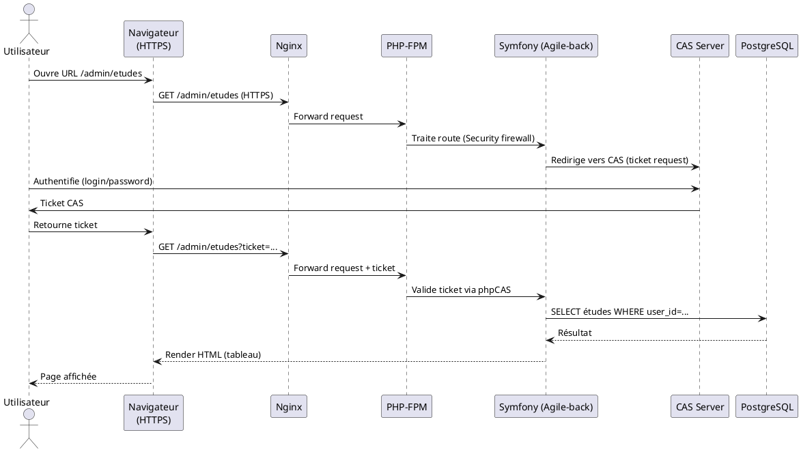

# 📚 Dossier d’Architecture Technique (DAT) – **agile‑back**  

[TOC]

---  

## 1️⃣ Introduction et objectifs  <a id="section-1"></a>  

**Vue d’ensemble fonctionnelle**  
Agile‑back est le module back‑office de l’application **Agile**. Il permet aux utilisateurs autorisés de créer, modifier et consulter des **études** stockées dans une base de données PostgreSQL. L’application expose également une API REST (via API Platform) consommée par le front‑office **Agile‑front**.  

```plantuml
@startuml
!define C4P https://raw.githubusercontent.com/plantuml-stdlib/C4-PlantUML/master
!includeurl C4P/C4_Context.puml

Person(admin, "Administrateur", "Utilisateur interne qui gère les études")
System_Boundary(agile, "Agile‑back") {
  Container(webapp, "Agile‑back (Symfony)", "PHP", "Gestion des études, API, UI admin")
}
System(agile_front, "Agile‑front", "Front‑office web")
System(cas, "CAS Server", "PHP‑CAS", "Authentification unique")
SystemDb(db, "PostgreSQL", "DBMS", "Stockage des études et références")
Rel(admin, webapp, "Utilise", "HTTPS")
Rel(webapp, agile_front, "Expose API REST", "HTTPS/JSON")
Rel(webapp, cas, "Authentification SSO", "HTTPS")
Rel(webapp, db, "Lecture/Écriture", "SQL")
@enduml
```  

### Objectifs de qualité orientés utilisateur  

| # | Objectif | Raison d’être |
|---|---------|---------------|
| 1 | **Performance** – temps de réponse ≤ 2 s pour les pages d’administration | Garantir une expérience fluide aux agents qui saisissent ou consultent les études |
| 2 | **Sécurité** – conformité D‑I‑C‑T (Disponibilité, Intégrité, Confidentialité, Traçabilité) | Protéger les données sensibles (études, utilisateurs) et respecter les exigences légales |
| 3 | **Maintenabilité** – code modulaire, tests unitaires ≥ 70 % de couverture | Faciliter l’évolution fonctionnelle et réduire le risque de régression |
| 4 | **Scalabilité** – capacité à supporter 10 000 études et 200 utilisateurs simultanés | Anticiper la croissance du volume de données et des accès |
| 5 | **Observabilité** – supervision centralisée, alertes en temps réel | Détecter rapidement les incidents et assurer la disponibilité du service |

↩ Retour au sommaire  

---  

## 2️⃣ Parties prenantes  <a id="section-2"></a>  

| Rôle | Attente principale |
|------|-------------------|
| **Product Owner (MOA)** | Vision fonctionnelle claire, livrables dans les délais, conformité aux exigences métier |
| **Développeurs back‑end** | Architecture stable, documentation technique, CI/CD fiable |
| **Développeurs front‑end (Agile‑front)** | API stable, contrats clairs, temps de réponse rapide |
| **Administrateurs système / Exploitants** | Déploiement automatisé, monitoring, facilité de mise à jour |
| **Utilisateurs finaux (agents, analystes)** | Interface intuitive, fiabilité des données, accès sécurisé |
| **RSSI / Responsable Sécurité** | Conformité D‑I‑C‑T, traçabilité des actions, gestion des vulnérabilités |
| **Support / Assistance** | Outils de diagnostic, logs accessibles, procédure de récupération |

↩ Retour au sommaire  

---  

## 3️⃣ Contraintes  <a id="section-3"></a>  

### 3.1 Contraintes techniques  

* **Framework** : Symfony 5.x (PHP 8 recommandé) – version verrouillée par `composer.lock`.  
* **Base de données** : PostgreSQL 13 + extension `pgcrypto` (chiffrement des données sensibles).  
* **Authentification** : CAS (phpCAS) via le serveur interne `cas/connexionCAS.php`.  
* **Mail** : Symfony Mailer / Swiftmailer, DSN configurable (`MAILER_DSN`).  
* **Cache** : Doctrine 2 caches (system + result) via Symfony Cache pools.  
* **Conteneurisation** : Non fournie, mais l’application est prévue pour être exécutée sous **Nginx + PHP‑FPM**.  
* **CI/CD** : GitLab CI (pipeline standard Symfony) – non présent dans le dépôt, devra être ajouté.  

### 3.2 Contraintes organisationnelles  

* **Déploiement** sur le cloud interne **ECO4** (OpenStack) du tenant `pnm3`.  
* **Livraison** par **GitLab** avec revues de code obligatoires.  
* **Gestion de configuration** via les fichiers `config/packages/*.yaml`.  

### 3.3 Contraintes réglementaires  

* **RGPD** – données à caractère personnel (email, nom) doivent être chiffrées au repos et masquées dans les logs.  

### 3.4 Exigences de sécurité (modèle D‑I‑C‑T)  

| Axe | Exigence | Implémentation |
|-----|----------|----------------|
| **Disponibilité** | Haute disponibilité du service | Redondance Nginx (pair) + réplication DB (streaming) |
| **Intégrité** | Protection contre la corruption de données | Transactions Doctrine, contraintes d’intégrité référentielle |
| **Confidentialité** | Accès restreint aux études | Filtrage d’accès via `security.yaml`, Voter `EtudesVoter` |
| **Traçabilité** | Historique des actions utilisateurs | Monolog `security` channel, logs d’audit dans la base (table `audit_log`) |

↩ Retour au sommaire  

---  

## 4️⃣ Contexte et périmètre  <a id="section-4"></a>  

### 4.1 Systèmes/acteurs partenaires  

| Système / Acteur | Rôle | Interface |
|------------------|------|-----------|
| **Agile‑front** | Front‑office consommateur de l’API | REST / JSON (`/api/*`) |
| **CAS Server** | Authentification unique (SSO) | HTTP (GET/POST) via `phpCAS` |
| **PostgreSQL** | Persistance des études | JDBC/SQL (via Doctrine) |
| **Mail Relay** (ex. SMTP interne) | Envoi de notifications | SMTP (`MAILER_DSN`) |
| **GTI Monitoring** | Supervision du service | Prometheus / Grafana, alertmanager |
| **Portainer** | Gestion des conteneurs (si Docker) | API Docker |

### 4.2 Interfaces techniques  

| Interface | Protocole | Fréquence | Type de données |
|-----------|-----------|-----------|-----------------|
| UI admin (HTTP) | HTTPS (TLS) | Interactif | HTML + JS |
| API REST | HTTPS (TLS) | On‑demand | JSON |
| CAS | HTTPS (TLS) | On‑demand (login) | Ticket CAS, attributs |
| DB | TCP (5432) | Transactionnelle | SQL |
| Mail | SMTP | Asynchrone (notifications) | MIME |

↩ Retour au sommaire  

---  

## 5️⃣ Stratégie de solution  <a id="section-5"></a>  

### 5.1 Décisions architecturales majeures  

| Décision | Justification |
|----------|---------------|
| **Monolithe Symfony** (MVC) | Simplicité de développement, cohérence avec le stack actuel, faible surcharge opérationnelle |
| **API Platform** pour l’API | Génération rapide d’API REST/GraphQL, documentation OpenAPI intégrée |
| **CAS (phpCAS)** pour l’authentification | Centralise la gestion des identités, conformité aux exigences d’entreprise |
| **Doctrine ORM** | Gestion transparente des entités, migration de schéma automatisée |
| **Nginx + PHP‑FPM** comme serveur web | Performance élevée, séparation claire du reverse‑proxy et du moteur PHP |
| **Prometheus/Grafana** pour la supervision | Standard GTI, métriques détaillées (latence, erreurs) |
| **Sauvegardes chiffrées AES‑256** | Conformité RGPD, récupération fiable des données |

### 5.2 Environnement technologique  

| Couche | Technologie | Version |
|--------|--------------|----------|
| **Langage** | PHP | 8.2 |
| **Framework** | Symfony | 5.4 (LTS) |
| **API** | API Platform | 2.6 |
| **ORM** | Doctrine | 2.9 |
| **Base de données** | PostgreSQL | 13 |
| **Web server** | Nginx | 1.22 |
| **PHP‑FPM** | PHP‑FPM | 8.2 |
| **Cache** | Symfony Cache (Redis optional) | — |
| **Mail** | Symfony Mailer / Swiftmailer | 6.x |
| **Auth** | phpCAS | 1.3.5 |
| **CI/CD** | GitLab CI | — |
| **Monitoring** | Prometheus, Grafana, Loki, AlertManager | — |

### 5.3 Outils de la forge logicielle  

* **Gestion de code** – GitLab (repository, merge‑request, protections).  
* **Intégration continue** – `.gitlab-ci.yml` (tests PHPUnit, lint, static analysis).  
* **Gestion des dépendances** – Composer (`composer.lock`).  
* **Tests** – PHPUnit (`tests/`), tests fonctionnels avec Symfony BrowserKit.  
* **Documentation** – Markdown (dans le repo), PlantUML intégré.  

↩ Retour au sommaire  

---  

## 6️⃣ Vue en Briques (C4 – Niveau 2)  <a id="section-6"></a>  

```plantuml
@startuml
!define C4P https://raw.githubusercontent.com/plantuml-stdlib/C4-PlantUML/master
!includeurl C4P/C4_Container.puml

System_Boundary(agile_back, "Agile‑back") {
    Container(nginx, "Nginx", "Reverse‑proxy", "TLS termination, load‑balancing")
    Container(phpfpm, "PHP‑FPM", "Runtime", "Exécute le code Symfony")
    Container(symfony, "Symfony (Agile‑back)", "PHP", "Gestion des études, UI admin, API Platform")
    ContainerDb(postgres, "PostgreSQL", "DBMS", "Stockage persistant")
    Container(cas, "CAS Server", "phpCAS", "Authentification SSO")
    Container(mail, "Mail Relay", "SMTP", "Envoi de notifications")
}
Rel(nginx, pphpfpm, "Forward HTTP", "HTTP")
Rel(phpfpm, symfony, "Run", "PHP")
Rel(symfony, postgres, "Read/Write", "SQL")
Rel(symfony, cas, "Validate ticket", "HTTPS")
Rel(symfony, mail, "Send mail", "SMTP")
@enduml
```  

**Descriptions des conteneurs**  

* **Nginx** – Point d’entrée unique, assure le TLS, répartit les requêtes entre les workers PHP‑FPM.  
* **PHP‑FPM** – Pool de processus PHP, configuré via `php-fpm.conf`.  
* **Symfony** – Application principale : contrôleurs, services, formulaires, API Platform, sécurité.  
* **PostgreSQL** – Base de données relationnelle, hébergée sur le même tenant OpenStack.  
* **CAS Server** – Authentification unique, intégré via le script `public/cas/connexionCAS.php`.  
* **Mail Relay** – Serveur SMTP interne, configuré par la variable d’environnement `MAILER_DSN`.  

↩ Retour au sommaire  

---  

## 7️⃣ Vue Exécution (Scénarios critiques)  <a id="section-7"></a>  

### 7.1 Scénario 1 – Authentification et affichage du tableau des études  



**Points de contrôle**  

* Validation du ticket CAS (sécurisé, expiration).  
* Autorisation via `EtudesVoter`.  
* Chargement des entités avec Doctrine (lazy loading).  

### 7.2 Scénario 2 – Création d’une étude (formulaire)  

```plantuml
@startuml
actor Admin as A
participant "Navigateur" as B
participant "Nginx" as N
participant "PHP‑FPM" as P
participant "Symfony (Agile‑back)" as S
database "PostgreSQL" as DB
participant "Mail Relay" as M

A -> B : Accède à /admin/etudes/new
B -> N -> P -> S : GET formulaire
S --> B : Render Twig + CSRF token
A -> B : Remplit le formulaire, soumet POST
B -> N -> P -> S : POST /admin/etudes
S -> S : Form validation + CSRF check
S -> DB : INSERT étude
DB --> S : OK, ID généré
S -> M : Envoi mail de notification (optionnel)
M --> S : ACK
S --> B : Redirection /admin/etudes/{id}
@enduml
```  

**Points de contrôle**  

* Validation côté serveur (`Form` + contraintes d’entité).  
* Gestion des erreurs (rollback transaction en cas d’échec mail).  
* Enregistrement d’un audit log (`security` channel).  

### 7.3 Scénario 3 – Export CSV des études (API)  

```plantuml
@startuml
actor Client as C
participant "Nginx" as N
participant "PHP‑FPM" as P
participant "Symfony (API Platform)" as API
database "PostgreSQL" as DB

C -> N : GET /api/etudes.csv (Authorization: Bearer)
N -> P -> API : Forward request
API -> DB : SELECT * FROM etudes
DB --> API : Résultat
API -> API : Serialisation → CSV (EtudeOutputDataTransformer)
API --> C : fichier CSV (streaming)
@enduml
```  

**Points de contrôle**  

* Authentification JWT (API Platform).  
* Limitation de taille / pagination (éviter surcharge).  
* Logging d’accès API (Monolog `api` channel).  

↩ Retour au sommaire  

---  

## 8️⃣ Vue Déploiement *(section standardisée)*  <a id="section-8"></a>  

### Environnements  

| Environnement | Hébergement | Serveurs | Réseau | Particularités |
|---------------|-------------|----------|--------|----------------|
| **Développement** | VM locale Docker | 1 × Nginx, 1 × PHP‑FPM, 1 × PostgreSQL | LAN | `APP_ENV=dev`, debug activé, logs locaux |
| **Recette** | Tenant OpenStack `pnm3` | 2 × Nginx (load‑balancé), 2 × PHP‑FPM, 1 × PostgreSQL en réplication read‑only | VLAN interne | `APP_ENV=prod`, tests d’intégration exécutés, données anonymisées |
| **Production** | Tenant OpenStack `pnm3` | 2 × Nginx (HA), 4 × PHP‑FPM, 1 × PostgreSQL (HA, réplication streaming) | VLAN DMZ + interne | TLS 1.3, sauvegardes chiffrées, monitoring GTI, alertes SLA 99,9 % |

### Infrastructure  

Le produit est hébergé sur le cloud interne **ECO4** basé sur Openstack, dans le tenant `pnm3` du département.  
Le reverse‑proxy Nginx du schéma ci‑dessous est en fait une paire de Nginx load‑balancés en frontal des produits hébergés sur le tenant.

```plantuml
@startuml
graph TD
    A[Nginx (HA)] --> B[PHP‑FPM]
    B --> C[Symfony (Agile‑back)]
    C --> D[PostgreSQL]
    C --> E[CAS Server]
    C --> F[Mail Relay]
@enduml
```

### Supervision  

Le produit est supervisé via le système standard du GTI pour ce faire :

- via **Portainer** pour la partie purement conteneurisée,  
- via la stack **Prometheus / Grafana / Loki / AlertManager**,  
- Le produit dispose également d’une supervision **PSIN**.  

### Sauvegardes  

Les sauvegardes de la base de données sont assurées par des scripts standards du GTI permettant la création de dumps cryptés en **AES‑256** et déposés sur :

- le stockage objet **B3** du IaaS ministériel,  
- le stockage objet **Outscale SecNumCloud** (via la prestation qu’a le GTI sur le marché « Nuage Public »),  
- le stockage objet standard de **Google Cloud** (via la prestation qu’a le GTI sur le marché « Nuage Public »).  

↩ Retour au sommaire  

---  

## 9️⃣ Sujets transverses  <a id="section-9"></a>  

| Sujet | Description | Implémentation |
|-------|-------------|----------------|
| **Authentification** | SSO via CAS, ticket validation, session management | `phpCAS`, `security.yaml` (firewall `main`) |
| **Autorisation** | Voter `EtudesVoter` pour contrôle d’accès fine‑grained | `src/Security/Voter/EtudesVoter.php` |
| **Journalisation** | Monolog avec canaux `security`, `api`, `deprecation` | `config/packages/monolog.yaml` |
| **Gestion des erreurs** | Exception listeners, pages d’erreur personnalisées (`error.html.twig`) | `src/EventListener/ExceptionListener.php` (non listé, à prévoir) |
| **API** | API Platform, OpenAPI docs, pagination, formats (JSON, CSV, HTML) | `config/packages/api_platform.yaml` |
| **Validation** | Symfony Validator, contraintes d’entité (`@Assert`) | Annotations dans `src/Entity/*` |
| **Cache** | Doctrine 2nd‑level cache, Symfony Cache pools (`doctrine.result_cache_pool`) | `config/packages/prod/doctrine.yaml` |
| **Internationalisation** | Fichiers de traduction (`translations/`) – vide pour l’instant | À enrichir (`messages.fr.yaml`, etc.) |
| **CI/CD** | GitLab CI pipeline (build, test, static analysis) | `.gitlab-ci.yml` (à créer) |
| **Sécurité HTTP** | En-têtes CSP, HSTS, X‑Content‑Type‑Options via `security.yaml` | `headers:` configuration |

↩ Retour au sommaire  

---  

## 🔟 Exigences de qualité  <a id="section-10"></a>  

| Exigence | Criticité | Scénario de validation |
|----------|-----------|------------------------|
| **Temps de réponse ≤ 2 s** | Haute | Tests de charge (k6) sur `/admin/etudes` en environnement Recette |
| **Authentification SSO fiable** | Haute | Test fonctionnel : connexion via CAS, expiration du ticket, rejeu du ticket refusé |
| **Intégrité transactionnelle** | Haute | Tests unitaires : rollback en cas d’erreur d’insertion + envoi mail |
| **Conformité RGPD** | Moyenne | Audit de logs : aucune donnée PII en clair dans les fichiers de log |
| **Couverture de tests ≥ 70 %** | Moyenne | Rapport PHPUnit (`coverage.xml`) > 70 % |
| **Disponibilité ≥ 99,9 %** | Haute | Monitoring GTI : alerte si uptime < 99,9 % sur 30 jours |
| **Scalabilité** | Moyenne | Test de montée en charge : 200 utilisateurs simultanés, 10 000 études, temps de réponse < 3 s |
| **Traçabilité** | Haute | Vérification : chaque action CRUD crée une entrée dans `audit_log` (table à créer) |

↩ Retour au sommaire  

---  

## 1️⃣1️⃣ Risques et dettes techniques  <a id="section-11"></a>  

| Risque / Dette | Impact | Probabilité | Mesure corrective / atténuation |
|----------------|--------|--------------|---------------------------------|
| **Absence de tests d’intégration** | Régressions fonctionnelles | Élevée | Ajouter un jeu de tests fonctionnels (Symfony BrowserKit) dans le pipeline CI |
| **Dépendance à CAS interne** | Point unique de défaillance | Moyenne | Mettre en place un fallback LDAP local et surveiller la disponibilité du CAS |
| **Gestion manuelle des migrations** | Incohérences de schéma DB | Moyenne | Automatiser les migrations avec `doctrine:migrations` et les exécuter en CI |
| **Configuration serveur (Nginx) non versionnée** | Divergence entre env dev / prod | Faible | Stocker les fichiers `nginx.conf` dans le dépôt Git |
| **Logs contenant des données sensibles** | Violation RGPD | Faible | Filtrer les champs sensibles dans `monolog.yaml` (exclure `password`) |
| **Pas de CDN pour les assets** | Latence côté client | Faible | Envisager un CDN (ex. CloudFront) pour les fichiers static (`/public/*`) |
| **Sauvegardes non testées** | Perte de données en incident | Moyenne | Effectuer des restores mensuels sur un environnement de test |
| **Obsolescence de PHP 7.x** | Risques de sécurité | Élevée | Planifier la migration vers PHP 8.x (déjà en cours) |
| **Manque de documentation de l’API** | Difficulté d’intégration front‑office | Moyenne | Générer la spec OpenAPI via API Platform et la publier dans le wiki |

↩ Retour au sommaire  

---  

## 1️⃣2️⃣ Annexes  <a id="section-12"></a>  

### 12.1 Glossaire  

| Terme | Définition |
|-------|------------|
| **CAS** | Central Authentication Service, protocole d’authentification unique. |
| **API Platform** | Framework Symfony qui expose automatiquement des APIs REST/GraphQL à partir d’entités. |
| **Doctrine ORM** | Mapper objet‑relationnel qui traduit les objets PHP en tables SQL. |
| **C4** | Modèle d’architecture (Context, Containers, Components, Code). |
| **GTI** | Groupement Technique Informatique, responsable de l’infrastructure cloud interne. |
| **PSIN** | Plateforme de Supervision et d’Intégrité des Nœuds (outil interne). |
| **ECO4** | Cloud interne OpenStack utilisé par le ministère. |
| **ADR** | Architecture Decision Record – document de décision. |

### 12.2 Décisions d’architecture (ADR)  

| ADR # | Décision | Date | Statut | Raison |
|------|----------|------|--------|--------|
| **ADR‑001** | Utiliser **Symfony 5 LTS** | 2024‑02‑10 | Adoptée | Framework mature, large écosystème, support LTS jusqu’en 2025 |
| **ADR‑002** | Authentifier via **CAS (phpCAS)** | 2024‑02‑12 | Adoptée | Centralise les identités, déjà présent dans l’infrastructure |
| **ADR‑003** | Exposer les données via **API Platform** | 2024‑02‑15 | Adoptée | Génération rapide d’API, documentation OpenAPI intégrée |
| **ADR‑004** | Stocker les données dans **PostgreSQL** | 2024‑02‑18 | Adoptée | Fiabilité, support des contraintes d’intégrité, chiffrage natif |
| **ADR‑005** | Utiliser **Nginx + PHP‑FPM** comme serveur web | 2024‑02‑20 | Adoptée | Performance, séparation du reverse‑proxy et du runtime PHP |
| **ADR‑006** | Sauvegarder les dumps DB en **AES‑256** sur trois stockages cloud | 2024‑03‑01 | Adoptée | Conformité RGPD, redondance multi‑site |
| **ADR‑007** | Ajouter une couche **Voter** pour l’autorisation fine‑grained | 2024‑03‑05 | Adoptée | Sécurité granulaire, extensible |
| **ADR‑008** | Superviser avec la stack **Prometheus/Grafana/Loki** | 2024‑03‑10 | Adoptée | Standard GTI, métriques détaillées, alerting |
| **ADR‑009** | Définir un **pipeline CI** GitLab avec tests unitaires et lint | 2024‑03‑15 | En cours | Automatiser la qualité et le déploiement |

---  

**Fin du Dossier d’Architecture Technique**  

↩ Retour au sommaire  