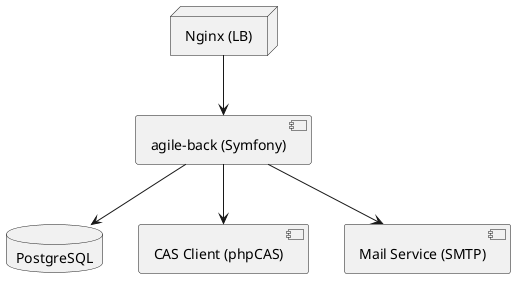

# 📄 Dossier d’Architecture Technique (DAT) – **agile‑back**  

[TOC]

---

## 1️⃣ Introduction et objectifs  

### 1.1 Vue d’ensemble fonctionnelle  
**agile‑back** est le *back‑office* de l’application **Agile**.  
Il permet aux utilisateurs administratifs de :

* créer, modifier et supprimer des **études** (et leurs métadonnées) ;  
* gérer les **abonnements**, **dotations**, **financements**, **groupes**, **profils** et **services** ;  
* exporter les données au format CSV/ODS ;  
* notifier les acteurs par email ;  
* interagir avec le **front‑office** (**agile‑front**) via une API REST (API‑Platform).  

Les données sont stockées dans une base **PostgreSQL** et l’accès est protégé par le **CAS** (single‑sign‑on).  

### 1.2 Diagramme C4 – Niveau 1 (System Context)  

```mermaid
graph TD
    %% Actors;
    User[Utilisateur (admin)] -->|Navigue| Front[Agile‑front (UI Web)]
    User -->|Accès via CAS| CAS[CAS SSO]

    %% System;
    Front -->|Appels API| Back[agile‑back (Symfony)]
    Back -->|Lecture/Écriture| DB[(PostgreSQL)]

    Back -->|Envoi mail| Mail[Service Mail (SMTP)]

    %% External services;
    CAS -->|Authentification| Back;
    Back -->|Export| Export[Export Service (CSV/ODS)]

    style User fill:#f9f,stroke:#333,stroke-width_2px;
    style Front fill:#bbf,stroke:#333,stroke-width_2px;
    style Back fill:#bfb,stroke:#333,stroke-width_2px;
    style DB fill:#ffb,stroke:#333,stroke-width_2px;
    style CAS fill:#ffd,stroke:#333,stroke-width_2px;
    style Mail fill:#ffd,stroke:#333,stroke-width_2px;
    style Export fill:#ffd,stroke:#333,stroke-width_2px
```

### 1.3 Objectifs de qualité orientés utilisateur  

| # | Objectif | Raison métier |
|---|----------|---------------|
| 1️⃣ | **Performance** – temps de réponse < 2 s pour les pages de saisie d’étude | Fluidité de la saisie, réduction du temps de travail |
| 2️⃣ | **Sécurité** – authentification CAS, chiffrement des sauvegardes, conformité GDPR | Protection des données sensibles (études, utilisateurs) |
| 3️⃣ | **Disponibilité** – 99,5 % de disponibilité mensuelle | Garantir l’accès continu aux équipes administratives |
| 4️⃣ | **Maintenabilité** – couverture de tests unitaires ≥ 80 % et documentation à jour | Faciliter l’évolution fonctionnelle et la correction de bugs |
| 5️⃣ | **Traçabilité** – journalisation exhaustive des actions critiques | Audits internes et exigences réglementaires |

↩ Retour au sommaire  

---

## 2️⃣ Parties prenantes  

| Rôle | Attente principale |
|------|--------------------|
| **Maitrise d’Ouvrage (MOA)** | Déploiement rapide de nouvelles fonctionnalités métier |
| **Product Owner** | Priorisation claire, visibilité sur la roadmap |
| **Développeurs** | Architecture claire, code testable, CI/CD fiable |
| **Testeurs / QA** | Environnements de test reproductibles, rapports de couverture |
| **Ops / Administrateur système** | Déploiement automatisé, supervision simple, sauvegardes fiables |
| **RSSI / Responsable Sécurité** | Conformité aux exigences D‑I‑C‑T, gestion des accès |
| **Utilisateurs finaux (administrateurs Agiles)** | Interface ergonomique, réactivité, fiabilité des exports |

> **Note** : aucun fichier de contacts n’a été fourni, la section **Contacts** n’est donc pas ajoutée.  

↩ Retour au sommaire  

---

## 3️⃣ Contraintes  

### 3.1 Techniques  

| Contrainte | Détails |
|------------|--------|
| **Langage / Framework** | PHP 8.x, Symfony 5.4 (ou 6.x) – version maintenue par l’équipe |
| **Base de données** | PostgreSQL 13+ – requêtes via Doctrine ORM |
| **Authentification** | CAS v1.3.5 (client PHP‑CAS) – SSO unique |
| **Serveur web** | Nginx (reverse‑proxy) + PHP‑FPM |
| **Messagerie** | Swiftmailer / Symfony Mailer (SMTP) |
| **Export** | Génération CSV/ODS via `ExportUtil.php` |
| **Conteneurisation** (optionnel) | Docker‑Compose possible mais non imposé |
| **Gestion de configuration** | `.env` + `config/packages/*.yaml` (environnements dev / prod / test) |

### 3.2 Organisationnelles  

* Processus de **revue de code** obligatoire (Pull‑Request).  
* **Livraison continue** via GitLab CI (pipeline `build → test → deploy`).  
* **Gestion des tickets** via GitLab Issues.  

### 3.3 Réglementaires  

* **RGPD** – anonymisation des données personnelles lors d’exports, consentement explicite.  
* **D‑I‑C‑T** (Disponibilité, Intégrité, Confidentialité, Traçabilité) – détaillé en § 4.  

↩ Retour au sommaire  

---

## 4️⃣ Contexte et périmètre  

### 4.1 Partenaires fonctionnels  

| Partenaire | Type d’interaction |
|-----------|--------------------|
| **Agile‑front** | Consommation de l’API REST (`/api/*`) – affichage UI. |
| **CAS** | Authentification SSO, validation du ticket, récupération des attributs utilisateur. |
| **Service de mail** | Envoi de notifications (création/modification d’études). |
| **Export Service** | Génération de fichiers CSV/ODS à la demande. |
| **Direction/Direction régionale** | Consultation des rapports exportés. |

### 4.2 Interfaces techniques  

| Interface | Protocole | Fréquence | Données |
|-----------|-----------|-----------|---------|
| Front ↔ Back | HTTPS / JSON (API‑Platform) | On‑demand (pages UI) | Études, métadonnées, listes de référence |
| Back ↔ DB | TCP (PostgreSQL) | Continu | Entités Doctrine (Études, Financements, …) |
| Back ↔ CAS | HTTPS (Ticket Validation) | À chaque login | Ticket, attributs (email, groupe) |
| Back ↔ Mail | SMTP (TLS) | Asynchrone (notifications) | Sujet, corps, destinataire |
| Back ↔ Export | CLI / PHP (local) | À la demande | CSV/ODS files |  

↩ Retour au sommaire  

---

## 5️⃣ Stratégie de solution  

### 5.1 Décisions architecturales majeures  

| Décision | Justification |
|----------|---------------|
| **Monolithe Symfony** (conteneurs « Web », « API », « Mailer ») | Simplicité de déploiement, cohérence du codebase, moindre surcharge opérationnelle. |
| **Pattern CQRS léger** (Commandes → Services, Queries via Repository) | Séparer les écritures (Commandes) des lectures (Repository) pour faciliter la scalabilité future. |
| **Utilisation d’API‑Platform** pour l’exposition REST | Génération automatique de la documentation OpenAPI, sérialisation via DTO. |
| **Gestion des droits via Voter Symfony** | Contrôle fin granulaire (ex. `EtudesVoter`). |
| **Sauvegarde chiffrée AES‑256** (scripts GTI) | Conformité RGPD & exigences de confidentialité. |
| **Supervision via Prometheus/Grafana** (stack GTI) | Visibilité temps réel des métriques (latence, erreurs). |

### 5.2 Environnement technologique  

| Couche | Technologie | Version / Note |
|-------|--------------|----------------|
| **Langage** | PHP | 8.1+ |
| **Framework** | Symfony | 5.4 LTS (ou 6.x) |
| **API** | API‑Platform | 2.6 |
| **ORM** | Doctrine | 2.12 |
| **Base** | PostgreSQL | 13 |
| **Templates** | Twig | 3.x |
| **CSS/JS** | CSS3, jQuery 1.12, custom JS | – |
| **Authentification** | phpCAS (CAS v1.3.5) | – |
| **Mail** | Symfony Mailer / Swiftmailer | – |
| **Reverse‑proxy** | Nginx | 1.22 |
| **Conteneurisation** | Docker (optionnel) | – |
| **CI/CD** | GitLab CI | – |
| **Supervision** | Prometheus, Grafana, Loki, AlertManager | – |
| **Sauvegarde** | Scripts GTI (AES‑256) → B3, Outscale SecNumCloud, GCP | – |

### 5.3 Outils de la forge logicielle  

| Outil | Usage |
|-------|-------|
| **GitLab** | Gestion du code source, MR, CI/CD |
| **PHPUnit** | Tests unitaires & fonctionnels |
| **PHPStan / Psalm** | Analyse statique |
| **PHP CS Fixer** | Formatage du code |
| **Docker‑Compose** (facultatif) | Environnements de dev/test |
| **SonarQube** (optionnel) | Qualité du code |
| **GitLab‑Pages** | Documentation (README, ADR) |

↩ Retour au sommaire  

---

## 6️⃣ Vue en Briques (C4 – Niveau 2)  

```mermaid
graph TB
    subgraph Nginx;
        Nginx[NGINX (reverse‑proxy)]
    end
    subgraph PHP_FPM["PHP‑FPM (Symfony)"]
        App[agile‑back (Kernel)]
        API[API‑Platform (REST)]
        Mailer[Mailer Service]
        Voter[Security Voter]
        Export[Export Util]
        Cmd[Commandes (services)]
    end
    subgraph DB[PostgreSQL]
        DB[(DB)]
    end
    subgraph CAS["CAS Server"]
        CASsrv[CAS v1.3.5]
    end
    Nginx -->|HTTP/HTTPS| App;
    App -->|Doctrine ORM| DB;
    App -->|Mail| Mailer;
    App -->|API| API;
    App -->|Security| Voter;
    App -->|Export| Export;
    App -->|Commandes| Cmd;
    App -->|CAS Auth| CASsrv;
    classDef external fill:#ffd,stroke:#333,stroke-width_1px;
    class Nginx,App,DB,CASsrv external;
```

**Descriptions rapides**  

| Brique | Rôle |
|--------|------|
| **NGINX** | Point d’entrée unique, TLS termination, load‑balancing (2 instances en prod). |
| **PHP‑FPM (Symfony Kernel)** | Héberge le cœur métier, les contrôleurs, les services, la configuration. |
| **API‑Platform** | Génère automatiquement les endpoints `/api/*` et la documentation OpenAPI. |
| **Mailer Service** | Envoie les notifications (via SMTP). |
| **Security Voter** | Décide les droits d’accès au niveau des entités (`EtudesVoter`). |
| **Export Util** | Convertit les DTO en CSV/ODS. |
| **Commandes (services)** | Implémentent la logique métier (ex. `SiteUpdateAlertes`). |
| **PostgreSQL** | Persistance de toutes les entités métier. |
| **CAS Server** | Authentifie les utilisateurs, fournit le ticket et les attributs. |

↩ Retour au sommaire  

---

## 7️⃣ Vue Exécution (Scénarios critiques)  

### 7.1 Scénario 1 – Authentification SSO (CAS)  

```mermaid
sequencediagram;
    participant User as Utilisateur;
    participant UI as Navigateur;
    participant Front as agile‑front;
    participant Back as agile‑back;
    participant CAS as CAS Server;
    User->>UI: Accède à l’URL du back‑office;
    UI->>Front: Redirige vers /login (CAS)
    Front->>CAS: Redirection vers /cas/login?service=...
    CAS-->>User: Formulaire d’identification;
    User->>CAS: Soumet login / mdp;
    CAS->>CAS: Validation des credentials;
    CAS-->>Front: Ticket CAS (service‑ticket)
    Front->>Back: Envoie le ticket (via cookie / paramètre)
    Back->>CAS: Validation du ticket;
    CAS-->>Back: Attributs utilisateur (email, groupe)
    Back->>Back: Création / mise à jour du compte local;
    Back-->>UI: Session établie, redirection vers tableau de bord
```

**Points de contrôle**  

* Vérification du ticket via HTTPS.  
* Journalisation de la tentative (`security.login`).  

---

### 7.2 Scénario 2 – Création d’une **Étude**  

```mermaid
sequencediagram;
    participant Admin as Administrateur;
    participant UI as Navigateur;
    participant Back as agile‑back;
    participant DB as PostgreSQL;
    participant Mail as Service Mail;
    Admin->>UI: Ouvre le formulaire « Nouvelle Étude »
    UI->>Back: GET /etudes/new (HTML + JSON pour listes)
    Back->>DB: Lecture des listes de référence (Groupes, Thèmes…)
    DB-->>Back: Résultats;
    Back-->>UI: Formulaire rendu;
    Admin->>UI: Remplit le formulaire & soumet;
    UI->>Back: POST /etudes (payload JSON)
    Back->>Back: Validation du formulaire (DTO + Voter)
    Back->>DB: INSERT Étude + relations;
    DB-->>Back: Confirmation;
    Back->>Mail: Envoi notification création;
    Mail-->>Back: ACK;
    Back-->>UI: Redirection vers page détail + message succès
```

**Tests de validation**  

* **UC‑01** – Soumission valide → création en < 1 s.  
* **UC‑02** – Soumission invalide (champ manquant) → message d’erreur côté UI.  

---

### 7.3 Scénario 3 – Export d’un **Lot d’Études** (CSV)  

```mermaid
sequencediagram;
    participant Admin as Administrateur;
    participant UI as Navigateur;
    participant Back as agile‑back;
    participant Export as Export Util;
    participant DB as PostgreSQL;
    Admin->>UI: Clique « Exporter CSV » (liste d’études)
    UI->>Back: GET /exports?format=csv&ids=1,2,3;
    Back->>DB: SELECT études WHERE id IN (...)
    DB-->>Back: Jeux de données;
    Back->>Export: Génération CSV (stream)
    Export-->>Back: Flux CSV;
    Back-->>UI: Téléchargement du fichier CSV
```

**Points de contrôle**  

* Limite de taille (max 10 Mo) – sinon découpage en plusieurs fichiers.  
* Journalisation de l’export (`export.download`).  

↩ Retour au sommaire  

---

## 8️⃣ Vue Déploiement *(section standardisée)*  

### Environnements  

| Environnement | Hébergement | Serveurs | Réseau | Particularités |
|---------------|-------------|----------|--------|----------------|
| Développement | Serveur local / Docker‑Compose | 1 (NGINX + PHP‑FPM) | localhost | Variables `.env.dev`, debug activé |
| Recette | Cloud interne ECO4 (tenant `pnm3`) | 2 (load‑balanced) | VLAN interne | Tests fonctionnels, base de données de pré‑production |
| Production | Cloud interne ECO4 (tenant `pnm3`) | 2 (NGINX load‑balanced) + 2 PHP‑FPM | VLAN sécurisé, TLS 1.3 | Monitoring complet, sauvegardes chiffrées |

### Infrastructure  

Le produit est hébergé sur le cloud interne **ECO4** basé sur **OpenStack**, dans le tenant **`pnm3`** du département.  
Le reverse‑proxy **Nginx** du schéma ci‑dessous est en fait une paire de Nginx load‑balancés en frontal des produits hébergés sur le tenant.



### Supervision  

Le produit est supervisé via le système standard du **GTI** pour ce faire :

* via **Portainer** pour la partie purement conteneurisée,  
* via la stack **Prometheus/Grafana/Loki/AlertManager**,  
* le produit dispose également d’une supervision **PSIN**.

### Sauvegardes  

Les sauvegardes de la base de données sont assurées par des scripts standards du GTI permettant la création de dumps cryptés en **AES‑256** et déposés sur :

* le stockage objet **B3** du IaaS ministériel,  
* le stockage objet **Outscale SecNumCloud** (via la prestation qu’a le GTI sur le marché "Nuage Public"),  
* le stockage objet standard de **Google Cloud** (via la prestation qu’a le GTI sur le marché "Nuage Public").

↩ Retour au sommaire  

---

## 9️⃣ Sujets transverses  

| Sujet | Description | Implémentation |
|-------|-------------|----------------|
| **Authentification** | CAS SSO, ticket validation, création d’un compte local si absent. | `src/util/CasClient.php` (phpCAS wrapper). |
| **Autorisation** | Voter Symfony (`EtudesVoter`) + rôles (`ROLE_ADMIN`, `ROLE_USER`). | `src/Security/Voter/*`. |
| **Journalisation** | Monolog (handlers `main`, `console`), logs JSON en prod. | `config/packages/*/monolog.yaml`. |
| **Gestion des erreurs** | Exceptions custom (`AuthenticationException`, `OutOfSequenceException`). | `src/Exception/*`. |
| **API** | API‑Platform expose les entités via DTO, versionning (`/api/v1`). | `config/packages/api_platform.yaml`. |
| **Export** | `ExportUtil.php` → CSV/ODS, streaming. | `src/util/ExportUtil.php`. |
| **Sécurité des données** | Chiffrement des sauvegardes, HTTPS partout, CSP, HSTS. | Nginx config + GTI scripts. |
| **Monitoring** | Métriques HTTP (`request_duration_seconds`), logs, alertes. | Prometheus + Grafana dashboards. |
| **CI/CD** | GitLab CI pipeline : `build → test → security → deploy`. | `.gitlab-ci.yml` (non fourni). |
| **Internationalisation** | `translations/` (actuellement vide) – future i18n. | Symfony Translation component. |

↩ Retour au sommaire  

---

## 🔟 Exigences de qualité  

| Exigence | Critère | Scénario de validation |
|----------|---------|--------------------------|
| **Performance** | Temps moyen de réponse ≤ 2 s (pages de saisie) | Test de charge JMeter 100 utilisateurs simultanés → mesure des temps de réponse. |
| **Disponibilité** | ≥ 99,5 % mensuel | Monitoring Prometheus → alerte si `up{job="agile-back"} == 0` > 5 min. |
| **Sécurité – Confidentialité** | Données sensibles chiffrées au repos | Vérifier que les dumps sont AES‑256 (`openssl enc -d`). |
| **Intégrité** | Aucun enregistrement partiel après crash | Tests de récupération après arrêt brutal du container. |
| **Traçabilité** | Toutes les actions critiques logguées avec `user_id` | Requête SQL `SELECT * FROM monolog WHERE channel='security'`. |
| **Maintenabilité** | Couverture de tests unitaires ≥ 80 % | Rapport `phpunit --coverage-text`. |
| **Scalabilité** | Le système supporte le double du trafic actuel sans dégradation > 20 % | Test de scaling horizontal (2 × Nginx + PHP‑FPM). |

↩ Retour au sommaire  

---

## 1️⃣1️⃣ Risques et dettes techniques  

| Risque / Dette | Impact | Mesure corrective / atténuation |
|----------------|--------|----------------------------------|
| **Code legacy non‑testé** (ex. `src/util/EtudeUtil.php` > 20 kB) | Bugs en production, difficulté de refactor | Introduire des tests unitaires progressifs, plan de refactorisation. |
| **Dépendance à CAS v1.3.5** (maintenance incertaine) | Rupture d’authentification | Prévoir un wrapper abstrait et un plan de migration vers CAS 3.x ou OAuth2. |
| **Absence de Docker** en prod | Déploiement manuel → erreurs de configuration | Formaliser un `docker-compose.yml` et automatiser via GitLab CI. |
| **Scalabilité du monolithe** | Saturation sous forte charge | Étudier le découpage en micro‑services (ex. Service Export). |
| **Gestion des secrets** (SMTP credentials dans `.env`) | Fuite de données | Utiliser le secret manager d’OpenStack / HashiCorp Vault. |
| **Conformité RGPD** (données personnelles dans exports) | Sanctions légales | Masquer les champs PII dans les exports, ajouter consentement. |
| **Supervision limitée aux métriques basiques** | Détection tardive d’incidents | Enrichir les exporters Prometheus (transactions DB, file‑handles). |

↩ Retour au sommaire  

---

## 1️⃣2️⃣ Annexes  

### 12.1 Glossaire  

| Terme | Définition |
|-------|------------|
| **CAS** | Central Authentication Service – protocole SSO. |
| **DTO** | Data Transfer Object – structure de données utilisée pour l’API. |
| **Voter** | Composant Symfony décident les droits d’accès au niveau d’entité. |
| **API‑Platform** | Bibliothèque Symfony qui génère automatiquement des API REST/GraphQL. |
| **PSIN** | Plateforme de Supervision d’Infrastructure Nationale. |
| **GTI** | Groupe Technique Informatique (responsable des scripts de sauvegarde). |
| **C4** | Modèle d’architecture (Context, Containers, Components, Code). |
| **D‑I‑C‑T** | Disponibilité, Intégrité, Confidentialité, Traçabilité – exigences de sécurité. |

### 12.2 Décisions d’Architecture (ADR) – exemples  

| ADR # | Titre | Décision | Statut |
|-------|-------|----------|--------|
| ADR‑001 | Utiliser Symfony 5 LTS | Choix du framework principal pour sa maturité et son écosystème | ✅ Adoptée |
| ADR‑002 | Authentification via CAS | Centraliser les identités, éviter la gestion de mots de passe | ✅ Adoptée |
| ADR‑003 | Exposer l’API avec API‑Platform | Gain de productivité, documentation OpenAPI | ✅ Adoptée |
| ADR‑004 | Sauvegarde AES‑256 des dumps | Conformité RGPD et exigences de confidentialité | ✅ Adoptée |
| ADR‑005 | Monolithe vs Micro‑services | Démarrage en monolithe pour rapidité, évolution possible vers micro‑services | ✅ Adoptée (phase 1) |
| ADR‑006 | Supervision via Prometheus/Grafana | Alignement avec l’infrastructure GTI existante | ✅ Adoptée |

---

*Document généré le **28 avril 2026** – prêt à être intégré dans VS Code ou Obsidian (support Mermaid & PlantUML).*  