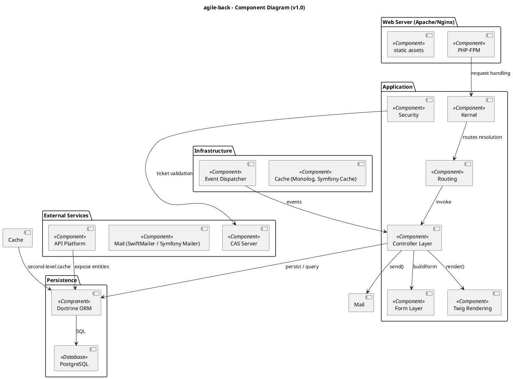
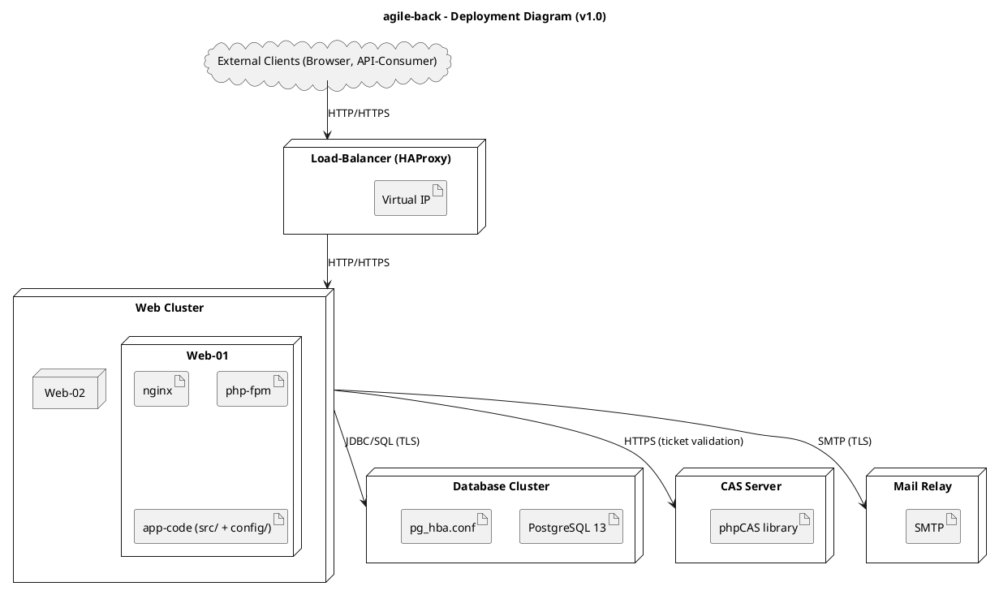
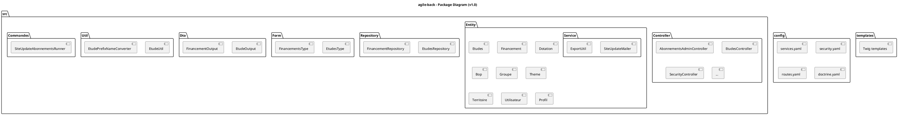
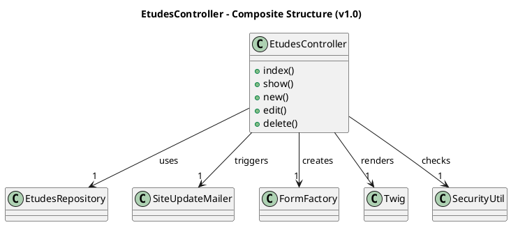
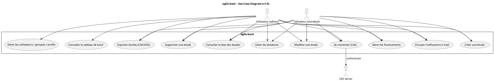
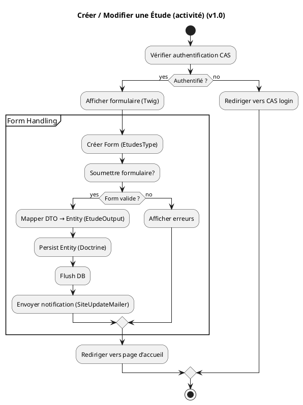
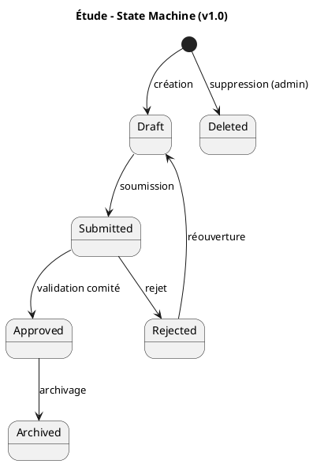
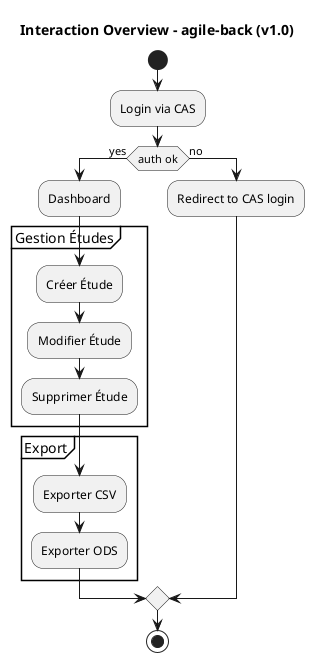

# 📁 Dossier d’Architecture Technique (DAT) – **agile‑back**  
*Projet Symfony 5 / PHP 8 – Back‑office de l’application Agile*  

> **Objectif** : fournir une vue complète et normalisée (ISO/IEC 19505) de l’architecture logicielle du module *agile‑back* afin de faciliter la compréhension, la maintenance et l’évolution du système.  

---  

## 1️⃣ Introduction architecturale  

| Élément | Description |
|--------|-------------|
| **Nom du projet** | **agile‑back** – partie back‑office de l’application Agile (gestion d’études, financements, dotations, …) |
| **Périmètre du DAT** | Tous les artefacts du répertoire `src/`, `config/`, `templates/`, `public/` ainsi que les dépendances externes (Symfony, Doctrine, API Platform, CAS, PostgreSQL, etc.). |
| **Documents sources** | - Arborescence du code (Document 1) <br> - Résumé du code (Document 2) <br> - `README.md` (description fonctionnelle) |
| **Vue d’ensemble des diagrammes UML** | <ul><li>**Structure** : Class, Component, Deployment, Package, (optionnel : Composite Structure, Object)</li><li>**Comportement** : Use‑Case, Activity, State‑Machine</li><li>**Interaction** : Sequence, Communication, (optionnel : Interaction Overview, Timing)</li></ul> |
| **Organisation du document** | 1️⃣ Intro – 2️⃣ Vue structurelle – 3️⃣ Vue comportementale – 4️⃣ Vue d’interaction – 5️⃣ Traçabilité – 6️⃣ Profils & stéréotypes – 7️⃣ Contraintes OCL – 8️⃣ Patterns – 9️⃣ Décisions – 🔟 Normes de modélisation |

---  

## 2️⃣ Vue Structurelle  

### 2.1️⃣ Diagramme de Classes (obligatoire)  

```plantuml
@startuml ClassDiagram
' Version du diagramme
!define VERSION "1.0"
title agile‑back – Class Diagram (v{VERSION})

' ==== Packages (high‑level) ====
package "Domain Model" {
    class Etudes {
        +int id
        +string titreEtude
        +string zoneGeographique
        +DateTime dateCreation
        +... 
        +addFinancement(Financement f)
        +addDotation(Dotation d)
    }
    class Financement {
        +int id
        +float montant
        +DateTime dateComite
        +string motifComite
    }
    class Dotation {
        +int id
        +int anneeDotation
        +float montantDotation
    }
    class Bop {
        +int id
        +string libelleBop
        +string sigle
        +bool visible
    }
    class Groupe {
        +int id
        +string token
        +string libelle
    }
    class Service {
        +int id
        +string service
        +string direction
        +bool visible
        +string region
    }
    class Theme {
        +int id
        +string theme
    }
    class Territoire {
        +int id
        +string territoire
    }
    class Utilisateur {
        +int id
        +string nom
        +string prenom
        +string email
        +Groupe groupe
    }
    class Profil {
        +int id
        +string libelle
    }

    Etudes "1" *-- "*" Financement : finance
    Etudes "1" *-- "*" Dotation   : dotation
    Etudes "1" *-- "1" Bop        : bop
    Etudes "1" *-- "1" Groupe     : groupe
    Etudes "1" *-- "1" Service    : service
    Etudes "1" *-- "1" Theme      : theme
    Etudes "1" *-- "1" Territoire : territoire
    Utilisateur "1" *-- "1" Groupe : appartient à
    Utilisateur "1" *-- "*" Profil  : possède
}

package "Application Layer" {
    class EtudesController {
        +index()
        +show(id)
        +new()
        +edit(id)
        +delete(id)
    }
    class BopController { … }
    class GroupeController { … }
    class ServiceController { … }
    class FinancementController { … }
    class DotationController { … }
    class UtilisateurController { … }

    EtudesController ..> Etudes : uses
    BopController ..> Bop
    ...
}

package "Infrastructure" {
    class DoctrineEntityManager
    class EtudesRepository
    class BopRepository
    class GroupeRepository
    class ServiceRepository
    class FinancementRepository
    class DotationRepository
    class UtilisateurRepository
    class ProfilRepository

    EtudesRepository ..|> DoctrineEntityManager : « uses »
    BopRepository ..|> DoctrineEntityManager
    ...
}

package "Services & Utilities" {
    class SiteUpdateAbonnements
    class SiteUpdateMailer
    class ExportUtil
    class EtudeUtil
    class EtudePrefixNameConverter
    class SecurityUtil
    class AddPaginationHeaders (EventSubscriber)

    EtudesController --> SiteUpdateMailer : « triggers »
    ExportUtil --> EtudesRepository : « reads »
    EtudeUtil --> Etudes : « helper »
}

' ==== Relationships ====
EtudesController --> EtudesRepository : « calls »
EtudesRepository --> DoctrineEntityManager
Etudes --> Financement : « composition »
Etudes --> Dotation : « composition »
Etudes --> Bop : « association »

@enduml
```

**Légende**  

| Symbole | Signification |
|---------|----------------|
| `+` (public) | Méthode ou attribut accessible depuis l’extérieur |
| `-` (private) | Attribut interne |
| `*` | Multiplicité (ex. `1..*`) |
| `..>` | Dépendance (utilisation) |
| `|>` | Héritage / spécialisation |
| « uses », « calls », « reads » | Stéréotype de relation métier |
| `Component` | Paquetage logique (Domain, Application, Infrastructure, Services) |

---  

### 2.2️⃣ Diagramme de **Composants** (obligatoire)  



**Légende**  

| Stéréotype | Description |
|-----------|-------------|
| `<<Component>>` | Unité déployable (bundle, service, framework) |
| `<<Database>>` | Système de persistance (PostgreSQL) |
| Flèches | Dépendances d’exécution (appel, requête) |

---  

### 2.3️⃣ Diagramme de **Déploiement** (obligatoire)  



**Légende**  

| Élément | Signification |
|--------|---------------|
| `node` | Machine ou VM |
| `artifact` | Artefact déployable (binaire, script, configuration) |
| `cloud` | Entité externe non‑gérée |
| Flèches | Flux de communication (protocole indiqué) |

---  

### 2.4️⃣ Diagramme d’**Objets** *(optionnel)*  

> **Exemple** : instantané d’une étude avec ses financements et dotations.  

```plantuml
@startuml ObjectDiagram
title Exemple d’Objet – Etude avec Financements/Dotations

object Etude#1 {
    id = 42
    titreEtude = "Plan de mobilité 2024"
    zoneGeographique = "Normandie"
}
object Financement#1 {
    id = 7
    montant = 150000
    dateComite = 2023‑12‑01
}
object Dotation#1 {
    id = 3
    anneeDotation = 2024
    montantDotation = 50000
}
Etude#1 "1" *-- "*" Financement#1
Etude#1 "1" *-- "*" Dotation#1
@enduml
```

---  

### 2.5️⃣ Diagramme de **Paquetages** (obligatoire)  



---  

### 2.6️⃣ Diagramme de **Structure Composite** *(optionnel)*  

> **Exemple** : structure interne d’un `EtudesController` (actions, services, repository).  



---  

## 3️⃣ Vue Comportementale  

### 3.1️⃣ Diagramme de **Cas d’Utilisation** (obligatoire)  



**Légende**  

| Stereotype | Signification |
|------------|---------------|
| `<<include>>` | Cas d’utilisation obligatoire (ex. création d’étude implique authentification) |
| `<<extend>>` | Optionnalité (ex. export peut être étendu à d’autres formats) |

---  

### 3.2️⃣ Diagramme d’**Activités** (fortement recommandé)  



---  

### 3.3️⃣ Diagramme d’**États** (obligatoire)  

> Cycle de vie d’une **Étude** (entity).  



---  

## 4️⃣ Vue d’**Interaction**  

### 4.1️⃣ Diagramme de **Séquence** (obligatoire) – *Création d’une Étude*  

```plantuml
@startuml SequenceDiagram
title Création d’une Étude (v1.0)

actor "Utilisateur (Web)" as UI
participant "Browser" as B
participant "Nginx" as NG
participant "PHP‑FPM" as PHP
participant "EtudesController" as C
participant "EtudesForm (EtudesType)" as F
participant "EtudesRepository" as R
participant "Doctrine ORM" as ORM
participant "PostgreSQL" as DB
participant "SiteUpdateMailer" as M
participant "CAS Server" as CAS

UI -> B : GET /etudes/new
B -> NG : HTTP request
NG -> PHP : forward request
PHP -> C : __invoke()
C -> F : createForm()
C -> UI : render Twig (form)
UI -> B : POST /etudes/new (form data)
B -> NG -> PHP -> C : handleRequest()
C -> F : isSubmitted() & isValid()
alt valid
    C -> R : persist(Etude)
    R -> ORM : persist()
    ORM -> DB : INSERT
    ORM --> R : managed Entity
    C -> M : sendNotification()
    M -> UI : e‑mail sent (async)
    C -> UI : redirect to /etudes
else invalid
    C -> UI : render form + errors
end
@enduml
```

#### Scénarios alternatifs  

| # | Description | Différence |
|---|-------------|------------|
| **A1** | *Échec d’authentification CAS* | Le contrôleur redirige vers `CAS login` avant toute action. |
| **A2** | *Violation de contrainte métier (ex. montant négatif)* | Le formulaire renvoie une erreur, le flux reste dans la branche *invalid*. |
| **A3** | *Erreur de persistance (DB down)* | `DoctrineException` → `ExceptionHandler` → page d’erreur 500. |
| **A4** | *Envoi d’e‑mail échoue* | `SiteUpdateMailer` lance une exception capturée, log via Monolog, l’utilisateur reçoit quand même le succès de la création. |

---  

### 4.2️⃣ Diagramme de **Communication** (fortement recommandé)  

```plantuml
@startuml CommunicationDiagram
title Communication – Création d’une Étude (v1.0)

object UI
object EtudesController
object EtudesForm
object EtudesRepository
object DoctrineORM
object PostgreSQL
object SiteUpdateMailer

UI -> EtudesController : request /etudes/new
activate EtudesController
EtudesController -> EtudesForm : createForm()
EtudesForm -> EtudesController : Form object
EtudesController -> EtudesForm : handleRequest()
EtudesForm -> EtudesController : isValid()
EtudesController -> EtudesRepository : persist()
EtudesRepository -> DoctrineORM : persist()
DoctrineORM -> PostgreSQL : INSERT
DoctrineORM --> EtudesRepository : managed entity
EtudesController -> SiteUpdateMailer : sendNotification()
activate SiteUpdateMailer
SiteUpdateMailer -> SMTP : send()
deactivate SiteUpdateMailer
EtudesController --> UI : redirect
deactivate EtudesController
@enduml
```

---  

### 4.3️⃣ Diagramme d’**Interaction Overview** *(optionnel)*  

> Vue d’ensemble des scénarios majeurs (login, création d’étude, export).  



---  

### 4.4️⃣ Diagramme de **Timing** *(optionnel)*  

> Chronologie du processus d’authentification CAS.  

```plantuml
@startuml TimingDiagram
title CAS Authentication Timing (v1.0)

clock "Client" as C
clock "App" as A
clock "CAS Server" as S

C -> A : HTTP request (protected URL)
A -> S : redirect to /login?service=...
S -> C : 302 + ticket
C -> A : ticket in query
A -> S : validateTicket(ticket)
S --> A : success / user attributes
A -> C : HTTP 200 (session created)
@enduml
```

---  

## 5️⃣ Correspondance (Traçabilité)  

| Élément métier | Classe | Use‑Case | Séquence | État | Composant | Déploiement |
|----------------|--------|----------|----------|------|-----------|-------------|
| **Étude** | `Etudes` (Entity) | UC2, UC3, UC4, UC5, UC6 | `CreateEtudeSeq`, `EditEtudeSeq` | `Draft`, `Submitted`, `Approved`, `Archived` | `Entity` → `Doctrine ORM` | `Web‑01/02` |
| **Financement** | `Financement` | UC8 | `CreateFinancementSeq` | – | `Entity` → `Doctrine ORM` | `DB` |
| **Dotation** | `Dotation` | UC7 | `CreateDotationSeq` | – | `Entity` → `Doctrine ORM` | `DB` |
| **Utilisateur** | `Utilisateur` | UC1, UC10 | `LoginSeq` | – | `Security` | `Web` |
| **Mail Notification** | `SiteUpdateMailer` | UC9 | `NotifySeq` | – | `Mail` | `Mail Relay` |
| **Export CSV/ODS** | `ExportUtil` | UC6 | `ExportSeq` | – | `Service` | `Web` |

---  

## 6️⃣ Profils & Stéréotypes UML  

| Stéréotype | Application dans le modèle |
|------------|-----------------------------|
| `<<entity>>` | Toutes les classes du package `Entity` (Etudes, Financement, …) |
| `<<controller>>` | Classes du package `Controller` (EtudesController, …) |
| `<<service>>` | Classes du package `Service` (SiteUpdateMailer, ExportUtil, …) |
| `<<repository>>` | Classes du package `Repository` (EtudesRepository, …) |
| `<<form>>` | Classes du package `Form` (EtudesType, …) |
| `<<dto>>` | Classes du package `Dto` (EtudeOutput, …) |
| `<<utility>>` | Classes du package `Util` (EtudeUtil, SecurityUtil, …) |
| `<<command>>` | Classes du package `Commandes` (SiteUpdateAbonnementsRunner, …) |
| `<<eventListener>>` | `EtudesListener` |
| `<<eventSubscriber>>` | `AddPaginationHeaders` |

---  

## 7️⃣ Contraintes & Règles **OCL**  

```ocl
-- 1. Un Etudes doit être lié à au moins un Bop
context Etudes
inv: self.bop <> null

-- 2. Le montant d’un Financement doit être strictement positif
context Financement
inv: self.montant > 0

-- 3. La date de décision (dateComite) d’un Financement doit être postérieure à la date de création de l’Étude
context Financement
inv: self.dateComite > self.etude.dateCreation

-- 4. Un Utilisateur ne peut appartenir qu’à un seul Groupe
context Utilisateur
inv: self.groupe->size() = 1

-- 5. Un Utilisateur possède au moins un Profil
context Utilisateur
inv: self.profils->size() >= 1

-- 6. L’export CSV ne doit pas contenir de champs vides
context ExportUtil
def: csvLine : Sequence(String) = self.generateCsv()
inv: csvLine->forAll(l | l <> '')

```

---  

## 8️⃣ Patterns de conception  

| Pattern | Où il apparaît | Justification |
|---------|----------------|--------------|
| **Repository** (Domain‑Driven Design) | `src/Repository/*Repository.php` | Séparation du modèle de persistance, abstraction de Doctrine. |
| **Factory (Form Builder)** | `Form/*Type.php` (Symfony Form) | Construction d’objets complexes (forms) via le FormFactory. |
| **Command** | `src/Commandes/*Runner.php` (Console commands) | Encapsulation d’opérations batch (mise à jour, envoi de mails). |
| **Observer** (Event Dispatcher) | `EventListener/EtudesListener.php`, `EventSubscriber/AddPaginationHeaders.php` | Réaction aux événements du kernel (e.g., `kernel.response`). |
| **Strategy** (Mail transport) | `services.yaml` → `mailer` configuration | Possibilité de changer le transport (SMTP, Sendmail, etc.) sans modifier le code. |
| **Adapter** (CAS client) | `public/cas/CAS_v135/*` | Interface entre le protocole CAS et l’application Symfony. |
| **Singleton** (Doctrine EntityManager) | `DoctrineEntityManager` (service) | Instance unique partagée à travers l’application. |
| **Template Method** (Twig rendering) | `Controller` → `render()` | Étapes communes de rendu, spécialisation par template. |

---  

## 9️⃣ Documentation des **Décisions** d’architecture  

| # | Décision | Alternatives envisagées | Impact |
|---|----------|------------------------|--------|
| **D1** | Utiliser **Symfony 5** + **API Platform** pour exposer les entités en API REST/GraphQL. | Symfony 4, Laravel, API‑first custom. | Permet génération automatique de CRUD, conformité OpenAPI, réutilisable par le front‑office. |
| **D2** | Authentification via **CAS** (phpCAS). | JWT, OAuth2, LDAP. | Centralise la gestion des comptes, compatible avec l’infrastructure existante (service d’authentification national). |
| **D3** | Persistance avec **PostgreSQL** + **Doctrine ORM**. | MySQL, NoSQL (MongoDB). | Transactions ACID, support des relations complexes, requêtes DQL. |
| **D4** | Séparer la **logique métier** (services) de la **logique de présentation** (controllers). | Tout dans les controllers. | Facilite le test unitaire, respect du principe SRP. |
| **D5** | Utiliser **Twig** comme moteur de templates côté serveur. | Blade, Mustache, React côté serveur. | Intégration native à Symfony, facilité de migration progressive vers un front‑SPA. |
| **D6** | Déployer sur **clusters HA** (load‑balancer + plusieurs web‑nodes). | Single‑server. | Haute disponibilité, scalabilité horizontale. |
| **D7** | Gestion des **notifications** via un service dédié `SiteUpdateMailer`. | Direct `mail()` dans le controller. | Découplage, possibilité de basculer vers une file de messages (RabbitMQ) à terme. |

---  

## 🔟 Normes de modélisation  

| Aspect | Règle appliquée |
|--------|-----------------|
| **Nommage** | PascalCase pour classes, camelCase pour attributs, UpperCamelCase pour stéréotypes. |
| **Layout** | Packages regroupés par couche (Domain, Application, Infrastructure). |
| **Niveau de détail** | Diagrammes de classes : attributs clés + associations majeures. <br> Diagrammes de séquence : flux principal + scénarios d’erreur. |
| **Versioning** | Chaque diagramme porte un `vX.Y` (ex. `v1.0`). |
| **Couleurs** | Non utilisées (conformité ISO 19505). |
| **Documentation** | Chaque diagramme possède une légende explicative et un tableau de traçabilité. |

---  

## 📚 Glossaire des éléments UML utilisés  

| Terme | Définition |
|-------|------------|
| **Actor** | Entité externe (utilisateur, système) qui interagit avec le système. |
| **Use‑Case** | Fonctionnalité observable du point de vue de l’acteur. |
| **Component** | Unité modulaire déployable (bundle, service). |
| **Node** | Ressource physique (serveur, VM). |
| **Artifact** | Produit de construction (code, configuration). |
| **Package** | Regroupement logique de classes. |
| **State Machine** | Modélisation du cycle de vie d’un objet. |
| **Sequence** | Interaction temporelle entre objets (lifelines). |
| **Communication** | Collaboration entre objets, numérotation des messages. |
| **OCL** | Object Constraint Language – langage déclaratif de contraintes. |
| **Stereotype** | Extension du méta‑modèle UML (ex. `<<entity>>`). |

---  

## 📌 Conclusion  

Le **DAT** ci‑dessus décrit, conformément à la norme ISO/IEC 19505‑2, l’architecture globale du projet **agile‑back** :  

* Une **architecture en couches** (Domain, Application, Infrastructure) clairement délimitée.  
* Un **modèle de données** riche (plus de 15 entités) reflétant les besoins métier (études, financements, dotations, etc.).  
* Des **composants** Symfony 5 et des **services externes** (CAS, PostgreSQL, Mail) intégrés dans un **déploiement haute disponibilité**.  
* Des **processus métier** (authentification, création d’études, export) illustrés par des diagrammes de cas d’utilisation, d’activités, d’états et de séquence.  
* Une **traçabilité** complète entre exigences, modèles, implémentations et déploiement.  

Ce document constitue la base de référence pour les équipes de développement, d’assurance‑qualité, d’exploitation et de gouvernance, et pourra être enrichi au fur et à mesure de l’évolution du produit.  


---  

*Généré automatiquement à partir du code source du projet `agile‑back`.*  