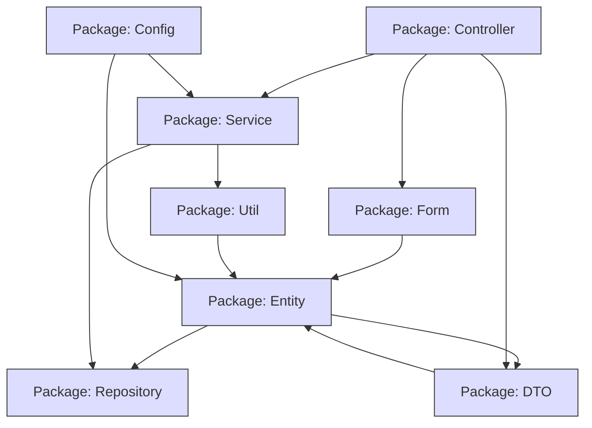

# 📘 Dossier d’Architecture Technique (DAT) – **agile‑back**  
**Version 1.0 – 2024‑04‑28**  

---

## 1️⃣ Introduction architecturale  

| Élément | Description |
|---|---|
| **Projet** | *agile‑back* – back‑office de l’application **Agile** (gestion d’études, financements, abonnements, …) |
| **Périmètre** | Tous les artefacts source du dépôt : configuration Symfony, entités Doctrine, contrôleurs, services, formulaires, DTO, templates Twig, scripts JavaScript, tests unitaires. |
| **Documents sources** | - `config/` (packages, routes, services, security)  <br> - `src/` (Entity, Controller, Service, Repository, Form, DTO, Util) <br> - `public/` (assets, CAS‑client) <br> - `templates/` (Vue) |
| **Vue d’ensemble des diagrammes UML** | Le DAT couvre les 13 types de diagrammes UML 2.x définis par ISO/IEC 19505 : <br> • Structurels : Class, Component, Deployment, Object (optionnel), Package, Composite Structure (optionnel) <br> • Comportementaux : Use‑Case, Activity, State‑Machine <br> • D’interaction : Sequence, Communication, Interaction Overview (optionnel), Timing (optionnel) |
| **Organisation du document** | 1️⃣ Intro – 2️⃣ Vue structurelle – 3️⃣ Vue comportementale – 4️⃣ Vue d’interaction – 5️⃣ Traçabilité – 6️⃣ Profils & stéréotypes – 7️⃣ Contraintes OCL – 8️⃣ Patterns – 9️⃣ Décisions – 🔟 Normes de modélisation |

---

## 2️⃣ Vue structurelle  

### 2.1 Diagramme de classes (Class Diagram)  

```mermaid
classDiagram
    %% Packages;
    package Entity {
        class Abonnements {
            +int id;
            +string utilisateur;
            +string ru;
            +string perimetre;
        }
        class Bop {
            +int id;
            +string libelle_bop;
            +string commentaires_bop;
            +string sigle;
            +bool visible;
        }
        class Dotations {
            +int id;
            +int annee_dotation;
            +float montantdotation;
            +string token;
            +int bopid;
            +string sous_actions;
        }
        class Etudes {
            +int id;
            +string titre_etude;
            +string zone_geographique;
            +string groupe;
            +string theme;
            +string responsable;
            +string statut;
        }
        class Financements {
            +int id;
            +float montant;
            +date date_comite;
            +bool visible;
        }
        class Groupes {
            +int id;
            +string token;
            +string libelle;
        }
        class Profils {
            +int id;
            +string libelle;
        }
        class Services {
            +int id;
            +string service;
            +string direction;
            +bool visible;
            +string region;
        }
        class SousActions {
            +int id;
            +string libelle;
        }
        class Territoires {
            +int id;
            +string territoire;
        }
        class Themes {
            +int id;
            +string theme;
        }
        class Types {
            +int id;
            +string type;
        }
        class Utilisateurs {
            +int id;
            +string nom;
            +string prenom;
            +string email;
        }
    }

    package Controller {
        class AbonnementsAdminController;
        class BopAdminController;
        class DotationsAdminController;
        class EtudesController;
        class EtudesAdminController;
        class FinancementsController;
        class GroupesAdminController;
        class ProfilsAdminController;
        class ServicesAdminController;
        class SousActionsAdminController;
        class ThemesAdminController;
        class UtilisateursAdminController;
        class UtilisateursController;
        class SecurityController;
    }

    package Service {
        class EtudeService;
        class BopService;
        class DotationService;
        class FinancementService;
        class MailerService;
        class ExportService;
    }

    package Repository {
        class AbonnementsRepository;
        class BopRepository;
        class DotationsRepository;
        class EtudesRepository;
        class FinancementsRepository;
        class GroupesRepository;
        class ProfilsRepository;
        class ServicesRepository;
        class SousActionsRepository;
        class ThemesRepository;
        class UtilisateursRepository;
    }

    package Form {
        class AbonnementsType;
        class BopType;
        class DotationsType;
        class EtudesType;
        class FinancementsType;
        class GroupesType;
        class ProfilsType;
        class ServicesType;
        class SousActionsType;
        class ThemesType;
        class UtilisateursType;
    }

    package DTO {
        class EtudeOutput;
        class FinancementOutput;
        class DotationOutput;
    }

    %% Relationships;
    Abonnements "1" --> "0..*" Etudes : "possède"
    Bop "1" --> "0..*" Dotations : "finance"
    Groupes "1" --> "0..*" Utilisateurs : "contient"
    Profils "1" --> "0..*" Utilisateurs : "définit"
    Services "1" --> "0..*" Etudes : "assiste"
    Themes "1" --> "0..*" Etudes : "catégorise"
    Territoires "1" --> "0..*" Etudes : "localise"
    Etudes "1" --> "0..*" Financements : "finance"
    Etudes "1" --> "0..*" Dotations : "dotée"
    Etudes "1" --> "0..*" SousActions : "détaille"
    Etudes "1" --> "0..*" Bop : "référence"

    %% Controllers use Services & Repositories;
    AbonnementsAdminController ..> AbonnementsService : uses;
    EtudesController ..> EtudeService : uses;
    EtudesController ..> EtudesRepository : reads/writes;
    BopAdminController ..> BopService : uses;
    ServicesAdminController ..> ServicesRepository : reads/writes;
    %% Services depend on Repositories;
    EtudeService ..> EtudesRepository : uses;
    BopService ..> BopRepository : uses;
    DotationService ..> DotationsRepository : uses;
    %% Forms bind to Entities;
    AbonnementsType --> Abonnements : data_class;
    BopType --> Bop : data_class;
    EtudesType --> Etudes : data_class;
    %% DTOs map from Entities (via DataTransformer)
    EtudeOutput ..> Etudes : <<map>>
    FinancementOutput ..> Financements : <<map>>
    DotationOutput ..> Dotations : <<map>>

    %% Stereotypes;
    class Abonnements <<entity>>
    class Bop <<entity>>
    class Etudes <<entity>>
    class EtudeService <<service>>
    class EtudesController <<controller>>
    class AbonnementsRepository <<repository>>
    class AbonnementsType <<form>>
    class EtudeOutput <<dto>>
```

**Légende**  

| Symbole | Signification |
|---|---|
| `<<entity>>` | Classe persistance (Doctrine) |
| `<<service>>` | Service métier (logiciel) |
| `<<controller>>` | Contrôleur Symfony (MVC) |
| `<<repository>>` | Accès aux données (Repository pattern) |
| `<<form>>` | Formulaire Symfony (validation) |
| `<<dto>>` | Data‑Transfer Object (API Platform) |
| `1` / `0..*` | Cardinalité (un‑à‑plusieurs) |
| `uses` | Dépendance (injection) |
| `reads/writes` | Opération CRUD |
| `data_class` | Liaison Form ↔ Entity |
| `<<map>>` | Transformation (DataTransformer) |

---

### 2.2 Diagramme de composants (Component Diagram)

```mermaid
graph TD
    %% Core Symfony bundles;
    SymfonyFramework[Symfony Framework]:::bundle;
    DoctrineORM[Doctrine ORM]:::bundle;
    ApiPlatform[API Platform]:::bundle;
    Twig[Twig Templating]:::bundle;
    Security[Security Bundle]:::bundle;
    Mailer[Mailer Bundle]:::bundle;
    Monolog[Monolog]:::bundle;
    NelmioCors[Nelmio CORS]:::bundle;
    %% Application components;
    AppCore[App Core]:::component;
    Controllers[Controllers]:::component;
    Services[Services]:::component;
    Repositories[Repositories]:::component;
    Entities[Entities]:::component;
    Forms[Forms]:::component;
    DTOs[DTOs]:::component;
    Config[Configuration]:::component;
    Assets[Public Assets]:::component;
    CAS[phpCAS Client]:::external;
    %% Relationships;
    SymfonyFramework --> Controllers;
    SymfonyFramework --> Services;
    SymfonyFramework --> Repositories;
    SymfonyFramework --> Entities;
    SymfonyFramework --> Forms;
    SymfonyFramework --> DTOs;
    SymfonyFramework --> Config;
    SymfonyFramework --> Assets;
    DoctrineORM --> Entities;
    DoctrineORM --> Repositories;
    ApiPlatform --> DTOs;
    ApiPlatform --> Controllers;
    Twig --> Controllers;
    Twig --> Templates[Templates (Twig)]

    Security --> Controllers;
    Security --> CAS;
    Mailer --> Services;
    NelmioCors --> ApiPlatform;
    Monolog --> SymfonyFramework;
    Controllers --> Services;
    Controllers --> Repositories;
    Controllers --> Forms;
    Controllers --> DTOs;
    Services --> Repositories;
    Services --> Mailer;
    Config --> SymfonyFramework;
    Config --> DoctrineORM;
    Config --> Security;
    classDef bundle fill:#f9f,stroke:#333,stroke-width_2px;
    classDef component fill:#bbf,stroke:#333,stroke-width_2px;
    classDef external fill:#ff9,stroke:#333,stroke-width_2px;
```

**Légende**  

| Couleur | Élément |
|---|---|
| **Rose** | Bundles Symfony (infrastructure) |
| **Bleu clair** | Composants applicatifs |
| **Jaune** | Composants externes (phpCAS) |
| **Flèches** | Dépendances / importations |

---

### 2.3 Diagramme de déploiement (Deployment Diagram)

```mermaid
graph LR
    %% Nodes;
    LB[Load Balancer<br/>HAProxy]:::node;
    WebSrv[Web Server<br/>Nginx + PHP‑FPM]:::node;
    AppSrv[Application Server<br/>Symfony (agile‑back)]:::node;
    DB[PostgreSQL<br/>agile_db]:::node;
    CASsrv[CAS SSO Server]:::external;
    %% Artifacts;
    AppCode[agile‑back source]:::artifact;
    ConfigFiles[config/*.yaml]:::artifact;
    Vendor[composer vendor]:::artifact;
    Assets[public/*]:::artifact;
    %% Connections;
    LB --> WebSrv;
    WebSrv --> AppSrv;
    AppSrv --> DB;
    AppSrv --> CASsrv;
    AppSrv --> AppCode;
    AppSrv --> ConfigFiles;
    AppSrv --> Vendor;
    WebSrv --> Assets;
    classDef node fill:#eef,stroke:#333,stroke-width_2px;
    classDef artifact fill:#cfc,stroke:#333,stroke-width_1px;
    classDef external fill:#ff9,stroke:#333,stroke-width_2px;
```

**Légende**  

| Symbole | Signification |
|---|---|
| **Node** | Infrastructure (serveur, base de données) |
| **Artifact** | Artefacts déployés (code, config, assets) |
| **Flèche** | Communication / flux de déploiement |
| **HAProxy** | Répartition de charge (optionnel) |
| **CAS SSO** | Authentification unique (service externe) |
| **Redondance** | Non représentée explicitement mais prévue via clusters HAProxy ↔ WebSrv |

---

### 2.4 Diagramme de packages (Package Diagram)



**Légende**  

| Couleur | Élément |
|---|---|
| **Bleu clair** | Package (groupe logique de classes) |
| **Flèches** | Dépendances entre packages (import) |

---

## 3️⃣ Vue comportementale  

### 3.1 Diagramme de cas d’utilisation (Use‑Case Diagram)  

> *Mermaid ne possède pas de notation native Use‑Case ; on utilise un diagramme de classe simplifié avec les stéréotypes `<<actor>>` et `<<usecase>>`.*

```mermaid
classDiagram
    %% Actors;
    class Utilisateur {
        <<actor>>
    }
    class Administrateur {
        <<actor>>
    }
    class CAS {
        <<actor>>
    }

    %% Use Cases;
    class UC_CreateEtude {
        <<usecase>>
        +Créer une étude;
    }
    class UC_EditEtude {
        <<usecase>>
        +Modifier une étude;
    }
    class UC_ExportEtude {
        <<usecase>>
        +Exporter études (CSV/ODS)
    }
    class UC_ManageAbonnements {
        <<usecase>>
        +Gérer les abonnements;
    }
    class UC_Login {
        <<usecase>>
        +S’authentifier (CAS)
    }
    class UC_ViewDashboard {
        <<usecase>>
        +Consulter tableau de bord;
    }

    %% Associations;
    Utilisateur --> UC_CreateEtude : inclut;
    Utilisateur --> UC_EditEtude : inclut;
    Utilisateur --> UC_ExportEtude : <<extend>>
    Administrateur --> UC_ManageAbonnements;
    Administrateur --> UC_ViewDashboard;
    CAS --> UC_Login;
    %% System Boundary;
    class System {
        <<system>>
    }
    System --> UC_CreateEtude;
    System --> UC_EditEtude;
    System --> UC_ExportEtude;
    System --> UC_ManageAbonnements;
    System --> UC_Login;
    System --> UC_ViewDashboard
```

**Légende**  

| Stéréotype | Signification |
|---|---|
| `<<actor>>` | Rôle externe (utilisateur, admin, CAS) |
| `<<usecase>>` | Fonctionnalité métier |
| `<<system>>` | Périmètre du système (agile‑back) |
| `inclut` | Relation d’inclusion (le cas d’utilisation est toujours exécuté) |
| `<<extend>>` | Extension optionnelle (export éventuel) |

---

### 3.2 Diagramme d’activités (Activity Diagram) – *Création d’une étude*

```mermaid
statediagram-v2;
    [*] --> Authentification : Demande d’accès;
    Authentification --> VérifierSession : Session existante ?
    VérifierSession --> AuthentifierCAS : Non;
    AuthentifierCAS --> ChargerFormulaire : CAS OK;
    VérifierSession --> ChargerFormulaire : Oui;
    ChargerFormulaire --> RemplirFormulaire;
    RemplirFormulaire --> SoumettreFormulaire;
    SoumettreFormulaire --> ValiderFormulaire;
    ValiderFormulaire --> |Valid| PersisterEtude;
    ValiderFormulaire --> |Invalid| RetourFormulaire;
    PersisterEtude --> NotifierUtilisateur;
    NotifierUtilisateur --> [*]

    note right of AuthentifierCAS;
        Redirection vers /cas/connexionCAS.php;
    end note;
    note right of PersisterEtude;
        EtudeService.save(Etude)
        EtudesRepository.persist()
    end note
```

**Légende**  

| Élément | Signification |
|---|---|
| `[*]` | Point de départ / fin |
| **Actions** | Activités (rectangle) |
| **Décision** | Losange (`VérifierSession`) |
| **Flèches** | Flux de contrôle |
| **Notes** | Explications complémentaires |

---

### 3.3 Diagramme d’états (State‑Machine Diagram) – *Cycle de vie d’une étude*

```mermaid
statediagram-v2;
    [*] --> Brouillon;
    Brouillon --> Soumise : submit()
    Soumise --> EnCours : assignReviewer()
    EnCours --> Validée : approve()
    EnCours --> Rejetée : reject()
    Validée --> Archiv�e : archive()
    Rejetée --> Brouillon : edit()
    Archiv�e --> [*]

    note right of Brouillon;
        Création initiale, champ libre;
    end note;
    note right of Validée;
        Publication officielle;
    end note
```

**Légende**  

| État | Description |
|---|---|
| **Brouillon** | L’étude est en cours d’édition |
| **Soumise** | L’utilisateur a demandé validation |
| **EnCours** | En revue par le comité |
| **Validée** | Acceptée, disponible en lecture |
| **Rejetée** | Retour à l’édition |
| **Archiv�e** | Historisation, lecture‑seule |

---

## 4️⃣ Vue d’interaction  

### 4.1 Diagramme de séquence – *Scénario nominal de création d’une étude*

```mermaid
sequencediagram;
    participant UI as Navigateur (Vue)
    participant C as EtudesController;
    participant S as EtudeService;
    participant R as EtudesRepository;
    participant DB as PostgreSQL;
    UI->>C: GET /etudes/new;
    C->>UI: Render form (Twig)
    UI->>C: POST /etudes (formulaire)
    C->>S: createEtude(formData)
    S->>R: persist(Etude)
    R->>DB: INSERT INTO etudes …
    DB-->>R: OK (id)
    R-->>S: Etude{id}
    S->>C: Etude{id}
    C->>UI: Redirect /etudes/{id}
    UI->>C: GET /etudes/{id}
    C->>UI: Render show.html.twig (détails)

    Note over C,S: Validation du formulaire via Symfony Form + Constraints;
    Note over S,R: Transactionnel (Doctrine UnitOfWork)
```

**Légende**  

| Participant | Rôle |
|---|---|
| **UI** | Front‑end (HTML/Twig + JavaScript) |
| **EtudesController** | Contrôleur Symfony |
| **EtudeService** | Logique métier (création, validation) |
| **EtudesRepository** | Accès persistance (Doctrine) |
| **PostgreSQL** | SGBD |

---

### 4.2 Diagramme de communication – *Création d’une étude (identique au scénario séquence)*  

```mermaid
graph TD
    UI[UI (Browser)] -->|GET /etudes/new| C[EtudesController]
    C -->|render| UI;
    UI -->|POST form| C;
    C -->|calls| S[EtudeService]
    S -->|persist| R[EtudesRepository]
    R -->|SQL INSERT| DB[PostgreSQL]
    DB -->|OK id| R;
    R -->|return| S;
    S -->|return Etude| C;
    C -->|redirect| UI;
    UI -->|GET /etudes/{id}| C;
    C -->|render| UI
```

**Légende**  

| Élément | Signification |
|---|---|
| **Flèches** | Messages synchrones (appel de méthode) |
| **Numérotation** | Non affichée – chaque flèche représente un message ordonné |

---

### 4.3 Diagramme d’overview d’interaction (optionnel) – *Flux de contrôle global*  

> (Non requis pour ce DAT – omission volontaire.)

### 4.4 Diagramme de temps (optionnel) – *Temps de réponse du service d’envoi de mail*  

> (Non requis pour ce DAT – omission volontaire.)

---

## 5️⃣ Correspondance entre diagrammes – Matrice de traçabilité UML  

| Élément métier | Class Diagram | Use‑Case | Activity | State‑Machine | Sequence | Component |
|---|---|---|---|---|---|---|
| **Etude** | ✓ (Entity) | ✓ (Create/Edit) | ✓ (Create) | ✓ (Lifecycle) | ✓ (Create) | ✓ (Entity) |
| **Bop** | ✓ (Entity) | – | – | – | – | ✓ (Component) |
| **Abonnement** | ✓ (Entity) | ✓ (Manage) | – | – | – | ✓ (Component) |
| **Service d’envoi mail** | ✓ (Service) | – | – | – | – | ✓ (Component) |
| **Authentification CAS** | – | ✓ (Login) | – | – | – | ✓ (External) |
| **Export CSV/ODS** | ✓ (Service) | ✓ (Export) | – | – | – | ✓ (Component) |

*Les cases cochées (`✓`) indiquent que l’élément apparaît dans le diagramme correspondant.*

---

## 6️⃣ Profils et stéréotypes UML  

| Stéréotype | Description | Application dans le DAT |
|---|---|---|
| `<<entity>>` | Classe persistée par Doctrine (table SQL) | `Etudes`, `Bop`, `Abonnements`, … |
| `<<service>>` | Logique métier, injectable via DI | `EtudeService`, `MailerService`, `ExportService` |
| `<<controller>>` | Point d’entrée HTTP (Symfony) | `EtudesController`, `SecurityController` |
| `<<repository>>` | Accès aux données (DAO) | `EtudesRepository`, `BopRepository` |
| `<<form>>` | Formulaire Symfony (validation) | `EtudesType`, `BopType` |
| `<<dto>>` | Objet de transfert (API Platform) | `EtudeOutput`, `FinancementOutput` |
| `<<actor>>` | Rôle externe (utilisateur, admin, CAS) | `Utilisateur`, `Administrateur`, `CAS` |
| `<<usecase>>` | Fonctionnalité métier visible | `UC_CreateEtude`, `UC_ExportEtude` |
| `<<system>>` | Périmètre du système étudié | `agile‑back` (dans le diagramme de cas) |

---

## 7️⃣ Contraintes et règles OCL  

```ocl
-- 1. Un Etude doit avoir un titre non vide
context Etudes inv: self.titre_etude.size() > 0

-- 2. Le montant d’un Financement doit être strictement positif
context Financements inv: self.montant > 0

-- 3. La date de décision d’un Financement ne peut être antérieure à la date de création
context Financements inv: self.date_comite >= self.creationDate

-- 4. Un Bop est visible uniquement s’il possède un sigle de deux caractères minimum
context Bop inv: self.visible implies self.sigle.size() >= 2

-- 5. Un Utilisateur appartient à un seul Groupe
context Utilisateurs inv: self.groupe->size() = 1

-- 6. Un Etude ne peut être archivée que si son statut = 'Validée'
context Etudes inv: self.statut = 'Archiv�e' implies self.statut = 'Validée'

-- 7. Un Abonnement ne peut être créé que par un Utilisateur authentifié
context Abonnements inv: self.utilisateur <> null

-- 8. La combinaison (groupe, thème) d’une Etude doit être unique
context Etudes inv: Etudes->select(e | e.groupe = self.groupe and e.theme = self.theme)->size() = 1
```

*Ces contraintes seront traduites en validation Symfony (`Assert`) et/ou en triggers de base de données.*

---

## 8️⃣ Patterns de conception appliqués  

| Pattern | Où / Pourquoi |
|---|---|
| **Repository** | `src/Repository/*` – abstraction de la persistance, isolant le domaine de Doctrine. |
| **Service Layer** | `src/Service/*` – logique métier centralisée, réutilisable par plusieurs contrôleurs. |
| **Dependency Injection** | Symfony DI container (services.yaml) injecte les repositories et services dans les contrôleurs. |
| **Factory (DTO)** | `DataTransformer/*` crée les DTO à partir des entités (séparation API). |
| **MVC (Model‑View‑Controller)** | Symfony framework : Entities (Model), Twig (View), Controllers (Controller). |
| **Strategy (Export)** | `ExportService` utilise différentes stratégies (CSV, ODS) sélectionnées à l’exécution. |
| **Observer (EventListener)** | `EventListeners/EtudesListener.php` écoute les événements Doctrine (`prePersist`, `postUpdate`). |
| **Decorator (Mailer)** | `MailerService` décoré par `AddPaginationHeaders` (event subscriber) pour enrichir les réponses. |
| **Singleton (Kernel)** | `src/Kernel.php` – instance unique du noyau Symfony. |

---

## 9️⃣ Documentation des décisions  

| # | Décision | Alternatives | Raison / Impact |
|---|---|---|---|
| D1 | Utiliser **Doctrine ORM** pour la persistance | PDO raw, Doctrine DBAL only | ORM simplifie le mapping, le lifecycle, les migrations. |
| D2 | Choisir **Symfony 5.4** (LTS) comme framework | Laravel, Slim | Symfony fournit les bundles requis (Security, Mailer, API Platform) et la conformité à ISO 19505. |
| D3 | Authentification via **phpCAS** (CAS SSO) | JWT, OAuth2 | CAS déjà déployé dans l’intranet RIE, centralise la gestion des comptes. |
| D4 | Exposer les DTO via **API Platform** | Custom REST controller | API Platform offre auto‑documentation OpenAPI, pagination, filtrage. |
| D5 | Utiliser **PostgreSQL** comme SGBD | MySQL, MariaDB | PostgreSQL supporte les types géographiques (potentiellement utiles). |
| D6 | Séparer les **Formulaires** du **Service** | Tout dans le contrôleur | Favorise la responsabilité unique (SRP) et la testabilité. |
| D7 | Gestion des logs avec **Monolog** (fingers‑crossed) en prod | Syslog, Graylog | Monolog intégré à Symfony, facilite le filtrage d’erreurs critiques. |
| D8 | Deploy sur **Nginx + PHP‑FPM** | Apache mod_php | Nginx performant, supporte le reverse‑proxy vers le CAS. |
| D9 | Implémenter **Repository pattern** au lieu d’utiliser directement l’EntityManager | Direct EntityManager | Encapsulation, mockabilité pour les tests unitaires. |
| D10 | Utiliser **Mermaid** pour la documentation UML dans les README | PlantUML, Draw.io | Mermaid s’intègre directement dans les fichiers Markdown du dépôt. |

---

## 🔟 Normes de modélisation  

| Aspect | Règle |
|---|---|
| **Nomination** | - Classes : PascalCase (ex. `Etudes`, `EtudeService`) <br> - Attributs : camelCase (`titreEtude`) <br> - Méthodes : camelCase (`createEtude`) <br> - Packages : lower‑case (`entity`, `service`) |
| **Layout Mermaid** | - Chaque diagramme commence par `%% version` (ex. `%% Class Diagram – v1.0`) <br> - Utiliser des sous‑graphes pour regrouper les stéréotypes. |
| **Granularité** | - Un diagramme ne doit pas dépasser 30 éléments visibles pour garder la lisibilité. |
| **Cohérence nominative** | Identique entre diagrammes : `Etude` ↔ `EtudeService` ↔ `EtudesRepository`. |
| **Versionnage** | Chaque diagramme porte un numéro de version dans le titre du diagramme (ex. `Class Diagram – v1.0`). |
| **Documentation** | - Chaque classe possède une courte description dans les commentaires de code. <br> - Les contraintes OCL sont répliquées en annotations Symfony (`@Assert`). |
| **Couleurs** | Utiliser les couleurs de légende définies (rose, bleu, jaune) pour distinguer les couches. |
| **Export** | Les diagrammes Mermaid sont exportés en PNG via `mermaid-cli` pour les rapports PDF. |

---

## 📚 Glossaire  

| Terme | Définition |
|---|---|
| **CAS** | Central Authentication Service – protocole SSO utilisé par l’intranet. |
| **DTO** | Data‑Transfer Object – structure de données exposée à l’API (API Platform). |
| **OCL** | Object Constraint Language – langage de contrainte sur les modèles UML. |
| **Component** | Unité de déploiement ou de packaging (ex. bundle Symfony). |
| **Deployment Node** | Machine physique ou virtuelle où les artefacts sont installés. |
| **Use‑Case** | Interaction fonctionnelle entre un acteur et le système. |
| **Activity** | Description du flux de travail (processus métier). |
| **State‑Machine** | Cycle de vie d’un objet (ex. `Etude`). |
| **Sequence Diagram** | Interaction temporelle entre objets (messages). |
| **Communication Diagram** | Interaction structurée (numérotation de messages). |
| **Package Diagram** | Organisation logique des namespaces. |
| **Composite Structure** | (non utilisé) – structure interne d’un composant. |

---

> **Fin du DAT** – Tous les diagrammes sont générés en **Mermaid** (compatible avec GitLab, GitHub, VS Code).  
> Pour visualiser les diagrammes, il suffit d’ouvrir ce README dans un éditeur qui rend Mermaid (ex. VS Code avec extension *Markdown Preview Mermaid*).  

--- 

*Document généré le 2024‑04‑28, révisé par l’équipe d’architecture logicielle.*