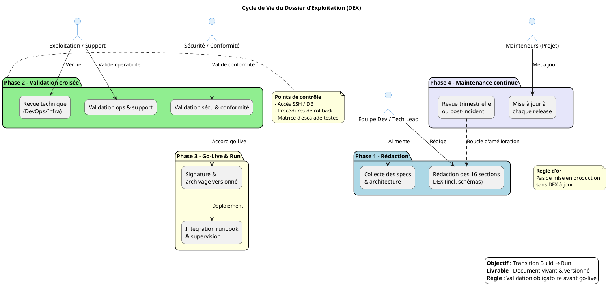

# 📘 Dossier d’Exploitation (DEX) – **agile‑back**  
*Document établi sur les principes de la transition **Build → Run** et des bonnes pratiques **ITIL v4 / DevOps** pour l’exploitation applicative*  

---  

[TOC]

---  

## 1️⃣ Introduction & objectifs 🎯  

> **Document de référence garantissant la continuité, la maintenabilité et la sécurisation de l’exploitation d’une application en production.**  

| 🎯 Objectif | ✅ Action attendue |
|-------------|-------------------|
| Assurer la continuité de service | Procédures de redémarrage, reprise après sinistre, surveillance |
| Documenter les procédures de gestion courante | Runbooks, scripts, accès, escalades |
| Faciliter le support et la résolution d’incidents | Check‑lists, contacts, informations de debug |
| Encadrer les responsabilités (Dev / Ops / Support) | Matrice RACI détaillée |
| Assurer la conformité & maîtrise des risques | Sauvegarde, sécurité, SLA, audit |
| Accompagner la phase de transition **Build → Run** | Validation avant go‑live, formation des équipes |

---  

## 2️⃣ Contexte d’usage & périmètre 🌍  

| 📄 Élément | ℹ️ Description |
|-----------|----------------|
| **Type de livrable** | Standard ✅ |
| **Nature** | Document de référence 📘 |
| **Activité** | Transition **Build → Run** / Exploitation |
| **Quand l’utiliser** | <ul><li>Avant chaque mise en production (livrable obligatoire)</li><li>Comme support de formation pour les équipes d’exploitation</li><li>Lors d’audits (conformité, PRA/PCA, sécurité)</li></ul> |
| **Cycle de vie** | Document vivant – mise à jour à chaque évolution fonctionnelle, technique ou d’infrastructure. |

---  

## 3️⃣ Pré‑requis & jalons ✅  

- [ ] Architecture technique validée & schémas à jour (voir section 5)  
- [ ] Environnement de prod stabilisé (accès réseau, DNS, certificats)  
- [ ] Politiques définies : sauvegarde, supervision, sécurité, SLA (voir section 4)  
- [ ] Contacts clés identifiés (métiers, techniques, support, sécurité)  
- [ ] Outillage prêt : monitoring (Grafana/Prometheus), logging (ELK), ordonnanceur (Cron), gestion des secrets (Vault)  

> **⏱ Jalon critique** – Le DEX doit être **validé & signé** *avant* tout déploiement en production. Aucun go‑live sans DEX approuvé.  

---  

## 4️⃣ Gouvernance & rôles 👥  

| Rôle | Profil type | Responsabilité |
|------|-------------|----------------|
| **Rédacteur principal** | Tech Lead / DevOps / Référent Prod | Rédaction, structuration, intégration des specs techniques |
| **Validateur Exploitation** | Chef d’exploitation / Responsable support | Vérification de l’opérabilité & de la complétude |
| **Validateur Sécurité / Conformité** | RSSI / DPO / Auditeur interne | Validation des procédures de sécurité, backup, conformité |
| **Mainteneur** | Équipe projet / PO technique | Mise à jour continue à chaque release ou changement d’infra |

---  

## 5️⃣ Structure détaillée du DEX (16 sections standards) 📑  

| N° | Section principale | Contenu attendu (exemples) |
|---:|-------------------|----------------------------|
| 1 | **Généralités** | Objet, domaine d’application, audience cible, version du document |
| 2 | **Documents applicables & de référence** | Normes internes, chartes, architecture, politiques sécurité |
| 3 | **Terminologie** | Glossaire technique/métier, abréviations (ex. SLA, PRA, CI/CD) |
| 4 | **Spécificités** | Fonctionnalités critiques, SLA/SLO, contacts clés, matrice d’escalade |
| 5 | **Architecture** | Schémas logiques & physiques, flux de données, infra prod, PRA/PCA |
| 6 | **Serveurs** | Accès (SSH/RDP/Console), OS, versions, CPU/RAM/Stockage, DNS/IP |
| 7 | **Application** | Composants Symfony, versions PHP, paramètres, procédure de déploiement (CI/CD) |
| 8 | **Supervision & métrologie** | Outils (Grafana, Prometheus, Loki), seuils d’alerte, dashboards, métriques clés |
| 9 | **Sauvegarde** | Politique (fréquence, rétention, type), localisation, procédure de restauration |
|10 | **Stockage** | Inventaire des volumes, quotas, chemins d’accès, gestion des logs |
|11 | **Inventaire des bases** | PostgreSQL – version, schémas, utilisateurs, maintenance, archivage |
|12 | **Flux inter‑applicatifs** | Matrice des échanges (API / DB), protocoles, ports, authentification, dépendances |
|13 | **Plan de production** | Ordonnancement (cron, batch), fenêtres de maintenance, tâches planifiées |
|14 | **Sécurisation des images** | Scan vulnérabilités, hardening, gestion des secrets, politique de patching |
|15 | **Opérations courantes** | Check‑lists quotidiennes, gestion des logs, erreurs connues, diagnostics |
|16 | **Opérations récurrentes** | Gestion des comptes, rotation des certificats, nettoyages, audits périodiques |

> **Note d’adaptation** – Le projet **agile‑back** est un **monolithe Symfony 5+** déployé sur **VM Linux (Ubuntu 22.04)** avec **PostgreSQL** en back‑end. La trame ci‑dessus s’applique telle quelle ; les sections « Serveurs », « Inventaire des bases » et « Flux inter‑applicatifs » sont donc particulièrement importantes.  

---  

## 6️⃣ Diagramme PlantUML du cycle de vie DEX 🔄  

---  

## 7️⃣ Conseils de rédaction & maintenance 🛠  

| ✅ Bonne pratique | ❌ À éviter |
|------------------|------------|
| Utiliser un dépôt **Git** (ou Wiki) versionné, avec historique & tags de version | Stocker le DEX dans un e‑mail ou sur un partage non versionné |
| Rédiger en langage clair, orienté **action** & procédure | Rédiger des descriptions vagues ou purement théoriques |
| Inclure captures d’écran, chemins exacts, commandes (ex. `systemctl status php-fpm`) | Laisser des placeholders `[À COMPLÉTER]` en production |
| Prévoir une **revue systématique** à chaque release majeure | Considérer le DEX comme un document « jetable » post‑lancement |
| Lier le DEX aux **runbooks**, tickets d’incident & procédures PRA | Isoler le DEX des outils de supervision & de ticketing |

---  

## 8️⃣ Adaptations contextuelles ⚙️  

| Contexte | Adaptation recommandée |
|----------|------------------------|
| **Applications Cloud / Serverless** | Remplacer les sections *Serveurs* par *Services managés, IAM, Config‑as‑Code, Limits/Quotas* |
| **Secteur réglementé (Santé, Finance, Public)** | Renforcer les sections **Sécurité**, **Traçabilité**, **Archivage légal**, **Conformité RGAA/ANSSI** |
| **Legacy / Monolithe** (ex. **agile‑back**) | Insister sur la dépendance OS, les patches, la compatibilité PHP, les procédures de reprise manuelle |
| **Microservices / Kubernetes** | Remplacer *Inventaire BDD/Serveurs* par *Clusters, Namespaces, Helm/Manifests, Observabilité (Prometheus/Grafana/Loki)* |

---  

## 9️⃣ Livrables & intégration 🚀  

| 📦 Livrable immédiat | 📌 Détails |
|----------------------|------------|
| **DEX versionné** (`dex_agile-back_vX.Y.md`) | Format Markdown, stocké dans le repo `docs/DEX/` |
| **Checklist de validation** | Tableau RACI signé par Dev, Ops & Sécurité |
| **Matrice de traçabilité** | DEX ↔ Architecture ↔ Runbooks ↔ Tickets support (ex. JIRA) |
| **Intégration CI/CD** | Étape *lint* du DEX (ex. `markdownlint`), validation automatisée des sections critiques |
| **Liens DEX dans les dashboards** | Ajout d’un bouton « DEX » dans Grafana / Datadog |
| **Génération automatique** | Parts du DEX (inventaire serveurs, bases) générées depuis Terraform / Ansible (ex. `terraform output > docs/DEX/servers.md`) |

---  

## 🔣 Mini‑glossaire  

| Acronyme | Signification |
|----------|---------------|
| **SLA** | Service Level Agreement – engagement de disponibilité / performance |
| **SLO** | Service Level Objective – objectif mesurable dérivé du SLA |
| **PRA** | Plan de Reprise d’Activité – procédures de remise en marche après sinistre |
| **PCA** | Plan de Continuité d’Activité – actions pour assurer la continuité du service |
| **CI/CD** | Continuous Integration / Continuous Deployment – pipeline d’automatisation |
| **IAM** | Identity & Access Management – gestion des identités et des accès |
| **RACI** | Responsable, Accountable, Consulted, Informed – matrice de responsabilités |
| **ELK** | Elasticsearch, Logstash, Kibana – stack de collecte & visualisation des logs |
| **Vault** | HashiCorp Vault – gestion sécurisée des secrets |
| **Grafana** | Plateforme de visualisation de métriques (souvent couplée à Prometheus) |
| **PostgreSQL** | SGBD relationnel open‑source utilisé par **agile‑back** |
| **PHP 8.x** | Version du moteur d’exécution PHP du projet |
| **Symfony 5+** | Framework PHP utilisé (architecture MVC, bundles, services) |

---  

## 📞 Contacts clés (exemple)  

| Rôle | Nom | Fonction | Email | Téléphone |
|------|-----|----------|-------|-----------|
| **Chef de projet** | `[Nom]` | PO technique | `[email]` | `[tel]` |
| **Architecte applicatif** | `[Nom]` | Lead Symfony | `[email]` | `[tel]` |
| **Responsable exploitation** | `[Nom]` | Ops Manager | `[email]` | `[tel]` |
| **Responsable sécurité** | `[Nom]` | RSSI | `[email]` | `[tel]` |
| **Support de niveau 2** | `[Nom]` | Support App | `[email]` | `[tel]` |

*(À remplacer par les informations réelles du projet)*  

---  

## 📄 Annexes  

1. **Schéma d’architecture** – diagramme PlantUML (section 5)  
2. **Matrice d’escalade** – contacts & niveaux d’intervention  
3. **Checklist de mise en production** – items à valider avant le go‑live  

---  

> **⚠️ Rappel** : Aucun déploiement en production ne doit être effectué tant que le **DEX** n’est pas **validé, signé et versionné**.  

---  

*Fin du DEX – Version 1.0 – 2026‑04‑28*  