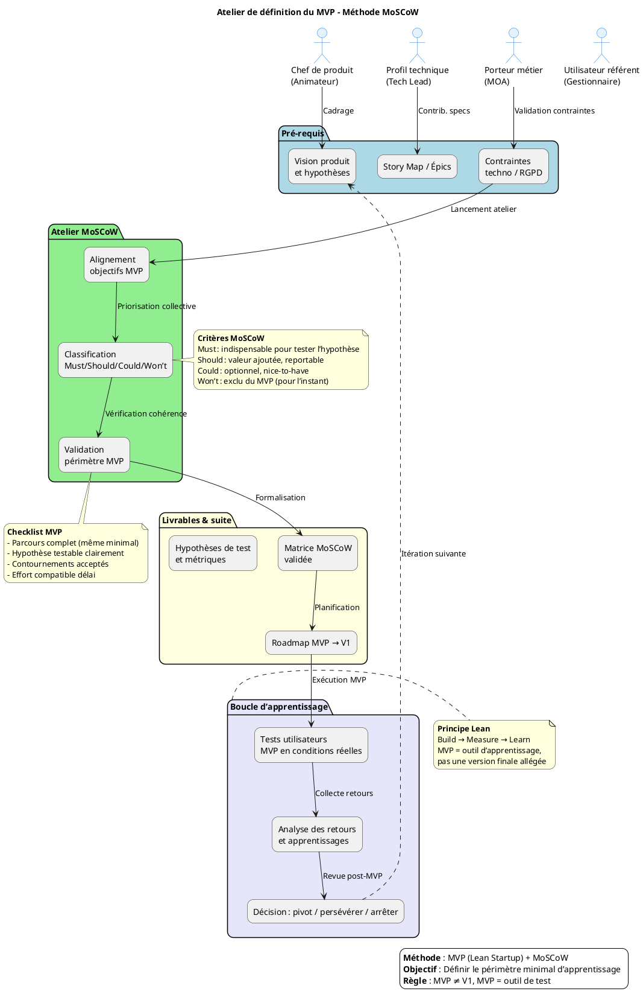

# 📘 Guide d’atelier : **Définir le MVP du projet *agile‑back***  
*Document établi à partir des principes du **MVP (Lean Startup)** et de la méthode de priorisation **MoSCoW**.*

---  

[TOC]

---  

## 1️⃣ Introduction et objectifs  

> **Objectif global** : *Définir collectivement le périmètre du Produit Minimum Viable (MVP) afin de tester les hypothèses produit avec un effort maîtrisé.*  

**Méthodologie** : MVP (Lean Startup) + priorisation **MoSCoW** (Must / Should / Could / Won’t).  

### Objectifs opérationnels de l’atelier  

| 🎯 | Description |
|---|-------------|
| **Clarifier la mission du MVP** | Quel apprentissage voulons‑nous valider ? Quelle hypothèse tester ? |
| **Identifier les fonctionnalités indispensables** | Classer les besoins entre *Must Have* et *Should / Could / Won’t* |
| **Aligner les équipes** | Produit, Métiers, Technique – même vision du périmètre réaliste |
| **Éviter l’effet tunnel** | Livrer vite, mesurer, itérer ; le MVP n’est pas une V1 allégée |
| **Poser les bases de la roadmap post‑MVP** | Définir les étapes V1 → itérations suivantes |

> ⚠️ **Rappel critique** : Un **MVP** n’est **pas** une version 1 réduite. C’est un **outil d’apprentissage** qui peut se limiter à un seul parcours utilisateur, avec des contournements (données factices, actions manuelles) acceptables.  

---  

## 2️⃣ Contexte d’usage et positionnement  

| 📦 | Valeur |
|---|--------|
| **Type de livrable** | Standard ✅ |
| **Nature** | Atelier 🤝 (« Imaginer une solution ») |
| **Quand l’utiliser** | <ul><li>Après la recherche utilisateur et la formalisation de la vision produit</li><li>Après un premier Story Mapping (ou une liste d’épics)</li><li>Avant le lancement du développement, pour cadrer le premier incrément</li></ul> |
| **Cas d’usage typiques** | <ul><li>Lancement d’un nouveau module back‑office (gestion d’études)</li><li>Refonte d’un service existant avec changement de paradigme</li><li>Test d’une innovation à fort risque (ex. : authentification CAS vs. login interne)</li><li>Réduction de scope pour respecter des contraintes de délai/budget</li></ul> |

### 📌 Produit : **agile‑back**  

* **Domain​e** : Back‑office de l’application *Agile* permettant la **création / modification d’études** stockées dans PostgreSQL.  
* **Technologies** : PHP 7+, Symfony 5, PostgreSQL, CAS (authentification), API Platform.  
* **Lien** : Front‑office *Agile‑front* (consomme les API exposées).  

### 🎯 Personas (extraits de la base de données)  

| Persona | Rôle | Besoin principal |
|--------|------|-----------------|
| **Admin système** | Responsable technique | Gérer les utilisateurs, groupes, permissions. |
| **Gestionnaire d’études** | Chargé de saisir et suivre les études | Créer, modifier, exporter les fiches d’étude. |
| **Opérateur financier** | Responsable des dotations | Saisir les dotations, suivre les budgets. |
| **Auditeur** | Contrôle de conformité | Accéder aux historiques, générer rapports. |

### 💡 Hypothèses à tester (exemple)  

| # | Hypothèse | Métrique de succès |
|---|-----------|--------------------|
| H1 | Un formulaire de création d’étude simple suffit à 80 % des utilisateurs. | % d’utilisateurs qui créent une étude sans assistance. |
| H2 | L’authentification CAS réduit le temps de connexion de 30 % vs. login interne. | Temps moyen de connexion (s). |
| H3 | L’export CSV des études est le format le plus demandé. | % de téléchargements CSV vs. autres formats. |
| H4 | Un tableau de bord « Mes études » suffit à 70 % des besoins de suivi. | Taux de satisfaction du tableau de bord (survey). |

### 🛑 Contraintes identifiées  

| Type | Description |
|------|-------------|
| **Techniques** | Symfony 5, Doctrine ORM, PostgreSQL, API Platform, CAS (PHP‑CAS). |
| **Réglementaires** | Accès aux données d’études soumis à la charte RGPD (anonymisation). |
| **Budgétaires** | 2 sprints (3 semaines) disponibles pour le MVP. |
| **Délais** | Livraison du MVP avant la fin du trimestre Q2 2024. |
| **Performance** | Temps de réponse API < 200 ms (côté back‑office). |

---  

## 3️⃣ Pré‑requis indispensables  

| ✅ | Pré‑requis |
|----|------------|
| 1 | **Vision produit formalisée** (pitch, objectifs métier, métriques de succès). |
| 2 | **Hypothèses à tester** (liste claire, priorisée). |
| 3 | **Story Mapping** ou **liste d’épics / user stories** (ex. : CRUD Études, Gestion utilisateurs, Export CSV, Authentification). |
| 4 | **Personas** et **retours utilisateurs** (interviews, verbatims). |
| 5 | **Contraintes** (techniques, réglementaires, budget, délai). |

> 💡 *Si un pré‑requis manque, prévoir 20 min en début d’atelier pour le co‑construire rapidement (ex. : reformuler la vision en 1 slide).*

---  

## 4️⃣ Parties prenantes et rôles  

| Rôle | Profil type | Responsabilité dans l’atelier |
|------|-------------|--------------------------------|
| **Animateur** | Chef de produit / PO | Cadrer, faciliter, garder le cap « apprentissage » |
| **Profil technique** | Tech Lead / Architecte Symfony | Évaluer faisabilité, effort, dépendances techniques |
| **Porteur métier** | MOA, Responsable back‑office | Valider la pertinence fonctionnelle et la valeur utilisateur |
| **Designer UX/UI** *(optionnel)* | Designer produit | Proposer des alternatives légères, valider l’expérience minimale |
| **Utilisateur référent** *(optionnel)* | Gestionnaire d’études | Apporter le regard « usage réel », challenger les priorités |

> ☝️ *Un même participant peut cumuler plusieurs rôles selon la taille de l’équipe.*

---  

## 5️⃣ Logistique de l’atelier  

| 📋 | Détails |
|---|----------|
| **Durée** | 2 h 30 – 4 h (prévoir une pause à 1 h 30 si > 3 h). |
| **Matériel physique** | Tableau blanc, post‑its 4 couleurs (Must / Should / Could / Won’t), marqueurs, ruban de masquage. |
| **Matériel digital** | Miro / FigJam / Mural (template MoSCoW), accès aux dépôts Git (pour afficher le Story Map). |
| **Livrable de sortie** | Périmètre MVP validé, matrice MoSCoW, roadmap initiale (MVP → V1 → itérations), hypothèses de test + métriques. |
| **Lieu** | Salle de réunion équipée d’un projecteur ou salle Teams avec partage d’écran. |

---  

## 6️⃣ Déroulé détaillé de l’atelier  

### 🎯 Étape 1 – Introduction & alignement (15 min)  

1. **Présenter les objectifs du MVP** :  
   *« Avec ce MVP, nous voulons vérifier que **l’authentification CAS** simplifie la connexion et que **un formulaire de création d’étude** suffit à 80 % des utilisateurs, en observant le taux de création sans assistance. »*  
2. **Rappel du contexte** (personas, hypothèses, contraintes).  
3. **Expliquer la méthode MoSCoW** :  

| Catégorie | Définition | Critère de décision |
|-----------|------------|---------------------|
| **M**ust Have | Indispensable pour que le MVP soit viable | Sans cela, le produit est inutile / l’hypothèse non testable |
| **S**hould Have | Important mais non critique pour le MVP | Valeur ajoutée significative, mais reportable sans bloquer |
| **C**ould Have | Optionnel, « nice‑to‑have » | Améliore l’expérience mais n’impacte pas l’apprentissage |
| **W**on’t Have | Exclu du MVP (pour l’instant) | Trop coûteux, hors scope, ou non prioritaire pour l’apprentissage |

> ✅ **Conseil** : Reformuler la mission du MVP en 1 phrase concise.  

---  

### 🔍 Étape 2 – Rappel du périmètre fonctionnel (30 min)  

1. **Afficher le Story Map** (ou la liste d’épics) :  

   * **Gestion des études** – CRUD, import/export CSV, recherche.  
   * **Gestion des utilisateurs / groupes** – CRUD, affectation rôles.  
   * **Gestion des dotations / financements** – saisie, suivi budgétaire.  
   * **Authentification** – CAS, fallback login.  
   * **Tableaux de bord** – « Mes études », statistiques d’usage.  

2. **Pour chaque épic / fonctionnalité** préciser :  
   * **Besoin utilisateur** (ex. : « Créer rapidement une étude »).  
   * **Hypothèse produit** (ex. : « Un formulaire simplifié augmente le taux de création de 30 % »).  
   * **Contraintes** (ex. : « Doit être compatible avec le schéma Doctrine existant »).  

3. **Regrouper les éléments similaires**, éliminer les doublons.  

📌 *Astuce* : Utiliser des verbes d’action (« Créer », « Modifier », « Exporter ») pour rester centré sur l’expérience.  

---  

### 🎚️ Étape 3 – Classification MoSCoW (60‑90 min)  

1. **Présenter chaque fonctionnalité/épic** (un à la fois).  
2. **Discussion guidée** – poser les questions suivantes :  

   * Le MVP peut‑il fonctionner sans cette fonctionnalité ?  
   * Quel impact sur l’apprentissage si on la retire ?  
   * Quel effort technique / délai pour la livrer ?  
   * Existe‑t‑il un contournement simple (données factices, saisie manuelle) ?  

3. **Vote ou consensus** :  

   * **Option A – Dot Voting** : chaque participant reçoit 3 votes à répartir sur les éléments “Must”.  
   * **Option B – Débat structuré** : un participant propose une catégorie, les autres valident ou challengent.  

4. **Placement** : déposer la fonctionnalité dans la colonne MoSCoW correspondante (post‑it couleur).  

> 💡 **Règle d’or** : Limiter les **Must Have** à **l’essentiel absolu**. Si tout est “Must”, rien n’est priorisé.  

---

#### Exemple de classification (extrait)  

| Fonctionnalité | Catégorie MoSCoW | Justification |
|----------------|-------------------|--------------|
| Formulaire **Création d’étude** (titre, zone géographique, groupe) | **Must** | Nécessaire pour tester H1 (taux de création). |
| Authentification **CAS** (login unique) | **Must** | Test de H2 – impact sur temps de connexion. |
| Export **CSV** des études | **Should** | Valeur ajoutée mais non indispensable pour le test initial. |
| Tableau de bord **Mes études** (liste filtrable) | **Could** | Améliore l’expérience, pas critique pour les hypothèses. |
| Gestion **des dotations** (budget) | **Won’t** (pour le MVP) | Complexité élevée, hors scope du test d’usage. |
| Support **API v2** (nouvelle version) | **Won’t** | Priorité basse, nécessite refactoring. |

---  

### ✅ Étape 4 – Validation du périmètre MVP (30 min)  

**Checklist de validation**  

- [ ] Le périmètre MVP permet de tester **au moins une hypothèse produit** clairement définie.  
- [ ] Un **parcours utilisateur complet** (ex. : se connecter → créer une étude → exporter CSV) est réalisable, même avec des contournements.  
- [ ] Les **contournements acceptables** (ex. : saisie manuelle de l’utilisateur en cas d’échec CAS) sont identifiés.  
- [ ] L’**effort estimé** (story points / jours) est compatible avec le **délai cible** (2 sprints).  
- [ ] Les **métriques de succès** sont définies (taux de création, temps de connexion, etc.).  

**Ajustements**  
- Si le périmètre est **trop large** → revisiter les “Must” et reporter les “Should/Could”.  
- Si le périmètre est **trop léger** → vérifier qu’aucune hypothèse critique n’a été oubliée.  

---  

### 🗺️ Étape 5 – Roadmap et prochaines étapes (15‑30 min)  

| Livrable | Contenu |
|----------|---------|
| **Matrice MoSCoW** | Tableau final avec toutes les fonctionnalités classées, justifications, et estimations d’effort. |
| **Périmètre MVP** | Liste des *Must Have* + contournements acceptés. |
| **Hypothèses de test** | Table associant chaque hypothèse à la(s) fonctionnalité(s) du MVP et aux métriques. |
| **Roadmap initiale** | <ul><li>**MVP** (Sprint 1‑2) : Authentification CAS + Formulaire création d’étude + Export CSV (prototype).</li><li>**V1** (Sprint 3‑4) : Tableau de bord “Mes études”, gestion utilisateurs.</li><li>**Itérations suivantes** : Gestion des dotations, API v2, améliorations UX.</li></ul> |
| **Suivi** | <ul><li>Qui pilote les tests utilisateurs du MVP ? (ex. : PO + UX researcher)</li><li>Comment seront collectés les retours ? (Google Forms + logs serveur)</li><li>Date de la revue post‑MVP (ex. : fin du Sprint 2)</li></ul> |

> 📸 **Action immédiate** : Partager la matrice MoSCoW et la roadmap brouillon **dans les 24 h** pour validation écrite (ex. : via Confluence ou GitLab‑Wiki).  

---  

## 7️⃣ Conseils de facilitation  

| Bonnes pratiques | À éviter |
|------------------|----------|
| Ancrer chaque décision dans une **hypothèse à tester**. | Prioriser par préférence personnelle ou « on a toujours fait comme ça ». |
| Challenger systématiquement les **Must Have** : *« Et si on enlevait ça ? »* | Accepter un MVP trop large par peur de décevoir. |
| Proposer des **contournements légers** (manuel, data factice). | Confondre « faisable techniquement » et « nécessaire pour l’apprentissage ». |
| Faire participer activement les **profils métier et utilisateurs**. | Laisser un seul profil (tech ou métier) dominer les arbitrages. |
| Documenter les **Won’t Have** avec leurs raisons (pour éviter les re‑demandes). | Oublier de prévoir la revue post‑MVP et les critères de succès. |

---  

## 8️⃣ Alternative : MVP par scénario utilisateur  

Lorsque la méthode MoSCoW ne suffit pas à réduire le scope, privilégier un **MVP basé sur un scénario complet** :

| Critère de sélection du scénario MVP | Exemple concret (agile‑back) |
|--------------------------------------|-----------------------------|
| **Parcours complet mais borné** | Créer une étude **sans** passer par la gestion des dotations. |
| **Forte innovation à tester** | Authentification CAS vs. login interne. |
| **Simplicité de mise en œuvre** | Utiliser le formulaire existant avec données factices. |
| **Valeur d’apprentissage maximale** | Valider l’hypothèse H1 (taux de création) et H2 (temps de connexion). |

> 💡 *Formuler le scénario MVP comme une user story élargie* :  
> *« En tant que **Gestionnaire d’études**, je veux **créer rapidement une étude** (titre, zone, groupe) afin de **valider que le formulaire simplifié suffit** même si l’authentification se fait via CAS ou login fallback. »*  

---  

## 9️⃣ Diagramme PlantUML du processus de définition du MVP  

---  

## 🔟 Adaptations contextuelles  

| Contexte | Adaptation recommandée |
|----------|-----------------------|
| **Refonte d’un produit existant** | Partir des points de friction (ex. : lenteur du formulaire) pour identifier les *Must Have* qui résolvent les blocages majeurs. |
| **Produit fortement réglementé** | Intégrer les exigences RGPD comme *Must* uniquement si elles bloquent l’hypothèse de test ; sinon, prévoir des **contournements** (ex. : données anonymisées). |
| **Multi‑profils utilisateurs** | Définir un MVP **par persona prioritaire** (Gestionnaire d’études) ou un scénario transversal couvrant les besoins communs. |
| **Contrainte de délai très court** | Cibler **un seul scénario utilisateur complet** (ex. : création d’étude + export CSV) ; accepter des contournements manuels en back‑office. |
| **Innovation à fort risque** | Prioriser les fonctionnalités qui valident **l’hypothèse la plus incertaine** (ex. : authentification CAS), même si le parcours est partiel. |

---  

## 1️⃣1️⃣ Livrables et intégration continue  

### Livrables immédiats (produits de l’atelier)  

| Livrable | Contenu |
|----------|---------|
| **Matrice MoSCoW** | Tableau complet (Must / Should / Could / Won’t) + justifications + effort estimé. |
| **Périmètre MVP** | Liste des *Must Have* + contournements acceptés. |
| **Roadmap initiale** | MVP → V1 → itérations suivantes (sprints, jalons). |
| **Hypothèses de test & métriques** | Table associant chaque hypothèse à la fonctionnalité et à la métrique. |
| **Backlog produit structuré** | Epics → user stories taggées MoSCoW (ex. : `#must`, `#should`). |

### Livrables dérivés (post‑atelier)  

| Livrable | Contenu |
|----------|---------|
| **User stories MVP** | Rédigées avec critères d’acceptation (ex. : `En tant que Gestionnaire, je veux créer une étude…`). |
| **Maquettes légères** | Wireframes du formulaire création + écran de connexion CAS. |
| **Plan de test utilisateur** | Scénario, participants, outils de suivi (Hotjar, logs serveur). |
| **Template de revue post‑MVP** | Critères de décision (pivot / persévérer / arrêter). |
| **Documentation d’intégration CI** | Scripts de build / test automatisés pour le MVP (ex. : pipeline GitLab). |

### Prochaines étapes suggérées (roadmap)  

1. **Rédaction des user stories MVP** (inclure tags MoSCoW).  
2. **Maquettage des écrans clés** (formulaire création, page login).  
3. **Estimation technique** (story points) & planification des sprints.  
4. **Mise en place du protocole de test utilisateur** (recrutement, scénarios, collecte).  
5. **Développement du MVP (Sprint 1‑2)** – livrable fonctionnel à la fin du sprint 2.  
6. **Déploiement & tests en environnement staging**.  
7. **Revue post‑MVP** (analyse métriques, décision itérative).  

---  

## 📚 Mini‑glossaire  

| Terme | Définition |
|------|------------|
| **MVP** | *Minimum Viable Product* : version la plus petite d’un produit capable de tester une hypothèse métier. |
| **MoSCoW** | Méthode de priorisation : **M**ust, **S**hould, **C**ould, **W**on’t. |
| **Story Mapping** | Technique de visualisation du parcours utilisateur et des fonctionnalités associées. |
| **Hypothèse produit** | Pari à valider ou invalider (ex. : “Un formulaire simplifié augmente le taux de création”). |
| **Contournement** | Solution temporaire ou manuelle acceptée pour réduire le scope du MVP. |
| **Pivot** | Changement de direction du produit suite à l’apprentissage du MVP. |
| **Iteration** | Cycle de développement (sprint) menant à un incrément livrable. |
| **RGPD** | Règlement Général sur la Protection des Données (contraintes de confidentialité). |
| **CAS** | Central Authentication Service ; protocole d’authentification unique. |

---  

## ✅ Conclusion  

Cet atelier, structuré autour du **MVP** et de la **méthode MoSCoW**, vous permettra de :

* **Cibler précisément** les fonctionnalités indispensables pour valider vos hypothèses.  
* **Aligner** toutes les parties prenantes sur un périmètre réaliste et mesurable.  
* **Lancer rapidement** un incrément qui génère de la donnée d’apprentissage, tout en limitant les risques de sur‑développement.  

💡 *En moins de deux heures, vous disposerez d’une matrice de priorisation, d’un périmètre MVP, et d’une roadmap claire pour les sprints à venir.*  

---  

*Document généré automatiquement, prêt à être utilisé dans VS Code, Obsidian ou tout autre éditeur Markdown.*  