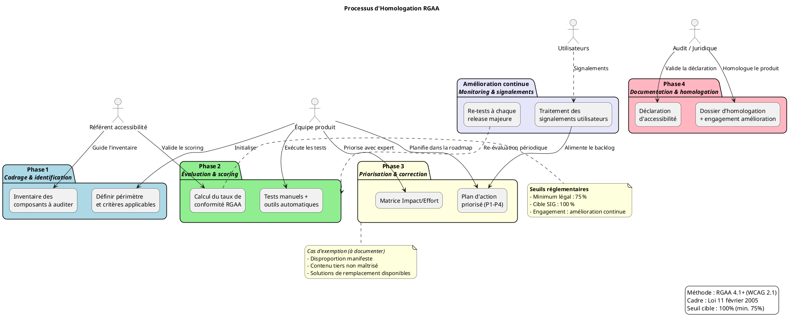

# 📄 Guide d’atelier d’homologation RGAA – **agile‑back**  

> **Document établi à partir des principes du RGAA 4.1+, déclinaison française des WCAG 2.1/2.2, conformément à la loi du 11 février 2005**  

---  

[TOC]

---  

## 1️⃣ Introduction et objectifs  

**Livrable** : *« Préparer et piloter l’homologation RGAA d’un produit numérique »*  

| Objectif | Description |
|----------|-------------|
| **Comprendre les obligations réglementaires** | Rappel du cadre légal (loi 2005, décret 2019‑768, arrêté 2021, directive UE 2016/2102) et des seuils de conformité : 75 % minimum, 100 % cible SIG |
| **Identifier les critères RGAA applicables** | Parcourir les 13 thèmes ; repérer les critères qui concernent le projet **agile‑back** (Symfony PHP, Twig, JS, CSS) |
| **Évaluer l’état de conformité actuel** | Faire un audit rapide (outils automatiques + tests manuels) et quantifier le taux de conformité |
| **Construire un plan d’action d’amélioration** | Prioriser les non‑conformités, estimer effort, assigner responsabilités |
| **Préparer la documentation d’homologation** | Déclaration d’accessibilité, dossier d’audit, suivi des signalements |

---  

## 2️⃣ Contexte d’usage  

| Élément | Valeur |
|---------|--------|
| **Nom du produit** | **agile‑back** |
| **Type de service** | Back‑office (Symfony 5, PHP 8, Twig, JavaScript) |
| **Public cible** | Administrateurs, agents publics, développeurs internes – incluant des utilisateurs en situation de handicap (visuel, moteur, cognitif) |
| **Environnement** | Serveur web Apache/Nginx, base PostgreSQL, authentification CAS, assets JS/CSS, templates Twig |
| **Périmètre à auditer** | Toutes les routes `/admin/*`, les formulaires de création/modification (abonnements, études, dotations, etc.), les pages d’aide et les mails HTML générés |
| **Contraintes techniques** | Utilisation du framework Symfony, des formulaires Symfony, du système de templating Twig, du CSS custom (`agile‑composants.css`) et du JavaScript (jQuery 1.12) |

### Cadre réglementaire  

| Texte | Référence |
|------|-----------|
| Loi n° 2005‑102 du 11 février 2005 | **Égalité des droits et des chances** |
| Décret n° 2019‑768 du 24 juillet 2019 | **Obligations de mise à disposition des outils de signalement** |
| Arrêté du 29 avril 2021 (RGAA 4.1) | **Référentiel général d’amélioration de l’accessibilité** |
| Directive (UE) 2016/2102 | **Accessibilité des sites et applications mobiles du secteur public** |
| WCAG 2.1 (niveau AA) | **Base technique internationale** |

### Quand l’utiliser  

| Phase du projet | Usage de l’atelier |
|-----------------|--------------------|
| **Avant le développement** | Intégrer les exigences d’accessibilité dans le cahier des charges et le Design System |
| **En cours de développement** | Vérifier la conformité des composants UI (formulaires, tableaux, menus) au fur et à mesure |
| **Avant mise en production** | Réaliser l’audit complet, établir la déclaration d’accessibilité, préparer le dossier d’homologation |
| **En exploitation** | Gérer les signalements, planifier les re‑tests à chaque version majeure |

### Seuils de conformité  

| Niveau | % de critères conformes | Commentaire |
|--------|------------------------|-------------|
| **Minimum légal** | **≥ 75 %** | Satisfait l’obligation de mise en conformité |
| **Cible SIG** | **100 %** | Objectif d’amélioration continue, indispensable pour les services publics |

---  

## 3️⃣ Pré‑requis  

> ✅ *Vérifiez chaque point avant de lancer l’atelier*  

- **[ ] Périmètre produit défini** : liste des URLs (`/admin/*`), des formulaires et des pages statiques à auditer.  
- **[ ] Publics utilisateurs identifiés** : personas incluant déficiences visuelles, motrices, cognitives, auditives.  
- **[ ] Stack technique documentée** : Symfony 5, Twig, PHP 8, jQuery 1.12, CSS (`agile‑composants.css`, `main.css`).  
- **[ ] État des lieux accessibilité** (si existant) : résultats d’audits antérieurs, tickets de signalement, rapports d’utilisateurs.  
- **[ ] Référentiel DSFR (ou équivalent)** : version utilisée, composants personnalisés (ex. tables, formulaires).  
- **[ ] Outils de test prêts** : Axe DevTools, Lighthouse, Wave, NVDA/VoiceOver, tests unitaires d’accessibilité (ex. `phpunit` + `pa11y`).  

> 💡 Si aucun audit préalable n’existe, prévoyez une **phase de scan rapide** avec les outils automatiques ci‑dessus pour identifier les blocages majeurs (images sans texte alternatif, contraste insuffisant, navigation clavier).

---  

## 4️⃣ Parties prenantes et rôles  

| Rôle | Profil type | Responsabilité dans l’atelier |
|------|-------------|------------------------------|
| **Animateur / Référent accessibilité** | Chef de projet / UX / Expert RGAA | Faciliter, expliquer les critères, arbitrer les priorités |
| **Développeur front / Tech Lead** | Symfony PHP / JavaScript | Évaluer la faisabilité des corrections, estimer l’effort |
| **Designer UX/UI** | Designer produit | Proposer des alternatives accessibles, valider les maquettes |
| **Juriste / Conformité** | RSSI / DPO / Responsable légal | Valider le cadre réglementaire, la déclaration d’accessibilité |
| **Représentant utilisateurs** *(optionnel)* | Personne en situation de handicap / Association | Apporter le retour d’usage réel, tester les scénarios |

> ☝️ *Un même collaborateur peut cumuler plusieurs rôles selon les effectifs.*

---  

## 5️⃣ Logistique  

| Élément | Détails |
|---------|----------|
| **Durée** | 3 h – 4 h (prévoir une pause de 15 min à mi‑parcours) |
| **Matériel physique** | Tableau blanc, post‑its 4 couleurs (Conforme / Non‑conforme / À vérifier / Hors périmètre), marqueurs |
| **Matériel digital** | Ordinateur avec accès au serveur de test, navigateur Chrome/Firefox, extensions Axe, Wave, NVDA/VoiceOver, accès au dépôt Gitlab |
| **Environnement** | Instance de pré‑production (identique à prod) avec données factices (ex. études, dotations) |
| **Livrable de sortie** | Matrice de conformité RGAA, plan d’action priorisé, brouillon de déclaration d’accessibilité |

---  

## 6️⃣ Déroulé détaillé de l’atelier  

> Les temps indiqués sont indicatifs et peuvent être adaptés.

### 🎯 Étape 1 – Cadrage réglementaire (30 min)  

1. Présenter le **cadre légal** (loi 2005, décret 2019, arrêté 2021, directive UE).  
2. Rappeler les **4 principes WCAG** appliqués au RGAA :  
   - **Perceptible** – informations présentées de façon perceptible.  
   - **Utilisable** – composants utilisables (clavier, souris, assistive).  
   - **Compréhensible** – contenu et interface compréhensibles.  
   - **Robuste** – interopérabilité avec les technologies d’assistance.  
3. Définir le **périmètre d’audit** : routes `/admin/*`, formulaires Symfony, pages Twig, mails HTML.  
4. **Exemple** : image du logo sans `alt` → impact sur les lecteurs d’écran.  

> ✅ *Note : Utilisez le tableau ci‑dessous pour recenser les pages et leurs URLs.*  

| Page | URL | Description |
|------|-----|-------------|
| Tableau de bord admin | `/admin/` | Vue d’ensemble, graphiques, menus |
| Gestion des études | `/admin/etudes/*` | Formulaires création/modif, listes |
| Gestion des dotations | `/admin/dotations/*` | Tableaux, filtres |
| Gestion des utilisateurs | `/admin/utilisateurs/*` | Formulaires, listes déroulantes |
| Mails HTML (templates) | `templates/emails/*.twig` | Notification d’événement |

### 🔍 Étape 2 – Identification des critères applicables (45 min)  

1. Parcourir les **13 thèmes RGAA** et cocher ceux qui s’appliquent à chaque page.  
2. Pour chaque thème, lister les **critères critiques** (ex. : 1.1 – texte alternatif, 9.1 – navigation clavier, 11.1 – libellés de formulaire).  
3. Remplir le tableau suivant (exemple pour la page *Gestion des études*) :

| Thème | Critère RGAA | Statut initial | Observation |
|-------|--------------|----------------|-------------|
| **Images** | 1.1 Alternative texte | ❓ À vérifier | Logo, icônes de bouton sans `alt` |
| **Couleurs** | 3.1 Contraste | ❌ Non‑conforme | Contrast ratio < 4.5 :1 sur les boutons |
| **Navigation** | 9.1 Navigation clavier | ✅ Conforme | Menus accessibles |
| **Formulaires** | 11.1 Libellés | ✅ Conforme | `{{ form_label() }}` utilisé |
| **Scripts** | 7.1 Mise à jour ARIA | ❓ À vérifier | Gestion dynamique du tableau “études” |

> 🛠 **Astuce** : utilisez les post‑its couleur ✅ Conforme, ❌ Non‑conforme, ⚠️ À vérifier, 🚫 Hors périmètre.

### 📊 Étape 3 – Évaluation et scoring (45 min)  

1. **Tests rapides** pour chaque critère “À vérifier” :  
   - **Manuel** : navigation au clavier, lecteur d’écran (NVDA/VoiceOver).  
   - **Automatique** : axe DevTools, Lighthouse (audit “Accessibility”).  
   - **Utilisateur** : tester un scénario avec une personne en situation de handicap (si possible).  
2. **Calcul du taux de conformité** :

```
Taux = (Nb critères conformes) / (Nb critères applicables) × 100
```

   - Exemple : 120 critères applicables, 95 conformes → **79 %** (dépassant le seuil minimum).  

3. **Identifier les écarts critiques** (non‑conformités bloquantes) :  
   - Images sans `alt` (`1.1`)  
   - Contraste insuffisant (`3.1`)  
   - Absence de gestion du focus (`9.2`)  
   - Tables sans résumé (`5.1`)  

> 💡 *Ne cherchez pas la perfection : l’objectif est d’obtenir une vue réaliste et un plan d’action.*  

### 🎚️ Étape 4 – Priorisation et plan d’action (45 min)  

#### Matrice Impact / Effort  

|  | **Faible effort** | **Fort effort** |
|---|-------------------|-----------------|
| **Fort impact** | 🔴 **Priorité 1** (quick wins) | 🟡 **Priorité 2** (investissements) |
| **Faible impact** | 🟢 **Priorité 3** (améliorations) | ⚪ **Priorité 4** (backlog) |

| Critère | Impact | Effort estimé | Priorité | Action corrective | Responsable | Échéance | Validation |
|---------|--------|---------------|----------|-------------------|-------------|----------|------------|
| 1.1 Alternative texte | Fort | Faible | 🔴 P1 | Ajouter `alt` aux logos, icônes (``) | Dev front | Sprint 1 | Test lecteur d’écran |
| 3.1 Contraste | Fort | Moyen | 🟡 P2 | Refonte CSS (`agile‑composants.css`) pour respecter 4.5 :1 | UI/UX | Sprint 2 | Axe contrast |
| 9.2 Gestion du focus | Fort | Fort | 🟡 P2 | Implémenter `focus-visible` sur les éléments interactifs | Dev front | Sprint 3 | Test clavier |
| 5.1 Résumé de tableau | Moyen | Faible | 🟢 P3 | Ajouter `<caption>` et `summary` aux tables Twig | Dev back | Sprint 4 | Vérif. Axe |

5. **Intégrer les actions** dans la **roadmap produit** (sprints, releases).  

### 🏁 Étape 5 – Documentation et homologation (30 min)  

1. **Déclaration d’accessibilité** (modèle obligatoire) :  
   - Taux de conformité : **79 %** (exemple)  
   - Liste des critères non‑conformes avec justification (ex. : impossibilité technique, contenu tiers)  
   - Moyen de contact : adresse e‑mail du DPO, formulaire de signalement (`/accessibilite/contact`)  
   - Voies de recours : Défenseur des droits, tribunal administratif  

2. **Dossier d’homologation** :  
   - Matrice de conformité détaillée (thème / critère / statut)  
   - Preuves de tests : captures d’écran, logs d’outils, rapports d’utilisateurs  
   - Plan d’amélioration continue (actions P1‑P4, dates)  

3. **Processus de suivi** :  
   - Re‑tests à chaque **release majeure** (ex. : v2.0)  
   - Circuit de traitement des signalements : formulaire → ticket Jira → correction → re‑test  
   - Mise à jour de la déclaration d’accessibilité (au moins une fois par an)  

> 📸 **Action immédiate** : partager le brouillon de déclaration avec le service juridique pour validation avant publication.

---  

## 7️⃣ Conseils de facilitation  

| Bonnes pratiques | À éviter |
|------------------|----------|
| Ancrer chaque critère dans un **scénario utilisateur réel** (ex. : créer une étude) | Se perdre dans le jargon technique du RGAA |
| Utiliser **exemples concrets** du produit (images, formulaires) | Confondre “conforme aux tests automatiques” et “accessible” |
| Impliquer les profils techniques dès l’évaluation | Reporter systématiquement les corrections “complexes” |
| Documenter les décisions d’exemption (si applicable) | Oublier de prévoir la mise à jour continue |
| Valider les corrections **manuellement** (NVDA/VoiceOver) et **automatiquement** (Axe) | Se fier uniquement aux scores automatiques |

---  

## 8️⃣ Exemple de matrice de conformité (simplifiée)  

> **⚠️ Cette matrice est à adapter page par page**  

### Thème 1 – Images  

| Critère RGAA | Statut | Observation | Action | Priorité |
|--------------|--------|-------------|--------|----------|
| 1.1 Alternative texte | ❌ Non‑conforme | Logo sans `alt` | Ajouter `alt="Logo AgileBack"` | 🔴 P1 |
| 1.2 Image porteuse d’info | ✅ Conforme | Icônes décoratives ont `alt=""` | – | – |
| 1.3 Image complexe | ⚠️ À vérifier | Graphiques de suivi de budget | Ajouter description longue + lien | 🟡 P2 |

### Thème 9 – Navigation  

| Critère RGAA | Statut | Observation | Action | Priorité |
|--------------|--------|-------------|--------|----------|
| 9.1 Navigation clavier | ✅ Conforme | Menus accessibles | – | – |
| 9.2 Gestion du focus | ❌ Non‑conforme | Pas de style `:focus-visible` | Ajouter CSS `:focus-visible` | 🟡 P2 |
| 9.3 Liens “Aller au contenu” | ⚠️ À vérifier | Présent mais invisible au focus | Rendre visible (`outline: 2px solid #000`) | 🟢 P3 |

---  

## 9️⃣ Diagramme PlantUML du processus d’homologation RGAA  



---  

## 10️⃣ Adaptations contextuelles  

| Contexte | Adaptation recommandée |
|----------|----------------------|
| **Nouveau produit** | Intégrer l’accessibilité dès la conception : design system DSFR, composants Twig accessibles, validation des couleurs (`contrast‑checker`) |
| **Refonte / Legacy** | Audit complet, corriger d’abord les critères bloquants (images, contrast, navigation clavier), puis migrer progressivement les composants |
| **Application mobile** | Adapter les critères scripts (thème 7) aux gestes, tailles de cibles, VoiceOver/ TalkBack |
| **Contenu dynamique (AJAX)** | Vérifier la mise à jour ARIA (`aria-live`, `role="alert"`), focus après insertion DOM |
| **Contrainte de délai court** | Cibler les critères “bloquants” (images, contraste, navigation) pour atteindre rapidement les 75 % |

---  

## 11️⃣ Livrables et suite du projet  

| Livrable | Contenu |
|----------|---------|
| **Matrice de conformité RGAA** | Tableaux par thème/critère, statut, observations, actions |
| **Plan d’action priorisé** | Priorités P1‑P4, responsables, échéances, critères de validation |
| **Déclaration d’accessibilité (brouillon)** | Taux de conformité, critères non conformes, contacts, voies de recours |
| **Dossier d’homologation** | Matrice, preuves de tests, plan d’amélioration, accords juridiques |
| **Procédure de suivi** | Re‑tests à chaque release, circuit de traitement des signalements, mise à jour de la déclaration |

### Prochaines étapes suggérées  

1. **Validation juridique** de la déclaration d’accessibilité.  
2. **Intégration des actions P1** dans le sprint 1 (ajout `alt`, correction de contraste).  
3. **Formation** de l’équipe aux bonnes pratiques (focus, ARIA, contraste).  
4. **Mise en place de tests automatisés** d’accessibilité dans la CI/CD (ex. : `pa11y-ci`).  
5. **Publication** de la déclaration sur le site (`/accessibilite`) dès que le taux ≥ 75 %.  

---  

## 📚 Mini‑glossaire  

| Terme | Définition |
|-------|------------|
| **Alternative textuelle** (`alt`) | Description concise d’une image destinée aux lecteurs d’écran. |
| **ARIA** | *Accessible Rich Internet Applications* – attributs HTML pour améliorer l’interaction avec les technologies d’assistance. |
| **Focus** | Indicateur visuel du contrôle actuellement sélectionné au clavier. |
| **Contraste** | Rapport de différence de luminosité entre texte et arrière‑plan (minimum 4.5 :1 AA). |
| **WCAG** | *Web Content Accessibility Guidelines* – normes internationales (niveau A, AA, AAA). |
| **RGAA** | *Référentiel Général d’Amélioration de l’Accessibilité* – version française de WCAG. |
| **SIG** | *Schéma d’Information Gouvernemental* – cible de 100 % conformité avec amélioration continue. |
| **NVDA / VoiceOver** | Lecteurs d’écran libres (Windows) et intégrés (macOS). |
| **Quick win** | Action à faible effort, fort impact, réalisable rapidement. |

---  

## 📌 Conclusion  

Cet atelier vous fournit une démarche structurée, adaptable à **agile‑back**, pour :

* **Diagnostiquer** les points d’accessibilité,  
* **Quantifier** le taux de conformité,  
* **Prioriser** les correctifs avec la matrice Impact/Effort,  
* **Formaliser** la déclaration d’accessibilité et le dossier d’homologation,  
* **Assurer** la pérennité via un processus de suivi continu.  

En suivant ce guide, vous serez en mesure de répondre aux exigences du **RGAA 4.1+**, d’obtenir le **minimum légal (75 %)** rapidement, puis d’atteindre la **cible SIG (100 %)** grâce à une amélioration continue intégrée à votre cycle de développement.  

---  

*Bon atelier !*   🎉  