# 📋 Guide d’atelier d’homologation RGAA pour **agile‑back**  
*Document établi à partir des principes du **RGAA 4.1+**, déclinaison française des WCAG 2.1/2.2, conformément à la loi du 11 février 2005.*

---  

## 📚 Table des matières
[TOC]

---  

## 1️⃣ Introduction et objectifs  

**Livrable :** *« Préparer et piloter l’homologation RGAA du produit numérique agile‑back »*  

| Objectif | Description |
|----------|-------------|
| **O1 – Comprendre le cadre légal** | Rappel des obligations (loi 2005, décret 2019, arrêté 2021, directive UE 2016/2102) et des seuils de conformité (≥ 75 % obligatoire, 100 % cible SIG). |
| **O2 – Identifier les critères RGAA applicables** | Parcourir les 13 thèmes RGAA pour le back‑office Symfony (HTML/Twig, formulaires, tables, navigation, scripts, couleur, etc.). |
| **O3 – Évaluer l’état actuel** | Auditer rapidement (outils automatiques + tests manuels) les pages d’administration, les formulaires et les composants UI. |
| **O4 – Prioriser les actions** | Matrice Impact / Effort → plan d’actions (quick‑wins, corrections majeures). |
| **O5 – Formaliser la déclaration** | Rédiger la Déclaration d’accessibilité, le Dossier d’homologation et le plan d’amélioration continue. |

---  

## 2️⃣ Contexte d’usage  

| Élément | Valeur |
|---------|--------|
| **Produit** | **agile‑back** – back‑office de l’application *Agile* (Symfony 5, PHP 8, Twig). |
| **Type de livrable** | Application web interne (admin) accessible depuis un navigateur classique. |
| **Public cible** | Administrateurs et agents de l’État (personnes en situation de handicap visuel, moteur, cognitif). |
| **Cadre réglementaire** | - Loi n° 2005‑102 du 11 février 2005 <br> - Décret n° 2019‑768 du 24 juillet 2019 <br> - Arrêté du 29 avril 2021 (RGAA 4.1) <br> - Directive (UE) 2016/2102 |
| **Quand l’utiliser** | 1️⃣ **En amont** du développement d’une nouvelle fonctionnalité (intégrer l’accessibilité). <br>2️⃣ **En cours** de sprint (vérifier les composants). <br>3️⃣ **Avant mise en prod** (audit final, déclaration). <br>4️⃣ **En exploitation** (gestion des signalements). |
| **Seuils de conformité** | - **Minimum légal** : 75 % de critères conformes. <br> - **Cible SIG** : 100 % + processus d’amélioration continue. |

---  

## 3️⃣ Pré‑requis  

- [ ] **Périmètre défini** : URLs des pages d’administration (`/admin/*`), formulaires (`*_form.html.twig`), listes (`*_index.html.twig`).  
- [ ] **Publics utilisateurs** : Personas (admin avec déficiences visuelles, motrices, cognitives).  
- [ ] **Stack technique documentée** : PHP 8, Symfony 5, Twig, Bootstrap 4 (ou CSS custom), jQuery 1.12, assets dans `public/`.  
- [ ] **État des lieux** (si existant) : dernier audit, tickets d’accessibilité, retours utilisateurs.  
- [ ] **Design System** (facultatif) : DSFR ou composant interne (`agile‑composants.css`).  

> 💡 *Si aucun audit préalable n’existe, prévoir un « scan rapide » avec Axe, Lighthouse ou Pa11y pour repérer les blocages majeurs.*  

---  

## 4️⃣ Parties prenantes et rôles  

| Rôle | Profil type | Responsabilité pendant l’atelier |
|------|-------------|---------------------------------|
| **Animateur / Référent accessibilité** | Chef de projet / UX / Expert RGAA | Facilite, explique les critères, arbitrage des priorités. |
| **Développeur front** | Symfony / Twig / JS | Vérifie la faisabilité technique, estime l’effort, corrige le code. |
| **Développeur back** | PHP / Doctrine | Gère les attributs ARIA dans les réponses JSON, assure la conformité des API. |
| **Designer UI/UX** | UI‑Designer, DSFR | Propose des alternatives accessibles (contraste, libellés, focus). |
| **Juriste / Conformité** | RSSI / DPO / Responsable légal | Valide le cadre juridique, valide la Déclaration d’accessibilité. |
| **Représentant utilisateurs** *(optionnel)* | Personne en situation de handicap, association | Teste les scénarios réels, apporte un retour d’usage. |

> ☝️ *Un même collaborateur peut cumuler plusieurs rôles selon les ressources disponibles.*  

---  

## 5️⃣ Logistique  

| Élément | Détail |
|--------|--------|
| **Durée** | 3 h – 4 h (prévoir une pause de 15 min à mi‑parcours). |
| **Matériel physique** | Tableau blanc, post‑its (4 couleurs : Conformité / Non‑conformité / À vérifier / Hors périmètre), marqueurs, projecteur. |
| **Matériel digital** | Ordinateur avec accès au dépôt Git, navigateur (Chrome / Firefox) + extensions Axe DevTools, Lighthouse, ou **pa11y-ci**. |
| **Environnement de test** | Instance de pré‑production (base de données anonymisée). |
| **Livrable de sortie** | - Matrice de conformité RGAA (détaillée par thème/critère) <br> - Plan d’action priorisé (P1‑P4) <br> - Brouillon de déclaration d’accessibilité (à valider juridiquement). |

---  

## 6️⃣ Déroulé détaillé de l’atelier  

### 🎯 Étape 1 – Cadrage réglementaire (30 min)

1. **Présenter le cadre légal** (loi 2005, décret 2019, arrêté 2021, directive UE).  
2. **Rappeler les 4 principes WCAG** appliqués au RGAA :  
   - **Perceptible** – contenu visible et audible.  
   - **Utilisable** – navigation clavier, focus visible.  
   - **Compréhensible** – libellés clairs, instructions.  
   - **Robuste** – compatibilité avec les AT (NVDA, VoiceOver).  
3. **Définir le périmètre d’audit** : toutes les routes sous `/admin/*`, les formulaires Twig (`*_form.html.twig`), les pages d’index, les scripts JS (ex : `detail.js`, `fonct_onglets.js`).  

> ✅ *Exemple concret : image du logo dans `templates/base_admin.html.twig` sans attribut `alt` → impact réel sur les lecteurs d’écran.*  

---

### 🔍 Étape 2 – Identification des critères applicables (45 min)

| Thème RGAA | Exemples de critères pertinents pour **agile‑back** |
|------------|------------------------------------------------------|
| **1 – Images** | 1.1 Alternative texte ; 1.2 Image porteuse d’information ; 1.3 Image décorative (`alt=""`). |
| **2 – Cadres** | 2.1 Titre de cadre (`<fieldset>` / `<legend>`). |
| **3 – Couleurs** | 3.1 Contraste texte/fond ≥ 4,5:1 (AA). |
| **4 – Multimédia** | 4.1 Sous‑titres ou transcription pour vidéos (s’il y en a). |
| **5 – Tableaux** | 5.1 En‑tête de tableau (`<th>`), 5.2 Résumé de tableau. |
| **6 – Liens** | 6.1 Texte de lien explicite, 6.2 Titre de lien (si nécessaire). |
| **7 – Scripts** | 7.1 Gestion du focus dynamique, 7.2 ARIA `role`/`aria‑label`. |
| **9 – Navigation** | 9.1 Navigation clavier (menu, onglets), 9.2 Lien « Aller au contenu ». |
| **11 – Formulaires** | 11.1 Labels associés (`<label for="">`), 11.2 Messages d’erreur accessibles, 11.3 Groupes de champs (`<fieldset>`). |
| **12 – Structuration** | 12.1 Hiérarchie des titres (`<h1>`‑`<h6>`). |
| **13 – Information & consultation** | 13.1 Langue du document (`lang`), 13.2 Métadonnées (`<meta charset>`). |

*Méthode :* parcourir chaque thème, cocher **Conforme**, **Non‑conforme**, **À vérifier**, **Hors périmètre** dans un tableau partagé (Miro, FigJam, ou tableau blanc).  

---

### 📊 Étape 3 – Évaluation et scoring (45 min)

1. **Tests rapides** pour chaque critère :  
   - **Manuel** : navigation clavier (`Tab`), activation du lecteur d’écran (NVDA).  
   - **Automatique** : Axe DevTools (extension Chrome) sur les pages d’index et de formulaire.  
   - **UX + Utilisateur** : scénarios de création d’une étude (`templates/etudes/new.html.twig`).  
2. **Calcul du taux de conformité** :  

```text
Taux = (Nb critères conformes) / (Nb critères applicables) × 100
```

3. **Identifier les écarts critiques** (ex. : absence d’alternative texte sur le logo, focus invisible sur les onglets, contraste insuffisant sur les boutons `.btn`).  

> 💡 *Ne pas viser la perfection immédiate : l’objectif est une vue d’ensemble réaliste pour planifier les correctifs.*  

---

### 🎚️ Étape 4 – Priorisation et plan d’action (45 min)

| Impact / Effort | Faible effort | Fort effort |
|----------------|--------------|------------|
| **Fort impact** | 🔴 **P1 – Quick wins** (ex. : ajouter `alt=""` aux logos, ajouter `label` aux champs de formulaire, corriger le contraste des boutons). | 🟡 **P2 – Corrections majeures** (ex. : refactoriser les menus d’onglets pour gérer le focus, ajouter ARIA `role="navigation"` aux barres latérales). |
| **Faible impact** | 🟢 **P3 – Améliorations** (ex. : améliorer la lisibilité des messages d’erreur, ajouter des titres aux tables). | ⚪ **P4 – Backlog** (ex. : refonte complète du thème CSS, optimisation des couleurs du design system). |

**Pour chaque action P1/P2 :**

| Action | Responsable | Échéance | Critère de validation |
|--------|--------------|----------|-----------------------|
| Ajouter `alt` aux images du logo (`templates/base_admin.html.twig`). | Dév. Front | Sprint +1 | Test Axe → pass. |
| Ajouter `<label for="">` aux champs du formulaire `EtudesType`. | Dév. Front | Sprint +1 | Lecture NVDA → nom du champ lu. |
| Corriger le contraste du bouton `.btn` (`public/style/agile-composants.css`). | Dév. Front | Sprint +2 | Contrast‑Checker ≥ 4,5:1. |
| Implémenter focus visible sur les onglets (`public/js/fonct_onglets.js`). | Dév. Front | Sprint +2 | Tabulation → focus visible. |
| Ajouter `role="navigation"` au `<nav>` principal (`templates/base_admin.html.twig`). | Dév. Front | Sprint +2 | Axe → no ARIA‑role‑missing. |

Intégrer les actions dans le **backlog produit** (Jira, Trello…) et les planifier dans les prochains sprints.  

---

### 🏁 Étape 5 – Documentation et homologation (30 min)

1. **Déclaration d’accessibilité** (modèle officiel) :  
   - **État de conformité** : `XX % de critères conformes`.  
   - **Critères non conformes** : liste, justification (ex. : “exemption technique, impossibilité de modifier le composant tiers”).  
   - **Moyens de contact** : adresse mail du responsable accessibilité.  
   - **Voies de recours** : Défenseur des droits, médiateur.  
2. **Dossier d’homologation** :  
   - Matrice de conformité détaillée (ex. : tableau ci‑dessous).  
   - Preuves de tests (captures d’écran Axe, logs de tests automatisés, retours utilisateurs).  
   - Plan d’amélioration continue (roadmap, fréquence des re‑tests).  
3. **Processus de suivi** :  
   - **Re‑tests** à chaque release majeure (ex. : chaque version `vX.Y`).  
   - **Circuit de traitement** des signalements (ticket JIRA → assignation → correction → validation).  
   - **Mise à jour** de la déclaration sur le site public (page “Accessibilité”).  

> 📸 *Action immédiate* : partager le brouillon de déclaration avec le service juridique pour validation avant publication.  

---  

## 7️⃣ Conseils de facilitation  

| Bonnes pratiques | À éviter |
|------------------|----------|
| Ancrer chaque critère dans un **scénario utilisateur réel** (ex. : création d’une étude). | Se perdre dans le jargon technique du RGAA sans le relier à l’usage. |
| Utiliser **exemples concrets** (logo, champ de formulaire) pour illustrer les non‑conformités. | Confondre “conforme aux tests automatiques” et “accessible pour les personnes handicapées”. |
| Impliquer les **développeurs** dès l’évaluation des critères (faisabilité). | Reporter systématiquement les corrections “complexes”. |
| Documenter **toutes les décisions d’exemption** (justifications). | Oublier de prévoir la mise à jour continue du suivi. |
| **Valider** chaque correction avec un test manuel + outil (NVDA + Axe). | Se fier uniquement aux scores d’outils automatisés. |

---  

## 8️⃣ Exemple de matrice de conformité (simplifiée)

| Thème | Critère RGAA | Statut | Observation | Action | Priorité |
|------|--------------|--------|-------------|--------|----------|
| **Images** | 1.1 – Alternative texte | ❌ Non‑conforme | Logo `` sans `alt`. | Ajouter `alt="Logo Agile‑back"` | 🔴 P1 |
| **Couleurs** | 3.1 – Contraste | ⚠️ À vérifier | Bouton `.btn` contraste 3,2 : 1. | Ajuster couleur de fond ou texte. | 🟡 P2 |
| **Formulaires** | 11.1 – Labels associés | ✅ Conforme | Tous les champs ont `<label for="">`. | – | – |
| **Navigation** | 9.1 – Navigation clavier | ❌ Non‑conforme | Onglets (`fonct_onglets.js`) ne gèrent pas le focus. | Ajouter gestion du focus et style `:focus-visible`. | 🔴 P1 |
| **Scripts** | 7.2 – ARIA `role`/`aria‑label` | ⚠️ À vérifier | Menu latéral sans `role="navigation"`. | Ajouter attribut `role`. | 🟢 P3 |

*(À adapter et compléter pendant l’atelier.)*  

---  

## 9️⃣ Diagramme Mermaid du processus d’homologation RGAA  

```mermaid
graph TB
    %% Acteurs
    team["👥 Équipe produit"]
    ref["🎓 Référent accessibilité"]
    dev["💻 Développeur"]
    jur["⚖️ Juriste"]
    user["👤 Représentant utilisateurs"]

    %% Phases
    subgraph phase1["Phase 1 – Cadrage"]
        step1["📋 Définir périmètre & critères"]
        step2["📦 Inventaire des composants"]
    end

    subgraph phase2["Phase 2 – Évaluation"]
        step3["🧪 Tests (manuel + outils)"]
        step4["📊 Calcul du taux de conformité"]
    end

    subgraph phase3["Phase 3 – Priorisation"]
        step5["⚠️ Matrice Impact/Effort"]
        step6["📝 Plan d’action (P1‑P4)"]
    end

    subgraph phase4["Phase 4 – Documentation"]
        step7["📘 Déclaration d’accessibilité"]
        step8["📜 Dossier d’homologation"]
    end

    subgraph loop["Amélioration continue"]
        monitor["🔄 Re‑tests à chaque release"]
        feedback["💬 Traitement des signalements"]
    end

    %% Flux
    team -->|Initie| step1
    ref -->|Guide| step2
    dev -->|Exécute| step3
    ref -->|Valide| step4
    team -->|Priorise| step5
    team -->|Planifie| step6
    jur -->|Valide| step7
    jur -->|Homologue| step8
    user -.->|Signalements| feedback
    feedback -->|Alimente backlog| step6
    monitor -.->|Re‑évaluation périodique| step3

    %% Styles
    classDef acteur fill:#E3F2FD,stroke:#1976D2,stroke-width:2px;
    classDef phase1 fill:#ADD8E6,stroke:#333,stroke-width:2px;
    classDef phase2 fill:#90EE90,stroke:#333,stroke-width:2px;
    classDef phase3 fill:#FFFFE0,stroke:#333,stroke-width:2px;
    classDef phase4 fill:#FFB6C1,stroke:#333,stroke-width:2px;
    classDef loop fill:#E6E6FA,stroke:#333,stroke-width:2px;

    class team,ref,dev,jur,user acteur;
    class step1,step2 phase1;
    class step3,step4 phase2;
    class step5,step6 phase3;
    class step7,step8 phase4;
    class monitor,feedback loop;
```



---  

## 10️⃣ Adaptations contextuelles  

| Contexte | Adaptation recommandée |
|---------|-----------------------|
| **Nouveau produit** | Intégrer le DSFR ou un Design System accessible dès la conception (composants ARIA, contraste, focus). |
| **Refonte / Legacy** | Commencer par un **audit complet** (outils + revue manuelle) → prioriser les critères bloquants (ex. : navigation clavier, images). |
| **Application mobile** | Adapter les critères scripts (thème 7) aux gestes, taille des cibles, VoiceOver/TalkBack. |
| **Contenu dynamique** (ex. : tableaux filtrables) | Vérifier les mises à jour ARIA (`aria-live`, `role="grid"`). |
| **Contraintes de délai** | Cibler les **quick wins** (images, labels, contraste) pour atteindre rapidement les 75 % obligatoires. |

---  

## 11️⃣ Livrables et suite du projet  

| Livrable | Contenu | Date cible |
|----------|---------|------------|
| **Matrice de conformité RGAA** | Tableur détaillé (thème/critère, statut, actions, priorité). | Fin de l’atelier. |
| **Plan d’action priorisé** | Liste P1‑P4, responsables, échéances, critères de recette. | Sprint +1. |
| **Brouillon Déclaration d’accessibilité** | Texte conforme au modèle officiel, à valider par le juriste. | Sprint +2. |
| **Dossier d’homologation** | Matrice + preuves (captures Axe, logs, retours utilisateurs). | Version 1.0 du produit. |
| **Processus de suivi** | Circuit de traitement des signalements, fréquence de re‑tests. | À intégrer dans le SOP. |
| **Roadmap d’amélioration** | Planning pluriannuel (cible SIG 100 %). | 6 mois → 1 an. |

**Prochaines étapes suggérées**  

1. **Validation juridique** de la déclaration (juriste).  
2. **Intégration des actions P1** dans le prochain sprint (développeurs).  
3. **Formation interne** (atelier pratique Axe, bonnes pratiques Twig).  
4. **Mise en place de tests d’accessibilité automatisés** dans le pipeline CI/CD (pa11y-ci, axe‑core).  
5. **Publication** de la déclaration sur le site public et communication aux usagers.  

---  

## 📖 Mini‑glossaire  

| Terme | Définition |
|------|------------|
| **Alternative textuelle** | Texte (`alt`) décrivant le contenu d’une image pour les lecteurs d’écran. |
| **ARIA** | *Accessible Rich Internet Applications* – attributs (`role`, `aria‑label`, `aria‑hidden`) pour enrichir la sémantique HTML. |
| **Focus** | Indicateur visuel du contrôle actif (clé pour la navigation clavier). |
| **Contrast AA / AAA** | Ratio de contraste couleur texte/fond requis par WCAG 2.1 (AA ≥ 4,5 : 1, AAA ≥ 7 : 1). |
| **NVDA / VoiceOver** | Lecteurs d’écran libres (Windows) et natifs (macOS). |
| **Quick win** | Correction rapide à fort impact, faible effort. |
| **SIG** | *Système d’Information de Gestion* (cible 100 % conformité). |
| **Déclaration d’accessibilité** | Document public obligatoire décrivant le niveau de conformité et les moyens de contact. |
| **Dossier d’homologation** | Ensemble des preuves (tests, matrices, plan d’action) soumis à l’audit officiel. |

---  

## 📌 Mention légale  

*Document établi à partir des principes du **RGAA 4.1+**, déclinaison française des WCAG, conformément à la loi du 11 février 2005.*  

---  

*Ce guide est immédiatement opérationnel : il suffit de remplacer les éléments entre crochets `[ … ]` par les informations propres à votre projet (ex. : dates, noms de responsables, URLs). Bon atelier ! 🚀*  