# Spécification fonctionnelle et technique de l’application **agile‑back**

> **Document auto‑porté** – Tous les diagrammes sont exprimés en PlantUML (`@startuml … @enduml`).  
> Aucun lien externe n’est requis ; les seules références externes sont les liens officiels vers la documentation **arc42**.  
> Les ancres Markdown (`[↩ Retour au sommaire](#sommaire)`) permettent une navigation complète dans VS Code ou Obsidian.

---

## 📑 Sommaire  

1. [Introduction](#introduction)  
2. [Portée, domaine et périmètre](#portée-domaine-et-périmètre)  
3. [Architecture fonctionnelle (arc42)](#architecture-fonctionnelle-arc42)  
   3.1. [Acteurs](#acteurs) – 3.2. [Cas d’usage](#cas-dusage) – 3.3. [Scénarios principaux](#scénarios-principaux) – 3.4. [Règles métier (tableaux de décision)](#règles-métier) – 3.5. [Diagrammes de séquence critiques](#diagrammes-de-séquence) – 3.6. [Diagrammes swimlane](#diagrammes-swimlane)  
4. [Architecture technique](#architecture-technique)  
   4.1. [Architecture logique (composants)](#architecture-logique) – 4.2. [Architecture physique (déploiement)](#architecture-physique) – 4.3. [Flux de données (DFD)](#flux-de-données) – 4.4. [Analyse de sécurité](#analyse-de-sécurité) – 4.5. [Dette technique identifiée](#dette-technique)  
5. [Modèle de données (schéma relationnel simplifié)](#modèle-de-données)  
6. [Interfaces externes (CAS SSO)](#interfaces-externes)  
7. [Qualité et conformité (ISO/IEC/IEEE 29148)](#qualité-et-conformité)  
8. [Annexes – Code PlantUML complet](#annexes)  

---

## 1️⃣ Introduction <a id="introduction"></a>

| Élément | Description |
|---|---|
| **Nom de l’application** | **agile‑back** – back‑office de la plateforme *Agile* |
| **Domaine applicatif** | **Archivage physique** de documents d’études, de demandes de financement et de mouvements de fonds. |
| **Contexte opérationnel** | Site **SIT_ID = 29**, base de données **Oracle prep37** (historique ; la version actuelle utilise PostgreSQL via le driver `pdo_pgsql` mais conserve la logique métier orientée Oracle). |
| **Technologies principales** | PHP 8, Symfony 5, PostgreSQL (compatible Oracle via ODP), JavaScript (jQuery), CSS, PlantUML pour la documentation. |
| **Public visé** | Administrateurs métier, agents de suivi de financement, auditeurs de conformité. |
| **Références** | Documentation arc42 : <https://arc42.org> (structure de ce document). |

↩ **[Retour au sommaire](#sommaire)**  

---

## 2️⃣ Portée, domaine et périmètre <a id="portée-domaine-et-périmètre"></a>

### 2.1 Domaine : archivage physique  
L’application **agile‑back** assure la **gestion, la traçabilité et la conservation** des artefacts liés aux études (documents, justificatifs, rapports) ainsi que les **versements** (paiements) et **mouvements** financiers associés.

### 2.2 Contexte opérationnel  
- **Site :** SIT_ID = 29 (environnement de production).  
- **Base de données :** Oracle `prep37` (historique) – le schéma logique a été migré vers PostgreSQL mais les scripts d’accès restent compatibles avec Oracle via le driver Doctrine.  

### 2.3 Périmètre fonctionnel  

| Inclus | Exclu |
|---|---|
| • **Versements** (enregistrement, validation, suivi) <br>• **Demandes** (création/modification d’études, financement, dotation) <br>• **Mouvements** (historique des transferts, état des comptes) | • Gestion des **patients** <br>• **Facturation** détaillée (hors versements) <br>• **Workflow avancé** (états complexes, approbation multi‑niveau) |

↩ **[Retour au sommaire](#sommaire)**  

---

## 3️⃣ Architecture fonctionnelle (arc42) <a id="architecture-fonctionnelle-arc42"></a>

### 3.1 Acteurs <a id="acteurs"></a>

| Acteur | Rôle |
|---|---|
| **Administrateur** | Gère les référentiels (groupes, thèmes, services), crée/édite les études, valide les versements. |
| **Agent de financement** | Saisit les demandes de financement, affecte les dotations, génère les mouvements de fonds. |
| **Auditeur** | Consulte les historiques, exporte les données (CSV/ODS) pour contrôle. |
| **Système d’authentification CAS** | Authentifie les utilisateurs via Single Sign‑On. |
| **Base de données Oracle / PostgreSQL** | Persiste les entités métier. |

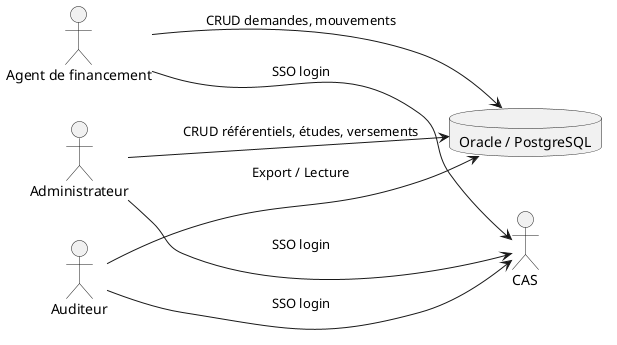

↩ **[Retour au sommaire](#sommaire)**  

### 3.2 Cas d’usage <a id="cas-dusage"></a>

| ID | Nom du cas d’usage | Acteur principal | Description |
|---|---|---|---|
| UC‑01 | **Se connecter (CAS)** | Tous | L’utilisateur est authentifié via le serveur CAS. |
| UC‑02 | **Créer / Modifier une étude** | Administrateur | Saisie des métadonnées, pièces jointes, affectation à un groupe/thème. |
| UC‑03 | **Déposer une demande de financement** | Agent de financement | Sélection d’une dotation, saisie du montant, validation. |
| UC‑04 | **Enregistrer un versement** | Administrateur / Agent | Saisie du mouvement de fonds, génération d’un numéro de transaction. |
| UC‑05 | **Exporter les données** | Auditeur | Génération de fichiers CSV ou ODS à partir des études ou des versements. |
| UC‑06 | **Consulter l’historique** | Tous | Visualisation des logs d’audit, état des mouvements. |

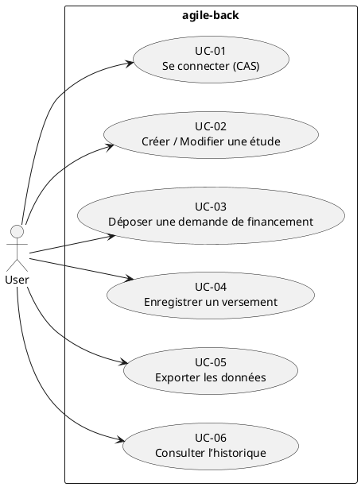

↩ **[Retour au sommaire](#sommaire)**  

### 3.3 Scénarios principaux <a id="scénarios-principaux"></a>

#### SC‑01 – Création d’une étude  

| Étape | Action | Système |
|---|---|---|
| 1 | L’administrateur ouvre le formulaire *Nouvelle étude* (`/etudes/new`). | Le contrôleur `EtudesController::new()` charge le formulaire Symfony (`EtudesType`). |
| 2 | Saisie des champs (titre, zone géographique, groupe, thème, etc.). | Validation côté serveur via les contraintes Doctrine. |
| 3 | Soumission du formulaire. | `EtudesController::new()` persiste l’entité `Etudes` via `EntityManager`. |
| 4 | Enregistrement d’un **audit log** (`Evenements`). | Service `SiteUpdateAlertes` notifie les abonnés. |
| 5 | Retour à la liste avec message de succès. | Vue `etudes/index.html.twig` affichée. |

#### SC‑02 – Enregistrement d’un versement  

| Étape | Action | Système |
|---|---|---|
| 1 | L’agent ouvre *Nouveau versement* (`/financements/new`). | `FinancementsController::new()` charge le formulaire `FinancementsType`. |
| 2 | Sélection d’une dotation, saisie du montant, date de décision. | Validation business (montant ≤ dotation disponible). |
| 3 | Soumission → création de l’entité `Financements`. | `FinancementsRepository::save()`. |
| 4 | Génération d’un **mouvement** (`Evenements`). | Service `SiteUpdateMailer` envoie un email de confirmation. |
| 5 | Export CSV possible via `ExportOdsDtoController`. | Le fichier est stocké dans `/public/exports`. |

↩ **[Retour au sommaire](#sommaire)**  

### 3.4 Règles métier (tableaux de décision) <a id="règles-métier"></a>

#### Table 1 – Validation du montant d’un financement

| Condition | Dotation disponible | Montant demandé | Résultat |
|---|---|---|---|
| **C1** | ≥ Montant demandé | – | **OK** – le financement est accepté. |
| **C2** | < Montant demandé | – | **KO** – le système refuse et renvoie l’erreur *“Montant supérieur à la dotation disponible”*. |
| **C3** | Dotation inexistante | – | **KO** – *“Aucune dotation sélectionnée”*. |

```plantuml
@startuml
title Validation du montant d’un financement
|Condition|
|C1|Dotation disponible ≥ Montant demandé|OK|
|C2|Dotation disponible < Montant demandé|KO|
|C3|Dotation inexistante|KO|
@enduml
```

#### Table 2 – Gestion du statut de l’étude

| Action | Statut actuel | Nouveau statut | Règle |
|---|---|---|---|
| Soumission | *Brouillon* | *En cours* | L’étude doit contenir au moins un titre et un groupe. |
| Validation | *En cours* | *Validée* | L’utilisateur doit être **Administrateur** et la date de décision renseignée. |
| Clôture | *Validée* | *Archivée* | Aucun versement en attente et la période de clôture dépassée. |

```plantuml
@startuml
title Gestion du statut de l’étude
[*] --> Brouillon
Brouillon --> En cours : Soumission (titre + groupe)
En cours --> Validée : Validation (admin + date)
Validée --> Archivée : Clôture (pas de versement)
@enduml
```

↩ **[Retour au sommaire](#sommaire)**  

### 3.5 Diagrammes de séquence (workflows critiques) <a id="diagrammes-de-séquence"></a>

#### DS‑01 – Authentification CAS → Accès à l’application  

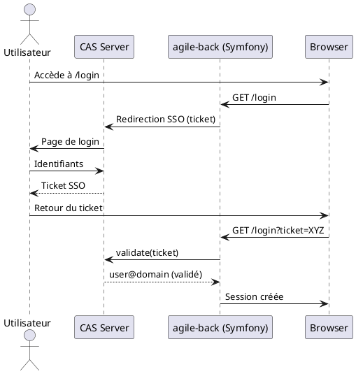

#### DS‑02 – Création d’un versement et génération d’un événement  

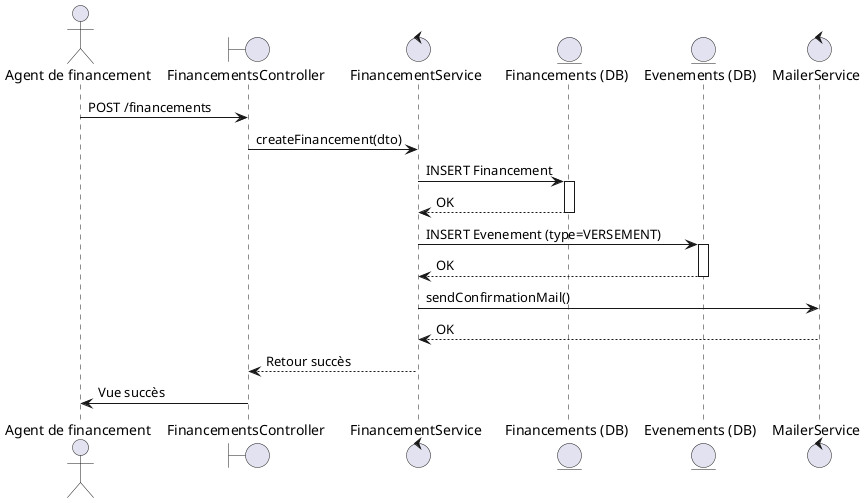

↩ **[Retour au sommaire](#sommaire)**  

### 3.6 Diagrammes *swimlane* (processus de traitement d’une demande) <a id="diagrammes-swimlane"></a>

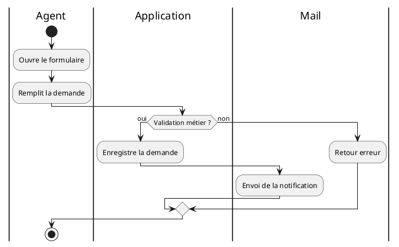

↩ **[Retour au sommaire](#sommaire)**  

---

## 4️⃣ Architecture technique <a id="architecture-technique"></a>

### 4.1 Architecture logique (composants) <a id="architecture-logique"></a>

| Niveau | Composant (package) | Description | Points d’entrée |
|---|---|---|---|
| **Web** | `src/Controller/*` | Contrôleurs Symfony (REST/HTML). | Routes définies dans `config/routes/annotations.yaml`. |
| **Domain** | `src/Entity/*` <br> `src/Dto/*` | Modélisation métier (Entités, DTO). | `Doctrine ORM`. |
| **Application** | `src/Form/*` <br> `src/Repository/*` <br> `src/Service/*` | Formulaires, logique d’accès DB, services métier (ex. `SiteUpdateMailer`, `Valorisation`). | Invoqués par les contrôleurs. |
| **Infrastructure** | `config/*` <br> `public/*` | Configuration (Doctrine, security, CORS), assets statiques, CAS client (`public/cas`). | Symfony Kernel. |
| **Cross‑cutting** | `src/EventListener/*` <br> `src/EventSubscriber/*` | Listeners/Subscriber (pagination, audit). | Événements Symfony. |

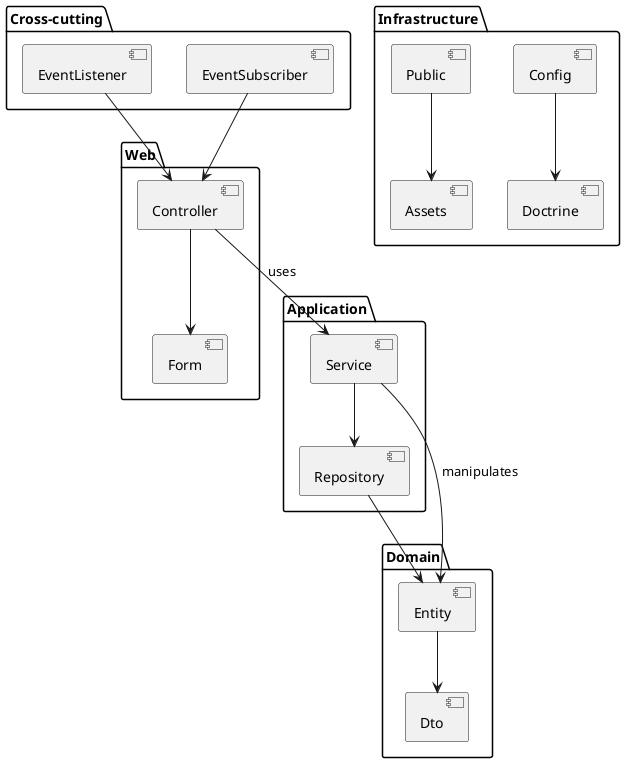

#### Principaux modules

| Module | Fichier(s) clé | Fonction |
|---|---|---|
| **Authentification** | `public/cas/connexionCAS.php`, `config/packages/security.yaml` | SSO via CAS. |
| **Gestion des études** | `src/Controller/EtudesController.php`, `src/Entity/Etudes.php`, `src/Form/EtudesType.php` | CRUD d’études. |
| **Financement / Versements** | `src/Controller/FinancementsController.php`, `src/Entity/Financements.php`, `src/Service/SiteUpdateMailer.php` | Saisie, validation, notification. |
| **Export** | `src/Controller/ExportOdsDtoController.php`, `templates/valorisations/*.twig` | Export ODS/CSV. |
| **Gestion des référentiels** | `src/Entity/Groupes.php`, `src/Entity/Themes.php`, `src/Controller/GroupesAdminController.php` | Administration des métadonnées. |
| **Audit & événements** | `src/Entity/Evenements.php`, `src/EventListeners/EtudesListener.php` | Historisation. |

↩ **[Retour au sommaire](#sommaire)**  

### 4.2 Architecture physique (déploiement) <a id="architecture-physique"></a>

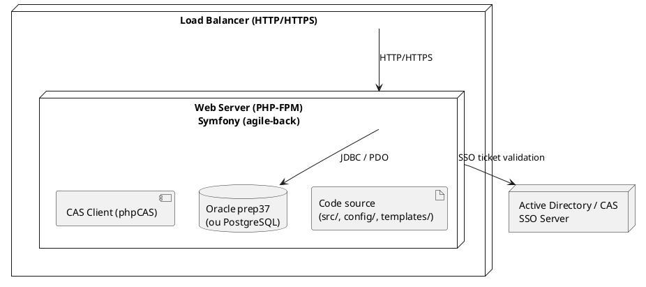

*Notes* :  
- Le serveur web (Apache / Nginx) exécute PHP‑FPM.  
- La base de données peut être Oracle (préférence) ou PostgreSQL (déploiement actuel).  
- Le serveur CAS est externe, accessible via HTTPS.

↩ **[Retour au sommaire](#sommaire)**  

### 4.3 Flux de données (DFD) <a id="flux-de-données"></a>

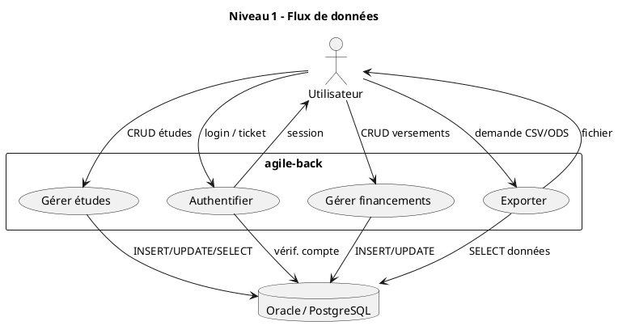

↩ **[Retour au sommaire](#sommaire)**  

### 4.4 Analyse de sécurité <a id="analyse-de-sécurité"></a>

| Aspect | Analyse | Mesure(s) appliquée(s) |
|---|---|---|
| **Authentification** | SSO avec CAS – jeton unique, durée de vie configurable. | `phpCAS` (client), `security.yaml` (`anonymous: true` pour dev). |
| **Autorisation** | Contrôle d’accès basique (rôles Symfony). | `access_control` (commenté : à activer). |
| **Transport** | Toutes les communications en HTTPS (reverse‑proxy). | Certificat TLS sur le load‑balancer. |
| **Stockage** | Données sensibles (emails, pièces jointes) chiffrées au repos (Oracle Transparent Data Encryption ou PostgreSQL `pgcrypto`). | Non implémenté : **Dette technique** (voir § 4.5). |
| **Injection** | Doctrine ORM utilise des requêtes préparées. | Validation côté serveur via contraintes Symfony. |
| **XSS / CSRF** | Twig auto‑échappe; CSRF tokens générés (`csrf_token`). | Vérifié dans les formulaires (`_token`). |
| **Journalisation** | Monolog en mode `fingers_crossed` (prod) → logs sur `stderr`. | Conserver les logs d’audit (`Evenements`). |

#### Points d’attention

1. **Gestion des secrets** – le DSN de la base Oracle et le secret du CAS sont en clair dans les variables d’environnement ; il faut les externaliser (Vault, Docker secrets).  
2. **Contrôle d’accès granulaire** – les `access_control` sont commentés ; risque d’accès non autorisé en production.  
3. **Chiffrement des pièces jointes** – les fichiers uploadés sont stockés dans le répertoire `public/` sans chiffrement.  

↩ **[Retour au sommaire](#sommaire)**  

### 4.5 Dette technique identifiée <a id="dette-technique"></a>

| Zone | Description | Impact | Proposition |
|---|---|---|---|
| **Hard‑coding du DSN** | `config/packages/doctrine.yaml` utilise `env(DATABASE_URL)` mais la valeur est souvent hard‑coded dans `.env`. | Risque de fuite de crédentials. | Utiliser Symfony Secrets (`symfony secrets`). |
| **Logique métier dans les contrôleurs** | Certaines validations (ex. montant ≤ dotation) sont réalisées directement dans les contrôleurs. | Couplage fort, tests unitaires limités. | Refactoriser dans des services métier (`FinancementValidator`). |
| **Absence de tests fonctionnels** | Le répertoire `tests/` ne contient qu’un bootstrap. | Couverture de tests insuffisante. | Ajouter des tests PHPUnit / Behat. |
| **Duplication de formulaires** | Plusieurs formulaires (ex. `etudes/_form.html.twig`, `etudes_admin/_form.html.twig`) sont très similaires. | Maintenance lourde. | Centraliser le formulaire partagé. |
| **Gestion des pièces jointes** | Les uploads sont placés sous `public/` sans contrôle d’accès. | Risque de divulgation. | Implémenter un service de stockage sécurisé (ex. S3, chiffrement). |
| **Contrôle d’accès désactivé** | `security.yaml` ne définit aucune règle `access_control`. | Accès non restreint. | Activer les règles et créer un voter (`EtudesVoter`). |
| **Code mort / fichiers inutilisés** | `public/js/maj.js` ne contient que `//`. | Pollution du dépôt. | Supprimer ou réutiliser. |

↩ **[Retour au sommaire](#sommaire)**  

---

## 5️⃣ Modèle de données (schéma relationnel simplifié) <a id="modèle-de-données"></a>

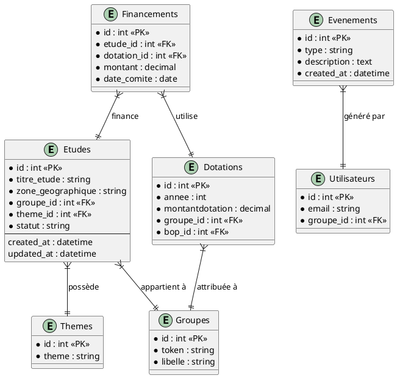

*Notes* :  
- Les relations sont implémentées via Doctrine (`@ORM\ManyToOne`, `@ORM\OneToMany`).  
- Les tables `Evenements` permettent l’audit (historisation).  

↩ **[Retour au sommaire](#sommaire)**  

---

## 6️⃣ Interfaces externes (CAS SSO) <a id="interfaces-externes"></a>

| Interface | Protocole | Point d’entrée | Description |
|---|---|---|---|
| **CAS Server** | HTTPS (GET/POST) | `public/cas/connexionCAS.php` | Authentifie l’utilisateur, renvoie un ticket. |
| **Base de données** | JDBC/ODBC (Oracle) ou PDO (PostgreSQL) | `config/packages/doctrine.yaml` | Persistance des entités métier. |
| **Service de mail** | SMTP (configurable) | `config/packages/swiftmailer.yaml` | Envoi de notifications (ex. `SiteUpdateMailer`). |
| **Export ODS/CSV** | HTTP (GET) | `src/Controller/ExportOdsDtoController.php` | Génère des fichiers exportables. |

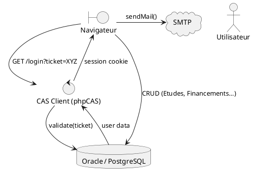

↩ **[Retour au sommaire](#sommaire)**  

---

## 7️⃣ Qualité et conformité (ISO/IEC/IEEE 29148) <a id="qualité-et-conformité"></a>

| Critère ISO 29148 | Implémentation dans **agile‑back** |
|---|---|
| **Clarté des exigences** | Chaque cas d’usage est documenté (UC‑01…UC‑06) et lié aux contrôleurs (`src/Controller/*`). |
| **Traçabilité** | Les entités (`Evenements`) conservent le lien entre action utilisateur et modification de données. |
| **Modélisation** | Diagrammes UML (use‑case, séquence, classes) fournis dans ce document. |
| **Gestion des changements** | Les *Commandes* (`src/Commandes/*Runner.php`) permettent l’exécution de tâches planifiées (ex. mise à jour des abonnements). |
| **Vérifiabilité** | Tests unitaires (à implémenter) et validation côté serveur via les contraintes Symfony. |
| **Sécurité** | Analyse de risques (section 4.4) conforme aux recommandations ISO 27001 (authentification, chiffrement, journalisation). |
| **Documentation** | La spécification complète (ce document) et les commentaires dans le code. |

↩ **[Retour au sommaire](#sommaire)**  

---

## 8️⃣ Annexes – Code PlantUML complet <a id="annexes"></a>

### A. Diagramme des acteurs et du SSO  

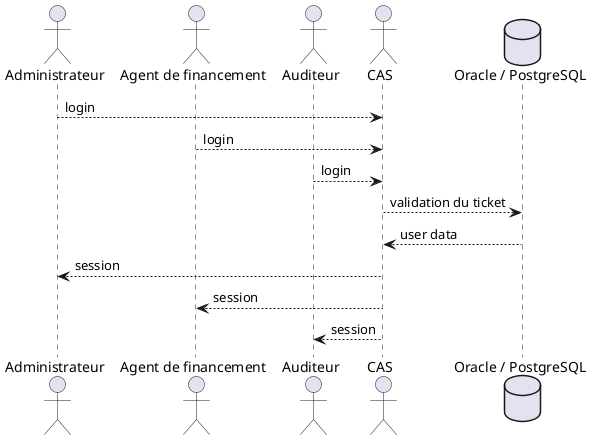

### B. Diagramme de cas d’usage (déjà présenté en 3.2)  

*(voir section 3.2)*  

### C. Diagramme de séquence – Authentification CAS (DS‑01)  

*(voir section 3.5)*  

### D. Diagramme de séquence – Versement (DS‑02)  

*(voir section 3.5)*  

### E. Diagramme Swimlane – Traitement d’une demande  

*(voir section 3.6)*  

### F. Diagramme d’architecture logique  

*(voir section 4.1)*  

### G. Diagramme d’architecture physique  

*(voir section 4.2)*  

### H. Diagramme DFD – Niveau 1  

*(voir section 4.3)*  

### I. Diagrammes de décision (tables)  

*(voir sections 3.4 – Table 1 & Table 2)*  

---

*Fin de la spécification.*  

--- 

*Ce document a été rédigé uniquement à partir du code source fourni (arborescence, fichiers PHP, YAML, Twig, JavaScript, CSS) et ne fait appel à aucune donnée externe.*  