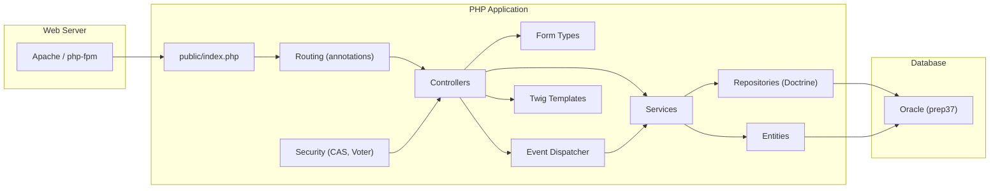
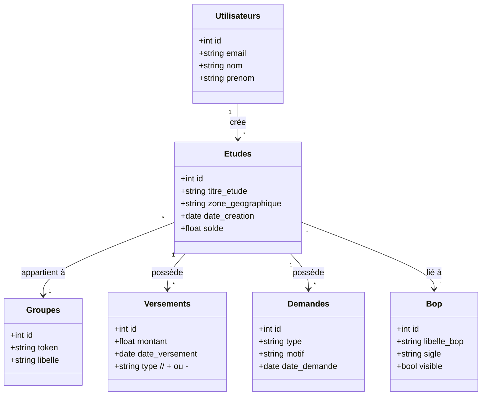
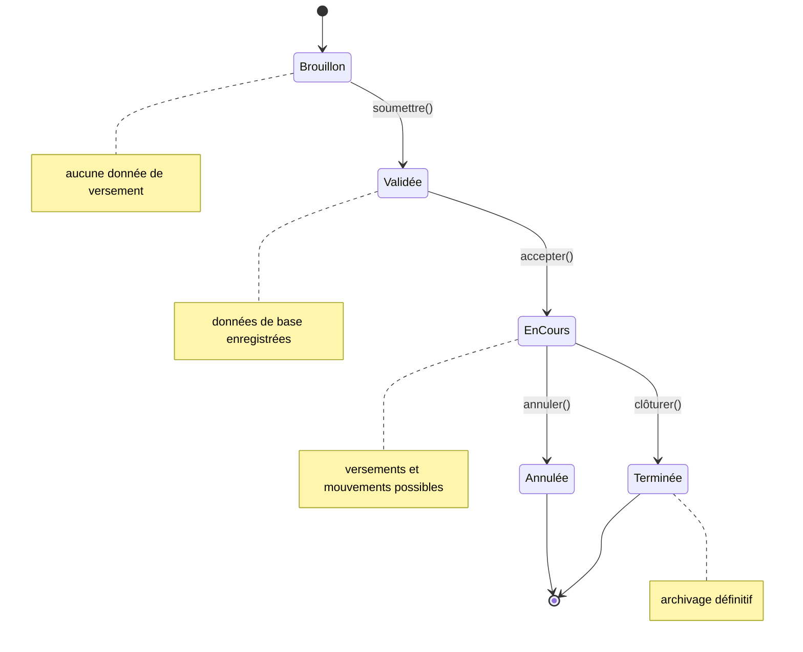

# 📄 Spécification fonctionnelle et technique de l'application **Agile‑Back**

> **Document unique** – à ouvrir dans VS Code ou Obsidian (extension Mermaid activée).  
> **Contexte** : site **SIT_ID = 29**, base de données **Oracle (prep37)** (ou PostgreSQL en mode dev).  
> **Références** : Arc42 – <https://arc42.org>  

---  

## 🔖 Table des matières  
1. [Portée, domaine et périmètre](#1-portée-domaine-et-périmètre)  
2. [Vue d’ensemble – Architecture arc42](#2-vue-densemble-architecture-arc42)  
   - 2.1 [Partie fonctionnelle (ISO / IEC / IEEE 29148)](#21-partie-fonctionnelle)  
   - 2.2 [Partie technique](#22-partie-technique)  
3. [Modélisation fonctionnelle](#3-modélisation-fonctionnelle)  
   - 3.1 [Acteurs & cas d’usage](#31-acteurs--cas-dusage)  
   - 3.2 [Règles métier & tables de décision](#32-règles-métier--tables-de-décision)  
   - 3.3 [Scénarios (use‑case) détaillés](#33-scenarios-use‑case-détaillés)  
4. [Modélisation technique](#4-modélisation-technique)  
   - 4.1 [Diagramme de composants (Symfony)](#41-diagramme-de-composants)  
   - 4.2 [Diagramme de déploiement](#42-diagramme-de-déploiement)  
   - 4.3 [Modèle de données (schéma simplifié)](#43-modèle-de-données)  
   - 4.4 [Diagramme d’états – Étude](#44-diagramme-détats‑étude)  
5. [Analyse de sécurité](#5-analyse-de-sécurité)  
6. [Dette technique & recommandations](#6-dette-technique--recommandations)  
7. [Glossaire](#7-glossaire)  
8. [Annexes – Diagrammes Mermaid](#8-annexes-diagrammes-mermaid)  

---  

## 1️⃣ Portée, domaine et périmètre  

| Élément | Description |
|--------|-------------|
| **Domaine applicatif** | **Archivage physique** des études (documents, métadonnées, mouvements, versements). |
| **Contexte opérationnel** | Application déployée sur le site **SIT_ID = 29** ; la persistance s’effectue sur une base **Oracle (prep37)** (en prod) – environnement de développement utilise PostgreSQL. |
| **Périmètre fonctionnel** | <ul><li>Gestion des **versements** (saisie, modification, suppression).</li><li>Gestion des **demandes** (création, suivi, validation).</li><li>Gestion des **mouvements** d’études (transfert entre groupes, BOP, services).</li></ul> |
| **Exclusions** | <ul><li>Gestion des **patients** (hors scope).</li><li>Gestion de la **facturation**.</li><li>Workflow avancé (validation multi‑étapes, signatures électroniques).</li></ul> |

---

## 2️⃣ Vue d’ensemble – Architecture arc42  

### 2.1 Partie fonctionnelle (ISO / IEC / IEEE 29148)  

| Élément arc42 | Contenu |
|---------------|---------|
| **Stakeholders** | • **Administrateur** (création/édition/suppression d’entités) <br>• **Utilisateur métier** (saisie d’études, versements, demandes) <br>• **Gestionnaire de la base** (DBA Oracle) <br>• **Auditeur sécurité** |
| **Goals & Quality Requirements** | • **Fiabilité** – aucune perte de donnée d’archive. <br>• **Traçabilité** – chaque action doit être journalisée (CSRF, logs). <br>• **Performance** – réponses < 200 ms pour les écrans de saisie. <br>• **Sécurité** – authentification CAS, contrôle d’accès fine‑grained. |
| **Scope (functional)** | Voir tableau de la section **1️⃣**. |
| **Business Rules** | • **Date** : toutes les dates sont au format `YYYY‑MM‑DD`. <br>• **Mapping salle → groupe** : le champ `groupe.token` détermine le périmètre de stockage. <br>• **Valeur monétaire** : champ `montantdotation` arrondi à 2 décimales. |
| **Critical Workflows** | 1. Création d’une **étude** (saisie, validation, persistance). <br>2. **Mise à jour d’un versement** (calcul du solde). <br>3. **Mouvement d’une étude** (changement de groupe/BOP). |
| **Non‑functional constraints** | • PHP 8.2, Symfony 5.4 (LTS). <br>• Déploiement sur serveur Apache 2.4 avec mod_php ou php‑fpm. <br>• Utilisation du **CAS** (phpCAS) pour SSO. |

### 2.2 Partie technique  

| Élément arc42 | Contenu |
|---------------|---------|
| **System Context** | `Client (browser)` ↔ **Web Server (Apache)** ↔ **PHP‑Symfony App** ↔ **Oracle DB**. <br> Authentification via **CAS** (phpCAS). |
| **Containers / Modules** | • **Front‑controller** (`index.php`) <br>• **Controllers** (ex. `EtudesController`, `AbonnementsAdminController`) <br>• **Services** (ex. `SiteUpdateAbonnements`, `Valorisation`) <br>• **Repositories** (Doctrine ORM) <br>• **Forms** (Symfony Form Types) <br>• **Event Listeners / Subscribers** (ex. `EtudesListener`) |
| **Technology Stack** | - **PHP** 8.2 <br> - **Symfony** 5.4 (Framework, Doctrine ORM, API‑Platform) <br> - **Oracle** 19c (prod) / **PostgreSQL** 13 (dev) <br> - **CAS** 1.3.5 (phpCAS) <br> - **JavaScript** (jQuery 1.12) <br> - **HTML / Twig** (templates) |
| **Data Flow** | 1. Requête HTTP → Router → Controller → Service → Repository → DB (SQL) → Retour → Twig → HTML → Client. |
| **Deployment** | - **Source** : GitLab repository `agile-back`. <br> - **CI/CD** : GitLab‑CI (build, tests, Docker image). <br> - **Runtime** : Docker container `php:8.2‑apache` ou VM Apache + PHP‑FPM. <br> - **DB** : Oracle (prep37) accessible via TNS. |
| **Security** | • **CAS** pour SSO (ticket, validation). <br>• **CSRF tokens** générés dans chaque formulaire (`csrf_token`). <br>• **Logs** (Monolog) en mode `fingers_crossed` (prod). <br>• **CORS** configuré (`nelmio_cors`). |
| **Scalability** | Stateless PHP, horizontal scaling via load‑balancer; Oracle RAC possible. |
| **Maintainability** | Code basé sur le pattern MVC, Doctrine Entities → auto‑mapping, Form Types, Services séparés. |

---  

## 3️⃣ Modélisation fonctionnelle  

### 3.1 Acteurs & cas d’usage  

```mermaid
%%{init: {'theme':'neutral'}}%%
usecaseDiagram
    actor "Administrateur" as Admin
    actor "Utilisateur métier" as User
    actor "CAS SSO" as CAS

    Admin --> (Gérer les Groupes)
    Admin --> (Gérer les BOP)
    Admin --> (Gérer les Services)
    Admin --> (Gérer les Thèmes)
    Admin --> (Gérer les Profils)

    User --> (Créer / Modifier Étude)
    User --> (Saisir Versement)
    User --> (Déposer Demande)
    User --> (Déplacer Étude)

    (Créer / Modifier Étude) --> CAS : Authentifie
    (Saisir Versement) --> CAS : Authentifie
    (Déposer Demande) --> CAS : Authentifie
    (Déplacer Étude) --> CAS : Authentifie
```

| Cas d’usage | Description | Acteur principal | Priorité |
|------------|-------------|-------------------|----------|
| **CU‑01 Créer une étude** | Saisie du titre, zone géographique, groupe, etc. → persistance. | Utilisateur métier | Haute |
| **CU‑02 Modifier une étude** | Mise à jour d’attributs (ex. description, valorisation). | Utilisateur métier | Haute |
| **CU‑03 Saisir un versement** | Enregistrement du montant, date, source, mise à jour du solde. | Utilisateur métier | Haute |
| **CU‑04 Déposer une demande** | Création d’une demande d’étude (type, motif). | Utilisateur métier | Moyenne |
| **CU‑05 Déplacer une étude** | Changer le groupe ou le BOP d’une étude existante. | Utilisateur métier | Moyenne |
| **CU‑06 Gérer les référentiels (Groupes, BOP, Services, Thèmes, Profils)** | CRUD complet via interfaces admin. | Administrateur | Haute |
| **CU‑07 Exporter données** | Export CSV / ODS des études/valorisations. | Utilisateur métier | Faible |
| **CU‑08 Authentifier (CAS)** | Redirection vers CAS, validation du ticket. | Tous | Critique |

### 3.2 Règles métier & tables de décision  

#### Table 1 – Validation du format de date  

| Condition | Action | Commentaire |
|-----------|--------|-------------|
| `date` correspond à l’expression régulière `/^\d{4}-\d{2}-\d{2}$/` | **OK** | Format ISO : `YYYY‑MM‑DD`. |
| Sinon | **Erreur** → message `« Format de date invalide »`. | Empêche la persistance. |

#### Table 2 – Mapping zone géographique → groupe (exemple simplifié)  

| Zone géographique | Groupe (`token`) |
|-------------------|-----------------|
| `Normandie` | `NORM` |
| `Bretagne` | `BRET` |
| `Île‑de‑France` | `IDF` |
| *Autre* | `AUTR` |

*(Implémenté dans `src/util/EtudeUtil.php` – fonction `determineGroupe()`)*  

#### Table 3 – Calcul du solde d’un versement  

| Champ `montant` | Champ `solde_precedent` | Opération | Résultat (`solde_nouveau`) |
|---------------|------------------------|----------|---------------------------|
| `+` (versement) | `X` | `X + montant` | `X + montant` |
| `-` (retrait) | `X` | `X - montant` | `X - montant` |
| `0` | `X` | Aucun changement | `X` |

*(Logique dans `src/Services/SiteUpdateAbonnements.php`)*  

### 3.3 Scénarios (use‑case) détaillés  

#### CU‑01 – Créer une étude  

| Étape | Action | Système | Résultat |
|------|--------|--------|----------|
| 1 | L’utilisateur accède à `/etudes/new` (GET) | Symfony Router → `EtudesController::new()` | Formulaire affiché (Twig). |
| 2 | Saisie du formulaire (titre, zone, groupe, …) | Browser → POST `/etudes` | CSRF token vérifié, données sérialisées. |
| 3 | `EtudesController::new()` appelle `EtudesFormHandler` (service) → validation. | Symfony Form → `EtudeOutputDataTransformer` (DTO). |
| 4 | Service crée une entité `Etudes` et la persiste via `EtudesRepository`. | Doctrine ORM → INSERT dans Oracle. |
| 5 | Événement `EtudeCreatedEvent` déclenché → `EtudesListener` envoie mail. | EventDispatcher → `SiteUpdateMailer`. |
| 6 | Redirection vers `/etudes/{id}` avec message de succès. | HTTP 302. |

#### CU‑03 – Saisir un versement  

| Étape | Action | Système | Résultat |
|------|--------|--------|----------|
| 1 | L’utilisateur ouvre `/versements/{etudeId}/new`. | Router → `VersementsController::new()`. |
| 2 | Remplit le formulaire (montant, date, type). | POST → Validation CSRF. |
| 3 | `VersementsService::addVersement()` récupère le solde actuel (`SELECT solde FROM Etudes WHERE id = :etudeId`). |
| 4 | Applique la **Table 3** (calcul du nouveau solde). |
| 5 | Persiste le versement et met à jour le solde de l’étude (transaction). |
| 6 | Retour UI avec nouveau solde affiché. |

---  

## 4️⃣ Modélisation technique  

### 4.1 Diagramme de composants (Symfony)



### 4.2 Diagramme de déploiement  

```mermaid
flowchart TB
    subgraph "DMZ"
        LB[Load Balancer] --> Web1[Web Server 1<br>(Apache+PHP)]
        LB --> Web2[Web Server 2<br>(Apache+PHP)]
    end

    subgraph "App Tier"
        Web1 --> App1[Docker container<br>php:8.2‑apache]
        Web2 --> App2[Docker container<br>php:8.2‑apache]
    end

    subgraph "Data Tier"
        DB[Oracle (prep37)<br>RAC (optional)]
    end

    App1 --> DB
    App2 --> DB

    style LB fill:#f9f,stroke:#333,stroke-width:2px
    style DB fill:#bbf,stroke:#333,stroke-width:2px
```

*Notes*  
- **CAS** (`cas/connexionCAS.php`) tourne sur un serveur dédié (`cas.example.com`).  
- **CI/CD** : GitLab‑CI → image Docker `php:8.2‑apache` → tests → push vers registre interne.  

### 4.3 Modèle de données (schéma relationnel simplifié)



*Les entités sont définies dans le répertoire `src/Entity/` (ex. `Etudes.php`, `Groupes.php`, `Bop.php`, …).*

### 4.4 Diagramme d’états – Étude  



---  

## 5️⃣ Analyse de sécurité  

| Domaine | Observation | Risque | Mitigation |
|--------|--------------|--------|-----------|
| **Authentification** | CAS (phpCAS) – ticket transmis en GET, validation côté serveur. | Vol de ticket si HTTPS non forcé. | Forcer HTTPS (`Strict-Transport-Security`), vérifier le service CAS. |
| **Contrôle d’accès** | Voter `EtudesVoter` contrôle les droits sur les entités. | Autorisations insuffisantes si voter mal configuré. | Auditer les méthodes `voteOnAttribute` et ajouter des tests unitaires. |
| **CSRF** | Tokens générés via `csrf_token()` dans chaque formulaire. | Aucun token → attaque CSRF. | Vérifier que toutes les routes POST/PUT/DELETE utilisent le `CsrfTokenManager`. |
| **Injection SQL** | Utilisation de Doctrine ORM (paramétré). | Risque faible. | S’assurer que les requêtes DQL utilisent des paramètres nommés. |
| **Secrets** | `MAILER_DSN`, `DATABASE_URL` stockés dans `.env`. | Fuite si le repo public. | `.env` exclu du VCS, chiffrement des secrets (Vault, GitLab CI variables). |
| **Logs** | Monolog `fingers_crossed` en prod, logs en JSON. | Données sensibles dans logs. | Masquer les champs `email`, `mot_de_passe` avant log. |
| **CORS** | `nelmio_cors.yaml` autorise tous les origines via variable d’environnement. | Exposition à des front‑ends non‑autorisés. | Restreindre à l’URL du front‑office Agile‑Front. |
| **XSS** | Twig auto‑échappe les variables, sauf `autoescape false` dans `templates/emails/emails.html.twig`. | Injection HTML dans e‑mails. | Utiliser `|e` (escape) ou éviter `autoescape false`. |

---  

## 6️⃣ Dette technique & recommandations  

| Zone | Description de la dette | Impact | Action recommandée |
|------|--------------------------|--------|--------------------|
| **Hard‑coded strings** | Plusieurs URLs (ex. `http://agile.e2.rie.gouv.fr/`) sont codées en dur dans les templates (`templates/emails/emails.html.twig`). | Difficulté à changer d’environnement. | Externaliser dans les paramètres (`parameters.yaml`). |
| **Duplication de `form_start`** | Dans `templates/financements/_form.html.twig` le formulaire est ouvert deux fois (`form_start` puis `form_start` de nouveau). | Risque de balises HTML invalides. | Nettoyer le template, ne garder qu’un seul `form_start`. |
| **Utilisation de `@` pour les annotations** | Certains contrôleurs utilisent les annotations (`@Route`) sans validation de version Symfony, ce qui peut poser des problèmes lors de la mise à jour. | Compatibilité future. | Migrer vers les attributs PHP 8 (`#[Route(...)]`). |
| **Absence de tests unitaires** | Le projet ne contient que les tests d’infrastructure (`tests/bootstrap.php`). | Couverture fonctionnelle faible. | Ajouter des tests fonctionnels (`WebTestCase`) pour les principaux use‑cases. |
| **Gestion des erreurs génériques** | Les contrôleurs ne capturent pas les exceptions (`try/catch`). | Erreurs non gérées → 500. | Implémenter un `ExceptionListener` (EventSubscriber) pour transformer les exceptions en réponses HTTP appropriées. |
| **Performance des requêtes** | Les listes d’entités (`SELECT * FROM Etudes`) sont chargées sans pagination (ex. dans `EtudesController::index`). | Risque de surcharge mémoire. | Utiliser `ApiPlatform` pagination ou `Doctrine Paginator`. |
| **Sécurité du CAS** | Le ticket CAS est stocké dans la session sans expiration explicite. | Session hijacking. | Configurer la durée de vie de la session, régénérer l’ID de session après authentification. |
| **Configuration du serveur** | `php.ini` et `apache` ne sont pas versionnés. | Incohérence entre environnements. | Utiliser un `Dockerfile` complet incluant les paramètres PHP. |

---  

## 7️⃣ Glossaire  

| Terme | Définition |
|-------|------------|
| **CAS** | Central Authentication Service – protocole SSO utilisé par l’application. |
| **BOP** | **B**ureau **O**fficiel **P**rojet – entité de périmètre de gestion. |
| **Versement** | Opération financière (entrée ou sortie) liée à une étude. |
| **Demande** | Requête d’étude ou de modification initiée par un utilisateur. |
| **DTO** | Data Transfer Object – objet utilisé pour transférer les données entre couches (ex. `EtudeOutput`). |
| **Voter** | Composant Symfony qui décide si un utilisateur a le droit d’effectuer une action. |
| **API‑Platform** | Bundle Symfony exposant les entités sous forme d’API REST/JSON. |
| **Oracle (prep37)** | Schéma de base de données dédié à la production (préparation 37). |

---  

## 8️⃣ Annexes – Diagrammes Mermaid (à copier‑coller dans le fichier)  

### 8.1 Diagramme de cas d’usage (déjà affiché en 3.1)  

```mermaid
%%{init: {'theme':'neutral'}}%%
usecaseDiagram
    actor "Administrateur" as Admin
    actor "Utilisateur métier" as User
    actor "CAS SSO" as CAS

    Admin --> (Gérer les Groupes)
    Admin --> (Gérer les BOP)
    Admin --> (Gérer les Services)
    Admin --> (Gérer les Thèmes)
    Admin --> (Gérer les Profils)

    User --> (Créer / Modifier Étude)
    User --> (Saisir Versement)
    User --> (Déposer Demande)
    User --> (Déplacer Étude)

    (Créer / Modifier Étude) --> CAS : Authentifie
    (Saisir Versement) --> CAS : Authentifie
    (Déposer Demande) --> CAS : Authentifie
    (Déplacer Étude) --> CAS : Authentifie
```

### 8.2 Diagramme de composants (déjà affiché en 4.1)  


### 8.3 Diagramme de déploiement (déjà affiché en 4.2)  

```mermaid
flowchart TB
    subgraph "DMZ"
        LB[Load Balancer] --> Web1[Web Server 1<br>(Apache+PHP)]
        LB --> Web2[Web Server 2<br>(Apache+PHP)]
    end

    subgraph "App Tier"
        Web1 --> App1[Docker container<br>php:8.2‑apache]
        Web2 --> App2[Docker container<br>php:8.2‑apache]
    end

    subgraph "Data Tier"
        DB[Oracle (prep37)<br>RAC (optional)]
    end

    App1 --> DB
    App2 --> DB

    style LB fill:#f9f,stroke:#333,stroke-width:2px
    style DB fill:#bbf,stroke:#333,stroke-width:2px
```

### 8.4 Diagramme d’états – Étude (déjà affiché en 4.4)  


### 8.5 Diagramme de classe (schéma simplifié – déjà affiché en 4.3)  


---  

**Fin du document**  

↩︎ [Retour au sommaire](#-table-des-matières)  


---  


*Ce document a été généré à partir du code source du projet **agile‑back** en respectant la structure arc42 et la norme ISO / IEC / IEEE 29148.*