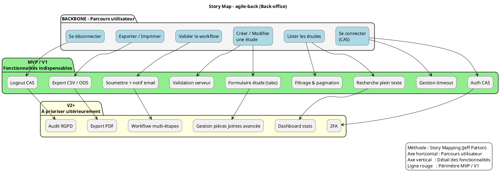

# 📚 Guide d’atelier : **Story Mapping** – *Représenter le périmètre fonctionnel d’**agile‑back***  

> **Document établi à partir des principes du Story Mapping de Jeff Patton** – *« User Story Mapping: Discover the Whole Story, Build the Right Product »*  

---  

## 📖 Table des matières  
[TOC]

---  

## 1️⃣ Introduction et objectifs  

**Livrable** : *« Représenter visuellement le périmètre fonctionnel d’**agile‑back** aligné sur le parcours utilisateur »*  

| Méthodologie | Atelier basé sur le **Story Mapping** (Jeff Patton) |
|--------------|---------------------------------------------------|

### Objectifs opérationnels  
- 🎯 **Comprendre collectivement le parcours cible** des utilisateurs du back‑office (administrateur, gestionnaire d’études, etc.)  
- 🎯 **Identifier les fonctionnalités** nécessaires à chaque étape du parcours  
- 🎯 **Prioriser** pour définir un **MVP fonctionnel** (ou V1)  
- 🎯 **Créer un support visuel partagé** qui servira de référence aux équipes produit, technique et design  

---  

## 2️⃣ Contexte d’usage  

| Élément | Valeur |
|--------|--------|
| **Type de livrable** | Standard ✅ |
| **Nature** | Atelier 🤝 |
| **Activité** | « Imaginer une solution » |
| **Méthode** | Story Mapping (Jeff Patton) |
| **Quand l’utiliser** | <ul><li>Traduire recherche utilisateur, contraintes réglementaires & vision produit en périmètre fonctionnel</li><li>Cadrer un MVP, une V1 ou une refonte du back‑office</li><li>Aligner équipes métier, technique & design sur une même représentation</li></ul> |
| **Recommandation** | Créer **une Story Map par profil d’utilisateur** (ex. : *Admin*, *Gestionnaire d’études*) et commencer toujours par l’utilisateur final. |

---  

## 3️⃣ Pré‑requis  

- [ ] **Vision produit** formalisée (pitch, objectifs, métriques) – ex. : “Permettre la création, la modification et le suivi d’études en toute sécurité”  
- [ ] **Personas** et recherche utilisateurs synthétisés (verbatims, entretiens) – ex. : *Administrateur*, *Chargé d’études*  
- [ ] **Problèmes utilisateurs** hiérarchisés (jobs‑to‑be‑done, pain points) – ex. : “Difficulté à retrouver une étude”, “Processus de validation trop long”  
- [ ] **Contraintes réglementaires / techniques** identifiées – ex. : Symfony 5, PostgreSQL, conformité RGPD, authentification CAS  

> 💡 *Conseil* : Si un pré‑requis manque, prévoir **15 min** en début d’atelier pour le co‑construire rapidement.  

---  

## 4️⃣ Parties prenantes et rôles  

| Rôle | Profil type | Responsabilité dans l’atelier |
|------|-------------|------------------------------|
| **Animateur** | Chef de produit / PNM | Cadre, facilite, garde le cap utilisateur |
| **Profil technique** | Tech Lead / Architecte | Évalue faisabilité, effort, dépendances (Symfony, PostgreSQL, CAS) |
| **Porteur métier** | MOA / Responsable métier | Valide pertinence fonctionnelle & priorisation |
| **Designer UX/UI** *(optionnel)* | Designer produit | Enrichit le parcours, propose des patterns d’interaction |

> ☝️ *Plusieurs rôles peuvent être tenus par une même personne selon les profils disponibles.*  

---  

## 5️⃣ Logistique  

| Élément | Détails |
|---------|---------|
| **Durée** | 2 h 30 – 3 h (prévoir une pause à 1 h 30 si 3 h) |
| **Matériel physique** | Mur / tableau blanc, post‑its de **3 couleurs** (ex. : fonctionnalité, contrainte, idée), marqueurs, ruban de masquage |
| **Matériel digital** | Outil collaboratif (Mural, FigJam, Klaxoon…) avec template pré‑préparé |
| **Livrable de sortie** | Photo / export de la Story Map, liste des décisions MVP, points de vigilance (ex. : conformité RGPD) |

---  

## 6️⃣ Déroulé détaillé de l’atelier  

### 🎯 Étape 1 — Introduction (15 min)  
1. Présenter les objectifs et le principe de la Story Map (Jeff Patton).  
2. Rappeler le contexte du projet **agile‑back** : back‑office Symfony pour la création/modification d’études (PostgreSQL, authentification CAS).  
3. Annoncer les règles de l’atelier : écoute active, contributions ouvertes, suspension du jugement.  

> ✅ *Astuce* : Afficher une **job story** type : « En tant que **Gestionnaire d’études**, je veux **créer / modifier une étude** afin de **suivre son avancement** ».  

### 🗺️ Étape 2 — Parcours utilisateur horizontal (30 min)  
**Objectif** : Reconstituer le parcours complet de l’utilisateur du back‑office.  

1. Question : *« Quelles sont les grandes étapes que suit l’utilisateur dans sa démarche ? »*  
2. Chaque étape → post‑it **verbe‑action** (ex. : *Se connecter*, *Lister les études*, *Créer une étude*, *Valider*, *Exporter*, *Déconnexion*).  
3. Disposer les post‑its **de gauche à droite** sur le mur (Backbone).  

> 📌 **Exemple de backbone pour agile‑back**  
```
[Se connecter] → [Lister les études] → [Créer / Modifier une étude] → [Valider le workflow] → [Exporter / Imprimer] → [Se déconnecter]
```  

### 📋 Étape 3 — Détail vertical des activités (45 min)  
Pour chaque étape du backbone, poser :  

- *« Que doit faire concrètement l’utilisateur ici ? »*  
- *« De quelles informations a‑t‑il besoin ? »*  
- *« Quels sont les points de friction potentiels ? »*  

Empiler les réponses **verticalement** sous chaque étape (du plus essentiel au plus secondaire).  

> 💡 **Ne pas filtrer** à ce stade : recueillir le maximum d’idées (ex. : “Gestion des droits”, “Recherche plein texte”, “Aide contextuelle”).  

### 🎚️ Étape 4 — Priorisation & définition du MVP (30‑45 min)  
1. Tracer une **ligne de flottaison** (ligne rouge) au‑dessus du tableau.  
2. Au‑dessus : **Fonctionnalités indispensables** pour le MVP (ou V1).  
3. En‑dessous : **Fonctionnalités reportables** (V2, backlog).  

Questions clés :  

- *« Quelles fonctionnalités sont absolument indispensables pour que l’utilisateur aille au bout du parcours ? »*  
- *« Qu’est‑ce qu’on peut retirer sans bloquer le flux principal ? »*  

> 🎯 *Rappel* : Le MVP doit être **fonctionnel**, pas minimaliste à outrance.  

### 🏁 Étape 5 — Conclusion & prochaines étapes (15 min)  
1. Relire la carte ensemble : validation du parcours + périmètre MVP/V1.  
2. Noter : points de vigilance, questions en suspens, dépendances (ex. : intégration CAS, audit RGPD).  
3. Annoncer les suites : formalisation du backlog, rédaction des user stories, maquettage, estimation.  

> 📸 *Action immédiate* : prendre en photo le board (ou exporter la carte digitale) et le partager **dans les 24 h**.  

---  

## 7️⃣ Conseils de facilitation  

| Bonnes pratiques | À éviter |
|------------------|----------|
| Reformuler régulièrement pour assurer la clarté | S’enliser dans les détails techniques |
| Garder le cap sur l’expérience utilisateur | Laisser un profil dominer les échanges |
| Faire participer tout le monde (métier, terrain, technique) | Accepter les digressions hors du parcours |
| Utiliser un **timeboxing** strict par étape | Oublier de documenter les arbitrages |
| Ancrer chaque fonctionnalité dans un besoin utilisateur | Confondre “nice‑to‑have” et “must‑have” |

---  

## 8️⃣ Exemple de Story Map (simplifiée) – *agile‑back*  

```
Parcours utilisateur (axe horizontal →) :
[Se connecter] — [Lister les études] — [Créer / Modifier une étude] — [Valider le workflow] — [Exporter / Imprimer] — [Se déconnecter]

Fonctionnalités associées (axe vertical ↓ sous chaque étape) :

► Se connecter
   • Authentification CAS
   • Gestion du timeout session
   • Message d’erreur explicite

► Lister les études
   • Recherche plein texte
   • Filtrage par statut / date / groupe
   • Pagination
   • Export CSV / ODS

► Créer / Modifier une étude
   • Formulaire dynamique (sections « Contexte », « Financement », « Valorisation »)
   • Validation côté serveur (Symfony Validator)
   • Gestion des pièces jointes
   • Historique des modifications

► Valider le workflow
   • Bouton “Soumettre pour validation”
   • Notification par email (via SwiftMailer)
   • Gestion des rôles (visibilité, approbation)

► Export / Imprimer
   • Génération PDF (bibliothèque TCPDF)
   • Export ODS (via API Platform)

► Se déconnecter
   • Invalidation du ticket CAS
   • Redirection vers page d’accueil publique
```

---  

## 9️⃣ Diagramme PlantUML du Story Map  



---  

## 🔟 Adaptations contextuelles  

| Contexte | Adaptation recommandée |
|----------|------------------------|
| **Refonte** | Partir du parcours existant (ex. : capture d’écran du back‑office actuel), identifier les points de friction avant de proposer les nouvelles fonctionnalités. |
| **Produit réglementé** | Intégrer les exigences **RGPD** et **CAS** comme étapes obligatoires (ex. : consentement, journalisation). |
| **Multi‑profils** | Créer **une Story Map par persona** (*Administrateur*, *Gestionnaire d’études*) puis fusionner les fonctionnalités transverses. |
| **Contrainte technique forte** | Inviter le **Architecte Symfony** dès l’étape 3 pour valider la faisabilité (ex. : Doctrine, API Platform). |

---  

## 1️⃣1️⃣ Livrables et suite du projet  

| Livrable immédiat | Description |
|-------------------|-------------|
| **Story Map** (photo / export) | Vue d’ensemble du parcours + fonctionnalités MVP/V1. |
| **Diagramme PlantUML** | Représentation formelle exploitable dans la documentation. |
| **Liste des fonctionnalités MVP** | Tableau : *Feature – Priorité – Owner – Effort estimé*. |

| Livrables dérivés | Description |
|-------------------|-------------|
| **Backlog produit** (Epics → User Stories) | Structuré à partir de la Story Map, chaque ligne verticale devient une *user story* ou *sub‑task*. |
| **Matrice de traçabilité** | *Fonctionnalité ↔ Besoin utilisateur ↔ Contrainte* (ex. : RGPD). |
| **Roadmap** visuelle | Phases : MVP → V1 → V2 (avec jalons de conformité). |

### Prochaines étapes suggérées  

1. **Rédaction des user stories** (format *En tant que … je veux … afin de …*) avec critères d’acceptation.  
2. **Maquettage** des écrans clés du MVP (formulaire création, tableau de bord).  
3. **Estimation technique** (story points, charge) et **planification des sprints**.  
4. **Validation de la conformité** (RGPD, sécurité CAS).  

---  

## 📚 Mini‑glossaire  

| Terme | Définition |
|-------|------------|
| **Backbone** | Axe horizontal du Story Map : le **parcours utilisateur** principal. |
| **Epic** | Grande fonctionnalité découpée verticalement sous le backbone. |
| **MVP** | *Minimum Viable Product* : version fonctionnelle la plus simple permettant de tester l’hypothèse produit. |
| **Line of Flotation** | Ligne (souvent rouge) séparant les items **indispensables** (au‑dessus) des **reportables** (en‑dessous). |
| **Persona** | Représentation synthétique d’un groupe d’utilisateurs avec besoins et contraintes. |
| **RGPD** | Règlement général sur la protection des données (exigences de conformité). |
| **CAS** | Central Authentication Service – protocole d’authentification utilisé par *agile‑back*. |

---  

## 📎 Annexes  

*Ce guide est entièrement autonome : il ne dépend d’aucun fichier externe et peut être copié‑collé dans VS Code ou Obsidian.*  

---  

## ⏩ Retour au sommaire  

[↩ Retour au sommaire]  