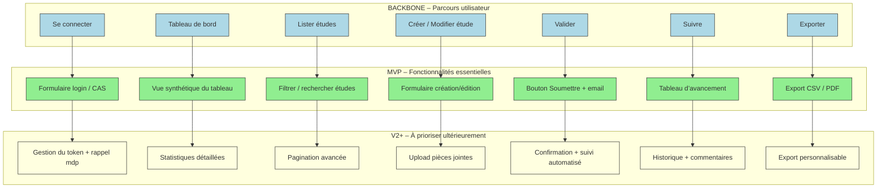

# 📚 Guide d’atelier : **Story Mapping** – Représenter le périmètre fonctionnel d’**agile‑back**  
*Document établi à partir des principes du **Story Mapping** de Jeff Patton*  

[TOC]

---  

## 1️⃣ Introduction et objectifs  

**Livrable** : *Représenter visuellement le périmètre fonctionnel d’**agile‑back** aligné sur le parcours utilisateur.*  

**Méthodologie** : Atelier basé sur le **Story Mapping** (Jeff Patton).  

### Objectifs opérationnels  

| 🎯 | Description |
|---|--------------|
| 1️⃣ | Comprendre collectivement le parcours cible de l’utilisateur (administrateur, gestionnaire d’études, etc.) |
| 2️⃣ | Identifier les fonctionnalités nécessaires à chaque étape du parcours |
| 3️⃣ | Prioriser pour définir un **MVP** fonctionnel (ex. création/modification d’études) |
| 4️⃣ | Produire un support visuel partagé (story‑map) pour cadrer la suite du projet |
| 5️⃣ | Générer les livrables dérivés (backlog, roadmap, matrice traçabilité) |

---  

## 2️⃣ Contexte d’usage  

| 📦 | Valeur |
|---|--------|
| **Type de livrable** | Standard ✅ |
| **Nature** | Atelier 🤝 |
| **Activité** | « Imaginer une solution » |
| **Méthode** | Story Mapping (Jeff Patton) |
| **Quand l’utiliser** | <ul><li>Traduire la recherche utilisateur, la réglementation et la vision produit en périmètre fonctionnel.</li><li>Cadrer un MVP, une V1 ou une refonte d’**agile‑back**.</li><li>Aligner les équipes métier, technique et design sur une même représentation.</li></ul> |
| **Recommandation** | Créer une Story Map **par profil utilisateur** (ex. : *Admin*, *Gestionnaire d’études*). Limiter à 2‑3 personas pour garder la carte lisible. |

---  

## 3️⃣ Pré‑requis  

- [ ] **Vision produit** formalisée (pitch, objectifs, métriques).  
- [ ] **Personas** et résultats de recherche utilisateurs (verbatims, enquêtes, entretiens).  
- [ ] **Problèmes utilisateurs** hiérarchisés (Jobs‑to‑be‑Done, pain points).  
- [ ] **Contraintes réglementaires** ou techniques identifiées (ex. : RGPD, architecture Symfony).  

> 💡 *Si un pré‑requis manque, réserver 15 min en début d’atelier pour le co‑construire rapidement.*  

---  

## 4️⃣ Parties prenantes et rôles  

| Rôle | Profil type | Responsabilité dans l’atelier |
|------|------------|------------------------------|
| **Animateur** | Chef de produit / PO | Cadre, facilite, garde le cap utilisateur. |
| **Profil technique** | Tech Lead / Architecte | Évalue faisabilité, effort, dépendances. |
| **Porteur métier** | MOA / Responsable fonctionnel | Valide la pertinence fonctionnelle et la priorisation. |
| **Designer UX/UI** *(optionnel)* | Designer produit | Enrichit le parcours, propose des patterns d’interaction. |
| **Utilisateur métier** | Admin, Gestionnaire d’études | Apporte le point de vue terrain (ex. création d’une étude). |

> ☝️ *Un même participant peut cumuler plusieurs rôles selon la taille de l’équipe.*  

---  

## 5️⃣ Logistique  

| 📅 | Détails |
|---|---------|
| **Durée** | 2 h 30 – 3 h (prévoir une pause à 1 h 30 si 3 h). |
| **Matériel – physique** | Mur ou tableau blanc, post‑its (3 couleurs), marqueurs, ruban de masquage. |
| **Matériel – digital** | Outil collaboratif (Mural, FigJam, Miro, Klaxoon…) avec template Story Map pré‑préparé. |
| **Livrable de sortie** | Photo / export de la Story Map, liste des décisions MVP, points de vigilance. |

---  

## 6️⃣ Déroulé détaillé de l’atelier  

### 🎯 Étape 1 – Introduction (15 min)  

1. Présenter les objectifs et le principe de la Story Map (Jeff Patton).  
2. Rappeler le contexte : *agile‑back* (back‑office Symfony ; gestion d’études, abonnements, dotations, etc.).  
3. Exposer les **règles du jeu** : écoute active, contributions ouvertes, suspension du jugement.  

> ✅ **Astuce** : préparer une **job story** pour chaque persona, ex. :  
> *« En tant que **Gestionnaire d’études**, je veux **créer / modifier une étude** afin de **suivre son avancement et la valoriser**. »*  

---  

### 🗺️ Étape 2 – Parcours utilisateur horizontal (30 min)  

**Objectif** : reconstituer collectivement le parcours de bout en bout.  

1. Question : *« Quelles sont les grandes étapes que suit l’usager dans sa démarche ? »*  
2. Noter chaque étape sur un post‑it (verbe d’action) → disposer **de gauche à droite**.  
3. Exemple de **back‑office agile‑back** (à adapter) :  

```
[Se connecter] → [Accéder au tableau de bord] → [Lister les études] → [Créer / Modifier une étude] → [Valider / Soumettre] → [Suivre le statut] → [Exporter / Imprimer]
```  

---  

### 📋 Étape 3 – Détail vertical des activités (45 min)  

**Objectif** : lister actions, informations et besoins précis à chaque étape.  

Pour chaque étape du backbone :  

- *« Que doit faire concrètement l’usager ici ? »*  
- *« De quelles informations a‑t‑il besoin ? »*  
- *« Quels sont les points de friction potentiels ? »*  

Empiler les réponses **verticalement sous chaque étape** (du plus essentiel au plus secondaire).  
**Ne filtrez pas** à ce stade ; notez tout !  

---  

### 🎚️ Étape 4 – Priorisation & définition du MVP (30‑45 min)  

**Objectif** : identifier la version la plus simple couvrant tout le parcours.  

1. Tracer une **ligne de flottaison** (horizontal) :  
   - **Au‑dessus** : fonctionnalités indispensables pour le **MVP / V1**.  
   - **En‑dessous** : fonctionnalités à reporter (V2, backlog).  

2. Questions clés :  

   - *« Quelles fonctionnalités sont absolument indispensables pour que l’usager aille au bout ? »*  
   - *« Qu’est‑ce qu’on peut retirer sans bloquer le parcours principal ? »*  

3. Décider ensemble du **MVP** : par ex. :  
   - Authentification (CAS / FranceConnect)  
   - Gestion des études (CRUD)  
   - Validation et suivi de statut  
   - Export CSV / PDF  

---  

### 🏁 Étape 5 – Conclusion & prochaines étapes (15 min)  

1. Relire la carte : vérifier cohérence du parcours + périmètre MVP.  
2. Noter : points de vigilance, questions en suspens, dépendances techniques/organisationnelles.  
3. Rappeler les suites :  
   - Formalisation du **backlog** (epics → user stories).  
   - Maquettage des écrans clés du MVP.  
   - Estimation technique & planification des sprints.  

> 📸 **Action immédiate** : prendre en photo le board (ou exporter la carte digitale) et le partager dans les 24 h.  

---  

## 7️⃣ Conseils de facilitation  

| ✅ Bonnes pratiques | ❌ À éviter |
|--------------------|--------------|
| Reformuler régulièrement pour assurer la clarté. | Se perdre dans les détails techniques. |
| Garder le cap sur l’expérience utilisateur. | Laisser un profil dominer les échanges. |
| Faire participer tout le monde (métier, terrain, technique). | Accepter les digressions hors parcours. |
| Utiliser un **time‑boxing** strict par étape. | Oublier de documenter les arbitrages. |
| Ancrer chaque fonctionnalité dans un besoin utilisateur. | Confondre *nice‑to‑have* et *must‑have*. |

---  

## 8️⃣ Exemple de Story Map (simplifiée) – *agile‑back*  

```
Parcours (axe horizontal →) :
[Se connecter] → [Tableau de bord] → [Lister études] → [Créer/Modifier étude] → [Valider] → [Suivre] → [Exporter]

Fonctionnalités (axe vertical ↓ sous chaque étape) :

► Se connecter
   • Formulaire login / CAS
   • Gestion du token d’authentification
   • Rappel de mot de passe

► Tableau de bord
   • Vue synthétique des études en cours
   • Statistiques clés (nombre d’études, budget total)
   • Accès rapide aux actions fréquentes

► Lister études
   • Filtrer / rechercher (titre, zone, groupe)
   • Pagination
   • Action « éditer », « supprimer », « exporter »

► Créer/Modifier étude
   • Formulaire complet (titre, zone, groupe, budget, etc.)
   • Upload de pièces jointes
   • Sauvegarde brouillon
   • Validation des champs obligatoires

► Valider
   • Bouton « Soumettre » + confirmation
   • Envoi d’un email de notification
   • Enregistrement du numéro de dossier

► Suivre
   • Tableau d’avancement (étapes, dates)
   • Historique des actions
   • Possibilité de commenter / valoriser

► Exporter
   • Export CSV / PDF
   • Options de sélection (toutes les études / sélection)
```

---  

## 9️⃣ Diagramme Mermaid du Story Map  



---  

## 10️⃣ Adaptations contextuelles  

| Contexte | Adaptation recommandée |
|----------|------------------------|
| **Refonte** | Partir du parcours existant (ex. : login → tableau) → identifier frictions → proposer nouvelles étapes. |
| **Produit réglementé** | Intégrer les contraintes RGPD (ex. : consentement, stockage sécurisé) comme **étapes obligatoires**. |
| **Multi‑profils** | Créer une Story Map par persona (ex. : *Admin* vs *Gestionnaire d’études*) puis fusionner les fonctionnalités transverses. |
| **Contrainte technique forte** | Inviter le **profil technique** dès l’étape 3 pour valider la faisabilité (ex. : upload de fichiers volumineux). |

---  

## 11️⃣ Livrables et suite du projet  

| 📦 Livrable | Contenu |
|------------|---------|
| **Story Map** (photo / export) | Backbone + activités + ligne de découpe MVP/V1. |
| **Diagramme Mermaid** | Représentation formelle (ci‑dessus). |
| **Liste des fonctionnalités MVP** | Tableur ou markdown avec **Must‑have** vs **Nice‑to‑have**. |
| **Backlog produit** | Epics → user stories (format *« En tant que…, je veux…, afin de… »*). |
| **Matrice de traçabilité** | Fonctionnalité ↔ besoin utilisateur ↔ contrainte. |
| **Roadmap** | Timeline MVP → V1 → V2 (sprints). |
| **Prochaines étapes** | 1. Rédaction des user stories <br>2. Maquettage des écrans clés <br>3. Estimation technique & planification des sprints |

---  

## 📎 Mini‑glossaire  

| Terme | Définition |
|------|------------|
| **Backbone** | Axe horizontal de la Story Map : le parcours utilisateur principal. |
| **Activities** | Empilements verticaux sous chaque étape du backbone : actions, informations, tâches. |
| **MVP (Minimum Viable Product)** | Ensemble minimal de fonctionnalités indispensables pour livrer la première version utilisable. |
| **Epic** | Grande fonctionnalité ou thème découpé en plusieurs user stories. |
| **Job story** | Formulation « Quand … je veux … pour … ». |
| **Line of flotation** | Ligne de découpe qui sépare les fonctionnalités du MVP de celles reportées. |

---  

## 🔚 Conclusion  

Cet atelier vous permettra de **visualiser, aligner et prioriser** les besoins fonctionnels d’**agile‑back** en partant du **parcours utilisateur** et en appliquant la méthode éprouvée du **Story Mapping**.  

> *À vous de le personnaliser en 5 min : remplacez les éléments entre `[…]` par les noms, étapes et acteurs réels de votre projet.*  

Bonne cartographie ! 🎉  