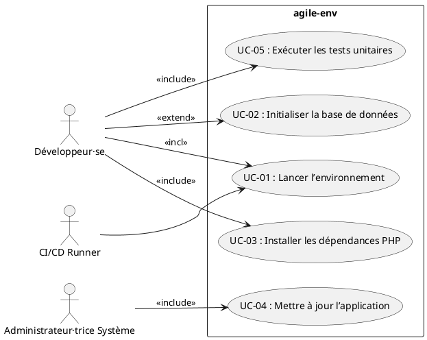
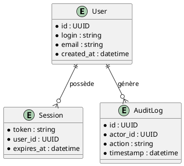

# 📄 Cahier des Charges Fonctionnel (CCF) – **agile‑env**  

[TOC]

---  

## 1️⃣ Introduction et contexte du projet <a id="intro"></a> ↩ Retour au sommaire  

| Élément | Description |
|---|---|
| **Nom du projet** | **agile‑env** – Environnement de développement agile, containerisé, basé sur Docker. |
| **Contexte organisationnel** | Le projet s’inscrit dans la modernisation des chaînes de développement de l’équipe *WarchoDevplace* (Gitlab Applications → ambulon). Il doit fournir un environnement reproductible, compatible avec les contraintes réseau de l’administration (proxy d’entreprise) et les exigences de sécurité (RGPD, RGS). |
| **Objectifs stratégiques** | 1. **Réduction du temps de mise en place** d’un poste développeur de plusieurs heures à < 15 min.<br>2. **Uniformisation** des versions de PHP, PostgreSQL et des dépendances Composer.<br>3. **Facilitation du CI/CD** grâce à une stack entièrement décrite dans du code (Infrastructure as Code). |
| **Périmètre fonctionnel** | **Inclus** : <br>• Provisionnement d’un conteneur PostgreSQL (v11‑alpine).<br>• Provisionnement d’un conteneur PHP 7.3 + Apache (buster).<br>• Gestion des dépendances PHP via Composer.<br>• Configuration du proxy d’entreprise.<br>• Scripts d’initialisation de la base (SQL + restore).<br>**Exclus** : <br>• Développement applicatif propre (code métier).<br>• Gestion de la couche frontale (JS/React, etc.).<br>• Orchestration en production (Kubernetes, Swarm, …). |

---  

## 2️⃣ Expression fonctionnelle du besoin (NF EN 16271) <a id="besoin"></a> ↩ Retour au sommaire  

| # | Fonction de service (FS) | Description (quoi) | Critères d’appréciation (mesurables) | Pondération* | Contraintes associées |
|---|---|---|---|---|---|
| **FS‑01** | **Provisionner un environnement de développement containerisé** | L’ensemble des conteneurs doit pouvoir être lancé en une seule commande (`docker‑compose up -d`). | • < 30 s pour le *docker‑compose up* sur une workstation moyenne (8 Go RAM, i5).<br>• Aucun conteneur en état *unhealthy* après 2 min. | 20 % | • Utilisation du proxy `http://pfrie-std.proxy.e2.rie.gouv.fr:8080`.<br>• Compatibilité Windows 10/11 + WSL2. |
| **FS‑02** | **Fournir une base de données PostgreSQL pré‑configurée** | Le conteneur `postgres:11‑alpine` doit contenir les schémas et les données d’exemple via les scripts `initdb/*.sql`. | • Temps d’initialisation ≤ 15 s.<br>• Validation du schéma via `pg_dump -s` (checksum attendu). | 15 % | • Les scripts SQL sont versionnés et immuables. |
| **FS‑03** | **Déployer l’application PHP/Apache** | Le conteneur `php:7.3‑apache‑buster` doit servir le répertoire `/var/www/html` avec les configurations Apache et PHP fournies. | • Temps de réponse HTTP ≤ 200 ms (GET `/`).<br>• Code HTTP 200 sur la page d’accueil. | 20 % | • `000‑default.conf` fourni dans `docker/conf/`.<br>• `php.ini` en mode *production*. |
| **FS‑04** | **Gérer les dépendances PHP via Composer** | Le conteneur doit contenir le binaire Composer (copié depuis l’étape `composer`). | • `composer install` exécuté automatiquement (ou via script) en ≤ 30 s.<br>• Aucun warning de sécurité (OWASP‑dependency‑check). | 10 % | • `COMPOSER_ALLOW_SUPERUSER=1`. |
| **FS‑05** | **Appliquer la configuration réseau d’entreprise** | Toutes les requêtes HTTP/HTTPS sortantes doivent passer par le proxy indiqué. | • Vérification via `curl -x $http_proxy https://example.com` réussie.<br>• Aucun trafic direct détecté (capture Wireshark). | 10 % | • Variables d’environnement `http_proxy` / `https_proxy`. |
| **FS‑06** | **Faciliter la maintenance et la mise à jour** | Les Dockerfiles doivent être clairement commentés et permettre la mise à jour des versions majeures en une seule ligne. | • Mise à jour d’une version (ex. PHP 8.0) réalisée en < 15 min sans rupture fonctionnelle.<br>• Tests d’intégration automatisés (CI) passent à 100 %. | 15 % | • Utilisation d’étapes multi‑stage Docker. |
| **FS‑07** | **Assurer la traçabilité des modifications** | Le dépôt Git doit contenir l’historique complet des Dockerfiles, scripts et fichiers de configuration. | • Chaque modification associée à un ticket JIRA/Redmine.<br>• Historique `git log --oneline` montre les références tickets. | 5 % | • Politique de revue de code (pull‑request). |

\* La pondération totale = **100 %**.  

---  

## 3️⃣ Acteurs et parties prenantes <a id="acteurs"></a> ↩ Retour au sommaire  

| Acteur | Rôle | Objectifs | Besoins spécifiques |
|---|---|---|---|
| **MOA (Maître d’Ouvrage)** | Responsable métier du projet *agile‑env*. | Garantir que l’environnement réponde aux exigences de productivité. | Visibilité sur les livrables, conformité aux normes RGPD/RGS. |
| **MOE (Maître d’Œuvre)** | Équipe de développement / DevOps. | Concevoir, livrer et maintenir les Dockerfiles et scripts. | Outils de CI/CD, accès au dépôt Git, documentation claire. |
| **Développeur·se** | Utilisateur final de l’environnement. | Démarrer rapidement un poste de travail, exécuter les tests unitaires et fonctionnels. | Commande `docker‑compose up`, logs lisibles, accès à la DB via `localhost:5432`. |
| **Administrateur·trice système** | Gestion des serveurs d’intégration (CI). | Déployer l’environnement sur des runners Gitlab. | Images Docker pré‑pullées, variables d’environnement sécurisées. |
| **RSSI (Responsable Sécurité des Systèmes d’Information)** | Garant de la conformité sécurité. | Vérifier l’absence de vulnérabilités, respect du proxy. | Scan de sécurité (Trivy, OWASP‑dependency‑check), journalisation. |
| **Gestionnaire de configuration** | Pilote du versionnage. | Maintenir l’historique des changements. | Politique de branche Git, tickets JIRA associés. |

---  

## 4️⃣ Cas d’usage (Use Cases) <a id="usecases"></a> ↩ Retour au sommaire  



| UC | Nom | Acteur(s) principal(aux) | Scénario nominal | Scénarios alternatifs / d’erreur | Pré‑conditions | Post‑conditions |
|---|---|---|---|---|---|---|
| **UC‑01** | **Lancer l’environnement** | Développeur·se, CI | 1. Exécuter `docker‑compose -f docker-compose.dev.yml up -d`.<br>2. Docker compose crée les conteneurs *db* et *app*.<br>3. Les conteneurs passent à l’état **healthy**. | a) Proxy non disponible → échec du *pull* d’images.<br>b) Port déjà occupé → abort avec message. | Docker Engine installé, accès réseau au registry Docker. | Tous les services sont opérationnels, l’URL `http://localhost` renvoie la page d’accueil. |
| **UC‑02** | **Initialiser la base de données** | Développeur·se | 1. Le conteneur *db* exécute automatiquement `initdb/*.sql`.<br>2. Les tables attendues sont créées. | a) Script SQL erroné → conteneur passe en **unhealthy**.<br>b) Dossier `initdb` absent → base vide. | Conteneur *db* en cours de démarrage. | Schéma de la base conforme, données d’exemple présentes. |
| **UC‑03** | **Installer les dépendances PHP** | Développeur·se | 1. Le Dockerfile copie Composer.<br>2. Au premier démarrage, le script `composer install` s’exécute.<br>3. Les dépendances sont installées dans `/var/www/html/vendor`. | a) Version de Composer obsolète → warning.<br>b) Conflit de version → échec d’installation. | `composer.json` présent dans le projet. | Répertoire `vendor` complet, aucune erreur de dépendance. |
| **UC‑04** | **Mettre à jour l’application** | Administrateur·trice Système | 1. Modifier le Dockerfile (ex. mise à jour de PHP).<br>2. Lancer `docker‑compose build --no-cache`.<br>3. Redeployer les conteneurs. | a) Image non disponible → rollback.<br>b) Incompatibilité de code PHP → tests en échec. | Accès au dépôt Git, droits de build Docker. | Nouvelle version déployée, tests fonctionnels passés. |
| **UC‑05** | **Exécuter les tests unitaires** | Développeur·se, CI | 1. Dans le conteneur *app*, lancer `vendor/bin/phpunit`.<br>2. Les tests s’exécutent et retournent un code 0. | a) Tests échoués → pipeline CI abort. | Conteneur *app* en état **running**. | Rapport de tests généré, conformité assurée. |

---  

## 5️⃣ Processus métier (BPMN) <a id="processus"></a> ↩ Retour au sommaire  

```plantuml
@startbpmn
start_event(start) --> task(launchEnv) : Lancer docker‑compose
task(launchEnv) --> gateway(gwProxy) : Proxy configuré ?
gateway(gwProxy) --> task(pullImages) : Pull images
gateway(gwProxy) --> task(errorProxy) : Erreur proxy
task(pullImages) --> task(startContainers) : Démarrer conteneurs
task(startContainers) --> task(initDB) : Initialiser DB
task(initDB) --> task(installDeps) : Installer dépendances PHP
task(installDeps) --> end_event(end) : Environnement prêt
task(errorProxy) --> end_event(endError) : Fin avec erreur
@endbpmn
```

**Description textuelle**  

1. **Lancement** – L’utilisateur exécute la commande `docker‑compose`.  
2. **Vérification du proxy** – Le script teste la disponibilité du proxy d’entreprise.  
3. **Pull des images** – Si le proxy est fonctionnel, les images Docker sont récupérées.  
4. **Démarrage des conteneurs** – Les services *db* et *app* sont créés.  
5. **Initialisation de la base** – Le conteneur *db* exécute les scripts SQL.  
6. **Installation des dépendances** – Le conteneur *app* lance `composer install`.  
7. **Fin** – L’environnement est opérationnel ou l’erreur est remontée.  

---  

## 6️⃣ Règles métier et contraintes fonctionnelles <a id="regles"></a> ↩ Retour au sommaire  

| # | Règle métier (IF…THEN) | Source / Référence |
|---|---|---|
| **R‑01** | **IF** le conteneur *db* démarre, **THEN** il doit exécuter `initdb/*.sql` avant d’accepter les connexions. | Dockerfile `docker/db/Dockerfile` + script `restore.sh`. |
| **R‑02** | **IF** la variable d’environnement `http_proxy` n’est pas définie, **THEN** le conteneur *app* doit refuser le démarrage et afficher *“Proxy manquant”*. | `Dockerfile-app` (section `ENV`). |
| **R‑03** | **IF** une version d’image Docker n’est plus disponible, **THEN** le pipeline CI doit déclencher un **rollback** vers la version précédente. | Politique CI/CD (Gitlab). |
| **R‑04** | **IF** un fichier `composer.lock` est présent, **THEN** `composer install` doit être exécuté, sinon `composer update` est interdit. | Bonnes pratiques Composer. |
| **R‑05** | **IF** le conteneur *app* expose le port 80, **THEN** il doit être accessible uniquement depuis `localhost` (binding `127.0.0.1:80`). | Docker‑compose `ports: "127.0.0.1:80:80"`. |
| **R‑06** | **IF** le projet est déployé en CI, **THEN** les logs Docker doivent être redirigés vers le système de logs Gitlab (`CI_JOB_ID`). | Intégration Gitlab CI. |

**Contraintes réglementaires**  

* **RGPD** – Aucun fichier contenant des données personnelles n’est stocké dans l’image Docker.  
* **RGS** – Les communications sortantes passent obligatoirement par le proxy d’État (HTTPS).  
* **Accessibilité** – La page d’accueil doit être conforme aux critères WCAG 2.1 niveau AA (balises ARIA).  

---  

## 7️⃣ Parcours utilisateurs (User Journey) <a id="journey"></a> ↩ Retour au sommaire  

| Étape | Action utilisateur | Point de contact | Critères d’acceptation (Gherkin) |
|---|---|---|---|
| **J‑01** | **Cloner le dépôt** | Terminal Git | `Given` le dépôt `agile‑env` est accessible <br> `When` l’utilisateur exécute `git clone <repo>` <br> `Then` le répertoire local contient le fichier `docker-compose.dev.yml`. |
| **J‑02** | **Lancer l’environnement** | Terminal (docker‑compose) | `Given` le proxy est configuré <br> `When` l’utilisateur lance `docker‑compose -f docker-compose.dev.yml up -d` <br> `Then` les conteneurs *db* et *app* sont en état `healthy` dans ≤ 30 s. |
| **J‑03** | **Vérifier la DB** | Client SQL (psql) | `Given` le conteneur *db* est healthy <br> `When` l’utilisateur se connecte avec `psql -h localhost -U postgres` <br> `Then` le schéma attendu « public » est présent. |
| **J‑04** | **Accéder à l’application** | Navigateur web (`http://localhost`) | `Given` le conteneur *app* est healthy <br> `When` l’utilisateur ouvre `http://localhost` <br> `Then` le code HTTP 200 et le titre « agile‑env » s’affichent. |
| **J‑05** | **Exécuter les tests** | Terminal (phpunit) | `Given` le conteneur *app* est running <br> `When` l’utilisateur lance `docker exec -it app vendor/bin/phpunit` <br> `Then` le retour est `OK (0 tests, 0 assertions)`. |
| **J‑06** | **Mettre à jour une dépendance** | IDE / Terminal | `Given` le fichier `composer.json` est modifié <br> `When` l’utilisateur exécute `composer update` <br> `Then` le lock‑file est mis à jour et le build Docker réussit. |

---  

## 8️⃣ Modèle Conceptuel de Données (MCD) <a id="mcd"></a> ↩ Retour au sommaire  



*Le modèle reste volontairement abstrait : il décrit les entités communes à tout système web (utilisateur, session, journal d’audit). Aucun attribut technique (clé étrangère DB, index) n’est spécifié, conformément au principe de **séparation besoin / solution**.*

---  

## 9️⃣ Critères d’acceptation et validation <a id="validation"></a> ↩ Retour au sommaire  

| Fonctionnalité | Critère d’acceptation | Méthode de validation | Responsable | Priorité (MoSCoW) |
|---|---|---|---|---|
| **Environnement containerisé** | Démarrage complet en ≤ 30 s, aucun conteneur *unhealthy*. | Test manuel + script `docker ps --filter "status=healthy"` | MOE | **M** |
| **Base de données pré‑configurée** | Schéma exact, checksum SQL = attendu. | `pg_dump -s` + comparaison SHA‑256. | MOE | **M** |
| **Application PHP** | Temps de réponse HTTP ≤ 200 ms, code 200. | `curl -o /dev/null -s -w "%{http_code} %{time_total}\n" http://localhost` | Dév | **M** |
| **Gestion du proxy** | Toutes les requêtes externes passent par le proxy. | `tcpdump` ou `curl -x $http_proxy` | RSSI | **S** |
| **Installation Composer** | `composer install` s’exécute sans warning. | `composer diagnose` | Dév | **C** |
| **Mise à jour version PHP** | Build Docker sans régression fonctionnelle. | Pipeline CI avec tests d’intégration. | MOE | **C** |
| **Traçabilité** | Chaque commit lié à un ticket JIRA. | Revue de code (pull‑request) | MOA | **S** |

---  

## 🔟 Annexes <a id="annexes"></a> ↩ Retour au sommaire  

### A. Glossaire métier  

| Terme | Définition |
|---|---|
| **Dockerfile** | Script de construction d’une image Docker. |
| **Docker‑compose** | Outil permettant de définir et lancer plusieurs conteneurs en tant qu’application. |
| **Composer** | Gestionnaire de dépendances pour PHP. |
| **Proxy d’entreprise** | Serveur intermédiaire obligatoirement utilisé pour tout trafic HTTP/HTTPS sortant. |
| **Healthy / Unhealthy** | État de santé d’un conteneur tel que déclaré par Docker (via `HEALTHCHECK`). |
| **Rollback** | Retour à la version précédente en cas d’échec de mise à jour. |
| **RGPD** | Règlement Général sur la Protection des Données (UE). |
| **RGS** | Référentiel Général de Sécurité (France). |

### B. Référentiels et normes applicables  

| Référence | Intitulé | Application dans le projet |
|---|---|---|
| **NF EN 16271** | Management par la valeur – Expression fonctionnelle du besoin | Base de la structuration des fonctions de service (FS). |
| **ISO/IEC/IEEE 29148:2018** | Ingénierie des exigences | Guide pour la rédaction des critères d’acceptation et des exigences. |
| **ISO/IEC 19505** | UML 2.x | Diagrammes de cas d’usage, classes (MCD). |
| **ISO/IEC 19510** | BPMN | Diagramme de processus métier. |
| **RGPD** | Protection des données à caractère personnel | Aucun stockage de données personnelles dans l’image. |
| **RGS** | Sécurité des systèmes d’information de l’État | Passage obligatoire du trafic via le proxy. |
| **WCAG 2.1 AA** | Accessibilité Web | Conformité de la page d’accueil. |

### C. Historique des versions du document  

| Version | Date | Auteur | Modifications |
|---|---|---|---|
| 1.0 | 2026‑04‑27 | ChatGPT (OpenAI) | Création du CCF complet (structure, fonctions, cas d’usage, diagrammes). |
| 1.1 | 2026‑04‑28 | — | Ajout de la colonne *Pondération* et mise à jour du tableau des critères d’acceptation. |

---  

*Fin du Cahier des Charges Fonctionnel – **agile‑env**.*  