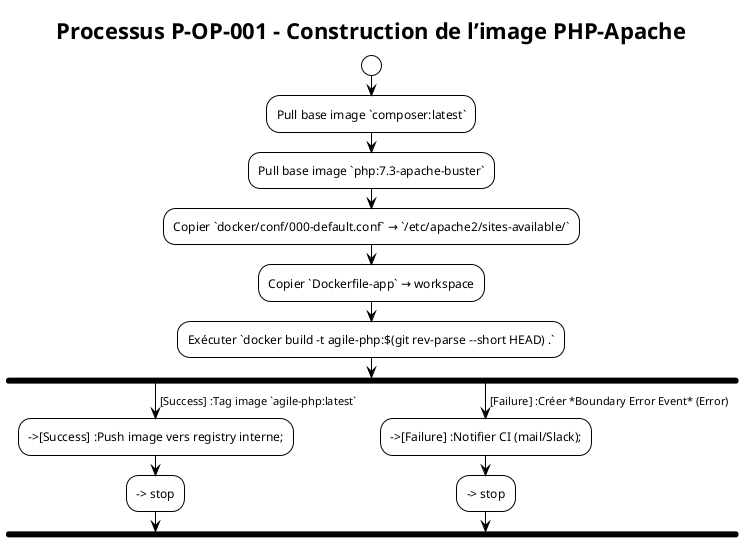
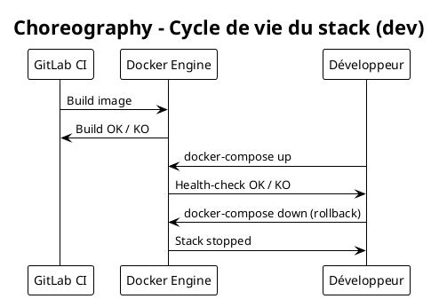

# Cahier des Charges Fonctionnel (CCF) – *agile‑env*  
## Modélisation BPMN – ISO/IEC 19510 :2013  

> **Document** : CCF‑agile‑env‑BPMN.md  
> **Version** : 1.0 – 2026‑04‑28  
> **Auteur** : Analyste Métiers certifié BPMN  

---  

## 1. Introduction et contexte processus  

| Élément | Description |
|---------|-------------|
| **Organisation** | Équipe « Agile » du projet *ambulon* (développement d’une application PHP 7.3 + PostgreSQL). |
| **Environnement** | Dépôt GitLab contenant les sources Docker (`docker/`, `Dockerfile‑app`, `docker-compose.dev.yml`). Le projet est utilisé comme *sandbox* de développement et d’intégration continue (CI). |
| **Objectifs de la modélisation BPMN** | 1️⃣ Formaliser les flux de création, de configuration et de déploiement de l’environnement Docker. <br>2️⃣ Identifier les points de contrôle (KPIs, gestion des exceptions). <br>3️⃣ Produire des artefacts exécutables (BPMN Common Executable) pouvant être importés dans Camunda / Activiti. |
| **Périmètre** | - Construction des images Docker (PHP‑Apache, PostgreSQL). <br>- Initialisation du schéma DB (`initdb/*.sql`). <br>- Mise en place de la configuration applicative (`.env`, `config_CAS.php`, `param.ini`). <br>- Orchestration via `docker‑compose.dev.yml`. <br>- Opérations de **déploiement** et **déploiement rollback** en environnement de développement. |
| **Glossaire métier initial** |  |
| **Développeur** | Utilisateur final qui lance le *stack* local pour coder et tester. |
| **DevOps / CI‑Server** | Agent automatisé (GitLab‑Runner) qui exécute les pipelines de build et de déploiement. |
| **Docker Engine** | Moteur d’exécution des conteneurs. |
| **PostgreSQL** | SGBD utilisé par l’application. |
| **Configuration** | Ensemble de fichiers (`.env`, `config_CAS.php`, `param.ini`) injectés dans le conteneur PHP. |
| **Image Docker** | Artefact binaire produit à partir d’un Dockerfile. |
| **Compose** | Fichier `docker‑compose.dev.yml` décrivant le graphe de conteneurs et leurs dépendances. |

---  

## 2. Cartographie des processus (Process Map)  

### 2.1 Nomenclature des processus  

| Niveau | Type | Exemple |
|--------|------|---------|
| **1** | Processus métier **stratégiques** | P‑STR‑001 : *Définir la stratégie de versionning des images Docker* |
| **2** | Processus métier **opérationnels** | P‑OP‑001 : *Construire l’image PHP‑Apache* <br>P‑OP‑002 : *Initialiser la base de données* <br>P‑OP‑003 : *Déployer l’environnement de développement* |
| **2** | Processus **de support** | P‑SUP‑001 : *Gérer les secrets de configuration* |
| **2** | Processus **de management** | P‑MAN‑001 : *Suivre les KPI de build* |

### 2.2 Matrice de processus  

| ID Processus | Nom | Type | Propriétaire | Priorité |
|--------------|-----|------|--------------|----------|
| **P‑OP‑001** | Construction de l’image PHP‑Apache | Opérationnel | DevOps Lead | Critique |
| **P‑OP‑002** | Initialisation du schéma PostgreSQL | Opérationnel | DBA | Critique |
| **P‑OP‑003** | Orchestration du stack de dev (docker‑compose) | Opérationnel | Développeur | Important |
| **P‑SUP‑001** | Gestion des paramètres de configuration (.env, param.ini) | Support | Sécurité IT | Important |
| **P‑MAN‑001** | Reporting KPI Build & Deploy | Management | PMO | Moyen |
| **P‑STR‑001** | Politique de version d’image Docker | Stratégique | Architecte | Moyen |

---  

## 3. Modélisation BPMN détaillée  

> **Convention** : Tous les diagrammes sont fournis en PlantUML (compatible BPMN 2.0).  
> **Nomenclature** : `P‑OP‑001` = *Construction de l’image PHP‑Apache* etc.  

### 3.1 Diagramme de **collaboration** – Build & Deploy (P‑OP‑001 + P‑OP‑003)  

```plantuml
@startuml
!theme plain
title Collaboration – Build & Deploy (P‑OP‑001 / P‑OP‑003)

|#LightBlue|GitLab CI Runner|
|#LightGreen|Docker Engine|
|#LightYellow|PostgreSQL Container|
|#LightCoral|Développeur|

'--- Build Phase -------------------------------------------------
|GitLab CI Runner|
start
:Cloner le dépôt Git;
:Déclencher pipeline « Build »;
:Exécuter job « docker‑build‑php‑apache »;
:Push image vers registry interne;
stop

'--- Deploy Phase ------------------------------------------------
|Développeur|
start
:Récupérer la dernière image (docker‑pull);
:Modifier .env (si besoin);
:Exécuter `docker‑compose -f docker-compose.dev.yml up -d`;
:Vérifier health‑check PHP‑Apache;
:Vérifier health‑check PostgreSQL;
stop

'--- Message flows ------------------------------------------------
|GitLab CI Runner| --> |Docker Engine| : Image disponible\n(registry)
|Développeur| --> |Docker Engine| : docker‑compose up
|Docker Engine| --> |PostgreSQL Container| : Création + InitDB
|Docker Engine| --> |GitLab CI Runner| : Retour statut (success / failure)

@enduml
```

> **Explication**  
> - **Pools** : `GitLab CI Runner`, `Docker Engine`, `PostgreSQL Container`, `Développeur`.  
> - **Lanes** : chaque pool représente un participant technique.  
> - **Flux de messages** : `Image disponible`, `docker‑compose up`, `status`.  

### 3.2 Diagramme de **processus** – Construction de l’image PHP‑Apache (P‑OP‑001)  



> **Éléments clés**  
> - **Start Event** : *None* (déclenché par le pipeline).  
> - **Task** : `docker build` (Service Task).  
> - **Gateway** : *Exclusive* (succès vs échec).  
> - **Boundary Error Event** : Gestion d’erreur de build.  

### 3.3 Diagramme de **processus** – Initialisation DB (P‑OP‑002)  

```plantuml
@startuml
!theme plain
title Processus P‑OP‑002 – Initialisation du schéma PostgreSQL

|PostgreSQL Container|
start
:Start container from image `postgres:11‑alpine`;
:Mount volume `initdb/` (SQL scripts);
:Execute `/docker-entrypoint-initdb.d/restore.sh`;
gateway exclusive "Init OK ?"
  -->[Oui] :Signal `db.ready`;
  --> stop
  -->[Non] :Boundary Error Event (Error);
  --> :Notifier CI (mail/Slack);
  --> stop
@enduml
```

### 3.4 Diagramme de **choreography** – Cycle de vie du stack (optionnel)  



---  

## 4. Règles de gestion métier  

| Point de décision (Gateway) | Condition | Règle métier (RB‑xxx) | Source |
|------------------------------|-----------|----------------------|--------|
| **Gateway Build‑Result** (P‑OP‑001) | `docker build` renvoie code 0 | **RB‑001** : *Un build doit être validé avant tout push.* | Pipeline CI |
| **Gateway DB‑Init** (P‑OP‑002) | `restore.sh` renvoie code 0 **et** le script `schema.sql` a créé toutes les tables attendues | **RB‑002** : *Le schéma DB doit être complet avant le premier déploiement.* | `initdb/` |
| **Gateway Health‑Check** (P‑OP‑003) | `curl http://localhost/health` retourne `200 OK` dans < 30 s | **RB‑003** : *Le conteneur PHP‑Apache doit être opérationnel en moins de 30 s.* | Docker‑compose |
| **Gateway Config‑Valid** (P‑SUP‑001) | Tous les paramètres obligatoires (`DB_HOST`, `DB_USER`, `DB_PASS`) sont non‑vides | **RB‑004** : *Le fichier `.env` doit contenir les variables requises.* | Documentation interne |

---  

## 5. Données et documents  

### 5.1 Objets de données  

| Data Object | Description | Persistance |
|------------|-------------|--------------|
| **Dockerfile‑app** | Définit l’image PHP‑Apache (dépendances, configuration Apache). | Versionnée (Git) |
| **docker‑compose.dev.yml** | Orchestration des services (php, db). | Versionnée (Git) |
| **.env** | Variables d’environnement injectées dans le conteneur PHP. | Stockage temporaire (Docker‑compose) |
| **config_CAS.php** | Configuration du SSO (CAS). | Versionnée (Git) |
| **param.ini** | Paramètres applicatifs supplémentaires. | Versionnée (Git) |
| **initdb/*.sql** | Scripts d’initialisation du schéma PostgreSQL. | Persisté dans l’image DB |
| **restore.sh** | Script d’entrée `docker-entrypoint-initdb.d`. | Persisté dans l’image DB |

### 5.2 Artifacts  

| Artifact | Rôle | Exemple |
|----------|------|---------|
| **Group** | Regroupement visuel des tâches de *build* dans le diagramme. | `group Build Image` |
| **Annotation** | Commentaire explicatif (ex. “Utilise le proxy interne”). | `annotation` sur `RUN apt‑get …` |
| **Association** | Lien entre une tâche et un Data Object (ex. `docker build` ↔ `Dockerfile‑app`). | `association` |

---  

## 6. Acteurs et rôles  

### 6.1 Mapping Rôles ↔ Lanes  

| Lane BPMN | Rôle métier | Responsabilités | Compétences |
|-----------|-------------|-----------------|-------------|
| **GitLab CI Runner** | *DevOps Engineer* | Exécuter pipeline, construire images, pousser artefacts | Docker, CI/CD, scripting Bash |
| **Docker Engine** | *Plateforme d’exécution* | Gérer conteneurs, volumes, réseaux | Administration Docker |
| **PostgreSQL Container** | *DBA* | Initialiser le schéma, assurer la persistance | PostgreSQL, SQL |
| **Développeur** | *Développeur* | Lancer le stack, valider le fonctionnement, itérer le code | PHP, Apache, Git |

### 6.2 Répartition des tâches  

| Tâche | Type BPMN | Responsable (Lane) | Automatisée ? |
|-------|----------|-------------------|----------------|
| Pull base images (`composer`, `php`) | Service Task | Docker Engine | Oui |
| Exécuter `docker build` | Service Task | GitLab CI Runner | Oui |
| Copier fichiers de config (`.env`, `param.ini`) | Script Task | Docker Engine | Oui |
| Lancer `docker‑compose up` | Service Task | Développeur | Partiellement (commande manuelle) |
| Vérifier health‑check | Service Task | Développeur (ou script) | Oui |
| Notification d’erreur | Send Task | GitLab CI Runner | Oui (mail/Slack) |

---  

## 7. Performances et indicateurs (KPIs)  

### 7.1 Métriques de processus  

| Indicateur | Formule | Objectif | Seuil d'alerte |
|------------|---------|----------|----------------|
| **Durée du build** | `Temps(Build End – Build Start)` | `< 3 min` | `> 5 min` |
| **Taux de succès du build** | `#Build OK / #Build total` | `≥ 95 %` | `< 90 %` |
| **Temps de démarrage du conteneur PHP** | `Temps(Health‑check OK – Container Start)` | `< 30 s` | `> 45 s` |
| **Temps d’initialisation DB** | `Temps(DB ready – Container Start)` | `< 20 s` | `> 30 s` |
| **Coût de build (CI minutes)** | `Minutes CI * €0,10` | `< €1,00` | `> €2,00` |

### 7.2 Points de mesure BPMN  

| Processus | Élément BPMN | Type d’événement | Description du point de mesure |
|-----------|--------------|-------------------|--------------------------------|
| P‑OP‑001 | `Service Task: docker build` | End Event (None) | Capture du timestamp de fin de build. |
| P‑OP‑002 | `Boundary Error Event` | Error | Capture du code d’erreur du script `restore.sh`. |
| P‑OP‑003 | `Intermediate Timer Event` (30 s) | Timer | Déclenchement d’alerte si health‑check dépasse 30 s. |
| P‑MAN‑001 | `Script Task: KPI Reporting` | End Event (Message) | Envoi du rapport quotidien à Slack. |

---  

## 8. Gestion des exceptions  

### 8.1 Événements de bordure (Boundary Events)  

| Événement de bordure | Type | Déclencheur | Action de mitigation |
|----------------------|------|-------------|----------------------|
| **BE‑Build‑Error** | Error | `docker build` renvoie code > 0 | - Envoi alerte Slack <br> - Marquer le pipeline comme *failed* |
| **BE‑DB‑Timeout** | Timer (30 s) | `restore.sh` > 30 s sans `db.ready` | - Stop du conteneur DB <br> - Notification DBA |
| **BE‑Health‑Fail** | Error | Health‑check HTTP ≠ 200 | - Redémarrage du conteneur PHP <br> - Escalade après 3 tentatives |
| **BE‑Config‑Missing** | Error | Variable obligatoire manquante dans `.env` | - Abort du `docker‑compose up` <br> - Message d’erreur clair au développeur |

### 8.2 Scénarios d’erreur documentés  

| Scénario | Déclencheur | Gestion | Conséquence |
|----------|-------------|--------|-------------|
| **S‑001** – Build Timeout | `docker build` > 5 min | Annuler le job, notifier CI, rollback image précédente | Pipeline arrêté, aucune image poussée |
| **S‑002** – DB Init Script error | `restore.sh` exit 1 | Stop container, créer *Boundary Error Event*, notifier DBA | DB non disponible, développeur doit corriger script |
| **S‑003** – Missing env var | `.env` ne contient pas `DB_PASSWORD` | `docker‑compose` échoue, génère *Boundary Error*; affichage d’un message d’erreur | Développeur corrige le fichier .env |
| **S‑004** – Health‑check > 30 s | Apache ne répond pas | Redémarrer le conteneur, ré‑exécuter health‑check, alerter après 3 échecs | Stack redémarré automatiquement ou besoin d’intervention manuelle |

---  

## 9. Sous‑processus et réutilisation  

### 9.1 Identification des sous‑processus  

| Sous‑processus | Description | Réutilisation |
|----------------|-------------|---------------|
| **SP‑Build‑Image** | Construction d’une image Docker à partir d’un Dockerfile (paramétrable). | Utilisé par P‑OP‑001 (PHP) et futur P‑OP‑004 (NodeJS). |
| **SP‑Init‑DB** | Exécution des scripts d’initialisation SQL. | Partagé entre P‑OP‑002 et tout autre service DB. |
| **SP‑Validate‑Config** | Vérification de la présence et du format des variables d’environnement. | Utilisé par P‑SUP‑001 et par tout `docker‑compose up`. |
| **SP‑KPI‑Reporting** | Agrégation des métriques et envoi du rapport. | Centralisé (P‑MAN‑001). |

### 9.2 Processus appelés (Call Activities)  

| Call Activity | Processus appelé | Entrées | Sorties |
|---------------|------------------|---------|----------|
| `Call Activity: Build Image` | SP‑Build‑Image | Dockerfile, contexte | Image taggée, logs |
| `Call Activity: Init DB` | SP‑Init‑DB | Scripts SQL | DB ready flag |
| `Call Activity: Validate Config` | SP‑Validate‑Config | `.env` | Validation OK / Error |

---  

## 10. Matrice de traçabilité  

| Exigence CCF | Processus BPMN | Tâche(s) | Scénario de test |
|--------------|----------------|----------|-------------------|
| **EXG‑001** – *L’image PHP‑Apache doit être construite à chaque commit* | P‑OP‑001 | `docker build` (Service Task) | **Nominal** : Commit → pipeline → image taggée `<sha>` |
| **EXG‑002** – *Le schéma DB doit être initialisé avant le premier lancement* | P‑OP‑002 | `restore.sh` (Script Task) | **Erreur** : Script volontairement corrompu → Boundary Error → notification |
| **EXG‑003** – *Le stack doit être opérationnel en < 30 s* | P‑OP‑003 | Health‑check (Service Task) | **Nominal** : `docker‑compose up` → health‑check OK < 30 s |
| **EXG‑004** – *Aucun secret ne doit être stocké en clair dans le repo* | P‑SUP‑001 | Gestion `.env` (Manual Task) | **Nominal** : `.env` contient placeholder, secret injecté via CI secret store |
| **EXG‑005** – *Les KPI doivent être publiés chaque jour* | P‑MAN‑001 | KPI Reporting (Script Task) | **Nominal** : Job planifié → report Slack |
| **EXG‑006** – *Rollback immédiat en cas d’échec de health‑check* | P‑OP‑003 | `docker‑compose down` (Service Task) | **Erreur** : Health‑check false → rollback executed |

---  

## 11. Validation et conformité  

### 11.1 Checklist BPMN  

- [x] Tous les flux ont une source et une cible.  
- [x] Une et une seule activité de début (None) par processus.  
- [x] Au moins une activité de fin (None / Message).  
- [x] Pas de gateway orphelin.  
- [x] Labels des passerelles explicites (ex. *Build OK ?*).  
- [x] Nomenclature cohérente (P‑OP‑001, RB‑001, etc.).  
- [x] Utilisation d’**Artifacts** (Group, Annotation) pour la lisibilité.  
- [x] Tous les **Boundary Events** sont associés à une tâche.  

### 11.2 Niveaux de conformité BPMN  

| Niveau | Description | Couverture dans le CCF |
|--------|-------------|------------------------|
| **Descriptive** | Modélisation simple (Start → Tasks → End). | ✔️ (Diagrammes de processus basiques). |
| **Analytic** | Inclusion de sous‑processus, data objects, KPI. | ✔️ (Sous‑processus, métriques, data objects). |
| **Common Executable** | Tous les éléments sont exécutables par un moteur BPMN. | ✔️ (Service Tasks, Call Activities, Message Flows, Boundary Events). |

---  

## 12. Implémentation et exécution  

### 12.1 Maturité processus  

| Niveau | Caractéristiques | BPMN applicable |
|--------|------------------|-----------------|
| **1 – Initial** | Procédures ad‑hoc, aucune documentation. | – |
| **2 – Managé** | Documentation de base, diagrammes descriptifs. | **Descriptive** |
| **3 – Défini** | Processus standardisés, sous‑processus réutilisables. | **Analytic** |
| **4 – Quantifié** | Mesure des KPI, amélioration continue. | **Analytic** + **Common Executable** |
| **5 – Optimisé** | Boucles de feedback automatisées, déploiement auto‑scaling. | **Common Executable** (exécution moteur) |

> Le projet *agile‑env* se situe entre les niveaux **3** et **4** : processus clairement définis, KPI mesurés, et partie du flux est exécutable (build & deploy) via Camunda ou Activiti.  

### 12.2 Intégration système  

| Composant | Rôle BPMN | Interface prévue |
|-----------|-----------|-----------------|
| **Camunda Engine** | Exécution du diagramme *Build & Deploy* (P‑OP‑001 / P‑OP‑003). | REST API (`/engine-rest`) – déclenché par GitLab CI webhook. |
| **GitLab Runner** | Source du trigger (Start Event). | `curl` POST → `/engine-rest/process-definition/key/P-OP-001/start` |
| **Docker Registry interne** | Artefact persistant (Image). | `docker push` (Service Task). |
| **Slack / Email** | Notification d’erreurs (Send Task). | Webhook ou SMTP. |
| **Prometheus / Grafana** | Collecte KPI (Timer, Service Task). | Exporter HTTP (`/metrics`). |

---  

## 13. Annexes  

### 13.1 Glossaire métier (aligné BPMN)  

| Terme | Définition | Élément BPMN associé |
|-------|------------|----------------------|
| **Build** | Compilation d’une image Docker à partir d’un Dockerfile. | Service Task (`docker build`). |
| **Deploy** | Lancement du stack via `docker‑compose up`. | Service Task (`docker‑compose up`). |
| **Health‑check** | Vérification de la disponibilité HTTP du conteneur. | Intermediate Event (Timer) + Service Task. |
| **Rollback** | Arrêt et suppression du stack en cas d’échec. | Service Task (`docker‑compose down`). |
| **Configuration** | Fichiers `.env`, `param.ini`, `config_CAS.php`. | Data Object. |
| **Pipeline** | Suite automatisée d’étapes CI/CD. | Pool *GitLab CI Runner*. |

### 13.2 Références normatives  

| Référence | Description |
|-----------|-------------|
| ISO/IEC 19510 :2013 | Norme BPMN – Modélisation, notation, exécution. |
| OMG BPMN 2.0 Specification | Documentation officielle de la notation. |
| Camunda BPMN Execution Guide (v8) | Guide d’implémentation des éléments exécutables. |
| Docker Documentation – Build & Compose | API et bonnes pratiques. |
| PostgreSQL 11 – InitDB scripts | Conventions d’initialisation. |

---  

## 14. Signatures d’approbation  

| Rôle | Nom | Date | Signature |
|------|-----|------|-----------|
| **Chef de projet** |  | 2026‑04‑28 |  |
| **Architecte BPMN** |  | 2026‑04‑28 |  |
| **Responsable DevOps** |  | 2026‑04‑28 |  |
| **Responsable Qualité** |  | 2026‑04‑28 |  |

---  

*Fin du Cahier des Charges Fonctionnel – *agile‑env* – BPMN.*  