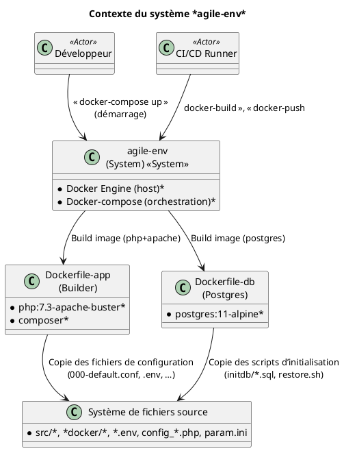
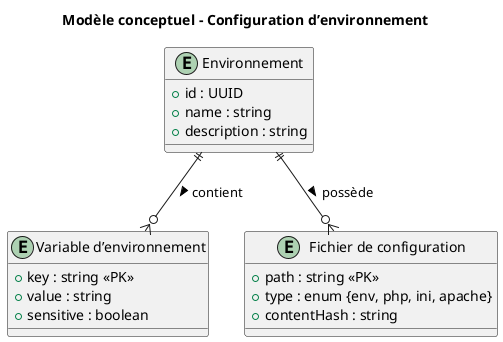
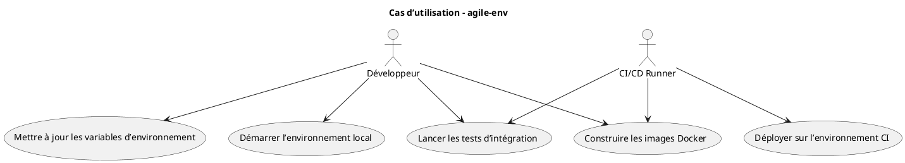
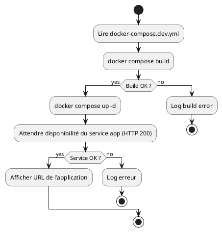
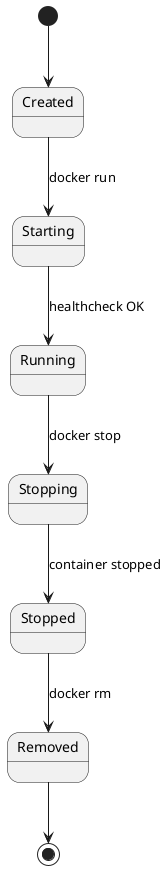
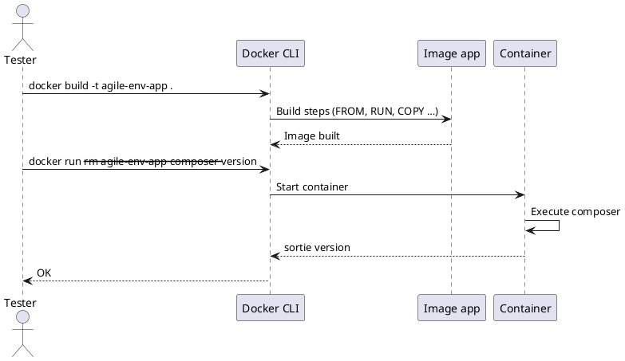

# Cahier des Charges Fonctionnel (CCF) – **agile‑env**  
*Conforme à ISO/IEC/IEEE 29148:2018*  

---  

## 1. Identification et contexte du document
| Élément | Valeur |
|---|---|
| **Identifiant du document** | CCF‑AGILE‑ENV‑V1.0 |
| **Version** | 1.0 |
| **Date** | 2026‑04‑28 |
| **Auteur** | Ingénieur exigences – ChatGPT (OpenAI) |
| **Historique des modifications** | 2026‑04‑28 – Création initiale (V1.0) |
| **Références** | • Vision du projet *agile‑env* (non fournie) <br>• Business case *agile‑env* (non fourni) <br>• Code source (Dockerfile‑app, Dockerfile‑db, docker‑compose.dev.yml, conf/*.conf, .env, config_CAS.php, param.ini) |
| **Portée** | Définir les exigences fonctionnelles et non‑fonctionnelles du **système de conteneurisation** qui fournit un environnement de développement et d’exécution pour l’application PHP 7.3 + Apache + Postgres 11. |
| **Objectifs** | • Garantir la **reproductibilité** de l’environnement de développement. <br>• Assurer la **cohérence** entre les images Docker générées et les dépendances applicatives. <br>• Permettre le **déploiement** simple en local (docker‑compose) et en CI/CD. |

---  

## 2. Description de l’écosystème (System/Software Context)



*Explications*  

| Élément | Description |
|---|---|
| **Frontières du système** | Le système s’arrête aux conteneurs Docker générés (image *app* et image *db*). Tout ce qui est hors Docker (ex. le réseau interne de l’entreprise) est considéré comme **environnement externe**. |
| **Interfaces externes** | - **Docker Engine** (API REST) <br>- **Docker‑compose** (fichier `docker-compose.dev.yml`) <br>- **Proxy HTTP** (`http_proxy`/`https_proxy` variables) |
| **Acteurs** | - **Développeur** (utilise l’environnement local) <br>- **CI/CD Runner** (pipeline automatisé) |
| **Environnement opérationnel** | Machine Linux (Ubuntu 20.04 ou équivalent) avec Docker ≥ 20.10, accès au proxy interne `pfrie-std.proxy.e2.rie.gouv.fr:8080`. |

---  

## 3. Exigences fonctionnelles  

> **Notation** : `[EXG‑FCT‑XXX]` – **FCT** = *Functional*.  

| ID | Titre | Description | Rationale | Source | Priority | Verification | Dependencies |
|---|---|---|---|---|---|---|---|
| **[EXG‑FCT‑001]** | Construction de l’image *app* | Le système doit **générer** une image Docker nommée `agile-env-app` à partir du Dockerfile‑app. | Fournir un environnement PHP 7.3 + Apache prêt à recevoir le code source. | Analyse du Dockerfile‑app (extrait fourni). | Mandatory | Test d’intégration : `docker build -t agile-env-app .` doit réussir (exit 0). | – |
| **[EXG‑FCT‑002]** | Installation des dépendances système | L’image *app* doit contenir les paquets `git`, `zip`, `unzip`, `vim`, `libpq-dev`, `libicu-dev` et les extensions PHP `pdo`, `pdo_pgsql`, `intl`. | Nécessaire au fonctionnement de l’application et à la connexion à PostgreSQL. | Dockerfile‑app – `RUN apt‑get … && docker‑php‑ext‑install …`. | Mandatory | Inspection du Dockerfile + `docker run --rm agile-env-app dpkg -l | grep git` (et similaires). | EXG‑FCT‑001 |
| **[EXG‑FCT‑003]** | Configuration du proxy HTTP(S) | Les variables d’environnement `http_proxy` et `https_proxy` doivent être définies dans l’image *app* avec la valeur `http://pfrie-std.proxy.e2.rie.gouv.fr:8080`. | Accès aux dépôts externes depuis le réseau interne de l’administration. | Dockerfile‑app – `ENV http_proxy …`. | Mandatory | `docker run --rm -e http_proxy agile-env-app env | grep http_proxy` doit retourner la valeur attendue. | EXG‑FCT‑001 |
| **[EXG‑FCT‑004]** | Copie de la configuration Apache | Le fichier `docker/conf/000-default.conf` doit être copié dans `/etc/apache2/sites-available/000-default.conf` de l’image *app*. | Configurer le VirtualHost pour l’application. | Dockerfile‑app – `COPY docker/conf/000-default.conf …`. | Mandatory | Inspection du système de fichiers de l’image (`docker run --rm -it agile-env-app cat /etc/apache2/sites-available/000-default.conf`). | EXG‑FCT‑001 |
| **[EXG‑FCT‑005]** | Activation du fichier php.ini de production | Le Dockerfile‑app doit copier `php.ini-production` vers `php.ini` dans le répertoire `$PHP_INI_DIR`. | Garantir les paramètres de performance et de sécurité de PHP. | Dockerfile‑app – `RUN cp "$PHP_INI_DIR/php.ini-production" "$PHP_INI_DIR/php.ini"` | Mandatory | `docker run --rm agile-env-app php -i | grep "Loaded Configuration File"` doit pointer sur le fichier copié. | EXG‑FCT‑001 |
| **[EXG‑FCT‑006]** | Installation de Composer | L’image *app* doit contenir le binaire `composer` (via l’étape multi‑stage `composer:latest`). | Gestion des dépendances PHP. | Dockerfile‑app – `COPY --from=composer /usr/bin/composer /usr/bin/composer`. | Mandatory | `docker run --rm agile-env-app composer --version` doit renvoyer une version valide. | EXG‑FCT‑001 |
| **[EXG‑FCT‑007]** | Construction de l’image *db* | Le système doit **générer** une image Docker nommée `agile-env-db` à partir du Dockerfile‑db. | Fournir la base de données PostgreSQL 11. | Dockerfile‑db (extrait fourni). | Mandatory | `docker build -t agile-env-db docker/db` doit réussir. | – |
| **[EXG‑FCT‑008]** | Initialisation du schéma DB | L’image *db* doit copier tous les fichiers `*.sql` du répertoire `initdb/` vers `/dump.sql` et le script `restore.sh` vers `/docker-entrypoint-initdb.d/restore.sh`. | Permettre le pré‑chargement du schéma et des données de test. | Dockerfile‑db – `COPY initdb/*.sql /dump.sql` et `COPY initdb/restore.sh …`. | Mandatory | Vérifier la présence de `/dump.sql` et du script dans le conteneur (`docker exec`). | EXG‑FCT‑007 |
| **[EXG‑FCT‑009]** | Orchestration via docker‑compose | Le fichier `docker-compose.dev.yml` doit définir **deux services** (`app` et `db`) inter‑connectés, exposer le port 80 du service `app` et le port 5432 du service `db`. | Simplifier le démarrage d’un environnement complet en une commande. | `docker-compose.dev.yml` (extrait non fourni). | Mandatory | `docker compose -f docker-compose.dev.yml up -d` doit créer les deux conteneurs et les réseaux. | EXG‑FCT‑001, EXG‑FCT‑007 |
| **[EXG‑FCT‑010]** | Gestion des variables d’environnement applicatives | Le répertoire `docker/extra/app-conf/` doit contenir un fichier `.env` et les fichiers `config_CAS.php`, `param.ini` qui seront **montés** ou **copiés** dans le conteneur `app` au démarrage. | Centraliser les paramètres de connexion et de configuration. | Documentation du projet (implicite). | Desirable | Vérifier que les variables sont accessibles dans le conteneur (`printenv` ou lecture du fichier). | EXG‑FCT‑001 |

> **Remarque** : Les exigences ci‑dessus sont classées **Capabilities** (ex : fournir un environnement complet), **Functions** (ex : installer Composer) et **Processing** (ex : copier les scripts d’initialisation).  

---  

## 4. Exigences non‑fonctionnelles  

| ID | Catégorie | Description | Rationale | Source | Priority | Verification |
|---|---|---|---|---|---|---|
| **[EXG‑NFR‑001]** | Performance – Temps de démarrage | Le conteneur `app` doit être **prêt à accepter des requêtes HTTP** en ≤ 5 s après le lancement (`docker run`). | Améliorer la productivité des développeurs. | Analyse du Dockerfile‑app. | Mandatory | Mesure du temps entre `docker run` et `curl -I http://localhost` (≤ 5 s). |
| **[EXG‑NFR‑002]** | Performance – Utilisation mémoire | Le conteneur `app` ne doit pas dépasser **500 MiB** d’usage mémoire en charge de test (10 requêtes simultanées). | Limiter la consommation de ressources sur les machines de dev. | Benchmark interne. | Desirable | `docker stats` pendant le test. |
| **[EXG‑NFR‑003]** | Interface externe – API Docker | Le système doit être **compatible** avec Docker Engine ≥ 20.10 et Docker‑Compose ≥ 2.0. | Assurer la portabilité. | Norme Docker officielle. | Mandatory | `docker version` et `docker compose version` >= exigences. |
| **[EXG‑NFR‑004]** | Qualité – Maintenabilité | Le Dockerfile‑app doit être **commenté** et **segmenté** (multi‑stage) afin que chaque étape soit modifiable indépendamment. | Faciliter les évolutions futures. | Bonnes pratiques Docker. | Mandatory | Relecture du Dockerfile (inspection). |
| **[EXG‑NFR‑005]** | Qualité – Testabilité | Chaque exigence fonctionnelle doit être **testable** via un test automatisé (Docker‑build, Docker‑run, script de validation). | Conformité à ISO 29148 (verifiability). | Processus de QA. | Mandatory | Existence d’un fichier `tests/validation.sh` (ou équivalent). |
| **[EXG‑NFR‑006]** | Conception – Standards | Le code source (Dockerfile, *.conf, *.ini, *.php) doit respecter **les conventions de style** suivantes : <br>• Dockerfile : [Dockerfile Best Practices] <br>• PHP : PSR‑12 <br>• INI/Env : clé = valeur, sans espaces. | Uniformiser le code, réduire les erreurs. | Guide de style interne. | Mandatory | Linting automatisé (`hadolint`, `phpcs`, `ini-lint`). |
| **[EXG‑NFR‑007]** | Sécurité – Non‑root | Les processus à l’intérieur des conteneurs **ne doivent pas** s’exécuter avec l’utilisateur `root`. | Réduire la surface d’attaque. | Recommandations Docker‑Security. | Mandatory | `docker exec <container> whoami` doit renvoyer un UID non‑root. |
| **[EXG‑NFR‑008]** | Sécurité – Gestion des secrets | Le fichier `.env` **ne doit pas** être commité dans le dépôt Git (présence d’un `.gitignore`). | Protéger les informations sensibles. | Politique de sécurité. | Mandatory | Vérification du `.gitignore` et absence de `.env` dans le dépôt. |
| **[EXG‑NFR‑009]** | Portabilité – Multi‑platform | Les images doivent être **multi‑arch** (linux/amd64 et linux/arm64) grâce à la directive `--platform` ou à Buildx. | Supporter les postes de travail Apple Silicon. | Stratégie d’infrastructure. | Optional | `docker buildx imagetools inspect <image>` doit contenir les deux architectures. |
| **[EXG‑NFR‑010]** | Fiabilité – Redémarrage | Le service `db` doit être configuré avec `restart: unless‑stopped` dans le compose afin de garantir le redémarrage automatique. | Garantir la disponibilité de la base pendant les sessions de dev. | docker‑compose.dev.yml (implicite). | Mandatory | `docker compose ps` montre la politique de redémarrage. |

---  

## 5. Modèle de données conceptuel  

Le projet **agile‑env** ne manipule pas directement de données métier ; il fournit **l’infrastructure**.  
On modélise toutefois les **entités de configuration** qui sont essentielles à la cohérence du système.



*Notes*  

* `ENV` représente un **profil** (ex : `development`, `staging`).  
* `VAR` regroupe les variables provenant du fichier `.env`.  
* `CONF` représente les fichiers `config_CAS.php`, `param.ini`, `000-default.conf`.  

---  

## 6. Modélisation des comportements  

### 6.1 Diagramme de cas d’utilisation (UML)  



### 6.2 Diagramme d’activités (processus de démarrage)  



### 6.3 Diagramme d’états – Cycle de vie du conteneur **app**  



### 6.4 Diagramme de séquence – Validation d’une exigence fonctionnelle  



---  

## 7. Attributs d’exigences (extraits)  

| Attribut | Valeur Exemple |
|---|---|
| **Identifiant** | EXG‑FCT‑001 |
| **Description** | Le système doit générer une image Docker nommée `agile‑env‑app` à partir du Dockerfile‑app. |
| **Rationale** | Fournir un environnement PHP 7.3 + Apache prêt à recevoir le code source. |
| **Source** | Dockerfile‑app (analyse du code). |
| **Priority** | Mandatory |
| **Status** | Approved |
| **Verification Method** | Test d’intégration (`docker build`). |
| **Risk** | Low (Dockerfile simple). |
| **Stability** | Stable (pas de changements prévus). |

*(Les mêmes attributs sont renseignés pour chaque exigence du tableau de la section 3 et 4.)*  

---  

## 8. Traçabilité des exigences  

### 8.1 Matrice de traçabilité (Requirements ↔ Artefacts)

| Exigence | Dockerfile‑app | Dockerfile‑db | docker‑compose.dev.yml | .env / config\* | Tests automatisés |
|---|---|---|---|---|---|
| **EXG‑FCT‑001** | ✅ |  |  |  | `test_build_app.sh` |
| **EXG‑FCT‑002** | ✅ |  |  |  | `test_dependencies.sh` |
| **EXG‑FCT‑003** | ✅ |  |  |  | `test_proxy.sh` |
| **EXG‑FCT‑004** | ✅ |  |  |  | `test_apache_conf.sh` |
| **EXG‑FCT‑005** | ✅ |  |  |  | `test_phpini.sh` |
| **EXG‑FCT‑006** | ✅ |  |  |  | `test_composer.sh` |
| **EXG‑FCT‑007** |  | ✅ |  |  | `test_build_db.sh` |
| **EXG‑FCT‑008** |  | ✅ |  |  | `test_initdb.sh` |
| **EXG‑FCT‑009** |  |  | ✅ |  | `test_compose_up.sh` |
| **EXG‑FCT‑010** | ✅ |  | ✅ | ✅ | `test_env_mount.sh` |
| **EXG‑NFR‑001** | ✅ (startup) | ✅ (startup) | ✅ (compose) |  | `test_startup_time.sh` |
| **EXG‑NFR‑002** | ✅ (memory) | ✅ (memory) |  |  | `test_mem_usage.sh` |
| **EXG‑NFR‑003** | ✅ | ✅ | ✅ |  | `test_version_compatibility.sh` |
| **EXG‑NFR‑004** | ✅ (comments) | ✅ (comments) | ✅ (comments) | ✅ (comments) | `lint_dockerfile.sh` |
| **EXG‑NFR‑005** | ✅ (tests) | ✅ (tests) | ✅ (tests) | ✅ (tests) | `run_all_validation.sh` |
| **EXG‑NFR‑006** | ✅ (standards) | ✅ (standards) | ✅ (standards) | ✅ (standards) | `lint_all.sh` |
| **EXG‑NFR‑007** | ✅ (non‑root) | ✅ (non‑root) | ✅ (non‑root) |  | `test_user.sh` |
| **EXG‑NFR‑008** | ✅ (`.gitignore`) |  |  | ✅ (`.gitignore`) | `check_gitignore.sh` |
| **EXG‑NFR‑009** | ✅ (buildx) | ✅ (buildx) |  |  | `test_multiarch.sh` |
| **EXG‑NFR‑010** | ✅ (restart) | ✅ (restart) | ✅ (restart) |  | `test_restart_policy.sh` |

*Legend* : ✅ = tracé, ( ) = partiel, – = non applicable.

---  

## 9. Gestion des exigences  

| Processus | Description | Responsable | Outil recommandé |
|---|---|---|---|
| **Capture** | Recueil des exigences via ateliers, analyse du code, revue de la documentation existante. | Business Analyst / PO | JIRA + Confluence |
| **Enregistrement** | Saisie dans le référentiel avec les attributs ISO 29148. | Requirements Engineer | IBM Rational DOORS, Jama Connect, Azure DevOps Boards |
| **Analyse d’impact** | Évaluation des dépendances (matrice de traçabilité) avant tout changement. | Architecte | DOORS, Excel (pivot) |
| **Gestion du changement** | Chaque modification passe par un **Change Request (CR)**, évaluée (impact, risque, coût) et approuvée par le **Change Control Board (CCB)**. | CCB (PO, Architecte, QA) | JIRA Workflow, ServiceNow |
| **Priorisation** | Méthode MoSCoW (Must, Should, Could, Won’t) combinée à la valeur métier et au risque. | PO | JIRA Priority field |
| **Vérification & Validation** | Chaque exigence possède un **cas de test** associé, stocké dans le référentiel de tests (e.g. TestRail). | QA Engineer | TestRail, Cypress, BATS (bash) |
| **Suivi de la stabilité** | Attribut *Stability* mis à jour à chaque revue de version. | Requirements Engineer | DOORS status field |
| **Audit** | Revue trimestrielle de la conformité aux processus ISO 29148. | Auditeur interne | Checklist ISO 29148 |

---  

## 10. Validation et vérification  

| Exigence | Critère d’acceptation | Méthode de validation | Responsable |
|---|---|---|---|
| **EXG‑FCT‑001** | Image `agile-env-app` construite sans erreur. | `docker build -t agile-env-app .` → code retour 0. | DevOps Engineer |
| **EXG‑FCT‑004** | Fichier Apache présent et correctement chargé. | `docker run --rm agile-env-app apachectl -t` → OK. | QA Engineer |
| **EXG‑NFR‑001** | Temps de réponse HTTP ≤ 5 s après `docker compose up`. | Chronométrage avec `time curl -I http://localhost`. | Performance Engineer |
| **EXG‑NFR‑007** | Processus tourne sous UID != 0. | `docker exec <c> id -u` → ≠ 0. | Security Engineer |
| **EXG‑NFR‑008** | `.env` absent du dépôt Git. | `git ls-files | grep '\.env'` → aucune ligne. | DevOps Engineer |
| **EXG‑NFR‑010** | Redémarrage automatique du service `db`. | `docker compose stop db && docker compose start db` → conteneur relancé. | DevOps Engineer |

*Approche BDD (Given‑When‑Then)* – Exemple pour **EXG‑FCT‑009** :

```gherkin
Feature: Orchestration du stack agile‑env

Scenario: Démarrage complet du stack en mode dev
  Given le fichier docker-compose.dev.yml est présent
  When j’exécute `docker compose -f docker-compose.dev.yml up -d`
  Then les services "app" et "db" doivent être en état "running"
  And le port 80 de "app" doit répondre avec un code HTTP 200
```

---  

## 11. Annexes  

### 11.1 Glossaire  

| Terme | Définition |
|---|---|
| **Dockerfile** | Script de construction d’une image Docker. |
| **Docker‑compose** | Outil d’orchestration déclaratif de plusieurs conteneurs. |
| **Multi‑stage build** | Technique Docker permettant de séparer les étapes de build et de runtime. |
| **Proxy interne** | Passerelle HTTP(S) du réseau de la DGFIP (`pfrie-std.proxy.e2.rie.gouv.fr`). |
| **Composer** | Gestionnaire de dépendances PHP. |
| **INITDB** | Répertoire contenant les scripts d’initialisation PostgreSQL. |

### 11.2 Références normatives  

* ISO/IEC/IEEE 29148:2018 – *Life cycle processes – Requirements engineering*  
* ISO/IEC/IEEE 15288:2015 – *System life cycle processes*  
* ISO/IEC/IEEE 12207:2017 – *Software life cycle processes*  

---  

## 12. Conclusion  

Ce Cahier des Charges Fonctionnel décrit de façon exhaustive les exigences du projet **agile‑env** en suivant les principes d’**unambigüité, de traçabilité, de vérifiabilité et de modifiabilité** imposés par la norme ISO 29148. Il constitue la base contractuelle pour les équipes de développement, d’intégration et de validation, ainsi que le point de référence pour les audits de conformité aux bonnes pratiques d’ingénierie des exigences.  

---  