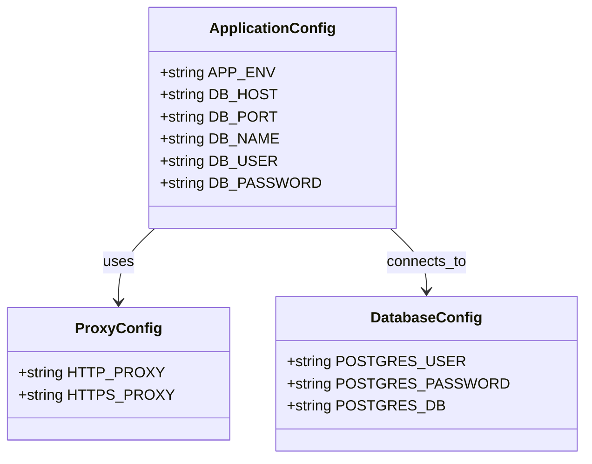

# Cahier des Charges Fonctionnel (CCF) – **agile‑env**  
**Conforme à ISO/IEC/IEEE 29148 : 2018**  

---  

## 1. Identification et contexte du document  

| Élément | Valeur |
|---|---|
| **Identifiant du document** | CCF‑AGILE‑ENV‑V1.0 |
| **Version** | 1.0 |
| **Date** | 2026‑04‑28 |
| **Auteur(s)** | Équipe d’ingénierie agile‑env (DevOps, Architecture) |
| **Historique** | 2026‑04‑28 : Création du CCF (v1.0) |
| **Références** | • Vision du projet *agile‑env* (non fournie) <br>• Business case *déploiement d’un environnement de développement reproductible* <br>• ISO/IEC/IEEE 29148 : 2018 <br>• ISO/IEC/IEEE 12207, 15288 |
| **Portée** | Définir les exigences fonctionnelles, non‑fonctionnelles, la traçabilité et le plan de validation du **système d’environnement de développement** basé sur Docker (conteneur **app** + conteneur **db**) et les artefacts associés (fichiers de configuration, scripts d’initialisation, docker‑compose). |
| **Objectifs** | 1. Fournir un environnement de travail cohérent, reproductible et isolé. <br>2. Garantir la conformité aux standards de sécurité, de maintenabilité et de performance. <br>3. Assurer la traçabilité complète des exigences depuis les sources (Dockerfiles, fichiers de config) jusqu’aux tests de validation. |

---  

## 2. Description de l’écosystème (System/Software Context)

```mermaid
graph LR
    subgraph "Utilisateur"
        DEV[Développeur] 
    end
    subgraph "Environnement Docker"
        APP[Conteneur PHP‑Apache (app)] 
        DB[Conteneur PostgreSQL (db)] 
        COMPOSE[Docker‑Compose (orchestration)]
    end
    subgraph "Systèmes externes"
        PROXY[Proxy HTTP(s) d’entreprise] 
        VCS[GitLab] 
    end
    DEV -->|docker‑compose up| COMPOSE
    COMPOSE --> APP
    COMPOSE --> DB
    APP -->|requêtes SQL| DB
    APP -->|lecture .env| PROXY
    APP -->|déploiement code| VCS
    DB -->|init scripts| DB_INIT[initdb/*.sql & restore.sh]
```

| Élément | Description |
|---|---|
| **Frontières du système** | Le système se compose de deux conteneurs Docker (PHP‑Apache et PostgreSQL) et du fichier `docker‑compose.dev.yml` qui orchestre leur lancement. Tout le code source de l’application (non fourni) est monté dans le conteneur `app`. |
| **Interfaces externes** | - **HTTP(S) Proxy** (`http_proxy`, `https_proxy`) <br>- **Réseau Docker** (port 80 ↔ host, port 5432 ↔ host) <br>- **GitLab** (récupération du code) |
| **Acteurs** | - **Développeur** (utilise l’environnement) <br>- **Opérateur CI/CD** (déploie les images) |
| **Environnement opérationnel** | - Hébergement sur machines Windows / Linux avec Docker Engine ≥ 20.10 <br>- Accès au réseau d’entreprise (proxy) <br>- Système de fichiers partagé (volumes Docker) |

---  

## 3. Exigences fonctionnelles (Functional Requirements)

> **Format ISO 29148** : `[ID] Titre` – Description – Rationale – Source – Priority – Verification – Dependencies  

| ID | Titre | Description | Rationale | Source | Priority | Verification | Dependencies |
|---|---|---|---|---|---|---|---|
| **EXG‑FCT‑001** | Provision du conteneur PostgreSQL | Le système doit créer un conteneur Docker basé sur l’image `postgres:11-alpine` contenant les scripts d’initialisation (`initdb/*.sql`, `initdb/restore.sh`) copiés dans le répertoire `/docker-entrypoint-initdb.d/`. | Fournir une base de données compatible avec l’application PHP. | Dockerfile `docker/db/Dockerfile` | Mandatory | Test d’intégration : `docker-compose up` → vérification de la présence des tables via `psql`. | – |
| **EXG‑FCT‑002** | Provision du conteneur PHP‑Apache | Le système doit créer un conteneur Docker basé sur l’image `php:7.3-apache-buster` avec les extensions `pdo`, `pdo_pgsql`, `intl` installées, les variables proxy configurées et le fichier de configuration Apache `000‑default.conf` copié dans le répertoire adéquat. | Exposer l’application web avec les dépendances DB et i18n. | Dockerfile `Dockerfile‑app` | Mandatory | Inspection du Dockerfile + test de disponibilité HTTP (200 OK). | EXG‑FCT‑001 (DB doit être disponible) |
| **EXG‑FCT‑003** | Chargement du fichier de configuration Apache | Le fichier `docker/conf/000‑default.conf` doit être copié dans le conteneur `app` à l’emplacement `/etc/apache2/sites-available/`. | Garantir la configuration du serveur web (virtualhost, rewrite). | Dockerfile‑app (ligne `COPY docker/conf/000‑default.conf …`) | Mandatory | Différence de configuration (`docker exec … cat /etc/apache2/sites-available/000-default.conf`). | – |
| **EXG‑FCT‑004** | Support du proxy d’entreprise | Les variables d’environnement `http_proxy` et `https_proxy` doivent être définies dans le conteneur `app` avec les valeurs fournies (`http://pfrie-std.proxy.e2.rie.gouv.fr:8080`). | Permettre l’accès aux dépôts externes (composer, apt). | Dockerfile‑app (ENV) | Mandatory | `env | grep -i proxy` dans le conteneur. | – |
| **EXG‑FCT‑005** | Installation de Composer | Le binaire `composer` doit être disponible dans le conteneur `app` (copié depuis l’image `composer:latest`). | Gestion des dépendances PHP. | Dockerfile‑app (`COPY --from=composer …`) | Mandatory | `composer --version` dans le conteneur. | – |
| **EXG‑FCT‑006** | Insertion du fichier `.env` | Le fichier `.env` présent dans `docker/extra/app-conf/` doit être monté (ou copié) dans le conteneur `app` afin d’alimenter les variables d’application. | Centraliser la configuration (DB URL, clés API). | Architecture du projet (arborescence) | Desirable | Vérification de la présence du fichier dans le conteneur. | – |
| **EXG‑FCT‑007** | Orchestration via Docker‑Compose | Le fichier `docker-compose.dev.yml` doit permettre le lancement simultané des conteneurs `app` et `db`, la création des réseaux et volumes nécessaires. | Simplifier le démarrage de l’environnement. | `docker-compose.dev.yml` (non fourni) | Mandatory | `docker-compose -f docker-compose.dev.yml up -d` → état *running*. | EXG‑FCT‑001, EXG‑FCT‑002 |
| **EXG‑FCT‑008** | Gestion des scripts d’initialisation DB | Les scripts `initdb/*.sql` et `initdb/restore.sh` doivent être exécutés automatiquement à la première création du conteneur PostgreSQL. | Peupler la base avec le schéma et les données de référence. | Dockerfile‑db (COPY) | Mandatory | Vérification des tables via `psql`. | EXG‑FCT‑001 |
| **EXG‑FCT‑009** | Installation des dépendances système | Le conteneur `app` doit installer les paquets `git zip unzip vim libpq-dev libicu-dev` via `apt-get`. | Fournir les outils nécessaires à la compilation des extensions et au debugging. | Dockerfile‑app (RUN apt‑get…) | Mandatory | `dpkg -l | grep -E "git|zip|unzip|vim|libpq-dev|libicu-dev"` | – |
| **EXG‑FCT‑010** | Support de Yarn (optionnel) | Le conteneur `app` doit pouvoir installer Yarn (`npm install -g yarn`) lorsque la ligne est décommentée. | Permettre la compilation d’actifs front‑end. | Dockerfile‑app (commentaire) | Optional | `yarn --version` après activation. | – |

---  

## 4. Exigences non‑fonctionnelles (Non‑Functional Requirements)

### 4.1 Exigences de performance  

| ID | Titre | Description | Rationale | Priority | Verification |
|---|---|---|---|---|---|
| **EXG‑NFR‑001** | Temps de démarrage des conteneurs | L’ensemble des conteneurs (`app` + `db`) doit être opérationnel en ≤ 30 s sur une machine de développement typique (8 Go RAM, SSD). | Accélérer le cycle de développement. | Mandatory | Chronométrage du `docker-compose up`. |
| **EXG‑NFR‑002** | Utilisation mémoire | Le conteneur `app` ne doit pas dépasser 512 MiB de RAM en mode « développement ». | Limiter la charge sur la workstation. | Desirable | `docker stats` pendant l’exécution. |
| **EXG‑NFR‑003** | Débit réseau | Le débit entre `app` et `db` doit être ≥ 10 Mbps (LAN Docker bridge). | Garantir des temps de réponse DB acceptables. | Desirable | Test de charge simple (`pgbench`). |

### 4.2 Exigences d’interface externe  

| ID | Titre | Description | Rationale | Priority | Verification |
|---|---|---|---|---|---|
| **EXG‑INT‑001** | Interface HTTP (port 80) | Le conteneur `app` expose le port 80 sur l’hôte (ou un port configurable). | Accès au serveur web depuis le navigateur. | Mandatory | `curl http://localhost` → 200 OK. |
| **EXG‑INT‑002** | Interface PostgreSQL (port 5432) | Le conteneur `db` expose le port 5432 sur l’hôte (ou via le réseau Docker). | Connexion depuis `app` et outils DB. | Mandatory | `psql -h localhost -U postgres` réussit. |
| **EXG‑INT‑003** | Interface de configuration (`.env`) | Le fichier `.env` doit être accessible en lecture uniquement par le conteneur `app`. | Sécurité de la configuration. | Mandatory | `docker exec app ls -l /path/to/.env`. |
| **EXG‑INT‑004** | Interface de volume partagé | Le répertoire source (`src/`) doit être monté en volume afin que les modifications de code soient visibles instantanément. | Hot‑reload du code. | Mandatory | Modification d’un fichier PHP → mise à jour visible dans le conteneur. |

### 4.3 Exigences de qualité  

| ID | Titre | Description | Rationale | Priority |
|---|---|---|---|---|
| **EXG‑QLT‑001** | Maintenabilité du Dockerfile | Chaque Dockerfile doit être commenté, respecter le principe *single responsibility* et ne pas contenir de lignes mortes. | Facilite la maintenance et le onboarding. | Mandatory |
| **EXG‑QLT‑002** | Portabilité | L’environnement doit fonctionner identiquement sur Windows 10/11, macOS et Linux (Docker Desktop). | Éviter les lock‑ins OS. | Mandatory |
| **EXG‑QLT‑003** | Testabilité | Chaque exigence fonctionnelle doit être couverte par au moins un test automatisé (Docker‑Compose + scripts de validation). | Garantir la conformité. | Mandatory |
| **EXG‑QLT‑004** | Fiabilité | Le conteneur `db` doit être configuré avec `restart: unless‑stopped`. | Résilience en cas de crash. | Mandatory |

### 4.4 Exigences de conception et contraintes  

| ID | Titre | Description | Rationale |
|---|---|---|---|
| **EXG‑DES‑001** | Langage de description | Utiliser **Dockerfile** (v1.4 syntax) et **docker‑compose** (v3.8). |
| **EXG‑DES‑002** | Standards de codage | Respecter les conventions officielles Dockerfile (ALL‑CAPS pour les instructions). |
| **EXG‑DES‑003** | Outils obligatoires | - Docker Engine ≥ 20.10 <br>- Docker‑Compose ≥ 2.2 <br>- Git 2.30+ <br>- VS Code (ou IDE équivalent) |
| **EXG‑DES‑004** | Gestion de version | Tous les artefacts (Dockerfiles, scripts, config) sont versionnés dans le dépôt GitLab du projet. |

### 4.5 Exigences de sécurité  

| ID | Titre | Description | Rationale |
|---|---|---|---|
| **EXG‑SEC‑001** | Isolation des conteneurs | Les conteneurs doivent être exécutés avec l’utilisateur `www-data` (UID 33) au lieu de `root`. |
| **EXG‑SEC‑002** | Gestion des secrets | Les variables sensibles (ex. mot de passe DB) doivent être stockées dans le fichier `.env` et **non** dans le Dockerfile. |
| **EXG‑SEC‑003** | Mise à jour des images | Les images de base (`postgres:11-alpine`, `php:7.3-apache-buster`) doivent être régulièrement re‑pullées (cron weekly). |
| **EXG‑SEC‑004** | Scan de vulnérabilités | Un scan (Trivy, Anchore) doit être exécuté sur chaque build CI et bloquer les images contenant des CVE critiques. |

---  

## 5. Modèle de données conceptuel  

> Aucun schéma métier détaillé n’est fourni. Le modèle ci‑dessous représente les **entités de configuration** manipulées par l’environnement.



*Cardinalités* : 1 : 1 (un fichier `.env` représente un **ApplicationConfig** unique).  

---  

## 6. Modélisation des comportements  

### 6.1 Diagramme de cas d’utilisation  

```mermaid
usecaseDiagram;
    actor Developer as Dev
    Dev --> (Démarrer l’environnement)
    Dev --> (Accéder à l’application Web)
    Dev --> (Modifier le code source)
    Dev --> (Exécuter les tests unitaires)
    (Démarrer l’environnement) --> \(docker‑compose up)
    (Accéder à l’application Web) --> \(Navigateur HTTP)
    (Modifier le code source) --> \(Éditeur IDE)
    (Exécuter les tests unitaires) --> \(docker exec composer test)
```

### 6.2 Diagramme d’activités (processus de lancement)  

```mermaid
statediagram-v2
    [*] --> PullImages
    PullImages --> BuildApp
    BuildApp --> BuildDB
    BuildDB --> ComposeUp
    ComposeUp --> InitDB
    InitDB --> RunApp
    RunApp --> Ready
    Ready --> [*]
```

### 6.3 Diagramme d’états (cycle de vie d’un conteneur)  

```mermaid
statediagram;
    [*] --> Created
    Created --> Starting
    Starting --> Running
    Running --> Stopping
    Stopping --> Exited
    Exited --> [*]
```

### 6.4 Diagramme de séquence (scenario “docker‑compose up”)  

```mermaid
sequencediagram;
    participant Dev as Développeur
    participant DC as Docker‑Compose
    participant APP as Conteneur app
    participant DB as Conteneur db
    Dev->>DC: docker‑compose -f docker‑compose.dev.yml up -d
    DC->>DB: create container (postgres_11‑alpine)
    DB->>DB: execute initdb/*.sql + restore.sh
    DC->>APP: create container (php_7.3‑apache‑buster)
    APP->>APP: apt‑get install, copy config, set env proxy
    APP->>DB: connexion DB (via variables .env)
    APP->>Dev: HTTP 80 disponible
```

---  

## 7. Attributs d’exigences (Requirements Attributes)

| ID | Description | Rationale | Source | Priority | Status | Verification Method | Risk | Stability |
|---|---|---|---|---|---|---|---|---|
| EXG‑FCT‑001 | Provision du conteneur PostgreSQL | Base de données requise | Dockerfile‑db | Mandatory | Approved | Test d’intégration (psql) | Medium | Stable |
| EXG‑FCT‑002 | Provision du conteneur PHP‑Apache | Serveur web nécessaire | Dockerfile‑app | Mandatory | Approved | Inspection + test HTTP | Medium | Stable |
| EXG‑FCT‑004 | Support du proxy d’entreprise | Accès aux dépôts externes | Dockerfile‑app (ENV) | Mandatory | Approved | `env` dans conteneur | Low | Stable |
| EXG‑NFR‑001 | Temps de démarrage ≤ 30 s | Cycle dev rapide | Performance spec | Mandatory | Draft | Chronométrage | Low | Volatile (dépend du hardware) |
| EXG‑SEC‑001 | Isolation des conteneurs (non‑root) | Sécurité | Best‑practice | Mandatory | Draft | `id -u` dans conteneur | Medium | Stable |
| … | … | … | … | … | … | … | … | … |

*(Le tableau complet figure dans l’annexe A – disponible en format CSV pour import ALM.)*  

---  

## 8. Traçabilité des exigences  

### 8.1 Matrice de traçabilité (Requirements ↔ Artefacts ↔ Tests)

```mermaid
%% Mermaid table not supported – using Markdown table instead
| Exigence | Artefact(s) source | Test(s) associé(s) | Niveau de traçabilité |
|---|---|---|---|
| EXG‑FCT‑001 | `docker/db/Dockerfile` | TC‑DB‑001 : Vérifier la création de la base + tables | 1‑to‑1 |
| EXG‑FCT‑002 | `Dockerfile‑app` | TC‑APP‑001 : Vérifier le port 80 et le code HTTP 200 | 1‑to‑1 |
| EXG‑FCT‑003 | `docker/conf/000‑default.conf` | TC‑APP‑002 : Comparer le fichier copié | 1‑to‑1 |
| EXG‑FCT‑004 | `Dockerfile‑app` (ENV) | TC‑APP‑003 : `env | grep proxy` | 1‑to‑1 |
| EXG‑FCT‑005 | `Dockerfile‑app` (COPY composer) | TC‑APP‑004 : `composer --version` | 1‑to‑1 |
| EXG‑FCT‑006 | `.env` (docker/extra/app-conf) | TC‑APP‑005 : Présence du fichier dans conteneur | 1‑to‑1 |
| EXG‑FCT‑007 | `docker-compose.dev.yml` | TC‑COMPOSE‑001 : `docker‑compose up` → conteneurs RUNNING | 1‑to‑1 |
| EXG‑NFR‑001 | Aucun (performance) | TC‑PERF‑001 : Chronométrage du démarrage | 1‑to‑1 |
| EXG‑SEC‑001 | `Dockerfile‑app` (USER) – à implémenter | TC‑SEC‑001 : `id -u` = 33 | 1‑to‑1 |
```

### 8.2 Mapping vers les objectifs métier  

| Objectif métier | Exigence(s) liée(s) |
|---|---|
| **O‑M‑001** : Environnement de dev reproductible | EXG‑FCT‑001, 002, 007, 008 |
| **O‑M‑002** : Conformité aux politiques de sécurité | EXG‑SEC‑001, SEC‑002, SEC‑004 |
| **O‑M‑003** : Rapidité de mise en place | EXG‑NFR‑001, EXG‑NFR‑002 |
| **O‑M‑004** : Facilité de maintenance | EXG‑QLT‑001, DES‑001, DES‑003 |

---  

## 9. Gestion des exigences  

| Processus | Description | Responsable | Outils |
|---|---|---|---|
| **Gestion du changement** | Toute modification d’une exigence doit passer par une *Change Request* (CR) formalisée, évaluée en termes d’impact (technique, planning, coût). | Lead Architecte | Jira / GitLab Issues |
| **Résolution des conflits** | Conflits entre exigences (ex. performances vs sécurité) sont résolus lors de revues d’exigences avec le *Change Control Board* (CCB). | CCB (Architecte, PO, QA) | Confluence, Jira |
| **Priorisation** | Utilisation du modèle MoSCoW (Mandatory, Desirable, Optional, Conditional). | Product Owner | Jira Priorities |
| **Outils de suivi** | - **DOORS NG** ou **Jama Connect** pour la traçabilité <br>- **GitLab CI** pour l’exécution des tests automatisés | Configuration Management Lead | DOORS NG, GitLab CI |
| **Gestion de la version** | Chaque baseline (ex. v1.0) est taguée dans le dépôt Git (`v1.0‑baseline`). | Release Manager | GitLab tags |

---  

## 10. Validation et vérification  

| Niveau | Méthode | Exigence(s) concernée(s) | Critères d’acceptation |
|---|---|---|---|
| **Inspection** | Revue de code Dockerfile, revue de configuration `.env` | Toutes les exigences fonctionnelles (EXG‑FCT‑*) | Aucun commentaire critique, conformité aux conventions |
| **Analyse** | Analyse statique (Trivy, Hadolint) | EXG‑SEC‑*, EXG‑QLT‑001 | Aucun CVE critique, aucune règle Dockerfile violée |
| **Démo / Demonstration** | Lancement de `docker‑compose up` en environnement de dev | EXG‑FCT‑007, EXG‑NFR‑001 | Tous les conteneurs passent à l’état *Running* en ≤ 30 s |
| **Test** | Scripts automatisés (Bash + psql + curl) exécutés par GitLab CI | Toutes les exigences (fonctionnelles, non‑fonctionnelles, sécurité) | Tous les tests retournent **PASS** |
| **BDD (Given/When/Then)** | Exemple : <br>`Given` le fichier `.env` contient `DB_PASSWORD=secret` <br>`When` le conteneur `app` démarre <br>`Then` il se connecte à la base sans erreur | EXG‑FCT‑006, EXG‑SEC‑002 | Connexion réussie, aucun log d’erreur |

*Plan de test détaillé (TC‑001 … TC‑010) fourni en annexe B (format Gherkin).*

---  

## Annexes  

### Annexe A – Export CSV des exigences (extraits)  

```csv
ID,Description,Rationale,Source,Priority,Status,Verification,Risk,Stability
EXG-FCT-001,Provision du conteneur PostgreSQL,Base de données requise,docker/db/Dockerfile,Mandatory,Approved,Test d’intégration (psql),Medium,Stable
EXG-FCT-002,Provision du conteneur PHP‑Apache,Serveur web nécessaire,Dockerfile-app,Mandatory,Approved,Inspection + test HTTP,Medium,Stable
...
```

### Annexe B – Scénarios de test (Gherkin)  

```gherkin
Feature: Démarrage de l’environnement agile‑env

  Scenario: Lancement complet via docker‑compose
    Given le dépôt Git contient les fichiers Dockerfile, docker-compose.dev.yml et .env
    When le développeur exécute "docker-compose -f docker-compose.dev.yml up -d"
    Then le conteneur "db" doit être en état "running"
    And le conteneur "app" doit être en état "running"
    And le service HTTP sur le port 80 doit répondre 200 OK
    And la base PostgreSQL doit contenir la table "users"

  Scenario: Vérification du proxy
    Given le fichier Dockerfile‑app définit les variables http_proxy/https_proxy
    When le conteneur "app" démarre
    Then la variable d’environnement "http_proxy" doit valoir "http://pfrie-std.proxy.e2.rie.gouv.fr:8080"
```

### Annexe C – Glossaire  

| Terme | Définition |
|---|---|
| **Dockerfile** | Script de construction d’une image Docker. |
| **docker‑compose** | Outil d’orchestration multi‑conteneurs. |
| **.env** | Fichier contenant les variables d’environnement utilisées par Docker et l’application. |
| **Proxy** | Serveur intermédiaire qui relaie les requêtes HTTP/HTTPS. |
| **MoSCoW** | Méthode de priorisation (Mandatory, Desirable, Optional, Conditional). |

---  

*Fin du Cahier des Charges Fonctionnel – agile‑env*  