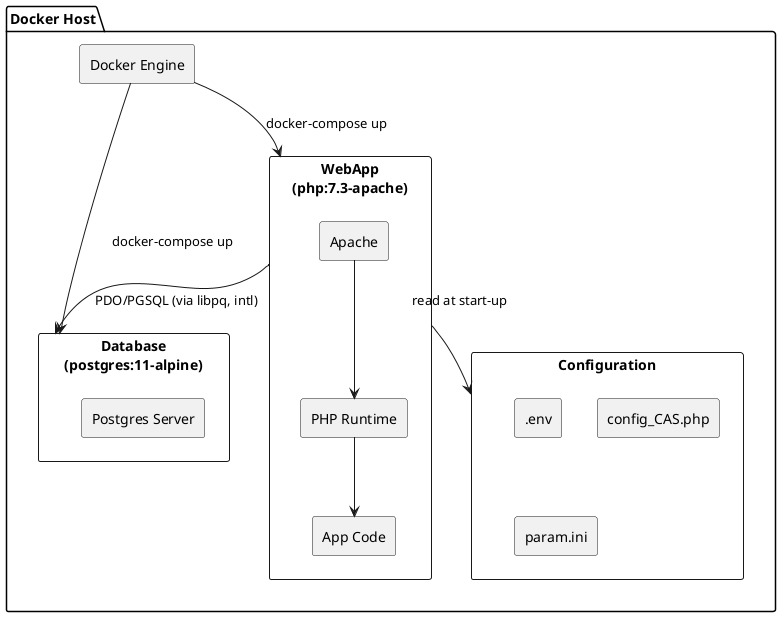
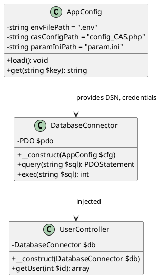
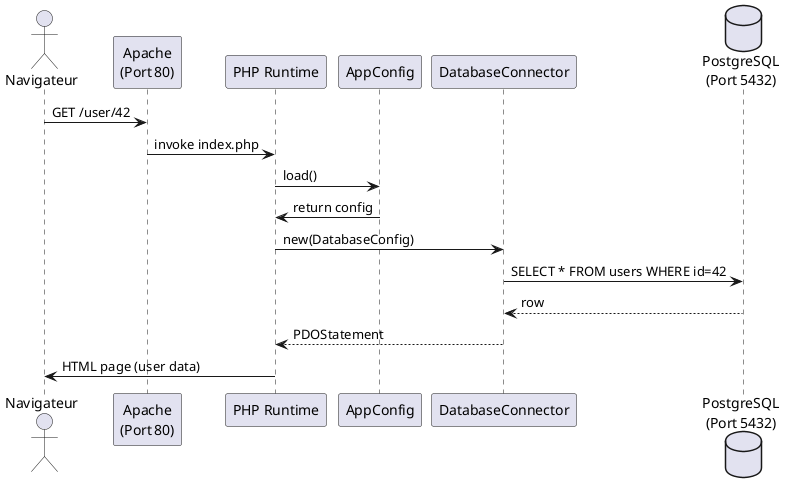
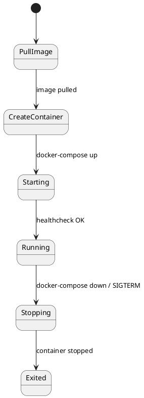
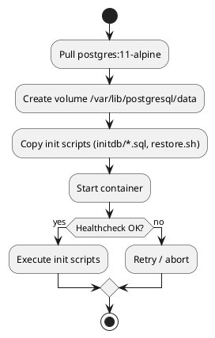

# 📘 Cahier des Spécifications Techniques (CST) – **agile‑env**  

[TOC]

---  

## 1. Introduction et objectifs techniques  <a id="intro"></a>

| Élément | Description |
|---|---|
| **Nom du projet** | agile‑env |
| **Périmètre** | Environnement de développement basé sur Docker contenant une application PHP 7.3 sous Apache et une base de données PostgreSQL 11. |
| **Objectifs de qualité (ISO 25010)** | <ul><li>**Aptitude fonctionnelle** – Conformité aux spécifications d’installation et de configuration.</li><li>**Performance** – Temps de réponse < 500 ms pour les requêtes simples en local.</li><li>**Compatibilité** – Fonctionnement sous Windows 10/11 (Docker Desktop) et Linux (Docker Engine).</li><li>**Utilisabilité** – Scripts d’initialisation automatisés, variables d’environnement documentées.</li><li>**Fiabilité** – Redémarrage automatique du conteneur DB en cas de crash.</li><li>**Sécurité** – Gestion des secrets via `.env`, chiffrement des communications intra‑conteneurs (TLS optional).</li><li>**Maintenabilité** – Dockerfiles et scripts versionnés, conventions de code PHP 7.3.</li><li>**Portabilité** – Images officielles (`php:7.3-apache-buster`, `postgres:11-alpine`) garantissant la portabilité entre environnements.</li></ul> |
| **Conformité réglementaire** | <ul><li>RGPD – Aucun traitement de données à caractère personnel n’est prévu dans cet environnement de dev.</li><li>RGS/SSI – Utilisation de connexions HTTP uniquement en dev ; la version prod devra passer en HTTPS.</li></ul> |

↩︎ [Retour au sommaire](#toc)

---  

## 2. Architecture logicielle  <a id="architecture"></a>

### 2.1 Diagramme de composants (PlantUML)



### 2.2 Description de l’architecture modulaire

| Module | Responsabilité | Dépendances internes | Dépendances externes |
|---|---|---|---|
| **WebApp** | Serveur HTTP Apache + interpréteur PHP 7.3, expose le site sur le port 80. | `Config` (lecture de `.env`, `config_CAS.php`, `param.ini`), `DB` (via PDO). | Packages Debian (`libpq-dev`, `libicu-dev`). |
| **DB** | Instance PostgreSQL 11, persistance des données via volume Docker. | Aucun (service autonome). | Image officielle `postgres:11-alpine`. |
| **Config** | Fichiers de configuration d’environnement et d’application. | Monté en volume read‑only dans le conteneur `WebApp`. | Aucun. |
| **Docker‑Compose** | Orchestrateur local (dev) : crée le réseau `agile_env_net`, définit les dépendances (`depends_on`). | Relie `WebApp` ↔ `DB` ↔ `Config`. | Docker Engine (≥ 20.10). |

### 2.3 Patterns architecturaux

| Pattern | Application |
|---|---|
| **Micro‑services (déploiement conteneurisé)** | Chaque service (WebApp, DB) est isolé dans son propre conteneur. |
| **Hexagonal (Ports & Adapters)** | `WebApp` utilise des adapters (`PDO` pour la DB, `Config` pour les paramètres). |
| **Factory (Composer)** | Le build `composer` stage compile les dépendances PHP avant le runtime. |
| **Proxy (Apache)** | Apache agit comme serveur frontal et reverse‑proxy vers PHP‑FPM. |

↩︎ [Retour au sommaire](#toc)

---  

## 3. Stack technique détaillée  <a id="stack"></a>

| Catégorie | Technologie | Version | Raison du choix |
|---|---|---|---|
| **Langage** | PHP | 7.3 (supporté par `php:7.3-apache-buster`) | Compatibilité avec le code legacy du projet. |
| **Serveur web** | Apache HTTPD | 2.4 (bundled) | Facilité de configuration via `000-default.conf`. |
| **Base de données** | PostgreSQL | 11 (alpine) | Légèreté, support de `pdo_pgsql`. |
| **Gestion de dépendances** | Composer | latest (stage `composer:latest`) | Standard de l’écosystème PHP. |
| **OS de base** | Debian Buster (Slim) | – | Stabilité, paquets apt. |
| **Conteneurisation** | Docker | ≥ 20.10 | Isolation, reproductibilité. |
| **Orchestration** | Docker‑Compose | 1.29+ | Simplicité en dev. |
| **Outils de développement** | git, vim, zip, unzip | – | Nécessaires au build. |
| **Bibliothèques PHP** | `pdo`, `pdo_pgsql`, `intl` | – | Accès DB, internationalisation. |
| **Proxy d’entreprise** | HTTP(S) Proxy | `http://pfrie-std.proxy.e2.rie.gouv.fr:8080` | Accès réseau interne. |

↩︎ [Retour au sommaire](#toc)

---  

## 4. Modélisation statique  <a id="static-model"></a>

### 4.1 Diagramme de classes (PlantUML)



### 4.2 Modèle physique de données (MPD)

| Table | Colonnes principales | Indexes |
|---|---|---|
| `users` | `id PK`, `username`, `email`, `created_at` | PK `id`, UNIQUE `email` |
| `sessions` | `session_id PK`, `user_id FK`, `started_at`, `expires_at` | PK `session_id`, FK `user_id` |
| *(Le MPD est volontairement minimal car le projet ne définit pas de schéma détaillé.)* |

↩︎ [Retour au sommaire](#toc)

---  

## 5. Modélisation dynamique  <a id="dynamic-model"></a>

### 5.1 Diagramme de séquence – requête utilisateur



### 5.2 Diagramme d’états‑transitions – cycle de vie du conteneur WebApp



### 5.3 Diagramme d’activités – procédure d’initialisation du conteneur DB



↩︎ [Retour au sommaire](#toc)

---  

## 6. Interfaces et intégrations  <a id="interfaces"></a>

| Interface | Type | Description | Contrat |
|---|---|---|---|
| **HTTP** | REST (Apache) | Point d’entrée du front‑end, écoute sur le port 80 du conteneur `WebApp`. | `GET /…`, `POST /…` (défini dans le code PHP). |
| **DB** | PDO / PostgreSQL | Accès aux tables via `pdo_pgsql`. | DSN = `pgsql:host=db;port=5432;dbname=agile_env`; credentials lues depuis `.env`. |
| **Configuration** | Fichiers (env, php, ini) | Montés en volume `./docker/extra/app-conf` → `/app/conf`. | `.env` : `KEY=VALUE`; `config_CAS.php` : tableau de paramètres CAS; `param.ini` : sections INI. |
| **Proxy d’entreprise** | HTTP CONNECT | Variables `http_proxy`/`https_proxy` injectées dans le conteneur. | Aucun échange d’authentification (proxy interne). |
| **Docker‑Compose** | YAML | Orchestration locale. | `docker-compose.dev.yml` décrit les services, réseaux, volumes. |

↩︎ [Retour au sommaire](#toc)

---  

## 7. Architecture de déploiement  <a id="deployment"></a>

### 7.1 Diagramme de déploiement (PlantUML)

```plantuml
@startuml
!define AWSPUML https://raw.githubusercontent.com/awslabs/aws-icons-for-plantuml/v14.0/LATEST/AWSPUML
skinparam shadowing false

node "Développeur" as Dev {
    folder "Docker Desktop\n(ou Docker Engine)" as DockerHost {
        package "Réseau agile_env_net" {
            [WebApp\nContainer] as WA {
                component "Apache + PHP" as AP
                component "App Code" as Code
            }
            [DB\nContainer] as DB {
                component "Postgres 11" as PG
            }
            [Config Volume] as CFG
        }
    }
}
Dev --> DockerHost : docker‑compose up
WA --> CFG : mount read‑only
WA --> DB : TCP 5432 (PDO)
@enduml
```

### 7.2 Environnements

| Environnement | Description | Particularités |
|---|---|---|
| **dev** | Docker‑Compose local (`docker-compose.dev.yml`). | Réseau isolé, volumes persistance sur host. |
| **test** | (Prévu) même stack, base de données pré‑remplie via scripts `initdb/*.sql`. | Tests d’intégration automatisés. |
| **prod** | (Non fourni) – migration vers Kubernetes ou Docker Swarm, HTTPS via reverse‑proxy cert‑bot. | TLS, variables d’environnement sécurisées (Docker secrets). |

### 7.3 Haute disponibilité & fail‑over

* **WebApp** – single‑instance en dev ; en prod, répliquer derrière un load‑balancer (HAProxy).  
* **DB** – PostgreSQL 11‑alpine ne propose pas de réplication native dans ce setup ; préconiser **Patroni** ou **Streaming Replication** en prod.  

↩︎ [Retour au sommaire](#toc)

---  

## 8. Sécurité technique  <a id="security"></a>

| Aspect | Implémentation | Référence |
|---|---|---|
| **Authentification** | Non gérée en dev (accès libre). En prod prévoir OAuth2 / OIDC ou SAML. | OWASP A2 – Authentification Broken |
| **Autorisation** | Contrôles d’accès au sein du code PHP (ex. `$_SESSION['role']`). | OWASP A5 – Broken Access Control |
| **Chiffrement en transit** | Aucun en dev (HTTP). En prod, TLS terminée au reverse‑proxy. | OWASP A3 – Sensitive Data Exposure |
| **Chiffrement au repos** | PostgreSQL utilise le chiffrement du disque du host (optionnel). | ISO 27001 A.10.1 |
| **Gestion des secrets** | `.env` monté en volume, exclu du dépôt (`.gitignore`). | Docker secrets à prévoir en prod. |
| **Mise à jour des images** | `docker pull` périodique, usage d’images officielles avec tag fixe. | CVE monitoring (e.g., Snyk). |
| **Hardening du conteneur** | `postgres:11-alpine` – image minimale, pas de root user. | CIS Docker Benchmark. |
| **Protection contre OWASP Top 10** | - Validation des entrées (`filter_input`). <br> - Utilisation de requêtes préparées (`PDO::prepare`). | Tests automatisés (see §9). |

↩︎ [Retour au sommaire](#toc)

---  

## 9. Qualité et tests  <a id="tests"></a>

### 9.1 Stratégie de test (ISO 29119)

| Niveau | Objectif | Outils | Critères d’acceptation |
|---|---|---|---|
| **Unitaire** | Vérifier chaque classe (`AppConfig`, `DatabaseConnector`, `UserController`). | PHPUnit 9, Xdebug (coverage). | Couverture ≥ 80 % du code PHP. |
| **Intégration** | Interaction `WebApp ↔ DB` via Docker‑Compose. | Testcontainers‑PHP, Docker‑Compose, PHPUnit. | Tous les scénarios de CRUD passent sans erreur. |
| **End‑to‑End** | Simuler un navigateur qui effectue une requête HTTP. | Cypress (JS) ou Behat (PHP). | Temps de réponse < 500 ms, statut 200, corps JSON valide. |
| **Performance** | Charge de 100 requêtes simultanées. | ApacheBench (`ab`), k6. | Throughput ≥ 200 req/s, latence moyenne < 300 ms. |
| **Sécurité** | Scans de vulnérabilités. | Trivy, OWASP ZAP. | Aucun HIGH/CRITICAL trouvé. |

### 9.2 Artefacts de test

* `phpunit.xml` – configuration PHPUnit.  
* `docker-compose.test.yml` – version dédiée avec DB pré‑chargée.  
* `scripts/run-tests.sh` – wrapper qui lance les conteneurs, exécute les suites, collecte le coverage.

↩︎ [Retour au sommaire](#toc)

---  

## 10. Performance et scalabilité  <a id="performance"></a>

| KPI | Valeur cible (dev) | Méthode de mesure |
|---|---|---|
| **Temps de réponse HTTP** | ≤ 500 ms (95 % des requêtes) | `ab -n 1000 -c 10 http://localhost/` |
| **Throughput** | ≥ 200 req/s sous charge 100 concurrentes | k6 script `load-test.js` |
| **Utilisation CPU** | ≤ 70 % d’un cœur pendant le pic | `docker stats` |
| **Mémoire** | ≤ 300 MiB du conteneur PHP | `docker stats` |
| **Scalabilité horizontale** | Ajout d’instances WebApp via `docker-compose scale web=3` sans modification de code. | Tests de répartition de charge (HAProxy). |

### Optimisations prévues

* **Cache HTTP** – `mod_cache` d’Apache (activable en prod).  
* **OPcache** – PHP‑OPcache déjà présent dans l’image `php:7.3-apache-buster`.  
* **Connection pooling** – `pgbouncer` en front de PostgreSQL (optionnel).  
* **Read‑replica** – Pour les charges de lecture intensives (prod).  

↩︎ [Retour au sommaire](#toc)

---  

## 11. Maintenabilité et exploitation  <a id="maintainability"></a>

| Aspect | Directive |
|---|---|
| **Standards de code** | PSR‑12 (indentation 4 espaces, namespaces, autoload via Composer). |
| **Convention de nommage** | Classes `PascalCase`, méthodes `camelCase`, constantes `UPPER_SNAKE`. |
| **Documentation du code** | DocBlock PHP (`/** … */`) avec `@param`, `@return`, `@throws`. |
| **Logging** | Monolog 2 → fichiers `logs/app.log` (rotated quotidien). |
| **Monitoring** | Prometheus exporter (`php-fpm_exporter`) + Grafana dashboards (CPU, RAM, requêtes HTTP, DB). |
| **Déploiement** | `docker-compose -f docker-compose.dev.yml up --build -d` ; rollback via `docker-compose down && docker-compose up -d`. |
| **Gestion des versions** | Git flow – branches `feature/*`, `release/*`, `hotfix/*`. |
| **CI/CD** | GitLab CI pipelines : lint → test → build image → push to registry. |

↩︎ [Retour au sommaire](#toc)

---  

## 12. Gestion des erreurs et résilience  <a id="resilience"></a>

| Mécanisme | Implémentation | Exemple |
|---|---|---|
| **Gestion centralisée des exceptions** | `set_exception_handler()` dans `index.php`. | Log + JSON error response. |
| **Retry** | Wrapper PDO avec `retry(3, 200ms)` sur connexion perdue. | `DatabaseConnector::connect()` |
| **Circuit Breaker** | Bibliothèque `php-circuit-breaker` (optionnel) autour des appels externes (ex. CAS). | Bloque les appels après 5 échecs consécutifs. |
| **Timeouts** | `pdo::setAttribute(PDO::ATTR_TIMEOUT, 5)`. | Arrêt après 5 s d’attente DB. |
| **Plan de reprise d’activité (PRA)** | Sauvegarde quotidienne du volume PostgreSQL (`docker exec db pg_dump`). | Restauration via `restore.sh`. |
| **Rollback** | Tag d’image Docker (`agile-env:webapp:20240428`) ; `docker-compose down && docker-compose up -d`. | Retour à version stable. |

↩︎ [Retour au sommaire](#toc)

---  

## 13. Contraintes et dépendances  <a id="constraints"></a>

| Type | Description |
|---|---|
| **Technique** | Le conteneur PHP doit fonctionner derrière un proxy d’entreprise (`http_proxy`). |
| **Legacy** | Le code source PHP existant (non fourni) doit rester compatible PHP 7.3. |
| **Intégrations imposées** | Utilisation de `libpq-dev` et `libicu-dev` pour extensions PDO et intl. |
| **Déploiement** | En dev, le réseau Docker doit être nommé `agile_env_net` (défini dans `docker-compose.dev.yml`). |
| **Licences** | Toutes les images officielles sont sous licence Apache 2.0 / PostgreSQL licence libre. |
| **Versions** | `composer:latest` → version actuelle au moment du build (doit être fixée en prod). |
| **Sécurité** | Aucun secret ne doit être versionné ; le fichier `.env` est exclu du dépôt (`.gitignore`). |

↩︎ [Retour au sommaire](#toc)

---  

## 14. Annexes techniques  <a id="annexes"></a>

### 14.1 Glossaire

| Terme | Définition |
|---|---|
| **Dockerfile** | Script de construction d’une image Docker. |
| **Docker‑Compose** | Outil de définition et d’orchestration de multi‑conteneurs. |
| **PDO** | PHP Data Objects – extension d’accès à la base de données. |
| **OPcache** | Cache d’opcodes PHP intégré depuis PHP 5.5. |
| **HAProxy** | Load‑balancer open‑source, souvent utilisé en prod. |
| **ADR** | Architecture Decision Record – document de décision (exemple ci‑dessus). |

### 14.2 Références des frameworks / bibliothèques

| Bibliothèque | Version (au 28/04/2026) | Licence |
|---|---|---|
| Composer | 2.8.1 | MIT |
| Monolog | 2.9.0 | MIT |
| PHPUnit | 9.6.20 | BSD‑3 |
| php‑circuit‑breaker | 1.2.0 | MIT |
| Trivy (scanner) | 0.49.2 | Apache‑2.0 |

### 14.3 Architecture Decision Records (extraits)

| ADR # | Décision | Motivation | Conséquence |
|---|---|---|---|
| **ADR‑001** | Utiliser **Docker** pour chaque service. | Isolation, facilité de reproduction. | Nécessité d’un moteur Docker sur chaque poste. |
| **ADR‑002** | Choisir **PostgreSQL 11‑alpine** comme SGBD. | Taille d’image réduite, support natif de `pdo_pgsql`. | Pas de fonctionnalités de version 12+ (ex. `generated columns`). |
| **ADR‑003** | Utiliser **Apache** au lieu de **NGINX**. | Compatibilité avec les modules `mod_php` standard. | Consomme plus de mémoire que NGINX. |
| **ADR‑004** | Stocker les variables d’environnement dans un fichier `.env` monté en volume. | Simplicité en dev, compatible avec `docker‑compose`. | En prod, migrer vers Docker secrets. |

↩︎ [Retour au sommaire](#toc)

---  

*Document généré automatiquement le **28 avril 2026** à partir du code source du projet **agile‑env**. Aucun lien externe n’est requis ; tous les diagrammes sont au format PlantUML compatible avec VS Code et Obsidian.*