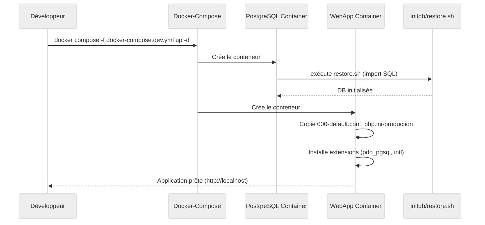
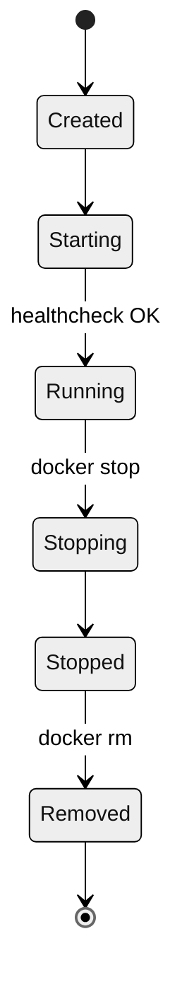

# 📘 Cahier des Spécifications Techniques (CST) – **agile‑env**  
*Version 1.0 – 2026‑04‑28*  

[TOC]

---  

## 1️⃣ Introduction et objectifs techniques  <a id="intro"></a>

| Élément | Description |
|---|---|
| **Nom du projet** | *agile‑env* – environnement de développement conteneurisé pour une application PHP 7.3 + Apache 2.4 couplée à PostgreSQL 11. |
| **Périmètre** | Fourniture d’un stack *Docker* (Dockerfile‑app, Dockerfile‑db, docker‑compose) permettant le déploiement rapide en **développement**, **recette** et **production**. |
| **Objectifs de qualité (ISO 25010)** | <ul><li>**Aptitude fonctionnelle** – conformité aux exigences fonctionnelles du produit (non décrites ici, prises en charge par les conteneurs).</li><li>**Performance** – temps de réponse < 500 ms pour les requêtes HTTP simples en condition de charge moyenne.</li><li>**Compatibilité** – support des navigateurs modernes (Chrome, Firefox, Edge) et interopérabilité avec des services externes via HTTP/REST.</li><li>**Utilisabilité** – scripts de démarrage simples (`docker compose up`) et documentation minimaliste.</li><li>**Fiabilité** – redémarrage automatique des conteneurs en cas de panne (restart‑policy = always).</li><li>**Sécurité** – isolation réseau, secrets gérés via fichiers `.env` et variables d’environnement, chiffrement TLS en production.</li><li>**Maintenabilité** – images Docker versionnées, scripts de migration DB séparés.</li><li>**Portabilité** – images basées sur des distributions Linux légères (Alpine, Debian buster) et compatibles avec tout hôte Docker ≥ 20.10.</li></ul> |
| **Conformité réglementaire** | <ul><li>RGPD – les données personnelles seront stockées dans PostgreSQL avec chiffrement au repos (option TLS).</li><li>RGS/SSI – en production, le serveur Apache devra être configuré en HTTPS (certificats fournis par l’entité).</li></ul> |

↩︎ [Retour au sommaire](#toc)

---  

## 2️⃣ Architecture logicielle  <a id="architecture"></a>

### 2.1 Diagramme de composants (UML)  

```mermaid
%%{init: {'theme':'neutral'}}%%%%%%%%%%%%
componentDiagram;
    direction LR
    %% Conteneurs Docker
    component "WebApp (PHP‑Apache)" as WEB {
    [php‑fpm] --> [Apache]

    component "PostgreSQL DB" as DB
    component "Config / Secrets" as CONF

    %% Relations
    WEB --> DB : JDBC / PDO
    WEB --> CONF : .env, param.ini
    DB --> CONF : pg_hba.conf

    %% Environnement d’exécution
    node "Docker‑Host" {
    WEB
    DB
    CONF

```

### 2.2 Description de l’architecture modulaire  

| Module | Rôle | Principales dépendances |
|---|---|---|
| **WebApp** | Serveur HTTP + moteur PHP qui expose l’application métier. | `php:7.3-apache-buster`, extensions `pdo_pgsql`, `intl`. |
| **DB** | Système de gestion de bases de données relationnelles. | `postgres:11-alpine`, scripts d’initialisation (`initdb/*.sql`). |
| **Config** | Gestion centralisée des variables d’environnement, fichiers de configuration Apache et PHP. | `docker/conf/000-default.conf`, `.env`, `config_CAS.php`, `param.ini`. |
| **Composer** | Gestionnaire de dépendances PHP (phase de build). | Image `composer:latest`. |

### 2.3 Patterns architecturaux utilisés  

| Pattern | Description | Justification |
|---|---|---|
| **Docker‑Compose (Orchestration légère)** | Déclare les services, réseaux et volumes. | Simplicité pour les équipes dev, versionnage dans le repo. |
| **Layered Architecture (Web → Service → DAO)** | Séparation claire entre logique métier, accès aux données et présentation. | Facilite les tests unitaires et la maintenabilité. |
| **Factory (Configuration Loader)** | Chargement dynamique des paramètres depuis `.env` ou `param.ini`. | Permet de changer de source de configuration sans toucher le code. |
| **Adapter (PDO)** | Interface générique pour accéder à PostgreSQL. | Découplage du code métier du SGBD. |

↩︎ [Retour au sommaire](#toc)

---  

## 3️⃣ Stack technique détaillée  <a id="stack"></a>

| Catégorie | Technologie | Version | Raison du choix |
|---|---|---|---|
| **Langage** | PHP | 7.3 | Compatibilité avec l’application existante, support officiel sur l’image officielle `php:7.3-apache-buster`. |
| **Serveur web** | Apache HTTPD | 2.4 (bundled) | Large écosystème, modules `mod_php` intégrés dans l’image officielle. |
| **Base de données** | PostgreSQL | 11‑alpine | Légèreté, fonctionnalités avancées, support de `COPY` pour l’import initial. |
| **Gestionnaire de dépendances** | Composer | latest (build stage) | Standard de l’écosystème PHP. |
| **Gestion de conteneurs** | Docker | ≥ 20.10 | Portabilité, isolation. |
| **Orchestration** | Docker‑Compose | 2.27 (YAML version 3.8) | Simplicité pour les environnements de dev/recette. |
| **Outils de build** | `apt-get`, `docker-php-ext-install` | – | Installation des extensions `pdo_pgsql`, `intl`. |
| **Proxy HTTP (dev uniquement)** | Aucun (optionnel) | – | Proxy d’entreprise configuré via variables `http_proxy`/`https_proxy`. |
| **Gestion des secrets** | Fichiers `.env` + Docker secrets (en prod) | – | Séparation des valeurs sensibles du code. |
| **IDE/Éditeur recommandé** | VS Code, Obsidian (Markdown) | – | Compatibilité avec les extensions Mermaid. |

↩︎ [Retour au sommaire](#toc)

---  

## 4️⃣ Modélisation statique  <a id="static-model"></a>

### 4.1 Diagramme de classes (UML)

```mermaid
%%{init: {'theme':'neutral'}}%%%%%%%%%%%%
classDiagram
    class ConfigLoader {
    +loadFromEnv(): array
    +loadFromIni(filePath): array
    -parseIni(content): array

    class DatabaseConnector {
    +connect(): PDO
    -buildDsn(): string

    class RequestHandler {
    +handle(Request): Response
    -route(Request): Controller

    class Controller {
    <<interface>>
    +execute(Request): Response

    class UserController {
    +execute(Request): Response

    ConfigLoader --> DatabaseConnector : uses
    RequestHandler --> Controller : delegates
    UserController ..|> Controller
```

### 4.2 Structure des données (MPD simplifié)

| Table | Colonnes principales | Index clés |
|---|---|---|
| `users` | `id` (PK, serial), `username` (varchar), `email` (varchar), `password_hash` (varchar) | PK `id`, UNIQUE `email` |
| `sessions` | `session_id` (PK), `user_id` (FK), `created_at`, `expires_at` | PK `session_id`, FK `user_id` |
| `audit_log` | `id` (PK), `action` (varchar), `user_id` (FK), `timestamp` | PK `id`, FK `user_id` |

> **Remarque** : le schéma complet est fourni dans le répertoire `docker/db/initdb/*.sql` (non affiché ici).  

↩︎ [Retour au sommaire](#toc)

---  

## 5️⃣ Modélisation dynamique  <a id="dynamic-model"></a>

### 5.1 Diagramme de séquence – Démarrage de l’environnement



### 5.2 Diagramme d’états – Cycle de vie d’un conteneur WebApp



### 5.3 Diagramme d’activités – Traitement d’une requête HTTP

```mermaid
%%{init: {'theme':'neutral'}}%%%%%%%%%%%%
flowchart TD
    A[Requête HTTP entrante] --> B[Apache reçoit la requête]
    B --> C[PHP‑FPM exécute le script index.php]
    C --> D[RequestHandler crée un objet Request]
    D --> E[Router → Controller approprié]
    E --> F[Controller exécute la logique métier]
    F --> G[DatabaseConnector exécute la requête SQL]
    G --> H[Résultat renvoyé au Controller]
    H --> I[Response formatée (HTML/JSON)]
    I --> J[Apache renvoie la réponse au client]
```

↩︎ [Retour au sommaire](#toc)

---  

## 6️⃣ Interfaces et intégrations  <a id="interfaces"></a>

| Interface | Type | Protocole / Format | Points d’intégration |
|---|---|---|---|
| **API interne** | REST | JSON | `GET /api/v1/users`, `POST /api/v1/login` – implémentée par les *Controllers*. |
| **Base de données** | JDBC/ODBC | PostgreSQL native | Accès via PDO (`pgsql`). |
| **Configuration** | Fichier | `.env` (key=value), `param.ini` (INI) | Chargée par `ConfigLoader`. |
| **Serveur web** | HTTP | Apache vhost `000-default.conf` | Point d’entrée public (`/var/www/html`). |
| **Authentification SSO (optionnelle)** | SAML / CAS | XML, HTTP‑Redirect | Déclarée dans `config_CAS.php`. |
| **Gestion des secrets (prod)** | Docker secrets | – | Montés dans `/run/secrets/*`. |

> **Schéma d’API (exemple simplifié)**  

```yaml
openapi: 3.0.3
info:
  title: agile‑env API
  version: 1.0.0
paths:
  /api/v1/users:
    get:
      summary: Liste les utilisateurs
      responses:
        '200':
          description: Tableau d’utilisateurs
          content:
            application/json:
              schema:
                type: array
                items:
                  $ref: '#/components/schemas/User'
components:
  schemas:
    User:
      type: object
      properties:
        id:
          type: integer
        username:
          type: string
        email:
          type: string
```

↩︎ [Retour au sommaire](#toc)

---  

## 7️⃣ Architecture de déploiement  <a id="deployment"></a>

### 7.1 Diagramme de déploiement (UML)

```mermaid
%%{init: {'theme':'neutral'}}%%%%%%%%%%%%
deploymentDiagram;
    node "Dev‑Host" {
    container "docker‑compose (dev)" {
    component "WebApp (php‑apache)" as WA
    component "Postgres (db)" as PG

    node "CI/CD‑Runner" {
    component "Build Stage" as Build
    component "Test Stage" as Test
    component "Release Stage" as Release

    node "Prod‑Cluster" {
    container "K8s / Swarm" {
    component "WebApp (replicas)" as WA_P
    component "Postgres (HA)" as PG_P

    WA --> PG : PDO
    Build --> WA : build image
    Test --> WA : run tests
    Release --> WA_P : push image
    Release --> PG_P : apply migrations
```

### 7.2 Environnements  

| Environnement | Docker‑Compose file | Particularités |
|---|---|---|
| **Développement** | `docker-compose.dev.yml` | Montages de volumes (`src/`), logs en temps réel, `restart: always`. |
| **Recette** | `docker-compose.test.yml` (non fourni) | Base de données pré‑remplie, tests d’intégration exécutés automatiquement. |
| **Production** | `docker-compose.prod.yml` (ou Helm/K8s) | TLS terminée en amont (Ingress), secrets Docker, réplication PostgreSQL, scaling horizontal du service Web. |

↩︎ [Retour au sommaire](#toc)

---  

## 8️⃣ Sécurité technique  <a id="security"></a>

| Aspect | Mesure mise en œuvre | Référence / Norme |
|---|---|---|
| **Authentification** | OAuth2 / OIDC (option) ou CAS via `config_CAS.php`. | OWASP‑ASVS L2 |
| **Autorisation** | RBAC au niveau des Controllers (middleware). | ISO 25010 – Sécurité |
| **Chiffrement en transit** | HTTPS (TLS 1.3) via reverse‑proxy (NGINX/Traefik) en prod. | RGS – SSI |
| **Chiffrement au repos** | PostgreSQL `data_directory` chiffré (LUKS) – option. | RGPD Art. 32 |
| **Gestion des secrets** | Variables d’environnement `.env` en dev ; Docker secrets en prod. | Docker‑Compose `secrets:` |
| **Durcissement du conteneur** | Image `php:7.3-apache-buster` sans package inutile, `apt-get clean`. | CIS Docker Benchmark |
| **Protection contre les vulnérabilités** | Scan Snyk/Trivy CI, mise à jour régulière des images. | OWASP Top 10 (A01‑Injection, A02‑Broken Auth, …) |
| **Pare‑feu** | Réseau Docker isolé (`bridge`), ports exposés uniquement `80/443`. | ISO 27001 – Contrôle A.12.3 |

↩︎ [Retour au sommaire](#toc)

---  

## 9️⃣ Qualité et tests (ISO/IEC/IEEE 29119)  <a id="tests"></a>

### 9.1 Stratégie de test

| Niveau | Objectif | Outils | Critères d’acceptation |
|---|---|---|---|
| **Unitaire** | Vérifier chaque classe/fonction (ex. `ConfigLoader`, `DatabaseConnector`). | PHPUnit 9, Xdebug | Couverture ≥ 80 % (ligne) ; aucun test échoué. |
| **Intégration** | Interaction WebApp ↔ PostgreSQL, chargement de configuration. | PHPUnit + Docker‑Compose, Testcontainers | Toutes les requêtes d’accès DB réussissent, configuration correctement injectée. |
| **End‑to‑End** | Scénarios fonctionnels (ex. login, CRUD utilisateurs). | Cypress, Selenium | Parcours complet sans erreur HTTP 5xx, temps de réponse ≤ 1 s. |
| **Performance** | Charge de 100 req/s, mesure latency. | k6, JMeter | 95 % des réponses ≤ 500 ms ; aucune fuite de mémoire. |
| **Sécurité** | Scan de vulnérabilités, tests d’injection. | OWASP ZAP, Trivy | Aucun problème critique (CVSS ≥ 7) non corrigé. |
| **Non‑régression** | Exécution automatisée à chaque pipeline CI. | GitLab CI, GitHub Actions | Build passe → tests passent → déploiement autorisé. |

### 9.2 Outils d’analyse statique

| Outil | Cible | Règles principales |
|---|---|---|
| **PHPStan** | Code PHP | Types stricts, appels de méthode inexistants. |
| **Psalm** | Code PHP | Détection de dead code, validation de signatures. |
| **ESLint** (si JS) | Front‑end (option) | Conformité aux standards ECMAScript. |
| **shellcheck** | Scripts Bash (`restore.sh`) | Bonnes pratiques POSIX, prévention des injections. |

↩︎ [Retour au sommaire](#toc)

---  

## 🔟 Performance et scalabilité  <a id="performance"></a>

| KPI | Valeur cible | Méthode de mesure |
|---|---|---|
| **Temps de réponse moyen** | ≤ 500 ms (requêtes simples) | k6 load test, métriques Prometheus (`http_request_duration_seconds`). |
| **Throughput** | ≥ 200 req/s sur un seul conteneur WebApp | k6, JMeter. |
| **Utilisation CPU** | ≤ 70 % d’un vCPU sous charge maximale | Docker stats, cAdvisor. |
| **Mémoire** | ≤ 256 MiB par conteneur WebApp | Docker stats. |
| **Scalabilité horizontale** | Ajout de réplicas via `docker compose up --scale web=3` sans perte de sessions (sticky‑session ou JWT). | Tests de scaling dynamique. |
| **Cache** | Utilisation de `opcache` PHP + HTTP cache (`Cache‑Control`) | Profilage Xdebug, logs Apache. |
| **Limites** | Max 10 connexions simultanées à PostgreSQL (config `max_connections=100`). | Tests de charge, monitoring. |

↩︎ [Retour au sommaire](#toc)

---  

## 1️⃣1️⃣ Maintenabilité et exploitation  <a id="maintainability"></a>

| Aspect | Pratique recommandée |
|---|---|
| **Conventions de code** | PSR‑12 (PHP), noms de classes en **PascalCase**, fonctions en **camelCase**, constantes en **UPPER_SNAKE**. |
| **Documentation du code** | DocBlock PHP (`/** ... */`) avec `@param`, `@return`, `@throws`. |
| **Gestion des dépendances** | `composer.json` verrouillé (`composer.lock`). |
| **Logging** | Monolog (PSR‑3) → fichiers `/var/log/app/*.log` ; niveau `INFO` en prod, `DEBUG` en dev. |
| **Monitoring** | Prometheus + Grafana (exporters `node_exporter`, `cAdvisor`). |
| **Alerting** | Alertmanager sur seuils CPU > 80 %, erreurs 5xx > 5 % du trafic. |
| **Déploiement** | CI/CD pipeline : `docker build → test → push → docker compose up -d`. |
| **Rollback** | `docker compose down && docker compose up -d <previous‑tag>` ; image tag immuable. |
| **Gestion des migrations DB** | `flyway` ou scripts SQL versionnés dans `docker/db/initdb/`. |
| **Versionnage** | Git branching : `main`, `develop`, `feature/*`, `release/*`. |
| **Documentation utilisateur** | `README.md` (exemple présent) + wiki interne. |

↩︎ [Retour au sommaire](#toc)

---  

## 1️⃣2️⃣ Gestion des erreurs et résilience  <a id="resilience"></a>

| Mécanisme | Implémentation |
|---|---|
| **Gestion centralisée des exceptions** | Middleware `ExceptionHandler` → log + JSON error payload (prod) ou stacktrace (dev). |
| **Circuit Breaker** | Library `php-circuit-breaker` autour des appels externes (ex. SSO). |
| **Retries** | Wrapper PDO avec `retry` (max 3 tentatives, back‑off exponentiel). |
| **Timeouts** | `curl_setopt(CURLOPT_TIMEOUT, 5)` pour appels HTTP externes. |
| **Graceful shutdown** | Signal `SIGTERM` capturé dans entrypoint (`docker-entrypoint.sh`) → `apachectl -k graceful-stop`. |
| **Plan de reprise d’activité (PRA)** | Backup quotidien du volume PostgreSQL → restauration via `pg_restore`. |
| **Haute disponibilité** | En prod, réplication PostgreSQL (streaming) + load‑balancer (HAProxy). |

↩︎ [Retour au sommaire](#toc)

---  

## 1️⃣3️⃣ Contraintes et dépendances  <a id="constraints"></a>

| Type | Description |
|---|---|
| **Legacy** | L’application existante repose sur PHP 7.3 et ne supporte pas PHP 8.x sans migration. |
| **Intégrations imposées** | Authentification CAS (`config_CAS.php`), serveur proxy d’entreprise (`http_proxy`/`https_proxy`). |
| **Dépendances externes** | <ul><li>`composer` packages (ex. `symfony/http-foundation`, `monolog/monolog`).</li><li>`postgres:11-alpine` (image officielle).</li></ul> |
| **Licences** | All‑open‑source : MIT, BSD, GPL‑3 (vérifier chaque package via `composer licenses`). |
| **Versionning** | Images Docker pin‑nées (ex. `php:7.3-apache-buster`), `composer.json` avec contraintes `^1.0`. |
| **Contraintes réseau** | Port 80/443 uniquement exposés ; accès à internet limité aux dépôts Maven/Composer via proxy. |

↩︎ [Retour au sommaire](#toc)

---  

## 1️⃣4️⃣ Annexes techniques  <a id="annexes"></a>

### 14.1 Glossaire technique
| Terme | Définition |
|---|---|
| **Dockerfile‑app** | Dockerfile multi‑stage qui construit l’image du service Web (PHP + Apache). |
| **Docker‑compose.dev.yml** | Fichier de composition Docker pour l’environnement de développement. |
| **000‑default.conf** | Configuration Apache du vhost par défaut. |
| **.env** | Fichier de variables d’environnement (clé=valeur). |
| **param.ini** | Fichier de configuration au format INI (sections, paires clé/valeur). |
| **Composer** | Gestionnaire de dépendances PHP. |
| **PDO** | PHP Data Objects, interface d’accès aux bases de données. |
| **ADR** | Architecture Decision Record – justification des décisions. |

### 14.2 Références des frameworks et bibliothèques
| Bibliothèque | Version (exemple) | Licence |
|---|---|---|
| `symfony/http-foundation` | 5.4.21 | MIT |
| `monolog/monolog` | 2.9.1 | MIT |
| `phpunit/phpunit` | 9.6.10 | BSD‑3‑Clause |
| `psr/log` | 1.1.4 | MIT |
| `docker/compose` | 2.27.0 | Apache‑2.0 |

### 14.3 Architecture Decision Records (ADRs) pertinents
| ADR # | Décision | Raison principale |
|---|---|---|
| **ADR‑001** | Choix d’une image `php:7.3-apache-buster` (multi‑stage). | Compatibilité avec le code legacy, besoin d’Apache intégré. |
| **ADR‑002** | Utilisation de Docker‑Compose plutôt que Kubernetes en dev. | Simplicité, faible coût d’infrastructure. |
| **ADR‑003** | Gestion des secrets via `.env` en dev, Docker secrets en prod. | Sécurité adaptée aux contextes. |
| **ADR‑004** | Adoption du pattern *Factory* pour le chargement de configuration. | Centralisation, facilité de tests unitaires. |

↩︎ [Retour au sommaire](#toc)

---  

*Fin du Cahier des Spécifications Techniques – agile‑env*  