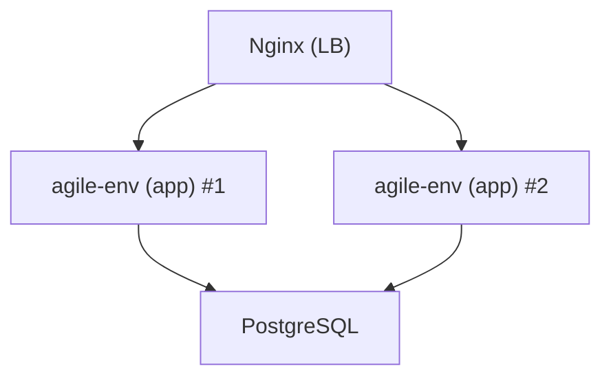

# 📖 Dossier d’Architecture Technique (DAT) – **agile‑env**  

[TOC]

---  

## 1️⃣ Introduction et objectifs <a id="intro"></a>

**Vue d’ensemble fonctionnelle**  
*agile‑env* est une petite application web PHP exposée via Apache, destinée à fournir des services internes (ex. : gestion de configuration, accès à des données métier) aux utilisateurs du ministère. Elle s’appuie sur une base de données PostgreSQL et utilise le protocole CAS pour l’authentification unique.

### 1.1 Diagramme C4 – Niveau 1 (System Context)  

```mermaid
flowchart LR
    subgraph Utilisateurs;
        UI[« Utilisateur »]
    end
    subgraph Système;
        APP[« agile‑env (PHP/Apache) »]
        DB[« PostgreSQL »]
        CAS[« CAS (authentification) »]
    end
    UI -->|HTTP/HTTPS| APP;
    APP -->|JDBC/SQL| DB;
    APP -->|CAS ticket| CAS;
    CAS -->|validation ticket| APP
```

### 1.2 Objectifs de qualité orientés utilisateur  

| # | Objectif | Raison métier |
|---|----------|--------------|
| 1 | **Performance** – temps de réponse ≤ 200 ms pour les requêtes courantes | Satisfaction des usagers internes |
| 2 | **Sécurité** – conformité D‑I‑C‑T, protection des données sensibles | Respect des exigences RGAA & RGPD |
| 3 | **Disponibilité** – 99,9 % de temps de service (SLA) | Continuité des services critiques |
| 4 | **Maintenabilité** – couverture de tests unitaires ≥ 70 % | Réduction du coût de l’évolution |
| 5 | **Portabilité** – déploiement identique sur dev, recette et prod grâce à Docker | Accélération du cycle CI/CD |

↩︎ [Retour au sommaire](#toc)

---  

## 2️⃣ Parties prenantes <a id="stakeholders"></a>

| Rôle | Attente principale |
|------|---------------------|
| **MOA / Product Owner** | Fonctionnalités livrées dans les délais, respect du périmètre métier |
| **Développeurs** | Environnement de dev reproductible, pipeline CI/CD fiable |
| **Ops / Exploitants** | Déploiement automatisé, monitoring et alerting opérationnels |
| **RSSI (Responsable Sécurité)** | Conformité D‑I‑C‑T, gestion des secrets, audits de vulnérabilité |
| **Utilisateurs finaux** | Accès simple, rapide et sécurisé aux services de l’application |

> *Aucun fichier de contacts n’a été fourni ; la section « Contacts » est donc omise.*

↩︎ [Retour au sommaire](#toc)

---  

## 3️⃣ Contraintes <a id="constraints"></a>

### 3.1 Contraintes techniques  
| Type | Description |
|------|-------------|
| **Plateforme** | Docker + Docker‑Compose (dev) ; conteneurs séparés *app* (php‑apache) et *db* (postgres 11‑alpine). |
| **Langage / Runtime** | PHP 7.3, Apache 2.4, PostgreSQL 11. |
| **Proxy** | Tous les flux HTTP/HTTPS passent par le proxy interne `pfrie-std.proxy.e2.rie.gouv.fr:8080`. |
| **Gestion des secrets** | Variables d’environnement stockées dans `docker/extra/app-conf/.env`. |
| **Infrastructure** | Hébergement sur le cloud interne ECO4 (OpenStack). |

### 3.2 Contraintes organisationnelles  
* Respect du processus de revue de code (merge‑request obligatoire).  
* Livraison via le pipeline GitLab CI/CD du département.  

### 3.3 Contraintes réglementaires  
* **RGPD** – protection des données à caractère personnel.  
* **RGAA** – accessibilité minimale (niveau AA).  

### 3.4 Exigences de sécurité (modèle D‑I‑C‑T)  

| Dimension | Exigence | Exemple de mise en œuvre |
|-----------|----------|---------------------------|
| **Disponibilité** | Redondance du conteneur *app* en prod | Load‑balancer Nginx (2 instances) |
| **Intégrité** | Vérification d’intégrité des images Docker | Signature d’image via Notary |
| **Confidentialité** | Chiffrement des secrets en repos | .env crypté, variables injectées via Docker secrets |
| **Traçabilité** | Journalisation centralisée | Fluentd → Loki, corrélation avec le ticket CAS |

↩︎ [Retour au sommaire](#toc)

---  

## 4️⃣ Contexte et périmètre <a id="scope"></a>

| Élément | Description |
|---------|-------------|
| **Partenaires fonctionnels** | Service d’authentification CAS (externe), Service de reporting interne (ex. : API REST). |
| **Interfaces techniques** | <ul><li>`HTTP/HTTPS` : API web (Apache)</li><li>`JDBC/SQL` : PostgreSQL (port 5432)</li><li>`CAS` : protocole SAML 2.0 (ticket‑validation)</li></ul> |
| **Fréquence d’échange** | Interaction utilisateur : on‑demand. <br>Synchronisation avec CAS : au login. |
| **Type de données** | Données métiers (configurations, logs), identifiants d’utilisateur (CAS token). |

↩︎ [Retour au sommaire](#toc)

---  

## 5️⃣ Stratégie de solution <a id="strategy"></a>

### 5.1 Décisions architecturales majeures  

| Décision | Raison |
|----------|--------|
| **Monolithe conteneurisé** (un conteneur PHP/Apache) | Simplicité de mise en œuvre, faible volume de code. |
| **Base de données séparée** (container `postgres:11-alpine`) | Isolation des données, facilité de backup. |
| **Utilisation de Docker‑Compose** en dev | Reproductibilité locale. |
| **CI/CD GitLab** avec images Docker build | Automatisation du build, des tests et du déploiement. |

### 5.2 Stack technologique  

| Couche | Technologie |
|--------|-------------|
| **Langage** | PHP 7.3 |
| **Framework** | Aucun framework dédié (code “vanilla”), Composer pour la gestion des dépendances |
| **Web server** | Apache 2.4 (image `php:7.3-apache-buster`) |
| **DB** | PostgreSQL 11 (image `postgres:11-alpine`) |
| **Reverse‑proxy** | Nginx (pair load‑balanced) – décrit dans la vue Déploiement |
| **Configuration** | Fichiers `docker/conf/000-default.conf`, `.env`, `param.ini` |
| **CI/CD** | GitLab CI, Docker Build, SonarQube (qualité), Trivy (scan vulnérabilités) |
| **Tests** | PHPUnit (unitaires), Behat (behaviour) |
| **Monitoring** | Prometheus + Grafana + Loki + Alertmanager (voir section Supervision) |
| **Sauvegarde** | Scripts GTI (dump AES‑256) → stockage B3, Outscale SecNumCloud, Google Cloud |

↩︎ [Retour au sommaire](#toc)

---  

## 6️⃣ Vue en Briques (C4 – Niveau 2) <a id="containers"></a>

### 6.1 Diagramme C4 – Conteneurs  

```mermaid
flowchart LR
    subgraph "Docker Host"
        NGINX[Nginx (load‑balancer)] 
        APP[php‑apache (agile‑env)] 
        DB[(PostgreSQL 11)]
    end
    NGINX -->|HTTP/HTTPS| APP;
    APP -->|SQL| DB;
    APP -->|CAS ticket| CAS[CAS (auth)]
```

### 6.2 Description des conteneurs  

| Conteneur | Rôle | Principaux artefacts |
|----------|------|----------------------|
| **nginx** | Point d’entrée unique, répartit le trafic entre deux instances d’`app`. | `docker/conf/000-default.conf` |
| **app** | Application PHP + Apache, exécute le code métier, consomme la DB et le service CAS. | `Dockerfile-app`, `composer.json`, `src/` (vide pour l’instant) |
| **db** | PostgreSQL 11, persistance des données métier. | `docker/db/Dockerfile`, scripts d’init (`initdb/*.sql`) |
| **cas (externe)** | Service d’authentification unique du ministère. | Configuré via `docker/extra/app-conf/config_CAS.php` |

↩︎ [Retour au sommaire](#toc)

---  

## 7️⃣ Vue Exécution (Scénarios critiques) <a id="execution"></a>

### 7️⃣ Scénario 1 – Authentification d’un utilisateur  

```mermaid
sequencediagram;
    participant U as Utilisateur ( navigateur )
    participant N as Nginx (LB)
    participant A as agile‑env (app)
    participant C as CAS;
    U->>N: GET / (HTTPS)
    N->>A: Forward request;
    A->>C: Redirect to CAS (ticket request)
    C-->>U: Page de login CAS;
    U->>C: Saisie credentials;
    C-->>U: Ticket CAS;
    U->>A: GET /?ticket=XYZ;
    A->>C: Validation ticket;
    C-->>A: Confirmation + attributs utilisateur;
    A->>U: Page d’accueil (session établie)
```

**Points de contrôle**  

* Vérification du ticket CAS (intégrité).  
* Création d’une session sécurisée (HttpOnly, SameSite).  

### 7️⃣ Scénario 2 – Lecture de données métier  

```mermaid
sequencediagram;
    participant U as Utilisateur;
    participant A as agile‑env (app)
    participant D as PostgreSQL;
    U->>A: GET /api/config;
    A->>D: SELECT * FROM config WHERE user_id = ?
    D-->>A: Résultat;
    A->>U: JSON (200)
```

*Temps cible* : ≤ 200 ms.  

### 7️⃣ Scénario 3 – Sauvegarde automatisée (nightly)  

```mermaid
sequencediagram;
    participant S as Scheduler (cron)
    participant D as PostgreSQL;
    participant B as Backup Script;
    S->>B: Lancement script 02_00;
    B->>D: pg_dump (AES‑256)
    B->>B: Upload dump → B3, Outscale, GCP;
    B-->>S: Retour OK
```

↩︎ [Retour au sommaire](#toc)

---  

## 8️⃣ Vue Déploiement *(section standardisée)* <a id="deployment"></a>

### Environnements
| Environnement | Hébergement | Serveurs | Réseau | Particularités |
|---------------|-------------|----------|--------|----------------|
| Développement | Docker‑Compose (local) | 1 app + 1 db | Bridge Docker | Variables `.env.dev` |
| Recette       | Cloud interne ECO4 | 2 app (LB) + 1 db | VPC isolée | Tests d’intégration automatisés |
| Production    | Cloud interne ECO4 (tenant `pnm3`) | 2 app (LB) + 1 db | VPC sécurisée | TLS mutual, sauvegardes 3x jour |

### Infrastructure
Le produit est hébergé sur le cloud interne **ECO4** basé sur **OpenStack**, dans le tenant **`pnm3`** du département.  
Le reverse‑proxy **Nginx** du schéma ci‑dessous est en fait une paire de Nginx load‑balancés en frontal des produits hébergés sur le tenant.



### Supervision
Le produit est supervisé via le système standard du GTI pour ce faire :  

* via **Portainer** pour la partie purement conteneurisée,  
* via la stack **Prometheus / Grafana / Loki / AlertManager**,  
* le produit dispose également d’une supervision **PSIN**.

### Sauvegardes
Les sauvegardes de la base de données sont assurées par des scripts standards du GTI permettant la création de dumps cryptés en **AES‑256** et déposés sur :

* le stockage objet **B3** du IaaS ministériel,  
* le stockage objet **Outscale SecNumCloud** (via la prestation du GTI sur le marché « Nuage Public »),  
* le stockage objet standard de **Google Cloud** (via la prestation du GTI sur le marché « Nuage Public »).

↩︎ [Retour au sommaire](#toc)

---  

## 9️⃣ Sujets transverses <a id="crosscutting"></a>

| Domaine | Décision / Implémentation |
|---------|---------------------------|
| **Authentification** | CAS (SAML 2.0) – tickets validés côté serveur, sessions PHP sécurisées. |
| **Journalisation** | `php-fpm` → stdout → Loki (via Fluentd). Niveau `INFO` par défaut, `ERROR` en cas d’exception. |
| **Monitoring** | Métriques exposées `/metrics` (Prometheus). Dashboard Grafana dédié. |
| **Gestion des erreurs** | Middleware PHP → JSON error payload + code HTTP approprié. |
| **API** | Endpoints RESTful (`/api/*`), versionnées (`/api/v1/...`). |
| **Sécurité des secrets** | `.env` injecté via Docker secrets, chiffrement au repos. |
| **CI/CD** | GitLab pipelines : `build → test → scan (Trivy) → push → deploy`. |
| **Documentation** | README minimal, diagrammes Mermaid intégrés dans le DAT. |

↩︎ [Retour au sommaire](#toc)

---  

## 🔟 Exigences de qualité <a id="quality"></a>

| Exigence | Criticité | Scénario de validation |
|----------|------------|------------------------|
| **Performance** – temps de réponse ≤ 200 ms (80 % des requêtes) | Haute | Test de charge (k6) sur `/api/config` avec 100 RPS, mesure du 95ᵉ percentile. |
| **Sécurité** – pas de vulnérabilité critique (CVSS ≥ 7) | Haute | Scan Trivy & OWASP ZAP, aucun résultat > 7. |
| **Disponibilité** – MTBF ≥ 30 jours, MTTR ≤ 1 h | Haute | Simuler la perte d’un conteneur `app` et vérifier le basculement automatique via le LB. |
| **Scalabilité** – capacité à ajouter une instance `app` sans re‑déploiement | Moyenne | Déployer 3ᵉ conteneur, vérifier le load‑balancing et la cohérence des sessions. |
| **Maintenabilité** – couverture de tests unitaires ≥ 70 % | Moyenne | Exécuter `phpunit --coverage-text` et vérifier le pourcentage. |
| **Conformité** – logs d’audit conservés ≥ 90 jours | Moyenne | Vérifier la rétention dans Loki/Grafana. |

↩︎ [Retour au sommaire](#toc)

---  

## 1️⃣1️⃣ Risques et dettes techniques <a id="risks"></a>

| Risque / Dette | Impact | Probabilité | Mitigation / Action corrective |
|-----------------|--------|-------------|--------------------------------|
| **PHP 7.3 en fin de vie** | Failles de sécurité non corrigées | Élevée | Planifier la migration vers PHP 8.2 (branch `upgrade-php`). |
| **Absence de tests fonctionnels** | Régression non détectée | Moyenne | Introduire des scénarios Behat dès le prochain sprint. |
| **Secrets en clair dans `.env`** | Exposition de credentials | Élevée | Utiliser Docker secrets + chiffrement, supprimer le fichier du repo. |
| **Monolithe difficile à scaler** | Saturation sous forte charge | Faible | Étudier le découpage en micro‑services (ex. : service de configuration). |
| **Dépendances Composer non fixées** | Build non reproductible | Moyenne | Verrouiller les versions (`composer.lock`) et activer le vérificateur de dépendances. |

↩︎ [Retour au sommaire](#toc)

---  

## 1️⃣2️⃣ Annexes <a id="annexes"></a>

### 12.1 Glossaire  

| Terme | Définition |
|-------|------------|
| **CAS** | Central Authentication Service, protocole SSO utilisé par le ministère. |
| **Docker‑Compose** | Outil de définition et d’orchestration de conteneurs multi‑services. |
| **CI/CD** | Intégration continue / Déploiement continu. |
| **D‑I‑C‑T** | Modèle de sécurité : Disponibilité, Intégrité, Confidentialité, Traçabilité. |
| **GTI** | Groupe Technique Informatique – équipe en charge des infrastructures ministérielles. |
| **ECO4** | Cloud interne OpenStack du ministère. |

### 12.2 Décisions d’Architecture (ADR) – exemples  

| ADR # | Décision | Date | Contexte | Conséquence |
|-------|----------|------|----------|-------------|
| **ADR‑001** | Utiliser Docker + Docker‑Compose | 2024‑03‑15 | Besoin d’un environnement reproductible pour dev/recette. | Simplifie le provisioning, mais nécessite la gestion des secrets. |
| **ADR‑002** | Authentifier via CAS | 2024‑03‑20 | Politique ministérielle d’authentification unique. | Centralise la gestion des identités, mais crée une dépendance externe. |
| **ADR‑003** | Séparer DB et App en conteneurs distincts | 2024‑04‑01 | Besoin d’isoler la persistance et de faciliter les backups. | Facilite le scaling de l’app, mais nécessite un réseau interne fiable. |

---  

*Document généré automatiquement selon le modèle Arc42, prêt à être exploité dans VS Code ou Obsidian (Mermaid activé).*  