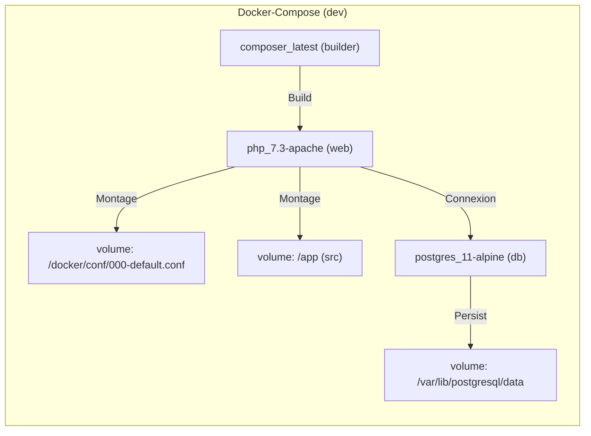

# 📄 Dossier d’Exploitation (DEX) – agile‑env  
*Document établi sur les principes de la transition **Build → Run** et des bonnes pratiques ITIL/DevOps pour l’exploitation applicative*  

[TOC]

---  

## 1️⃣ Introduction et objectifs  

**Vue d’ensemble**  
> Document de référence garantissant la continuité, la maintenabilité et la sécurisation de l’exploitation de l’application **agile‑env** en production.  

**Objectifs opérationnels**  

| ✅ | Objectif |
|---|----------|
| ✅ | Assurer la continuité de service |
| 📖 | Documenter les procédures de gestion courante |
| 🛠 | Faciliter le support et la résolution d’incidents |
| 🤝 | Encadrer les responsabilités (Dev / Ops / Support) |
| 🛡 | Assurer la conformité et la maîtrise des risques |
| 🔄 | Accompagner la phase de transition **Build → Run** |

---  

## 2️⃣ Contexte d’usage et périmètre  

| Élément | Valeur |
|---|---|
| **Nom du projet** | **agile‑env** |
| **Chemin du dépôt** | `G:\WarchoLife\WarchoDevplace\Gitlab_Applications\ambulon\workplace-ambulon\gitlab\agile-env` |
| **Type de livrable** | Standard ✅ |
| **Nature** | Document de référence 📘 |
| **Activité** | Transition **Build → Run / Exploitation** |
| **Quand l’utiliser** | • Avant chaque mise en production  <br>• Formation des équipes d’exploitation <br>• Audits de conformité, PRA/PCA, revues de sécurité |
| **Cycle de vie** | Document vivant – mise à jour à chaque évolution fonctionnelle, technique ou d’infrastructure |

---  

## 3️⃣ Pré‑requis et jalons  

- [ ] Architecture technique validée (schémas à jour)  
- [ ] Environnement de production stabilisé (accès, réseaux, DNS, certificats)  
- [ ] Politiques définies : sauvegarde, supervision, sécurité, SLA : **[SLA à préciser]**  
- [ ] Contacts clés identifiés :  
  - Métier : **[Nom – fonction]**  
  - Technique : **[Nom – rôle]**  
  - Support : **[Nom – équipe]**  
  - Sécurité : **[Nom – RSSI]**  
- [ ] Outillage prêt : monitoring (ex. Prometheus/Grafana), logging (ex. ELK), ordonnanceur (cron), gestion des secrets (ex. Vault)  

> ⏱ **Jalon critique** – Le DEX doit être **validé et signé** avant tout go‑live. Aucun déploiement ne doit intervenir sans un DEX approuvé.  

---  

## 4️⃣ Gouvernance et rôles  

| Rôle | Profil type | Responsabilité |
|------|-------------|----------------|
| **Rédacteur principal** | Tech Lead / DevOps / Référent Prod | Rédaction, structuration, intégration des spécifications techniques |
| **Validateur Exploitation** | Chef d’exploitation / Responsable support | Vérification de l’opérabilité et de la complétude |
| **Validateur Sécurité / Conformité** | RSSI / DPO / Auditeur interne | Validation des procédures de sécurité, backup, conformité |
| **Mainteneur** | Équipe projet / PO technique | Mise à jour continue à chaque release ou changement d’infra |

---  

## 5️⃣ Structure détaillée du DEX  

| N° | Section | Contenu attendu (exemples) |
|---:|---------|----------------------------|
| 1 | **Généralités** | Objet, domaine d’application, audience cible, version du document |
| 2 | **Documents applicables et de référence** | Chartes internes, documents d’architecture, politiques de sécurité |
| 3 | **Terminologie** | Glossaire technique / métier, acronymes (SLA, PRA, CI/CD, IAM…) |
| 4 | **Spécificités** | Fonctionnalités critiques, SLA/SLO, contacts clés, matrice d’escalade |
| 5 | **Architecture** | Schémas logiques/physiques, flux de données, infra prod, PRA/PCA |
| 6 | **Serveurs / Services** | Accès (SSH/Console), OS, versions, CPU/RAM/Stockage, DNS/IP |
| 7 | **Application** | Composants (PHP 7.3, Apache 2, Composer, PostgreSQL 11), versions, paramètres, procédure de déploiement |
| 8 | **Supervision et métrologie** | Outils (Prometheus, Grafana, alertmanager), seuils, dashboards, métriques clés |
| 9 | **Sauvegarde** | Politique (fréquence, rétention, type), localisation, procédure de restauration |
|10 | **Stockage** | Volumes Docker, quotas, chemins, gestion des logs |
|11 | **Inventaire des bases** | PostgreSQL 11 – schémas, utilisateurs, sauvegardes, archivage |
|12 | **Flux inter‑applicatifs** | Ports, protocoles, authentification, dépendances (ex. service d’authentification CAS) |
|13 | **Plan de production** | Ordonnancement (cron, tâches planifiées), fenêtres de maintenance |
|14 | **Sécurisation des images** | Scan CVE, hardening, gestion des secrets, politique de patching |
|15 | **Opérations courantes** | Check‑list quotidienne, gestion des logs, erreurs connues, diagnostics |
|16 | **Opérations récurrentes** | Rotation des certificats, nettoyage, audits périodiques, gestion des comptes |

> **Note** : Adaptez, fusionnez ou supprimez des sections selon le contexte (ex. serverless, SAAS, legacy, micro‑services).  

---  

## 6️⃣ Diagramme Mermaid du cycle de vie du DEX  

```mermaid
graph TB
    %% Style des acteurs;
    skinparam actorStyle Fill:#E3F2FD,Stroke:#1976D2,StrokeWidth_2px,FontColor:#1976D2;
    %% Acteurs;
    actor dev as "Équipe Dev / Tech Lead"
    actor ops as "Équipe Ops / Support"
    actor sec as "Équipe Sécurité / Conformité"
    actor maint as "Équipe Maintien"

    %% Phases (packages)
    package "Phase 1 – Rédaction" {
        rectangle step1 ["Collecte des specs & architecture"]
        rectangle step2 ["Rédaction des 16 sections DEX"]
    }

    package "Phase 2 – Validation croisée" {
        rectangle step3 ["Revue technique (DevOps/Infra)"]
        rectangle step4 ["Validation opérationnelle (Ops)"]
        rectangle step5 ["Validation sécurité & conformité"]
    }

    package "Phase 3 – Go‑Live & Run" {
        rectangle step6 ["Signature & archivage versionné"]
        rectangle step7 ["Intégration runbook & supervision"]
    }

    package "Phase 4 – Maintenance continue" {
        rectangle step8 ["Mise à jour à chaque release"]
        rectangle step9 ["Revue trimestrielle / post‑incident"]
    }

    %% Flux;
    dev -->|Alimente| step1;
    dev -->|Rédige| step2;
    ops -->|Vérifie| step3;
    ops -->|Valide opérabilité| step4;
    sec -->|Valide conformité| step5;
    step5 -->|Accord go‑live| step6;
    step6 -->|Déploiement| step7;
    maint -->|Met à jour| step8;
    step9 -.->|Boucle d’amélioration| step2;
    %% Notes;
    note right of step5;
        <b>Points de contrôle</b>\n- Complétude des accès\n- Procédures de rollback\n- Matrice d’escalade testée;
    end note;
    note bottom of step9;
        <b>Règle d’or</b>\nPas de mise en production\nsans DEX à jour;
    end note;
    %% Clickable phases (optional)
    click step1 "javascript_void(0)" "Voir Phase 1"
    click step3 "javascript_void(0)" "Voir Phase 2"
    click step6 "javascript_void(0)" "Voir Phase 3"
    click step8 "javascript_void(0)" "Voir Phase 4"
```

---  

## 7️⃣ Conseils de rédaction et maintenance  

| Bonne pratique | À éviter |
|----------------|----------|
| Utiliser un dépôt versionné (Git) avec historique et tags | Stocker le DEX en pièce jointe email ou sur un partage non versionné |
| Rédiger en langage clair, orienté action et procédure | Rédiger des descriptions vagues ou purement théoriques |
| Inclure captures d’écran, chemins exacts et commandes | Laisser des placeholders `[À COMPLÉTER]` en production |
| Prévoir une revue systématique à chaque release majeure | Considérer le DEX comme « jetable » post‑lancement |
| Lier le DEX aux runbooks, tickets d’incident et procédures PRA | Isoler le DEX des outils de supervision et de ticketing |

---  

## 8️⃣ Adaptations contextuelles  

| Contexte | Adaptation recommandée |
|----------|------------------------|
| **Applications Cloud / Serverless** | Remplacer la section « Serveurs » par « Services managés, IAM, Config as Code, Limits/Quotas » |
| **Secteur réglementé (Santé, Finance, Public)** | Renforcer les sections Sécurité, Traçabilité, Archivage légal, Conformité RGAA/ANSSI |
| **Legacy / Monolithe** | Insister sur la dépendance OS, patches, procédures de reprise manuelle |
| **Micro‑services / Kubernetes** | Remplacer « Inventaire BDD/Serveurs » par « Clusters, Namespaces, Helm/Manifests, Observabilité (Prometheus/Grafana/Loki) » |

---  

## 9️⃣ Livrables et intégration  

| Livrable | Description |
|----------|-------------|
| **DEX versionné** | Fichier `.md` (ou export PDF) versionné dans le dépôt Git |
| **Checklist de validation** | Tableau de signatures (Dev, Ops, Sécurité) signé avant go‑live |
| **Matrice de traçabilité** | Lien DEX ↔ Architecture ↔ Runbooks ↔ Tickets support |
| **Intégration CI/CD** | Étape de validation automatisée (ex. vérif : présence de sections critiques) |
| **Liens DEX dans les dashboards** | Bouton « Documentation » dans Grafana/Datadog pointant le DEX |
| **Génération partielle via IaC** | Scripts Terraform/Ansible qui remplissent automatiquement les parties « Inventaire serveurs », « Volumes », « Bases de données » |

---  

## 🔧 Mini‑glossaire  

| Acronyme | Signification |
|----------|----------------|
| **SLA** | Service Level Agreement – engagement de disponibilité |
| **PRA** | Plan de Reprise d’Activité – restauration après sinistre |
| **CI/CD** | Continuous Integration / Continuous Delivery |
| **IAM** | Identity & Access Management |
| **CVEs** | Common Vulnerabilities and Exposures |
| **IaC** | Infrastructure as Code |
| **Runbook** | Document de procédures opérationnelles détaillées |

---  

## 📎 Annexes (exemple de diagramme d’architecture)  



---  

## 🔚 Retour au sommaire  

↩ **[Retour au sommaire](#toc)**  

---  

*Ce DEX est autonome, versionnable et immédiatement exploitable dans VS Code, Obsidian ou tout autre éditeur Markdown. Remplacez les blocs entre crochets `[ … ]` par les informations réelles de votre projet pour le personnaliser en moins de 5 minutes.*  