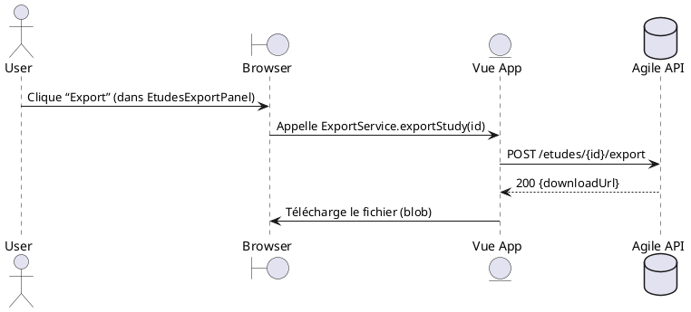

# 📘 Dossier d’Architecture Technique – **agile‑front**  
*Version 1.0 – 27 avril 2026*  

[TOC]

---  

## 1️⃣ Introduction et objectifs  

**Agile‑front** est une application **Single‑Page** (SPA) écrite en **Vue 2** avec **Vuetify**.  
Elle sert d’interface utilisateur aux équipes métier qui consultent, créent et exportent des études / financements via l’API métier (ex. : `/etudes/*`).  

### Objectifs de qualité orientés utilisateur  

| # | Objectif | Raison métier |
|---|----------|---------------|
| 1 | **Performance** – temps de chargement < 2 s en 3G | Les utilisateurs travaillent souvent sur des postes mobiles. |
| 2 | **Sécurité** – authentification forte, protection CSRF/XSS | Accès à des données sensibles (études, financements). |
| 3 | **Maintenabilité** – code‑base testable, séparation claire des responsabilités | Evolution fréquente des écrans métier. |
| 4 | **Accessibilité** – conformité WCAG 2.1 AA | Obligation réglementaire pour les services publics. |
| 5 | **Observabilité** – logs client + métriques de performances | Détection rapide d’incidents en production. |

---  

## 2️⃣ Niveau 1 – Vue Contexte (System Context)  

```plantuml
@startuml
!include https://raw.githubusercontent.com/plantuml-stdlib/C4-PlantUML/master/C4_Context.puml

Person(user, "Utilisateur métier", "Consultation, création et export d’études/financements")
System_Boundary(agile, "Agile‑front (SPA)") {
    System(spa, "Agile‑front", "Application Vue 2 + Vuetify, exécutée côté navigateur")
}
System_Ext(api, "Agile API", "REST API métier (études, sécurité, export)")

Rel(user, spa, "Utilise", "HTTPS/HTML5")
Rel(spa, api, "Consomme", "HTTPS/JSON")

@enduml
```  

### Acteurs principaux  

| Acteur | Objectif principal |
|--------|-------------------|
| **Utilisateur métier** | Naviguer, rechercher, créer, modifier, exporter des études et des financements. |
| **Administrateur** (personne possédant le rôle `admin` dans le token) | Gérer les droits, accéder aux logs d’audit. |

### Systèmes externes  

| Système | Rôle |
|---------|------|
| **Agile API** | Fournit les services REST : `GET /etudes/*`, `POST /etudes/*`, `GET /security/subject`, etc. |
| **Service d’authentification** (intégré dans l’API) | Retourne le *subject* (email, rôles). |

---  

## 3️⃣ Parties prenantes  

| Rôle | Attente principale |
|------|---------------------|
| **Product Owner** | Livraison fonctionnelle conforme aux besoins métier, priorisation des évolutions. |
| **Développeurs Front‑end** | Code lisible, testable, CI/CD fiable, documentation à jour. |
| **Architecte Technique** | Cohérence avec la stack Vue/Vuetify, respect des standards de sécurité. |
| **Responsable Sécurité (RSSI)** | Conformité aux exigences D‑I‑C‑T, protection des données. |
| **Exploitation / Ops** | Déploiement simple, monitoring automatisé, procédure de rollback. |
| **Utilisateurs finaux** | Interface réactive, ergonomique, accessible. |

---  

## 4️⃣ Contraintes  

### Techniques  

* Vue 2 + Vuetify 2, Babel, PostCSS.  
* Navigation via `vue‑router`.  
* Gestion d’état via **Vuex** (modules `studies` & `security`).  
* Communication HTTP via **axios** (services `LegacyProxyService`, `SecurityService`, `ExportService`, `StudiesService`).  
* Déploiement sur un serveur web statique (NGINX) dans le cloud interne **ECO4** (OpenStack).  

### Organisationnelles  

* Conformité aux standards internes du GTI (CI/CD, monitoring, sauvegarde).  
* Cycle de release toutes les 2 semaines (feature‑branch → merge‑request).  

### Réglementaires  

| Dimension | Exigence (modèle D‑I‑C‑T) |
|-----------|---------------------------|
| **Disponibilité** | 99,5 % (SLA) – services critiques (API) doivent rester accessibles. |
| **Intégrité** | Validation côté client + serveur, utilisation de `https` et de tokens signés. |
| **Confidentialité** | Transmission chiffrée TLS 1.2+, stockage côté client limité (pas de données sensibles). |
| **Traçabilité** | Logs d’accès côté front (via `window.performance`) envoyés à la stack Prometheus / Grafana. |

---  

## 5️⃣ Niveau 2 – Vue Conteneurs (Containers)  

```plantuml
@startuml
!include https://raw.githubusercontent.com/plantuml-stdlib/C4-PlantUML/master/C4_Container.puml

System_Boundary(spa, "Agile‑front (SPA)") {
    Container(browser, "Navigateur", "HTML5/JS", "Héberge l’application Vue")
    Container(webServer, "NGINX (static)", "Docker / Nginx", "Serveur de fichiers statiques")
}

System_Ext(api, "Agile API", "REST API")

Rel(browser, webServer, "Charge les assets (HTML, JS, CSS)", "HTTPS")
Rel(webServer, api, "Appels API", "HTTPS/JSON")
Rel(browser, api, "Appels API (axios)", "HTTPS/JSON")

@enduml
```  

### Description des conteneurs  

| Conteneur | Responsabilité | Technologie | Interactions clés |
|----------|----------------|-------------|------------------|
| **Navigateur** | Exécution du code client, rendu UI | Vue 2, Vuetify, JavaScript ES6 | Consomme les services via `axios`. |
| **NGINX (Docker)** | Distribution des assets statiques (`index.html`, bundle JS, CSS) | Docker, Nginx 1.23 | Expose le SPA sur `https://<host>/`. |
| **Agile API** (externe) | Traitement métier, persistance, sécurité | Java Spring Boot, PostgreSQL (hors scope) | Fournit les endpoints `/etudes/*`, `/security/*`. |

### Décisions architecturales majeures  

* **SPA monolithique côté front** – simplifie le déploiement (un seul bundle).  
* **Axios instance centralisée** (`LegacyProxyService`, `SecurityService`) – gestion uniforme des en‑têtes, timeout (100 s).  
* **Vuex** en mode *namespaced* – isolation des domaines (`studies`, `security`).  
* **Vuetify** comme UI‑framework – cohérence visuelle, support Material Design.  

### Environnement technologique  

| Niveau | Outil / Stack |
|-------|----------------|
| **Langage** | JavaScript (ES6) |
| **Framework UI** | Vue 2 + Vuetify |
| **Gestion d’état** | Vuex |
| **Routing** | vue‑router |
| **Bundler** | Vue‑CLI (webpack) |
| **CI/CD** | GitLab CI (build, test, Docker image, push) |
| **Tests** | Jest (unit), Cypress (e2e) |
| **Infra** | Docker, Nginx, OpenStack (ECO4) |
| **Monitoring** | Prometheus / Grafana, Portainer, PSIN |

---  

## 6️⃣ Niveau 3 – Vue Composants (Components) *(exemple du conteneur “Navigateur / Vue App”)*  

```plantuml
@startuml
!include https://raw.githubusercontent.com/plantuml-stdlib/C4-PlantUML/master/C4_Component.puml

Container_Boundary(spa, "Vue Application") {
    Component(App, "App.vue", "Root component", "Monte le layout global")
    Component(Router, "router.js", "Vue‑router", "Définit les routes /views")
    Component(Store, "store.js", "Vuex Store", "Gestion globale d’état")
    Component(ServiceLayer, "services/*", "Axios services", "Accès API")
    Component(Components, "components/*", "Vue components", "UI réutilisable")
}
Rel(App, Router, "Utilise")
Rel(App, Store, "Injecte")
Rel(App, ServiceLayer, "Appelle")
Rel(Router, Components, "Charge")
@enduml
```  

#### Principaux composants  

| Composant | Rôle | Principaux fichiers |
|-----------|------|----------------------|
| **App.vue** | Point d’entrée, layout avec `v-app` | `src/App.vue` |
| **router.js** | Mapping routes → vues (`Home`, `Login`, `Etude`, …) | `src/router.js` |
| **store.js** | Vuex store global, modules `studies` & `security` | `src/store/store.js` |
| **services/** | Façade `axios` pour chaque domaine fonctionnel (`LegacyProxyService`, `SecurityService`, `StudiesService`, `ExportService`) | `src/services/*.js` |
| **components/** | UI réutilisable (listes, dialogues, filtres) | `src/components/*.vue` |
| **mixins/** | Logique partagée (ex. `filterUtilMixin`) | `src/mixins/*.js` |
| **views/** | Pages fonctionnelles (Login, Etude, Tutoriels, …) | `src/views/*.vue` |

---  

## 7️⃣ Niveau 4 – Vue Code (Code)  

> Le niveau 4 (diagrammes de classes, ERD) n’est pas détaillé dans ce DAT.  
> Il est disponible sur demande sous forme de diagrammes PlantUML ou d’export d’IDE.

---  

## 8️⃣ Vue Exécution – Scénarios critiques  

### 8.1 Scénario « Connexion utilisateur » (séquence)  

```plantuml
@startuml
!include https://raw.githubusercontent.com/plantuml-stdlib/C4-PlantUML/master/C4_Deployment.puml

actor User
boundary Browser
entity "Vue App" as VueApp
database "Agile API" as API

User -> Browser : Ouvre URL
Browser -> VueApp : charge index.html + bundle.js
VueApp -> API : GET /security/subject (via SecurityService)
API --> VueApp : 200 {subject: {email, roles}}
VueApp -> Browser : Met à jour store.security (isConnected, isAdmin)
Browser -> User : Affiche page d’accueil adaptée

@enduml
```  

**Points de contrôle qualité**  

* **Temps de réponse** < 500 ms (API).  
* **Gestion d’erreur** – redirection vers `/login` si `401`.  

### 8.2 Scénario « Export d’une étude »  



**Critères**  

* **Intégrité** – le fichier doit être signé (checksum).  
* **Traçabilité** – log d’export envoyé à la stack Prometheus.  

---  

## 9️⃣ Vue Déploiement *(section standardisée)*  

```plantuml
@startuml
!include https://raw.githubusercontent.com/plantuml-stdlib/C4-PlantUML/master/C4_Deployment.puml

Deployment_Node(cloud, "Cloud ECO4", "OpenStack Tenant pnm3") {
    Deployment_Node(nginx, "Nginx Cluster", "Load Balancer") {
        Container(app, "Agile‑front (SPA)", "Docker", "Application Vue + assets")
    }
    Deployment_Node(db, "Base de données", "PostgreSQL") {
        ContainerDb(database, "Database", "PostgreSQL", "Données métier")
    }
}

Rel(nginx, app, "HTTP/HTTPS")
Rel(app, database, "JDBC/SQL")
@enduml
```

### Environnements  

| Environnement | Hébergement | Serveurs | Réseau | Particularités |
|--------------|-------------|----------|--------|----------------|
| Développement | Docker‑Compose (local) | 1 x NGINX, 1 x Vue‑CLI dev‑server | localhost | Hot‑reload, logs console |
| Recette | Cloud ECO4 (tenant `pnm3‑recette`) | 2 x NGINX, 1 x API Mock | VLAN recette | Tests d’intégration automatisés |
| Production | Cloud ECO4 (tenant `pnm3`) | 2 x NGINX (load‑balanced), 1 x API | VLAN prod, DMZ | TLS 1.3, WAF, monitoring Prometheus |

### Infrastructure  

Le produit est hébergé sur le cloud interne **ECO4** basé sur **OpenStack**, dans le tenant **`pnm3`** du département.  
Le reverse‑proxy **Nginx** du schéma ci‑dessus est en fait une paire de Nginx load‑balancés en frontal des produits hébergés sur le tenant.

### Supervision  

Le produit est supervisé via le système standard du GTI :  

* **Portainer** pour la partie purement conteneurisée.  
* **Stack Prometheus / Grafana / Loki / AlertManager** (metrics, logs, alertes).  
* Le produit dispose également d’une supervision **PSIN**.

### Sauvegardes  

Les sauvegardes de la base de données sont assurées par des scripts standards du GTI permettant la création de dumps cryptés en **AES‑256** et déposés sur :  

* le stockage objet **B3** du IaaS ministériel,  
* le stockage objet **Outscale SecNumCloud** (via la prestation du GTI « Nuage Public »),  
* le stockage objet standard de **Google Cloud** (via la même prestation).

---  

## 🔟 Sujets transverses  

| Sujet | Décision / Implémentation |
|-------|---------------------------|
| **Authentification** | JWT stocké en `httpOnly` cookie, rafraîchi via endpoint `/security/refresh`. |
| **Journalisation** | `axios` interceptor → envoie les métriques de temps de réponse à Prometheus Pushgateway. |
| **Monitoring** | `web-vitals` intégré dans `App.vue` → expose les scores LCP, FID, CLS. |
| **Gestion des erreurs** | Wrapper `apiClient` → capture `axios` errors, affichage via `v-snackbar`. |
| **API** | Tous les services utilisent le même `axios` instance (baseURL = `VUE_APP_API_BASE_URL`). |
| **Internationalisation** | Non implémentée (future‑proof via `vue-i18n`). |
| **CI/CD** | GitLab CI : `npm install → npm run lint → npm run test → docker build → push`. |
| **Sécurité CSP** | En-tête `Content‑Security‑Policy` configuré sur Nginx (script‑src ‘self’, style‑src ‘self’ + CDN). |

---  

## 1️⃣1️⃣ Exigences de qualité  

| Exigence | Validation (scénario) |
|----------|------------------------|
| **Performance** – TTFB < 500 ms | Test de charge (k6) sur `/` en environnement recette. |
| **Sécurité** – Aucun XSS | Scan OWASP ZAP sur l’URL de production. |
| **Accessibilité** – Score ≥ 90 % | Audit axe‑core sur les pages principales. |
| **Disponibilité** – 99,5 % sur 30 jours | Monitoring via Prometheus `up{job="nginx"}`. |
| **Observabilité** – Logs centralisés | Vérification de l’ingestion dans Loki (trace d’erreur 500). |

---  

## 1️⃣2️⃣ Risques et dettes techniques  

| Risque / Dette | Impact | Atténuation |
|----------------|--------|-------------|
| **Dépendance à l’API legacy** (routes `/etudes/*` non versionnées) | Rupture fonctionnelle si l’API change | Encapsuler les appels dans `LegacyProxyService`; prévoir un wrapper versionné. |
| **Vue 2** en fin de support | Difficulté à intégrer de nouvelles librairies | Plan de migration vers Vue 3 (début 2027). |
| **Absence de tests e2e complets** | Regressions UI non détectées | Ajouter des scénarios Cypress pour les flux critiques (login, export). |
| **Gestion des secrets en `.env`** (ex. `VUE_APP_API_BASE_URL`) | Fuite potentielle en cas de mauvaise configuration | Utiliser GitLab CI variables, ne jamais versionner le `.env`. |
| **Bundle size > 1 MB** (chargement initial) | Dégradation UX sur réseaux faibles | Activer le lazy‑loading des routes et composants, analyser avec Webpack Bundle Analyzer. |

---  

## 1️⃣3️⃣ Annexes  

### Glossaire  

| Terme | Définition |
|-------|------------|
| **SPA** | Single‑Page Application – application web qui charge une seule page HTML et met à jour le DOM dynamiquement. |
| **Vuex** | Bibliothèque de gestion d’état centralisée pour Vue. |
| **Vuetify** | UI‑framework Material Design pour Vue. |
| **C4** | Modèle de visualisation d’architecture (Context, Containers, Components, Code). |
| **D‑I‑C‑T** | Modèle de exigences de sécurité (Disponibilité, Intégrité, Confidentialité, Traçabilité). |
| **PSIN** | Plateforme de Supervision Inter‑Nationale (outil interne GTI). |

### Décisions d’Architecture (ADR)  

| # | Décision | Statut | Date | Raison |
|---|----------|--------|------|--------|
| ADR‑001 | Utiliser **Vue 2 + Vuetify** pour l’UI | ✅ | Conformité avec le reste du portefeuille applicatif. |
| ADR‑002 | Centraliser les appels API dans des *services* (`axios` instances) | ✅ | Uniformité des en‑têtes, gestion des erreurs centralisée. |
| ADR‑003 | Déployer le SPA via **NGINX statique** dans Docker | ✅ | Simplicité, support du TLS via reverse‑proxy. |
| ADR‑004 | Stocker le token JWT dans un **cookie httpOnly** | ✅ | Réduction du risque XSS. |
| ADR‑005 | Utiliser **GitLab CI** pour le pipeline | ✅ | Outil déjà présent dans l’organisation. |

---  

*Fin du Dossier d’Architecture Technique*   ↩︎   [Retour au sommaire](#toc)  