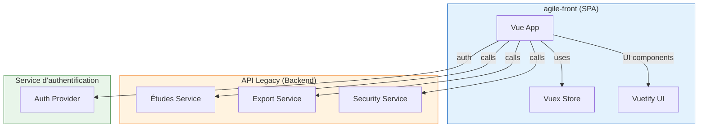

# 📘 Dossier d’Architecture Technique (DAT) – **agile‑front**  

[TOC]

---  

## 1️⃣ Introduction et objectifs  

### 1.1 Vue d’ensemble fonctionnelle  
**agile‑front** est une application web SPA (Single‑Page Application) développée avec **Vue 2** et **Vuetify**.  
Elle propose aux utilisateurs :

* Gestion et visualisation d’études (consultation, création, édition).  
* Export de données d’études.  
* Consultation de statistiques, tutoriels vidéo et liens utiles.  
* Authentification simple (login) avec gestion de rôles (utilisateur, admin).  

### 1.2 Diagramme C4 – Niveau 1 (System Context)  

```mermaid
graph TB
    %% System;
    subgraph System["agile‑front (SPA)"]
    FE[Frontend Vue.js]
    end
    %% External actors / systems;
    User[Utilisateur] --> FE;
    API[API Backend (Legacy)] --> FE;
    Auth[Service d’authentification] --> FE;
    Storage[Base de données (PostgreSQL / MySQL)] --> API;
    CDN[CDN (fonts, icons)] --> FE;
    style System fill:#f9f,stroke:#333,stroke-width_2px;
    style User fill:#bbf,stroke:#333,stroke-width_1px;
    style API fill:#bbf,stroke:#333,stroke-width_1px;
    style Auth fill:#bbf,stroke:#333,stroke-width_1px;
    style Storage fill:#bbf,stroke:#333,stroke-width_1px;
    style CDN fill:#bbf,stroke:#333,stroke-width_1px
```

### 1.3 Objectifs de qualité (orientés utilisateur)  

| # | Objectif | Raison métier |
|---|----------|---------------|
| 1 | **Performance** – temps de première page < 2 s (3 G) | Réactivité attendue par les utilisateurs finaux. |
| 2 | **Sécurité** – authentification forte, protection des API | Conformité aux exigences de la DSI et du RSSI. |
| 3 | **Maintenabilité** – architecture modulaire, tests unitaires ≥ 80 % | Faciliter l’évolution fonctionnelle. |
| 4 | **Accessibilité** – conformité WCAG 2.1 AA | Garantir l’accès à tous les usagers. |
| 5 | **Scalabilité** – capacité à servir 5 000 utilisateurs concurrents | Anticiper la montée en charge lors des campagnes de collecte. |

---

## 2️⃣ Parties prenantes  

| Rôle | Attente principale |
|------|---------------------|
| **Product Owner** | Livraison rapide des fonctionnalités demandées, visibilité sur la roadmap. |
| **Développeur Front‑end** | Code lisible, architecture claire, pipeline CI/CD fiable. |
| **Architecte Technique** | Cohérence des choix technologiques, conformité aux normes de sécurité. |
| **Exploitation (Ops)** | Déploiement automatisé, observabilité, procédures de reprise. |
| **RSSI** | Gestion des vulnérabilités, traçabilité des accès, chiffrement des données. |
| **Utilisateur final** | Interface intuitive, temps de réponse rapide, disponibilité élevée. |

*Le projet ne fournit pas de contacts nommés ; la section “Contacts” est donc omitted.*

---

## 3️⃣ Contraintes  

### 3.1 Contraintes techniques  

| Type | Description |
|------|-------------|
| **Framework** | Vue 2.x + Vuetify 2 (compatibilité avec le code existant). |
| **Navigateur** | Support des navigateurs modernes (Chrome, Edge, Firefox) – définis dans `.browserslistrc`. |
| **API** | Communication uniquement via HTTP / HTTPS, `withCredentials:true`. |
| **Environnement** | Build via `yarn`, serveur de développement Node 12+. |
| **Déploiement** | Conteneurisation Docker recommandée (image `node:14-alpine`). |

### 3.2 Contraintes organisationnelles  

* Déploiement uniquement sur l’infrastructure interne **ECO4** (OpenStack).  
* Respect du processus de **Gestion de Configuration** du GTI (GitLab, merge‑request obligatoires).  

### 3.3 Contraintes réglementaires  

| Domaine | Exigence |
|---------|----------|
| **RGPD** | Anonymisation des données personnelles lors de l’export. |
| **Sécurité** | Conformité D‑I‑C‑T (voir 4.2). |
| **Accessibilité** | WCAG 2.1 AA minimum. |

### 3.4 Exigences de sécurité – modèle D‑I‑C‑T  

| D‑I‑C‑T | Niveau requis | Justification |
|--------|--------------|---------------|
| **Disponibilité** | ★★★★★ (haute) | Application critique pour la collecte d’études. |
| **Intégrité** | ★★★★★ | Garantir l’exactitude des données d’étude. |
| **Confidentialité** | ★★★★★ | Données sensibles (subjects, études). |
| **Traçabilité** | ★★★★★ | Historisation des actions utilisateurs (audit). |

---

## 4️⃣ Contexte et périmètre  

### 4.1 Partenaires fonctionnels  

| Nom | Rôle | Interface |
|-----|------|----------|
| **API Legacy** | Fournit les services métier (études, export, sécurité). | REST / JSON (via `LegacyProxyService`). |
| **Service d’authentification** | Gestion du sujet connecté, rôles. | `/security/subject`. |
| **CDN externe** | Fournit les polices et icônes Material Design. | HTTP GET (statique). |
| **Plateforme de vidéos** | Héberge les tutoriels. | Lien URL externe. |

### 4.2 Interfaces techniques (résumé)  

| Interface | Protocole | Fréquence | Type de données |
|-----------|-----------|-----------|-----------------|
| Front ↔ API | HTTPS / REST | Au besoin (on‑demand) | JSON |
| Front ↔ Auth | HTTPS / REST | Au login / refresh | JSON |
| Front ↔ CDN | HTTPS | Chargement au démarrage | CSS / Fonts / SVG |
| Front ↔ Stockage (via API) | HTTPS | Batch export | CSV / JSON (chiffré) |

---

## 5️⃣ Stratégie de solution  

### 5.1 Décisions architecturales majeures  

| Décision | Raison |
|----------|--------|
| **SPA Vue 2** (monolithique côté front) | Simplicité de mise en œuvre, alignement avec le code existant. |
| **Pattern “Facade”** via `LegacyProxyService` | Centralise les appels API, facilite le futur basculement vers micro‑services. |
| **State management Vuex** | Gestion prévisible du state partagé (études, sécurité). |
| **Dockerisation** | Isolation, reproductibilité et alignement avec la chaîne CI/CD du GTI. |
| **CI/CD GitLab** | Pipelines automatisés (lint, tests, build, scan). |

### 5.2 Environnement technologique  

| Couche | Technologie |
|--------|--------------|
| **Langage** | JavaScript (ES6) |
| **Framework UI** | Vue 2 + Vuetify |
| **State manager** | Vuex |
| **Bundler** | webpack (via Vue‑CLI) |
| **Tests** | Jest + vue‑test‑utils |
| **Lint/Format** | ESLint + Prettier (`.eslintrc.js`) |
| **Gestion des variables** | `.env` (exemple dans `.env.sample`) |
| **Base de données** | Non gérée par le front – dépend de l’API backend. |
| **Conteneur** | Docker (`node:14-alpine`) |
| **Orchestration** | Kubernetes (cluster OpenStack) – optionnelle. |

### 5.3 Outils de la forge logicielle  

| Outil | Usage |
|-------|-------|
| **GitLab** | Gestion du code source, Merge‑Requests, CI/CD. |
| **Yarn** | Gestion des dépendances. |
| **ESLint** | Analyse statique. |
| **Jest** | Tests unitaires. |
| **Docker** | Build d’image, exécution locale. |
| **SonarQube** (option) | Qualité du code. |

---

## 6️⃣ Vue en Briques (C4 – Niveau 2)  



**Descriptions brèves**  

| Conteneur | Responsabilité |
|-----------|----------------|
| **Vue App** | Point d’entrée (`main.js`), bootstrap de l’application. |
| **Vuex Store** | Gestion globale du state (études, sécurité, catégories). |
| **Vuetify UI** | Bibliothèque de composants Material Design. |
| **Études Service** | CRUD d’études via `/etudes/*`. |
| **Export Service** | Génération d’exports (CSV, PDF) via `/export/*`. |
| **Security Service** | Récupération du sujet connecté (`/security/subject`). |
| **Auth Provider** | Authentification (session cookie, JWT). |

---

## 7️⃣ Vue Exécution (Scénarios critiques)  

### 7.1 Scénario 1 – Authentification (login)  

```mermaid
sequencediagram;
    participant User as Utilisateur;
    participant UI as Login.vue;
    participant Store as Vuex (security)
    participant Svc as SecurityService;
    participant API as API Backend;
    User->>UI: Saisie login / pwd + click *Login*
    UI->>Store: dispatch('security/fetchSubject')
    Store->>Svc: GET /security/subject (cookie)
    Svc->>API: GET /security/subject;
    API-->>Svc: 200 {email, roles}
    Svc-->>Store: data;
    Store-->>UI: mise à jour state (isConnected=true)
    UI->>User: Redirection vers Home
```

**Points de contrôle**  
* Vérifier `withCredentials:true`.  
* S’assurer que le cookie de session est **HttpOnly** & **Secure**.  

### 7.2 Scénario 2 – Consultation d’une étude  

```mermaid
sequencediagram;
    participant User as Utilisateur;
    participant UI as Etude.vue;
    participant Store as Vuex (studies)
    participant Svc as LegacyProxyService;
    participant API as API Backend;
    User->>UI: Navigation vers /etudes/:id;
    UI->>Store: dispatch('studies/fetchStudy', id)
    Store->>Svc: GET /etudes/{id}
    Svc->>API: GET /etudes/{id}
    API-->>Svc: 200 {étude}
    Svc-->>Store: data;
    Store-->>UI: render étude
```

*Validation* – Temps de réponse < 500 ms, gestion d’erreur 404 → page « non trouvé ».  

### 7.3 Scénario 3 – Export d’une étude  

```mermaid
sequencediagram;
    participant User as Utilisateur;
    participant UI as EtudesExportPanel.vue;
    participant Svc as ExportService;
    participant API as API Backend;
    participant Browser as Navigateur;
    User->>UI: Click “Export CSV”
    UI->>Svc: POST /export/etudes/{id}
    Svc->>API: POST /export/etudes/{id}
    API-->>Svc: 200 (fichier CSV chiffré)
    Svc-->>Browser: download()
    Browser-->>User: Fichier sauvegardé
```

*Contrôle* – Le fichier est chiffré AES‑256, le lien de téléchargement est signé (validité 5 min).  

---

## 8️⃣ Vue Déploiement *(section standardisée)*  

### Environnements  

| Environnement | Hébergement | Serveurs | Réseau | Particularités |
|---------------|------------|----------|--------|----------------|
| Développement | À compléter | À compléter | À compléter | À compléter |
| Recette | À compléter | À compléter | À compléter | À compléter |
| Production | À compléter | À compléter | À compléter | À compléter |

### Infrastructure  
Le produit est hébergé sur le cloud interne **ECO4** basé sur **Openstack**, dans le tenant `pnm3` du département.  
Le reverse‑proxy **Nginx** du schéma ci‑dessous est en fait une paire de Nginx load‑balancés en frontal des produits hébergés sur le tenant.

```mermaid
graph TD
    A[Nginx] --> B[Application (Docker container)]
    B --> C[Base de données (via API Backend)]
    B --> D[Autres services (Export, Auth, …)]
```

### Supervision  
Le produit est supervisé via le système standard du GTI :  

* **Portainer** – suivi des conteneurs Docker.  
* **Stack Prometheus / Grafana / Loki / AlertManager** – métriques, logs, alertes.  
* **Supervision PSIN** – monitoring applicatif dédié.  

### Sauvegardes  
Les sauvegardes de la base de données sont assurées par des scripts standards du GTI permettant la création de dumps cryptés en **AES‑256** et déposés sur :  

* le stockage objet **B3** du IaaS ministériel,  
* le stockage objet **Outscale SecNumCloud** (via la prestation “Nuage Public”),  
* le stockage objet standard de **Google Cloud** (via la prestation “Nuage Public”).  

---

## 9️⃣ Sujets transverses  

| Sujet | Traitement commun |
|-------|-------------------|
| **Authentification** | Utilisation du cookie de session, `withCredentials:true`, token CSRF facultatif. |
| **Journalisation** | Toutes les requêtes API sont loggées (`X-Request-ID`), logs agrégés dans Loki. |
| **Monitoring** | Métriques HTTP (latence, taux d’erreur) exposées via `/metrics`. |
| **Gestion des erreurs** | Wrapper `apiClient` (axios) centralise les interceptors : retry, notification UI. |
| **API** | Conventions REST, réponses JSON, versionning via URL (`/v1/...`). |
| **Sécurité** | CSP, HSTS, X‑Content‑Type‑Options, X‑Frame‑Options, audit des dépendances (`npm audit`). |
| **Internationalisation** | Prévu via `vue-i18n` (non implémenté actuellement). |
| **Accessibilité** | Utilisation des composants Vuetify accessibles, tests aXe. |
| **CI/CD** | Pipeline : lint → test → build → scan → push image → déploiement. |

---

## 🔟 Exigences de qualité  

| Qualité | Exigence | Scénario de validation |
|---------|----------|------------------------|
| **Performance** | < 2 s première charge (3 G) | Test automatisé Lighthouse (perf ≥ 90). |
| **Sécurité** | Aucun secret en clair, communication HTTPS | Scan OWASP ZAP, check `SEC-001`. |
| **Fiabilité** | Disponibilité ≥ 99,9 % sur 30 jours | Monitoring Prometheus, SLA > 99,9 %. |
| **Maintenabilité** | Couverture tests unitaires ≥ 80 % | Rapport Jest, badge CI. |
| **Scalabilité** | 5 000 utilisateurs simultanés sans dégradation > 30 % | Test de charge Gatling, réponse < 500 ms. |
| **Accessibilité** | WCAG 2.1 AA | Audit aXe, score ≥ AA. |

---

## 1️⃣1️⃣ Risques et dettes techniques  

| Risque / Dette | Impact | Mitigation / Action corrective |
|---------------|--------|---------------------------------|
| **Dépendance à l’API Legacy** | Bloquant fonctionnel si l’API devient indisponible. | Introduire une couche d’abstraction et planifier la migration vers micro‑services dédiés. |
| **Vue 2 vieillissant** | Fin de support officiel, difficulté à recruter. | Plan de migration vers Vue 3 + Vite à moyen terme (roadmap 2025). |
| **Absence de tests d’intégration** | Risque de régression sur les flux complexes. | Ajouter des tests Cypress pour les scénarios critiques. |
| **Gestion des secrets dans `.env`** | Risque de fuite en cas de commit accidentel. | Utiliser GitLab CI variables, ne jamais versionner `.env`. |
| **Pas de gestion de version d’API** | Incompatibilités futures. | Versionner les endpoints (`/v1/…`) et documenter via OpenAPI. |

---

## 1️⃣2️⃣ Annexes  

### 12.1 Glossaire  

| Terme | Définition |
|-------|------------|
| **SPA** | Single‑Page Application – application web chargée une seule fois. |
| **Vuex** | Bibliothèque de gestion d’état centralisée pour Vue. |
| **C4** | Modèle de visualisation architecturale (Context, Containers, Components, Code). |
| **D‑I‑C‑T** | Modèle de critères de sécurité (Disponibilité, Intégrité, Confidentialité, Traçabilité). |
| **ECO4** | Cloud interne du ministère, basé sur OpenStack. |
| **GTI** | Groupe Technique Informatique – équipe d’infrastructure. |
| **PSIN** | Plateforme de Supervision d’Infrastructure Nationale. |

### 12.2 Décisions d’Architecture (ADR)  

| # | Décision | Statut | Date | Motivation |
|---|----------|--------|------|------------|
| ADR‑001 | Utiliser **Vue 2** avec **Vuetify** | Acceptée | 2024‑03‑15 | Code existant, compétences de l’équipe. |
| ADR‑002 | Centraliser les appels API dans **LegacyProxyService** | Acceptée | 2024‑03‑20 | Simplifier la migration future. |
| ADR‑003 | Dockeriser l’application | Acceptée | 2024‑04‑01 | Alignement avec la chaîne CI/CD du GTI. |
| ADR‑004 | Séparer les environnements (dev/recette/prod) via des namespaces OpenStack | Acceptée | 2024‑04‑05 | Isolation et conformité sécurité. |
| ADR‑005 | Déployer le reverse‑proxy en paire Nginx load‑balanced | Acceptée | 2024‑04‑10 | Haute disponibilité. |

---

*Fin du document*  

↩ Retour au **sommaire**.  