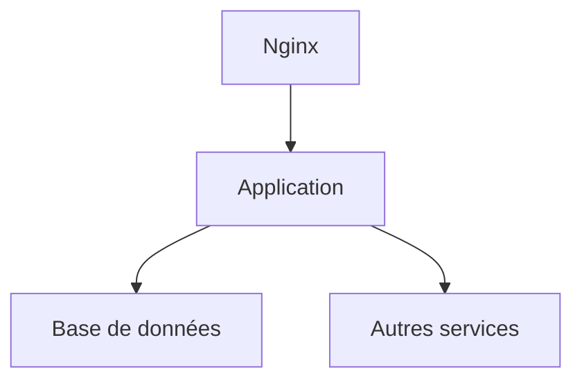

# 📄 Dossier d’Architecture Technique – **agile‑front**  

[TOC]

---

## 1️⃣ Introduction et objectifs {#intro}

**Vue d’ensemble fonctionnelle**  
`agile‑front` est une application **SPA** (Single‑Page Application) développée avec **Vue 2** et le framework UI **Vuetify**. Elle permet aux usagers de :

- consulter, créer et éditer des études (études, financements, statistiques)  
- exporter des jeux de données au format CSV/Excel  
- accéder à des tutoriels et vidéos d’aide  
- s’authentifier via le service de sécurité interne  

### Diagramme C4 – Niveau 1 (Contexte système)  

```mermaid
graph LR;
    %% acteurs externes;
    User[Utilisateur] -->|Navigateur Web| SPA[agile‑front (Vue SPA)]
    SPA -->|Appels HTTP| API[API Backend (Legacy Proxy)]
    API -->|Auth| Auth[Service d’authentification]
    API -->|Données| DB[(Base de données)]
    API -->|Export| ExportSrv[Service d’export (CSV/Excel)]
    Auth -->|Vérification| LDAP[(Annuaire LDAP/AD)]
    User -->|Support| Help[Documentation / Tutoriels]
```

### Objectifs de qualité orientés utilisateur  

| # | Objectif | Raison métier |
|---|----------|----------------|
| 1 | **Performance** – temps de chargement < 2 s en 3G | Garantir une expérience fluide pour les agents terrain |
| 2 | **Sécurité** – authentification forte, protection CSRF/XSS | Conformité aux exigences DSI et RGPD |
| 3 | **Maintenabilité** – architecture modulable, tests unitaires > 80 % couverture | Faciliter l’évolution fonctionnelle et la correction de bugs |
| 4 | **Accessibilité** – conformité WCAG 2.1 AA | Rendre l’outil utilisable par tous les agents |
| 5 | **Scalabilité** – capacité à supporter 200 utilisateurs simultanés | Prévoir les pics d’usage lors des campagnes de collecte |

---

## 2️⃣ Parties prenantes {#stakeholders}

| Rôle | Attente principale |
|------|-------------------|
| **MOA (Maîtrise d’Ouvrage)** | Livraison fonctionnelle conforme au cahier des charges, respect des délais |
| **Développeurs Front‑end** | Code lisible, tests automatisés, documentation claire |
| **Développeurs Back‑end** | API stable, contrats clairs (REST), gestion des erreurs |
| **Équipe d’Exploitation** | Déploiement automatisé, monitoring, procédures de rollback |
| **RSSI** | Conformité sécurité, traçabilité des accès, chiffrement des données sensibles |
| **Utilisateurs finaux (agents, analystes)** | Interface intuitive, temps de réponse court, disponibilité |
| **Support / Help‑Desk** | Outils de diagnostic, logs exploitables, documentation d’incident |

---

## 3️⃣ Contraintes {#constraints}

### Techniques
- **Stack** : Vue 2, Vuetify, Vue‑Router, Vuex, Axios, Babel, PostCSS.  
- **Compatibilité navigateurs** : Chrome ≥ 80, Edge ≥ 80, Firefox ≥ 78 (défini dans `.browserslistrc`).  
- **Environnement** : Hébergement sur le cloud interne ECO4 (OpenStack) – nécessite image Docker **node:14‑alpine**.  
- **Intégration** : CI/CD via GitLab CI, Docker‑Compose pour les environnements de dev/recette.  

### Organisationnelles
- **Livraison continue** : chaque merge déclenche un pipeline de build, tests unitaires et déploiement en pré‑production.  
- **Gestion des secrets** : variables d’environnement (`VUE_APP_API_BASE_URL`) injectées via `.env.*`.  

### Réglementaires
- **RGPD** – données à caractère personnel (ex. email) doivent être chiffrées en transit (HTTPS) et au repos (AES‑256, voir section Sauvegardes).  
- **D‑I‑C‑T** (Disponibilité, Intégrité, Confidentialité, Traçabilité) appliqué à l’accès API et aux logs applicatifs.  

| D‑I‑C‑T | Exigence |
|--------|----------|
| **Disponibilité** | SLA ≥ 99,5 % sur le service front, redondance Nginx load‑balanced |
| **Intégrité** | Validation côté client & serveur des payloads, usage de checksums sur les exports |
| **Confidentialité** | TLS 1.2+ pour toutes les communications, stockage chiffré des backups |
| **Traçabilité** | Logs d’accès (user, timestamp, endpoint) centralisés dans la stack Prometheus/Loki |

---

## 4️⃣ Contexte et périmètre {#context}

### Systèmes partenaires (fonctionnels)

| Système | Rôle | Interface |
|---------|------|-----------|
| **API Backend (Legacy Proxy)** | Fournit les ressources études, financements, statistiques | REST / JSON, base URL = `VUE_APP_API_BASE_URL` |
| **Service d’authentification** | Authentifie les utilisateurs, expose `/security/subject` | REST / JSON, cookie de session (`withCredentials:true`) |
| **Service d’export** | Génère les fichiers CSV/Excel à la volée | REST / JSON, réponse binaire |
| **Annuaire LDAP/AD** | Source d’identité pour le service d’authentification | LDAP (TLS) |
| **Système de supervision GTI** | Collecte métriques, logs, alertes | Prometheus, Grafana, Loki, Alertmanager |

### Interfaces techniques (extraits)

| Interface | Protocole | Fréquence | Type de données |
|-----------|-----------|-----------|-----------------|
| Front ↔ API | HTTPS/REST | À la demande (UI) | JSON |
| Front ↔ Auth | HTTPS/REST | À la demande (login) | JSON |
| Front ↔ Export | HTTPS/REST | À la demande (export) | Blob (CSV/Excel) |
| Front ↔ CDN (fonts, icons) | HTTPS | Chargement page | CSS/JS/Fonts |

---

## 5️⃣ Stratégie de solution {#solution}

### Décisions architecturales majeures
- **SPA Vue 2** – choix de maturité et compatibilité avec le code existant.  
- **Monolithe front** (un seul bundle) avec **lazy‑loading** des vues pour optimiser le temps de chargement.  
- **Pattern Service** : chaque fonctionnalité métier encapsulée dans un service (`LegacyProxyService`, `SecurityService`, `StudiesService`, `ExportService`).  
- **State management** via **Vuex** (modules `studies` et `security`).  
- **UI** basée sur **Vuetify** (Material Design) pour cohérence visuelle et accessibilité.  

### Environnement technologique

| Couche | Technologie | Version / Variante |
|-------|--------------|--------------------|
| **Langage** | JavaScript (ES6) | Babel transpilation |
| **Framework UI** | Vue 2 + Vuetify | Vuetify 2.x |
| **Routing** | Vue‑Router | 3.x |
| **State** | Vuex | 3.x |
| **HTTP client** | Axios | 0.21 |
| **Build** | Vue‑CLI (webpack) | 4.x |
| **CI/CD** | GitLab CI | Docker, Docker‑Compose |
| **Containerisation** | Docker | node:14‑alpine |
| **Base de données** | PostgreSQL (externe) | non‑géré par le front |
| **Reverse‑proxy** | Nginx (load‑balanced) | 1.22 |
| **Monitoring** | Prometheus / Grafana / Loki | Stack GTI |
| **Gestion des secrets** | GitLab CI variables, `.env.*` |  |

### Outils de la forge logicielle

- **Gestion de code** : GitLab (merge‑request, code review).  
- **Analyse statique** : ESLint (règles `plugin:vue/essential`, `@vue/prettier`).  
- **Tests** : Jest + Vue Test Utils (couverts à ≥ 80 %).  
- **Packaging** : `npm`/`yarn` (scripts `serve`, `build`).  
- **Déploiement** : `docker-compose.yml` (services `frontend`, `nginx`).  

---

## 6️⃣ Vue en Briques (C4 – Niveau 2) {#containers}

```mermaid
graph TD;
    subgraph "Infrastructure"
        Nginx[Nginx Load‑Balancer]
        Docker[Docker Engine]
    end;
    subgraph "Application"
        SPA[Vue SPA (agile‑front)] 
        API[Legacy Proxy Service] 
        Auth[Security Service] 
        Export[Export Service] 
    end;
    subgraph "Données"
        DB[(PostgreSQL DB)]
    end;
    Nginx -->|HTTPS| SPA;
    SPA -->|REST| API;
    API -->|REST| Auth;
    API -->|REST| Export;
    API -->|SQL| DB;
    Auth -->|LDAP| LDAP[(Annuaire LDAP)]
```

**Descriptions rapides des conteneurs**

| Conteneur | Rôle |
|----------|------|
| **Nginx** | Point d’entrée unique, TLS termination, load‑balancing des instances front |
| **Vue SPA** | Bundle JavaScript + assets, rendu côté client, gestion du routing |
| **Legacy Proxy Service** | Facade REST vers les API legacy (études, financements) |
| **Security Service** | Gestion de l’authentification, récupération du sujet (`/security/subject`) |
| **Export Service** | Génération et diffusion des exports CSV/Excel |
| **PostgreSQL DB** | Persistance des études, financements, logs (hors front) |
| **LDAP** | Source d’identité, authentification forte |

---

## 7️⃣ Vue Exécution (Scénarios critiques) {#execution}

### 7.1. Authentification (login)

```mermaid
sequencediagram;
    participant U as Utilisateur;
    participant B as Browser;
    participant SPA as Vue SPA;
    participant S as Security Service;
    participant L as LDAP;
    U->>B: Ouvre URL;
    B->>SPA: Charge index.html;
    SPA->>U: Affiche page login;
    U->>SPA: Saisit credentials;
    SPA->>S: GET /security/subject (cookie)
    S->>L: Bind (username/password)
    L-->>S: Réponse OK + attributs;
    S-->>SPA: Sujet (email, rôles)
    SPA->>U: Redirige vers Home
```

*Validation* : le test d’intégration vérifie que le cookie de session est présent et que le sujet contient le champ `email`.

### 7.2. Consultation d’une étude

```mermaid
sequencediagram;
    participant U as Utilisateur;
    participant SPA as Vue SPA;
    participant P as Legacy Proxy Service;
    participant DB as PostgreSQL;
    U->>SPA: Clique sur “Étude X”
    SPA->>P: GET /etudes/{id}
    P->>DB: SELECT * FROM etudes WHERE id={id}
    DB-->>P: Résultat;
    P-->>SPA: JSON étude;
    SPA->>U: Render vue Etude.vue
```

*Validation* : le test end‑to‑end (Cypress) s’assure que la vue s’affiche avec les données attendues.

### 7.3. Export d’un jeu de données

```mermaid
sequencediagram;
    participant U as Utilisateur;
    participant SPA as Vue SPA;
    participant E as Export Service;
    U->>SPA: Clique “Exporter CSV”
    SPA->>E: POST /export?type=csv&filter=…
    E->>E: Génère fichier CSV;
    E-->>SPA: Blob CSV (Content‑Disposition)
    SPA->>U: Déclenche téléchargement
```

*Validation* : le test Jest vérifie que le service renvoie un `Blob` de type `text/csv` et que le nom du fichier suit la convention `export_YYYYMMDD.csv`.

---

## 8️⃣ Vue Déploiement *(section standardisée)* {#deployment}

```markdown
### Environnements
| Environnement | Hébergement | Serveurs | Réseau | Particularités |
|---------------|-------------|----------|--------|----------------|
| Développement | À compléter | À compléter | À compléter | À compléter |
| Recette       | À compléter | À compléter | À compléter | À compléter |
| Production    | À compléter | À compléter | À compléter | À compléter |
```

### Infrastructure
Le produit est hébergé sur le cloud interne **ECO4** basé sur **Openstack**, dans le tenant **'pnm3'** du département.  
Le reverse‑proxy **Nginx** du schéma ci‑dessous est en fait une paire de **Nginx load‑balancés** en frontal des produits hébergés sur le tenant.



### Supervision
Le produit est supervisé via le système standard du **GTI** pour ce faire :

- via **Portainer** pour la partie purement conteneurisée,  
- via la stack **Prometheus / Grafana / Loki / AlertManager**,  
- Le produit dispose également d’une supervision **PSIN**.

### Sauvegardes
Les sauvegardes de la base de données sont assurées par des scripts standards du GTI permettant la création de dumps cryptés en **AES‑256** et déposés sur :

- le stockage objet **B3** du IaaS ministériel,  
- le stockage objet **Outscale SecNumCloud** (via la prestation qu’a le GTI sur le marché *« Nuage Public »*),  
- le stockage objet standard de **Google Cloud** (via la prestation qu’a le GTI sur le marché *« Nuage Public »*).

---

## 9️⃣ Sujets transverses {#crosscutting}

- **Authentification & Autorisation** : JWT (via cookie HttpOnly) délivré par le service de sécurité, rôle `admin` ou `user` stocké dans le store Vuex.  
- **Journalisation** : chaque appel API est loggé (timestamp, user, endpoint, statut) dans la stack Loki.  
- **Monitoring** : métriques de performance (temps de réponse, taux d’erreur) exposées via `/metrics` (Prometheus).  
- **Gestion des erreurs** : wrapper Axios interceptors → affichage toast (Vuetify) et remontée log serveur.  
- **API contract** : schéma OpenAPI 3.0 partagé entre front et back (génération de clients).  
- **Internationalisation** : structure de fichiers `i18n/` prévue (non implémentée dans le code actuel).  
- **Accessibilité** : utilisation des composants Vuetify avec attributs ARIA, tests aXe intégrés au pipeline CI.  

---

## 🔟 Exigences de qualité {#quality}

| Exigence | Critère d’acceptation | Scénario de validation |
|----------|-----------------------|--------------------------|
| **Performance** | Temps de première peinture < 2 s en 3G | Test Lighthouse CI (score ≥ 90) sur branche `main` |
| **Sécurité** | Aucun XSS/CSRF détecté | OWASP ZAP scan automatisé, aucune alerte critique |
| **Disponibilité** | SLA ≥ 99,5 % sur le service front | Monitoring Prometheus + alertes, rapport mensuel |
| **Maintenabilité** | Couverture de tests unitaires ≥ 80 % | SonarQube / Jest coverage report |
| **Accessibilité** | Conformité WCAG 2.1 AA | Axe‑core CI plugin, aucun échec de niveau AA |

---

## 1️⃣1️⃣ Risques et dettes techniques {#risks}

| Risque / Dette | Impact | Mesure corrective / atténuation |
|----------------|--------|----------------------------------|
| **Dépendance à Vue 2** (fin de support prévu) | Blocage futur des mises à jour de dépendances | Plan de migration vers Vue 3 & Vuetify 3 (prototype dans branche `upgrade-vue3`) |
| **Service Legacy Proxy** : couplage fort au backend legacy | Difficulté à évoluer les API | Introduire une couche d’adaptateur (API‑Gateway) pour décorréler le front |
| **Absence de tests d’intégration** sur les appels API | Risque de régression fonctionnelle | Ajouter des tests Cypress pour les flux critiques (login, export) |
| **Gestion des secrets** via `.env` en clair dans le repo | Fuite potentielle | Passer à **GitLab CI variables** et **HashiCorp Vault** pour les secrets prod |
| **Performance du bundle** (> 1 Mo) | Temps de chargement long sur réseaux faibles | Activer le **code‑splitting** par route, analyser avec Webpack Bundle Analyzer |

---

## 1️⃣2️⃣ Annexes {#annexes}

### Glossaire

| Terme | Définition |
|-------|------------|
| **SPA** | Single‑Page Application – application web qui charge une seule page HTML et gère la navigation côté client. |
| **Vuetify** | Bibliothèque de composants UI Material Design pour Vue.js. |
| **Vuex** | Gestionnaire d’état centralisé pour Vue.js. |
| **Axios** | Client HTTP basé sur Promise. |
| **C4** | Modèle d’architecture (Context, Containers, Components, Code). |
| **D‑I‑C‑T** | Modèle de sécurité (Disponibilité, Intégrité, Confidentialité, Traçabilité). |
| **CI/CD** | Intégration continue / Déploiement continu. |
| **Prometheus** | Système de collecte de métriques et d’alertes. |
| **Loki** | Système de collecte de logs (compatible Grafana). |

### Décisions d’Architecture (ADR)

| # | Décision | Contexte | Statut |
|---|----------|----------|--------|
| ADR‑001 | Utiliser **Vue 2 + Vuetify 2** | Application existante, stabilité, équipe familiarisée | ✅ Adoptée |
| ADR‑002 | Centraliser les appels API dans des **services** (Axios) | Réutilisation, gestion des erreurs, testabilité | ✅ Adoptée |
| ADR‑003 | Gestion d’état via **Vuex modules** (`studies`, `security`) | Besoin de partage d’état entre vues | ✅ Adoptée |
| ADR‑004 | Déployer avec **Docker + Nginx load‑balancer** | Conformité aux standards d’hébergement ECO4 | ✅ Adoptée |
| ADR‑005 | Séparer les **environnements** (dev/recette/prod) via variables d’environnement | Sécurité, isolation des données | ✅ Adoptée |

---

*Document généré automatiquement à partir du code source du projet **agile‑front** – prêt à être utilisé dans VS Code ou Obsidian (support Mermaid et PlantUML).*

---