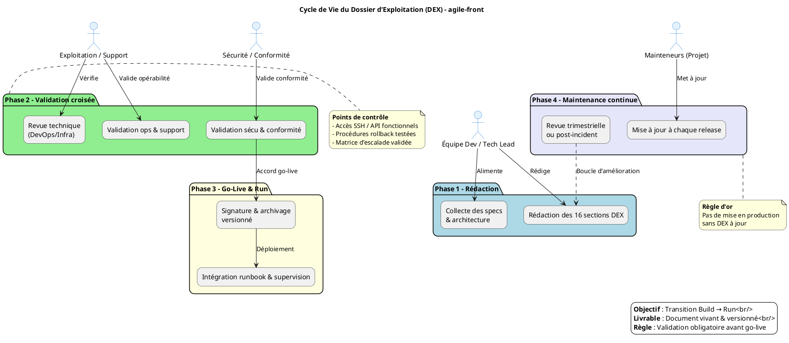
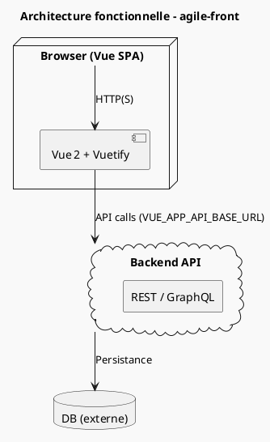

# 📘 Dossier d’Exploitation (DEX) – **agile‑front**  
*Document établi sur les principes de la transition **Build → Run** et des bonnes pratiques ITIL/DevOps pour l’exploitation applicative*  

---

[TOC]

---

## 1️⃣ Introduction et objectifs

> **Document de référence garantissant la continuité, la maintenabilité et la sécurisation de l’exploitation d’une application en production**  

### Objectifs opérationnels

| ✅ | Objectif |
|---|----------|
| ✅ | Assurer la continuité de service |
| 📖 | Documenter les procédures de gestion courante |
| 🛠 | Faciliter le support et la résolution d’incidents |
| 🤝 | Encadrer les responsabilités (Dev / Ops / Support) |
| 🛡 | Assurer la conformité et la maîtrise des risques |
| 🔄 | Accompagner la phase de transition **Build → Run** |

---

## 2️⃣ Contexte d’usage et périmètre

| Élément | Valeur |
|---------|--------|
| **Nom de l’application** | **agile‑front** |
| **Chemin source** | `G:\WarchoLife\WarchoDevplace\Gitlab_Applications\ambulon\workplace-ambulon\gitlab\agile-front` |
| **Type de livrable** | Standard ✅ |
| **Nature** | Document de référence 📘 |
| **Activité** | Transition **Build → Run** / Exploitation |
| **Environnement cible** | Production Web (serveur HTTP / reverse‑proxy) – [à préciser] |
| **Stack technique** | Vue 2 + Vuetify, Node 12+, Yarn, Babel, PostCSS, ESLint, Git |
| **SLA / SLO** | 📈 **[SLA cible, ex. 99,5 % disponibilité]** – à valider avec le métier |
| **Quand l’utiliser** | - Avant le go‑live <br> - Pour la formation des équipes d’exploitation <br> - Lors des audits PRA/PCA, conformité, revue de sécurité |
| **Cycle de vie du DEX** | Document vivant – mise à jour à chaque évolution fonctionnelle, technique ou d’infrastructure |

> ⏱ **Jalon critique** : le DEX doit être **validé et signé** avant tout déploiement en production. Aucun go‑live ne doit intervenir sans DEX approuvé.

---

## 3️⃣ Pré‑requis et jalons

- [ ] Architecture technique validée et schémas à jour  
- [ ] Environnement de production stabilisé (accès réseau, DNS, certificats)  
- [ ] Politiques définies : sauvegarde, supervision, sécurité, SLA  
- [ ] Contacts clés identifiés (métiers, techniques, support, sécurité) – **[liste à compléter]**  
- [ ] Outillage prêt : monitoring (Grafana/Prometheus ou équivalent), logging (ELK / Loki), ordonnanceur (cron), gestion des secrets (Vault / .env)  

---

## 4️⃣ Gouvernance et rôles

| Rôle | Profil type | Responsabilité |
|------|--------------|----------------|
| **Rédacteur principal** | Tech Lead / DevOps / Référent Prod | Rédaction, structuration, intégration des specs techniques |
| **Validateur Exploitation** | Chef d’exploitation / Responsable support | Vérification de l’opérabilité et de la complétude |
| **Validateur Sécurité/Conformité** | RSSI / DPO / Auditeur interne | Validation des procédures de sécurité, backup, conformité |
| **Mainteneur** | Équipe projet / PO technique | Mise à jour continue à chaque release ou changement d’infra |

---

## 5️⃣ Structure détaillée du DEX (16 sections standards)

| N° | Section | Contenu attendu (exemples) |
|---:|---------|----------------------------|
| 1 | **Généralités** | Objet, domaine d’application, audience cible, version du document |
| 2 | **Documents de référence** | Chartes internes, architecture, politiques sécurité |
| 3 | **Terminologie** | Glossaire (SLA, SLO, PRA, Runbook, IAM, CI/CD…) |
| 4 | **Spécificités** | Fonctionnalités critiques, SLA/SLO, contacts clés, matrice d’escalade |
| 5 | **Architecture** | Schémas logiques/physiques, flux de données, infra prod, PRA/PCA |
| 6 | **Serveurs** | Accès (SSH/RDP), OS, CPU/RAM/Stockage, DNS/IP – **[détails serveur web]** |
| 7 | **Application** | Composants Vue, versions (Vue 2, Vuetify 2), paramètres, procédure de déploiement |
| 8 | **Supervision & métriques** | Outils (Grafana, Prometheus, Sentry), seuils d’alerte, dashboards |
| 9 | **Sauvegarde** | Fréquence, rétention, localisation (ex. S3, NAS), procédure de restauration |
| 10 | **Stockage** | Volumes statiques, chemins (`public/`, `dist/`), gestion des logs |
| 11 | **Bases de données** | **[non applicable – front‑only]** – mentionner les dépendances externes (API) |
| 12 | **Flux inter‑applicatifs** | API backend (`VUE_APP_API_BASE_URL`), protocoles, ports, authentification |
| 13 | **Plan de production** | Tâches planifiées (build, déploiement, purge cache), fenêtres de maintenance |
| 14 | **Sécurisation des images** | Scan de vulnérabilités (npm audit, Snyk), hardening, gestion des secrets |
| 15 | **Opérations courantes** | Checklist quotidienne (vérif. health endpoint, logs, monitoring) |
| 16 | **Opérations récurrentes** | Rotation des certificats, nettoyage des assets, audits périodiques |

> 💡 **Adaptation** : Supprimez ou fusionnez les sections non pertinentes (ex. Bases de données) et ajoutez des sections spécifiques (ex. Serverless) si besoin.

---

## 6️⃣ Diagramme PlantUML du cycle de vie DEX (adapté à *agile‑front*)



---

## 7️⃣ Conseils de rédaction et maintenance

| Bonne pratique | À éviter |
|---------------|----------|
| Utiliser un dépôt versionné (Git) avec historisation | Stocker le DEX en pièce jointe email ou sur un partage non versionné |
| Rédiger en langage clair, orienté action et procédure | Rédiger des descriptions vagues ou purement théoriques |
| Inclure captures d’écran, chemins exacts, commandes | Laisser des placeholders `[À COMPLÉTER]` en production |
| Prévoir une revue systématique à chaque release majeure | Considérer le DEX comme “jetable” après le go‑live |
| Lier le DEX aux runbooks, tickets d’incident et procédures PRA | Isoler le DEX des outils de supervision et de ticketing |

---

## 8️⃣ Adaptations contextuelles (exemples)

| Contexte | Adaptation recommandée |
|----------|------------------------|
| **Application Cloud / Serverless** | Remplacer la section *Serveurs* par *Services managés, IAM, Config as Code, Limits/Quotas* |
| **Secteur réglementé (Santé, Finance)** | Renforcer les sections Sécurité, Traçabilité, Archivage légal, Conformité RGAA/ANSSI |
| **Legacy / Monolithe** | Insister sur la dépendance OS, les patches, la compatibilité, les procédures de reprise manuelle |
| **Microservices / Kubernetes** | Remplacer *Inventaire BDD/Serveurs* par *Clusters, Namespaces, Helm/Manifests, Observabilité (Prometheus/Grafana/Loki)* |

---

## 9️⃣ Livrables et intégration

| Livrable | Description |
|----------|-------------|
| **DEX versionné** | Fichier `.md` (ou export PDF) stocké dans le repo `docs/DEX/agile-front.md` |
| **Checklist de validation** | Document signé par Dev, Ops, Sec – **[à créer]** |
| **Matrice de traçabilité** | DEX ↔ Architecture ↔ Runbooks ↔ Tickets support – **[à alimenter]** |
| **Intégration CI/CD** | - Vérifier la présence du DEX dans le pipeline (`npm run lint && check-dex.sh`) <br> - Lier le DEX aux dashboards de monitoring (lien dans Grafana) |
| **Automatisation partielle** | Générer les sections *Architecture* et *Inventaire* depuis Terraform/Ansible via scripts `generate-dex.sh` |

---

## 🔧 Annexes (exemples de contenu)

### 5.1 Architecture simplifiée (PlantUML)



### 5.2 Exemple de checklist quotidienne (Ops)

```markdown
- [ ] Vérifier le health‑endpoint `/healthz` (code 200)  
- [ ] Contrôler le taux d’erreur 5xx < 1 % (Grafana)  
- [ ] Analyser les logs d’erreurs (`/var/log/nginx/*.log`)  
- [ ] S’assurer que le job de build CI a terminé avec succès la veille  
- [ ] Confirmer le renouvellement du certificat TLS (letsencrypt) – expiry > 30 jours  
```

---

## 📎 Personnalisation rapide (≤ 5 min)

Remplacez les champs entre **[crochets]** par les valeurs réelles de votre projet :

| Champ | Exemple de remplacement |
|------|------------------------|
| **[SLA cible]** | `99,9 % (MTTR ≤ 30 min)` |
| **[Contacts]** | `Prod‑Owner : Jean Dupont (j.dupont@example.com)` |
| **[Serveur web]** | `nginx 1.22 sur Ubuntu 20.04, IP = 10.0.0.12` |
| **[Backup policy]** | `Daily incremental → 7 jours, Weekly full → 4 semaines, stockage S3` |
| **[Nom du répertoire de prod]** | `/var/www/agile-front` |
| **[Matrice d’escalade]** | `N1 → Ops (8 h‑18 h) – N2 → On‑call (24/7)` |

---

### 📌 Fin du document

> **Ce DEX doit être revu, signé et stocké dans le dépôt de code source**. Toute modification doit suivre le processus de contrôle de version et être référencée dans les tickets de changement.  

---  