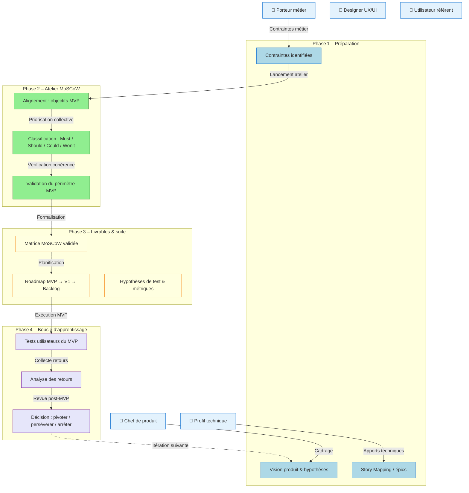

# 📘 Guide d’atelier : Définition du MVP (Produit Minimum Viable) – Méthode MoSCoW  
**Produit** : **agile‑front**  
**Document établi à partir des principes du MVP (Lean Startup) et de la méthode de priorisation MoSCoW**  

---  

[TOC]

---  

## 1️⃣ Introduction et objectifs  

> **Objectif global** : *« Définir collectivement le périmètre du Produit Minimum Viable pour tester les hypothèses produit avec un effort maîtrisé »*  

**Méthodologie** : MVP (Lean Startup) + priorisation **MoSCoW** (Must / Should / Could / Won’t).  

### Objectifs opérationnels  

| 🎯 | Description |
|---|---|
| **Clarifier la mission du MVP** | Qu’apprend‑on ? Quelle hypothèse teste‑on ? |
| **Identifier les fonctionnalités indispensables vs. reportables** | Classification MoSCoW appliquée aux items fonctionnels. |
| **Aligner équipes** | Produit, métier et technique s’accordent sur un périmètre réaliste. |
| **Livrer vite, apprendre, itérer** | Éviter l’effet tunnel ; passer rapidement à la phase d’expérimentation. |
| **Poser les bases de la roadmap post‑MVP** | Définir les suites « Should », « Could », « Won’t ». |

> ⚠️ **Rappel critique** – Le MVP n’est pas une V1 allégée. Il peut se résumer à *un seul parcours utilisateur* avec des contournements (ex. : données factices, saisie manuelle) acceptables tant que l’hypothèse est testable.  

---  

## 2️⃣ Contexte d’usage et positionnement  

| Élément | Détails |
|---|---|
| **Type de livrable** | Standard ✅ |
| **Nature** | Atelier 🤝 « Imaginer une solution » |
| **Quand l’utiliser** | <ul><li>Après la recherche utilisateur & la formalisation de la vision produit</li><li>Après un premier story‑mapping (ou cartographie fonctionnelle)</li><li>Avant le lancement du développement du premier incrément</li></ul> |
| **Cas d’usage typiques** | <ul><li>Lancement d’un nouveau produit digital (ex. : tableau de bord d’études)</li><li>Refonte d’un service existant (ex. : interface d’export)</li><li>Test d’une innovation à fort risque (ex. : nouvelle authentification)</li><li>Réduction de scope pour respecter une contrainte de délai/budget</li></ul> |

---  

## 3️⃣ Pré‑requis indispensables  

> ✅ **À préparer *avant* l’atelier** (les artefacts peuvent être fournis par les participants)  

- [ ] **Vision produit formalisée** – pitch, objectifs métier, métriques de succès.  
- [ ] **Hypothèses à tester** – liste claire des paris produit à valider / invalider.  
- [ ] **Story Mapping** (ou liste d’épics/user‑stories) – parcours utilisateur + fonctionnalités associées.  
- [ ] **Personas & retours utilisateurs** – verbatims, enquêtes, synthèses.  
- [ ] **Contraintes identifiées** – techniques (Vue 2/3, Vuetify, API REST), réglementaires, budgétaires, délais.  

> 💡 *Si un pré‑requis manque, prévoir 20 min en début d’atelier pour le co‑construire rapidement (ex. : reformuler la vision en 1 slide).*  

---  

## 4️⃣ Parties prenantes et rôles  

| Rôle | Profil type | Responsabilité dans l’atelier |
|------|-------------|------------------------------|
| **Animateur** | Chef de produit / Product Owner | Cadrer, faciliter, garder le cap « apprentissage » |
| **Profil technique** | Tech Lead / Architecte | Évaluer faisabilité, effort, dépendances techniques |
| **Porteur métier** | MOA / Responsable métier | Valider pertinence fonctionnelle & valeur utilisateur |
| **Designer UX/UI** *(optionnel)* | Designer produit | Proposer des alternatives légères, valider l’expérience minimale |
| **Utilisateur référent** *(optionnel)* | Personne cible du produit (ex. : analyste études) | Apporter le regard « usage réel », challenger les priorités |

> ☝️ *Un même participant peut cumuler plusieurs rôles selon les ressources disponibles.*  

---  

## 5️⃣ Logistique de l’atelier  

| Élément | Détails |
|---|---|
| **Durée** | 2 h 30 – 4 h (prévoir une pause à 1 h 30 si > 3 h) |
| **Matériel physique** | Tableau blanc, post‑its 4 couleurs (Must / Should / Could / Won’t), marqueurs, ruban de masquage |
| **Matériel digital** | Outil collaboratif (Miro, FigJam, Mural, Klaxoon…) avec template MoSCoW pré‑préparé |
| **Livrable de sortie** | Périmètre MVP validé, matrice MoSCoW, roadmap initiale, hypothèses de test & métriques de succès |

---  

## 6️⃣ Déroulé détaillé de l’atelier  

### 🎯 Étape 1 – Introduction & alignement (15 min)  

1. Présenter les objectifs du MVP : *« Qu’apprenons‑nous ? Que testons‑nous ? »*  
2. Rappeler le contexte du projet **agile‑front** (personas, hypothèses, contraintes).  
3. Expliquer la méthode **MoSCoW** (voir tableau ci‑dessous).  

| Catégorie | Définition | Critère de décision |
|-----------|------------|---------------------|
| **M**ust Have | Indispensable pour que le MVP soit viable | Sans cela le produit est inutile / l’hypothèse non testable |
| **S**hould Have | Important mais non critique pour le MVP | Valeur ajoutée significative, mais reportable sans bloquer |
| **C**ould Have | Optionnel, « nice to have » | Améliore l’expérience mais n’impacte pas l’apprentissage |
| **W**on’t Have | Exclu du MVP (pour l’instant) | Trop coûteux, hors scope, ou non prioritaire pour l’apprentissage |

> ✅ **Mini‑exercice** : reformuler la mission du MVP en 1 phrase. Exemple :  
> *« Avec ce MVP, nous voulons vérifier que les utilisateurs peuvent créer et exporter une étude en moins de 5 min, afin de valider l’hypothèse d’adoption du module d’export ». *

---

### 🔍 Étape 2 – Rappel du périmètre fonctionnel (30 min)  

| Action | Détails |
|---|---|
| **Afficher le Story Map / liste d’épics** | Utiliser la cartographie existante (ex. : `src/views/*`, `src/components/*`, `src/services/*`). |
| **Pour chaque étape du parcours** | • Besoin utilisateur (ex. : se connecter, consulter la liste des études, exporter les données)  • Hypothèse produit associée (ex. : l’export augmente la satisfaction)  • Contraintes connues (ex. : API REST sécurisée, Vuetify). |
| **Regrouper / éliminer les doublons** | Simplifier la vue d’ensemble avant la priorisation. |

*Exemples de fonctionnalités extraites du code*  

| Fonctionnalité | Source | Description courte |
|---|---|---|
| **Login** | `src/views/Login.vue` | Authentification simple (username / password). |
| **Liste des études** | `src/views/Etude.vue` + `src/views/EtudesList.vue` | Affichage paginé des études. |
| **Création / édition d’étude** | `src/views/EtudeNew.vue`, `src/views/EtudeEdit.vue` | Formulaires de création & modification. |
| **Export des études** | `src/components/EtudesExportPanel.vue`, `src/services/ExportService.js` | Export CSV / PDF via API. |
| **Tutoriels vidéo** | `src/views/Tutoriels.vue` | Accès à vidéos d’aide. |
| **Filtrage avancé** | `src/mixins/filterUtilMixin.js` | Sélection d’années, filtres dynamiques. |
| **Gestion de la sécurité** | `src/services/SecurityService.js`, `src/store/modules/security.js` | Récupération du sujet connecté, droits admin. |

---

### 🎚️ Étape 3 – Classification MoSCoW (60‑90 min)  

1. **Présenter chaque fonctionnalité** (ou groupe d’épics) une à une.  
2. **Discussion guidée** (questions à poser) :  

   - *Le MVP peut‑il fonctionner sans cette fonctionnalité ?*  
   - *Quel impact sur l’apprentissage si on la retire ?*  
   - *Quel est l’effort technique / délai pour la livrer ?*  
   - *Existe‑t‑il un contournement simple (ex. : données factices, saisie manuelle) ?*  

3. **Vote ou consensus**  

   - **Option A – Dot Voting** : chaque participant reçoit 3 votes à placer sur les items qu’il estime *Must Have*.  
   - **Option B – Débat structuré** : un champion propose une catégorie, les autres valident / challengent.  

4. **Placement** : déposer le post‑it (ou le sticky digital) dans la colonne correspondante.  

> 💡 **Règle d’or** : le nombre de *Must Have* doit rester très limité (souvent 3‑5 items) ; sinon le périmètre n’est plus un MVP.  

---

### ✅ Étape 4 – Validation du périmètre MVP (30 min)  

Utiliser la **check‑list de validation** suivante :  

- [ ] Le périmètre MVP permet de tester **au moins une hypothèse** clairement définie.  
- [ ] Un utilisateur peut accomplir **un parcours complet** (ex. : se connecter → créer une étude → l’exporter).  
- [ ] Les **contournements acceptés** sont identifiés (ex. : export manuel si l’API n’est pas prête).  
- [ ] L’effort estimé est **compatible avec le délai cible** (ex. : 2 sprints).  
- [ ] Les **métriques de succès** sont définies (ex. : taux d’export, temps de création < 5 min).  

**Si le périmètre est trop large** → re‑examiner les *Must Have* et reporter les *Should / Could*.  
**Si le périmètre est trop léger** → vérifier qu’aucune hypothèse critique n’est oubliée.  

---

### 🗺️ Étape 5 – Roadmap & prochaines étapes (15‑30 min)  

| Action | Détails |
|---|---|
| **Documenter les décisions** | • Liste finale des *Must Have* (périmètre MVP)  • Justifications (pour traçabilité)  • Hypothèses de test associées |
| **Ébaucher la roadmap** | • **MVP** – livrable & date cible  • **V1** – intégration des *Should Have* prioritaires  • **Backlog** – *Could* & idées futures |
| **Définir le suivi** | • Responsable du test utilisateur (ex. : PO ou UX)  • Méthode de collecte des retours (analytics, interviews)  • Date de revue post‑MVP (ex. : 2 semaines après le lancement) |
| **Action immédiate** | Partager la matrice MoSCoW et la roadmap brouillon **dans les 24 h** pour validation écrite. |

---  

## 7️⃣ Conseils de facilitation  

| Bonnes pratiques | À éviter |
|---|---|
| Ancrer chaque décision dans une **hypothèse à tester** | Prioriser par préférence personnelle ou « on a toujours fait comme ça » |
| Challenger systématiquement les *Must Have* : *« Et si on l’enlevait ? »* | Accepter un MVP trop large par peur de décevoir |
| Proposer des **contournements légers** (manuel, data factice) pour réduire le scope | Confondre *faisabilité technique* et *nécessité d’apprentissage* |
| Faire participer activement les profils **métier & utilisateur** | Laisser un seul profil (tech ou métier) dominer les arbitrages |
| Documenter les *Won’t Have* avec leurs raisons (pour éviter les re‑demandes) | Oublier la revue post‑MVP et les critères de succès |

---  

## 8️⃣ Alternative : MVP par scénario utilisateur  

Lorsque la méthode MoSCoW ne suffit pas à réduire le scope, privilégier un **scénario utilisateur complet** :  

| Critère de sélection du scénario MVP | Exemple concret (agile‑front) |
|---|---|
| **Parcours complet mais borné** | *Créer une étude puis l’exporter* ; le traitement back‑office reste manuel. |
| **Forte innovation à tester** | *Nouvelle interface d’export* ; on teste l’ergonomie avant l’intégration API. |
| **Simplicité de mise en œuvre** | *Login + affichage liste études* ; aucune dépendance externe lourde. |
| **Valeur d’apprentissage maximale** | *Export* → hypothèse : l’export augmente le taux de ré‑utilisation des études. |

> 💡 **Formulation du scénario MVP** (exemple) :  
> *« En tant qu’**analyste** (persona), je veux **créer une étude** puis **l’exporter en CSV**, afin de vérifier que l’export améliore ma productivité, même si le fichier est généré via un script manuel côté serveur. »*  

---  

## 9️⃣ Diagramme Mermaid du processus de définition du MVP  

---  

## 10️⃣ Adaptations contextuelles  

| Contexte | Adaptation recommandée |
|---|---|
| **Refonte d’un produit existant** | Partir des points de friction (ex. : lenteur de l’export) pour identifier les *Must Have* qui résolvent les blocages majeurs. |
| **Produit fortement réglementé** | Intégrer les exigences légales comme *Must Have* uniquement si elles bloquent l’hypothèse ; sinon prévoir des **contournements documentés**. |
| **Multi‑personas utilisateurs** | Définir un MVP par persona prioritaire (ex. : analyste) ou un **parcours transversal** minimal qui couvre les besoins communs. |
| **Contraintes de délai très court** | Cibler **un seul scénario complet** (ex. : login + création d’étude) et accepter des **contournements manuels** en back‑office. |
| **Innovation à fort risque** | Prioriser les fonctions qui valident **l’hypothèse la plus incertaine** (ex. : export CSV) même si le parcours est partiel. |

---  

## 11️⃣ Livrables et intégration continue  

| Livrable | Description |
|---|---|
| **Matrice MoSCoW validée** | Tableau des items classés *Must / Should / Could / Won’t* avec justification. |
| **Périmètre MVP** | Liste des *Must Have* + contournements acceptés. |
| **Roadmap initiale** | MVP → V1 → itérations suivantes (chronologie, responsables). |
| **Hypothèses de test & métriques** | KPIs à suivre (ex. : taux d’export, temps de création, NPS). |
| **Backlog produit structuré** | Epics → User Stories taggés MoSCoW. |
| **Plan de test utilisateur du MVP** | Recrutement, scénarios, collecte & analyse. |
| **Template de revue post‑MVP** | Critères de décision (pivot / persévérer / arrêter). |

### Prochaines étapes suggérées (post‑atelier)  

1. **Rédiger les user stories MVP** avec critères d’acceptation.  
2. **Maquetter les écrans clés** (login, création d’étude, export).  
3. **Estimer techniquement** (story points / t‑shirts) et planifier les sprints.  
4. **Préparer le protocole de test** (recrutement utilisateurs, outils d’analytics).  

---  

## 📚 Mini‑glossaire  

| Acronyme / Terme | Définition |
|---|---|
| **MVP** | Produit Minimum Viable – version la plus petite permettant de tester une hypothèse. |
| **MoSCoW** | Méthode de priorisation : Must, Should, Could, Won’t. |
| **Epic** | Grande fonctionnalité découpée en plusieurs user stories. |
| **User Story** | Description fonctionnelle du point de vue de l’utilisateur. |
| **Pivot** | Changement de direction basé sur les apprentissages du MVP. |
| **Story Mapping** | Technique de Jeff Patton pour visualiser le parcours utilisateur et les fonctionnalités associées. |
| **UX** | Expérience utilisateur. |
| **API** | Interface de programmation applicative (ici REST). |
| **Vuetify** | Framework UI Material Design pour Vue.js. |

---  

## 🔚 Conclusion  

Cet atelier vous fournit une **méthode structurée** pour définir un MVP réaliste, **aligner les parties prenantes** et **mettre en place la première boucle d’apprentissage** du produit **agile‑front**. En suivant le déroulé, vous obtiendrez un périmètre clairement priorisé, une roadmap exploitable et des métriques prêtes à mesurer le succès de votre première expérimentation.  

> **Bonne facilitation !**   🚀  